# 课程 P16：第12讲：RISC-V 指令格式 II 🧩

在本节课中，我们将深入学习 RISC-V 指令格式，特别是 S 格式、B 格式、J 格式和 U 格式。我们将探讨这些格式如何编码分支、跳转和长立即数操作，并理解程序计数器（PC）在这些指令执行过程中的关键作用。

---

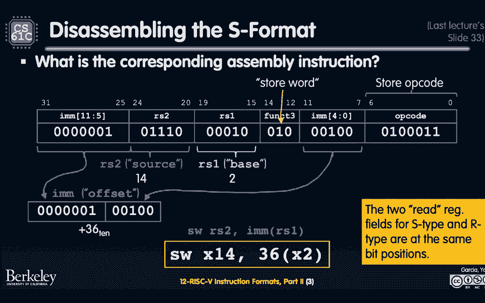

## 回顾与引入：S 格式指令示例

上一节我们介绍了 RISC-V 的基本指令格式。本节中，我们通过一个 S 格式指令的例子来巩固理解。

S 格式指令用于存储操作，例如 `sw`（存储字）。这类指令读取两个源寄存器（一个存数据，一个存基地址），并将数据写入内存，因此没有目的寄存器字段。

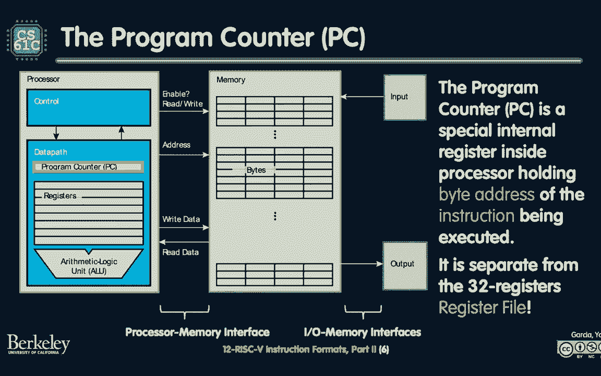

以下是一个机器代码示例，我们需要将其反汇编为汇编指令。

**操作过程如下：**
1.  **识别操作码**：前7位 `1100011` 对应 S 格式的 `sw` 指令。
2.  **解析寄存器**：
    *   `rs1`（基地址寄存器）字段：对应寄存器 `x2`。
    *   `rs2`（数据寄存器）字段：对应寄存器 `x14`。
3.  **解析立即数**：S 格式的12位立即数被拆分存放。我们需要将高位部分（`imm[11:5]`）和低位部分（`imm[4:0]`）拼接起来，得到一个有符号整数 `36`。

最终，这条指令的汇编形式是：`sw x14, 36(x2)`。其含义是将寄存器 `x14` 中的数据存储到内存地址 `x2 + 36` 处。

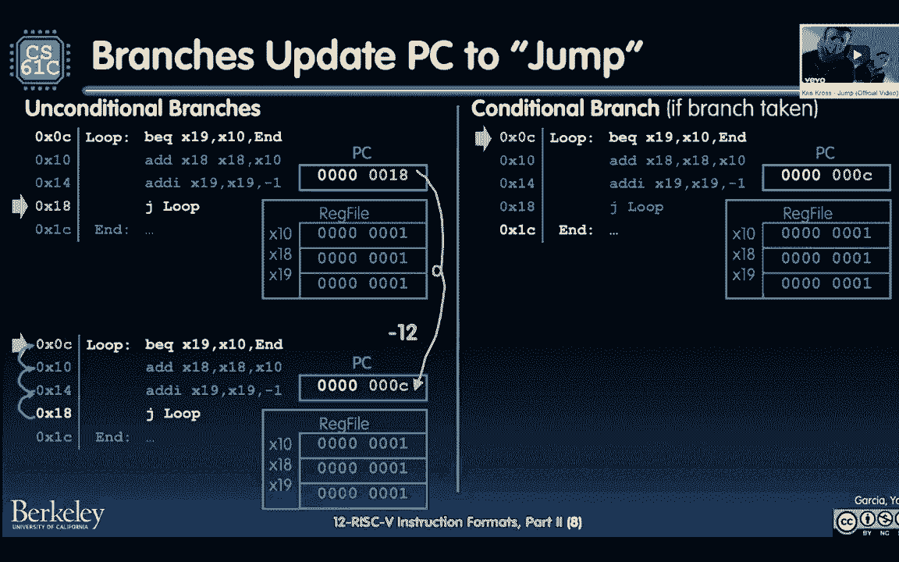

---

## 程序计数器（PC）与指令执行流程 🗓️

在深入其他指令格式前，我们需要理解一个核心概念：程序计数器。

程序计数器是一个特殊的32位寄存器，它存储着**下一条将要执行指令的地址**。你可以把它想象成一个“日程表”，总是告诉你CPU下一步要做什么。

**PC 如何工作？**
*   对于绝大多数指令（如算术、逻辑指令），执行完毕后，PC 会自动增加 **4 个字节**（即一条指令的长度），指向内存中的下一条指令。
*   对于**分支**和**跳转**指令，它们会以不同的方式更新 PC，使其指向一个新的、非顺序的地址，从而实现程序流的改变。

---

## B 格式：条件分支指令 🔀

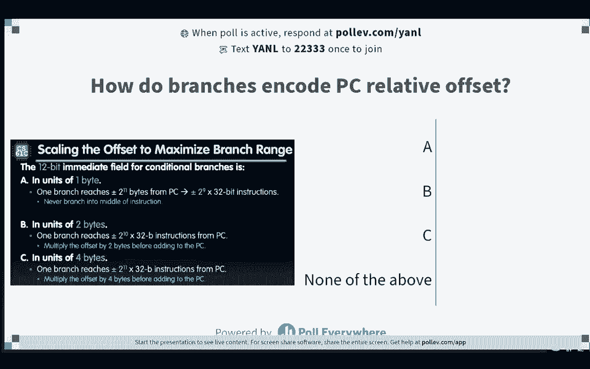

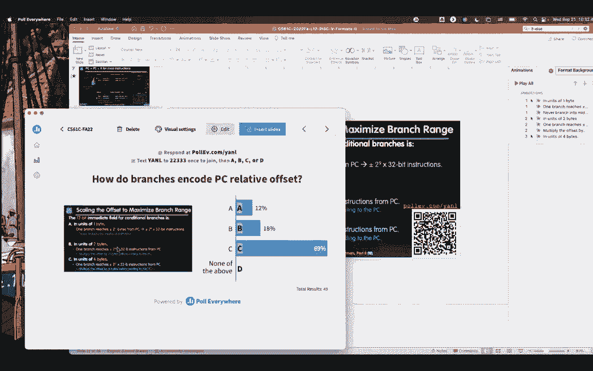

本节我们来看看如何实现条件分支。B 格式指令用于条件分支，例如 `beq`（相等时分支）。

B 格式指令的核心思想是 **PC 相对寻址**。它存储的不是要跳转的绝对地址，而是相对于当前 PC 的**偏移量**。这样做有两个好处：一是生成的代码是位置无关的；二是可以用较少的比特数表示跳转目标。

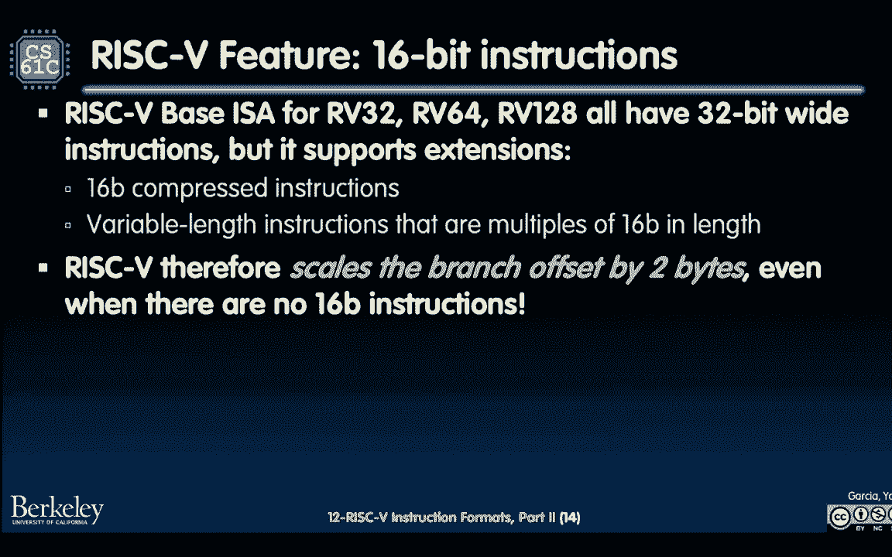

一条 B 格式指令（如 `beq rs1, rs2, label`）需要编码以下信息：
*   两个要比较的源寄存器（`rs1`, `rs2`）。
*   一个条件码（`funct3`），指定是 `beq`、`bne` 等。
*   一个12位的**有符号立即数**，表示跳转偏移量。

**关键问题：偏移量的单位是什么？**
我们有12位来表示偏移量。如果单位是字节，我们只能跳转 ±2^11 字节。但 RISC-V 指令设计得很巧妙：

**偏移量的单位是“半指令”（2字节）**。因为指令地址总是4字节对齐的，其最低两位总是0。通过以2字节为单位，12位偏移量实际能表示的字节范围是 ±2^12 字节，相当于能跳转 **±2^10 条指令**的距离，这更符合常见循环和条件分支的需求。

B 格式指令的立即数字段在指令中的排列方式比较特殊（位[12|10:5|4:1|11]），这是为了在硬件层面与其他格式的立即数字段共享布线，优化电路设计。

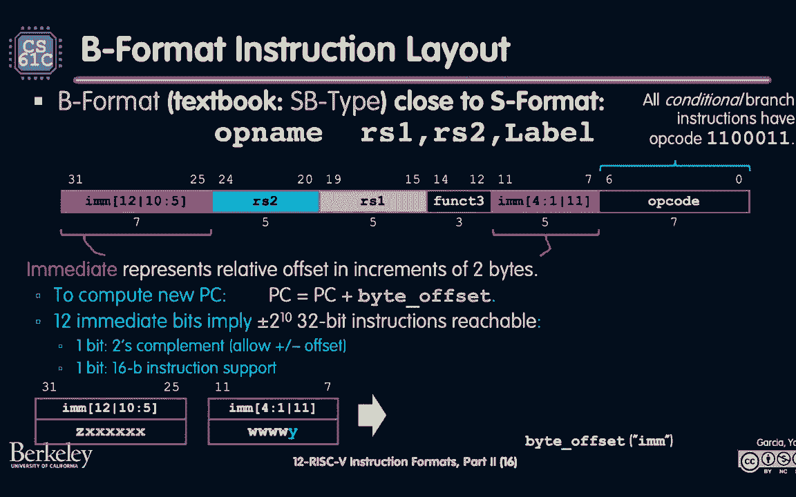

**示例：解析 `beq x19, x10, label`**
假设 `label` 在当前指令前方16字节处。
1.  计算字节偏移量：`+16`。
2.  转换为半指令单位：`16 / 2 = 8`。
3.  将 `8` 编码到 B 格式指令的立即数字段中。

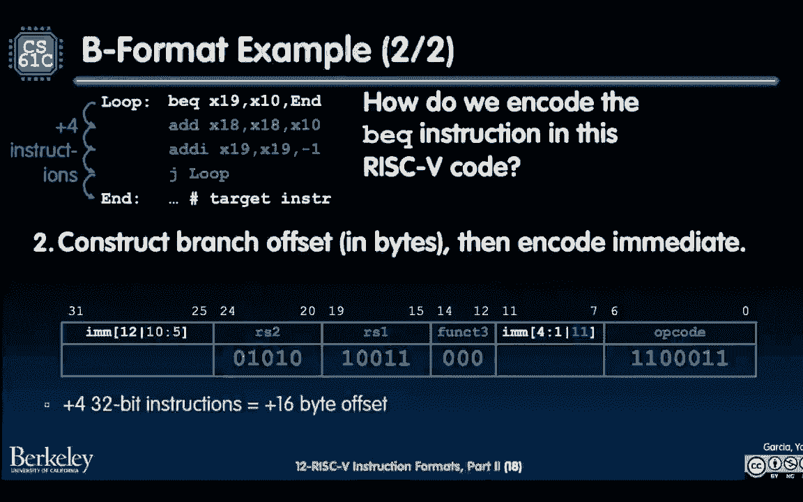

---

## J 格式与 U 格式：长跳转与加载大立即数 🚀

当需要跳转的距离超过 B 格式的范围时，或者需要操作大的常数时，我们就需要 J 格式和 U 格式。

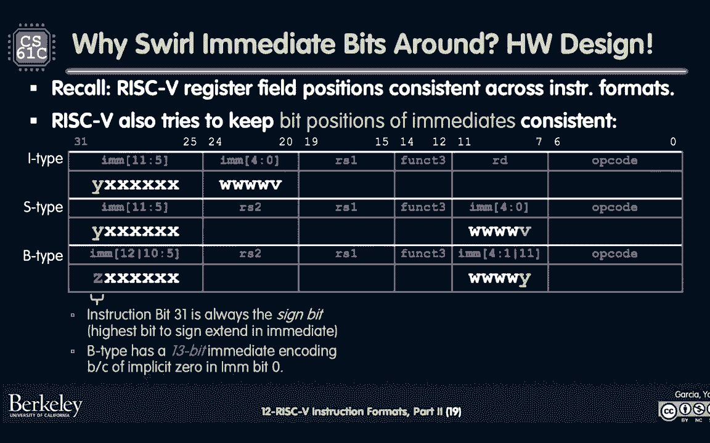

### J 格式：长距离无条件跳转
J 格式指令（如 `jal`，跳转并链接）用于函数调用或长距离跳转。它的特点是有一个 **20 位的有符号立即数字段**，单位同样是“半指令”。这使得跳转范围达到了惊人的 ±2^19 条指令（±1 MiB 地址空间）。

`jal rd, label` 指令做两件事：
1.  将下一条指令的地址（`PC + 4`）保存到目标寄存器 `rd` 中（用于函数返回）。
2.  将 PC 设置为 `PC + 符号扩展(imm20 << 1)`，实现跳转。

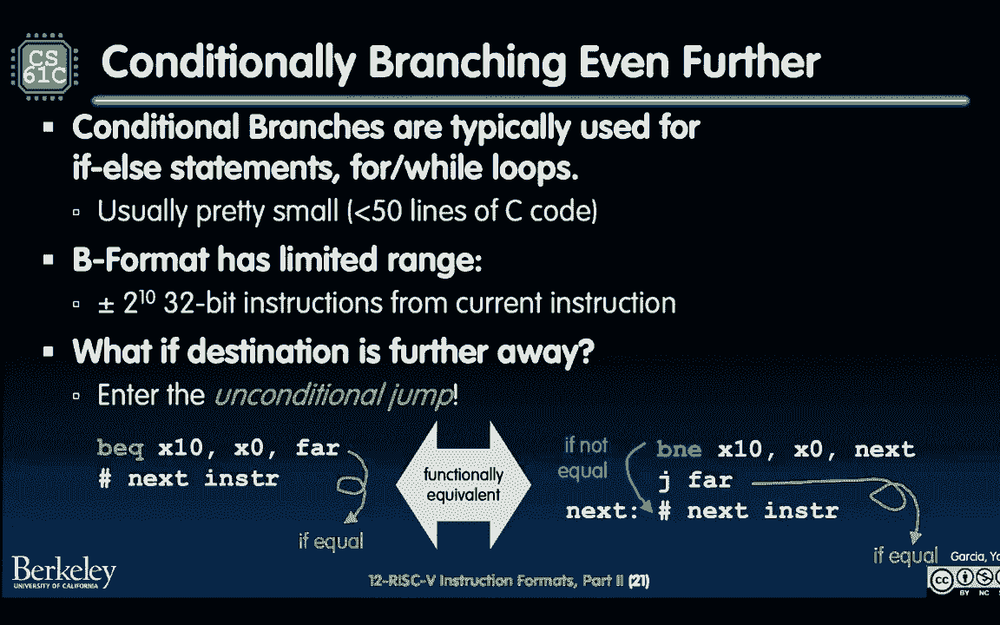

伪指令 `j label`（无条件跳转）其实就是 `jal x0, label`，它跳转但不保存返回地址。

### U 格式：加载大立即数到寄存器高位
U 格式指令用于构建32位的常数或地址。它包含一个 **20 位的立即数**，这个立即数会被放置到目标寄存器的高20位。

主要有两条指令：
1.  `lui rd, imm20`（加载高位立即数）：将 `imm20 << 12` 写入 `rd` 的高20位，低12位置零。
2.  `auipc rd, imm20`（PC 加立即数）：将 `PC + (imm20 << 12)` 的结果写入 `rd`。常用于生成与当前代码位置相关的地址。

**如何构建一个32位常数？**
结合 `lui` 和 `addi`（I 格式）可以构建任意32位常数。例如，要加载 `0xDEADBEEF`：
*   `lui x5, 0xDEADB` // 将 `0xDEADB000` 加载到 x5
*   `addi x5, x5, 0xEEF` // x5 = `0xDEADB000 + 0xEEF = 0xDEADBEEF`
汇编器提供的伪指令 `li rd, imm` 会自动生成最优的指令序列来完成这个操作。

---

## I 格式的扩展：跳转并链接寄存器（JALR） 🔗

最后，我们介绍 `jalr`（跳转并链接寄存器）指令，它属于 I 格式。

`jalr rd, offset(rs1)` 指令做两件事：
1.  将 `PC + 4` 保存到目标寄存器 `rd`。
2.  将 PC 设置为 `rs1 + 符号扩展(offset)`。

`jalr` 与 `jal` 的关键区别在于，它的跳转目标地址是**从寄存器计算出来的**，而不是相对于 PC 的偏移。这使得它可以实现：
*   **函数返回**：`jalr x0, 0(x1)`，跳转回调用者保存的返回地址（`x1`）。
*   **间接跳转**（如通过函数指针、虚函数表调用）：跳转目标地址在运行时计算并存入寄存器。
*   **绝对地址跳转**：结合 `lui` 和 `addi` 在寄存器中构建完整32位地址，然后用 `jalr` 跳转，理论上可以跳转到任何地址。

---

## 总结 📚

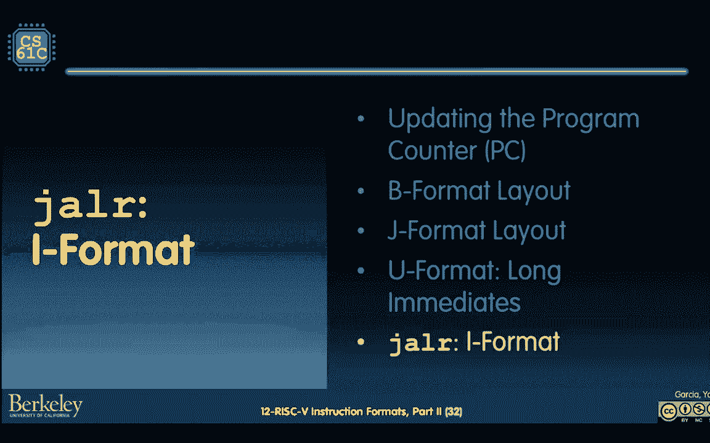

本节课我们一起深入学习了 RISC-V 的多种指令格式：
*   **S 格式**：用于存储指令，理解其立即数的拆分存放方式。
*   **程序计数器（PC）**：理解了指令顺序执行和分支跳转时 PC 的更新机制。
*   **B 格式**：用于条件分支，掌握了 **PC 相对寻址** 的概念和偏移量的编码方式（以2字节为单位）。
*   **J 格式**：用于长距离无条件跳转（如 `jal`），具有更大的20位偏移量。
*   **U 格式**：用于构建大立即数（`lui`, `auipc`），是创建32位常数和地址的基石。
*   **JALR 指令**：实现了基于寄存器的间接跳转，是函数返回和动态调用的核心。

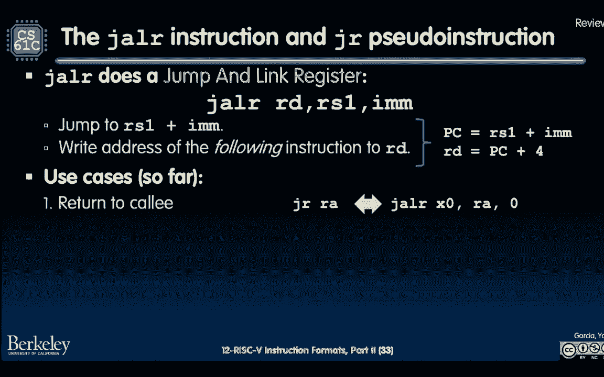

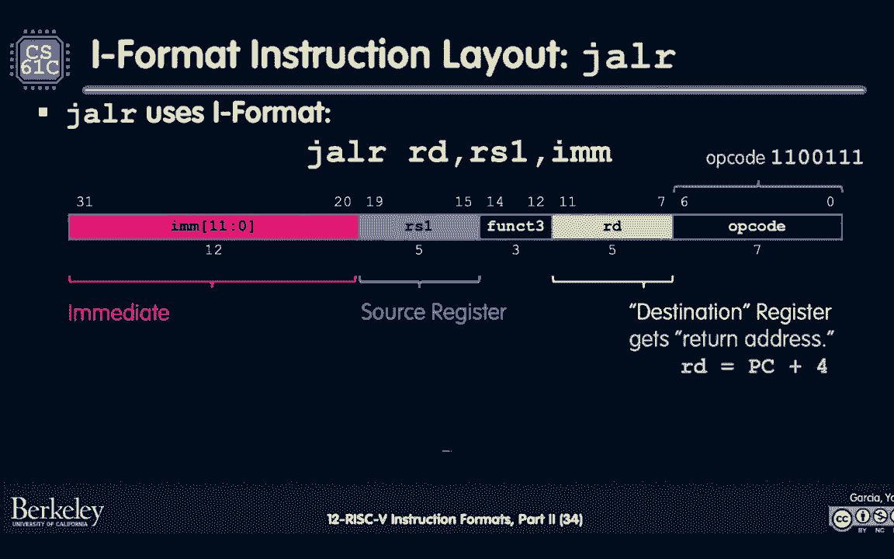

这些格式共同构成了 RISC-V 灵活而高效的指令系统，使我们能够实现复杂的控制流和数据操作。