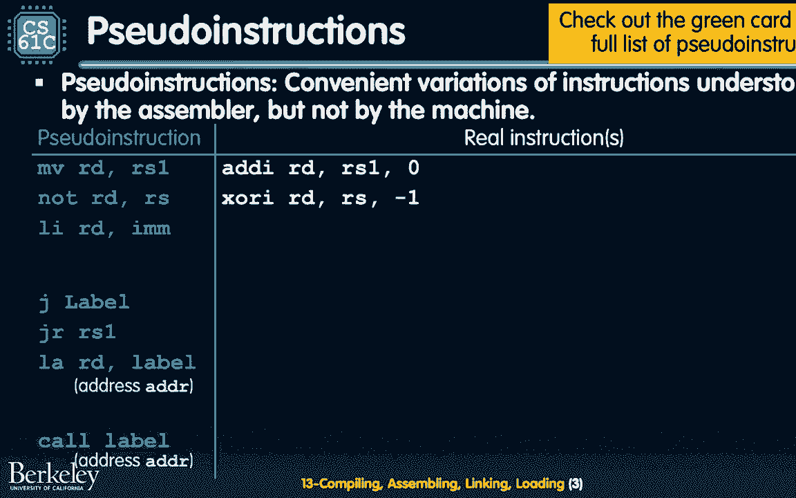
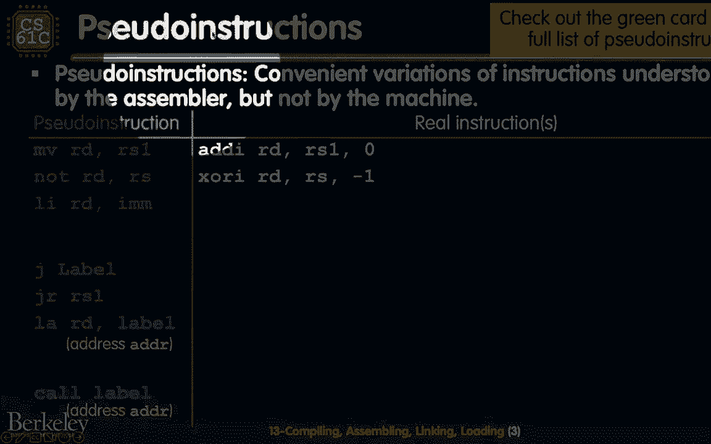

# P17：Lecture 13： Compiler,Assembler,Linker,Loader - 这样好__ - BV1s7421T7XR

好啦，欢迎回到61 C。

这是正确的，今天是星期五，因为是星期五，而不是丽贝卡·布莱克，我们有卡莉·雷·杰普森，因为我们今天要讨论一个叫做call的东西，c l不代表cal，即使它可以，它也代表编译程序集链接。

最后有一个L，代表装载，但在我们开始调用它自己之前，我想揭露我们一直在说的一些事情。

每隔15分钟左右，但没有明确，现在我们要明确地说，伪指令的概念，所以对你们很多人来说，当你处于危险5时，使用金星模拟器，您可能正在使用伪指令。

因为它们对你来说更容易，作为人类编译器将这些指令翻译成C。

所以我们在左边。

我们有一些伪指令，我没有把它们都列在这里，如果你有兴趣看所有的，你可以看看这些说明书的参考卡，你觉得怎么样，真正的指令是。

换句话说，这些伪指令就在那里，为了，对于编译器，谁用汇编语言写东西是为了用更容易理解的方式写东西，但它们实际上并不对应于具有操作码和功能的特定指令，它们实际上对应的所有东西就像真正指令的快捷方式。

让我告诉你我的意思，我们要跳过，我们将跳过这个练习，我要明确地向你们展示一点，让我们把上面的前两个放在这里，我会试着用。

还是，是啊，是啊，好啦，是啊，是啊，是啊，是啊，我做到了，我做到了，所以我们要试着看看前两条指令。

这是为了帮助在线的人，同时试着用我的尺子，所以如果我们看看这里的前两个指令。

移动和不记得什么丹说，移动是说你会引用引用，将RS的一个内容移动到ARD的内容中，但实际上它更接近于复制，所以在真正的指令中，它实际上是一个添加即时指令。

所以它说嘿零，r 1的值的直接零点。

然后储存到RD中，目标寄存器，同样不是RS，储存在我们的数据库里，它实际上会立即变成XOR。

所以你可以看到我们是否记得，我们的中间人是如何工作的。

那么我们的X商店是如何运作的，它的意思是取r和xor与负1，什么是负一和在二的补语中的符号。

都是一体的，当XOR和一个XOR在一起时，它会做什么，上面写着好的，嗯，在RS中的一切在RS中的一切，如果是，我们就把它降到零，如果是零，我们要把它翻到1，这就是结是如何作为伪指令工作的。

然后再一次作为真正的指令。

我们有更多涉及的版本，现在你可以看到这是一个加载即时指令，让我们看看它是否有效不，不是从这边，我只能在观众席的这一边，所以如果我们看一下加载即时指令，这个李，它实际上变成了两个变成了两组可能的真实指令。

左边的一个说得很好，如果它适合12位的话，添加I的中介，我只是要用一个添加，I与x零，然后存储到目的地，好啦，这就是加载即时版本，但是。

如果大于12位，那是因为我按错了按钮，如果大于12位。

然后我将立即使用负载上，后面是一个广告I，负载在哪里，立即将前20位加载到目标寄存器中，然后加i，然后通过更新，寄存器目标的其余部分也具有较低的12位，接下来我们有跳转标签和跳转寄存器。

这些解析为跳转和链接x零标签和跳转和链接寄存器x零寄存器，再次唤起你的记忆，关于JL做什么和R做什么，他们更新程序计数器，然后在更新程序之前，它们还存储下一条指令，程序计数器会去哪里，加四，目标寄存器。

好啦，在这种情况下，因为没有目的地寄存器，我们把它存储在，这意味着我们只是放弃了回信地址，相反，我们唯一要做的就是更新，那么有什么区别呢，然后在跳转和跳转寄存器之间，跳转标签使用当前程序计数器的偏移量。

这就是我们所说的PC相对寻址，而跳转寄存器使用寄存器中的三个二位值，这就是我们所说的绝对寻址，你可以看到，我是说，也许你可以考虑一下，每样东西，对于PC相对偏移量，你被限制在20位。

但你也是相对于程序计数器，这是伟大的，然后是收银机，绝对寻址跳好，你可以用这三个二位，但你得把这三两部分装上。

你必须确切地知道你想跳到哪里，我们会稍微谈谈这个，在下一部分，在今天剩下的时间里，最后喜欢的两个可能没见过，所以我要明确地把它们说出来，让我们假设我们想加载，但不，你做不到，不是很刺激，好吧。

我学到的是，这是我的鼠标，力量，好啦，所以我们为什么，嗯，所以这个加载地址，我们是说我们想把标签的地址加载到寄存器目的地，然后有两种方法可以做到这一点，取决于汇编程序决定如何将您的地址加载到。

其中之一是明确地把所说的地址，这就是为什么它看起来与立即加载版本非常相似，所以你会立即做一个加载，再加上下面的12位，另一种可能，我们稍后会讨论这些，我可能想做一个PC相对寻址，所以它会说，哦耶。

标签实际上是这个偏移量，或者这个地址可能就像偏移量，实际上我将从U PC开始，所以我会加载当前的PC，然后我会添加任何信息，嗯，那些较低的12位从PC上偏移，所以这里应该说偏移量而不是地址。

我把它固定在幻灯片上，最后是最后一个呼叫标签，这也经常被一些编译器使用，可能是人类编译器，可能也是编译器，我们的机器有风险，这里有五台机器，它也会有效地跳跃，它只是不会跳到一个遥远的标签上，因此。

它再次解析为PC相对地址，加上一些加法和跳跃，好啦，所以你可以看到，这里有一些不同，它简单地解析为对调用标签的跳转和链接，加载地址，PC相对地址并更新PC相对地址，然后调用链接寄存器中的跳转。

我只想把这个放在幻灯片上，因为当您查看代码时，您将看到它，您可能不使用call，但是你可以看到一个伪指令是如何改变它的，两条伪指令，今天我们要讲一个叫做call的过程，实际上是仔细想想。

它是翻译和运行程序的过程。

我是什么意思，我说翻译好是什么意思，让我们来看看我们现在所处的位置，就我们的硬件抽象而言，就我们的海龟而言，我们现在所处的位置，但在最上面的是我们已经经历了所有的前三层，这么高级的C语言。

我们已经通过了这种汇编语言，最后，现在我们很好地处理了机器代码，如果你仔细想想，如果你喜欢，后退一下，电脑必须为你做这件事，从某种意义上说，所以从来没有像，我是说，至少在这个例子中，我们有一个。

我们有一个人类，我们所有直接将C代码翻译成程序集的人，然后把组件翻译成机器，但两个世纪的力量在于，我们有电脑为我们做这件事，我们今天要讲的是。

我们如何做到这一点，这将是一个非常高的水平，但希望这能激励你选修未来的课程比如1262，64个操作系统和编译器，因为这就是一切，所以让我们来定义翻译，首先，翻译是简单地将程序从源语言转换成另一种语言。

通常你想转换成一种较低级别的语言，因为这允许更高的效率和性能，至少它允许您有更多的选择来提高效率和更高的性能，这里有更多的可变性，所以在这种情况下，您从C到程序集再到机器代码。

我只想把这个和，到目前为止你见过的其他一些语言，尤其是蟒蛇，嗯，它是一种解释语言，好啦，从某种意义上说，Python的默认是，那是什么意思，这意味着您直接执行Python语言，嗯。

而不是把它向下转换再向下转换，然后用一些机器码版本，这里有张纸条，所以我们经常说，就像复合这个词一样，C是一种编译语言，C也可以解释，风险五也可解读，这只是事情执行时会发生什么的问题，例如。

你们正在使用的金星模拟器，Venus Risk Five模拟器实际上并没有将组装翻译成机器代码，然后在你的机器上执行，其实这只是潮流，就像看你的风险五，因为它在运行，然后向你展示模拟可能发生的事情。

所以这是一种解释器版本，如果你对这方面的更多信息感兴趣，这种分化，丹有一个很棒的录制视频，我已经把它贴在今天幻灯片的末尾了，我还把幻灯片贴到课堂上，所以你可以在更新的在线中看到那些，PDF。

今天我们将多次重温这个图表。

但这就是我们所说的过程。

好啦，翻译和运行一个程序，那么如何从一个C程序到运行所述程序。

嗯，首先你编译，好啦，所以这是这里最上面的蓝色选项。

让我们看看它是否有效，是啊，是啊，是啊，是啊，好啦，所以这个蓝色箭头，那是编译器。

编译器所做的，如果我们仅仅从输入输出的角度来考虑，它接受一个C程序，它输出一个汇编程序，在这种情况下，我们的组装程序将处于风险五，那么呼叫的A部分是什么。

那是装配工，所以汇编程序所做的就是把汇编程序，它输出机器代码程序。

然后链接器接收机器程序，然后输出一个可执行的机器程序。

那么这里有什么区别呢，你就像，好啦，嗯，为什么有汇编程序和链接器，嗯，有一个想法是，当你建立一个程序时。

让我们假设一些涉及字符串的事情，你调用像sten这样的。

或者您还调用printf，所以您使用的是标准库，那些图书馆住在别的地方。

它们是在其他地方预先编译的，然后你把它们融入，链接器是将它纳入，它为您提供了一个单独的程序来运行，运行一个可执行文件，所以这是of的输出，连接器是允许所有东西混合在一起的东西，很好。

当你把它加载到内存中时，最后一个电话，你只需执行一个文件，所以这里要注意的是，我们经常说将C编译为二进制，我们今天学到的是，实际上这指的是前三步，所以从c语言到汇编，到机器上，然后还有机器代码。

然后在预编译库中链接。

让我们从第一步开始，第一步其实大家都很熟悉。

从某种意义上说，我们将在第一步上覆盖一张幻灯片，这太棒了，所以这里又发生了什么，输入是那种你有高级语言代码的东西，假设foo c，然后输出，你组装。

然后你输出你的编译器的食物点，它可以是海合会海合会是为我们的蜂巢机器，所以它真的被编译成x86语言。

但对61年的我们来说，看看我们所做的是我们让人类作为编译器。

因此人类，人工编译器通过一些，一些人为优化，这里的一些人类算法，注意通过这个fos的输出，风险5中的汇编程序可能包含伪指令，因为这一切都是关于编译器如何看待c程序。

然后把它转化为有用的东西，关于编译器如何看待程序。

逻辑，就这样，回来吧。

很快回到这张幻灯片，如果你对其中很多是如何工作的感兴趣。

因为再一次，我认为你们现在面临的挑战之一是，对你来说，思考如何写作是相对简单的。

你看到的很多节目，现在想想风险五。

想着什么时候分家，什么时候跳，什么时候调用所有这些东西，那有点古怪，如果有一种方法可以自动化，那将是非常棒的，因此，我真的鼓励很多人选择CS 164，您可以构建自己的编译器。

您可以理解这些高级语言的结构。

更多，这将是一个好时机，好啦，汇编器。

现在我们进入第二步，你可以再看到一次，我们在一个非常非常高的水平上思考这个过程，但这应该是所有风险的一个很好的总结，到目前为止我们一直在做的五件事。

如果我们考虑这里的汇编程序，让我们回到输入输出。

所以输入是汇编语言或汇编指令程序，然后输出是一个机器语言模块，我们叫它模组，因为它不像一个可执行程序，但它通常在延长线上有一个点。

然后它有机器代码在这一点上实际上是二进制的。

好啦，所以你可以打开它，用人类的格式阅读它，都是以比特和字节为单位的。

这就是所谓的目标代码，所以如果你听到我说，目标代码和二进制代码是一样的。

我可以互换使用这些，它不仅包括机器代码，所有指示的翻译，装配说明，但它也包括我们所说的链接和调试的信息，它被进一步传递到过程中，我们会谈论所有这些事情，它们的意思是。

汇编程序具体要做什么，我刚告诉你输入和输出，它和什么东西配合得很好，它与这个想法是一致的，称为指令，你可能已经在一些实验室里看到了，我们今天要解释一下，然后更进一步。

因为它试图在这一点上输出实际的机器代码指令，这就是它将替换伪指令的地方，我们今天上课的时候说过，变成真正的装配，再转换成机器码，祝福你，所以让我们稍微考虑一下指令，所以让我来介绍一下高层的指令。

所以当你在实验室里看到它的时候，你就像，好啦，我明白这是什么，当你在项目上看到它，你明白是什么，以及如何使用它们，这些通常是作为从编译器到汇编器的注释生成的。

他们不生产机器指令，但是它们告诉如何构建对象文件的不同部分。

我这么说是什么意思，在座的很多导演，如果你查出来，他们说像，啊，然后文本后面的任何东西，还是没有，我做不到，文本后面的任何内容都是您的机器或组装指令，然后类似的数据点数据，点数据之后的任何东西。

这些是您希望放入静态数据段的内容，好啦，所以这些都是，当编译器在查看C代码时，它会标记东西，移动东西，然后生成这个程序集，它说文本，所有这些说明，然后数据，所有的内容都在这里，还有一些其他的标签。

我只是想指出，这里有一个全球符号，所以符号，可能是像梅因这样的东西，可能是一个，可能是另一种标签，它只是说这个符号将是全球性的，以防其他程序想运行它，这就是为什么你会在项目中看到它说，哦耶，声明全局主。

因为如果你说主要的指令，那个主标签放了像，它被标记到一条指令，如果那个东西可以被其他程序访问，然后另一个程序可以运行你的伴侣，因为它知道自己在哪里，然后这里还有一些其他的，这些通常用于点数据。

所以点字符串和点单词，这就说明了这一行后面的一切，这是我想存储到数据段中的字符串，或者这些是我想存储到数据段中的单词，这有点像你的参考幻灯片，我喜欢思考指令的方式，这就是我喜欢思考标签的方式吗。

所以如果标签是一种指示的标签告诉你，就像地址一样，就像记录那些指令的地址一样，点文本和数据有点像路标，好啦，就像现在我们开始，我要告诉你所有的说明，现在我要告诉你们所有需要发生的数据，好啦。

所以这有助于汇编程序更好地解析程序集文件。

那么这个目标文件包含什么，它将包含六个主要部分，所以这个目标文件是foo。

汇编程序的输出，其中三个对你来说应该是相对合理的，如果您正在考虑如何编写程序集，这大致是有道理的，在好的意义上，第一个是标题，你们中有多少人写了一个，像以前的研究项目，我不得不喜欢，穿上，像封面一样。

或者像目录一样，标题就像目录，类似的事情，就像嘿，我要把这份报告发出去，将此目标文件发送给下一个人，我会告诉他们，就像，一切都在那里，因为它都是二进制的，它将包含一个文本部分，所有的二进制编码。

所有指令的机器码表示，此外，它将包含一个数据段，也就是所有的机器表示，数据的二进制表示，静态数据寿命，好啦，所以再一次，当我们考虑静态数据时，我们在想什么，这些都是宣布的事情，使许多程序可以访问它们。

嗯，在文件的顶部，全球数据，全局变量。

然后现在有了这些类型的事情，好啦，如果这些是汇编程序将要有的输出。

它需要什么，那么如何创建此文本段。

嗯，在过去的几次讲座中，我们一直在研究这个问题，所以我们一直在研究汇编代码，然后将其翻译成机器指令。

让我显式地向您展示汇编程序是怎么做的，第一件事是因为它的目标是将组装指令更改为机器代码，让我们考虑一下类别，不同风险的格式，到目前为止，我们看到的关于格式和算术的五个指令，I格式化。

所以当你在做算术或逻辑指令时，使用寄存器和中介，把所有这些类型的东西，所有东西都被编码到组装指令中，把它翻译成3个2位的机器码指令，所以说，例如，如果我加x18x18x10，嗯，光是看这四条指令。

你可以确切地知道操作码应该是什么，什么有趣的三个，什么恐惧，七个字段是，所有这些东西其他格式呢。

我们上次一直在谈论树枝和跳跃，事实证明，PC的相对分支和跳转也可以翻译，但这里还有几步，所以为了改变，让我们说，J标签进入机器代码。

三位两位机器指令，我们首先要把它从伪指令转换成汇编指令，然后我们得弄清楚标签在哪里是对的，然后我们找出标签在哪里，然后我们计算当前指令之间的偏移量，在凝胶X零标签处，标签将在哪里。

然后我们用半字来编码偏移量，嗯，那么我们为什么能在这一点上做到这一点呢，这就是我们所说的位置无关代码，所以记住，前面我说过，汇编程序之后的下一步是这个叫做链接器的东西。

它将一堆库和编译的东西组合成一个巨大的文件，有可能因为这个巨大的文件。

这个代码块的位置会移动一点，这有点吓人，但如果我们用PC相对偏移量，我们将有位置独立的代码，它总是相对于这个指令编码的地方，所以这实际上是我们翻译一些东西的一个很好的方法，现在在汇编程序中，再深入一点。

如果我们考虑我们实际需要计算的，将所有这些标签转换为相对指令偏移量或半字偏移量，我们能一次完成吗，因为我们又喜欢，如果我们在想，如果我们在考虑建造一个完美的装配器，我们希望它尽可能快地运行代码。

尽可能少地生成机器代码输出，答案很不幸，我们不能做一个任务，但我们可以做两个。

让我告诉你我的意思，让我们假设我们有以下代码，好啦，所以这里是一个for循环。

没有。

行不通的，我要用我们的鼠标，所以如果我们，如果我们仔细想想，这个循环就在这里，它是一个for循环，我是说我在用C术语，但实际上是一个集合小于一个集合小于分支等于，然后跳，它想做什么。

它是说我将从t 2等于9开始吗，我要看看t 2是零还是大于零，如果它不大于零，然后我们完成了循环，我要退出，我要跳到出口，如果它仍然大于零，然后我要减少它，通过增加一个负数来增加它。

这就是那个循环所做的，如果我试着计算和翻译，组装到这里的机器代码中，嗯，我一到b q出口，所以这里的第三行，我其实不知道出口在哪里，因为我喜欢，也许我只是这是我第一次通过代码，我不知道出口是指示。

一二离当前指令有三条指令，或者六个半字之外，但是，如果我再经历一次，然后我就可以像记录出口在哪里，然后再回来，然后输入并替换这个出口和b q来代替实际的偏移量，注意，对于落后的人来说，这是可以的。

所以如果我垂直地浏览这段代码，当我到达J环时，我已经看到循环标签在哪里了，它指的是哪条指令，因此对于负偏移，还可以吧，让我总结一下，树枝和跳跃，所有这些事情，因为我们可以有正负抵消。

正偏移意味着我们跳转到代码，我们可能还没有看到，但是如果我们把所有的代码都检查一遍，然后我们就看到了所有的代码，所以如果你能把信息记录在某个地方。

我们可以把它记录到所谓的符号表中，然后我们再看一遍所有的信息和说明，然后插上所有的偏移量，因为我们以前见过所有的标签，所以这是一种两通系统，这就是大多数汇编程序的工作方式，好啦。

所以这告诉了我们一点如何翻译，可能有百分之五十，或者实际上它接近我们指令的75%，所以我们有算术指令，逻辑指令，我们有这些类型的分支指令或跳转，它们是相对于程序计数器的，还有哪些其他类型的指令，嗯。

上次课结束的时候我喝了几杯，假设对其他文件的引用，假设您想调用或跳转到printf，偷什么的，这些不是功能，或者这些不是您正在编写的特定用户程序中的标签，有其他程序的标签，假设UNIX开发人员。

所有这些类型的事情，嗯，那是个问题，另一个问题是，还有一些事情我们还没有真正讨论过，就像对静态数据的引用，如果您想加载全局变量的地址，你是怎么做到的，这就是所谓的绝对寻址，因此，这是我们需要的东西之一。

实际上，这个变量在内存中的绝对地址，才能装进去。

能够真正翻译机器，或将组件转换到机器中，指导。

那么这里的重点是什么呢，这里的重点是，在程序集的这一点上，这两个都不能确定，这就是我们所说的对象模块，对象文件模块，因为它不像整个项目，如果我们考虑到对其他文件的引用，这里实际上是第一个。

我们只是不知道其他文件的二进制文件是什么样子的，所以我们实际上不能告诉你这些地址在哪里，然后第二个是静态数据，我们不知道，如果我们稍后链接的其他文件也有其他静态数据，所以这些地址可能也会被移动。

所以汇编程序所做的是，上面写着，好啦，嗯，我试着把我能把的从装配到机器，然后这里有一些缝隙，所以下一个排队的人，你能帮我翻译这些吗，这是帮助你翻译的信息，所以汇编程序提供的两条信息是，搬迁信息。

哪个是桌子，然后是另一个叫做符号二的表。

因此，这些也作为对象文件模块的一部分包括在内，传递给将在这里制作可执行文件的人。

好啦，那么让我们来看看这两件事是什么，我有两张幻灯片，第一个是符号表。

符号表实际上是文件中的项列表，另一个文件可能会发现有用，首先，任何说明书的标签，假设在上一张幻灯片中，我们有一个跳跃循环，然后我们有一个循环标签，我们有一个出口标签，这些是符号表中的标签。

然后你就会有相应的地址，至少汇编程序认为的是地址，它还包括数据，所以点数据部分的任何东西，任何全局变量，所有这些东西都在那里，记住有一个全局指令，它还将包括其他程序是否可以访问缅因州，所有这些类型的。

还有一张表听起来和符号表相似，但有一点不同，这就是所谓的搬迁信息，这类似于该文件需要的剩余地址的待办事项列表。

所以说，例如，如果跳转到外部函数。

它会说，哦耶，在这个凝胶指令中的跳跃，我其实需要，我填不进去，就像，你能帮我填一下吗，所以有点像，你知道在谷歌文档上，对于那些正在使用谷歌文档的人来说，你好像加了点评论。

这就像一个广告评论类型的东西在这里，您可以准确地知道以后需要编辑哪一行，它还包括对无法访问的任何类似数据的评论，因为，好像你不知道是什么地址，所以你想做，请填写这个全局变量的地址，你可以看到，有符号表。

如果我进入下一张幻灯片，幻灯片上的第四个，这是符号表吗，上面写着，好啦，这是所有的标签，这是我认为这些标签在的所有地址，包括全球，数据段变量，这些东西在什么地方？这就像我所想的我所想的事情。

然后搬迁信息就像，好啦，这些东西我绝对不知道它们在哪里，我希望你回去修改这些特别的说明，所以你可以把符号表，标记变量，重新定位就像指令地址，以及需要更新的内容，是啊，是啊，中间有个问题，啊，问得好。

这是否意味着标签名称在不同的文件中必须是唯一的，奇妙的问题，所以记住，有一个全球指令，这将允许您隐藏一些标签，但在大多数情况下，至少在您使用的单个文件中，你需要有独特的标签，所以如果你有喜欢。

在2号线上循环，然后在99号线上循环，我想通常装配工会很困惑，是啊，是啊，还有一个问题，哎呦，是啊，是啊，问得好，静态部分和数据部分有什么区别，他们是同一个术语，是啊，是啊，这是个好问题。

静态和数据的思想也是如此，我们通常把它们称为相同的片段，这就是数据存在的地方，然后我唯一要对比的是文本，这里的段和文本表示说明，所以每当你听到静电和数据，这些东西通常指的是同一类型的片段。

但就这部分而言，嗯，那些数据可能以不同的方式访问，取决于它在C中的声明方式，这口井的问题不在。

哦耶，这里还有一件事，所以呃我记得，我记得我说过有六件事我们讨论了前五件事，这里的最后一个叫做调试信息，所以这通常很有用，如果你用gdp之类的，它只是有关于这个东西是如何编译的信息。

或者这个东西是如何组装的，它是用什么组装的，这对于以后的调试器来说通常是非常有用的，哦好吧，这最初是C代码，这就是它看起来的样子，这是一种额外的信息，在这个目标文件中，如果你对这到底是什么样子感兴趣。

你可以看看这个，呃，这个名为audump的命令行工具，嗯，但是如果你把它用在蜂巢上，虽然，请记住，蜂箱上使用的组件是x86，六十四，这就是ISA，所以它看起来与所有的风险五略有不同，你一直在做的事。

但片段大致相似，谁会没事，链接器，所以现在我们在翻译过程的第三个字母。

实际上，这是翻译的最后一步，在我们开始跑步之前。

如果我们回到这里的目标，它接收机器模块，所以这些带有符号表和重新定位的信息，所有这些，它输出一个可执行或机器语言程序。

我们称之为，链接器的一个很酷的地方是，至少我们在这个成本中引入它的方式，它是否允许单独编译文件，我说那口井是什么意思，如果你看看这个图，我们有这个机器模块，然后我们可能还有一个标准库。

或者像一个lib点或类似的东西，这些东西可以被编译，或者类似于单独编译和组装，然后连接器可以在最后一步将它们连接在一起，在它创建可执行文件之前，节省了很多时间，例如，也许如果你只是想编译，你好世界。

运行那个程序，也许您不想重新编译整个Linux源代码，你知道，因为它就像两千多万行代码，所以有点像，好啦，那东西是预先编译好的，我要把它连接到，允许我运行我的简单的小用户程序，这里的一些老字号。

可能会让你想起，链接器的作用，它被称为链接编辑器，因为它实际上编辑了跳转和链接指令中的所有链接，好啦，所以这就像是使用了搬迁类型的想法，我给你看一下图表，更详细地介绍一下链接器在做什么。

让我们假设这里有两个不同的文件。

把一个点O归档，然后把两个O归档，这是两个不同的对象模块，链接器所做的是获取这些文件，这些文件有一个文本段，数据段，还有任何关于搬迁符号的信息，报头，所有这些东西，它输出一个文件，它的方式。

这是首先将所有的指令或所有的文本段组合在一起，它把它们放在一个特定的顺序。

所以也许按照这个顺序，特定的链接器想先做一个文件的文本段。

然后文件2的文本段。

它对两个数据段做同样的事情，所以再一次，也许它确实像文件一的数据段和文件二的数据段，将它们连接在一起的链接。

然后把它们打在最后一个程序的一个点上，最后在最后，也许它聚合了所有的信息，就像符号表，标题所有这些东西，然后创建这个额外的信息，可执行文件的一部分，是呀，有个问题，是啊，是啊，是啊，是啊，问得好。

所以这就像，好的，好的，为什么这些信息还在这里，如果它已经链接在很好的问题上，事实证明，我们在这里不会讨论太多细节，但事实证明，对于您拥有的可执行文件，你仍然有一个符号表，上面写着。

好啦，这些都是可以访问的标签，因为这考虑到了，就像一个未来的程序想把你的可执行文件链接到别人身上，你知道就像他们，他们也可以用这种方式联系起来，此外，加载程序和下一步将需要，文本段开始的位置。

数据段开始的地方所有这些，所以你还需要封面，就像你仍然需要一个目录，是啊，是啊，问得好，好啦，所以我们在科技领域，我们在数据区，我们把它们放在一起。

但现在我们实际上需要编辑所有的说明，或者编辑我们所有的引用，所以这是我们解析引用，检查，是啊，是啊，我们有一大堆谷歌评论要做，然后我们要检查每一张搬迁表要做的事情，然后修复每一条指令中引用的地址。

那么我们需要影响哪些地址，那么好吧，让我们考虑一下，我们有三类指示或地址，我喜欢考虑。

其中一个就像，它们都是根据与它们相关的不同类型的指令分组的。

第一个是PC相对寻址，第二个是外部引用，然后第三个是静态数据引用，所以实际上回到前一个问题，你可以看到我在同一个句子中使用了static和data这个词，好啦，所以他们有点像，在这里可以兑换。

所以对于PC相对寻址，我们需要更新这些地址吗，答案是否定的，因为它的位置是独立的，好啦，那么我这么说是什么意思，所有这些分支指令，所有这些与PC相关的东西都与特定的指令相关，以及它的位置。

所以如果那个特定文件的整个文本段只是向这个方向移动一点，这个特定文件中的所有分支仍然相对于它们所在的位置，好的，好的，所以即使绝对地址移动了，这个巨大的指令里面的这个巨大的指令集，相对偏移有一个好的。

所以，我们其实在这里很好，我们不必编辑这些，然而，外部功能地址。

是呀，我们确实需要这些，因为在组装的时候，我们不知道外部文件的地址。

所以我们甚至不能计算相对偏移量，因为我们不知道两个方向能跳多远。

所以经常，虽然我们通常有这些作为跳转链接，或者一个带有DLR的U I PC，所以就像跳入链接会跳得很远。

然后是一个从寄存器文件跳转的Uipc，对于一个跳得更远的寄存器来说。

最后我们有静态引用。

假设你将数据加载或存储到全局变量，因为静态数据可能移动了，因为再一次，您有点像将数据段和文本段连接在一起，这也可能是移动的。

所以数据片段，也许你也得编辑这些。

在这里再深入一步，您需要在每个机器指令中更新哪些类型的位，我刚刚给你看了几页。

可能还有一些不在这里，其中之一是j格式，因此，如果您正在跳转并链接到外部文件，您需要更改相对偏移量。

所以你需要改变所有上面的20位指令。

货物和库存呢，嗯，如果要加载并存储到静态数据段中，您可能会使用所谓的全局指针，好啦，所以如果你愿意，看看你的参考卡，有一条很小的线写着全科医生，这是你无法很好地接触到的东西，事实证明。

你可以把它作为指导的一部分，所以我们在这门课上不会过多讨论全局指针，只要知道它指向数据段的位置，这就是你可以用来作为相对偏移的东西，你想编辑的其他东西路易斯，添加I用于外部跳跃的东西。

我还没有把它们包括在这张幻灯片上，但最后又一次，有条件分支，这些b型指令，这些不需要编辑，因为他们都是电脑的亲戚，它们都是同一文本段中的小跳转，然后连接到这个更大的文本段，所以解析引用。

关于装载机的更多细节，因为它总是关于链接器，因为这就像是，哦耶，现在我得考虑所有这些不同的图书馆，真正发生的事情，是风险五吗，链接器假定文本段从这个特定地址开始，再发一条短信，当我们谈论虚拟内存时。

再过几个星期，链接器提前知道什么，是不是有点像模拟，文本和数据段将在哪里，所以它知道每一个的长度，每一个都来自阅读标题，它知道每个文件的顺序，然后计算要跳转到的每个标签的绝对地址。

然后解析引用，所以它查看每个重新定位表，它现在有一个巨大的不同地址列表，然后如果在这个特定的重新定位表中找不到它，或者这个符号符号表，它去了另一个图书馆，然后上面写着，好啦，嗯，也许符号就在这里。

然后如果它不在那里，然后它转到另一个库，可能符号就在这里，所以它通过所有这些东西，然后找到正确的地址，呃，这个文件正在查找输出，这将是我们之前看到的可执行文件，所以它会有一堆文本，一个巨大的文本段。

将所有编辑后的重新定位地址放在一起，一个完整的数据段，然后在一个头调试信息符号表中，所有这些东西，原来如此，呃在片场，从某种意义上说，这就是我们所说的风险，五个，就我们如何看待静态链接而言。

我的意思是静态链接是库，假设标准库或字符串库，它实际上并不完全是可执行文件的一部分，因为我们把所有不同的字符串函数，即使是我们不需要的，然后把它们塞进去，因为我们只是连接在一起，所有不同的文本片段。

这里所有不同的指令，这是相当大的，总体来说，如果你想到像，怎样才能真正喜欢，如果每次你想打印f，你必须包括所有的标准，我做了件大事，嗯，但这里的优点是可执行文件是自包含的。

所以即使你把它移到另一台机器上，嗯，仍然像，知道如何读取机器代码，至少您需要的所有不同的库文件都包含在同一个编译的二进制文件中，编译后的可执行文件，这里的另一种选择是所谓的动态链接库。

所以你可以看到旁边有一张小桌子。

或者实际上是一张相对较大的桌子，所以动态库，动态库中的D，代表动态而不是静态，这就是当今用户计算机的共同点，好啦，所以我的意思是动态链接的库，假设我只在运行时链接，因为我不知道我不想包括整个可执行文件。

所以我只是要链接，并有这个额外的公开开销，当事情发生时，所以利弊，大部分是专业人士，几个想想就有点吓人的缺点，就存储程序而言，需要更少的磁盘空间，因为现在可执行文件只是用户程序的可执行文件，也许再加点。

就像在运行时稍后连接的字符串上晃来晃去，因为它的磁盘空间更小，把程序发送给别人会花更少的时间，把程序传送到机器上，同时执行两个程序，如果使用相同的共享库，它们将需要更少的内存，挺好的。

但一个大骗局是是的，的确，现在开销很大。

因为您需要在执行时动态链接，这允许我们做什么，虽然是合理的升级处理，所以我这里的意思是，如果库x y z更新了，您只需要更新该库的编译版本x y z，然后所有使用这个特定的程序。

他们使用这个特殊的模块不必更新自己，因为它们都可以查看相同的外部lib x y z二进制文件，那正在发生，现在请注意，让程序可执行已经不够了，您现在拥有了所有这些依赖项，所以这台机器需要有特定的生命。

X，Y，Z，所以，然后这个，然后这个，以此类推，你不能只给一个用户程序，然后期待它会运行。

它首先需要有所有这些动态链接的库，但是，最终，它真的是流行的方法，我们的个人电脑的很多方式，我们的个人电脑是今天写的，这不是唯一的方法，就我在这里所描述的意义而言，就像机器码级的动态链接。

所以当可执行文件执行时，嗯，但无论如何，这也有很多好处，我们这节课就不讲了，只是想把它熄灭，就像你会看到的那样，你会看到DL这个词，现在你知道这意味着什么了，好时光，好啦，装载机，我们快到了。

所以装载机。

呃，这是最后一步，翻译完了，现在是运行程序的时候了。

什么是输入或输入是可执行的，我们的输出在括号中。

就像我们运行程序，或者像这里记忆中的任何东西，这里有几个音符，所以当可执行文件运行时，加载程序确实将其加载到内存中。

这是装载机的一个大想法，因此，什么是加载器，这是我像剥开，还有一层洋葱，又像多脱了一层蛋糕，即加载程序是操作系统，所以操作系统的工作之一是加载程序并运行它们，所以如果你有兴趣。

再拿一个六十二，只是装载机上的几个注意事项，因为你就像，好啦，但我不想拿六十二，只是还没有，只要告诉我，关于这个成本的一点戏弄，所以我会，加载程序首先为整个程序创建一个地址空间，这是个疯狂的想法。

因为在这之前我们一直在思考记忆，就像这个巨大的连续数组从零到二再到三二，然后整个事情对我们来说是可以访问的对吧，在任何时候装载机都会留出空间，好啦，这就是我要让你使用的空间，你可以认为你有所有的空间。

从0到2到3到2，但也许你不知道，这就是所谓的虚拟内存，我们过几个星期再谈，那么它是如何创造空间的呢，它会在运行时看到程序在开始时需要多少空间吗，当它启动程序时，所以这是指令的大小，所以文本部分。

以及全局变量的大小，是静电，或者数据段，它创建这个新的地址空间，还创建了一个堆栈段，所以它复制了所有的指令，数据输入，到这个新地址空间，它也清除了很多。

一些寄存器，让我们看看我这里有没有，是啊，是啊，它还清除了一些寄存器，特别是其中一个肯定会被清除并重置，是堆栈指针，好啦，所以堆栈指针，它指向第一个空闲堆栈位置最终与，在程序中传递的任何参数。

就像你运行一个可执行文件，通常在这里传递一些参数，参数首先传递到堆栈，这是从幻灯片的最上面开始的，不行了，不行了，不抱歉，这种事不断发生，科技硬，最后是争论，它确实首先将它们移到堆栈上。

然后它有一个启动例程，启动例程将参数从堆栈移动到参数寄存器中，供main执行，好啦，所以在我们的C程序中，我们有两个论点，我们通常认为RC和RV，现在这两个值，所以参数的数量。

以及这些参数将被存储到寄存器中的地址，然后main现在被称为启动例程，如果主例程返回一个特定的值，它会以退出系统调用终止程序，所以你可以看到，有一个更大的东西在运行这个程序，所以我们要做的，我确实有。

让我们看看我有一个同伴指令，但我也有一个例子，所以我要做的是，我要给你们看一个例子。

对等指令，答案确实在幻灯片上，我晚点再给你看，但是让我们来看看其中一个编译的程序。

所以我们可以看到我所说的所有事情，C a和L。

我们不会讨论在一个程序中加载太多内容，让我们假设我们有你好世界，你好世界稍微改变了这个，所以不是用hello world来打印f，这里有两个论点，这样我们就可以看到在我们的数据段中创建的两个字符串。

它把它编成这样，我知道这就像，突然有点小短信，但第一部分是什么，以下是所有的指令，我要开始我的指示。

这是我的教学片段，因此，我想把所有的东西都对齐到单词2到两个字节，然后我也希望缅因州可以访问其他程序，我们有一个标签，这是主要的，所以这就是编译器为汇编程序创建的内容，然后是主程序本身，它有一个前导。

在那里分配堆栈帧，它缓存，返回地址加载到字符串1中，并且，将两个地址串成零和一，然后，它使用伪指令调用printf，然后加载信息，然后我们重新审视，分配堆栈帧。

然后回来，这个程序集输出中的其他部分是什么，嗯，数据，好啦，那么写入的数据是什么，有一个指令，它说嘿，现在启动只读数据段，现在这就是字符串一标签应该是，这是一个字符串你好你好，带着一点mod s。

然后将两个标签字符串到这个特定的数据世界，然后是汇编程序，所以你可以看到这里发生了什么，因为有三个不同的版本，有一些未解决的事情，我只是要指出他们在这里，所以这就像没事，伪指令，所有这些加载地址和调用。

那些都被替换了，然而，我不能完全解释所有的机器代码，因为我不知道到底是哪个地址，这些是其中一些跳转到printf，他们中的一些人跳到商店，或者他们中的一些人加载字符串一，那些全局变量。

我不知道那些在哪里，所以它把它们包括在符号中，并放入重新定位表供链接器查看，这就是链接器所做的，链接者说好吧好吧。

我只是要编辑所有这些说明，而不是上一张幻灯片中的零字节。

现在我把它们作为，就像，实际地址本身，所以现在要指出的是，字符串1是十六进制的。

二零一零，让我们看看我的光标是否有效，它不起作用。

所以在2 0，所以你可以看到它的负载是2-1。

然后是1和0的相加，为什么用二一，看看上次的讲座，祝你周末愉快，我们星期一再见。

