# CS 61C 第14讲：同步数字系统导论 🚀

在本节课中，我们将要学习同步数字系统的基础知识。我们将从硬件的最底层开始，了解电流、电压如何通过开关和晶体管形成逻辑门，并最终构建出能够执行计算的数字系统。我们会探讨时钟、信号、延迟等核心概念，并理解组合逻辑电路与状态元素（如寄存器）的区别。

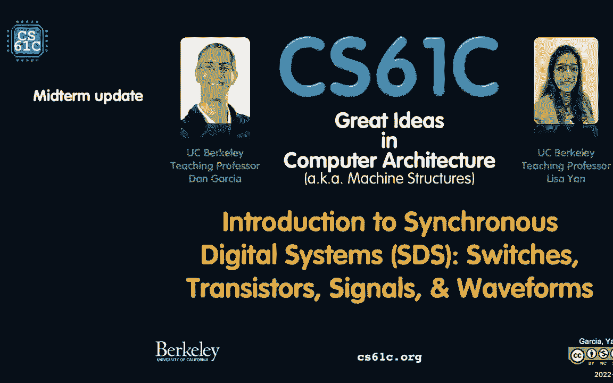

---

## 概述 📋

所有公共软件存储库的21TB快照，主要用二维码编码，这非常迷人。位于挪威一座山中250米处，这个档案程序旨在通过存储和索引数以百万计的存储库，捕捉现代软件世界的一个有价值的横截面。

这个设计可保存一千年的档案，一张快照储存在一百八十多卷胶卷里。这很迷人。我希望你们都考虑一下自己的个人数据备份计划。我敢肯定你创造了很多东西：手机、电影、你所做的一切、你写的所有代码。

你是怎么备份的？无论你的计划是什么，你都需要有能力对任何移动设备的丢失做出反应。所以，要确保你关心的东西没有一个只存在于移动设备上。消失的瞬间或掉进水里，它就没了。你要确保它已经“沉入云中”。

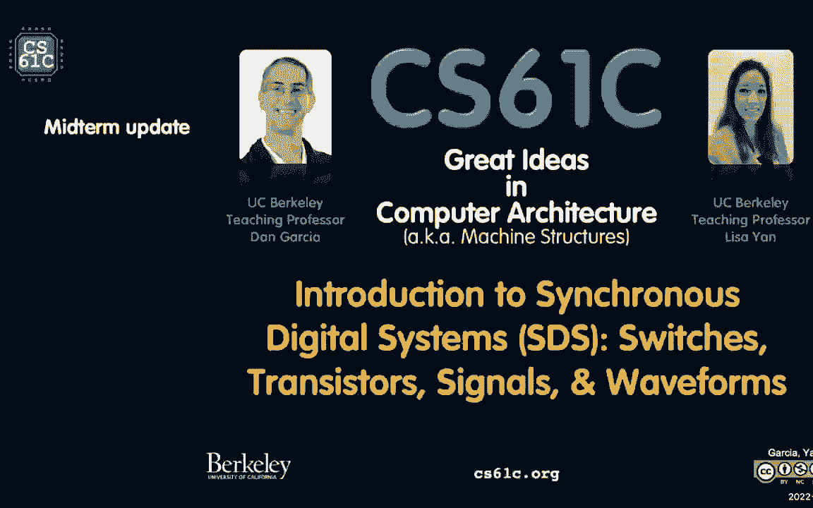

当然，这里有一些隐私问题。人们知道你有私人照片，可能是健身或其他内容。这些照片你真的想保密。然而，它们进入云端的那一刻，就可能被黑客攻击，这是一个令人担忧的问题。

所以我很感激，但无论你做什么，确保你对失败有弹性。我们学到的一件事——计算机体系结构的大思想——是**冗余**。所以要确保数据在多个地方。当你想到谷歌、开源软件和备份时，请确保这一点。

我想我有四个不同的地方，我的数据试图同步到那里，以防我弄丢了我孩子的照片和所有东西。所以，这非常重要。

好啦，我们开始吧。女士们先生们，欢迎来到CS 61C。

---

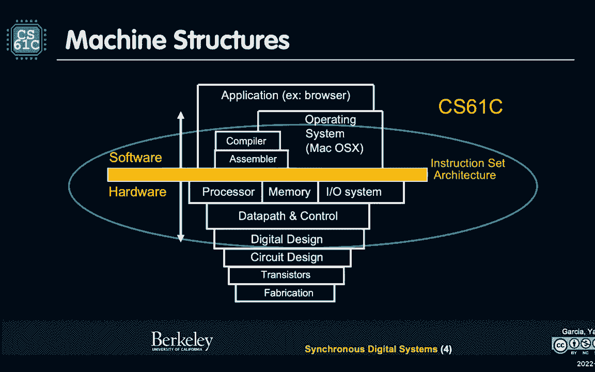

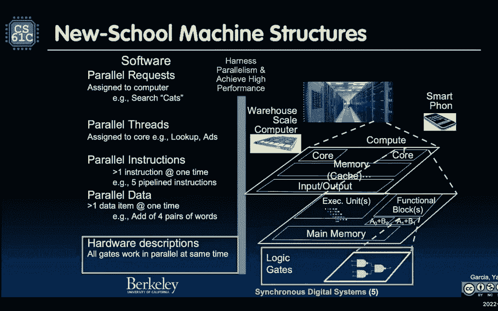

## 同步数字系统导论 🔌

我们将看到一个名为“同步数字系统导论”的新讲座，也称为SDS。

如果摄像机能把我放大，我这里有一个小演示。这是我几分钟前编程的Micro:bit，我要给你一个小消息。你能看到这里的信息吗？我们准备好了。走。哦，让我看看，你能看到留言吗？好啦，上面写了什么？“CS 61C SDS”。

今天我们要学一个新题目。我想在那里给你一个小小的庆祝。所以是的。

我应该给你一个期中考试的最新情况。人们已经被询问过了，想知道期中考试的计划是什么。期中考试将在三周后举行，大约两到三周。

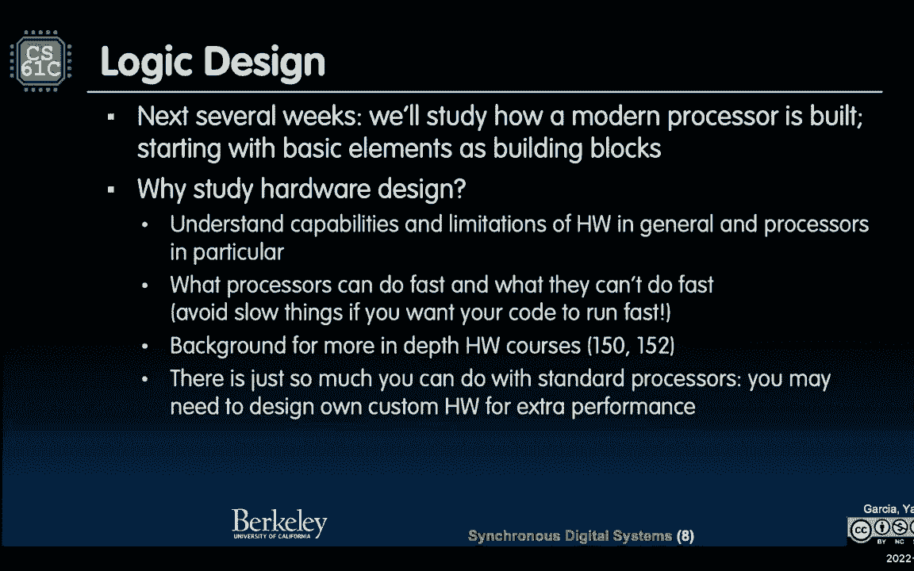

交易是这样的。我想我在第一节课上就说过了，但我会再说一遍。期中考试有两部分：
*   会有一个带回家的、你在家完成的期中考试，未经监考。我们信任你，就像我们把项目托付给你一样。你要单独完成。这将是你的C编程和RISC-V部分。
*   完成5个编程题。没有时间限制，只要能完成它。我们会给你所有的测试用例。所以你只要工作直到你通过所有测试用例，提交，你就完成了。你知道你在银行里得到了那些积分。
*   然后你们要进行80分钟的现场考试。就像你在实验室里有90分钟的时间，但是从一个班转到另一个班需要十分钟，所以是80分钟的考试。我们会试着设计题目，让助教可以在20分钟内完成批改。

你会被要求回答问题，但重要的是，你没有学习表。所以这只是字面上的，你冷冰冰地走进来。我们会给你一份“绿表”，也就是我想在这一点上，它被扩展成了五页的东西。这是在网页上，所以这将交给你。所以所有关于二进制、十六进制、RISC-V转换的内容，绿表上都有。所有这些都将给你，所以你可以看着它说好，如果上面写着，我不需要记住它，否则你需要记住它。

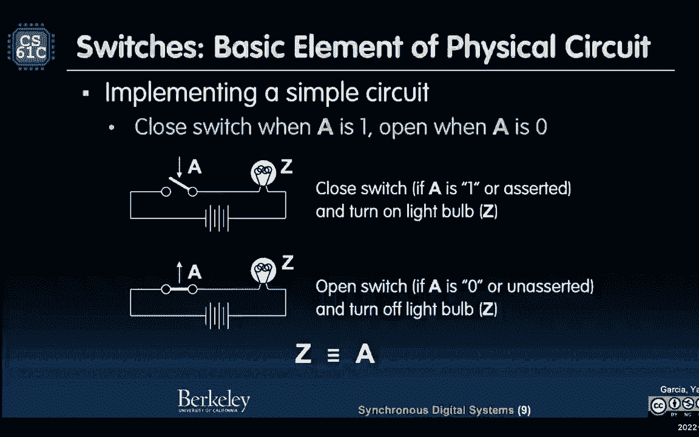

你会被要求做什么？你会被要求做这些事。同步数字系统可以被要求做一切。到了考试的时候，这不是在编程方面，C和RISC-V在那边。剩下的，我们已经询问了您关于数字表示或基本转换的问题。你一定能做到。事实上，您需要能够从任何进制转换到任何进制。这不只是我教你的，我能教你什么，然后你如何从中学到其他东西。我教了你如何在二进制、十六进制和十进制之间转换，你应该可以推断如何从任何进制转换，就像三进制到五进制。你应该能做到的。所以练习一下，确保你知道那是为你而来的。

所以这两个基本的转换、浮点，我们还没有在编程方面测试过你。是的，我们还没有测试你。可能是RISC-V，这些指令是什么样子的，因为这不是在编程方面。这就像如何编码一些东西，但如果我能从指令片段，给汇编程序生成机器代码，或者把它汇编成片段，丽莎上周做的那些事。那是在笔试上。我说，SDS与浮点，所以所有那些。所以基本上，这是一个比61C以往任何时候都轻量级的期中考试，因为我们会相信你，单独解码，在没有计时器的情况下进行编程。就像一个真实的面试问题，你知道一些谷歌面试，说“嘿，写点代码”，你想花多少时间就花多少时间。这就是我们要给你的。然后我们就和你在一起了。最好知道剩下的东西是“冷”的，挺干净的。

我希望你们都能把它完成。我们都想有一个所有模特的王牌，所以我们希望你们都完成它。我希望你们所有人都能把这部分做得很好。提前告诉你，会发生什么。这就是我们现在正在做的事情，在后勤方面试图弄清楚。我们有750名学生，你什么时候能赶上那80分钟的时段？大约90分钟的时段，十分钟的过渡，所以这是一个80分钟的例子，你什么时候能来？所以有很多关于这一点的调查。我们在找房间，还有这些细节。你用实验室，用你的笔记本电脑，所有这些事情。你有笔记本电脑，在不插上电源的情况下可以工作80多分钟吗？还是必须插上电源？但我们必须有电源插排和所有这些东西，所以我们正在研究所有的细节。但物流显然仍有待解决，但计划已经准备好了。

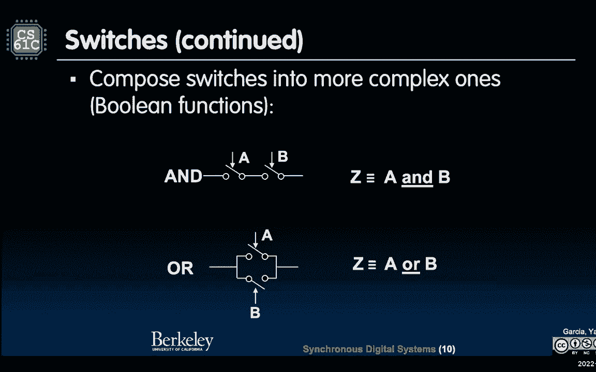

所以给你一些东西，一些用C语言编程的东西，然后准备好你的无学习表，离开它走进来。我们给你一点点，你知道的，绿色床单和你的笔。好啦，有问题吗？这就是中期更新，希望你能用。这样做的目标是有一种新的方法，我们在61C中评估，这使得您不必担心编程方面的时间安排，但也要确保你知道这些关于非编程方面的问题。

是的，我们会给你草稿纸。所以我们会给你一些草稿纸，我们会收回来的。所以你可以写你需要的一切，然后我们从你那里拿回来，因为当我做那些小事情的时候，我也用草稿纸。问得好。还有什么关于期中考试的问题吗？

Ed会有所有的细节，当我们离约会越来越近的时候。太棒了。好吧，我们去开关。

---

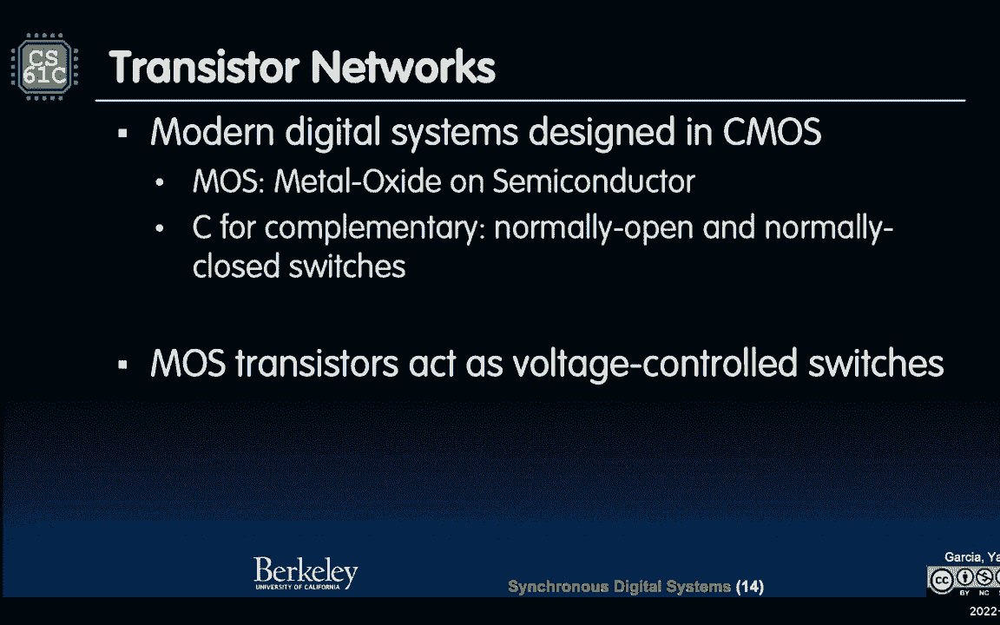

## 什么是开关？💡

所以今天我们学习同步数字系统。什么是开关？所以大局，听我说，你以前见过这个。我要给你们看四五张幻灯片，你以前见过。这是老派的大图景。CS 61C是ISA就在中间。这个讲座是一个新模块的开始。

所以如果你之前很困惑，没关系的。全部重置，从字面上看，这是每个人的重置。我们现在在做什么？我们有点自上而下地接受了ISA。我认为丽莎结束了一天的工作，能够从任何应用程序，你显然可以编码并看到一直到RISC-V，一直到编译器、汇编器、链接器和加载器。所以你现在处于ISA的水平。那很酷。

现在我们来看看这张图片。我们要从最底层开始，一直到建立一个运行ISA的系统。从字面上看，你会从上到下拥有整个东西。当这种情况发生的时候，这是令人惊讶的一天。我们从这幅画的底部开始，我们要努力向上。

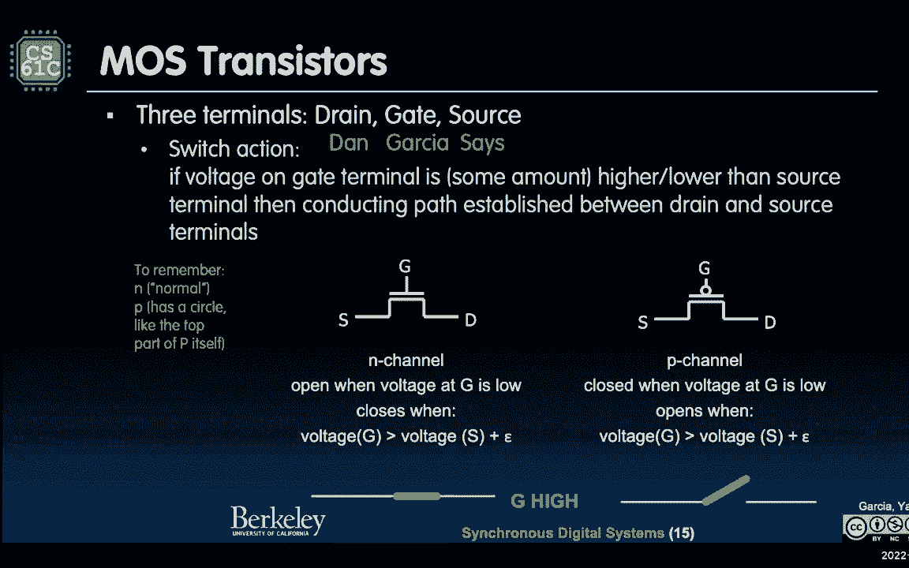

新的学校机器结构再次，你以前见过这个。我们在硬件描述或逻辑门的最低水平。再次，中间是ISA的照片。这是我们的抽象层，我们将在这里，在下部远离底部工作，一路向上。每次演讲，我将在前面讲座的基础上再接再厉。所以这一节我想是连续四节课，我们要建造我们的道路，然后我们要继续建设。你要建造的CPU级别越高，那真的很酷。

这是一堂很棒的课，这门课不是我发明的，我继承了这门课。太神奇了。我们继续添加丽莎，我和其他老师都加入了我们的小作品。但这是一门很棒的课。我很荣幸能教这些美妙的东西。我本科时最喜欢的课程之一，可能莉萨在本科时就选修了这门课。我在麻省理工学院上了他们的课。我们喜欢这东西，所以我们很高兴来到这里。

所以我们说的是同步数字系统。那是什么意思？这些话是什么意思？“同步”这个词就像心跳一样。就像我手指上的假心跳。但是一个系统中的时钟有规律地连续运行的想法，有频率或周期，就像心跳砰砰砰砰，说“做点什么”。做某事做某事做某事的意思是运行指令，增量，电脑，继续这样做，字面上保持处理数据。这就是我们的同步系统将以数字方式运行的东西。

说世界是模拟的，但我们要把东西转换成数字世界。我们讨论了如何做到这一点，通过抽样。我们看到如果你有一些数据，然后你量子化了。我们看到了这两个想法。电信号，我们要量子化成，不是伏特，但是1或0，所以我们有两个不同的值。我们将以抽象的方式把它们分组，形成单词，你马上就会看到。它很酷。

所以逻辑设计，顺便说一句，还有其他课程，如果你想了解更多关于这个的信息，CS 150是很好的课程，CS 151，有一些很棒的后续课程。事实上，如果你今天爱上了61C，苹果会很高兴见到你的。如果今天就像，“我的天啊，我做不到，这是最神奇的新材料”，苹果想雇你。有这么多人，他们在制造自己的硅，所以他们不能雇佣足够的人来制造自己的硅，他们想把一大群人。所以我们希望你能爱上这个。苹果，尤其是爱上这种材料，然后说“我想参加后续课程”，151然后是接下来的比赛。你知道的，工作在等着你，有很多钱。这真的很令人兴奋。

好的，所以我们将讨论如何从下到上再构建一个处理器，了解最低的最低水平是如何，电流是如何均匀流动的，电压是多少，然后一路向上。

为什么我们很关心硬件设计？当我们运行软件时，了解硬件是如何工作的实际上很重要。所以他们说“我是个软件人”，但了解硬件级别上发生了什么实际上很重要。事实上，这就是CS 61C的特别之处。假设你决定成为一名软件开发人员，你的余生都要知道它是如何运行的，会让你成为一个更好的程序员。当然，知道你将学会如何优化它，这个词你还没学会。缓存是下面东西的一部分，如何管理自己的内存，所有这些都能让你成为一个更好的程序员。它真的可以让你在那个水平上触摸硅，所以理解硬件是非常重要的。

你在想处理器，他们擅长什么，什么不？他们做得很好，他们什么时候会失速？其中一件事就像放慢速度。因为你不知道引擎盖下发生了什么，一旦你明白了，你避开那些时候，你试图优化时间，在那里你可以做事情非常快，而且非常有效。

还有更多的课程，CS 152也是我们150系列的CPU设计课程。伯克利是我们的硬件系列。你可以用标准处理器做很多事情。所以有一个全新的运动，为非常专业化的东西设计定制硬件，这很令人兴奋，这是一个奇妙的领域。

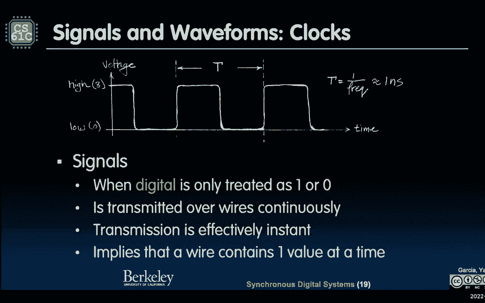

---

## 简单电路与开关 ⚙️

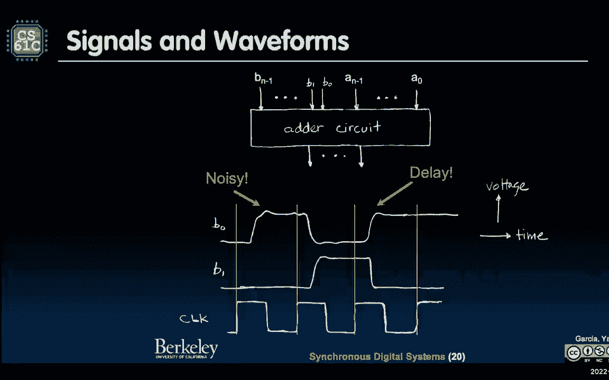

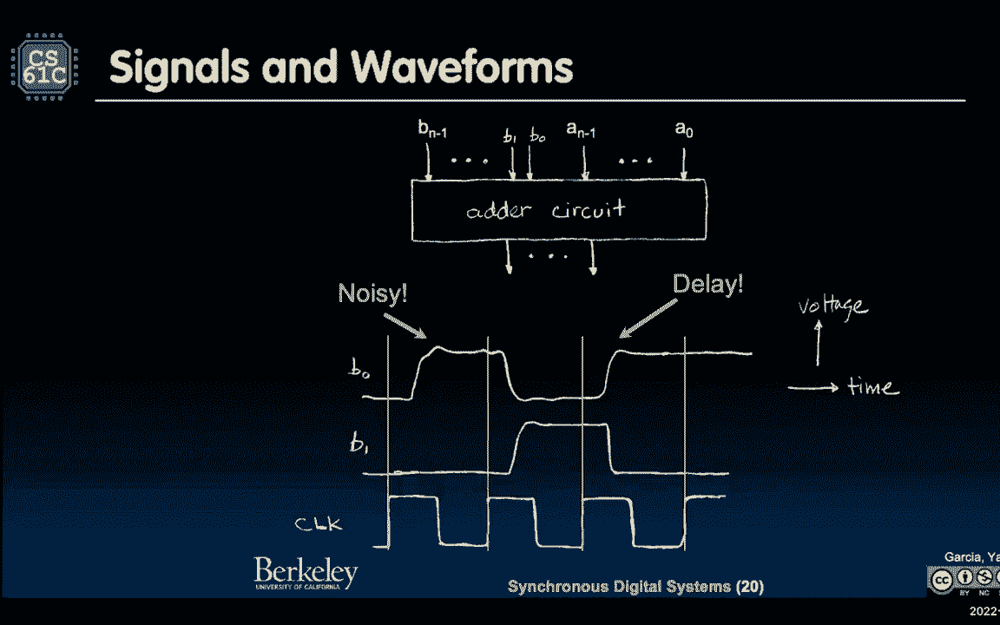

这是一个简单的电路，让我们一起看看这个并理解它。这是一个开关，现在是一个开关，它显示为打开的。这是灯泡或电阻元件，会有点光的。你会看到一些输出。这是一个电源。这是如何工作的？

当A为零时，那个开关是开着的。电流必须流动，如果你从早期的物理课上学到了基本的电学知识，电流必须流动才能发生事情。所以如果没有电流流过电阻元件或光，现在开关一关，灯就会熄灭。

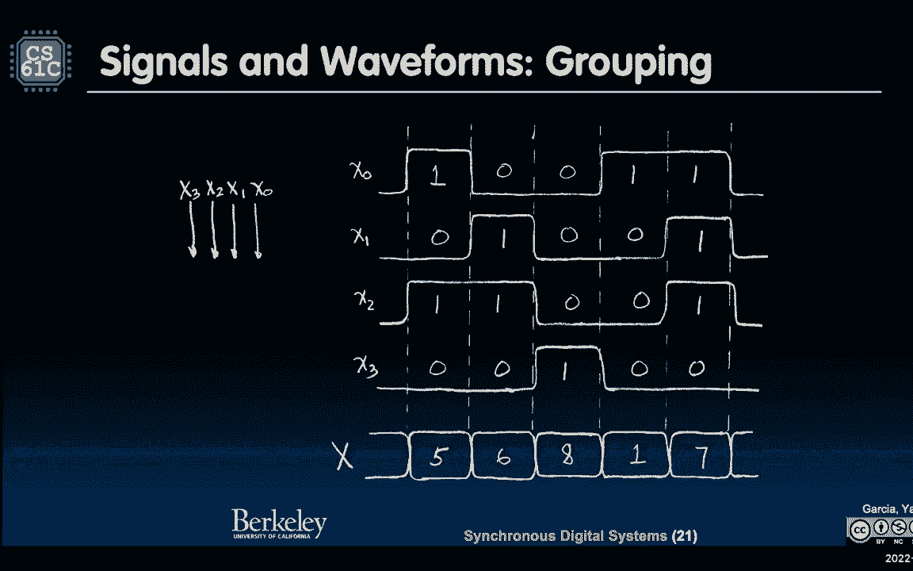

有一个循环，当我们有一个循环，好事是会发生的。从你身上流出的电流，想想当前的电子从电源流过光。他们，这现在是一条直线，没关系。它看起来不像是，就像一个打开的开关，大门已经关上了。循环还在继续，灯亮着。

你能做到的。顺便说一下，我喜欢这个，你可以像今天一样用一块电池和一块锡纸，你和你从手电筒里拿一盏灯，你可以做一盏灯。它实际上是所有的动力源，你的电池，这是你的灯，就这样了。你只是把两者连接起来，做起来很容易，也很有趣。

所以A继续。事实上我有一件小事，但当我推它看看它在那里是否有效时，它就起作用了。当我拉它的时候，它爆炸了。所以把它推上，继续释放它，它爆炸了。所以事情是这样的。所以当它关闭电流时，如果我们称之为“断言”。这是一个有点奇怪的图表，因为它就像一个，当这像它要做的事情。这是我说的，就像一个，什么能做到这一点？这里现在是一个关闭的，现在有光。如果这真的是那张照片，意思是说，如果你打开开关，如果“取消断言”，然后电流停止流动。所以当A变成一个，灯亮了。就像一对一。这就是我通过三个等号所显示的。所以我推，让我看看，让我们关闭一个准备关闭一个，现在我发布了一个，现在开了，什么都没发生。

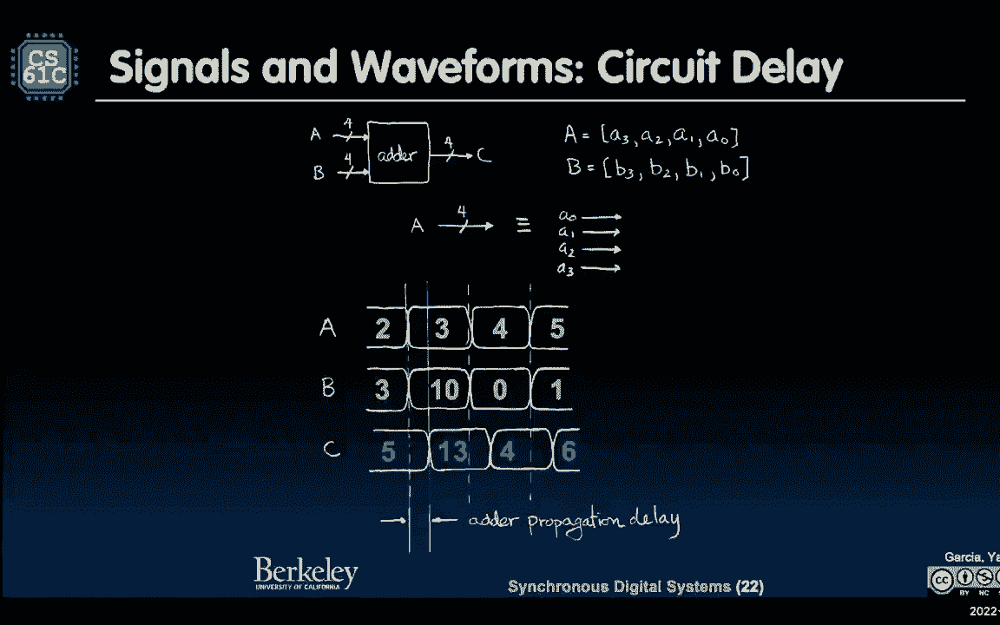

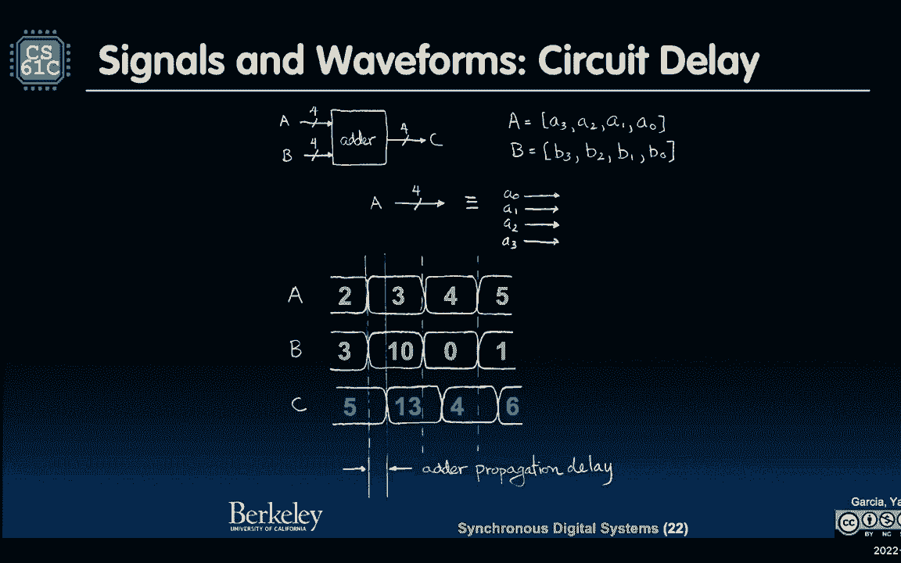

那是我的小照片。现在如果你有这样的想法，当A关闭时，电流可以流动，当A打开时，或者零电流不流动。让我们看看这个，如果我们有这条线，什么时候会有联系？图片左侧和右侧之间的电气连接，只在逻辑上，当A关闭时，并且B关闭。只有当它们都关闭时，空白是什么？或者他们都被断言，或者两个人都记得这个词。我们试着用所有这些词，所以你变得很流利。“断言”，意思是他们去一个。左边和右边之间有电气连接吗？如果你把电池放在灯里，就会产生联系。

所以这很有趣看看这个，只是把A和B放进去。这个词你以前听说过吗？“与”。它们都必须在那里才能让电流流过那条线。看下图，现在你把它们建在，现在你说呢，那是什么逻辑？那根电线的左边是什么时候连接的？在电线的右边，电流可以通过顶部或底部或两者兼而有之。如果两者都是，也没关系，它有点分裂，不过没关系，两者都有联系，电气，所以电流可以流动，电子可以流动。所以底部的图片是逻辑“或”。还是很酷。

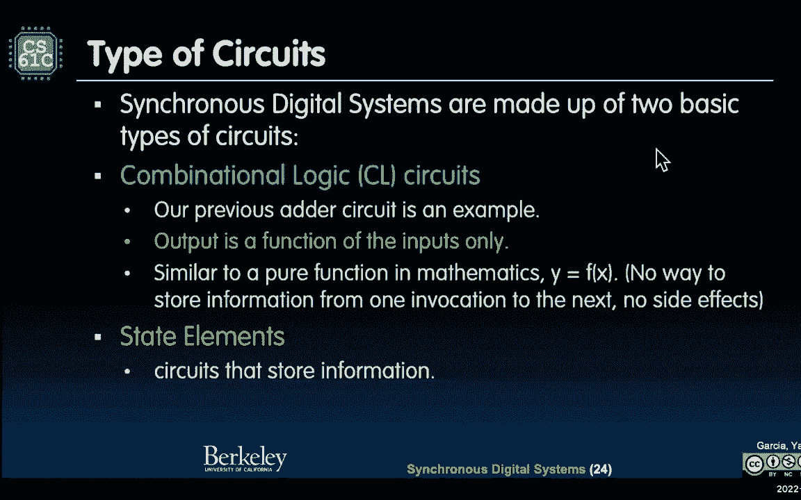

所以我现在向你们展示了一个逻辑“与”和“或”，只是用电线。顺便说一句，你也可以用锡纸做这个，还有你的铝箔，然后你把这个，你也没事，就是这样。让我们用电线把它分开。在那里，哇，你今天就可以这么做，今天用锡纸。这是很有趣的问题，但要确保我不会失去任何人。因为一个新的话题，我想失去任何人，这是有趣的一个。

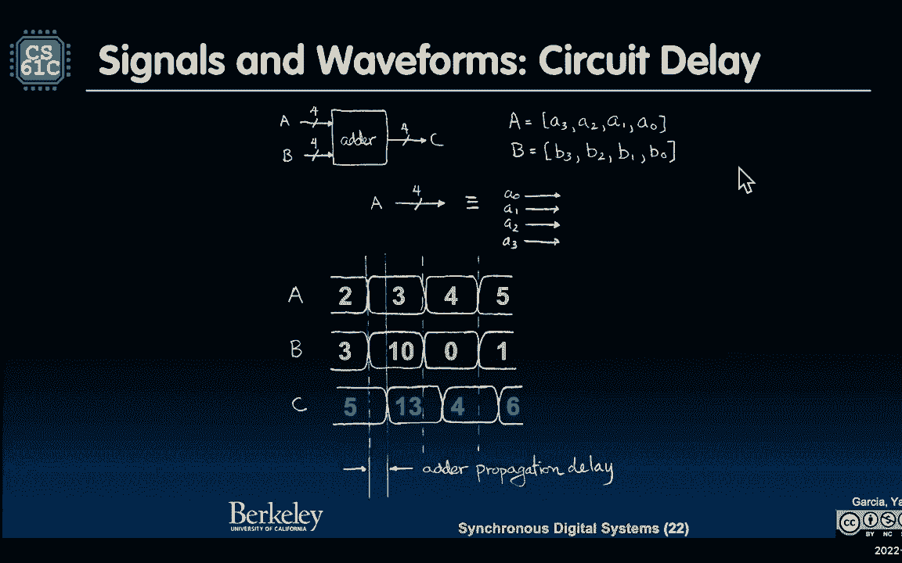

---

## 从艺术到科学：布尔代数与晶体管 🧮

现在有一个历史笔记。人们习惯了，在过去的日子里，构建电路，有点临时的，没有关于他们的规则，没有一本书说过只需要建立一些电路。他们中的一些人做到了。你在建筑圈的最佳实践是什么？非常粘稠的，这是一种做这件事的艺术，而不是一门做事的科学。他们意识到共同的模式，就像我发现了一个叫做“与”的东西，嘿嘿，你也发现了一个“与”，挺酷的嘛。

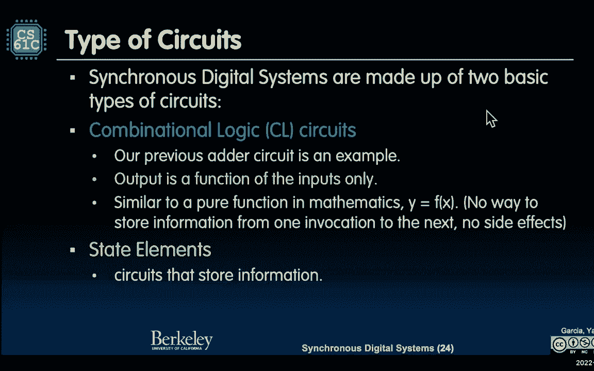

那么也许这个克劳德·香农有一些基本的东西，信息论之父之一，把晶体管和这个叫乔治的数学家联系起来，布尔在这里。所以我们称它为布尔代数。大写B怎么样，因为它是以某人的名字命名的。多么整洁，这意味着我们现在可以应用数学，多亏了布尔，我们可以把数学应用于电路设计。多么奇妙的联系，感谢香农和布尔对那些场晶体管的贡献。

晶体管的历史。晶体管诞生于1947年，圣诞节前两天。晶体管或半导体，这意味着它们有时会连接电力，但有时不要依赖其他非常强大的信号，你可以指挥也可以不指挥。我们将看到这是背后的基础。它们可以用来，不是开就是关，那就像一个开关。或者你也可以有一个电源，实际上可以放大。如果有人有模拟放大器或收音机，你在家里给扬声器供电，你可以，扬声器是这样供电的，有一个由放大器供电的。现在，你听到我在房间里说的了。我在说话，想把自己喊得上气不接下气，因为没有放大器。现在不是第二天发生的事了，但不久之后，他们意识到你可以用这个作为放大器，不只是一个或零，但实际上小信号，小波长，大信号。太神奇了。现在我可以为大喇叭和体育场供电。你在想你去过的每一场音乐会，你得感谢这些人。谁是乡亲？约翰·巴丁，威廉·肖克利和沃尔特·布拉顿。肖克利是最大的，我说人类历史上最大最糟糕的种族主义者，所以抬起头来，威廉·肖克利和阅读肖克利。仅供参考。

在那之前他们用的是真空管。你还记得真空管是他们如何编程的吗？早期的计算机，ENIAC和其他人。在那之后，我们现在有了微处理器。你有你的电脑。我是说电子产品的小型化，多亏了晶体管，这是一件令人惊奇的事情。这是第一个晶体管，这很神奇。经营这个PBS的艾拉·弗拉托，特别，称为晶体管化，他说晶体管可能是20世纪最重要的发明，相当强大。

现在我们可以设计模型现代数字系统，使用这些转换的数组，全部放在一起。这项技术被称为半导体上的金属氧化物，那是MOS。C代表互补，常开或常闭开关。我们将在下一两张幻灯片中看到这一点。它们被用作电压控制开关。是MOSFET晶体管。

---

## MOSFET晶体管：电压控制开关 🔋

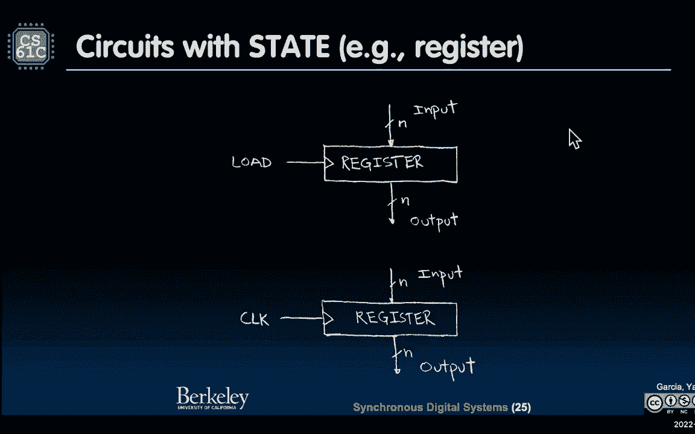

好吧，我们开始吧。我要花些时间在这张幻灯片上，所以你得到了一张照片。这是一张你可能以前见过的照片，但如果不是，你可能不知道它是如何工作的。让我们一起来理解。有三个端子：栅极（G）、漏极（D）和源极（S）。

如果你忘了顺序，我在这里给你助记符，丹·加西亚说，如果你还记得那个DG。就像所有的水流都想排到闸门里，控制大门的人，不管这些事情是否有联系。像你这样的线人，电压漏极和电源。真的是这样。如果现在栅极端子上的电压（电压总是两个引线之间的电压，在栅极和源极之间）高于或低于源电压，在源极和漏极之间，然后在漏极和源之间建立导电路径，就像一扇门。

好啦，这里是漏极，这里是源极，就像水源。我想这样流动，排水口在那里。我是门，它流动吗？它流动吗？还是不流动？我喜欢开关对吧，流还是不流。我如何控制那口井取决于我在这个门上有多少电压。

所以有N通道和P通道。N代表负，栅极呈阳性。但我喜欢记住的方式，它是N是“正常”。什么叫正常？这只是我对自己的记忆。好啦，我想它就像看，如果我不在这里加电压，什么都不应该发生。如果我给栅极加电，栅极才会有作用，门应该打开。所以只有当我给栅极通电时，门才会打开。我说电源在栅极上加一些电压，关门了吗？当它再次关闭时，那我们就开始行动。所以这有点像，你不需要力量来让事情发生，当它发生时，两者之间有联系。记住我不是在放大，我只是在做一个关闭的开关或打开的开关。所以我的意思是，在正常情况下，我必须施加这个电压，所以事情就是这样。

我们开始了。当G较低时，也就是栅极电压。当那很低的时候，他们长什么样？顺便说一下，这个P通道正好相反，真的很好玩。我们将在这个世界上看到很多二元性。二元性就像阴阳，在那里，事物以这种非常美丽的方式联系在一起。N和P就像对偶。像我这样的对偶在两者之间划清界限，就像有N个世界，P个世界是，就像奇怪的事情，就在这上面，然后是相反的世界。

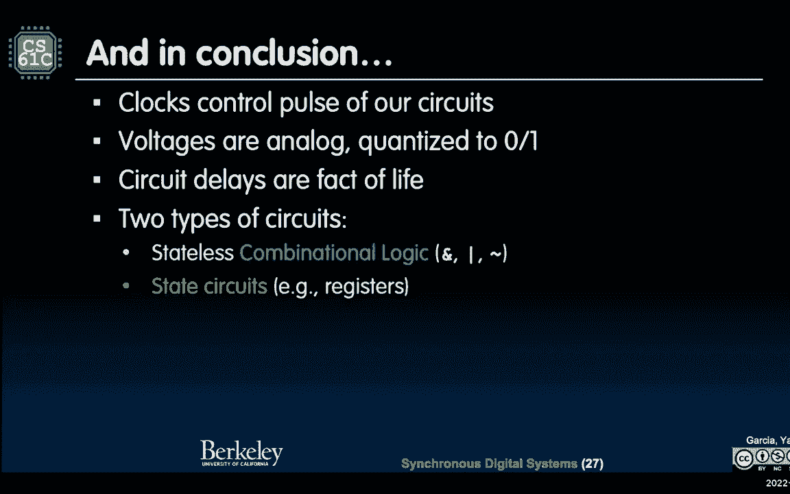

所以N是