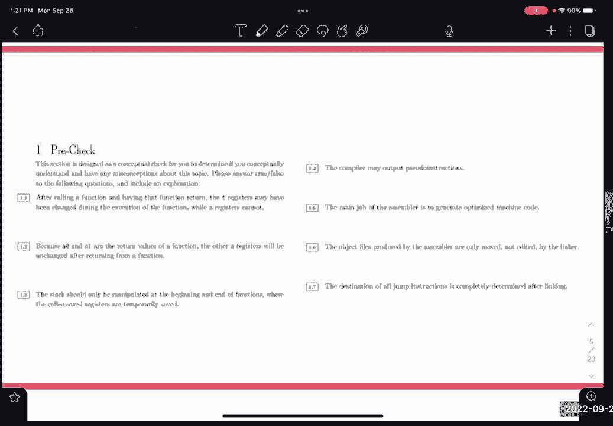
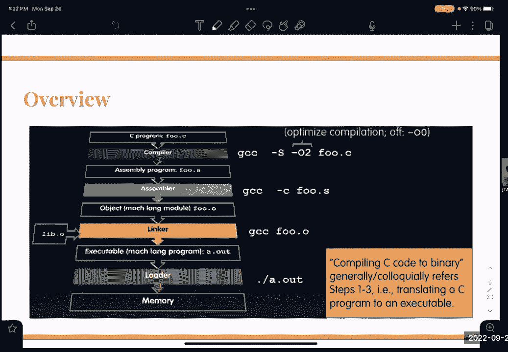

# 📚 课程 P19：RISC-V 过程、ISA 与调用约定

在本节课中，我们将学习程序编译与链接的完整流程，并深入探讨 RISC-V 指令的翻译过程。课程内容分为三个主要部分：编译器、汇编器与链接器的工作流程，RISC-V 指令的二进制翻译，以及函数调用约定。我们将从宏观的软件构建过程开始，逐步深入到具体的指令编码细节。

## 🛠️ 编译器、汇编器与链接器

上一节我们概述了课程内容，本节中我们来看看程序从源代码到可执行文件的完整构建流程。这个过程涉及多个工具，它们各司其职，协同工作。

一个典型的构建流程包含以下步骤：
1.  **编译器**：将高级语言（如 C、C++）源代码转换为汇编语言。
2.  **汇编器**：将汇编语言转换为目标文件。
3.  **链接器**：将一个或多个目标文件及库文件合并，生成最终的可执行文件。
4.  **加载器**：将可执行文件加载到内存中并运行。

以下是每个步骤的详细说明：

*   **编译器**
    编译器接收高级语言代码，输出优化的汇编代码。其输出可能包含伪指令和相对寻址（例如跳转指令中的偏移量）。编译器的主要职责是生成高效的汇编代码，而非直接的机器码。

*   **汇编器**
    汇编器接收汇编文件（`.s` 或 `.asm`），生成目标文件（`.o`）。这是本部分的核心。目标文件包含多个关键部分：
    *   **文本段**：存放已翻译成二进制的机器指令。
    *   **数据段**：存放程序中的静态数据（如全局变量、字符串常量）。
    *   **符号表**：记录本文件中定义的所有标签（如函数名、循环标签）及其在文件中的位置（地址）。
    *   **重定位表**：记录那些引用了但尚未知位置的标签（例如，引用了其他文件中的函数）。这些“未解决的引用”将在链接阶段处理。
    汇编器的工作通常需要**两趟扫描**：第一趟建立符号表，第二趟利用符号表解析指令中的标签引用，并填充重定位信息。

*   **链接器**
    链接器接收所有目标文件和库文件。它的工作包括：
    *   合并所有文件的文本段和数据段。
    *   解析所有目标文件的重定位表，将符号引用替换为最终的绝对内存地址。
    *   生成一个完整的可执行文件。链接器处理的是绝对寻址。

*   **加载器**
    操作系统的一部分，负责将可执行文件载入内存，分配栈空间，初始化寄存器，并开始执行程序。

## 🔢 RISC-V 指令翻译

理解了程序如何被构建后，我们来看看构成程序基础的机器指令是如何表示的。本节我们将学习如何将人类可读的 RISC-V 汇编指令翻译成计算机执行的二进制码。

RISC-V 指令是固定长度的（32位），其格式根据类型不同，划分为不同的字段。主要指令类型包括 R型（寄存器-寄存器）、I型（立即数）、S型（存储）、B型（条件分支）、U型（长立即数）和 J型（跳转）。

以下是将汇编指令 `addi x9, x0, -24` 翻译为二进制的过程：

1.  **确定指令类型和字段**：`addi` 是 I 型指令。其字段构成如下：
    *   `imm[11:0]`：12位立即数
    *   `rs1`：5位源寄存器1
    *   `funct3`：3位功能码
    *   `rd`：5位目的寄存器
    *   `opcode`：7位操作码

2.  **查找各字段值**：
    *   `opcode`：`addi` 的操作码是 `0010011`。
    *   `funct3`：`addi` 的功能码是 `000`。
    *   `rd`：目的寄存器是 `x9`，对应二进制 `01001`。
    *   `rs1`：源寄存器是 `x0`，对应二进制 `00000`。
    *   `imm`：立即数是 `-24`。需要将其转换为12位二进制补码。
        *   先求24的二进制：`0000 0001 1000`。
        *   按位取反：`1111 1110 0111`。
        *   加1：`1111 1110 1000`。这就是 `0xFE8`。

3.  **组合字段**：按照 `imm[11:0]` | `rs1` | `funct3` | `rd` | `opcode` 的顺序组合。
    *   立即数 (`-24`): `1111 1110 1000`
    *   `rs1` (`x0`): `00000`
    *   `funct3`: `000`
    *   `rd` (`x9`): `01001`
    *   `opcode`: `0010011`
    *   最终二进制：`1111111010000000000010010010011`
    *   转换为十六进制：`0xFE800493`。

反向操作（从二进制到汇编）的过程则是：先转换为二进制，根据最后7位 `opcode` 确定指令类型，再根据 `funct3` 等字段确定具体指令，最后解析出寄存器编号和立即数字段。

## 🤝 函数调用约定

掌握了指令的表示方法后，我们需要了解程序运行时，函数之间如何协作。这就是函数调用约定的作用，它定义了函数调用过程中寄存器如何使用、栈如何管理。

RISC-V 调用约定主要涉及以下几类寄存器：
*   **a0-a7** (`x10-x17`)：参数寄存器，用于传递前8个整数或指针参数。`a0` 和 `a1` 也用于返回值。
*   **ra** (`x1`)：返回地址寄存器，存放 `jal` 指令后的下一条指令地址。
*   **sp** (`x2`)：栈指针寄存器，指向当前栈顶。
*   **s0-s11** (`x8-x9`, `x18-x27`)：保存寄存器，被调用函数必须保证它们的值在函数返回前后不变。
*   **t0-t6** (`x5-x7`, `x28-x31`)：临时寄存器，调用函数不能假设它们在函数调用后保持不变。

以下是函数调用和返回的基本步骤：

*   **调用函数**：
    1.  将参数放入 `a0-a7`。
    2.  使用 `jal ra, target` 指令跳转到目标函数，同时将返回地址存入 `ra`。

*   **被调用函数（序言）**：
    1.  如果函数会使用保存寄存器 (`s0-s11`)，则将它们的旧值压入栈中保存。
    2.  调整栈指针 `sp`，为局部变量分配空间。

*   **被调用函数（正文与结尾）**：
    1.  执行函数主体逻辑。
    2.  将返回值（如果有）放入 `a0`（和 `a1`）。
    3.  恢复之前保存的寄存器值。
    4.  调整栈指针 `sp`，释放栈空间。
    5.  使用 `jalr x0, 0(ra)` 指令跳转回调用者。

关于栈，它不仅用于保存返回地址和寄存器，当函数内的局部变量或临时数据过多，寄存器不够用时，也会使用栈来存储这些数据。因此，栈的操作可能发生在函数内部的任何地方，而不仅仅是序言和结尾。

## 📝 总结

本节课中我们一起学习了软件构建的核心工具链：编译器负责生成优化汇编代码，汇编器负责生成包含符号和重定位信息的目标文件，链接器负责合并文件并解析地址生成可执行文件。我们还深入学习了 RISC-V 指令的二进制编码格式，并通过实例练习了汇编与二进制之间的翻译。最后，我们探讨了 RISC-V 的函数调用约定，理解了寄存器分类、栈帧管理以及函数调用与返回的规范流程。这些知识是理解程序底层运行机制和进行系统编程的基础。