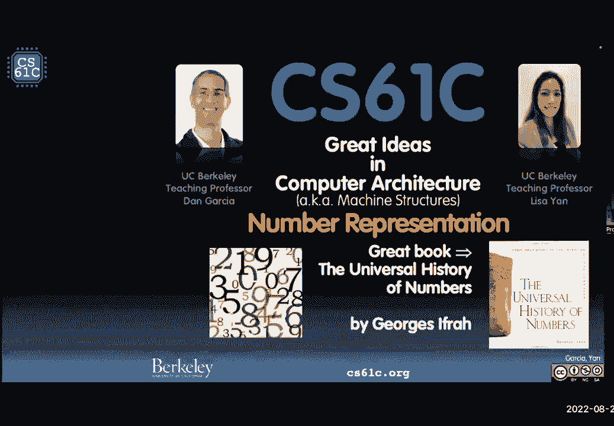

# 课程 P2：数字表示法 🔢

在本节课中，我们将学习数字在计算机中是如何被表示的。我们将探讨模拟信号与数字信号的区别，理解比特（bit）如何成为信息的基本单位，并学习二进制、十进制和十六进制数制之间的转换。最后，我们将了解几种不同的整数编码方式，包括无符号数、原码、反码、补码和移码。

## 概述：从模拟世界到数字世界 🌍

现实世界本质上是模拟的。例如，声音的振幅或电压的变化是一条连续的曲线。为了在计算机中处理这些信息，我们需要将其转换为数字形式。这个过程主要分为两步：**采样**和**量化**。

采样是在固定时间间隔内测量模拟信号的值。量化则是将采样得到的连续数值，映射到一个具有有限个离散值的标尺上。

并非所有数字数据都来自现实世界的采样。计算机程序也可以直接生成数字信息，例如三维图形或文本。关键在于，**比特可以代表任何事物**。

## 比特：信息的基本单位 ⚙️

一个比特（bit）是二进制数字（binary digit）的缩写，它只有两种状态：0 或 1，开或关。

**核心概念**：`N` 个比特最多可以表示 `2^N` 种不同的事物。

例如，5个电灯开关（每个代表一个比特）有 `2^5 = 32` 种不同的设置，足以存储26个英文字母。为了存储大小写字母和标点符号，我们通常使用8个比特，即一个字节（byte），这对应着早期的ASCII编码标准。如今，更通用的Unicode标准（如UTF-8, UTF-16）可以表示全球各种语言的字符，甚至包括表情符号。

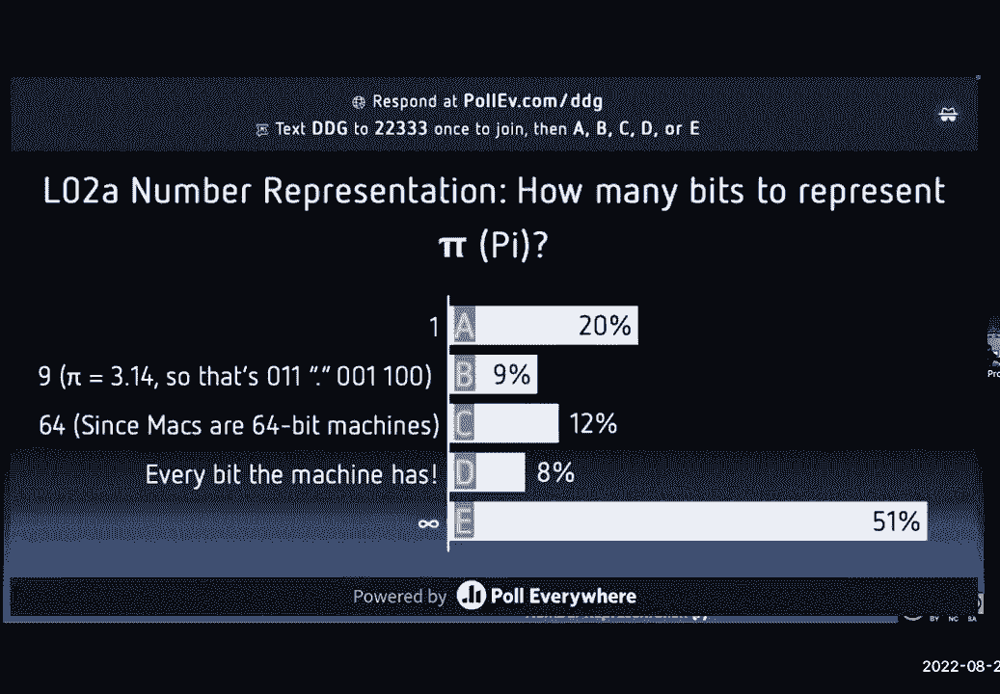

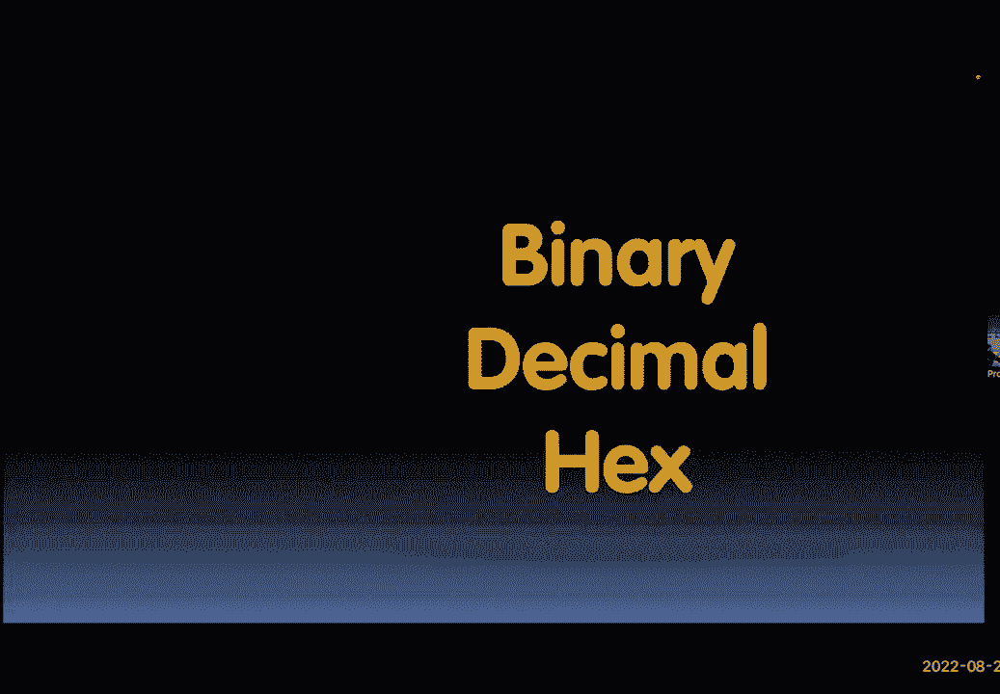

比特还可以表示逻辑值（真/假）、颜色、地址、命令，甚至情感——只要你能为其分配一个位模式。

## 数字与数码的区别 🔤

在深入数制之前，区分“数字”（number）和“数码”（digit）至关重要。
*   **数字**是抽象的概念，是“数轴”上的一个点。
*   **数码**是用于表示数字的符号。

例如，数字“四”是一个概念。但它可以用数码“4”（阿拉伯数字）、数码“IV”（罗马数字）或数码“100”（二进制数码）来表示。因此，我们有二进制数码、十进制数码，但没有“二进制数”这种说法——数本身是统一的，只是表示它的数码系统不同。

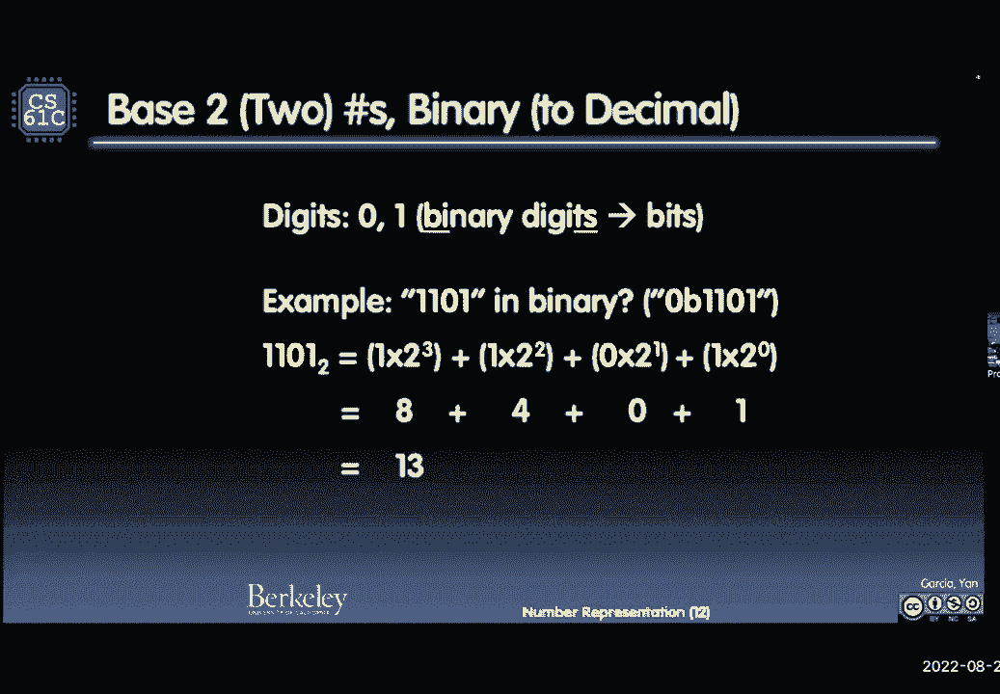

## 数制转换：二进制、十进制与十六进制 🔄

上一节我们明确了数码的概念，本节中我们来看看不同进制数码之间的转换。计算机科学中常用的进制有二进制（基数为2）、十进制（基数为10）和十六进制（基数为16）。

### 通用位置记数法

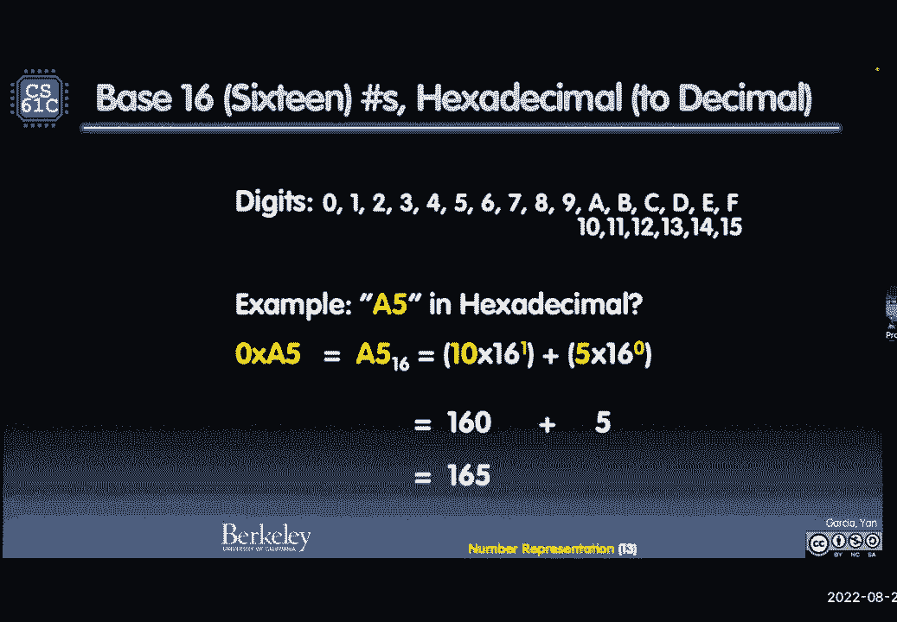

任何进制的数码都可以按位权展开。一个多位数码的值等于每位数码乘以该位基数的幂次之和。
通用公式为：
`(d_n d_{n-1} ... d_1 d_0)_b = d_n * b^n + d_{n-1} * b^{n-1} + ... + d_1 * b^1 + d_0 * b^0`
其中，`b`是基数，`d`是每位上的数码。

### 二进制、十六进制转十进制

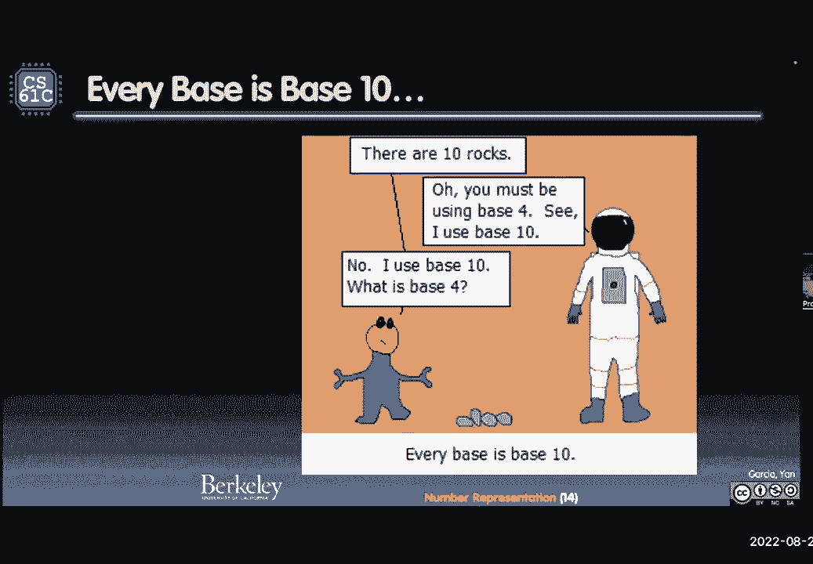

直接应用上述公式计算即可。
*   **二进制示例**：`(1101)_2 = 1*2^3 + 1*2^2 + 0*2^1 + 1*2^0 = 8 + 4 + 0 + 1 = (13)_10`
*   **十六进制示例**：`(A5)_16 = 10*16^1 + 5*16^0 = 160 + 5 = (165)_10`
  在代码中，常用`0b`前缀表示二进制，`0x`前缀表示十六进制，如`0b1101`, `0xA5`。

### 十进制转二进制/十六进制（除基取余法）

这是一个通用的算法：用目标基数`b`不断去除十进制数，并记录余数，直到商为0。最后，将余数**从后往前**排列，即得到目标进制的数码。

**形象理解（以转二进制为例）**：假设你要退回13个鸡蛋，但快递盒只有固定容量（8个、4个、2个、1个）。你希望用最少的盒子。你先看8格盒能否装下13？能，就用一个，剩下5个。再看4格盒能否装下5？能，用一个，剩下1个。2格盒装不下1，用0个。最后用1个1格盒。所以编码为`1101`。

### 二进制与十六进制间的快速转换

这是最便捷的转换，无需经过十进制。
**核心原理**：一个十六进制数码恰好对应4个二进制比特（因为 `2^4 = 16`）。

以下是二进制、十进制、十六进制（0-15）的对应表，建议熟记：

| 十进制 | 二进制（4位） | 十六进制 |
| :----- | :----------- | :------- |
| 0      | 0000         | 0        |
| 1      | 0001         | 1        |
| 2      | 0010         | 2        |
| 3      | 0011         | 3        |
| 4      | 0100         | 4        |
| 5      | 0101         | 5        |
| 6      | 0110         | 6        |
| 7      | 0111         | 7        |
| 8      | 1000         | 8        |
| 9      | 1001         | 9        |
| 10     | 1010         | A        |
| 11     | 1011         | B        |
| 12     | 1100         | C        |
| 13     | 1101         | D        |
| 14     | 1110         | E        |
| 15     | 1111         | F        |

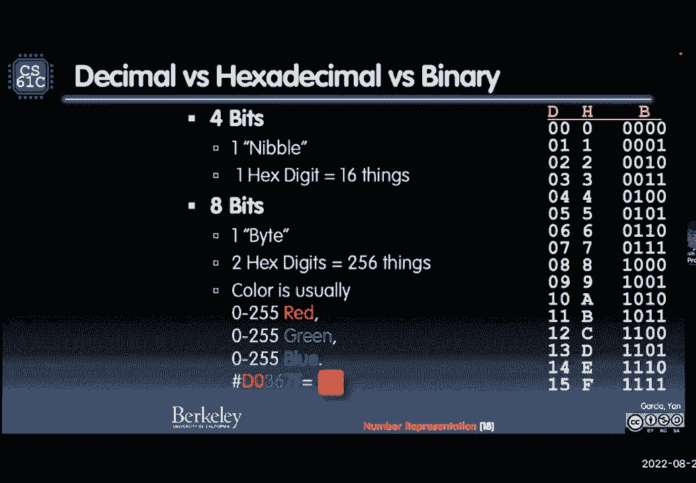

**转换方法**：
*   **二进制 -> 十六进制**：从**右**向左，将二进制数每4位分成一组（最左边不足4位则补0），然后查表替换。
  `11010111` -> 分组`(1101)(0111)` -> 查表得`D7`，即`0xD7`。
*   **十六进制 -> 二进制**：将每个十六进制数码直接展开为4位二进制。
  `0xE3` -> `E`为`1110`, `3`为`0011` -> 合并得`11100011`。

十六进制表示非常紧凑，效率是二进制的4倍，常用于表示内存地址、颜色代码（如网页颜色`#D0376F`）等。

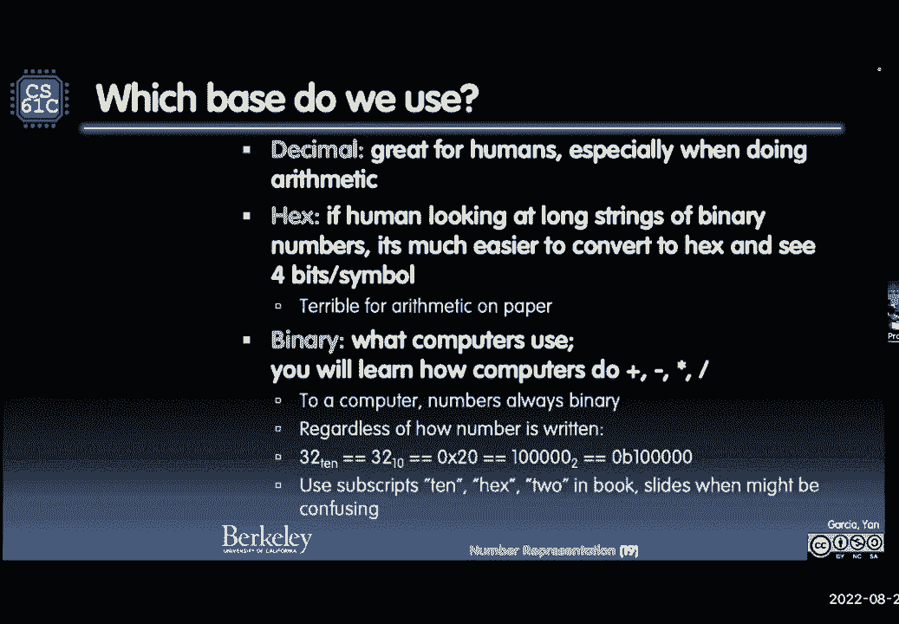

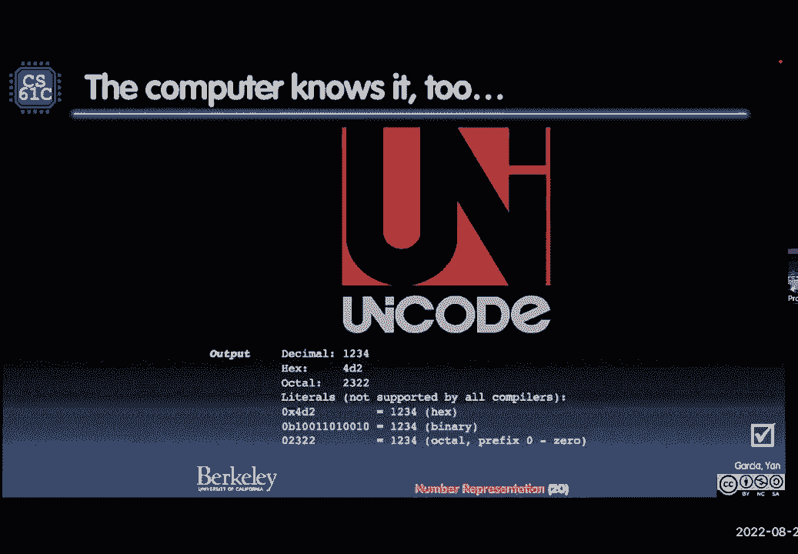

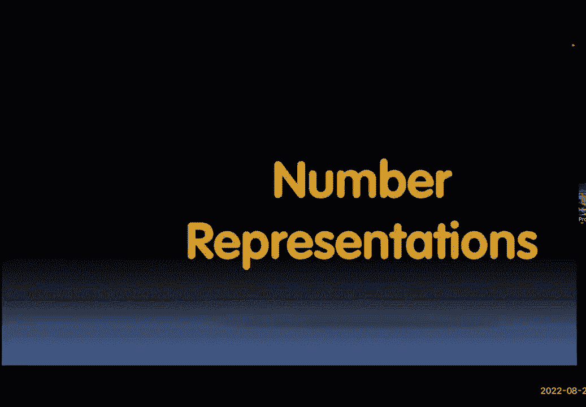

## 计算机中的整数编码 🧮

计算机的存储空间是有限的，这意味着我们只能用固定数量的比特来表示数字。这导致了“天下没有免费的午餐”——增加一种功能（如表示负数）往往需要牺牲另一种功能（如表示的范围）。

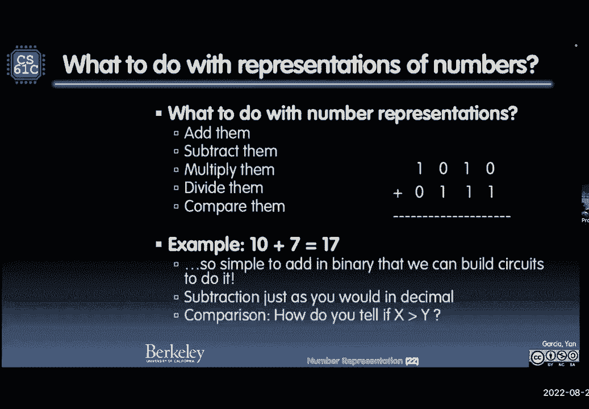

### 无符号编码

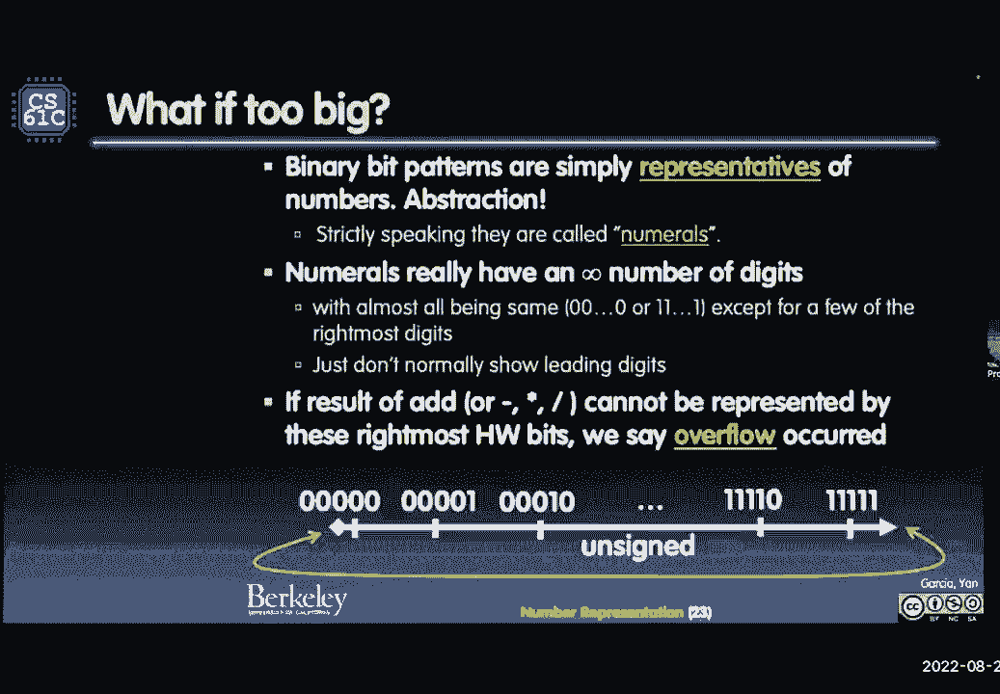

最简单的编码。所有比特都用于表示数值大小。
*   **范围**：对于`w`比特，可表示 `0` 到 `2^w - 1`。
*   **溢出**：当计算结果超出这个范围时，会发生“环绕”，就像汽车里程表从99999变回00000。

### 原码

用最高位（最左边）作为符号位：`0`表示正，`1`表示负。其余位表示数值的绝对值。
*   **问题**：存在`+0`(`0000`)和`-0`(`1000`)两个零。进行加减运算的电路设计复杂。

### 反码

正数的表示与原码相同。负数则是将其对应正数的**所有比特取反**（1变0，0变1）。
*   **问题**：同样存在`+0`(`0000`)和`-0`(`1111`)两个零。

### 补码（现代计算机标准）

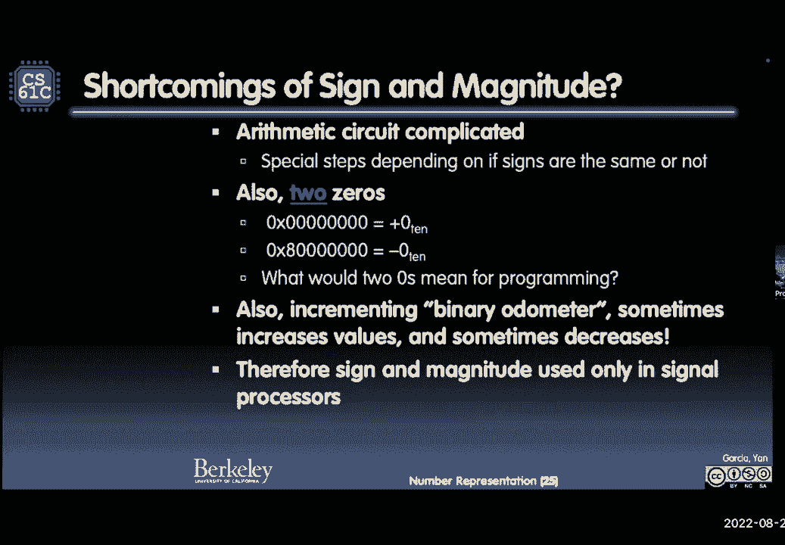

这是现代计算机表示有符号整数的标准方式。
*   **正数**：表示与原码相同。
*   **负数**：将其对应正数的**所有比特取反后加1**（即“取反加一”）。
*   **优点**：
    1.  唯一的零：`0000`。
    2.  加减法运算电路可以统一，非常高效。
    3.  范围对称且连续：对于`w`比特，范围是 `-2^{w-1}` 到 `2^{w-1}-1`。例如8位补码范围是-128到127。

**求值公式**：对于补码数码 `(b_{w-1} b_{w-2} ... b_0)`，其值为：
`-b_{w-1} * 2^{w-1} + Σ_{i=0}^{w-2} b_i * 2^i`

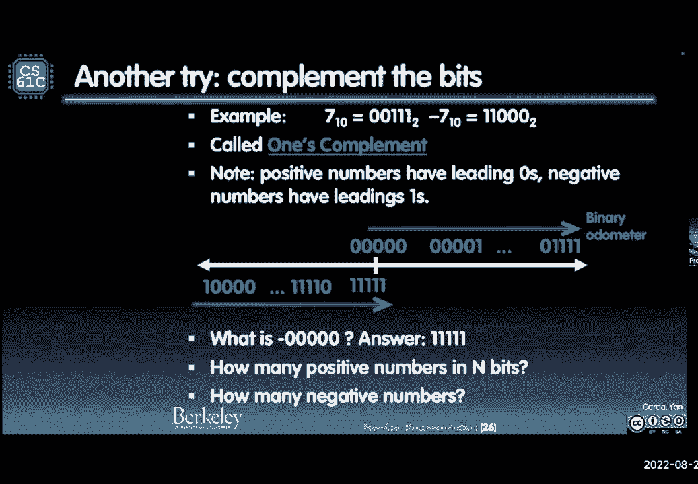

### 移码

主要用于浮点数的指数部分。其思想是将所有数码表示的值**整体平移一个固定的偏差**。
*   **方法**：`移码表示的真值 = 无符号解释 - 偏差`。通常偏差取 `2^{w-1} - 1`。
*   **特点**：移码表示中，所有比特为0时对应最小的负数，所有比特为1时对应最大的正数。它简化了浮点数比较大小的问题。

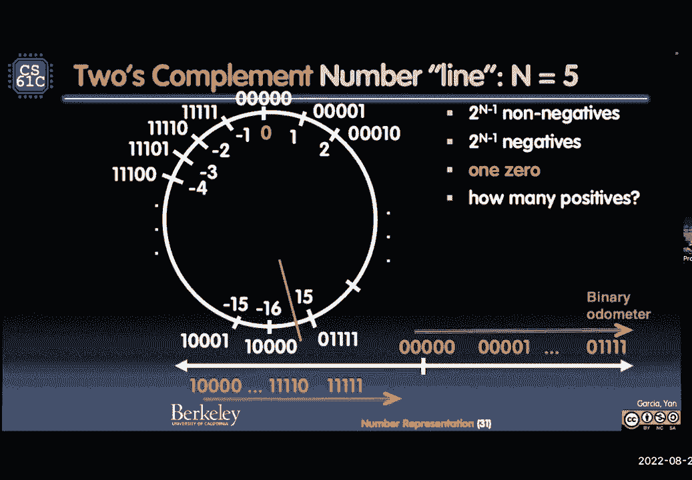

## 总结 📚

本节课中我们一起学习了数字在计算机中的表示方法。
1.  我们理解了从模拟信号到数字信号的转换过程（采样与量化）。
2.  我们掌握了比特作为信息基本单位的概念，知道`N`比特可表示`2^N`种事物。
3.  我们区分了“数字”与“数码”，并熟练掌握了二进制、十进制和十六进制数码之间的相互转换。
4.  我们探讨了五种整数编码方案：
    *   **无符号编码**：仅表示非负数。
    *   **原码**：直观但存在双零，运算不便。
    *   **反码**：过渡方案，仍有双零问题。
    *   **补码**：现代计算机标准，解决了双零问题，运算高效。
    *   **移码**：主要用于浮点数指数编码。

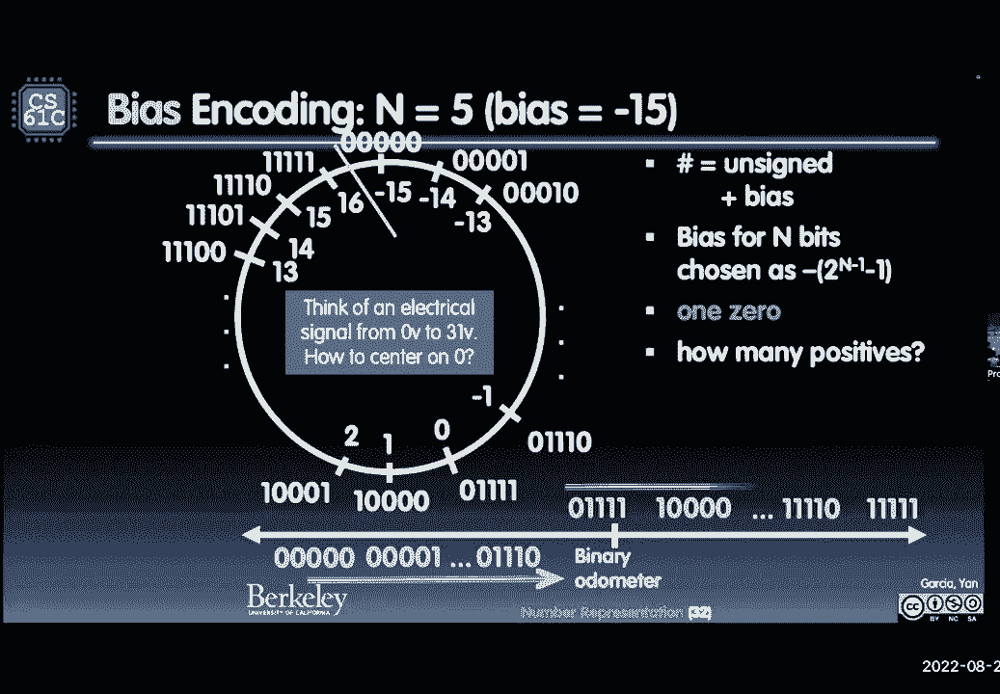

记住核心原则：**天下没有免费的午餐**。在有限的比特内，任何一种编码方案都是在范围、精度、运算复杂度等方面进行权衡的结果。补码因其卓越的平衡性成为了整数表示的事实标准。

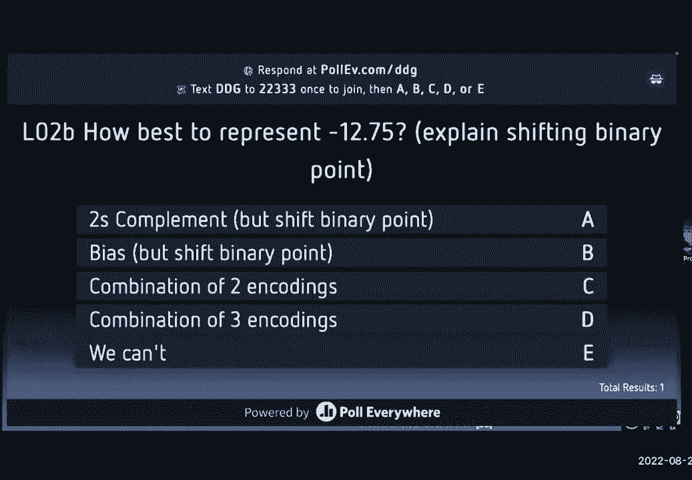

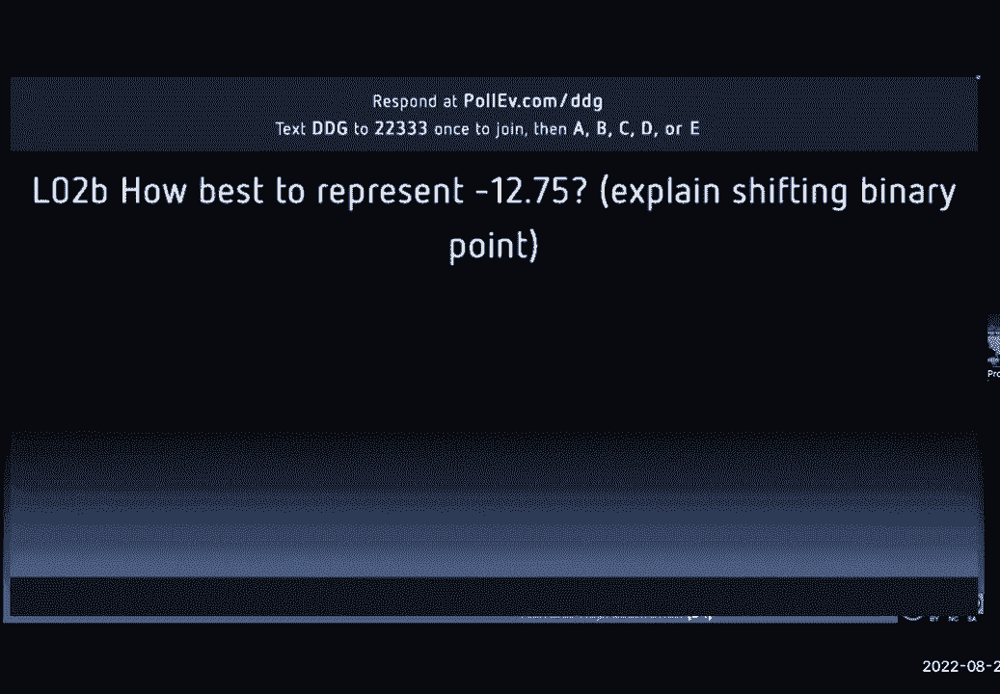

