# P20：Lecture 15 Combinational Logic - 这样好__ - BV1s7421T7XR

好啦，我们开始吧，我们总是在新闻里做计算，欢迎大家回来，C六C宇，嗯计算新闻，你看到了这个，你看到这张幻灯片了，其中谈到了联合国，浮点，什么是浮点，如果你还记得浮点，指数有固定的位数，螳螂的固定比特数。

你还记得吗，有人说好，你为什么不能改变，这不是很疯狂吗？尾数和指数之间的那条线，能够有非常大的数字或非常小的数字，如果你需要这么做，通过改变这些比特，这就是你的目的，就是这个意思。

这就像又一个间接的层次，在螳螂和指数之间的那条线，什么叫，所以这三个承诺都是一个浮点，什么是浮点，声称说，电源位置是硬件友好的Unhere版本有趣的是，我刚在新闻里看到这个。

所以记住Unum这个词是一个新的想法，它们也被称为假设，稍微调整一下让硬件更友好，我刚刚看到新闻说一个新的数字，等一下等一下，我们教你假设，我们有一张幻灯片是关于假设可以提高人工智能的数学。

那不是很迷人吗？所以这所西班牙大学的科学家们开发了一种处理器核心，所以可以部署定位标准的硬件，比标准浮点改进的数字表示形式，硬件中的算术处理器，他们说的是，它在矩阵乘法精度方面提高了四个数量级。

不损失计算时间，假设可能会加快，人工智能训练，因为你不会在路上丢失太多信息，这里有一条关于什么时候假设更好的小线条，你注意到就在我们中间的山上，紫色的质点比浮点标准好，所以这是一个有趣的，他们更坏。

其他时候对，天下没有免费的午餐，这将是一个浮动比假设更好的情况，积极因素比花车好，如果你呆在碰巧是那个领域的世界里，正或优于浮动，也许假设是一件更好的事情，那是我最酷的事。

我刚了解到这个假设现在得到了一些支持，这是一件有趣的事情，好啦，我其实很喜欢第一节课之后的这节课。

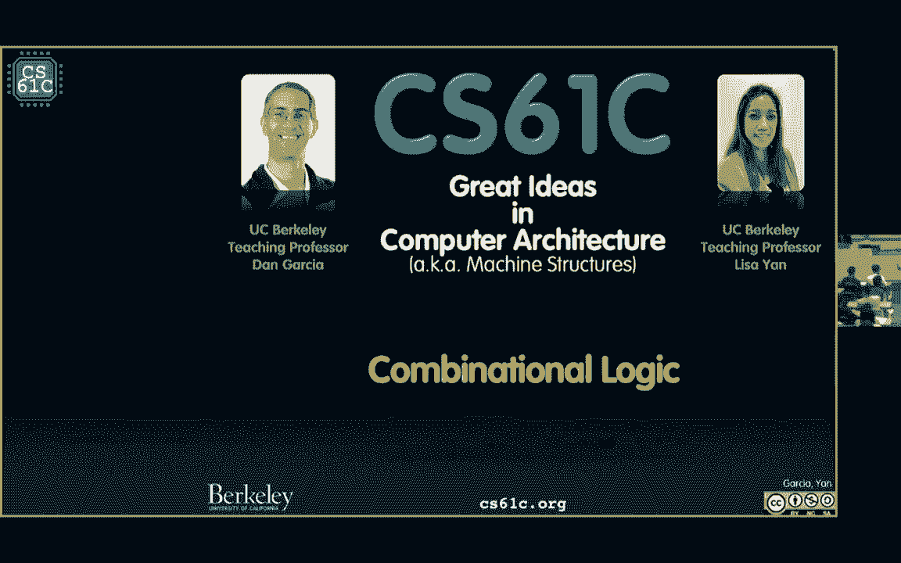

所以我准备了这个，其实在线上，我们把它搬来搬去，所以我有点，我做的就像啊。

就像什么是足球短语，就像一个声音，我做了一个声音，我没告诉任何人就改了，所以那个人去拿副本，我向你道歉，I，他们带错了副本，但是整个星期的拷贝都完成了，所以他们只是去拿一套新的副本。

所以当你拿到新的副本。

我们今天要讲组合逻辑，这就是我所准备的，所以我们要这么做，但我们要把它换成州，我们上次就是这么做的，好吧，我们开始组合逻辑，我觉得第一节课之后会比较流畅，所以我做了一个声音，并改变了它。

所以你们在线的人，把第二套幻灯片拿出来，确保你在那里，班上的人会给你更好的讲义，我请客，因为我做了录音，没有让我的员工知道，所以说，我向他们两桌道歉，这是一个四输入，一个输出框，很简单，组合逻辑。

逻辑比状态元素容易多少，所以我想这么做，这就是为什么我做了听觉，所以这里是F，这就是为什么，这是真值表，你看起来很好，但是丹，你不一定要有一个1或零吗，你知道的，abcd，以下是B、C和D的16个选项。

你看着这个想法，好啦，那就是函数是函数，你可以去薯条店买，一种特殊的功能，它的作用是，这是一个，它真正的桌子是什么样子的，不管是什么，最下面一行是什么，就是那个函数返回的东西，如果你给它所有的。

最上面的一排是什么，函数返回的是什么，你给它所有的零，中间那一排是什么？函数返回的是什么，如果第一个是你知道8的情况f是1，剩下的都是零，那么做什么和看什么，我知道什么不是，看起来只是一般。

它看起来像四个输入，从真值表上看是什么，如果我知道输入前的内容，看起来像，是啊，是啊，去吧，告诉我你的名字，埃里克去所有零除了，只有当a和b和c和d为一时，它们才是，全是零，除了最下面一行是一个。

一个怎么样，或者你能告诉我，告诉我一个或可能是什么样子，顺便说一句，这是你去薯条的盒子之一，你去薯条，那是其中之一，另一个是什么，一个或者是的怎么样，告诉我你的名字，你觉得呢，除了最上面的一排，正确。

那是四个输入，或者上面写着，如果他们中的任何一个，你是一个，只有当他们都是零的时候你才是零，好啦，对于输入来说有点意义，所以现在我问你们，我给你们举了多少这样的设备，两个设备，一个是N，一个是一个。

或者有多少这样的设备存在于薯条和薯条，经理说，你得掩护，我们所能建立的每一个可能的功能，他们有多少人，一个非常有趣的问题，员工提供每一个可能的功能有多难，就在那里，每个f和都是一或二，至少有两个。

怎么样？是呀，你一帆风顺，快跑，从2号到16号，你怎么知道的，完全正确，你怎么知道的，头向左转，让我们做一个表情符号，头向左转，每个人，头向左转，这是一个16位的数字，这不是一个16位的数字吗。

每一个可能的16位数字，是一个可能的函数，那不是很整洁吗，我们看到了一个零的那个，我们看到了一个是一个和一个，或者每一个可能的16位数字，令人着迷的是，包括那个全是零的，那是什么？没关系，你放的东西。

我将是零，那不是很迷人吗？那是个好主意，所以好好想想，头向左转，你看这些f都是16位的数字，每一个可能的组合都是一个可能的函数。

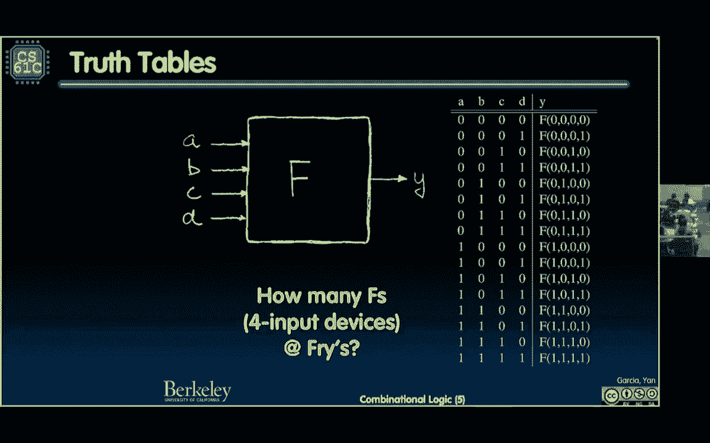

让我们看一些真值表的例子，你以前见过这个，我们把这个叫做XOR，每个人都去了XOR，也称为，倒置，你还记得我们看到，就是这样，这就是为什么没有不是不是伪指令，因为它实际上是用异或来反转，当有一个。

为什么如果我看着一个，让我们，让我们把a定格在0，当a为零时，你在干什么？只要说b不管b是什么b起源b对b当a是1时，什么是y不是b，所以它是一个条件逆变器，你几乎可以让a在某种意义上决定y对b的作用。

这意味着我们现在可以看一个真值表，以一种会让你大吃一惊的方式，这让我大吃一惊，当我看到，这个还是很美，准备好了，这里有一个新的方法来看待，它，那不是很美吗？A是零，Y是B，所以你可以写B和A。

真理表中的b和c，不仅仅是1和0，但实际上这样想更有意义，这告诉你它是一个比这更有条件的vertemore，超过四行，两排的第一排说这显然是一个条件逆变器，它是否反转b，那不是很整洁吗。

这就是为什么我们没有直接的指示，我们将使用伪指令x或为我们做这项工作，这就是为什么它被称为减少风险的指示，让别人做那工作吧。

好的好的，这是一个两位加法器，这就是为什么我想用这个讲座，我们刚刚谈到了加法器，这是最后一堂课，我们谈到了加法器，这里有一个二位加法器，我说我记得我站在那里说，如果我们有n个比特进来。

你应该有超过n位出来，为什么？因为当你加上两样东西，如果他们都是，你会有超过n个比特出来，所以如果我在左边有两个比特，右边两位，我应该有两个以上的，因为什么，如果这个携带，你得解释这一点。

所以这就是再次制造加法器的逻辑。

这是我的声音，我真的很喜欢思考这个。

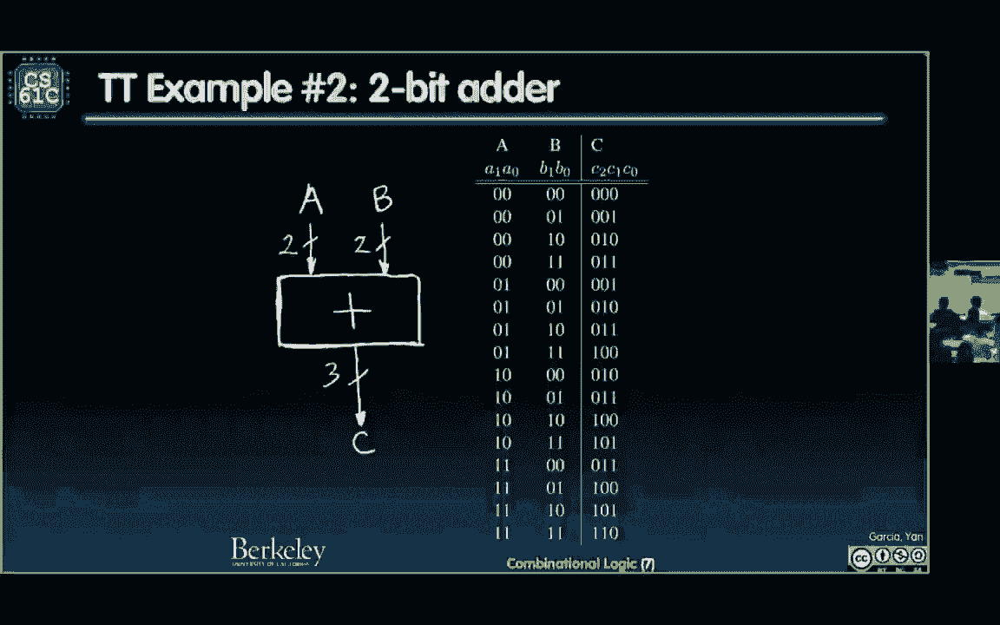

因为它确实来自于我们上次的谈话，让我们来看看，所以选一个拾取器，从ab中选择一个值是a是2，就像我几乎在排的底部，你看不到变焦，我只是在这里展示这个，所以a等于3 b等于0，三加零等于三，三加一怎么样。

啊，那是四个，看到这一切只是工作，如果你仔细检查每一行，每一行都有意义，也就是说，你只需要三个比特就可以得到两个比特加两个比特，三块而已，n位加m位等于n加1位，因为这是最糟糕的情况，最坏的情况。

最坏的情况是什么，所有的人和所有的人，当你把任何东西成比特翻倍时会发生什么，你只要向左移动一点，都是带a的，右边有个零，看最下面一行，女士们先生们，都是右边有零的，所以你只需要n加1位来输入n位，夏天。

这是一个n位加法器，这是一个两位加法器，三位输出任何问题，是的，问题告诉我，我走了，你必须用真相来代表版本吗，哦，我喜欢，我喜欢，问题是你必须用真值表来解决这个问题吗，或者有什么更聪明的方法。

也许我可以用一个小加法器做一个加法器，通过巧妙地布线，我们可以做到这一点，所以呆在那里，下节课的问题，我们可能没有选择桌，我们其实可以建一个，阿多尔，去薯条女人。

然后用正确的方式把它们连接起来有很多位加法器，做两个位出来，如果我喜欢这个主意，说吧，把那个好问题留在干得好上，好吧，一般情况下，在实际计算它们之前有多少行，这是多少行，多少行，总的来说，多少行。

因为如果我有，你做什么，你怎么知道，你怎么，无论我要求什么，多少行，你做什么，你说的第一句话是什么，每样东西都有一排，每个人都有一排，对呀，你有多少个输入，我数了四个输入，所有在前两名的人都是A，2。

B，那是四个，二乘四等于十六，让我们看看那里的十六行，做四行，我们看到了同样的事情，所以输入的数量，二到二是行数，你会有所有的权利。

所以现在我要说，这里有一个，这是三十块钱，两个来吧宝贝，咬了她两口，太感谢你了，太感谢你了，顺便说一下，是我的错，不是你的错，我的错，我只想说一点助教的事，非常感谢你的帮助，所以我们有新的讲义。

我做的听力完全在我身上，我切换到周围的讲座，但没告诉任何人，你说过，但是丹，我们说的是五险系统，我们要加上32个比特数，对呀，一直以来，大约是32位的数字，不是关于这些小数字，是关于，你有问题要问我吗。

或者你只是想出去，是呀，所以32位数字，所以这是我的，让我们从这里开始，这有点像是，我们刚刚，这就是我们要做好这件事的方法，让我们来看看，以下是所有可能的三个二位值，从十六进制零到八进制，十六进制f。

32位0到3位2位1，B也一样好吧，准备好了，开始了，多少行，2到64好的，我们开始吧，好啦，大家开始，你先拿四分之一怎么样，然后你拿的这个区域，开什么玩笑，我们不打算建造这个，我们不会去想这个。

太多了，我们会更聪明，如何构建关于其他部分的加法器。

好啦，我们会讲到这一点的，但那真的很酷，让我们来谈谈，让我们来谈谈只是有一些乐趣，看常规逻辑，逻辑是，我觉得最简单的，对我来说最直观的东西，对你来说很难，没关系的，但我发现这对我来说真的很直观。

这就是所谓的多数回路，三个输入，多数电路，让我们来看看这个，这是干什么，它基本上是在说，我有这些零件，输出奇数，奇数位，所以总得有人赢，没有领带，这是否有意义有一个四输入多数电路，没有那么多。

你可能有一点，上面写着他们打成平手了吗，也许你会有一个像谁赢了一样的输出，如果领带系得很高，如果不是泰国菜，谁赢了，你可能有那个，你可以想一个偶数，但现在应该很简单，我们有偶数个输入。

多数就是多数的选票是对的，谁将赢得两位候选人，零是那些看那看每一行，每一行都是大多数，三个一，是一二一，是一二一，是一二一，就是那个，所有是两个零的，是零或三个零，是零，是啊，是啊，那很干净。

所以你有一个多数巡回法院，只是一些有趣的东西，所以更多精彩的真值表的例子。

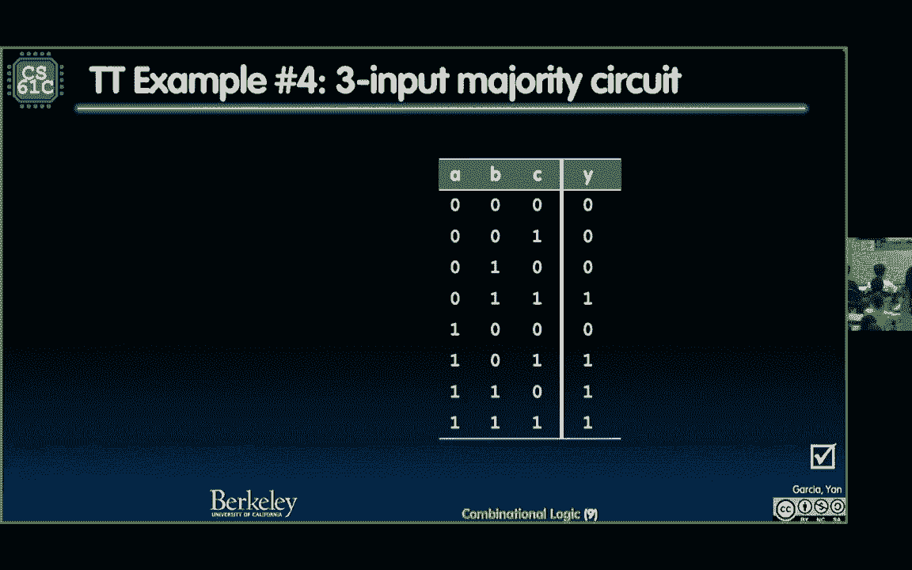

逻辑门，是呀，问题，告诉我，是呀，亚当亚当对，是啊，是啊，是啊，是啊，走呀，走呀，你为什么需要，我们会想出办法的，就像一个小秘密，它就像未来有用的电路，我是说你会明白为什么这有点放得开的。

让我们做逻辑门，你已经看过了，这就是为什么我认为这堂课比另一堂课容易一点，比一个状态电路，尽管最后一个我以注册文件结束，我想回到组合逻辑学，好啦，你已经看到了它的形状，那是方框图，一个电器是。

如果我想说会有一个合乎逻辑的，在这里我们看到了如何建造它，我们实际上看到了如何建造它，随着电流的流动，我们看到你现在已经可以建造了，因为你知道我给你看的。

我向你展示了如何把一些东西连接在一起制造其他东西，所以我们开始了，这是我的，这是我的，或者是逻辑门，那是形状，那是一个结，这是你第一次看到这个看这个。

它就像一个三角形，看起来像一个缓冲器，如果你有一个三角形，这叫缓冲器，但最后有个小圆圈。

这就是Notts的符号，它是一个末端有一个圆的小三角形，指示b将与a相反。

所以现在你可以再说一遍，我要放大，我想出了这个，我从没在别的地方见过，所以我提出索赔。

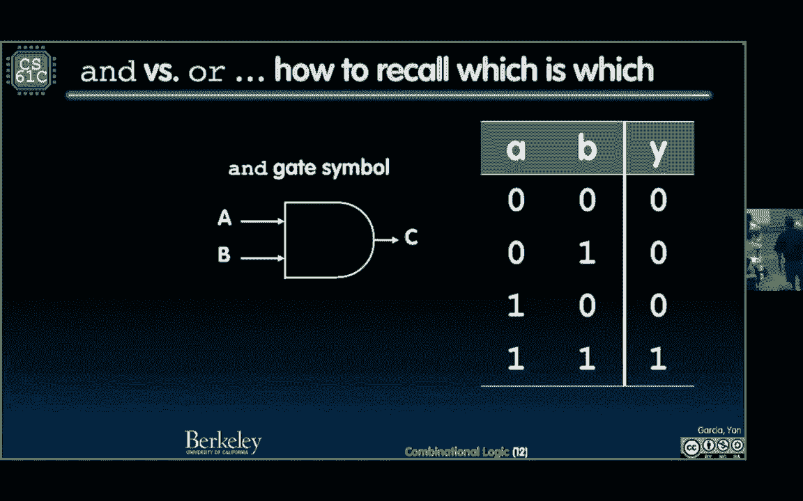

你怎么记得，那是这两种形状中的哪一种，对于这两个形状。

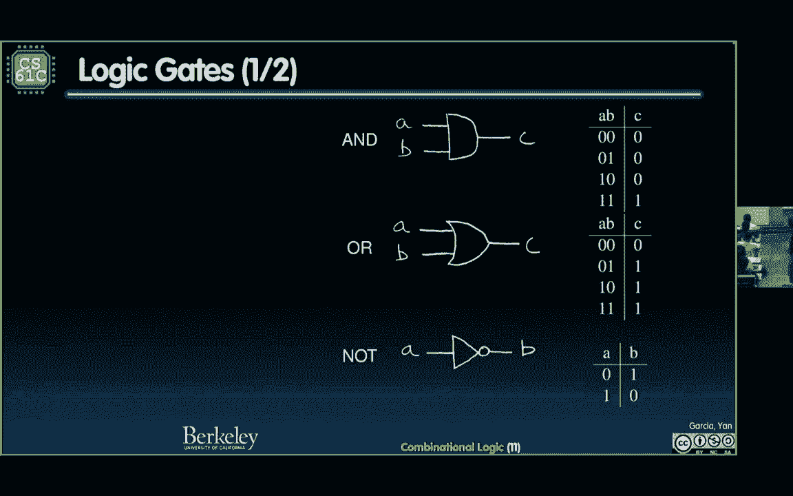

一条直线，也就是曲线，如果你总是忘记，你知道我是怎么想的，D D看起来像形状，所以我编造了这个，我花了一个小时把字体弄得恰到好处，所以很符合图片，那真的很有趣，那是对我时间的很好利用，字体恰到好处。

又大又老，有你的和，别忘了哪一个是。

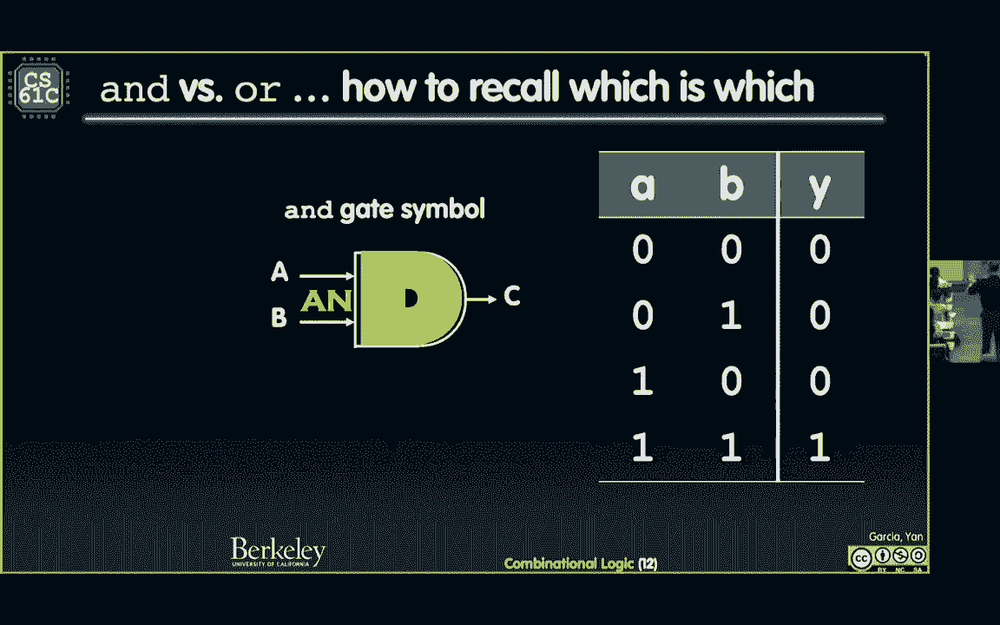

和和或我永远不记得，你就是这么记得的，希望能有所帮助，这里有一些更有趣的逻辑门，这是你知道的X，或者我们只是说说而已，这就是它的形状，哦哦，它是一个或像一个，就像第二行，你看第二行，这是钥匙。

不要划清界限，穿过这条线的a线和b线，让他们停在第一线，所以有一个小曲线，这就像一个坡道什么的有曲线，不要画那些贯穿内心的a线和b线，或者让他们停在左边。

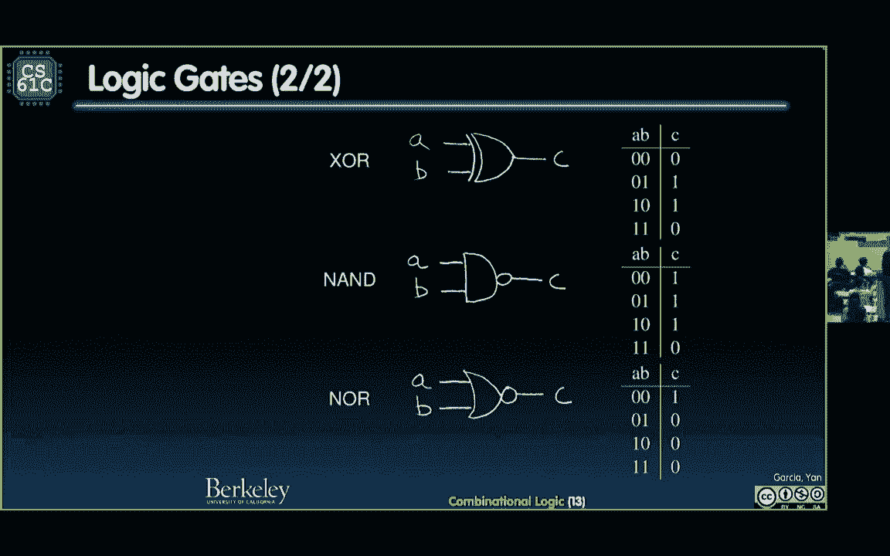

如果你已经看到这是一个小圆圈。

意思是一个结，你要说，啊，圆表示没有圆表示相反，这不是，所以现在，你会怎么画一个，它是一个和一个圆，你会怎么画一个，也不是圆圈，让我们看看牙表，从字面上看，它就像一个镜像的对立面，而不是零零一。

是1 1 0，只是它的翻转，常量不是零一一一，是一个零零零，关于XOR有什么问题吗，如何画它们。

好的，所以这里有一个有趣的问题，我可以把两个输入门扩展到n个输入吗，我给你看的第一件事是，你知道的，四个输入，这可能意味着什么，或用于输入，或者我们谈过这个，所以那些正在进行的记录是有意义的。

而且只有当它们都是真的时，才是真的，或者只有当他们都抱歉的时候才是真的，如果他们中的任何一个只要是真的，如果其中任何一个是真的，那是一个或一个n的输入，或者现在的XOR以前的XOR是什么。

下面是XOR的定义，不给糖就捣蛋，但不是两者都有，这是规矩，现在你可能会问自己，这条规则是如何扩展到n个没有多大意义的输入的，彼此正确，但不是两者都正确，但现在你有三个，现在你有七个。

其中一个或另一个是什么意思。

但不是两者都延伸，让我们回到XOR，这是XOR的图片，这是XOR的图片，就在那里，看最上面的一排，这是我的XOR，如果我把XOR从其中一个改变为另一个，但不是两者都是真的，但它能如此容易地扩展到输入吗。

如果我把它换成奇数个呢，这仍然是一致的吗，让我们来看看，让我们看看，好啦，两个零，没有人，零是偶数，但人们没有零，是偶数和偶数，任何除以2的东西，它没有余数，所以零，负二和偶数或奇数的人喜欢，不知道。

是啊，是啊，他们得到2是因为你除以2，你没有任何衍射点，剩余物，那只是我对数学教育的失望，好啦，最上面一行有多少个，零零，零是一个奇数，不，不奇怪，所以是零，你的问题是，1的数目是奇数吗，下两排呢。

一号是奇数，是啊，一个奇怪的，下面呢，一号是奇数，没有两个，所以这实际上是一致的，现在是一致的，现在当我输入n个。

我不需要告诉你什么不同，看看那个XOR，让我们看每一行，确保我们理解得很好，前四个和原来的零一个零一样，下一个只是记住，这就是很酷的地方，就像你有条件地倒置，前四名，看0 1 1 0。

但最后一个是相反的1 0 0 1，所以这几乎就像你级联和有条件的倒置，底层，就像有一个XOR的XOR，基本上我用两个两个输入x构建了这个，我要么把整个东西倒转到底部，要么不倒转，让我们数一数。

也许这让人困惑，让我们数一数，所以上面的是同一个，只有一个，那是一个，这里有两个，那是零，我现在和，对于那些看不到我的绿色点击器的人，我想你可以你可以在变焦上看到这个，如果我喜欢这个。

你能看到那个绿色的东西吗，但你看不到绿色，是啊，是啊，现在真是烦死了，我在这一排，这是两个偶数，三一就是一，所以这是有意义的任何关于，所以现在，顺便说一下，十个输入怎么样，Xor，你能做吗，是啊，是啊。

你可以写，如果你想写一千零二十四行，你能做到的。

等等丹，你们一直是食客，玩具，你一直在用真理表戏弄我，还有这个带有块的示意图，让我们把它放在一起，这里有一张真值表，向那些大门移动，那些门实际上会实现真值表，我们一起读吧，什么时候。

这是你能看到的大多数，这个什么时候能产出一口井呢？

这是单行道，我们一起读吧，当这个顶楼在说什么，我们一起读吧。

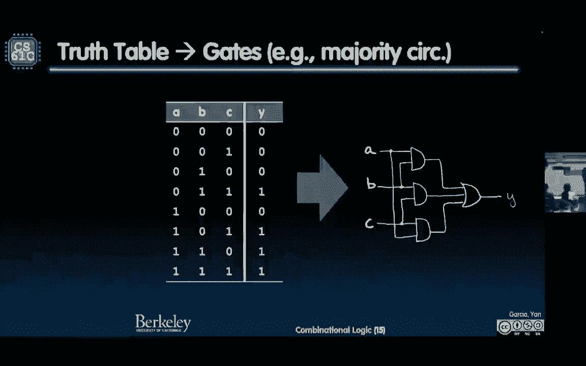

这个上面的块写着一个，我用光标，因为再一次，学会人们看不到它，所以这个上衣，这个上面的块写着一个，哦，那是一个和一个，或者哦，我不知道，丹有没有给我一个助记符，因为它有权利，所以这是一个和什么。

让我们沿着B线走，现在呢，这里有一个关键的事情之前，我还没告诉你怎么看这些星门图。

每当一条线交叉而没有圆圈的时候。

这不是十字架，就像我有一条高速公路，我不得不沉下去，这是一个地下通道的情况，它实际上并不互相接触，有道理。

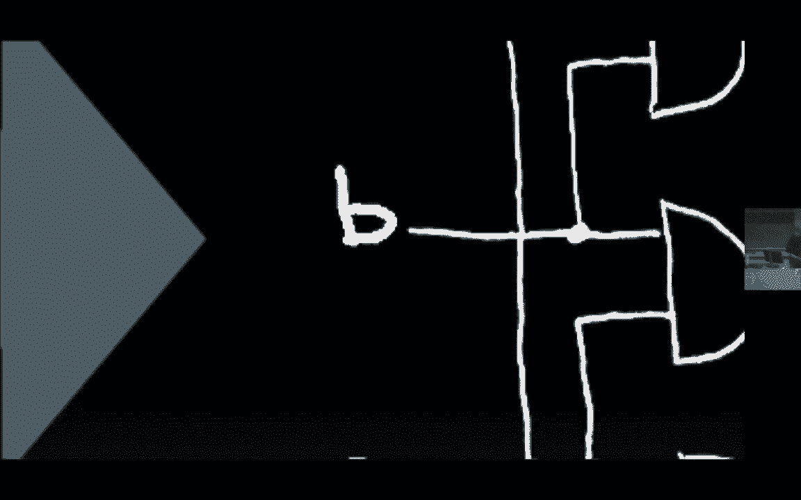

当它有一个圆的时候，就像这里，有联系。

所以只有圆圈，里面的小胖子，在图中告诉你有一个联系。

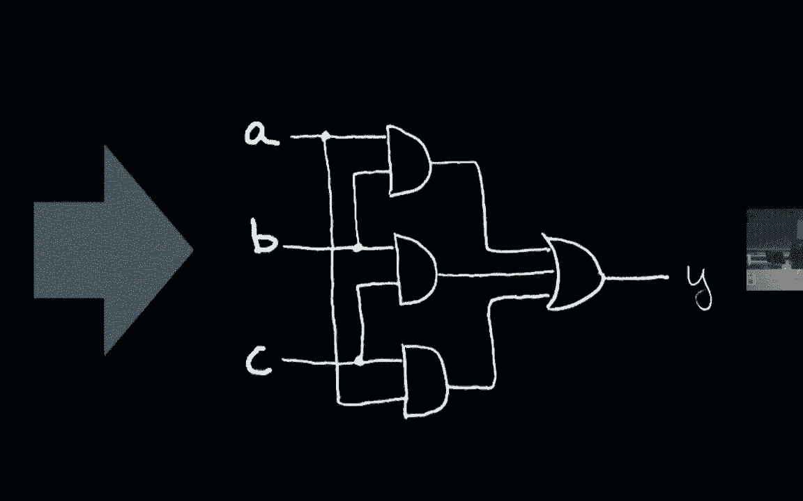

所以我所看到的，我在读这个，我在想，好啦。

这是……这条线是什么？跟着它回去，跟着它回去，是呀，这里的一个连接。

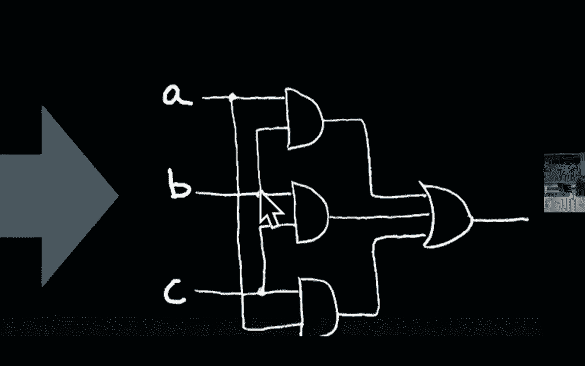

那里没有连接b，所以这是a和b，现在让我们在真相表上看看这个，A和B是什么时候，看A和B只是这两个，所以这对这两个来说很重要，那两个在这里，这很适合一个，或者说就像，记住还是真的，如果他们中的任何一个。

所以更像是吸收，所有喜欢的，啊，任何时候你是你的人，我得到了A和B，涵盖了这两个案子，第二个怎么样，这是b和c，同样的论点，让我们做b和c，就是这里，那是那个，那也是这个，所以实际上，这是被数了两次。

但记住，两个中的一个仍然是一个，所以没关系，他们中的一个是不是，你要在最后给它一个1，看看输出，最后一个显然是A和C，那是A和C，哪个是这个，还有这个，所以最下面的一行被数了三次，不过没关系。

它是其中的一个，所以看看这个，这是你第一次看到一种看待，我还没有告诉你算法的种类，但我让你知道，你同意我的看法，让我们说一个班级点头或给我一个头部移动的动作，这套门，是这个做这个图。

这个星门图描述了这个真值表感觉很对，感觉很好很整洁。

挺有意思的，这就是今天的课所要思考的，如何实际制作真值表的门图，现在我们可能有一个类似于另一个真值表的东西，在这里，PS可能代表前面的，所以这部分不是演讲的完美顺序，因为你还没有听说过国家。

但是假设有一个由ps编码的先前状态，对了这个，左边的这条大垂直线将输入和输出分开，右边的输入，产出，你得到一个输入，所以你可能有一个以前的状态以比特的方式编码，我可以用比特编码任何东西，我说的对吗。

我可以编码情感，颜色，信件，包括各州，我是什么状态在快乐悲伤等等，所以这些状态是用比特编码的，我有两个比特编码，实际上只有三个状态，零一和二，我没有四个州，所以我从来没有，我其实应该有八排，但我没有。

我只有三种可能的状态，由零编码的状态零状态一零一状态二一零，我没有状态三，我只有三样东西，我在乎快乐悲伤饥饿，快乐悲伤饥饿，我在四处走动，以下是我的意见，取决于我的投入，我可能会跳到一个新的状态，哦。

那很酷，这样我就可以跳到一个状态，基于此，再一次，这就是另一节课，但我想保持逻辑，就目前而言，我们不谈论它的宇宙学部分，我不想告诉你为什么你需要这个，这只是一个牙桌，为我做任何事，P是以前的状态。

S是下一个州，一个是输出，所以在这里，看看这个，这是一扇门，这是一个门，理论上抓住了这两个表，让我们看看这对不对，这只是一个，一个的输出是什么时候，一个的输出是什么时候，只有最下面一行。

最下面一行是什么，我们一起读吧，当输入为1时就是，所以输入直接进入那里，当p为1零时，就是这样的模式，1。你怎么说来着？这真的是如果我看，让我们考虑一下，如果我把ps的下位反转，所以在这张图中。

我把ps的较低位反转，那变成了一个一个，如果一个一个，如果我把这个传给，结局只会变成现实，当我得到一个一个，如果我有一个三输入，只是忘记了，忘了真值表吧，如果我有一个三输入n，三个什么时候放进去。

但我的模式并不全是，我的模式是一零一，所以我想把它转换成一个，我的3个输入n只会很高，我知道只有一个得到三个一，但在我的愿望中，其中一个必须为零，那么我该怎么做呢，如果我想触发，为什么我是我的。

并触发它，我说触发错误的方式去高，断言，在函数中返回一个，当那是零，在某种程度上，我必须用逆变器翻转所有的零，如果我这么做了，然后这个看起来像和门，一0一看着大门，就像一个一个，如果零出现。

那个逆变器现在把零变成了一，到尽头的门，它看到了一个一个，你看到那个图案了吗，所以现在我的N门走了，哦三个一，我是一个，只会返回最下面的一排，一个的输出，当输入模式为一对一时，去和门，但对于信号。

是一零一，这就是为什么我必须在ps 0前面放一个逆变器。

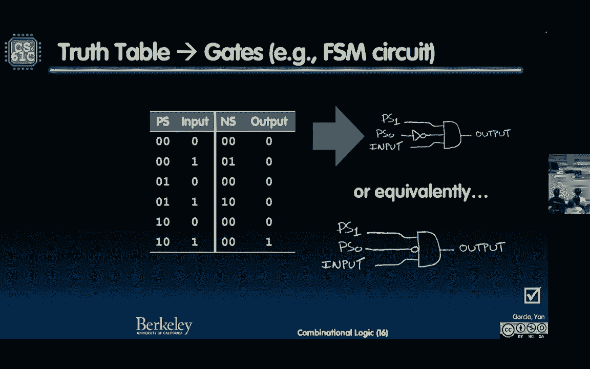

有意义的低位，如果我那么做了，三点才会触发。

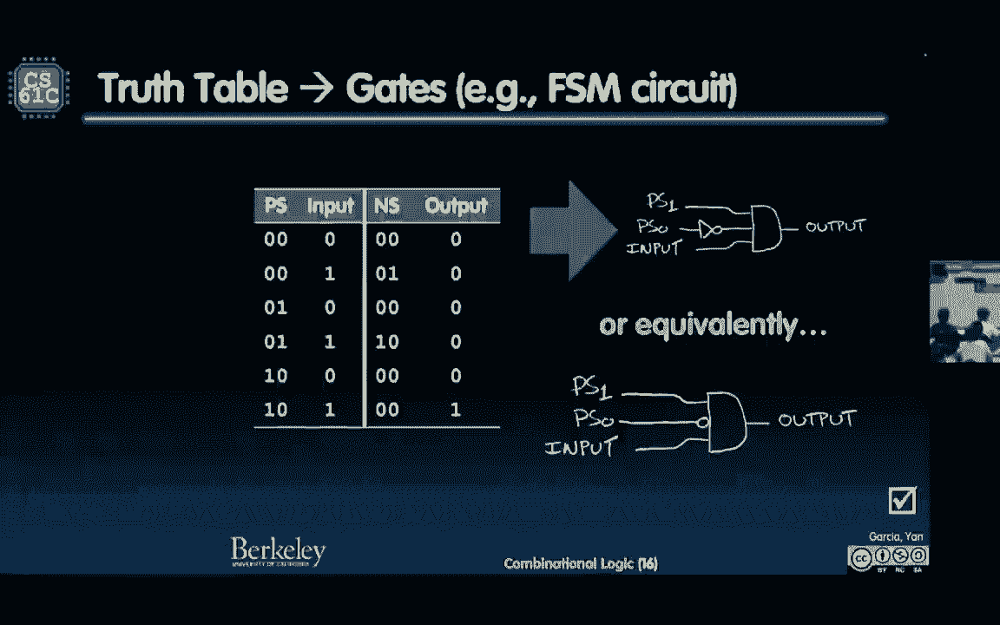

零一秒，但我没有三个，为什么？因为极移没有第三种状态，记住p只是状态0 0状态1 0 1状态2 1 0，它没有状态三，所以我不能只用毯子，我不能嘿薯条，我需要一个三，然后把，也不管用。

我必须翻转我想翻转的部分，是零，这样我就能在输出上得到那个，我不确定，如果我解释得好，珍娜更新状态，这是个好问题，第二天去那里，那是另一节课，下一个状态存储在某个地方，所有这一切，这就是状态。

这就是那个登记簿的意义所在，Register将唤醒并加载新状态，并这样做，事情就是这样，我拿着这个小逆变器，我实际上拿着这个，什么很酷，我去掉三角形，我拿着圆圈，把圆圈一直推到右边。

所以我得到了输入上的逆变器，当你看到逆变器时，它们是完全一样的，好像要画很多线，只要按一下这个圆圈，移除缓冲器，三角形去掉它，取下圆圈，把它一直推到上面，触到了尽头，现在看起来是这样。

所以n将它的中间输入反转，好的，对此有什么问题吗，这是一种整洁，我没告诉你动机，关于我们为什么关心国家，那是另一节课，但我想关心简单的事情，它是一种组合逻辑，就目前而言，我们只是在做那个。

好啦，这真的很好玩，在这里我们可以做一些历史。

我们谈了一点这段历史，上次乔治公牛队就在两天前，我们谈了四十八个小时，十九世纪的数学家乔治布尔，和其他的一起，它比任何人都早出现，对吧，的父亲，信息论之父，把公牛和人们正在做的事情联系起来。

所以布尔发展了一种叫做布尔代数的东西，原函数和或不在它连接到电路之前，那是，这个想法，气球代数的幂，电路之间有一一对应，由与或与不组成，以及布尔代数数学中的方程，例如，我们顺便绕一圈，在你的笔记里。

如果你可以或将要和Plus在一起，用乘法和上面的条来表示，或者像感叹号。

您可能在编程语言中见过感叹号，如果你一定要写，没有，这是我们以前见过的电路，我们知道这一点，在我们看到大多数人这样做之前，我们的等式是什么样子的，让我们写吧，我们一起写吧，Y=，B那是最上面的一个。

或者A和C或者B和C有那么整齐吗，所以这就是联系，哇塞，那真的很整洁，那是一种联系，事实上，我可以删除它删除点，如你所知，乘法，现在假设它是一个B，现在呢，这假设我的所有输入都有一个字母，如果我有输入。

这是AB输入，我有麻烦了，还记得你看到了以前状态井的PS吗，那是两个字母，意味着一个输入，这就是为什么它令人困惑，所以这里我们假设没有AB本身，没有b c，没有b c，我们都只是一个字母，让它更容易。

但这不是很漂亮吗，a b加ac加bc，你可能在想，你可能会看到前面的几张幻灯片，思考等待，我们也许可以在这方面做代数，而且是的，你可以。

那是整颗子弹，但是布尔代数是如此简洁，那是什么意思呢？所以看到这个真的很酷，好吧，我们开始了，这是我们的前，我们的有限状态机，我告诉过你那是什么，我保留了一些状态，我有一些建议，这是我的，这是我的框图。

我给你看了这个，让我们画一下，这就是当你有两个字母的变量时所做的，更令人困惑的是，但你希望能够，不知何故，你知道你不能过程序员的生活，你不能，你的生活只有一个字母变量。

你必须能够对它们有一些语义上的意义，所以我真的很喜欢p和n，而不是像pn和a，当我们有多个字母变量时，我们是这样做的，这并不意味着正确的术语，并不意味着，我乘以n乘以p对，它不是，是输入这个词。

所以p次1表示高阶位，或者下一个最低阶的位，s下零表示ps信号的最低位，请参阅该专栏的条款，这是看看输出是什么，它是p子1，而不是ps0，输入任何关于它的问题，只是给你看看我们之前做的。

但是你把它写成代数方程真的很漂亮，现在给你的朋友发短信更容易了，嘿嘿，零点是多少？你在给你的朋友发短信，所有这些事情，现在很难发短信给这个。

更容易测试代数，疯狂的是，疯狂的是，然后我就可以形成一个形状，拍一张盖茨图，把它转换成等价于，接下来是有趣的部分，双手沾满按摩油，布尔代数按摩油和你的工作，你喜欢锻炼肌肉，但我得去按摩，他们锻炼肌肉。

你一定要啊，我的肩膀和他们工作的人蘸它，他们在肩膀上工作，以消除扭结，真的很不错，哦，我能感觉到，是呀，继续工作，很棒对吧，这就是我们在这里做的，把你的手浸在布尔代数按摩油里，你计算这个方程。

你努力简化它，重点是把结拿出来简化一下。

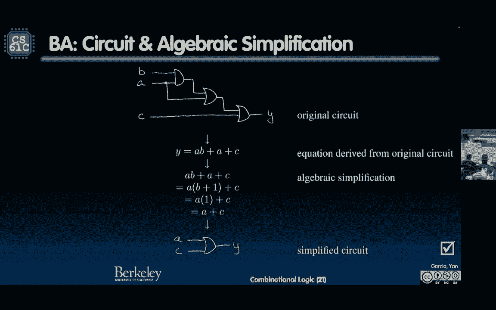

每一个阶段都像一个证明，你可能会做几何学。

记住这就像侧角边，侧角侧，你可以侧角，所有这些事情，好啦，按摩的每一行，你可以给你的所作所为贴上标签，让我们一起做吧，AB加上我甚至会放大，这样你就能看得更清楚，这很酷吗，我就是喜欢这部分。

好在这里，我们走原路a b加a加c，让我们看看这是不是像一个真正的代数方程，我可以把A拿出来，我可以拔出来吗，它会得到b加1加c，然后b加1我们会知道b加1实际上是1，我将在下一张幻灯片中给你们看。

所以b加1变成1乘以1这又回到了正规代数，乘以1是a，就像你以前见过的那样，不是这样有一些，有些规则很奇怪，就像p加1是一个奇怪的规则，所以无论在哪里，我都要指出这是一个奇怪的规则，对你来说不合逻辑。

但其他的，其他都是正规代数，你现在跟一个九年级的学生学，我们现在是代数的孩子，把A拉出来，我把A反向分配出去，B加1是现在剩下的，B加1是一个这是最奇怪的一个，你以前没见过，那是新的，然后是一个时代。

就像身份一样，你知道一个时间是一个，所以这并不奇怪，除了那个奇怪的，b加1是b是1，这是唯一一个奇怪的，那不是很整洁吗，不过，这不是很好吗，斯坦。

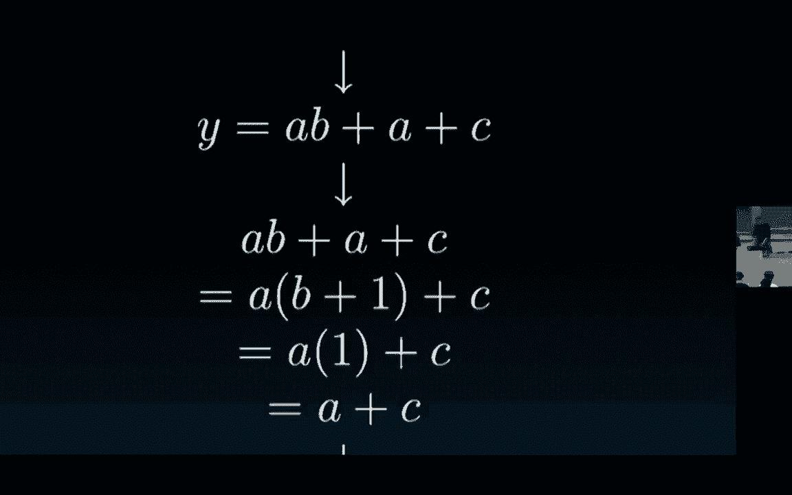

你能给我们一份这些等价物的清单吗，因为不然的话我就瞎了。

这是我做这件事之前的关键，代数很棒，很高兴看到，如果我造了这个很酷的电路，它相当于这个电路，嗯，我怎么知道它是等价的，真的是，你知道的，你有更多的结，它们没有任何结，他们在这里有很多结。

怎么一样两个都拿去，使代数运算到最简单的形式，到这边来，但这不是最简单的形式，但最简单的形式是一样的，那他们是一样的，那不是很整洁吗，所以他们看起来很不一样，但你把它们分解成完全相同的。

你显然也可以做真值表和比较，但是很明显，可能会有很多台词，取决于您有多少输入，所以实际上让，也许Mathematica也能帮上忙，或者能自动做到这一点的人，象征性地，最简单的形式。

最简单的形式是一样的吗，是啊，是啊，那种美丽的现在很好，你会希望如果这个答案是一个加c，而这个是c加a，他们会知道那些是最简单的形式，但还是对等的。

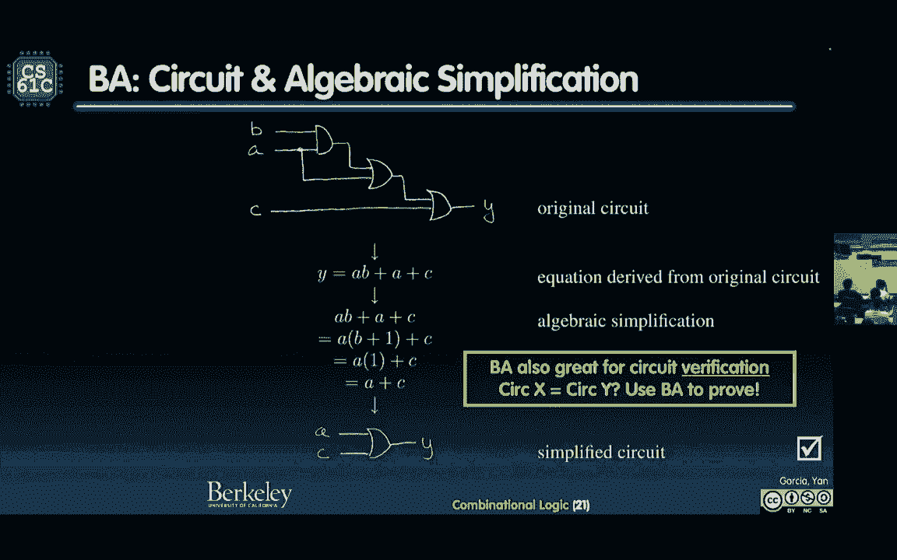

你希望，你会希望那东西足够聪明，能够做到这一点，所以我们开始了，布尔代数定律。

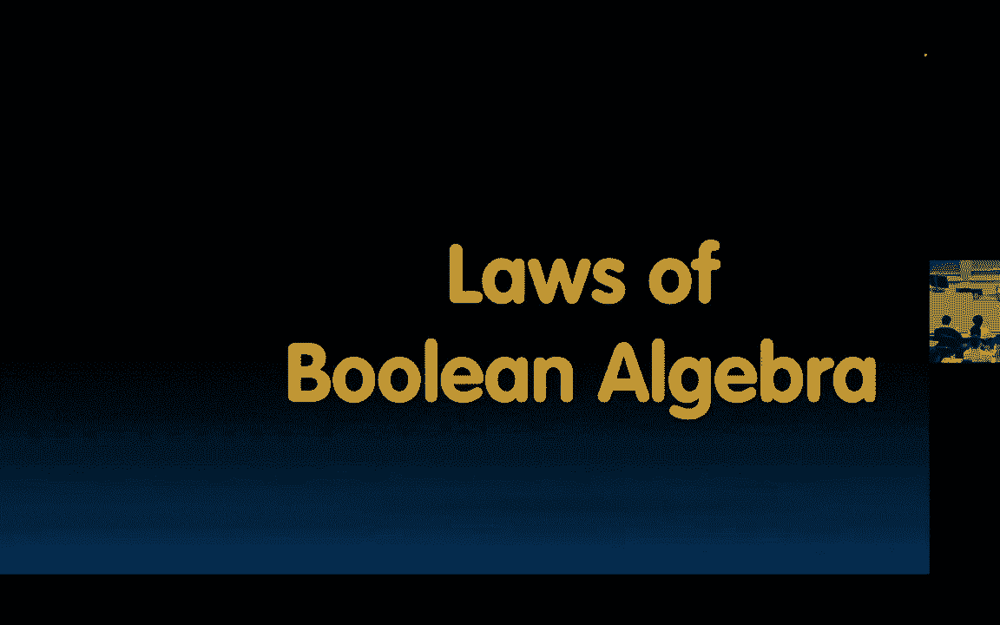

把这个圈起来，让我们把注意力集中在他们身上，我喜欢这部分，好啦，开始了，每一条法律，这就是它的美妙之处，这么多，这四堂课，这四堂课太多了，以至于我提出了二元性的想法，你见过美丽的阴阳阴阳形状，男性。

女性和青年，同样的事情，这个世界上有很多东西都有决斗，就像一面镜子，男性和女性，黑白，零，一，假，真，一，或者喜欢，他们中的许多人都是这样的，所以你在这里看到了这种美丽的二元性。

所以我不能只告诉你一个规则，不给你看这对规则，你会注意到在左边和右边，我要么改一加二，有时一个n变成一个，或者我把一个1变成一个零，你们会看到这里有很多方程式，我们必须在两个代数的所有定律中都有对偶性。

好啦，哪一个有意义，让我们通过，让我们突出，我甚至会放大，并突出那些从旧学校代数中有意义的，哪些是新的，你最好记住，好吧，我们开始吧，你可能没见过，因为你不知道普通代数中的结，互补法则说。

当你把自己和你的对立面比较时，X和不是X比较，当你把它们相乘时会发生什么，你们能同时快乐和不快乐吗，否，你不可能既是零又是一，同时你只需要成为其中之一，所以x而不是x是不可能的。

你不可能在零点既是x又不是x，你看到x而不是x零，那是新的，X与否X，你高兴还是不高兴，是呀，你总是快乐或不快乐，其中一个，如果你高兴或不高兴，只有一个状态或一个可能的灯开关，只有一个可能的电灯开关。

很明显那盏灯是这两个案子中的一个，是这两个案子中的一个，是呀，它是一个x或不是x，总是一个，那是第一排，你以前见过的这个没什么特别的，X乘以零零x和零零，那是在你看到x乘以0等于0之前。

那不是什么新鲜事，就像这个一样，x加0等于x，但看看这个，这是一个有点奇怪的，你以前没见过这个，x加1等于1，我在之前的，X或一个，嗯，你是真的还是假的，或者记得真实，真的只是假的，当他们都是假的。

记住，或者我说，或者只是假的，当他们都是假的，所以如果我告诉你嘿，你在矿台的下两排，因为他们中的一个是一个，我不在乎什么，另一个是，你知道的，你的输出是一个，我试着用逻辑来解释，所以异或一。

这意味着你第一次可以写，我今天学到了，臂代数，是这样的，一个还是一个，牙桌最下面一排是真的，很酷好吧，那是x加1是1 x和这里的1，但是这个这个你以前见过。

一个x和一个是x，这基本上说明了最上面的一排。

真理表是怎么说的，上面写着安德鲁斯桌子的最底层，它基本上说输出只是x。

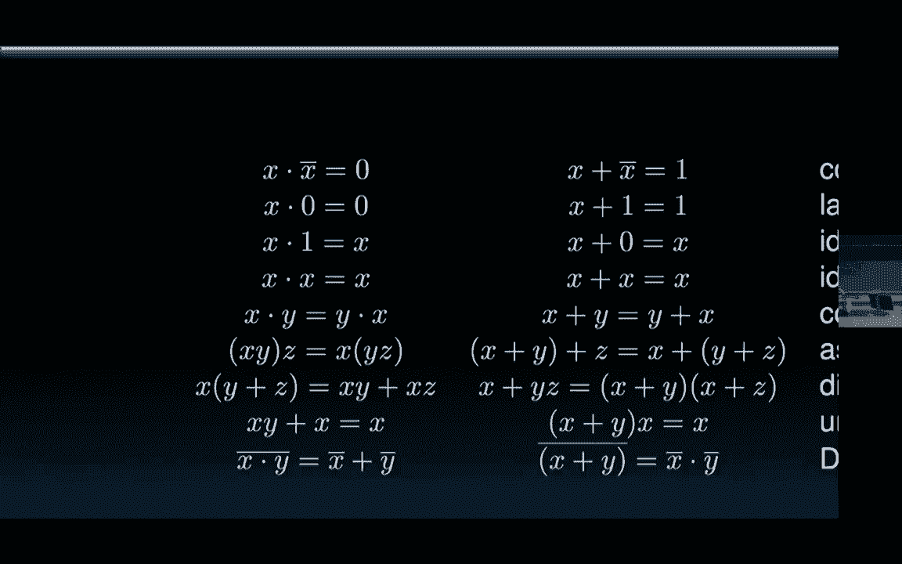

老实说，所有这些都是在看这两张桌子，有趣的是。

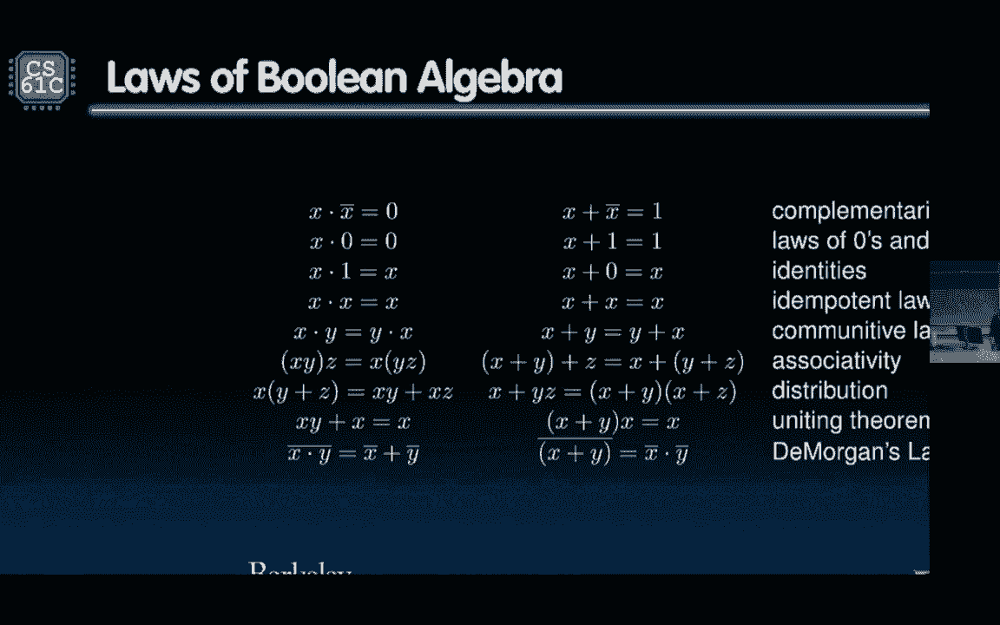

你看这个，这是一个非常强大的，我想在这件事上花点时间，谁听过这句话，我先放给你听，有效项目，有效项目，所以计算机科学中并没有真正教授强效项目强效，我来告诉你什么是强效，计算机科学中的强项。

在我们开始之前，现在就看着我，项有效是当您应用一个函数时，一旦你得到一些输出，有些副作用发生了，可能会有副作用，想想副作用功能，你涂一次，如果你涂两次，你得到同样的东西吗，如果你涂N次。

你得到了同样的东西，有些事情你会明白，例如正弦x到三，这有一个副作用，它将名称为x的变量绑定为3，如果我那样做，那是一个函数调用，函数调用，进行函数调用，叫foo和in foo，上面写着。

将一些全局变量x赋值为3，如果我调用那个函数一次，或者叫一百万次，有什么区别吗没有，它只是不断地将x重新分配给全局x 3，什么都没变，这意味着项目的效力，这意味着它有项目效力，那个函数调用是幂等的。

意思是你可以一遍又一遍地做同样的事情，什么都没变，叫一次就像叫一百万次一样，所以这里说的是x，如果i和x，我可以一直加x很多，很多次，它不会改变x，就是这个意思，这里有个X。

如果我用x结束它并没有改变x，X在我结束它之前就在那里了X没有改变，它和x在一起一千次，什么都没变，这才是重点，X仍然会被保留为X无聊，我有x i或者x仍然是x，我可以再点一千次，仍然X。

这就是项目效力的想法，做某事很多很多次，做了也改变不了什么，一次，如果我递增，如果我的函数调用fu是，在丹的银行账户里加一美元，那个东西有效吗，现在我叫它一旦它有一美元，我叫它一百万次。

它增加了一百万美元，那不一样，不是有效的项目，一个标志，全局变量，有效项目，将屏幕改为白色，清屏就是那个阳痿，是呀，我清除屏幕一百万次，还是没问题的，向右移动一个精灵，那个东西有效吗，否。

因为每次你做的时候它都会不停地移动，你明白了，这就是项目效力的想法，所以项目有效，在这种情况下意味着做同样的事情，久而久之一遍又一遍，它和做一次有什么不同吗不，那是物品罐交换，你以前在代数上见过。

没什么奇怪的，结合性，你看得有点对，你可以改变，括号都是，乘法和加法在结合律下闭合，所以那很好，分配i取x，i分配给y，z和i得到x，Y或X，Z，这真的不是它的平行，这到底是什么。

我是这么想的，这真的是看右边，这里是xx，记住箔法XX，加一加x z，加y x加y z。

然后如果我接受这四个术语，再做一些按摩。

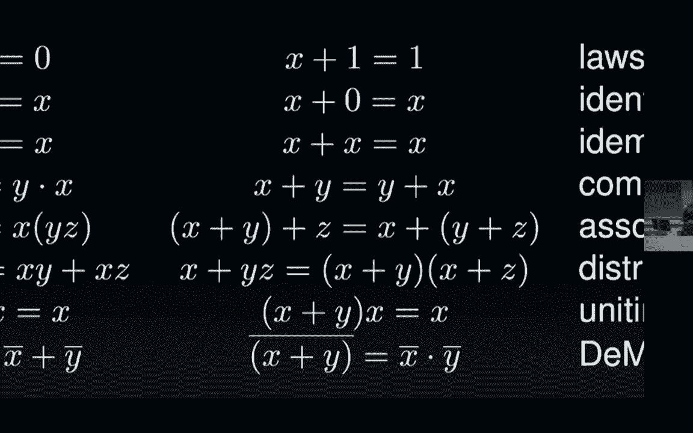

什么是x和x，那只是X，x是什么？我的另一个在哪里？什么是x或其他什么。

什么是x或x和y。

所以我们用这个，称为联合定理，但你可以自己想办法，什么是x或x和y，但如果我把X拉出来，它变成x或y，再加上一个Y，加一就是一，x乘1是x，因此等于x，所以这个统一定理说如果你有x和你。

或者有x和其他任何东西，它不会改变它仍然是x，所以记住这是x，记住这里，这个术语是x和x乘以x，也就是X，你从这里看到的，其他的项是x加y x，你知道那还是X，从联合定理，x加xz，你知道那还是x。

联合定理，所以所有这些项都是x加y z，所以我认为这不是一个新规则，这只是规则，所有其他规则一起使用。

事实上，合并定理就是，合并定理就是，我刚才说你，你知道的，把X拉出来，变成y加1 y加1是1 x乘以1是x，因此只有x，所以再一次，这些就像这四个，你只知道，这四个是这个，其他的你都能解决这三个。

你不用背，因为你可以把它们从其他的中计算出来。

这是如此强大，虽然下面这个很重要，德摩根定律，上面写着，如果你有一个，然后呢，你把它颠倒过来，真的很漂亮，这就是左边的，那是一个与非门，右边是什么，诺盖特，它们相当于什么，最酷的是，我是这么想的。

我要给你看我想到的这个秘密，我给你看看这个，如果我能准备好，留下来，在这里陪着我，我有什么，如果你能把我放大，这将是伟大的，我有，啊，谢谢是的，太感谢你了，丽莎太棒了，我有，我还剩下什么，我有。

Y和我否定了整件事，那是一个与非门。

以下是我对德摩根定律的记忆，这是给你的秘密，没有人教这个。

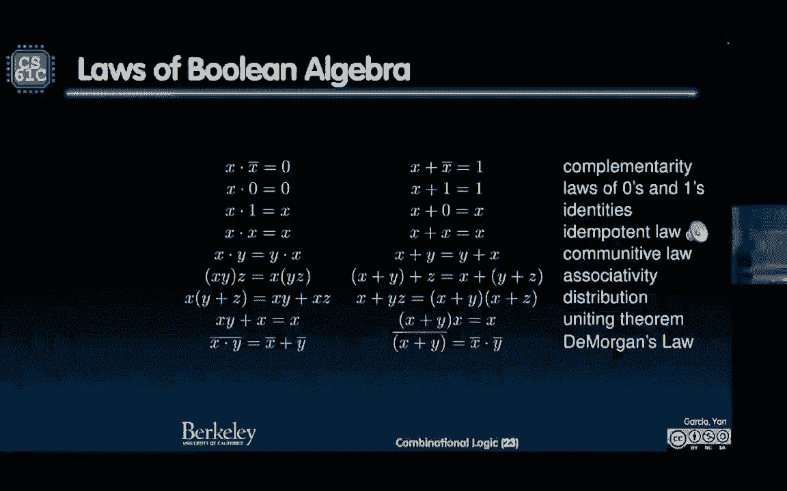

我要分发，你以前见过这个吗，我将在每个学期分配否定，我得到了，x上的否定是什么，不是x，y的变化是什么？不是为什么，乘法上的否定是什么，引用未引用，不是真的，但我做了什么，另外，我只是把它翻到上面。

我把三个都翻过来，这对摩尔定律来说不是很酷吗，三个都翻过来，你翻转x，把乘以的加号翻过来把y翻过来，不是Y，他们是相当美丽的，你有点引用不引用，把否定分配给这三件事，包括手术，有点酷。

它对两者都有效，你看，对双方都有效，让我们放大，让我们放大这个。

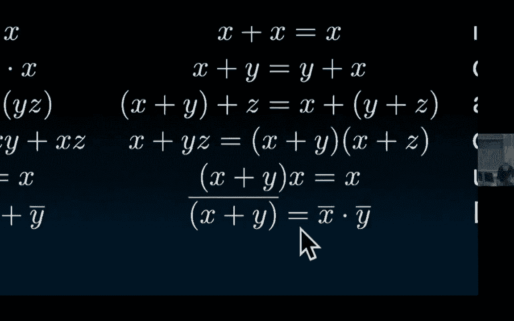

如果这是一个加分项，这是一个加分，那么这是一个双向的时代，那漂亮吗。

好啦，莫尔根定律，这就是如何记住它，对摩根来说太酷了。

好啦，所以我们现在来玩一下，让我们现在实际上玩，a b加a加c，让我们慢慢地走，让我们从前面的滑梯往后拉，什么步骤好，我可以分配或逆转，分发一个出来，现在就把它拉出来，到目前为止是b加1，那还不错。

其实呢，我可能要写在这里，一个乘以一真的是一个，因为那是不，否则我不能白手起家，这真的必须是a b加a 1加c，所以这就是身份，这是反向同一性，就像我把一个正常地加回来一样，我把那个拿出来。

我现在把那个加回来，我现在把那个加回来，我现在可以把A拔出来了，是b加1，记住整个1加1是1，b加1是1，记住整件事，任何加一的东西都是一，所以b加1，很多人称之为一的定律，八乘一。

我得到身份从第三步到第四步，我得了加C，所以这个复杂的东西有多少扇门，我得到了一个和和一个三输入，或者那是两扇门，一扇门，为什么我关心做这个简化，嗯，你说过我可以，如果两个不同的方程是相同的。

但看看这个的美，我可以减少，我用的是，减少了能量的数量，我需要我的染料的大小，做那些事。

一切都很好，你想要最简单的形式，你想去找他们，好啦，有一种东西叫做任何真值表的规范形式，在我得到一个点击问题之前，我想确保我涵盖了这个问题，规范形式是，我们慢慢切换，准备好输出中的每一个。

我写了一个方程，所以其中一个输出不是A，不是B，也不是C，从之前的那个，还记得在我们反转ps0之前，每当我需要倒置的时候，只是说不要在它面前，所以最后这个底部，最下面的一行是A和B而不是C。

这是唯一得到的，那是唯一一个给我这个的，然后我说好，如果我覆盖了每一排，那是一个，我只是或者他们都，输出不是a，不是b，也不是c，或者第一个是不是A不是B和C，第二排，等，规范形式，所以你从牙桌开始。

转到规范形式，然后一只手蘸按摩油，一只手蘸按摩油，把方程算出来。

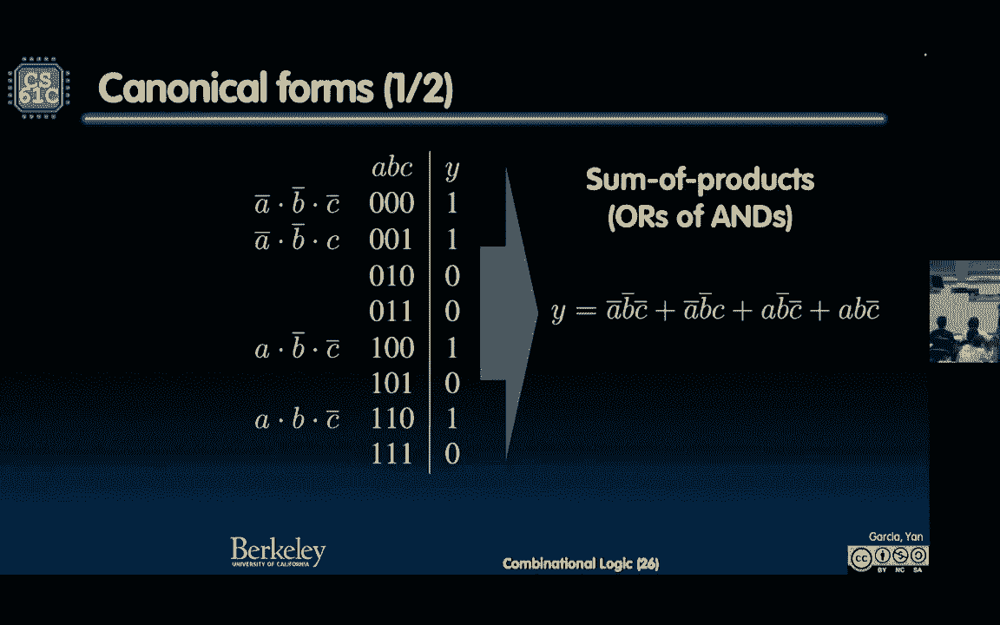

简化一下很酷，所以在这里这样做，让我们把它做好，你把它拔出来，你看，你把结A拉出来，而不是B拉出来，你得到c或不得到c或不得到c，那是一个，同样的事情在这里与一个非c，你拉B还是不拉B。

这是一个身份给你的不是A不是B或A不是C，比多少扇门简单多了，我在上面，疯狂的表情，多简单啊真的很好，这就是它实际上如何使这个，看A在N的输入上有两个结C在C的输入上有一个结，A代表A而不是C。

然后y是非常漂亮的输出，如果我真的算上盖茨，我要把这个算作六个，两端，一三节。

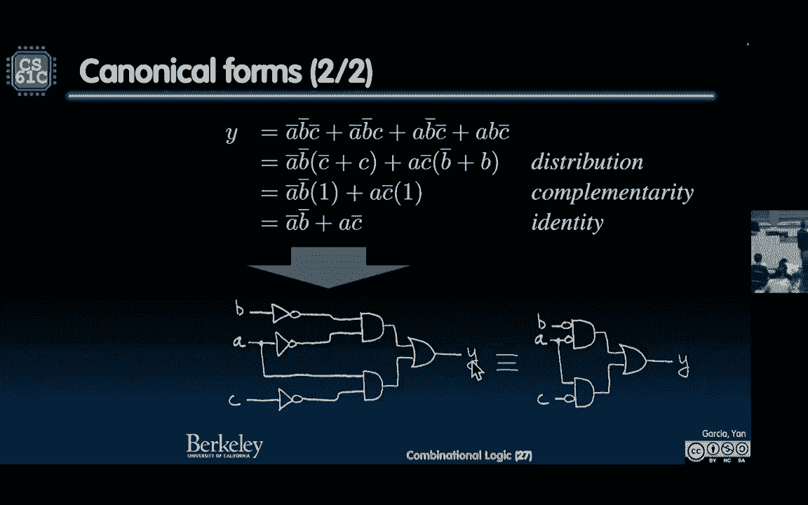

问题来了，这有点长，我不打算结束这一切，哦哦，那太糟糕了，我得到了我得到了所有的乐趣与董事会，然后它让我慢下来，是啊，是啊，如此接近好吧，也许下次我会给你答案，我们来投票吧，下次我会给你答案。

为什么是a或b而不是a或b等于b，那就更难了，你可能需要整整一分钟，所以好好想想，第二个是，输入门实际上可以级联到输入门，我只是把它们像那样叠起来，级联2形成一个带圆括号的三级级联，所以像这样。

就像函数b函数c函数d函数e等于函数，它是一个双输入b函数c函数d函数e，它被称为所有的级联效应，和或XOR和NAND，最后，你能用Norwith巧妙的布线来模拟，和或不，上面的那个还需要一分钟。

我把它放下，但我不会，我不会给你答案，因为这是一个三张幻灯片的答案，我下次会讲到的，我很抱歉花了额外的时间，我想我花了额外的时间，实际上，计算新闻，花了三分钟，开始，三分钟到了，我本可以早点再开始的。

我的球棒又在滑梯上了。

很抱歉幻灯片，只在我身上逆转。