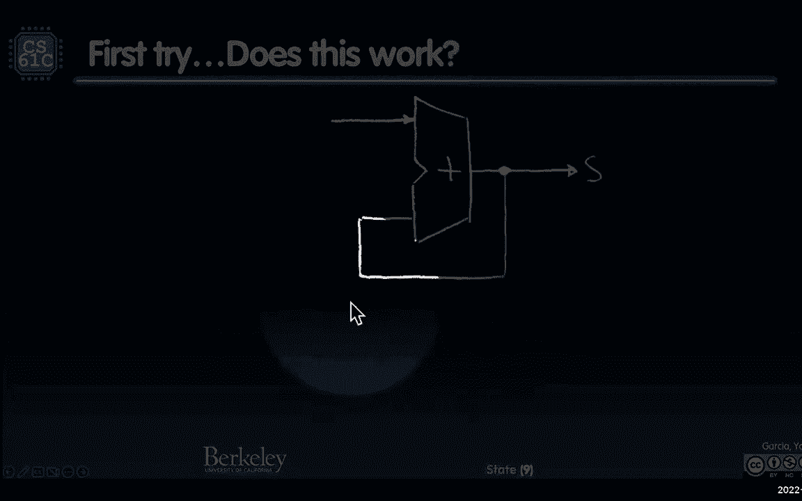
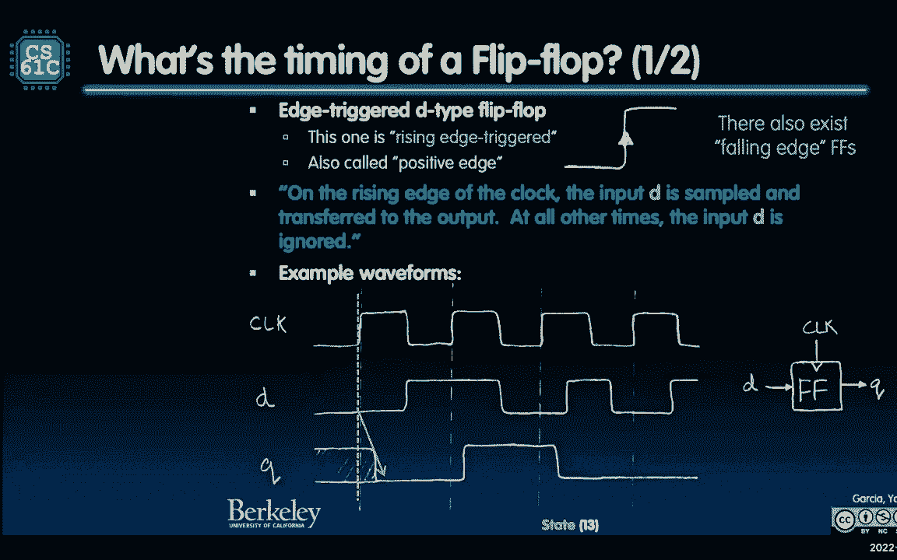

# P21：Lecture 16 SDS State,FSMs - 这样好__ - BV1s7421T7XR

所以我想花几分钟来完成排队和问题，我上次问的问题，只是为了不影响演讲。

我们不必急着去，如果可以的话，我问了三个，看看我的新光标，看一下。

我们问了三个有趣的问题，我只是喜欢这个，所以这是一件很酷的事情。

如果我做了，我可以站在那里说那是关键，那是b的关键元素。

我在问a或b而不是a或b是否等于b，有几种方法可以做到这一点。

简单的方法是制作一个真值表，把所有的数字都放进去，好啦，假的假的真的，那是一种方法，第二种方法是使用布尔代数，我们谈过的，我问的第二个问题是，我可以级联两个输入门的门，和或Xor Innand。

我能不能把两个输入的，所以像两个，然后输出到三分之一，现在把它放进第三个，几乎像左或右，联想的东西，就像你在这里看到的，这是正确的，对呀，结合律相当于一个输入门，最后一个是，我可以用，我也不能只吃薯条。

也不只是让其他的门，是或不是，好啦，这就是我想问的问题，希望有一点时间来研究它。

但现在让我们来看看我们得到了什么，所以第一个，我们一起来试试，好吧好吧，有一个箔法，我们可以一起努力，箔法说。

希望你能看到这个，所以这是一个表达式，是四法，所以它是a而不是a或a和b或b，而不是A或B和B。

好啦，还不错，现在如果我们看看，让我们看看我在这里的位置，不能既是A又不是A，那是零，B可以被拉出来，因为我可以翻转，a b与b a交换律相同，记住我可以翻转，我可以把B拉出来，这就是结合律。

一个或不是一个就是一个或不是，你快乐吗，你不开心，是啊，是啊，对我来说永远如此，真b和一个恒等式，那是b b和b或b b，记住b或b是，什么都没有，没有爱的物品，有效项目，你拿b和你的or和b。

什么都没变，你自己点菜就行了，没有什么能改变项目效力，如此真实，耶，谁第一个工作，第二个是下一个幻灯片，最后一个是这个，如果我说a和a的范数，这就是等式，A加A，上面有一个酒吧。

德摩根定律说它的意思不是a，不是a，也不是a，不是A不是A，又来了，那是强效的，你总是以你自己结束，这不会改变你是谁，是啊，是啊，A和A和A和A仍然是，所以这不是一个，所以也不给你一个，所以现在你没有。

如果我没有，我也不能，或者是因为德摩根定律，我也可以做，所有这些事情，所以一切都很美好，所以答案是肯定的，所以上面的是真的，美国证券交易委员会，第三个是真的，第二个呢。

我可以把其他的，让我们一起来谈谈，好啦。

就是这个有点难，这是正确的两个输入规则。

记住这里，是底部的那个还是三个，或者中间的和NAND的，当你翻转末尾的时候。

好吧，现在记住，如果我是。

这里有一个方法来看待这个问题，如果我看着，看这里，顺便说一句。

正确的三个输入，看这就是我要纠正的。

让我们来看看NAND，右和，NAND是他们所有人的终结，但只要翻转末端，所以这是正确的。

问题是什么，如果我拿着这个，然后把这个和第三个输入一起应用到那个。

所以看看那个，这里有一个有趣的东西看。

我是这么看的，如果我有这种模式，这是我问你的。

如果我有这种模式，现在如果前四个x为零。

所以我说什么，如果我画一个零看这里你可以看出，如果我在输出中加一个零。

如果左边的是零，输出零是多少，所以这四个应该是零。

如果左边的是一个，它是如何同时与输入相关联的。

所以我复制了这个，把它放在那里，所以这就是我得到的。

所以和工作，我可以级联到两个输入，用另外两个输入，做一个三输入，它真的起作用了，让我们再次使用同样的逻辑。

这里的或，这是我的或好的，这是我的或者记住现在左边的输入是零。

输出是什么相同的权利。

当左脚是一的时候，这是一个，所以这意味着为顶部的一个。

这是相同的，我复制或，这是相同的，就在那里，从那里看，这四个东西是一样的，底部应该都是一个，看。

我得到的正是那张照片的逻辑。

我们去隔壁看看。

我们知道，X好吧，条件逆变器，左边是零，它保持着它，左边的是一个。

这是一个，所以我拿着这个，数字是零一一零，我抄下来了。

归零归零，然后我翻转它，因为我把它反转，条件逆变器变成一零一看。

底部是1 0 0 1这样就可以了。

让我们来看看NAND，当左边的是零时。

当左边的是一个时，它是一个，它把它翻过来，所以这意味着我拿着这个，我让这里的所有看起来都很好。

仅此而已，这是正确的，所有的人都在那里。

但当左边的是一个，它把它翻过来，是逆变器，所以我应该拿着这个，把它翻转成1，0，0，1。

会发生什么，这不是我看到的区别，看到这里的黄色和青色是不一样的。

我的光标，这些不一样。

就在那里，所以你不能级联到两个两个输入nand。

做一个三输入NAND，但你可以用，和或和XOR不是和，对于同样的逻辑，你也不能忽视，我只是想告诉你如何阅读真值表，并思考这个问题，我希望这对你有帮助，我在那里花了几分钟。

好啦，嗯，看看这个，这是今天新闻中的计算，我只是喜欢人类的创造力，有时我会得到很多非常积极的东西，我对人类的创造力有了积极的认识，创造性地，这些跑步者使用这种叫做Strava的工具，它是跑步者的工具。

他们实际上描绘了一幅画，然后他们运行图片，然后他们给他们的Strava应用程序拍照，他们画了一幅画，那漂亮吗，所以这些都是非常有创造力的人，他们通过，骑自行车或开车，我希望跑步走路。

我只是喜欢这种创造力，我只是没有什么比一个快乐的，今天是星期五，我们找点乐子吧，幸福的笑容，所有的，还有很多其他的，世界上有很多痛苦，乌克兰痛定思痛，如我们所知，佛罗里达的很多痛苦，如我们所知。

波多黎各最近有些痛苦，伊朗正在经历一些痛苦，周围有很多痛苦，所以有一点微笑是很好的，我知道这么少的人，肯定有很多人在为人们祈祷，世界上没有画过画的人，但这是一些有趣的东西，可以用你跑步的地方画一幅画。

今天这很容易，我们在做状态，我翻转了它，因为我发现布尔值，我们上次讲的组合逻辑是非常符合逻辑的，我不觉得你真的，今天你的大脑不疼了，我们要做一些你的大脑会受伤的事情，我也不想，我想把它翻过来。

所以你对自卫队的东西感觉更舒服，在你的大脑今天受伤之前，你的大脑会痛的，有一些你从未见过的新东西，我向你保证你从没见过这个，我们正在进入模拟领域，这对那些喜欢，哦，我想完全数字化，有延误。

我们正在处理延误，我们真的在讨论时间和频率。

所有这些东西对一些人来说都很困惑，所以我们看看它是怎么工作的好吗，累加器我之前讲过累加器模式，你只是在某物上加一个，或者加上你有一个数字列表，我们在一个数字列表之前做了这个，将列表中的所有值相加。

我记得之前展示过这叫做累加器模式。

所以我们今天要做的是，我们说的是一种累积模式，在本课程的第一部分中，用于状态电路，所以你知道什么是寄存器，我们储存一些东西，你知道什么是记忆，我们储存一些东西，所以状态电路是，他们会为我们记住这一点的。

不稳定意味着当停电时，它失去了它，非挥发性意味着它会坚持住，当停电的时候，所以一张磁盘，停电了，你完全没事，闪存断电，完全弄清楚，卡片上是我的照片，我完全明白了，内存寄存器所有volatile。

但它们都是，他们的工作是记住东西，不是为了计算东西，但要记住一些东西，所以你在这里看到了内存中的寄存器，它们也将是帮助控制组合逻辑块之间流的关键，你不知道什么组合逻辑，这就是为什么我把它翻在那里。

那里有很多，因为现在你知道什么是组合逻辑块了，如何让这整棵树，但我想能喜欢。

帮助控制流量，当它穿过，你什么意思，给我举个例子，让我们一起做一个例子，我想加起来，我有一个以x为单位的数字数组x是一个大写数字，x子i是一个特定的值，我想把它们加起来，那并不难。

这就像我能做的最简单的事情是一个数字数组，我把它们加起来，零一二三四，应该是十个，所以让我们做吧，所以我要做一个黑匣子，x i在左边，顺便说一下，总的来说，你会看到，数据流总是从左到右或自上而下。

从来没有相反的方式，好啦，所以要确保，有时我必须有一条从右边开始然后往回走的路，你会看到的，但传统上，你将要看到的每个黑匣子都是从左到右或自上而下的，所以这是我想看到的，就像我们都知道的C。

我们都从6跳到A和B，我想初始化和为零，然后我要做一个for循环，我等于零，我不到N，I加S等于，S加等于，我只是设置了所有的，我很容易，所以我们假设x的每个值，我将每个周期得到一次，看一下。

这是第一个，这是第二个，一定有什么办法，第一个，下一个，下一个，会有办法的，让我们假设有办法做到这一点，在N个循环之后，总数在，嘿嘿，你的价值是多少，我是总数，我十岁了，是呀，成功了，所以我赢了。

黑匣子，让我们试着建造它，建造第一个真是太兴奋了，准备好了，就是过滤一个累加器，我要去庆祝一下，蓄能器，把我的脚后跟踢在一起，有用吗，你看，好奇怪，对，但这是一种情况，我说一切都是从左到右的。

只不过这条线可以追溯到，左上返回输入。

那行得通吗，阿宇，我看到一些，我见过一些人头，我看到一些挠头的东西，你想给我一些爱，你觉得怎么样，是啊，是啊，那就像，如果你做了一些双重的事情，是啊，是啊，看起来，看起来你每74年就喜欢一个应用程序。

是啊，是啊，所以最上面的人是价值的来源。

呜呜，我把光标还给你。

是啊，是啊，输入到这里，然后和在这里，然后它会添加，一定要记住。

它必须增加自己，对呀，你得到了S将被添加到自己身上，是啊，是啊，你在这里又做了一次，走呀，走呀，是啊，是啊，所以这是个问题，如果一些初始化为零，它可能会工作，你是怎么做到的，我们如何将它初始化为零。

然后我们如何告诉它，我给它下一个值，钟，我有一个钟，圆圈里的钟在哪儿？图表里没有，所以这不起作用有两个原因，但这叫做反馈，我其实，这是一个重要的词，如果你有关于反馈，反馈回路，我把输出。

将其反馈到输入中，不起作用有两个原因，第一名，我该怎么告诉它，我准备好了，怎么样？钟准在哪儿？我该怎么说，好准备好了，这是我的下一个x，什么，如果我真的很慢，如果每天，我要给你一个，这是一个不。

它只是要旋转，在第一个值上变得非常大，我还没给你下一个，所以没办法告诉你，下一个数值来了，因为这个原因它不起作用，也没有办法重置它，没有一种像这样的方法可以让它做到这一点，那可不好，不管用。

所以这就是我们今天要一起建造的，挺有意思的，所以我们要做的第一件事，我们要加一个寄存器，你记得一个收银机，我之前给你看过。

寄存器是一个盒子，我想我以前提到过这个，这是收银机吗？

它有能力在其输出上有一个稳定的值。

只有当负载上升的时候。

我们要把它插到时钟上，当上升的边缘上升，它是做什么的，记住我的事，我转过身来，我抓住我输入的价值，然后我抱着他们，把他们锁在里面，我只是打电话，我喜欢锁门，把它装起来，上膛，上膛。

我只是要把这些值放在那里。

有一个钟会上上下下。

控制这个，不要看微缩版，我们要深入研究这个问题。

但大致上发生的是，x的值是，在延迟之后。

我们没谈过这个，经过一段时间的拖延，S将有x小于零。

有一个重置会重置它，所以A将有一条复位线，复位线显示，我不在乎，准备开始，时钟上升，转过去，如果再，如果重置器的丽莎戳我的侧面，就像忘记了你身后的一切，就变成了零，就是这样，所以说，基本上就是。

它总是更关注重置而不是我身后的东西，所以如果复位很高，断言复位，我要忽略，我要说，好啦，我假装转身，我不是真的，这里是零，对不起，所以重置总是会重置它，所以复位会很高，在某个时候。

我没有给你看这里的复位线，会重置的，所以现在寄存器加载零。

然后s是零，从这里出来。

猜猜第一个循环是什么，S是零的x，那东西挡不住。

基本上是同步的，下次我再经历的时候，不要再重置了。

请不要重置我，我想在这里留个号码，所以不要再重置了，复位将被取消或低或零，然后转身，抓住它，这里值多少钱？该值为x下零，因为这就是我所持有的，然后x的1是x的1，嘣，现在x是零加上1的x。

它有它要拿着那个，它一直在做，只是起作用了，如果你看看，s从x到零x零加x一，零x一加x二，它实际上是有效的，我只想添加一个寄存器，我们要更深入地研究时机，所以不要担心时机，但它实际上只是起作用。

我的意思是增加一个寄存器，使这项工作变得非常强大，所以我们离得不远对吧，加法器的整个反馈回路，不远处。

我们所能做的就是记住我们的价值观，那太棒了，好啦。

让我们更深入地研究寄存器是如何工作的，让我们实际上，这真的很好玩，你要建立一个登记册，所以我们的收银机，我之前画了一个黑盒子，现在呢，我将向您展示我们将标记输入，D表示数据，输出称为q，我查了一下历史。

我一直以为Q代表静止的意思，就像，那是你的稳定值，但事实证明，网上有很多关于如何，其中一个解是，因为它不是p，他们是各州的皮特，他们想用Q来表示，所以不管它是静止的，Q是输出，数据是数据是输入。

Q是输出，它是由这些平行的人字拖组成的，如果我有一个32位宽的寄存器，它实际上是由三个两个独立的组成的，一位DQ人字拖，是输入线索，将此时钟或负载复位馈入的输出。

它们都是平行的。

所以当你说加载他们都，他们都只是去大块，它们都独立地装载在一起，所以这就是独立发生的事情，这些被称为D人字拖，以前还有其他种类的人字拖，但这是一个D触发器，它相当强大。

它是做什么的，这是插槽，我们将在这上面花很多时间，我希望我能把光线调暗，这样你就能看得更清楚，这是一个关键的槽，你们都看得很清楚，我希望这个光标对你有帮助，这将是上升边缘触发触发器，意思是你作为寄存器。

你所有的工作就是抓取数据并保存它，你什么时候在边缘循环中这样做，当那东西从零开始，时钟或对你的输入从零到一，然后你就变成了，这就是DQ，对呀，这是一个单一的位，单位，这里有一张照片，字面上的一点。

当它上升的时候，它走了，我拿起我的手指一点点，呜呜，抓住它，然后握住它，这就是我所做的一切，你在世界上有三个两个，现在你让他们三个两个做同样的事情，所以让我们一起读吧，在时钟上升的边缘，输入d采样。

不管你是谁，你最好是好的，并转移到输出，每时每刻，忽略输入d，对呀，所以D可能在移动、变化和过渡，D可能是一半，没有一半，但d可以是电压的一半，我不在乎我不在的时候，我不上升的边缘，我不在乎发生什么事。

D可以断开，我不在乎，但这是关键，我给你看看这个，这里是上升的边缘。

顺便说一句，这里的D是取样的，经过一段时间的拖延。

记住这是世界的现实，经过一段时间的拖延，这里有一个节目排队，我甚至不知道过去排队是什么。

所以我把它画为两条线之间的阴影。

看看是怎么画的，它真的很漂亮，其实呢，所以这不知何故丢失了光标，这里有东西。

这里有阴影，就在那里去采样并出现在输入中。

经过一段时间的拖延，你看，我们做同样的事情，我在输出上取样，在输出上对其进行采样，真的很厉害，DQ触发器，我去，我把我的一捏，像一把小镊子，所以我四处奔走，抓取输出中存在的位并一直保持它。

所以当手表D发生变化时。

看这里这里的变化对它没有影响。

Q在锁定它的值，它锁定在一个零，这将是零。

当它在延迟后第一次得到它时，它会一直坚持到最后。

一直到最后，下一次取样的时候，所以即使d变化不影响q。

是的问题告诉我，你可以去下一个循环，D可能是Q重置，d除外，如果d不变，Q是不会变的，我是说，就像重置一样，从某种意义上说，它仍然必须掉头，但如果它反过来，它对外界的价值是一样的，看起来没什么变化。

但它每次都在掉头，它得到了一个上升的边缘，它会那样做的，这是连在钟上的，你可以连接输入，任何东西的时钟输入，每当它上升。

但我们通常会准时，因为我们想，我们想要，这个话题的第一个词是什么？S代表同步。

这就是为什么我们与时钟相连，是啊，是啊，这里有个问题，是啊，是啊，是啊，是啊，有延迟，我想把它关掉，为什么不排队问一个很好的问题，好问题，Q为什么不马上改变，你觉得怎么样，乡亲们，只是生命中的延迟。

循环需要时间来移动，下次我们可以，如果你再深入一点，我们以前教DQ翻转是如何在一层下建立的，你会发现循环需要一些时间来绕过这个问题，才能真正锁定，所以有一点，这就是延迟，我们将讨论下一张幻灯片。

但这是很自然的，我们谈到了外部延迟，最后一课，这里也一样，这里会有延误，我会在下一个幻灯片上给你一个名字。

这里也一样，好吧，在这里，这是一张有所有新名字的幻灯片，这将是，我想这里有三个新名字，你可以把每一个都圈起来。

因为你一定要了解他们，我觉得上面都一样，我所做的只是改变底部的图片。

所以让我们放大，我其实我喜欢，我把这里放大，我喜欢，看看这个，不能在这里阻止我。

我把镜头拉近，好啦，开始了，你喜欢Mac，好啦，我们谈谈吧，所以这两条黄线，这里的黄线，这个行得通吗？即使我被放大，有用吗，原来如此，我知道，当我缩放时，它也有效吗，我得用那个，我会用变焦的东西。

真好笑，我给你看的是什么，这是像时钟一样的骑行，所以这条红线，红色虚线是关键，这就是转机，抓住它，但是有三个新的想法，我首先要说的是，获取d的值并将其显示在q上，这是时钟和Q可用之间的时间。

那么我们叫它什么呢，我们称之为，时钟到Q延迟是有道理的，什么时候涨很多，Q什么时候最终稳定，这就是现在排队延迟的时钟，Q可以在时钟到Q延迟之前稳定下来，所有的时钟Q延迟说是，在这一点上保证是稳定的。

它本可以更早稳定下来，那很好，但这意味着当你到达那里的时候，我向你保证，它在那里，那是第一部分，现在呢，我早跟你说过，我想我记得上周我第一次介绍这个的时候，或者周一你转身抓住它。

你希望在我转身之前它是稳定的，你也希望它在我转身后稍微稳定一点，这就是我现在要给你看的，这是这条红色虚线，是时钟上升的边缘，这里的这个想法叫做设置时间，还有DQ的合同，触发器，说脱钩，触发器。

答应我这是合同，在输出上给你一个坚实的提示，只要d不在，上升边缘之前的时间，在上升的边缘之后，这些是规格，我会去买DQ，把这些规格翻过来，在上升的边缘之前是什么时候，嗯，当人们来你家的时候。

在他们来之前你在做什么？你在设计，这就是所谓的设置时间，这个设置时间是上升边缘之前的时间，那最好是，这是红色的上升边缘，就在红色的上升边缘，如果它在设置时间内移动，最好不要移动，负设置时间之间。

安装时间和零，从负设置时间到零，想想时间线，我能做什么，你违反了协议，协议是你让我们稳定，这意味着如果你在移动，你不可靠，要么是一，要么是零，我不必答应做任何事，我答应过你转身拿东西，我可以打破。

我可以引起火灾，你违反了我的规定，说明书上说你必须在安装时间内被锁定，之后你也要稳定一段时间，这就是所谓的保持时间，让我看看，这个能用吗？让我看看，这里的安装时间是稳定的安装时间，是呀。

在保持时间内稳定，是呀，所以那个特定的时钟周期，喂D的人做得很好，它遵守交战规则，在安装前，它在时钟之间稳定在1或0，一次又一次地打卡，如果是这样的话，我保证把输出准备好，至少在之后至少在之前。

所以至少在时钟到队列延迟之后，就像一个热到Q的延迟将保证在那里，在这里管用吗，那倒是真的，在设置和保持之间很稳定，让我们看看是的，因此无论d的值是多少，这将出现在输出中，准时回答问题，是呀。

告诉我你的名字，从这里开始，我去，稳定意味着不能移动，它必须坚如磐石，在零的时候坚如磐石，不可能是一个点，九不能蘸，不可能从一过渡到零，从0到1不可能下降，再次回升，字面上只是很多。

一点处的直线或到零的直线，这就是稳定的含义，嗯，呃很好，我们谈到了噪音，噪声通常发生在，这是个很好的问题，可以喜欢，让你知道，让我们说一些其他的结果，就像，你知道的，如果你有过这个，家里有这个。

我小时候吃过这个，如果他们的冰箱恢复了，压缩机就会启动，突然间灯光暗了半秒钟，所以你是说，这也会发生在我身上吗，所以现在他是一个，突然间芯片的其他部分，它变得有点快，嗯，也许再来一次，那是，那是。

希望没问题，希望这次下跌不会造成，但也许如果它不完美，他们说嘿。

它并不完美，我是你理论上你违反了它，我可能不会工作，所以你要试着把它们固定在整个东西上，真的吗，问题没有来，它还在移动，你知道也许零比一，在设置和保持的过程中，你不会仍然从零到一移动。

你基本上在你想去的地方，希望扭动没问题，是啊，是啊，告诉我你的名字，乔纳森，乔纳森去吧，所以它只需要稳定，或者需要相同的值，既稳定又同值同物，要么是一，要么是零，你不能是半个，它必须被锁定在零一，直线。

是啊，是啊，告诉我它的名字，审计围棋，建立和全职的唯一区别，我们就像在正确的设置之后，问题是设置好的，负时间和是的时间之间的时间差，所以如果你算上这一套，上升边缘为零，设置是过去的一段时间，就像负时间。

在正时间之后拿着这个，是呀，再跟我说一遍是，对不起，谢谢你，为什么合同关心俱乐部的崛起，当我们对上升边缘取样时，就像，上涨前为何要稳住，就像，设置是怎么回事，就像，为什么我需要被设置。

我想答案需要你和我去，DQ触发器是如何工作的，这是它的一部分，但我们不会这么做，我会说我会看着说，媒体如何，你知道的，但这只是啊，其实真的很美，这是一组反馈循环，真的很漂亮，DQ触发器是如何工作的。

只是真的，就像四个门和这样的反馈，这是真的，逻辑是，太完美了，但这只是，我们只是，我们要说，是个黑匣子，我们用它，还有一份合同，就这些，我们从薯条那里得到的，后面的问题，是呀，祝福你，啊问题是。

它如何加强马厩，它不强制马厩，好问题，它只是可以打破，如果不是，这就是它的工作原理，那只是我的工作，我在制造一个精致的硬件，如果你给我的东西像摇摆不定，设置货舱，我可能不会做你想让我做的事。

仅此而已，我知道怎么帮忙，你知道的，它是怎么说的，好啦，所以现在。

让我们回到我们的累加器，实际上做一些时间调查，看看这个，记住我在这里没有什么不同，我以前给你看过，这里是i的x从0到5，这其实是看这个，我给你看看这个，给滑梯付点养老金，因为这里的评论真的很美。

会有一个重置，我还没有给你看复位线很高，但是重置允许，我只看了一眼，i减1的s是输出，i的s是输入，不是吗，那不应该翻转，为什么我把i-1放在下面，i放在上面，这是正确的，这是正确的，我再重复一遍。

Y的X在这里，这里的和值，这个和是当前和，但是锁在里面的是什么，上次锁的是什么，事情真的是这样，几乎就像一张照片，如果我现在给你们所有人拍一张照片呢，然后我去上一会儿课，我给你看照片。

这张照片是以前发生的事情，所以寄存器的输出是之前采样的，所以它的i-1是正确的，寄存器的输出完全正确，本质上，这一直有效，不知何故，这被重置了，有一个重置线，去零，它只是工作，它上升了，它抓取样本。

这就是它抓的东西，开始了我看到了看那个，所以这其实很有趣，我看到这条线，所以加法器的另一个输入是i的s减去，减一等于一边，X将另一边分开，所以这两个相加使这个输出，对呀，所以零加x零是x零。

经过一段时间的拖延，什么事耽搁了，加法器延迟，现在x为零，这里有一个上升的边，上升沿取样是多少，上升沿采样，所以这个值看起来更好，稳住，准备好，稳定吗，在设置和保持之间看，那里很稳定，这个被抓住了。

现在这个输出是存在的，在i减1的s处，然后我们在x0和x1之后，在外部延迟之后，同样的事情，这两个相加变成1 x零加x一，它重复着，它起作用了，所以实际的系统现在工作了，让我们得到更多的细节。

这里是上升的边缘，会向你展示漂亮的上升边缘，现在我给你看重置线。

让我们注意这个，好啦，所以我有四个上升的边缘，黄色虚线，开始了，时钟上升的边缘，顺便说一下，顺便说一下，顺便说一下，关于d在建立和保持之间是稳定的同样的规则也是正确的，对于。

Reset还将其输入重置为正确，这个点是上升边，我要改变我的状态，你最好有谁喂我，它是d和重置是坚如磐石，在设置和保持之间的1或0，是吗？让我们看看，哎呦，真漂亮，看看那个漂亮的稳定复位。

那么D是怎么做的呢，会看它的输入吗，我是说，DQ触发器会看它的输入吗，没有重置说，忽略您的输入，你将是零，那么发生了什么，零场景是什么时候，什么时候是零场，开始了，零有多快，上输出线，延迟。

即使这与数据无关，这是一个钟，直到你看到Q Q的输出就像，你真的被答应了吗，我这么做了，那不是很美吗？所以我展示，这是前景，下面的输出显示为，你知道十字舱口，我不知道是什么，既是一又是零。

这是一个众所周知的小薛定谔盒子的情况。

我不知道是什么，但当这个上升的时候，一旦这家伙来到这里，展示他的猫变成零。

那是钟的提示，所以我必须提示绘制的宽度是T加法器的一半。

我们可以通过SI跟踪这整件事，呃哦，这里会有麻烦的，也许si-1是输入i的x的输出，现在这是i的x，两者加起来，最终，在t之后添加延迟，变成零的x，现在，现在呢，问题来了，这里有一件事关于这一点。

我认为是，我把这个记下来，X来自某个数据源，它来自一个信号，哎呦，有一个，我收到了一点覆盆子派寄给我的，s的x，我不知道X是从哪里来的，它是系统的输入，我无法控制我的x，我希望不会改变，顺便说一句。

这是希望，它会改变的，但我希望我能成功，我唯一承诺的是加法器输出最好不要改变得很好，外部输出是i中x做得对的函数，事实上，我一个人去，零一零一零，上上下下非常快很好，这只是想做它的加法，和T面糊。

这个数目会改变的，也要去O但延迟后，所以i中的x控制了整个过程，把事情搞得一团糟，发生什么事了？我不知道x y是否同步了，那么好，这是我给你看的再看一遍，记住这两个加上这个，所以看这个加上延迟后的值。

加上这个，但是看这里，这是时间窗口的x零，我要放大疯狂，这个窗口和时间，加法器的两个输入是什么，记住外层应该是x 0 x 0+x 1 x 0，在这里加上x 1 x x 2的瞬间，哦，我的天哪。

蝰蛇在向我展示什么，我的光标呢？蝰蛇在向我展示什么，这个加那个是什么，x零加上x零，它永远不应该出现在输出上，那是不对的，那是错误的值，所以我在画它，实际上是错误的值，对了，看看照片，i的s是输出，看。

这个输出从来不应该是x零加x零，但是因为x 0进入的时间，x进入的时间，所以X在时间上出现了一瞬间，这是错误的值，但我所关心的是最终X改变看最终X改变，我的光标是x 1，X是一个吗，然后它会自我修正。

纠正自己，所以一旦从这里改变到这里，在T加法器之后，现在是正确的，只要是正确的，在什么和什么之间这是上升的边缘，红黄是上升的边缘，黄色是上升的边缘，只要在什么和什么之间是正确的，去设置和保持，会成功的。

稳定吗，假设它在改变，还是稳定，介于，我没让你拿着这张照片，这是一个稳定的值吗，就在那条线的左右，是呀，所以它要取样，即使我错了，i的s减去1是对的，这就是这个登记册的美妙之处，如果我有。

如果她看到右边的那条线，看到那条线了吗，这条输出线，我给你看看这条输出线，如果我这样做，输出等待，等等，等等，如果我成功了，哪里是我的，i的s减去1，不应该是输出行。

我说那不应该是输出线，那是不对的，画错了，那不是输出线，看那条输出线，i的s不正确。

这是一条更好的输出线，锁定在，永远是，看一下，它总是完美的，x是零x加1，那是错误的输出线，因为另一条线，前面的一行是x的函数，如果x不稳定，它会有错误的东西，所以大家去看幻灯片把这条线擦掉。

这是不对的，那是不对的，如果我要建立一个电路，那就像，那是错误的线，这是不对的模糊，我想锁定x零x零加x一，会落后一个，但它将是坚实和正确的，所以这是错误的输出线。

那不应该是输出，这应该是输出就在那里，输出总是完美的，所以发现了一个有趣的bug，那是，已经放了好几年了。

好啦，让我们看看时机，我们讨论了设置和保持，和Q谈谈，现在涉及到什么时机，让我们想想我想跑多快这么快，我想超频，谁超频过，我是不是超频了，那是当时很受欢迎的，好啦，对你有好处，是啊，是啊，超频有乐趣。

我想让系统超频，我能跑多快，想想我的钟有多快，有多胖，呜呜，我把它移回去，我能多快移动它，意义，我的月经能有多小，它能摆动多快，怎么，我的频率有多高，或者把它拿起来，那是一个时期，我能把它做多小。

限制因素是什么，它能让我的月经变得多么小，所以让我们看看最大频率是多少，这段时间有什么问题，所以让我们看看延误，这条电路的延迟是多少，寄存器在输出上有一个新输出之间的第一个延迟是多少。

第一次耽搁是什么时候？红色寄存器之间那个蓝色的东西叫什么，直到它在输出上稳定，我们五分钟前就说过了，时钟到Q延迟，这就是为什么这些是新词，这就像需要一段时间来适应它，Comlogic，并不新鲜。

这里有很多新东西。

时钟到Q现在延迟，你要假设，但我们要假设这不需要时间就能有一个距离。

但在现实中，这是有时间的，但现在这些画我们不打算画那些画，好的，好的，下一个是什么，在组合逻辑中这条线通常被称为什么，那叫什么，通常，机密逻辑延迟，詹娜在钱上，只是逻辑的延迟使用了相同的词。

我刚刚描述了多少逻辑延迟，然后这里是最后一部分，寄存器的输入是什么，它会在上升边缘之前摆动吗，或者不是没有，那家伙跟你说了什么，你不可能真的像负时间，那是什么东西，合同是什么，承包商说。

在上升的边缘之前，我需要稳定的时间是什么时候，女士们先生们，这是通过电路的最大延迟，时钟到Q加CL延迟加安装时间，如果你在钟的两个上升边之间走得比这更小，如果周期小于此，我到底怎么了。

我得到了损坏的数据，为什么这就是为什么你知道，为什么，为什么，谁被侵犯了，记住合同，记得你去找修士说，我将是个失败的人，只要空白，违反的事情之一，在这个赛道上我的周期比这个小。

安装的时候你告诉我它不会扭动它，然后设置时间，如果周期比这个快，它没有再跑来跑去了，它从底部开始，做一个循环，作为延迟，集合球杆，我知道有一个cl延迟，就像一颗炸弹即将爆炸，最好在这之前稳定下来。

你猜怎么着，我把以前上升边缘发生的时钟缩小了，我有机会在安装前稳定下来，现在你的DQ触发器，嘿嘿，你违反了合同，我不去，我突然陷入了这种奇怪的状态，我不会做正确的事，这正是发生的事情，安装程序被违反。

你有超频系统，现在呢，你知道你的时钟系统坏了吗，是啊，是啊，设置时间被违反，你的月经比你的钟还小，没有遵守设置时间，承诺是，你得尊重，设置时间，这就是被侵犯的原因。

所以现在我们看这个系统，这里，这里有一个例子。

这是收银机，这里有一个加法器，这里有个换挡器。

这是另一个寄存器，所以让我们把这些数字加起来，以Q顶部寄存器，为较低的寄存器设置，那是一个很大的数字，对，我想去这里，这是我的，这是我的总数，我想把这条最长路径的总和尽可能短。

这样我就可以运行更高的频率，我的月经很短，我的总数是多少？我喜欢什么？时钟到Q是第一个单加法器移位器设置，那是四个任期，看看有多烦人，那就是，就像你说的四件事等等，但如果你和我在一起。

如果在加法器和移位器之间添加一个寄存器呢，就像一个锁系统，如果我说像巴拿马运河这样的船闸系统，你走进去然后你听到，然后水就下去了，你走到下一个，一步一步等着，然后水变低了，但看看巴拿马运河的船闸系统。

然后你等待，然后你进入下一个系统，我刚加了一把锁，而不是有更长的延迟，我又有一把锁，这样我就可以更快地通过锁系统。

那是什么意思，让我们做这个，那是什么，这里有什么限制，制约因素是什么，队列加法器设置的顶部一个时钟。

这是一个比时钟到队列加法器移位器设置更小的数字，右小数，底部约束是什么，时钟到Q T移位器设置。

我们假设所有的寄存器都是一样的，不像不同口味的寄存器，同一寄存器，你同意吗，就像两个三个学期的事情比四个学期的事情好，就它的总宽度而言，你看，看到了吗，你明白了吗，我要最小的数目。

所以我可以尽可能快地运行我的时钟，所以如果这个和是时钟到Q的延迟，转移到延迟，像这样布线，设置四个术语，他们中的每一个最上面的是，让我们在这里做吧，时钟到Q加法器设置更小，只有三个任期。

时钟到Q移位器设置，那只是三个任期，所以现在是我的约束，我的钟能跑多快？我最小的月经是多少？我可以让，最大的价值给我一些爱，我的意思是名字杰出，这是这两件事中最大的一件，让我们说，让我们只是。

让我们做一些东西，好啦，这应该很无聊，一二三四，就是那个时候，好啦，时钟到Q是一个加法器，两个换挡器。

三个，这是四个，你得了10分，我最小的周期可以是十年。

你现在明白了，这个型号是什么，他说一二四，那加的是什么，二七一三四，那是八年前的事了，我能做的最小周期是10纳秒，现在呢，其中一个是八个，其中一个是七岁，其中一个是八个，怎么，最小的是什么。

我最快的速度是多少？我最小的时期，那就是七个了，是八点吗？是十点吗？是啊，是啊，我最小的月经是多少？好吧，七个，但如果我做七个，会发生什么，八号的设置时间会有麻烦，所以它是8和7中较大的一个。

8和7的大数是多少？八现在我最小的周期是八，不到十点，那是更快的频率，耶，有什么问题，虽然，那很好，那都是好事，我喜欢这个好东西，这都是积极的事情，我们用管道，但这部分叫做流水线，小管道，这里的小管道。

这条管道，这条管道，你是大一新生，你才二年级，你马上就要毕业了，现在这是一个管道，那很好，除了有什么问题，2。给我看看你的手，是啊，是啊，是啊，是啊，再告诉我一次名字，我去，是啊，是啊，为了一件事。

打通需要更长的时间，如果我在乎一件事，那就需要更长的时间，所以作为一个词，我没有不要把这个字写下来，但我是说潜伏期，一件事的延迟现在更长了，因为我现在8点开始工作，八右大，七，八是八，所以我从顶端开始。

我来这里花了八个，来这里花了一个，那是16件事，所以潜伏期更长，但什么更好，这种整体处理其实更好，这是整个时期，八个而不是十个，所以频率更高，所以我的吞吐量，你不必写下来，因为我有一整堂课。

我讲了这两件事，但是你的吞吐量更快，所以随着时间的推移，你最终会处理更多的数据，因为你的时钟更快，但如果你说一件事做了多久，一条指令永远不会花更长的时间来完成整个过程，所以一件事的潜伏期更大。

但吞吐量总体较好，在这种特殊情况下，我们关心吞吐量，所以我拿了那个拿了那个钟，走得更快，更快，更快，所以周期缩短到八点而不是十点，是啊，是啊，问题，你能再分一次吗，做一个让我们谈谈吧，你能再分一次吗。

可能蝰蛇身上有些东西，把它拉起来，撕下来，试着做这三个工作，你知道你记得，我有像所有的，我加了一个，还有这个一加一搬运，就像你在做9和1的加法，一个到这里，一个到这里，这就是十个，那是零，它携带着一个。

看看那个小搬运在上面持续了多久，所以实际上加法器的简单实现，有办法把它撕掉，在里面更平行，能够提前通过携带是一个非常聪明的方法，这样就可以把蝰蛇拉出来，但通常没有，答案通常是否定的，我没有比这更好的了。

除非你把这些东西撕成碎片。

好呀，为什么我不包括保持时间，为什么你教我的时候，你为什么不在整个过程中包括一个很好的问题，告诉我，其实这是个好问题，答案是它包括在时钟到Q中吗，他们是独立的，他们有点关系，但他们实际上是独立的。

原来等待时间确实进入了视野，但不是在跑步方面，考虑到即将发生的其他事情，最快的频率出现了，我不要，这是一个整体，这是一件复杂的事情，不包括那个简单图表的正常频率因子，它会进入其他事情。

但不是为了那个特定的事情，好问题，好吧，我们开始吧，以下是一些术语的总结，术语概述几乎完成，我有个选择题，在最后，你知道时钟是什么，心跳设定时间到了，当输入在上升沿之前必须稳定时。

在上升边缘后一直稳定的整个时间，所有这些都是重复的，时钟到Q延迟，上升边缘后的输出需要多长时间，在输出稳定之前，触发器是一种状态。

寄存器是很多平行的，挺酷的，好东西，好啦。

五分钟内有限状态机，哇塞，您已经看到了有限状态机和其他类，这个函数可以表示为有限状态机，状态转换图。

其中有状态状态，然后你有过渡，如果我在状态一。

我得到输入，我转到第二级，这就是我的输出，真的很酷，利用组合逻辑和寄存器，任何有限状态机都可以在硬件中实现。

这里有一个例子，我们今天可能不会讨论调频的点击器问题，检测输入中三个连续的出现。

以下是我的意见，好啦，以下是我的意见，有一个一个，没有什么都没有，有两个1。

不，一，二，三，一，我的输出应该是一个周期，一二三一，它是一个循环，你可以用不同的方式来连接这个，所以这两个，所以这算三，那算三。

但基本上一旦你数到三，你重置了整个系统，所以三个一重置整个事情，重新开始计数。

这里有两个循环，这里是六一二三上升一二三上升。

这是如何工作的，让我们在每个时钟周期一起做，机器检查输入并移动到一个新的状态。

基于此，让我们把准备好，所以如果我一直得到零。

总有一个箭头在两个圆圈或箭头告诉你，你从哪里开始，你不能就这样画圈，你告诉他们从哪里开始，通常情况下，您也像状态0一样开始，总的来说，状态为零。

或者箭头或双圆表示你从那里开始，所以我们在这里，我们在这里，现在我得到了一个零看。

我保持在零状态，如果我看一眼。

会发生什么，我移到一号州，现在我在状态一。

但我仍然输出为零，我还没有输出任何东西，因为我只有一个，实际上，状态数是你看到的连续的。

那是，这就像这张图中状态数的语义含义，如果我再得到一个。

猜猜我搬到哪里去住两个，意思是我连续看到两个两个两个，我还是输出零，在这里看这个，这就是我所说的。

如果我得到第三个，我输出一个1然后回到状态0，我重置了，所以你才知道，我重置了，因为我得去拿第三个，我重置了。

如果你想为你得到的所有东西而兴奋呢，如果你想自定义最后三个是一个呢，最后三个输入是一个。

你会在这个图表中改变什么，你就拿这个，你看到第三个了。

而不是重置你留在状态二，如果你把它改成一个输出为1的自循环，然后每一个都跟着一个，你就像一个一个一个一个，它还会输出一个，一个，一个，所以很容易改变它，思考它的语义，想起来并不难，你可能以前见过这个。

很酷的东西，你如何实现这一点，但是你看，下面是一些组合逻辑。

你们在上一节课上看到了，输入，前一个状态，输出，下一个状态，你知道怎么做，这是一个寄存器，实际上可能存储以前的状态。

还有照片，你这样建，现在你可以制作任何有限状态图，可以用这个实现，下一个状态在这里。

记住下一个状态在那里，而之前的状态在底部，有时光标消失了，光标在那里，底部的上一个状态，像这样我们看到了这个真值表，你不知道自己在做什么，你需要它，现在你意识到这个真值表实际上是真值表，对于有限状态机。

你几乎可以从真值表中读取状态机，让我们一起看在这里，我们去准备，我有时间吗，是呀，我只有一分钟，看这个，我是说零状态，如果我得了零分，我保持在零状态，如果我得到一个，我去一个，就是这个房间，我有一个。

如果我在1和0，我重置是因为每一个零重置，所以我回去了，那是回去回去，如果我得了零分，我想买一个，我现在在两个现在，我见过两个人，我正在一起读这篇文章，到目前为止没有输出，如果我是二，我得了零分。

我重置了两个，我现在有一个，这是连续第三次了，我重置了一个状态零，输出一，您现在知道如何构建这个，组合逻辑部分，你可以在盖茨建造这个，那很容易，我们讨论了如何做最后一节课，现在你把它放在一起。

你做了一个相图，你建立了一个可以计算信号的系统，当潘多拉给你的时候，你得到三个1，打开一盏灯。

开始了好的，最后一点，谢谢你，欢迎很快回来，我可以流水线组合逻辑，这幅图有趣的是。

有时候，我可以把这个的输出一直喂到，返回到以前的CL。

所以这可能是跟踪三个状态图的一个。

可能是四一之类的，但我可以把它的输出。

back-in是cl输入的另一部分，很酷的东西，这是全貌，一分钟以上的设计层次结构，我们现在正在做这整件事，我们一起造整台电脑。

你现在看到的是寄存器，国家登记和控制。

这是控制的基础，我做了那个提示的游戏，然后去。

就是这样，太感谢你了，祝你周末愉快，很抱歉AV对我失败了。

非常感谢。