# P26：Lecture 20： RISC-V Single-Cycle Control - 这样好__ - BV1s7421T7XR

杰克逊，谢谢你的控制，干得好好的，让我们给它一些爱，开始吧，让我们开始吧，欢迎大家周末回来，希望你一切都好，希望大家都在做，好啦，我有机会给你充电，新闻中的计算。

我们有一些领先的机器人制造商承诺不将它们武器化，谢谢谢谢你这么做，六大机器人厂商纷纷发文，不承诺不组织他们的产品，波士顿动力，你看到的那个大的，和照片里的机器人，敏捷机器人学，任何机器人技术，等等等等。

承诺反对将他们的先进机动性武器化，通用机器人或其软件，同时也发誓要确保他们的客户，顾客也做不到，那其实是，我不知道你是怎么做到的，因为你可以把这些东西，但也许他们可以，那很酷，好啦。

今天我们谈论的是控制，珍妮特，杰克逊，欢迎我们加入，我很兴奋，我们看到了一条数据路径，现在我们将看到控制，顺便说一句，快乐，十点十点。

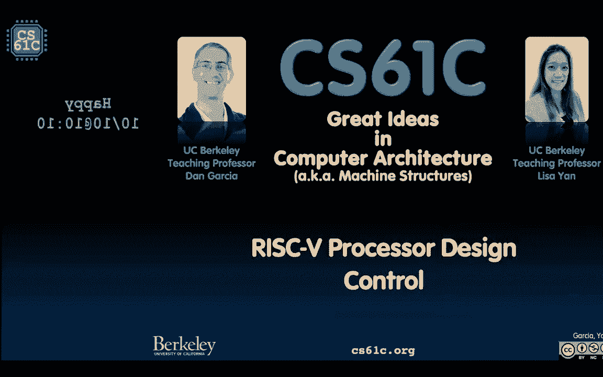

只是想在那里给你一些爱，挺有意思的，好啦，数据路径和控件。

所以在回顾中，到目前为止我们看到了什么，他们在开球方面做得很好，当我们使用类比来查看完整的数据路径时，我们已经看到了我们有五个执行阶段。

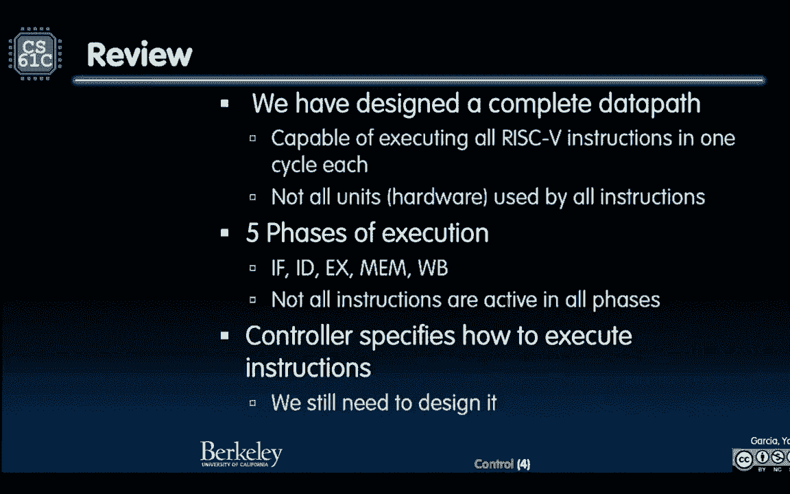

我们现在可以运行风险5中的任何一个，我们看到的说明太神奇了，所以我们建立了一个语言风险五，现在我们造了一台机器来做到这一点，我们还没有控制住它，所以我认为控制是让事情运转起来的提线木偶。

所以数据路径就像管道，控制就像，你如何转动开关让它们都工作，所以执行有五个阶段，指令提取，指令解码，执行，哪一个是我们的路，一些记忆显然意味着不是，所有这些都将是活跃的，您要注册请阅读，你不碰记忆。

但你仍然有这五个阶段，马上我们将推动内存或寄存器，在一天结束的时候，控制器指定这些如何工作。

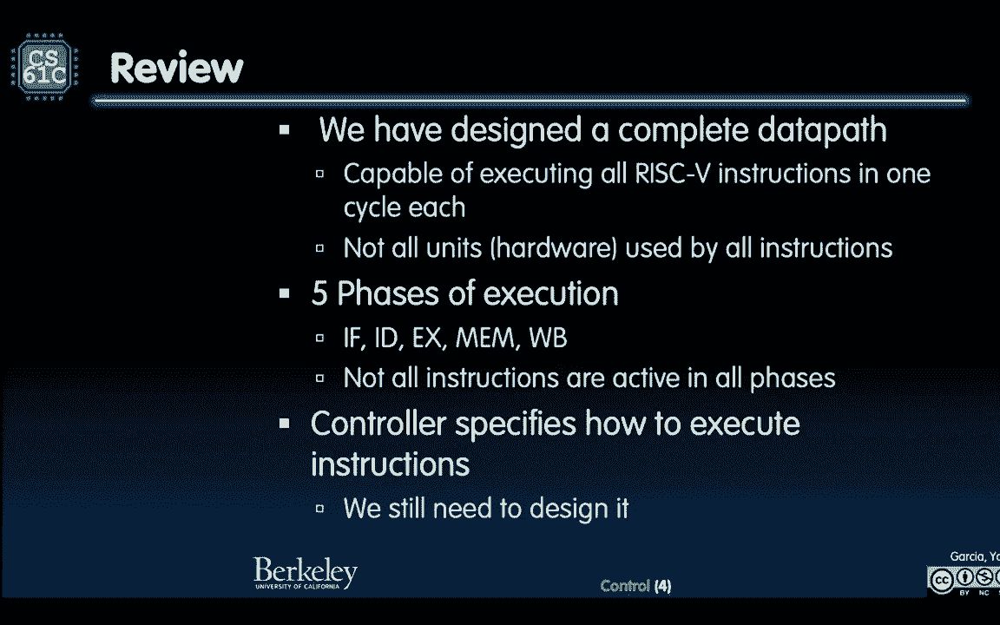

所以让我们做，让我们今天来深入研究一下，这是我们的单核过程，你以前见过这个，现在你知道记忆是右边的一部分，有一些写和读数据，现在你知道你知道我知道那些台词，我看这个写数据，读取数据。

我知道那些台词是什么意思，我的地址来了，现在我要启用内存，我是为了记忆而阅读还是写作，当记忆在阅读时，总是被动的组合逻辑，我写的是在下一个时钟周期开始时，这一切我们以前都见过。

下面是我们的数据路径，我们已经看到，丽莎很好地解释了我们建造的所有东西，为什么，现在让我们深入了解更多控制这些的例子，你做了几个控制线的例子，控制，你在底部看到的底部大行。

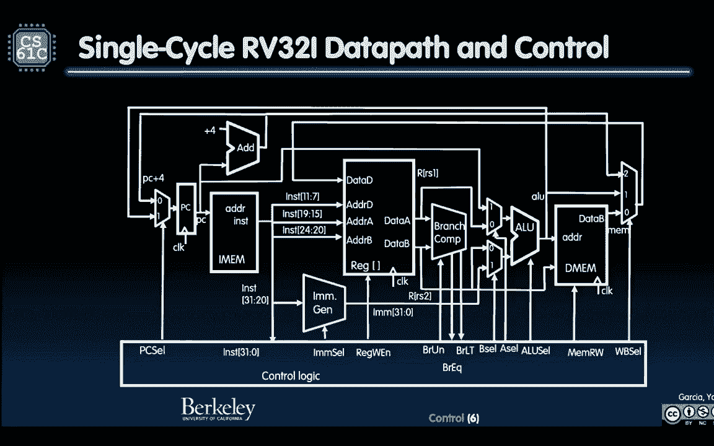

所以让我们深入研究一下，我要袖手旁观，今天我要少动一点，我要用光标向你展示什么，我会专注于所有的权利，所以我有一个存储字加载从内存存储到，所以目标是从这里的数据推送，从寄存器到内存存储二。

我有一个基本指针，到目前为止已经加载了，所以我有一个收银机的地址，我想把它放在哪里，它将被添加到一些抵消中。

我们要把这些数据放在那个位置，那是我们以前都见过的，让我们一起做吧，所以我们首先看到的是十二点，第一件事就是拉响警报。

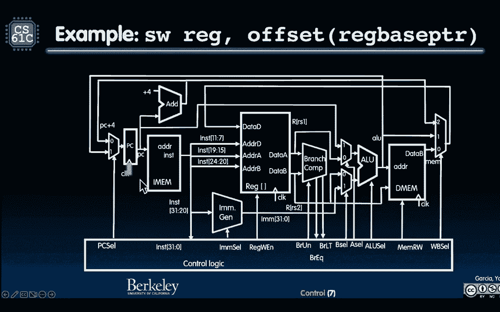

这个钟升得很高，在运动中开始一整天，突然间那些线变得很高，为什么新的个人电脑，不管那台电脑是什么，我不知道那是什么，可能是跳转到这个指令，我可能得知道那是什么，我也不知道，我醒来，我知道那是什么。

然后我添加四个，它就在这个多路复用器的内部等待，可使用，也许没有结果，它将被使用，因为一个存储词也是PC加四，所以我们知道我们以后会用这个，但它在等着我，这条指令从IMM中解码出来，IMM是只读设备。

他知道这里没有钟，所以数据出来了。

传送到所有这些线路，分成这些线，包括直接，因为这个偏移量是直接PC加4的一部分。

他说马上就要爆炸了，现在已经定了，它将在注册繁荣的PC内部等待，就在那里完美，我的直接选择器是什么，我有很多选择，会是S型的，因为这是一个s存储单词是一个s类型指令，所以它抓住了s类型的特定部分。

你可以查一下细节，我们上次看到了，今天结束时我要给这个登记处写信吗，否，存储的目标是写入内存，不登记，所以写寄存器写已经启用为零，你知道右后卫选择的是什么，会是什么，如果我不给寄存器写信。

“那么我在给谁写信呢？”，我根本没在写，没关系，谁将把这些数据输入其中，我不全是写的，我早就知道了，这个WB细胞将是一颗恒星，我不管那是什么，我关心的是这个部门是否会比较，是否使用无符号比较。

我不是在做比较，我只是在做一些事情，所以那颗星根本没有分支，那颗星那颗星，我在哪里，我要用一个ALU，我们几乎在每一个操作中都使用Lu，几乎每个我们使用ALU的人，我们在这里做什么。

我在读数寄存器的基本指针，我把它加到偏移量上，记住，就像三个中的一个对吧，所以这是一个基本指针，再加上十二个三个，所以我要做这个，ALU X将成为一个广告，我们开始吧，我怎么喂得好。

一个说B说必须从直接的，A说我从这个寄存器里喂它，因为这个基本指针只有5位，说是哪个寄存器，实际的32位进入寄存器本身，很明显是1和0，然后再次选择此添加，阿卢变热了，几乎每一次手术，我在为记忆而写。

是呀，我是，我很好，这是所有指示中唯一的一个，实际上存储要存储的单词，半个字，存储字节，但这是少数几个我真正触摸记忆并为记忆写作的人之一，这是非常令人兴奋的，所以这是对的，就像我们在斯坦身上看到的。

那些线路变热了。

那些线路变热了，那些线路变热了，突然之间，那里的状态，当时钟敲响。

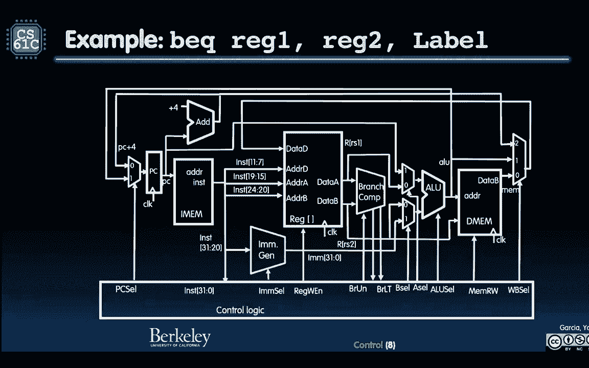

有人写信给他，PC得到PC加4，好啦。

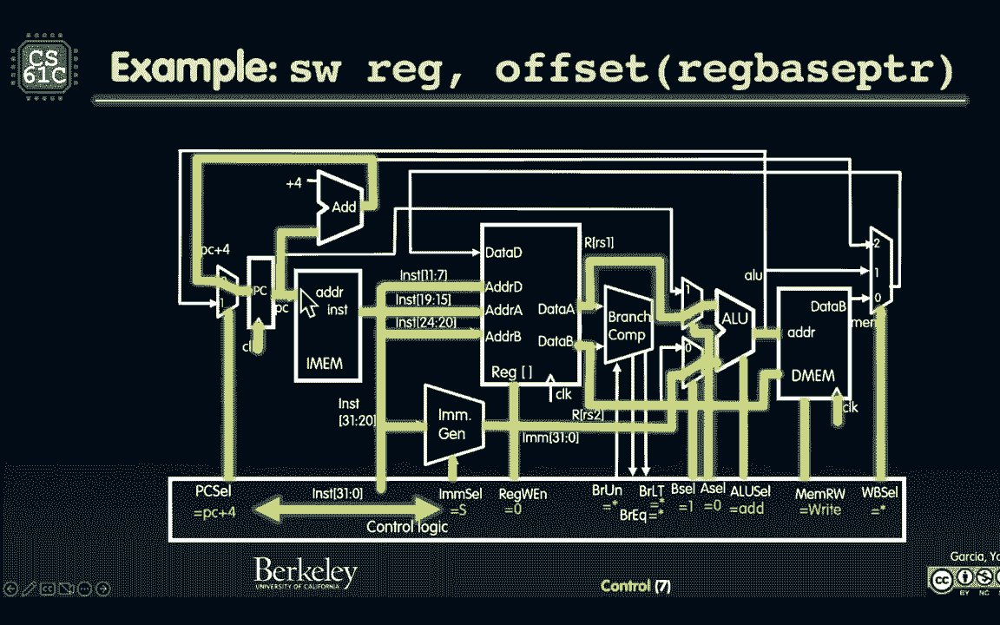

我们以前见过，那是一篇很快的评论，但这是存储词分支相等的控制线。

记住有一个目标，每一次行动都有目标。

必须有所改变，为什么你会有指示，什么都不会改变，所以可以改变的三件事正在改变。

通常有一台PC在更换，这就是我们在这里做的，我们的目标是也许我们会改变一台正在改变寄存器的PC，也许我们在做一些更新，我们在做更改寄存器还是在更改内存，这是我们要做的三件事。

在这一点上还有什么可以改变的，有人指出其他可以改变的东西，这就是改变的三件事，所以今天我们要在这个特殊的今天，意思是这个分支我们要改变这台电脑，也许也许如果他们是平等的，如果他们不是，我们不这样做。

好吧好吧，我们每次做加四或不做加四都会改变它，如此正确，唤醒新的一天，所有被喂食的，这已经是，这就是我以前看到的一切，有趣的是这台电脑会过来，为什么它会很好地传到这里，我去这个标签，记住记住分支相等。

分支相等是一个相对的东西，所以我们得把电脑，然后把它加到三角洲看看我们去哪里，好啦，所以指令现在被解码了，我有所有的部分在那里，是树枝，这是一个分支，所以，我正在做一个分支立即。

我今天是在给收银员写信吗，我不是零，我是否关心一个无符号的比较，那很有趣，在我们告诉你那是什么之前，我们该怎么想，我们做事是平等的，有关系吗，如果他们没有签名或签名，相等意味着位等于位。

32位等于32位，那就是星星，我在乎分支的价值吗，小于是不是，我在乎价值吗，我会说到那一秒钟的，这将是一个分支相等，我真的很在乎，我是什么，我得喂这个阿鲁，我喂它什么好，其中一个价值将是旧的PC。

另一个值是什么，嗯，这个偏移，不管这个分支偏移量是多少，我要把这个偏移量，再加上那台电脑，相对代码，是添加到现有的PC上，上下移动一点吗，Alu a选择是一个，意思是它来自电脑，零均值来自寄存器。

B B总是说来自眼前，B入选，这个来自媒体，所以我把它们加起来，我为什么要加他们，因为它是偏移量，加PC加等于，不管三角洲是什么，我以前见过这个，我写的是你的记忆吗，否，那只是被动的，回到被动的状态。

只有存储是活动的内存，其他一切，每一条指令都只是一次阅读，只是被动，顺便说一句，也许它会起作用，但这是一个地址，去查查价值，我们不在乎，我们不用它，我们不用它，所以在这个特殊的，我们用它来形容其他词。

但不是这个特定的右后卫像零，我们知道这一点，因为我们不会改变寄存器，当这个归零时，你知道这是一个明星繁荣，立刻，你应该这么说，然后最重要的一个，呜呜，当这相等的时候，我有，什么，我控制什么。

这在这里有什么变化，你应该能拿起你的手指，这里会有什么变化，什么会改变，如果相等的话，PC，是啊，是啊，改变它得到的东西的PC，PC选择，以便选择的一块是该分支相等与否的结果，好啦，我觉得，哦。

所以这一切都变热了，这一切都会改变的，全靠这个，会改变的BRRE Q，这台电脑选择一种方式或另一种方式，所以这两个都很热，然后我们实时做出决定，不管那个分支是否相等。

到目前为止，他们有很多人，而且进展很快，但希望很多评论，我们只是在经历所有可能改变的事情，让我暂停一下，处理一下任何问题，这是一个很大的问题，我跑得很快，我们今天有很多事要做，是一场座无虚席的演讲。

所以我想确保我涵盖了所有，但本质上你已经看到了数据路径，我们只是一个接一个地经历并理解它，如果你，如果您在数据路径上仍然落后，我建议看丽莎的讲座，在我们开始这个之前，请确保您对理解数据路径感到冷淡。

所以如果你在YouTube上，暂停回去，确保你在所有这些步骤中都是冷的，因为这就是我要走的步伐，我假设你和我在一起，我假设你，你有点动摇了数据路径的所有元素，我们会在这个时间。

我们已经讨论过什么是热的，当我们还没有真正谈论这一切的时机，这个时机让很多人在61 C停顿了一下，这很难，我们以前从来没做过计时，你知道从来没有真正担心过时间，如果有什么，你只要调用一个函数。

其实我们很在乎时机，当然，我们正在建造CPU，让我们来看看什么，时间是广告的，所以我要加上这个，这是最简单的一个，从字面上看，最简单的操作就是添加，一半的这一半要去黑暗，我们不在乎他们，所以我早上醒来。

这个变热了，所以一个新的PCD，新的一天破晓了，我都不知道那是什么，但这里有个地址指向你，如果我看这个碰巧是这个广告，广告的片段，你现在知道那是什么了，太刺激了，电脑加四等着明天，我们要做电脑加四。

我们知道那会很热，在这里解码在那里我们看这个，我们已经知道我们在等待PC之前就已经知道了，因为它依赖于那个分支，等于现在我们已经知道接下来是p加4，下一条指令是，在IMM里的广告后面是什么。

我有什么即时的吗，我不知道，所以一旦我看到这将是明星，我已经知道我们要给B细胞，B细胞不是从一个直接，因为这是星星的意思，我当然不知道，我这里有垃圾，如果我有明星意味着，我根本不在乎这条线是什么。

这条线上有比特，这才是真正有趣的，这是一个非常有趣的考试问题是在一些指导像广告，我问你，这条线现在是什么位，好吧，这取决于如果我说明星好，那你不知道，因为它可能是任何东西，但如果我说。

让我们把它变成一个B，你在解释这些广告，好像他们是一只蜜蜂，戳着它，告诉我到底是什么，即使它会被忽视，因为b选择是零，所以它将被忽略，但告诉我这些是什么，真的很有趣。

如果学生能真正理解这些比特在不同的教学中是什么，不是那个开车的人，你应该能做到的，那很有趣，如果你有一个学习小组，这是一个问自己的好问题，所有这些线条，没有一条线，没有指示转弯，所有这些黄色。

所以在一条线不是黄色的地方，找出这些比特对特定结构的实际作用，可能是，你知道的，要求拉起绿单，把所有的部分都看对了，那会变成什么，就是这里，如果你是明星，你不知道，因为我不知道那是什么感觉。

我是说它在做，但只要把它分配给一些随机的东西，把它放进去，我把它放在B，把它放进去看看那些碎片会是什么，这真是个好问题，考验自己的好方法，我是在给收银员写信吗，一天结束，我的全部目标是写信给登记处。

所以是的，我在写，这意味着我确实关心，后面是什么，选择我已经知道会是哪一个了，你能告诉我。

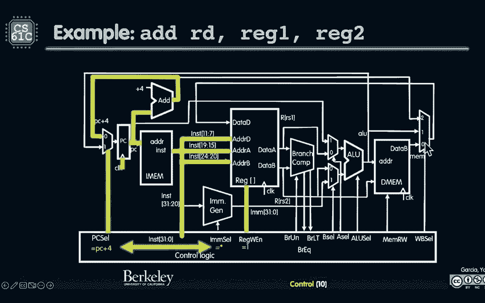

零一二，零来自内存，一个来自鲁国，两个来自电脑。

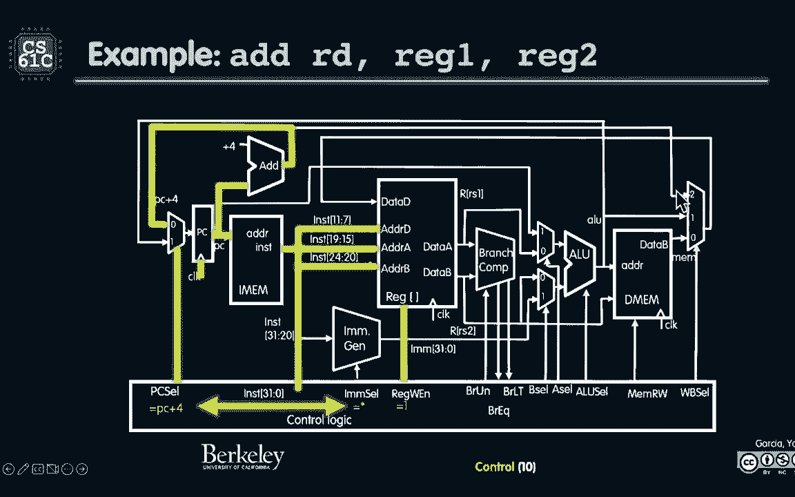

好啦，两个来自电脑。

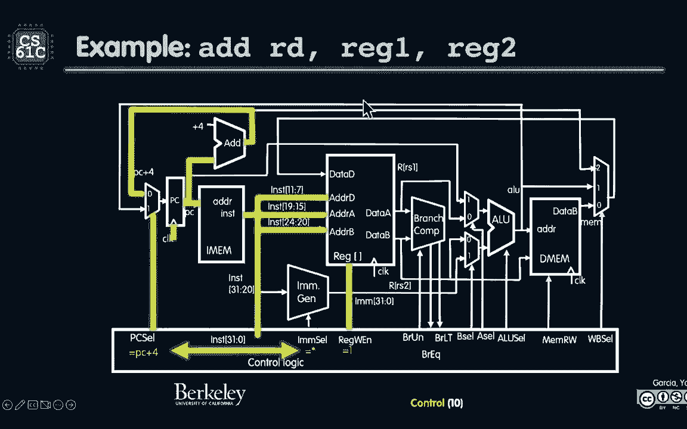

加四，哪一个，我要驾驶它，添加的目的是什么，从ALU写回记忆，ALU会有的，所以有些人实际上写了一个，他们也在这里写ALU，不过，我们走着瞧吧，我只想看一次，我知道这一点，我已经可以跳到前面了。

如果我想，顺便说一下，这也是考验自己的一件大事，只是说，抛出指令，您应该能够写下所有这些值，就像很快，所以这是这个级别的另一件事，你们应该都能做到，这就是为什么我早些时候走得有点快，但你应该能做到。

好啦，我要和这个分支比较器做比较吗，否，那里会有碎片，但我不在乎他们是什么，所以不管是什么，这些值是，什么都没有通过，价值正在流向分支竞争对手，分支比较器，那是一条信号线，说着，你是没签名还是没签名。

比较一下，有一些碎片从他们身上回来，我把他们都忽略了，没人在乎，我关心的是，B选择一个ALU选择井，如果我用的是ALU，我当然知道，我们正在利用这一点，所以我当然在乎，那些是什么。

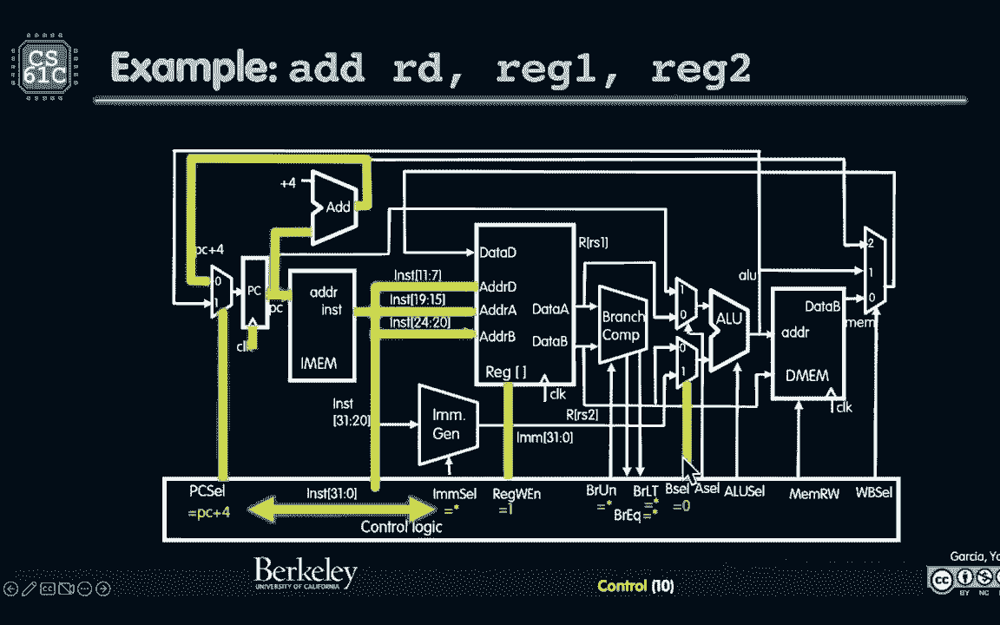

这些都很明显，零和零表示寄存器的馈电，这是一个简单的问题，所以零和零总是表示双寄存器读取。

太好了，我们有一个注册文件，一次可以读两次，那真是太好了，那是许多人，不过，我会去收银台，你可以从一个读到一个写到一个，早上写一篇，然后读一篇不，我们需要读这个广告的两个，我们需要读其中的两个。

所以我们最好买更好的，构建寄存器文件，所以丽莎说支持双读，这是非常重要的，为什么我在一天结束时加上，与ALU在一天结束时，我在做广告，当然，我做任何记忆，嗯，我最好不要，我最好现在又进入阅读模式了。

另一个很好的问题设置了意外的正确，好好看看会发生什么，这里会有地址的，地址是这些东西的总和，所以我可能会问什么改变得很好，你可以算出总数是多少，然后你可以抬头说，那是要用什么改变的内存地址。

然后你沿着这条线，哦，这是怎么回事，这不是很有趣吗？那不是很整洁吗，所以你真正做的是，你写信的地址是，R2的数据是什么，你写了两篇两篇两篇，你在和里写r 2，一加二，不管那碰巧是什么。

那就是你写二的地方，如果这是一种权利，你不是，但如果它不小心得到了，你说的对，你就会把它放在那里，只是一些问题，你问，我只是在戳，我只是在上班时间闲逛，我说过这里会发生什么，这是一件很有趣的事情。

因为你又在为，我们正在用ALU回信，排名第一，第二天写的血淋淋的，但这些都很热，这些都变热了，关键是这是最重要的，此操作的目标是更改寄存器文件并boom，上面写着扳机，在数据中等待着，数据在那里等着。

地址在那里，去是。

这是数据，这个数据将是，再加上地址就是那个地址，那五个比特所以第二天，个人电脑加四个，第二天加载，这个寄存器有一个新值，我们准备好出发了，让我们再详细一点。

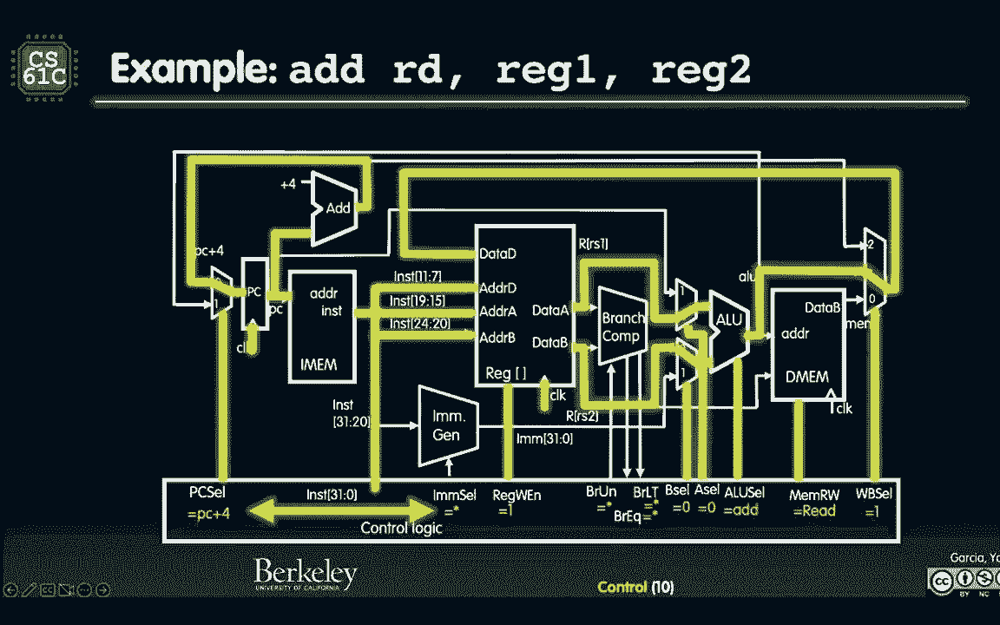

看例子，加x一x二x三，这是一张非常有启发性的幻灯片，我真的很喜欢这张幻灯片，所以我们到这里来，这就是我今天站在这个讲台上的原因。

因为很多镜头都是放大的，请随意放大我，对了，摄像的人都进来了，因为我可能不会在今天剩下的时间里到处走动，所以时钟走高，发生的好事，有一台旧电脑，我不知道是什么，现在PC醒了，不管这是什么这台电脑。

一千说电脑，一千是这个的地址，所以这活在记忆中，广告的这些片段，活在记忆中，一千块就说明了这一点，所以PC醒了，请按，这不会隐藏的，我只是要移动我的鼠标在这里，接下来发生的事情，这台电脑出来了。

现在立即进入这个广告，现在在这个后面加上，延迟这台电脑加四或指令，在那之后就在这里等着，在井里等着，如果你有任何问题，或者举手，如果我开得太快，我们只是慢慢来，我们就像单周CPU的慢动作计时。

意味着每条指令都要在一个周期内发生，然后我们要问一些问题，2。我们最快能跑多快？在接下来的几张幻灯片中，现在呢，这台电脑出来了，我拿到地址了，我知道这是一千个一千个进来，有一点延迟，什么事耽搁了。

延迟在这个叫做imm的组合逻辑元素中，其中有一千个进来，这里有一千个进来了，从这条线上出来的是什么，这则广告的三个二位编码，就在这里，所以这些现在要热了，这些都是实际值，他们会吃进去的。

我们要看看还发生了什么，嗯，这进入了我们今天正在构建的控制逻辑，我会谈谈如何做到这一点，但假设它需要一点延迟，弄清楚我们今天要做什么，哦好的很好，我们在做一个x 1 x 2 x 3的广告。

我最好把我的线都准备好，除了把我的房子准备好，让我得到我的台词，我们一直在谈，所有这些底线都在这个底部，让我们把那些准备好，让我们开始考虑他们，让我们开始弄清楚打开和关闭东西的组合逻辑。

所以我们称之为加法控制透镜，我首先要做的是登记，阅读这些片段，直接进入，这不是控制线，控制逻辑作业，这才是正道，它连接在数据路径上，这些部分变热了，因此，这是一个读取元素和bloop，突然之间。

我将从中读出一些值。

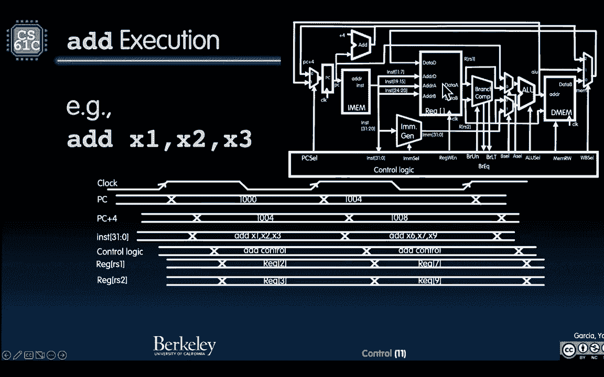

我在读什么，我正在读第二页和第三页，所以价值出来了，注册二和三，是什么触发了这一点，现在这些都很热，指令一出来，所以当这个指令出来的时候，这就是延迟，这里是内存读取延迟是一个时钟，其实不是。

它是组合逻辑延迟，又不是说，里面没有钟，只是，这只是一个组合逻辑延迟，不管怎样，一个新的地址。

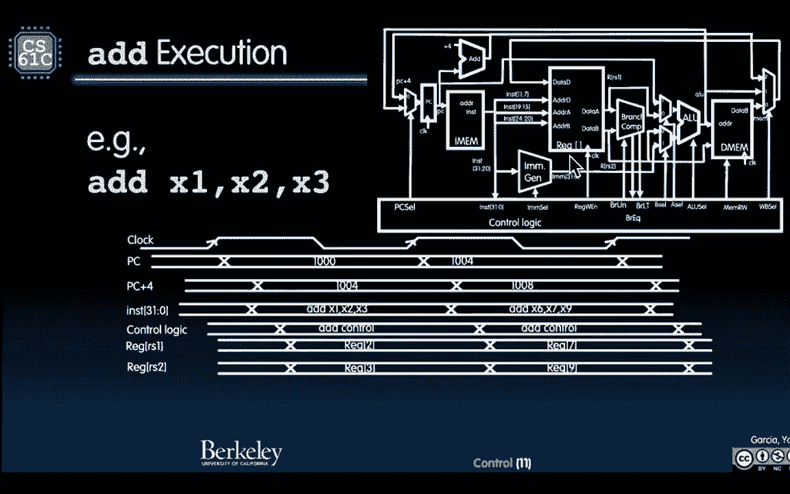

这里有新的五位，这里有新的五位，有一些延迟，在登记簿上阅读和繁荣，那些价值观变热了，这里和那里是黄色的就是这两个部分，不管登记簿里有什么，或者登记簿里的任何东西，就在那些行上，第一和第二的寄存器，好啦。

下一步是什么现在我有了一些新的价值观，顺便说一句，这些值以前是垃圾，不管是什么，我不在乎，这个卢在做一些其他价值观的广告。

但现在我终于得到了，我真的很关心这件事注意到我们就快到第二天黎明了。

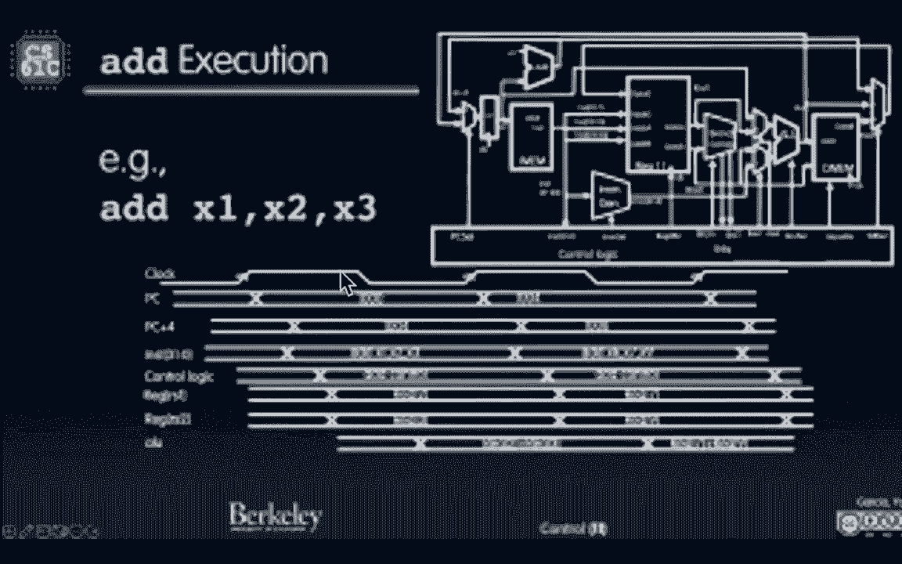

这很糟糕，帮我坚持到最后，最好在这里完成，所以最好能成功，哦，我的天哪，这东西太短了，我们会有麻烦的，这个ALU现在有正确的值。

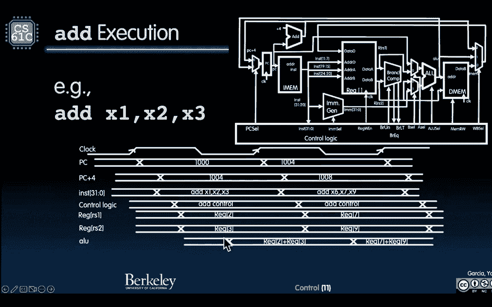

我是在你叫我加之前加的，我一直在添加，我从来没有开始添加，我一直在添加，但直到现在，两个好的价值观，我关心寄存器一号和寄存器二号，或者不管x 1指向的值是什么，到了x2和x3，卢现在得到了他们。

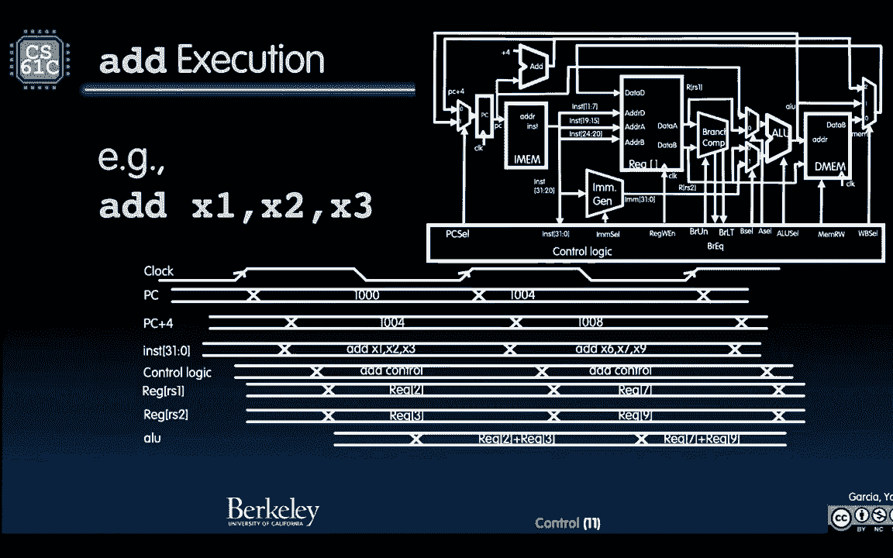

我有我的广告，所以现在我得到了reg的值，是2号加红3号。

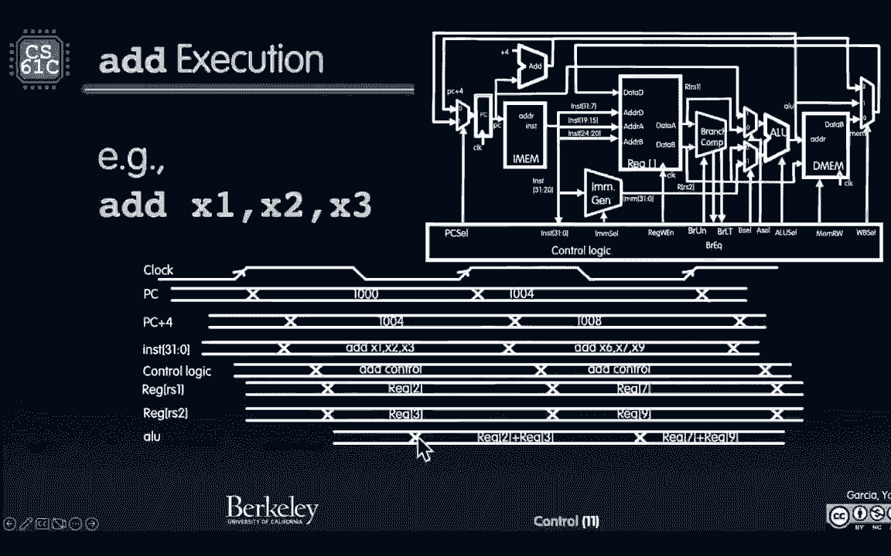

现在鲁有它看，都是你看，它是，就像不可能完成的任务，就像。

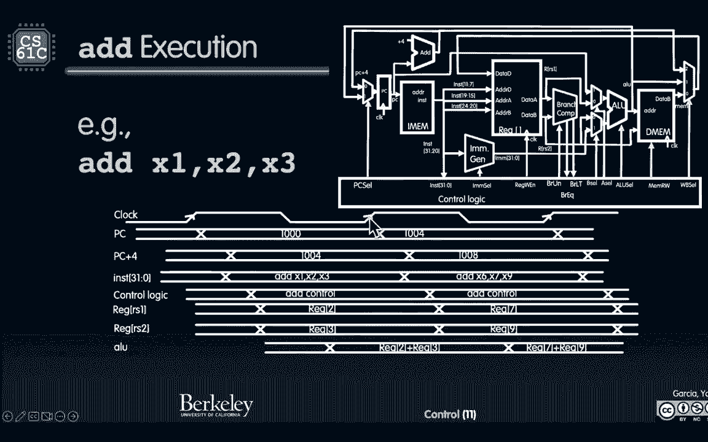

炸弹要爆炸了，就像计时器一样，我最好在下一个钟点前完成这件事，快点，快点快点，下一步是什么，这必须以最快的速度塞进x 1，但它还得经历更多的事情，它必须通过这个多路复用器，它必须放在这里，而且更好。

在安装前做好准备，好啦，所以这个右后卫穿过这个右后卫来到这里，这是正确的，这里是右后方，这是正确的后值，它在那里，它在那里，它就在那里，有足够的时间，设置好让它进去，然后注册一个，不管是谁都是垃圾。

我以前不知道这是什么，但我要去这个皮肤剥落，它，我不在乎，它是什么，我要把它打得落花流水，r的和r的和x2，再加上x 3的r，等等为什么，这是什么？等一下等一下，这很糟糕，坏了吗，它发生在这之后。

那么在时钟上升边缘之前应该发生什么，否，价值就在，但是值是在时钟时写入的，所以它就在那里，价值在那里看，价值及时存在，时钟命中，现在它已经为下一个周期做好了准备，所以如果下一个周期，我用x 1。

它会有正确的值，那是他们的关键，你的问题很好，问你的问题，哦当然，我看见你了，我没必要，哎呦，这是个好问题，这正是一个很好的问题，问题是再告诉我一次，尼康悬而未决的问题。

CPU设计人员是否必须考虑所有这些延迟，百分之百，是呀，不能再多了，是呀，如果我们看到这个，我们必须考虑到所有的，事实上，我们将在下一个指令中看到这一点，就像，最长的路是什么？在那条关键的道路上是什么。

当我们调整这个，当我们看着我们的时钟，这里是嗯，我们想把这个，我们想卖一台速度快的电脑，我来拿把手，我把它上下翻转，我最好能看到所有这些值。

在所有可能的组合中，看看我最长的路是什么，看看那个时期能有多小，因为那可以说是价值数十亿。

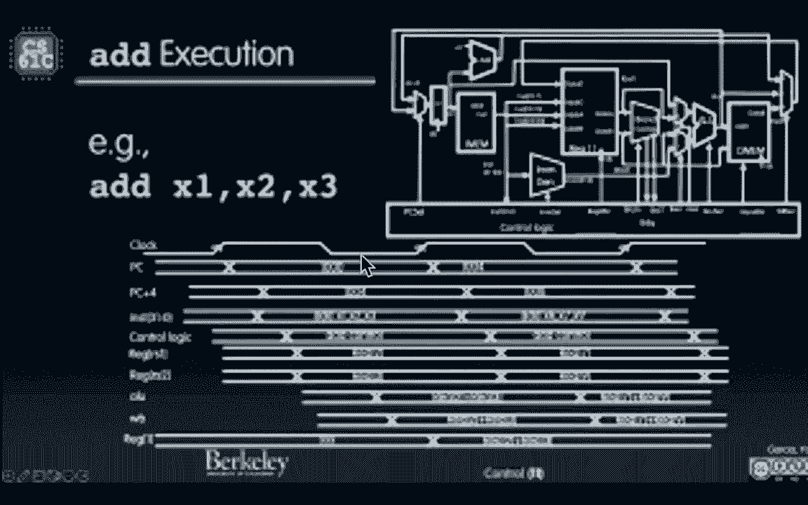

回到以前，如果我能让这一点，两个5千兆赫与世界上一个巨大的性能差异。

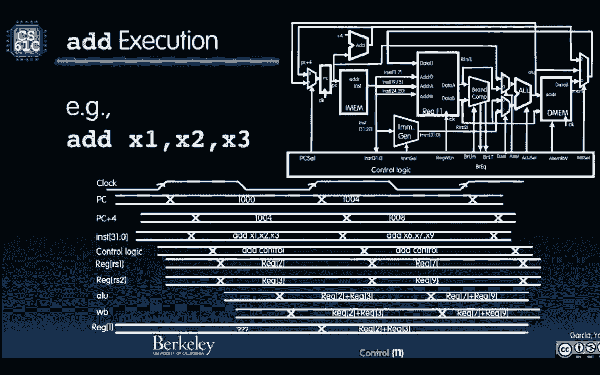

我的意思是整个世界运行在125G赫兹。

但如果我肯定会违反一些设置在那里，我有很多T套，我可以违反。

我可以违反这个设置，你为这个做了准备，所有的钟还是这个，在任何可能的组合的任何阶段都不能违反，这正是CPU设计要做的，这就是我们正在做的，我们一起开发的，放缓，在几天的时间里以慢动作显示。

做这件事会是什么，做这些计算，那正是我们正在做的，完善更多问题，太好玩了，但是是的，去吧，告诉我，告诉我乔纳森，走呀，走呀，是的，单位的延迟时间有变化吗。

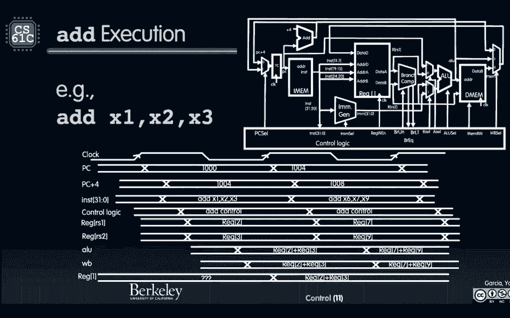

当然，真正大或慢的事情，记忆慢，事情真的很小，注册真的很快，所以很明显，在需要多长时间才能，在内存中寻找一个特定的位置，并将其值与，啊，只有五块钱，只有32个可能的寄存器，值注册得非常非常快。

那是在很远的球场上，还记得萨克拉门托吗，这需要很长时间来担心，所以让我们好好想想。

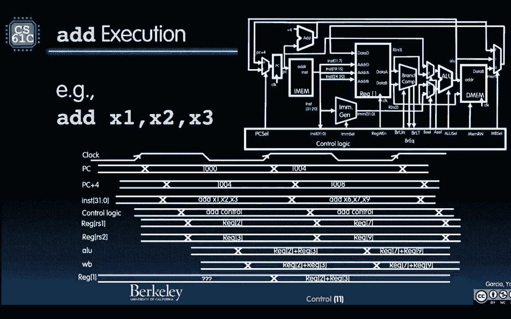

这是我们的广告时间，这正是重点，现在让我们看看我们的关键路径，哦伙计，这会让人困惑的，但请记住，作为最简单的指令，让我们谈谈那个。

我们的关键路径是什么，让我们在这里看看，第一个排队的时钟是什么？我要问你，我要指出一个术语，你告诉我它是从哪里来的，那怎么样，我们会在那里玩得很开心，第一个排队的时钟是什么？

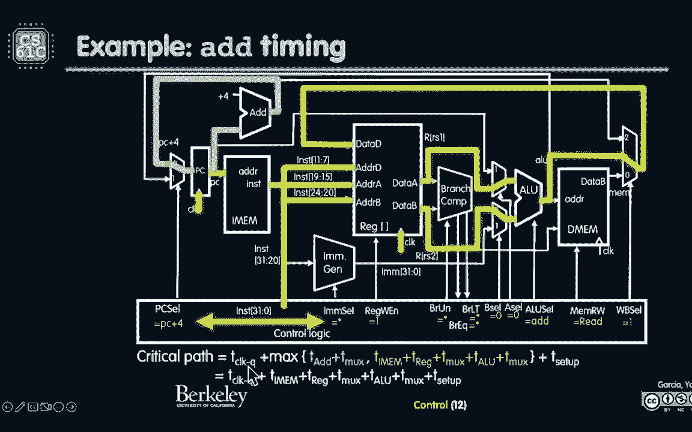

那是电脑，以前就是这个人，那就像黎明，一天的黎明是PC，PC寄存器唤醒，不是三个中的一个，这是一个三三寄存器，它醒了，我在等你的时钟，我现在就可以开始了，记住我们在做广告，我像麦克斯一样这么说。

我为什么，为什么有最大值，我觉得麦克斯，有两条路径，两条平行路径，我的意思是，更长的路径是。

这将是我的批评之路，那么为什么这两条路径，你可能会说，观众参与，为什么有两条路径，所以这个广告不仅仅是亚当，为什么我必须有两条路径，这里发生了什么事？为什么会有，我看你可能会看到你。

我只是看到一件直截了当的事情，去吧，去吧，去做吧，为什么会有，为什么没有任何意义的两条路径，我送出的两种颜色，屏幕上有两种颜色，如果你看不到，一个黄色的，所有的数据都在那里，这个小小的绿色的是。

所以这可能是非常小的，所以我们把它冲走，让我们来看看真正的道路，所以所有黄色的，这就是为什么我们称它们为黄色，我们先来看看，是广告，那是伊玛目，我们得看一下登记簿，读取这些寄存器的值。

我们现在要通过多路复用到这里，为什么这不是，再加上两亩有两个武藤去了吗，就像上面的渣滓和下面的渣滓都在等着他们，它们是平行发生的，只有一个多路复用器，然后有一个ALU，还有另一个多路复用器。

右后卫多路复用器，以前必须发生的一切，就像我们上次说的，所以如果你抹去绿色，你只剩下这个Q钟了，顺便说一句，这是一个很好的观点，在那里你应该停下来，能够理解一切。

我只是说你应该明白为什么这个Q钟是从这里来的，我从哪里来的，顺便说一句。

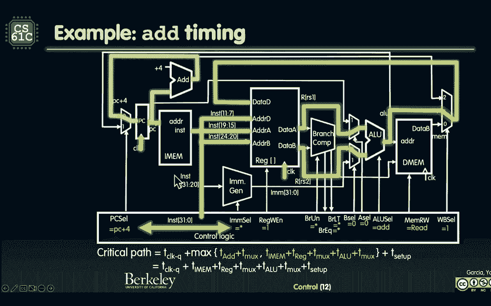

反之亦然，也可以创建这个，闭上你的眼睛，不要看关键路径，你应该自己写所有这些阶段。

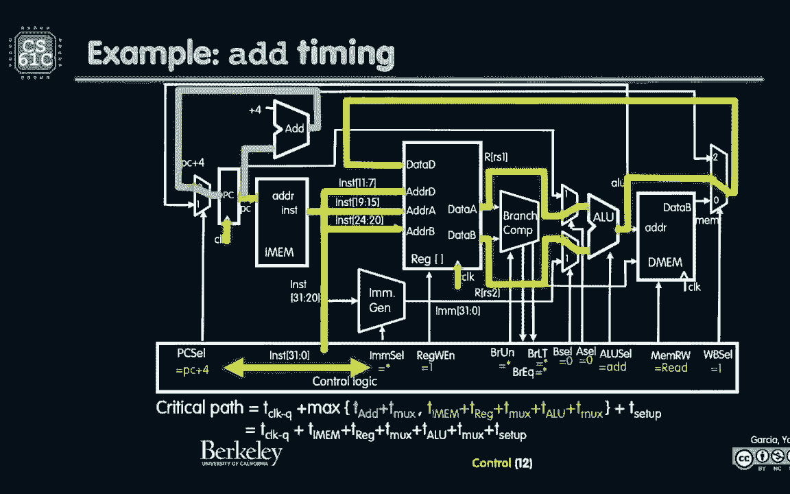

加上IMM，加上收银机，加上这个多路复用器，加上卢，加上这个多路复用器，加上设置，就坐在这里，这是最后的总数了，让我们暂停提问，是呀，告诉我进去，我去，T在中间的时钟到Q，在中间啊，嗯，Q的时钟。

所以让我们想想这是真的，那倒是真的，那是同时发生的，这在理论上是如此，是呀，如果不知何故，这需要多长时间才能发生，我们只是想说，把这个钟告诉Q，这个时钟根据以前的指示Q，关于之前的指令。

因为我们假设寄存器是稳定的，它是什么，如果你有一些时钟更新，假设这是加一二三二三可能已经更新了，最后一条指令可能改变了2和3，如果你碰巧买了一份注册文件，登记册，芯片上很小，你不用担心，但你是对的。

如果某个邪恶的巫师把它弄得很慢，我们可能会有麻烦，因为那就像是嘿，我准备好出发了，但是x2和x3还没准备好，因为他们还在被以前的来信，所以你说的很对，但在这里我们要把它冲走，因为它太小了。

A和B因为我们在这里做同样的事情，我们在想这种时钟到Q几乎是一样的，不是通知，我没有为这个寄存器写时钟到Q，寄存器的PC时钟到Q，我们只是在说，有一个时钟Q直到事情准备好，是啊，是啊，说出我的名字。

马修，走呀，走呀，是呀，所以我们用一种，三个人的设置都是一样的，好的好的，让我看看，这是一个很厚很重的讲座。

我想花点时间问几个问题，但我们会确保一切顺利，加载字，你看得清楚吗？让我们让我们，我们可以在这里快速前进。

这是我的负载词，当我走过，你以前见过这些黄色，我不是，这不是，这一切都没有范围到这里，让我们看看你能不能弄清楚这个术语是好的，现在呢，记住记住这个，这个是浅绿色，以前在这里，我们只有浅绿色。

在这里还有那个大的黄色的，但现在看看这个，我有了另一条路，哪个是青色的，那里发生了什么事？为什么现在有两条路，我在比较，我以前以为只有一个，很明显这里有循环，个人电脑然后是广告的大部分数据。

我觉得我真的有三台电脑还在那里，我现在有两个，而不是一个，剩下的是什么，是呀，眼前的事情必须完全正确地通过，所以每当你看到我，就是说，那是立即的时间，因为这些数据，通过我们的直接通过这个多路复用器。

击中ALU，必须先击中，数据存储器，为什么为什么用那个直接的，在一个加载的单词中发生了什么，如果你还记得。

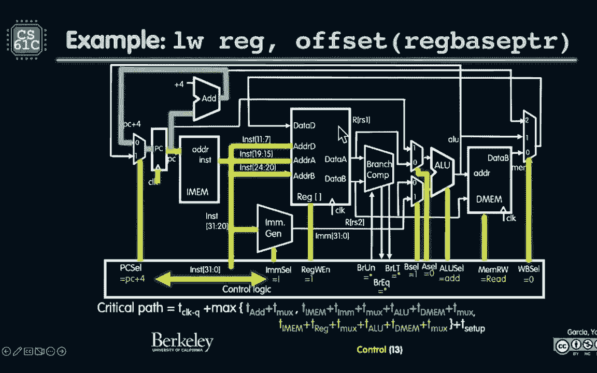

是呀，我的补偿必须加到，这个寄存器指向，所以这必须发生，所以这个ALU还没准备好。

不准备给出正确的价值，顺便说一下，有什么好的，这是这是一个负载，所以我有点，即使很慢，在合适的时间之前不需要写，我只是最终，价值就会出现在那里，但它们来自两个不同的途径，这个即时正在计算中。

正在查基本登记簿，实际的32位地址出来了，它们必须通过一条蝰蛇，要加在一起的ALU，三个中的一个记得吗，三的一等于十二。

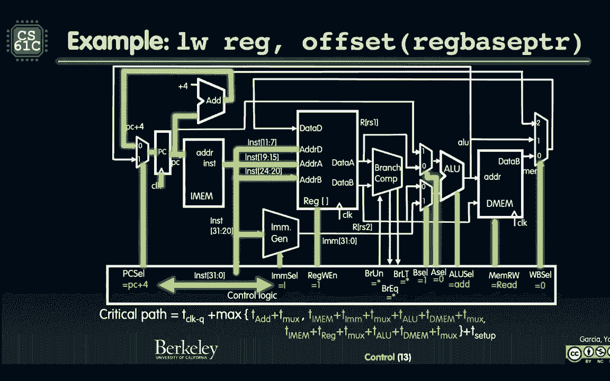

加上，那些终于通过了，然后打吕，这就是重点，所以现在你看到一旦这个时机通过，基本上都是一样的，唯一不同的是，直接的阶段是注册阶段，它们都是平行的，除了这两件事，一对一地听他们中的一个去那里。

其余的条款都是一样的，Mux lu dm t mux的术语都有相同的差异，一个从这里穿过收银机，一个通过媒体生成器走了这条路，听起来不错，所有这些线路都可以在那里变热。

好啦，所以现在让我们再来看看我们的时机，所以这是我们在钟高之前看到的时间，我有一些旧电脑在那里，我把新的电脑从电脑寄存器里拿出来了，这就是我，我正在醒来，这是我的新指示，这是新一天的曙光。

这就是我正在做的，我们今天要做什么，吊杆，这就是我们正在做的，不管这三个家伙说什么，那是我们最好做得很好的人，我的寄存器的值是多少，我可能要去那里看一些登记簿，不管这些价值观是什么，我不在乎。

我现在得到寄存器的新值，我在执行阶段，我是我的卢坐在那里计算一些随机的东西，只有现在我的ALU结果，的实际值，就像广告或偏移，加一个基点，或者它在做什么，然后如果我必须回忆我在这里做的任何事情。

我不在乎内存的输出是什么，现在我的记忆正在浮现，如果我在装货，这就是我的价值，所以你在加载词中的结果是内存中的位置，我其实想，这是一个三，那是十二个，加上基本指针，一个真正的安息之地，地址现在在线上。

我在等待那段记忆，我把它放在这里，右后段，你就会说等等，我受够了，我还没说完，如果我在加载，我还没说完，我得把它反馈到收银机里，所以我把这个放在后面。

我有剩下的东西，看这张照片，剩下的一次，我这里有，还有什么要经历的，我的右后相是什么。

这就建立了，这些都是片刻之后的事情，内存有价值，我还有事要做。

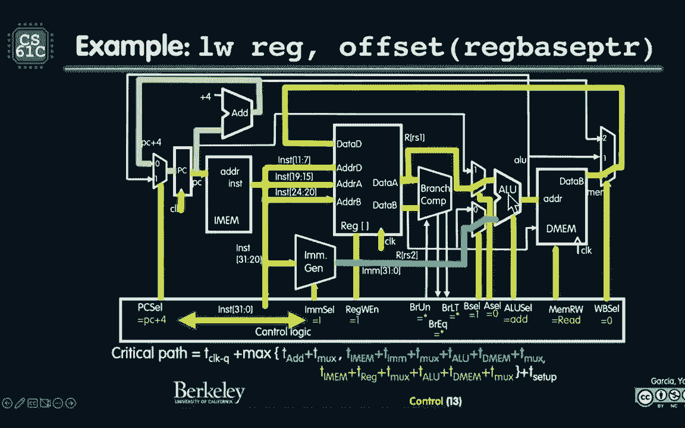

最好这么做，在此上升边缘之前的Lu Plus设置。

所以这就是控制，这里有五个阶段。

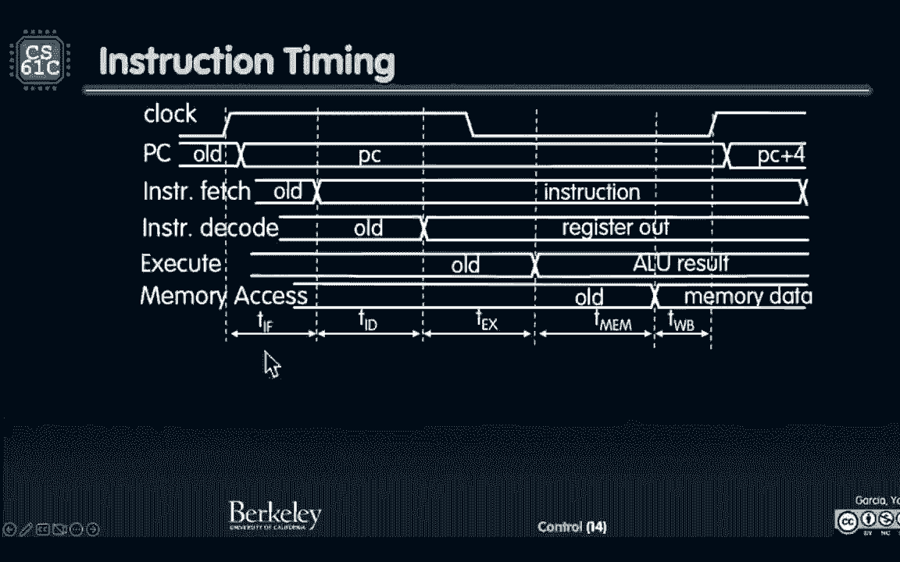

在你看到五个阶段之前我们就看到了。

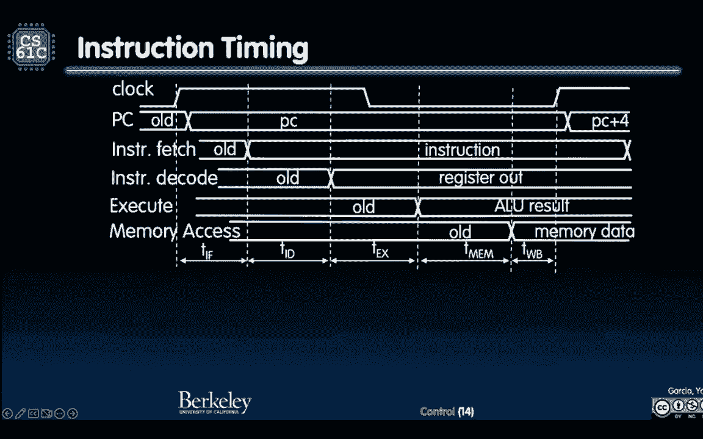

但这是他们真正的时机，这就是我关心他们的原因，这是命令，它不是，这不是随机的，不是随便五件事，这是五件事的总和--不，从字面上看，这五件事的顺序是这样的，唤醒指令提取，那天我在做什么。

这就是指示的不足之处，ID ID指令解码，好啦，寄存器是什么，我们需要，这些价值观是什么，这是id阶段执行说的，让我们对一些，我把你的地址，加a加一个基指针，所以我加了一个地址加上一个偏移量。

还是我添加到寄存器中，或者做些什么。

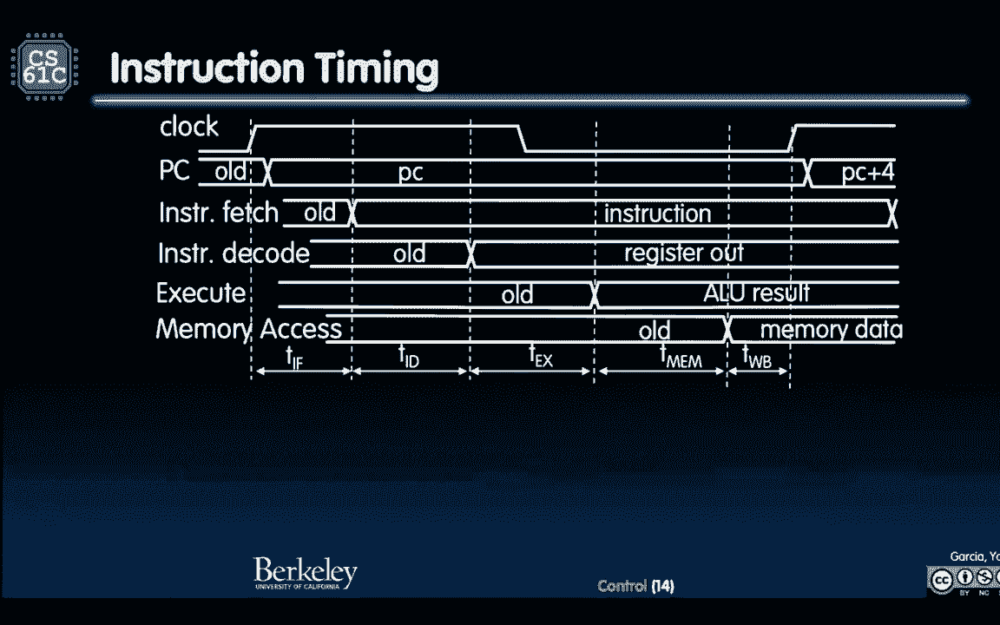

或者改变和减少它们，那是执行阶段，或者做一些分支比较。

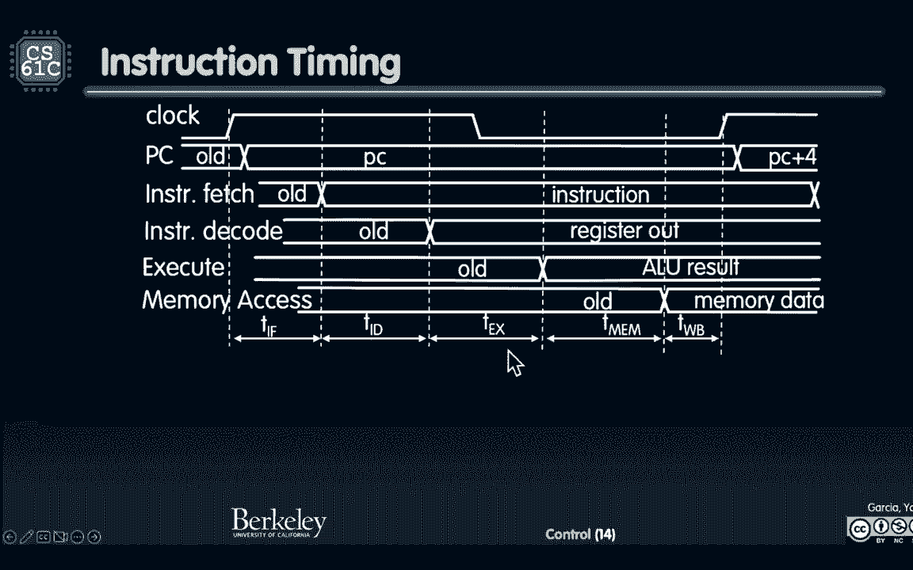

那也是在那个阶段，记忆说，我要去读和写记忆，除非在写作，我总是在看书，记住它总是处于被动阅读模式，除非我在写，但我还是得等，我是在回信登记吗，如果是的话，ALU加上一个T设置，我必须担心五个阶段。

现在控制了，我能多快破解，我有情报，我能开多快，那个CPU，那五个数字告诉我。

这些只是抛出典型的数字，对于千兆赫的机器，我们以纳秒为单位测量，对于一个多千兆赫的机器来说，一个分数的飞秒，所以200兆秒是五分之一纳秒，或5千兆赫，有点，能流利地说是很好的，像这样。

一百颗豌豆真的很快，一百很好，为什么这里有区别，因为这就像在我的脑海里，这里是萨克拉门托，还记得我们之前的对话吗，我们要去，我在我在擦亮，我很有光泽，因为萨克拉门托离我的头很远，我们被美化了。

既然说到这里，我们说的是缓存，但只要把它放在那里，为什么这不是十倍的数字，我只是暂时把它藏起来，所以这里有一些粗略的数字，让我们把它们加起来，就是这里了，这个总数是我们运行这个设备所能达到的最快速度。

我们终于明白了，八百皮卡秒是它的总和。

所以让我们来看看哪种指令最烦人，我喜欢这张幻灯片，哪个指令是我最痛苦的，你知道基斯特，是哪一个，哪一个耽误了我，我想做，我是英特尔，我想尽快解决这个问题，你就不能走捷径吗？这些指示中没有一个说不。

别想偷工减料，试着偷工减料看看会发生什么，让我们做吧，让我们做好准备，负载板，围成一个圈，在你的头脑中和你的大脑中，加载字是击中所有这五个的单一指令，这是一个很棒的考题，上面写着800秒。

我要去运行它7。99，什么坏了，但这是什么打破了世界的话，数据路径的哪一部分中断了右后卫，那是什么意思，什么不会发生，没时间回信，这意味着寄存器的值，记住我在加载，请记住，从该设置加载存储是一个承诺。

我做了登记，我会给你从设置稳定的数据，现在我说，你知道我要违反什么吗？嘣，我再也不相信收银机会做什么了，那是关键，违反的是登记册，重要的是你要知道，所以说，最大时钟频率是多少？现在呢，八百K秒井。

比那多一分，两个5千兆赫，那很好，十年前还不错，也许十五个，没关系，别担心那个，我们只是把一些数字放进去，让你容易些，显然大多数块都是空闲的，想想这个，大多数街区都是闲置的。

像钟仲功钟仲功单循环，CPU就像流水线。

就像特斯拉装配线，你一整天都有一辆车在组装，有可能拥有很多车，但是不行好吧，把这个带进来把这个结构带进来，好啦，把轮子装上，顺便把星星带来，今天剩下的时间你可以吃午饭，因为什么都不会发生，对呀。

这有道理吗，一旦它过去了，I F阶段，我走了，我只是喝酒，我在玩，你知道的，皇室战争，不在乎，你得继续前进，因为一旦完成，它只是闲置的，所以这很有趣，我们要考虑一下，正如我们在周三的课程中看到的。

我们如何使这更有效，例如，如果以某种方式轻推，轻推，眨眼，眨眼，我可以让所有人同时工作，就像一条装配线，而不是一辆车进来，只是通过那里，就像所有这些人可能在工作，但到目前为止没有一辆车。

我们今天只做一辆车，每个人，现在一辆车正在通过整个装配线，你能想象吗，其他人都睡着了，如果不在你身上，如果不是在你面前，你真的睡着了，你得到了报酬，不工作，看看我们运行5千兆赫，我要你回到幻灯片上。

我想是第三次SD讲座，我们有一个非常烦人的加法器和换挡器延迟，我们在中间增加了一个寄存器，就像锁系统，你在那里大块地穿过，一条特定的指令要经过更长的时间，但实际上我们可以跑得更快，我要你好好想想。

当我们看到这五个恶人，把它调到5千兆赫，如果我们在装配线上够聪明，星期三的课就讲到这里。

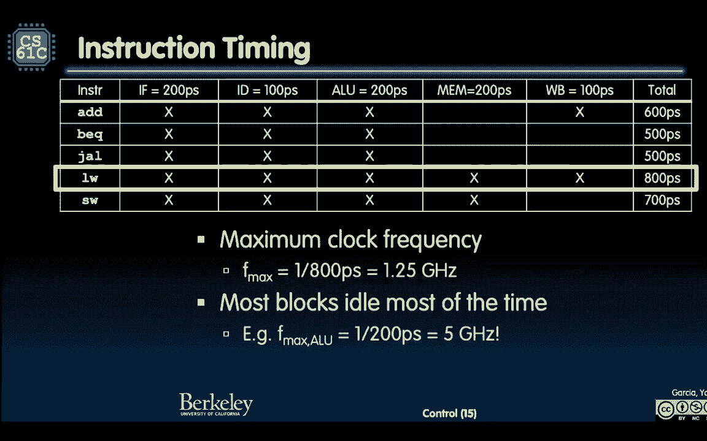

只是把这个安排在周三，我准备参加星期三的讲座，我们如何设计这个控制逻辑。

我还有几张幻灯片要做，那是我的真言表，这就是答案，我记得那次演讲，我说这些是所有的收银机，我终于给你看了，这就是所有的控制，只是，显然不是每一条指令，但对于我们关心的几乎每个人来说。

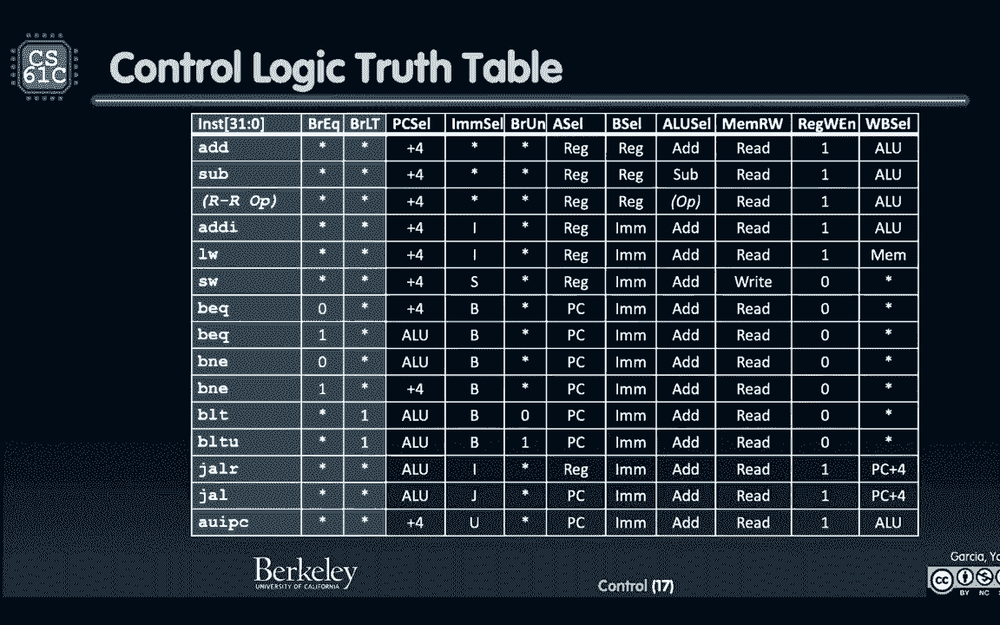

这就是所有的事情，所有的事情，我做了，讲座的第一部分，我检查了每一条线，有什么好玩的，这是看，其中一些不同，非常巧妙地添加。

和潜艇，它们有什么不同，ALU选择，这是另一个很棒的考题，我们应该考虑，这里有两个说明，他们会对线条有什么不同，它们有什么不同，那真是件有趣的事，这里是相等的树枝，为什么有两条线，因为要看树枝高不高。

当树枝齐高，意思是他们是平等的，这意味着下一台PC是ALU提供的任何内容，没那么酷，你终于可以了我终于明白了，那不是很酷吗，当他们不平等的时候，我去下一个指令，所以这有点酷，你可以理解发生了什么。

你猜怎么着和树枝不对等，恰好相反，不整洁，所有这些都很有趣，所以我想要你，这是给自己的一种，确保你能理解这其中的每一行，这个真的很好吃，把这个圈在幻灯片上，幻灯片，您应该能够只拥有一个数据路径。

我给你左边的指令，你真的把它填满了，在这一点上，你应该能够做到每一行，把整张桌子都填满，很酷，像放这样的碎片的时间，你知道x 1 x 2 x 3，给我看看，也是，就像所有这些一样，你应该能做很好的事情。

好吗。

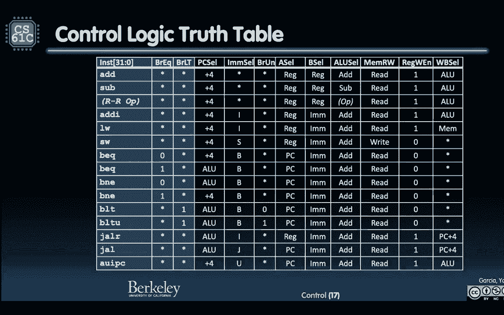

所以我想建造这个东西，我想做一个桌子来做这个。

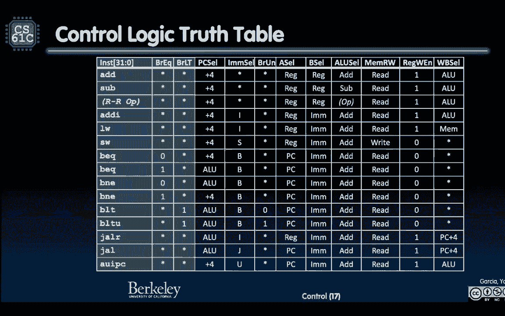

我如何构建一个表来做到这一点，这就是我现在正在做的，我们有点时间完美，只读内存，它就像一个大的组合逻辑元素，很简单，这是一个非常好的规则结构，我要试着建立一个真实的记忆，这就是我在我的。

我不知道是不是三十年前，唉呦，我会参加一个小舞会，电编码，埃普罗姆埃普罗姆，我会去找那个人，就像我写了一个程序一样，你能在舞会上编码吗，这就是我得到的，他会跨栏，他会拉出它的名字，他会闪现它。

他会闪现出来，我会带着这个节目离开，就像在我的时代，只是站在那里，看看我的手机，我没有回电话，然后呢，看着我在电话前的一切，就像，如果我们编程，所以电子舞会的程序，你的意思是，组合逻辑可行。

像这样那么快，那很酷，我们还可以使用逻辑合成将两个表转换为逻辑和门，这是一种可以重新编程的标准方法，这真的真的很好，我是自己做的，当我在写我的一篇文章的时候，我在积累，这叫书呆子套件，回到过去。

所以让我们看看我们关心的部分。

所以你看到了这就像绿色床单，你以前见过这个，说明书，几乎所有的数据，几乎如果你看每一条指令，几乎每一点都是你的平均，你只是为了数据，不是为了控制，就像你所知道的，就像寄存器的直接值或值，这些是登记簿。

五个比特还是差不多，除了这三栏，这些列说什么什么什么注册，我在做什么手术，实际上有时他们会指向这个，有助于解决这个问题的是，有时我关心这条线，这告诉了我一些事情，我马上就会讲到，所以我有这三行，六比二。

十四岁到十二岁和三十岁，例如，我现在只专注于那三行，我如何决定是否要告诉分支比较器，做一个无符号比较，布鲁，你说，我要告诉分支比较器做一个无符号比较吗。

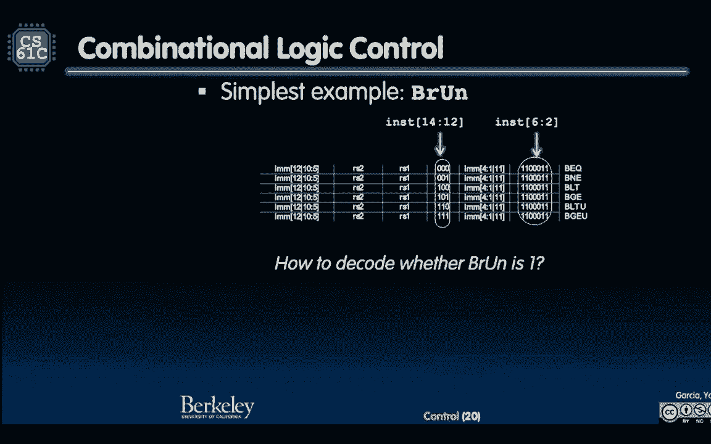

不适合分支机构，平等，不适合分支机构，不平等，但对于小于等于和大于等于，那些东西中的那些东西是，在那里，我得到了一些，我打赌那些没有签名或签名的，我要知道那些是什么，因为这将是不同的，所以看看这个。

看看这些家伙，我如何知道分支无符号比较器是否是一口井，因为这里有一个u，我关心它，当指令说是无符号的，比较，当你明确，一个没有签名的人，比较，那是他们应该继续所有这些片段的时候，它在哪儿？顺便说一下。

这就是逻辑设计师正在做的，我在决定给每一个分配什么位，他们不是武断的，精心设计的，精心设计的，这是ISA的CPU，什么是A将有位模式，所以硬件真的超级容易构建，所以如果你要这么做。

你在签名比较器上做了这个分支，那不是很好吗？如果你保留一点，那就会继续下去，当你需要问的时候，当它实际上可以去很多次，因为谁在乎，如果我在做一些从来没有用过树枝的事情，这将是一个数据，也许吧。

但当它真的在树枝上，那不是很好吗？如果只是一点点，对我来说就是这样，变焦，你们能看到变焦吗，我想看看有什么能告诉我，我是否在做一个未签名的比较，看看是什么，那不是很美吗？这就是设计，那是。

这就是设计中的工程学，多么美好的冒险，五个ISA所以我只需要指令十三，我只是看着那一点，它必须是，就像你在这里发疯一样，它必须是一个分支，我十三岁。

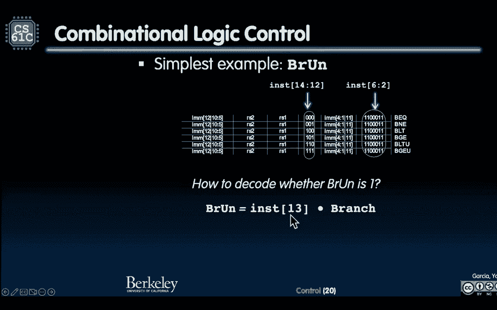

这是我的朗姆酒，我有11块进账了，我有九位，我只专注于34岁到12岁和62岁，我从数据路径本身得到了两个值，这就是那个分支是等于还是小于，这也会考虑到，我以前做事的方式，那是一种投入，不是输出。

这是一种输入，记住箭头是指向控制线的，这是我所有的衣服，我做得很好，基于整个控件的底部行，这些家伙就在这里吗，我的下一台电脑是什么，我的直接选择器是什么，是B还是S，或者我，我在做什么，3。

我是不是该把这个送给旁边的分店？这就是我所说的，专注于现在，我的两个AUS是什么，等等，等等，我们刚刚在排的底部看到的所有东西，这个ROM将为我们解码，价值来了价值出来了。

那是朗姆酒，所以我们再次放大朗姆酒，这是他对我的十一个人，这里是一个ROM真正美丽的地方，你这样拆散一个ROM，这真的很有逻辑，他们怎么把朗姆酒打碎真是太酷了，你把它们分成一堆，我们慢慢来。

所有这些都是信号线，就像内部信号线，只会变热，当有广告的时候，所以有一个广告，这将是一个，其他的都是零，当有潜艇，当这些家伙编码减法，然后这个变热，另一个变零，所以只有当你有那个东西的时候。

这些才会继续，当一个，所以只有当所有这些都是一个广告，然后这条线就会变热，不会再有其他人，然后当这是一个，它来到这里，这些是矿石，所以你可能有PC等于。

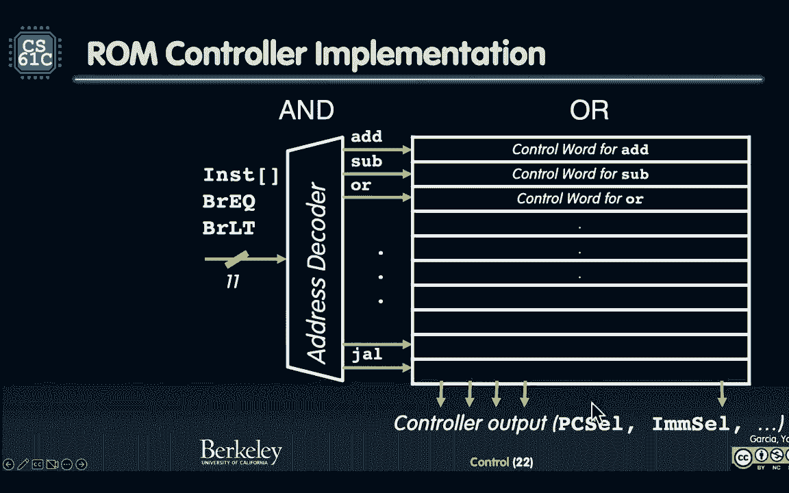

PC加四，好好想想吧，PC选择这就像PC，它是从ALU那里拿走的吗，因为这将是一个分支或跳跃，还是只是加四个对吧，记住，所以这是，这可能会说你什么时候加四个，我加四个。

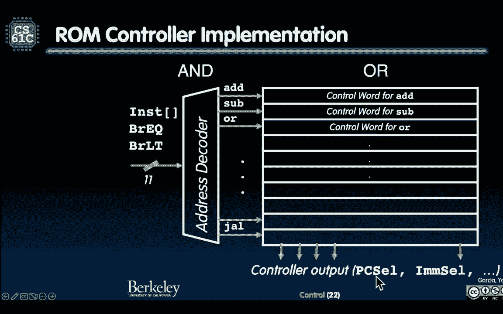

当它看到这个，看看这个看看这个，呃，你看这个字，或者潜艇，或者，或者，您有一种语言来指定这个输出是什么，所以这真的是，这几乎就像看你用英语编程的方式，说着，这条广告线是什么时候，高高在上，当它加线时。

当所有这些都是这样的，这个在那里，那个在那里，就像掉下来一样，你拿一张真值表，做一个标准的表格，是这个不是那个，是这个不是那个，这是真值表那排的高线，记住，这是什么，然后这就像一种语言说PC加4。

当它是加法或减法时，当你下一个指令。

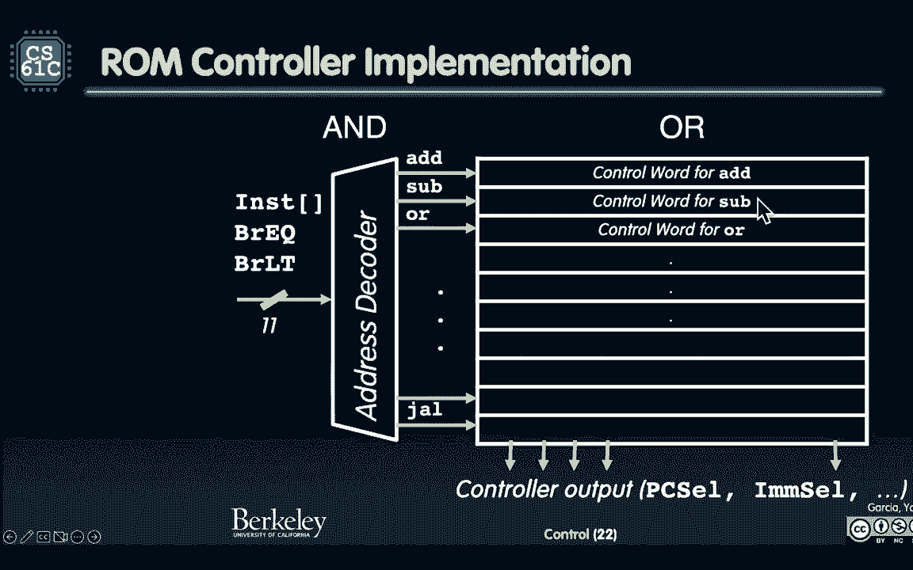

当除了树枝以外的任何东西，或这个或这个或这个，真的很漂亮，所以让我们这样做，让我们再看一遍，这是我的广告，这是我的广告，那么模式是什么，阿达德说得好，看广告广告，说这最好是零，而不是我三十岁。

看看我现在得到了什么，这三个都是，零不是十四不是十三不是十二，就是这里的零，而且是R型，这编码一个R型，那些R型的位模式，什么是r型，丹和我们的类型是，让我们来看看，加非i 6，i 5，i 4。

非i 3，非i 2，这两个比特编码是风险五，32 i，因为它是不同形式的风险五，你可能有16宽，十六位宽，或者六十四比特宽，所以把这两个比特编码成代码，是三二，我一个，我注意到了这一切，I，都是手。

突然一个广告出现了，这些都放在那里，那都是真的，只有当它们都是真的，所以所有这些整个产品都是真的。

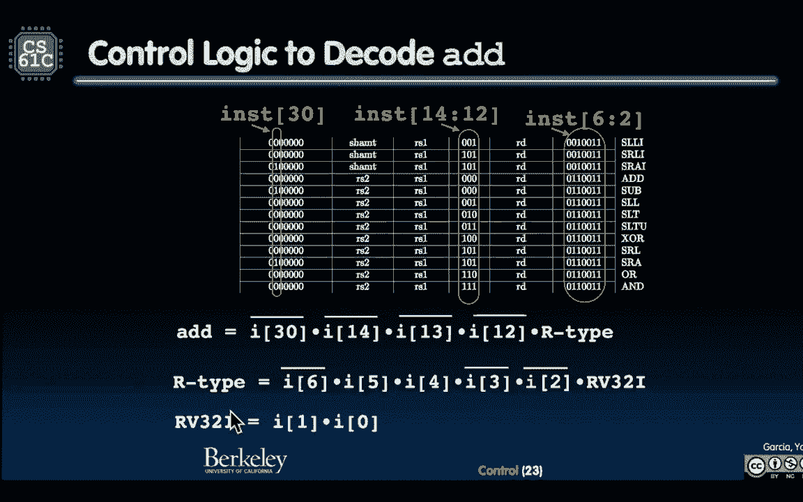

这是令人兴奋的部分，就是这样，就是这样，基本上就是这样，矿石很容易，对吧，你知道PC加4，当它被添加时，或者这个，就这样了，你知道错了，这太可悲了，我需要每个人都站起来，这是你给你的，这是你能忍受我吗。

我有点奇怪，站起来，这是一个时刻，如果你真的愿意走到走廊，这次就相信我吧，你能走到过道吗，只是现在，这将是一个30秒的乐趣。

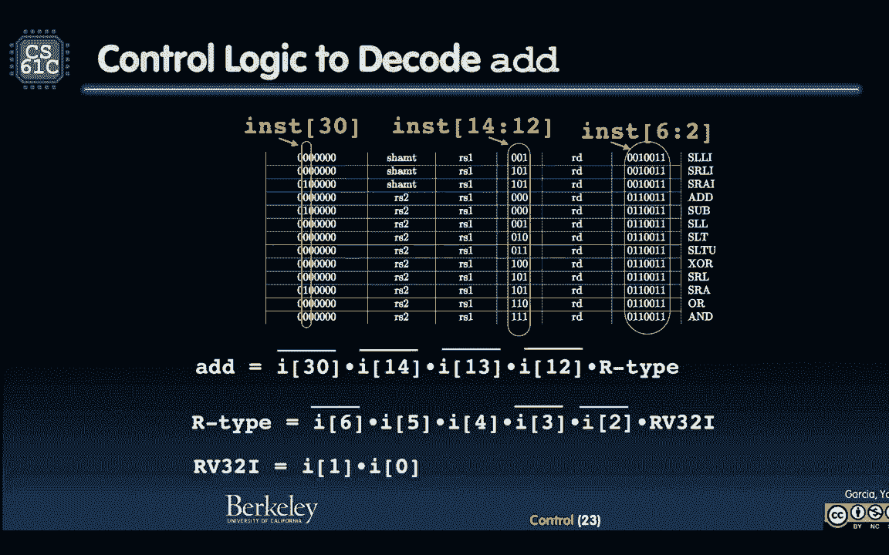

小心小岛，走到手表前，到房子里去，最后，太好玩了，我要你记住这一天，他们说，做一些让人们感动的事情来记住这一天。

你明白从上面开始，高层，C语言，你写任何东西，我手机上的一个应用程序，用那种语言，您可以将其编译为程序集，你知道你能理解机器代码，位编码，但现在我想我该怎么处理他们，让我们用它造一台机器吧。

我们从底层开始，了解电流是如何流动的，我们转向越来越大的逻辑门，到较大的街区，我们把它们放在一起，连接在一起，数据路径和控件与控件，你现在知道计算机是如何工作的了，当这件事发生在我身上，对我来说。

这是令人震惊的一天，我就像我知道整件事是怎么运作的，第一次，曾经，你在这个抽象层上面，你知道它是怎么工作的，你怎么庆祝你跳舞，我们绕一圈，找个人围成一个圈。

从这里往回走一圈，你回去看看，准备好了，我爱，我喜欢它，我爱死它了，有一个点击问题。

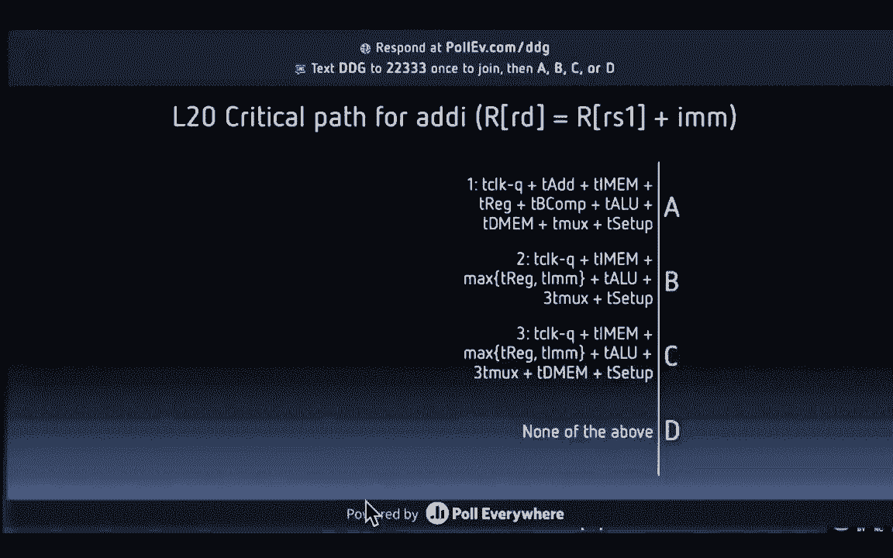

哪有什么好玩的，我总结一下，我们造了一个处理器，伙计们，我们成功了，我们可以执行所有的风险，到目前为止我们看到的五个指令，并不是所有的指令都使用，关键路径意味着我的单周期，CPU很慢，我们能快点吗。

我在为星期三的讲座做准备，是呀，我们可以，有五个阶段，你知道五个阶段，控制器指定提线木偶，在各个阶段做什么，各位非常感谢，我们星期三见，这是一个时刻，调用家庭纹理熊，是我做的。

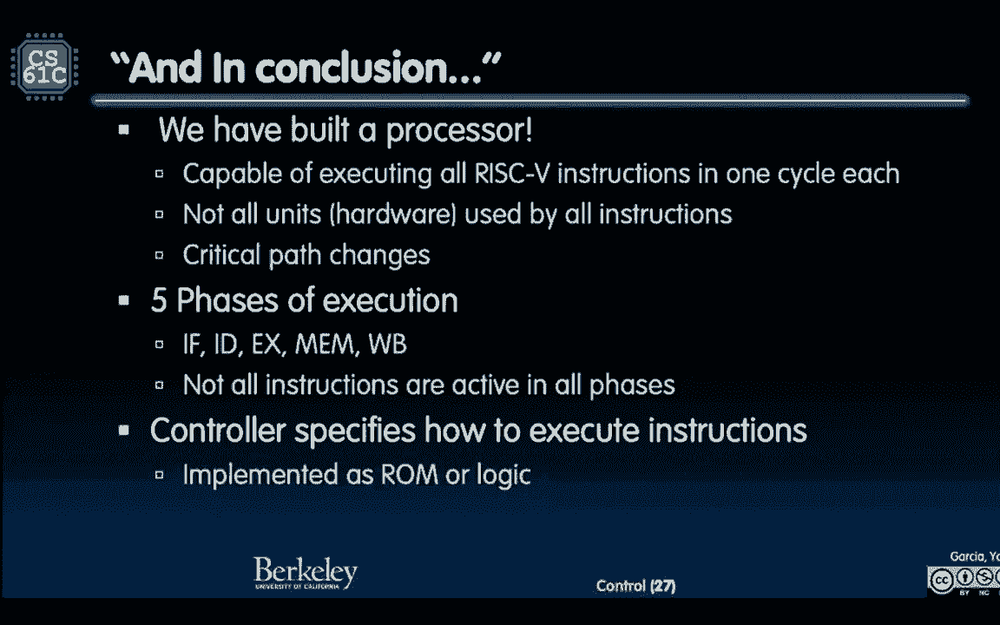

我做到了，喔六二一，大学里最伟大的班级之一，因为这个原因，为了这个，今天的讲座，好激动，谢谢大家，在线感谢。

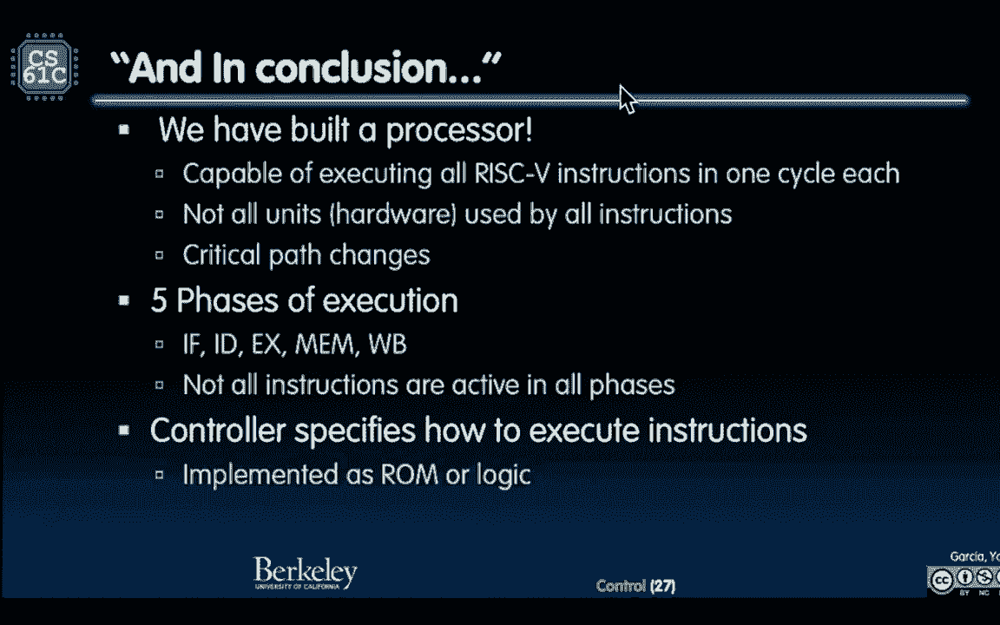