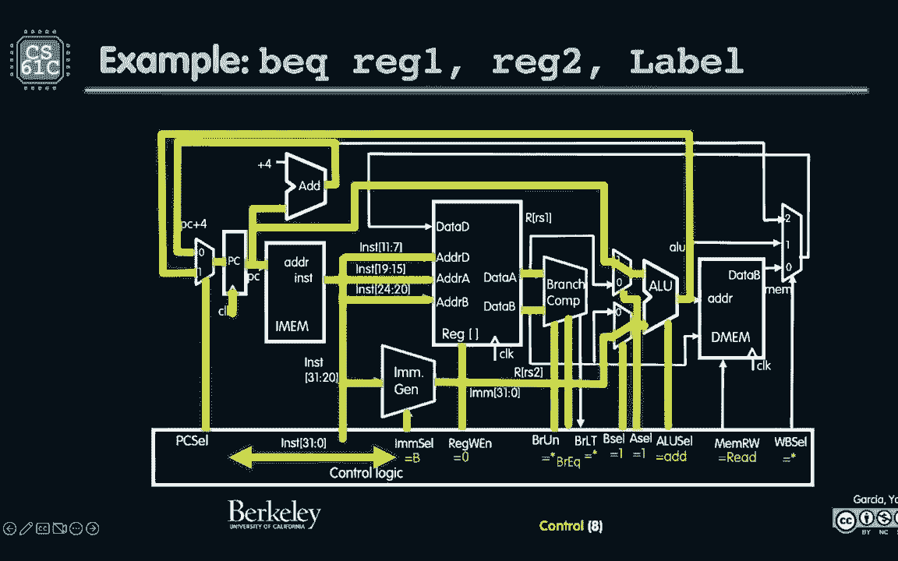

# 课程 P26：第20讲 - RISC-V 单周期控制 🎛️

在本节课中，我们将要学习RISC-V单周期处理器的控制单元是如何工作的。我们将深入探讨数据路径与控制信号之间的关系，理解如何通过控制线来协调处理器各个阶段的运作，并分析指令执行的关键路径和时序。

---

## 概述

上一节我们介绍了RISC-V单周期处理器的数据路径。本节中，我们来看看控制单元，它就像提线木偶的操纵者，负责指挥数据路径中的各个部件协同工作。

控制单元根据当前正在执行的指令，生成一系列控制信号。这些信号决定了数据在处理器中的流向、ALU执行何种操作、是否访问内存以及是否写入寄存器等关键行为。

---

## 数据路径回顾

我们之前看到的数据路径包含五个执行阶段：
1.  **指令取指 (IF)**
2.  **指令译码 (ID)**
3.  **执行 (EX)**
4.  **内存访问 (MEM)**
5.  **写回 (WB)**

这五个阶段在单周期处理器中依次发生，控制单元为每个阶段指定了具体的工作内容。

---

## 控制信号详解

控制单元输出的信号位于数据路径的底部。以下是控制信号如何影响处理器操作的例子。

### 存储字指令 (`sw`) 示例

对于存储字指令 `sw`，其目标是将寄存器中的数据写入内存。

以下是控制信号如何设置：
*   **写寄存器使能 (`RegWrite`)**: 设置为 `0`。因为 `sw` 指令的目标是写入内存，而不是寄存器。
*   **分支 (`Branch`)**: 设置为 `0`。`sw` 指令不涉及分支操作。
*   **ALU操作 (`ALUOp`)**: 设置为 `add`。`sw` 指令需要计算内存地址，即基址寄存器值加上偏移量。
*   **ALU源B选择 (`ALUSrcB`)**: 选择立即数。因为地址计算需要用到指令中的偏移量。
*   **内存写使能 (`MemWrite`)**: 设置为 `1`。这是少数几个真正需要向内存写入数据的指令之一。
*   **结果写回选择 (`MemtoReg`)**: 此时不关心，因为 `RegWrite` 为 `0`。

当时钟上升沿到来时，计算出的地址被用于内存写入，同时程序计数器更新为 `PC + 4`。

### 分支相等指令 (`beq`) 示例

对于分支相等指令 `beq`，其目标是根据比较结果可能改变程序计数器。

以下是控制信号如何设置：
*   **写寄存器使能 (`RegWrite`)**: 设置为 `0`。`beq` 指令不写入寄存器。
*   **分支 (`Branch`)**: 设置为 `1`。这是一条分支指令。
*   **ALU操作 (`ALUOp`)**: 设置为 `add`。需要计算分支目标地址，即当前 `PC` 加上偏移量。
*   **ALU源A选择 (`ALUSrcA`)**: 选择 `PC`。因为目标地址是相对于当前 `PC` 的。
*   **ALU源B选择 (`ALUSrcB`)**: 选择立即数（偏移量）。
*   **内存写使能 (`MemWrite`)**: 设置为 `0`。
*   **关键控制**: **分支相等信号 (`BranchEQ`)** 和 **PC源选择 (`PCSrc`)**。这两个信号共同决定了下一个 `PC` 的值是 `PC+4` 还是计算出的分支目标地址。`BranchEQ` 由比较器根据两个寄存器值是否相等产生。

---

## 指令执行时序分析 ⏱️

理解控制信号后，我们必须考虑时序。在单周期CPU中，最慢的指令决定了时钟周期的最小长度。

以下是五个阶段大致的延迟（示例值）：
*   **指令取指 (IF)**: 200 ps (从内存读取指令)
*   **指令译码 (ID)**: 100 ps (寄存器文件读取)
*   **执行 (EX)**: 200 ps (ALU操作)
*   **内存访问 (MEM)**: 200 ps (从数据内存读取)
*   **写回 (WB)**: 100 ps (写回寄存器文件)

对于加载字指令 (`lw`)，它需要经历所有五个阶段。因此，其关键路径延迟是这些阶段延迟的总和：**200 + 100 + 200 + 200 + 100 = 800 ps**。

这意味着时钟周期至少需要 **800 ps**，对应的最大时钟频率约为 **1.25 GHz**。如果试图以更快的频率运行，`lw` 指令可能无法在时钟上升沿前完成写回阶段，导致寄存器文件中的数据不稳定，这是时序违规。

---

## 控制逻辑的实现

我们如何根据指令位来生成这些控制信号呢？答案是通过一个大的组合逻辑块，可以将其视为一个只读存储器 (ROM) 或一个经过特殊设计的逻辑电路。

控制单元的输入是指令中的特定字段（主要是操作码 `opcode` 和 `funct3`, `funct7` 等）。输出就是我们之前讨论的所有控制信号。

例如，判断是否进行无符号分支比较 (`BranchUnsigned`) 的信号，可以通过检查指令的第30位 (`inst[30]`) 是否为1来实现。对于 `bltu` (无符号小于则分支) 指令，该位为1；对于 `blt` (有符号小于则分支)，该位为0。硬件设计者巧妙地将这一信息编码在指令位中，使得控制逻辑的实现变得简单直接。

整个控制逻辑的真值表可以转化为与门、或门构成的电路，或者直接编程到一个ROM中。其逻辑可以用类似高级语言的描述来表达：
*   **当** 是 `add` 指令 **或** 是 `sub` 指令 **或** 是 `lw` 指令... **时**，`PC` 的下一个值选择 `PC+4`。
*   **当** 是 `beq` 指令 **且** 比较结果为相等 **时**，`PC` 的下一个值选择分支目标地址。

---

## 总结

本节课中我们一起学习了RISC-V单周期处理器的控制单元。
1.  我们回顾了数据路径的五个阶段：取指、译码、执行、内存访问和写回。
2.  我们详细分析了 `sw` 和 `beq` 指令的控制信号设置，理解了控制线如何像提线木偶一样指挥数据流动。
3.  我们探讨了指令执行的关键路径和时序，明白了时钟周期由最慢的指令（如 `lw`）决定。
4.  最后，我们了解了控制逻辑可以通过查找表（ROM）或组合逻辑电路来实现，其核心是根据输入指令的位模式，产生相应的控制信号输出。

现在，我们已经从高层C语言，到汇编指令，再到机器码，最后到能够执行这些代码的处理器数据路径和控制单元，完成了对计算机如何工作的底层理解。这是一个值得庆祝的时刻！在接下来的课程中，我们将探索如何通过流水线技术来突破单周期处理器的性能限制。