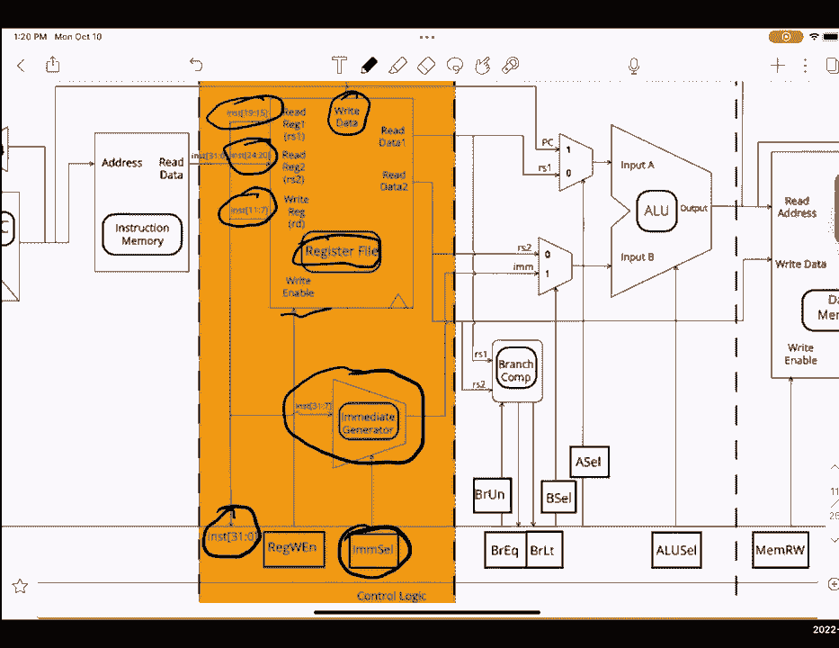

# P27：Discussion 7： Single-Cycle Datapath - 这样好__ - BV1s7421T7XR

你好，欢迎大家来讨论，今天七点，我们将讨论单周期数据路径，嗯，哎呦，像这样，这个讨论对项目三A非常重要，今天出版了，我稍后会有更多的公告，但是呃，在我们开始之前，我知道这周是期中考试。

你觉得期中考试怎么样，竖起大拇指侧身向下，哦男孩嗯，我会给你们一个机会问任何期中考试问题，再过一会儿，但现在，呃，我们从单周期数据路径开始，一点点物流，呃是的，亲临和期中考试是本周四和周五。

你应该已经收到了啊，说座位分配，如果你没有，请联系艾德，带回家的部分将在本周六和周日，今晚交第五份作业，三号项目，几个小时前出来的，今天的内容不在期中考试的范围内，但正如我所说的，这对项目真的很重要。

所以你们都为期中考试提供了一些建议，这很好，所以员工们的共识是我们强烈建议查看我们的练习考试，过去的考试，过去的讨论，最肯定的是过去的家庭作业，呃，如果你有任何概念上的问题，随便问吧，在职。

办公时间或在线，我想我们有几个，呃，在帖子中问答，为了为了喜欢，每年考试，这是来自所有工作人员的，你们会做得很好的，不要烦恼，呃，对期中考试有什么一般性的问题吗？我不能说是，是呀，它在范围内。

还有什么关于，我们要开始了，呃，所以今天我们要讨论数据路径，其中包括我们将讨论以下内容，所以我们要像一般控制单元一样过去，它是如何工作的，尤其是在风险五，我们将涵盖数据路径的五个阶段。

我们要像指导类型一样复习，他们是如何，为什么我们有独特的指令类型可以直接映射到数据路径形式，所以我们要做，呃，让我们来复习一下术语，所以对于那些这样做的人来说，这是对SDS的一点回顾。

所以状态元素是连接到时钟的组件，当我们检查数据路径时，您将看到状态元素的一个大型示例是寄存器，然后临界路径是两个状态元素之间的最长延迟和竞争方式，这是第一个寄存器排队的时钟，加上最长的组合延迟。

加上寄存器2的设置时间，最小时钟周期将是关键路径，临界路径的长度，最大时钟频率就是给出关键路径的频率，所以这只是最小时钟周期的一个，然后这将在这个项目中被大量使用，但这叫做多路复用器。

就像给了一个控制单曲，多路复用器确定通过输出发送哪个输入，所以几乎这里的这个项目是我们提供信号的地方，如果这等于零，然后两个就走了，或者如果这等于一，然后马上就会去，呃，现在我们要。

我再过一遍数据路径的五个阶段，你们讨论表上的第二个问题，会让你们描述一下，每一个数据，每个阶段，也在你工作表的背面，有一个数据路径，我强烈建议你填写，当我们通过数据路径时，当我们通过数据路径时。

所以看起来你们正在调出你们的工作表，所以我会给你们几个，呃，几秒钟来设置，好啦，是啊，是啊，呃，我们开始吧，这是我们在风险5中使用的一般数据路径，你将在这里看到的是，它没有名字，我们会知道它的名字。

当您在数据路径中继续前进时，我们会知道到底是什么，这些盒子中的每一个都是，这些是传递到某些单元的控制信号，然后是圆盒子里的东西，它是一个，数据路径中的不同类型的单元，仍然非常非常重要，所以让我们开始。

所以我们单周期数据路径的第一阶段是指令提取，阶段和指令获取字面意思是你几乎在获取指令，你在这里看到的是，我们有，所以我们有一个PC寄存器，其实这里有很多不同的阶段，首先，我们有一个多路复用器。

上面写着PC加4或ALU，我们有控制，它要么告诉我们获取下一条指令，要么告诉我们获取，或者获取由ALU计算的指令地址，啊，等等呃，每当我们进行某种跳跃时，通常会发生这种情况，然后我们有PC寄存器。

我们电脑的输出，这将是我们寄存器的输出，是啊，是啊，这将是，的输出，这将是我们想要得到的指示，然后在这里我们有一些东西，在这里，我们有一个叫做IM的东西，所以电脑会储存指令的地址。

但随后我们将此地址传递到IMM或指令存储器中，然后我们得到映射到该地址的实际指令，然后你可以看到这里我们有，P，我们这里有一个单元，在我们的PC地址上增加了四个，这些都传给了我们的钱。

好让我们知道下一条指令的地址，在这种情况下，我们确实需要使用它，然后这里我们还有，我们有一条线一直延伸到，我们这里有一条线一直延伸到，呃，牢房，我们稍后再讨论这个问题，但这只是一些需要知道的事情。

然后耶，如果我们有32条来自记忆的指令，我们Chrome PC是必要的问题，哦耶，你当然想让我放大，我知道没关系，呃，可以吗，如果我向下滚动，好啦，是呀，我们开始吧，让我们继续，好啦。

所以有一大堆与此相关的控制逻辑，所以呃，一个嗯，这里关联的控制逻辑的关键部分之一是PC，Oops是一个PC单元，就是呃，控制信号发送到多路复用器以选择PC加四或ALU。

或者地址PC加4或由ALU计算的地址，然后我们有指令，在这里输出的实际指令，这进入指令解码阶段，然后我们有直接的细胞，我们将在下一阶段讨论，然后是红文，现在也将进入下一阶段，对于指令获取。

我们需要知道的主要两个是，好啦，呃，考虑到这一点，让我们继续进入下一页，它被称为指令解码，我给你们，呃，就像呃，一分钟几秒钟写下这些术语，好啦，再过五秒，好啦，是啊，是啊，所以这个阶段我们要过。

称为指令解码，通常缩写为id，它所做的就是使用机器代码表示，为了弄清楚我们将从哪些寄存器读取或写入哪些寄存器，如果有一个立即，我们适当地签署，扩展和生成必要的，如果我们往外看，如果我们从视觉上看。

我们在这里看到的是以下内容，我们有，呃，或者指令位，呃，七到十一在这里分开，这将意味着，其中寄存器的索引，我们这里也要一样，两个卢比，这个卢比也一样，然后我们把指令传递到控制逻辑中。

输入控制逻辑块来计算，嗯，哪种呃，找出什么样的控制逻辑信号，我们需要发送我们的注册文件或重新归档，会包含所有三个两个寄存器，它会发现，呃，给出传递进来的信号，如写，启用或写入写入数据，它会。

它会告诉我们要计算什么值，或者输入什么值，我们使用什么寄存器，然后就像我之前说的，我们有一种叫做即时发生器的东西，所以我们几乎进入了即时发电机，我们得到了这里的m细胞，然后我们将适当地签署扩展。

这样我们就可以形成一个三，两个比特从这里直接。

我想我们可以进入第三阶段，也就是执行阶段，如果你们想把这些信号写下来，我给你们一点时间，放大一点，好啦，呃，我们要去，我们将从执行阶段开始，哪个和执行阶段决定是否需要采取分支。

我们计算任何地址的大部分算法，计算将在ALU中执行的新值，ALU被称为算术逻辑单元，所以它执行任何算术或逻辑运算，比如，或者，然后加上，减去你能想到的任何算术或逻辑运算，如果我们从视觉上看。

在这里我们看到以下内容，大家可以看到，在这里我们有我们的分支柱，它吸收了我们的，它吸收了我们的价值观，那些是，指示指令解码阶段的输出，在这里我们计算以下的br eq和b r l t，嗯。

考虑到b r u n，那么什么是B或UN，它检查我们是否在做一个无符号的数字比较，所以如果我们有一个像BTU BG E U这样的指令，那就是Br u n将被设置为1的时候。

这意味着我们需要比较无符号物质中的值，然后考虑到无符号，考虑到它是无符号的，然后我们进行比较，然后检查呃然后得到输出信号，VR，还是做我们的LT，所以这就像如果值相等，或者如果值为r。

或者如果第一个值小于第二个值，然后bq和br在计算信号时非常有用，比如这里的PC单元，我要画，它是，对此非常有用，因为它告诉我们，好啦，是啊，是啊，我们的PC单元需要不同。

我们需要确保我们在适当的时候进入ALU，然后我们有一个叫做A细胞和B细胞的东西，所以在这种情况下，会发生什么，呃，我们有两箱，我们有AMUX，可以接收个人电脑和个人电脑，A细胞选择哪种结构。

我们将使用哪一个输入作为输入，A进入ALU，最后，我们有两个即时的RS，卢比2和立即王牌，这将是我们BEMUX的一部分，我们从这个bemux得到的输出是由b单元表示的，我有个问题要问大家。

所以你可以在这里看到，我们有一台电脑，另外，我们的PC是AMUX的一个选项，立即是一个操作是从第二个多路复用器中选择的，你认为什么样的指导，这将有助于，如果我们知道我们必须执行一个ALU操作。

使PC和立即，哪种指令对“是”有用？所以跳是一个很好的选择，或者如果我们知道我们实际上要分支，那也是一个很好的用途，有很多不同的方法，然后我可以说像PC加RS 2，这对像Jer这样的人来说很好。

因为我们知道最直接的是，偏移量存储在RS 2中，所以如果我们做PC加RS 2，我们可以从那里得到指令的适当地址，然后呃再一次，我们这里有我们的阿卢，然后我们有我们的alu单元，它选择使用哪个操作。

你们会学到更多的警觉，更多关于它是如何构造的以及它支持什么样的操作，当我们进入一个项目，三个关于执行的问题，几个控制逻辑，好啦，我所说的概述，所以做联合国，这是在分支指令时说的。

并指示我们是否应该处理赋值或未签名的值，然后我们有brq，所以如果数据a等于数据b，它会输出一个，否则输出为零，然后是B R LT，它会输出另一个零，如果数据A小于数据B。

然后我们这里有很多很多的选择器，我们有B细胞，牢房，Aliu细胞与存储器，好吧，我们会过去的，当我们进入记忆阶段，不过，差不多，稍微回顾一下我所说的，一个b单元格将在RS 2或直接输入b之间进行选择。

进入阿卢，a单元将为alu选择pc或rs，输入a处的输入，然后ALU细胞会告诉我们要执行什么样的操作，注意它是四位，这意味着我们可以支持多少结构，4位能支持多少种操作，你想回答什么，那个。

ALU中的最大操作数是多少，我们可以用四个比特来支持，十六，是呀，之所以是十六岁是因为，我是说，就像二对四，是啊，是啊，二对四，这就是为什么我们将在第三项目中学到的，实际上没有我们可以支持的指示。

我们在ALU里留下了一堆开放的空间，但是是的，呃，挺好的，是啊，是啊，16是我们在ALU中可以支持的最大操作数，最后我们有了记忆阶段，其中涉及到这两个主要的，A组件，呃，DM或数据存储器。

储存我们记忆的地方，它储存，是呀，我们所有的记忆都储存在那里，然后记忆正确，哪些商店，上面写着我们是否需要写到记忆中，给你们几秒钟写下这些，好啦，嗯，我会继续说更多的细节，因此，当使用加载字或存储字时。

它用于从内存中读写，请注意，我们实际上只考虑dm的延迟或用法，只有当它是加载或存储指令时，上面是这么写的，还有一件事现在不一定在范围内，它确实变得很快，当我们开始使用缓存时，当我们进入缓存时。

我们会更详细地讨论这个问题，关于记忆有什么问题吗，我觉得两种记忆是另一种，好啦，所以呃，在这里我们有数据存储器，也就是DM，在这里我们有指令存储器，也就是我，这是我们使用的两种记忆，也可以争辩说。

重新归档也是，理论上你可以，我们在这里打个问号，因为这取决于一个人的解释，不管那是不是记忆，还有其他问题吗？好啦，呃，考虑到这一点，然后我们在这里进行最后的阶段，也就是，呃，右后或右后台注册。

我们这里的主要东西是一个右后卫多路复用器，右后方的细胞决定了，我们应该使用右后多路复用器的哪些输入，给你们几秒钟写下任何信息，好啦，所以呃，然后我们进入右边的按钮，它决定将哪些值写入寄存器文件，几乎是。

你会看到这里有一个箭头，从右后框到右数据，右后细胞会适当地决定哪一个，在我们不需要写的情况下，把任何东西写回寄存器，我们可以任意选择其中任何一个，重要的是我们说重写启用为零。

这意味着我们不会在我们的登记册上写任何东西，是啊，是啊，我们有多种输入到右后标记是PC加4，我们通常会写，P c，如果我们有凝胶或罐子之类的东西，再加四个到寄存器里。

因为这样我们就可以存储PC加四个到一个，所以在我们的内在功能中，当我们使用JA时，我们往回跳，然后我们有alu，也就是，呃，如果我们有任何计算，比如，嗯，让我们看看我们是否有添加两个红色的东西。

将两个寄存器值相加，它将是类似的东西的输出，然后我们就有了记忆，它将被用于一些，它将被用于像这样的东西，在很大程度上被用来，实际上专门用于加载单词，因为一旦我们从记忆中加载这些东西，发生的事情是。

我们需要把它写回我们适当的寄存器，而且是的，差不多就是这样，这几乎结束了数据路径的概述，有人对此有疑问吗，好啦，所以考虑到这一点，嗯，我想这是第三个问题，目前来自错误，是啊，是啊，两点三。

两点三点和两点，我给你们两个，我刚意识到答案是好的，在上面，哦好吧，反正更酷的东西，嗯差不多我会给你，这是七号，哦，我的天哪，啊，反正，我给你们几分钟看一下这个，我建议考虑一下什么样的指示，会使用。

什么，然后从，或对所给出的每条指令进行适当的延迟，我想我们可以，开始解决这个问题，所以首先我们要复习一下加法指令，它增加了，使用说明，去拿，是呀，我们确实使用指令提取，因为我们怎么知道这是不是广告指令。

除非通过指令获取，怎么样，呃，指令解码，我们用指令解码吗，是呀，好啦，嗯，执行怎么样，我们用执行吗，实际上我们可以把它缩短一点，执行所有指示，使用指令提取，是呀，好啦，所以我们会标记每一个。

执行所有指令以使用指令解码，是啊，是啊，是呀，正是因为我们需要知道我们在使用什么样的寄存器，对于每条指令，每条指令都使用执行吗，是呀，呃，因为我们需要做一种计算，每条指令都用内存吗。

每条指令都用右后卫吗，否，好啦，所以现在我们要看每一个，以及它是否使用右后卫，所以在这里我们有记忆，呃，确实增加了，使用记忆不不，右后卫呢，是啊，是啊，是呀，我们回信的原因。

是因为我们有一个从计算到寄存器的结果，如果我们计算出，我们得到的总时间是600皮秒，或者我，那是什么？我们是用MEM还是右后卫，或两者兼而有之，或者什么，你还想用右后卫，呃，哼，是呀，呃，我们知道。

我们不是在处理记忆，我和广告差不多，所以600皮秒，加载词呢，有人想试试吗，不管我们用它们还是右后卫，要么两者兼而有之，要么全无，我想我们两个都用了，你说的对，呃，你能解释一下为什么。

所以你首先需要从记忆中得到一些东西，当你进入记忆，好啦，然后你还需要像，把你从记忆中得到的东西放进寄存器里，所以这就回来了，是的，是的，完全正确，搞定了，所以我们需要用MEM加载，才能真正得到，呃。

价值，然后把它写回来注册，这将给我们800皮秒的存储字，那是用内存还是写回来，或两者兼而有之，有人想试试吗，新来的妇产科医生，所以让我们分解一下，呃，我们在存储词中使用内存吗，是呀。

我们这样做是因为我们实际上需要，呃，参与记忆，不知何故，我们用右后卫作为明星词，你说你没有权利，为什么不是，你是，您只是将寄存器的内容推到内存中，是呀，写回准确的，是啊，是啊，我们不给任何寄存器回信。

因此，我们没有任何形式的，我们没有考虑到这一点，右后延迟，这给了我们700秒，Q是用内存的吗，不，那个用右后卫吗，否，因为我们不会用Q写任何寄存器，所以我们从这里得到了500秒，格乌，那要用内存吗，否。

好啦，右后卫呢，是呀，它确实用右后卫，因为朱的工作，因为它是跳跃链接，我们需要储存下一个，我们得把寄信人的地址记在登记簿上，我们指定，所以这就是为什么我们需要回信，这给了我们一个600皮秒的临界路径。

然后我们有BTU，呃，差不多就是这样，它非常，相当于是，情商，我们不用它们，或者右后卫，所以我们现在又得到了500皮秒，考虑到这一点，呃，是什么指令，锻炼关键路径，任何人都可以大声说出来，准确加载单词。

它是加载词的原因是因为它有最大的延迟，八百秒，我没有机会把这些问题写在幻灯片上，但是呃，鉴于我们的，或者实际上，我不打算说，但是你最快能画出单周期数据路径，知道关键路径，你怎么算呢？有人知道。

比如最大频率是多少，我们在早期的幻灯片中介绍了这一点，所以你可以在那里查一下，所以它是一个频率周期，因为一个超过八百，是啊，是啊，八百多秒，然后呢，呃，你现在不需要知道的数学是，这相当于一个，对不起。

是啊，是啊，这将等于一个点，两个5千兆赫，可能看起来很快，但肯定有办法让它更快，下周我们将更深入地讨论这一点，嗯是的，我们可以改进的方法，呃，有什么原因，这可以解释为什么单周期数据路径是低效的。

我可以继续回答这个问题，最终发生的是大部分的部分，呃，当我们执行数据路径的一个阶段时，当我们有机会真正使用它们时，其他的都不会被使用，有点我不会说平行，但有点流水线，这就是为什么。

当我们有办法利用整个数据路径时，这是低效的，即使我们不这样做在一个周期，下周我们将更深入地讨论，这是这个班最有趣的话题之一，好啦，呃，接下来我们有这个问题，两点二，用每条指令的控制信号填写下表。

与我们报道的非常相似，嗯在这里，刚刚，你实际上必须提供每一个实际的控制信号，呃，然后呢，几乎要确保这一点，并注意，如果你不在乎是什么信号，用星号什么的，给你们几分钟时间，好啦，嗯。

我们要开始讨论这个问题，我实际上想指出的一件事是，尽管它被称为MRW，你们中的许多人把它解释为记忆，阅读，编写应用程序，我们，最好把它想成是米色的，因为这就像你是否真的在写一段记忆，我希望这更有道理。

所以考虑到这一点，让我们来看看这些指令中的每一个的b r e q信号，呃，我们关心什么是BRE EQ的信号吗，你想说些什么，否，好啦，是啊，是啊，否，呃，奥里诺呢，我们不在乎，呃，加载词呢，否，B呢。

Q是的，但那又是什么价值呢，你为什么说，对不起，啊，啊，是呀，我想要么是零要么是一，是呀，不是零就是一，因为我们不知道它是否真的会分支，或者它是否真的相等，那乔呢？我们在乎吗，不，然后是BL。

然后是BT，我们在乎吗，否，是呀，英国电信，啊，其实没有，我们不抱歉，我脑子里在想别的事，呃，原谅我，呃，怎么样嗯，好啦，现在我们来看看虚拟现实，每人快速公交，我们关心这个吗，或者我们只是关心它。

当我们加入，否，好啦，无BLT，是呀，零的值是多少，零还是一，是呀，现在呢，PC，所以呃，只是提醒一下零代表行动，只是为了P C，加四，一个是ALU的结果，所以对于广告来说，那是什么？你真的改变了。

你在换电脑，那么是什么，它的可能值是什么，或者它的价值，因为这是一个条件跳转，所以我们不跳了，我们可能不是每次都跳，那么你是怎么做的，什么样的价值观会，呃，PC电池需要，零还是一，是呀，零还是一。

因为呃，我们要么分头去晚上，要么去指示，或者我们就去下一个指令，在电脑上，加四或工作，会是什么呢，我们要一直在凝胶里跳吗，是呀，那么这个值应该是多少呢，一个是，因为我们总是会得到ALU和BT的结果。

那是什么？是啊，是啊，零还是一，实际上因为，它可以跳也可以不跳啊，直接牢房，现在我们做即时单元格的方法就是说指令格式，你可以用什么指令格式来回答，或者如果我们不关心广告，我们关心m细胞吗，否，好啦。

然后为了我，呃，我们关心m细胞吗，那是什么指令格式，为了或者呃，这在你的参考书上，但对我来说，是的，这是什么样的指令格式，所以我们只是，为了这项工作的目的，我们将把，我加载词怎么样，是呀。

加载词也是我那存储词呢，我先去看看这个，然后对于BQ来说，它是什么，会是B是的，然后耶，那是什么？然后英国电信现在就会是b r u n，哎呦，我们关心广告吗，呃，好啦，加载词，我很肯定答案是肯定的。

解决方案说他们不在乎呃，布鲁乌恩，不是未签名的，哦啊哈，不是没签名的，所以我们还不知道，嗯，所以我们根本不在乎，然后啊，我们在乎吗，是呀，我们确实在乎，你不像招牌上那样比较，啊哈完全正确，是呀。

为什么我们不关心我，嗯，好吧，我们要检查，如果每一点都差不多，所以不需要未签名，或者是的，我刚刚才知道，我刚发现，是啊，是啊，所以对英国电信来说，是0还是1，记住还有一个叫做btu的指令。

所以那里的b r u n信号会不同，所以这里是零，所以零是不是意味着你总是不比较，零意味着你不用担心，零表示我们不使用无符号，哦是的，那将是零，是呀，所以会是零，好啦，现在我们要去做。

我们有足够的时间来完成这一切，好啦，是啊，是啊，我想我们可以完成这一切，好啦，所以嗯，所以我们要么有Reg要么有PC，有人想在这里列出哪些说明吗，呃有一个细胞或零，其中指定寄存器值。

或者谁能指定哪些指令使用零作为asa，有人想吗是的，这件事我不太确定，但我想它们都在壳里，呃，不是所有人除了首席信息官，呃，B当量和B，或者也，嗯，我们担心那里的PC，因为那是会被通过的。

因为ALU的输出会传递给PC标记，那么我们如何比较btb q，注册了，我们过去常常比较价值，呃，嗯，这就是我们的分支比较器的用途，然后会影响到，呃，正如我前面提到的，影响PC单元的，好啦，是啊，是啊。

所以差不多，这里的寄存器为零，如果加i或i加载单词或单词，它将为零，这将是一个为BQ，JBT，B细胞呢，这里有没有人只是用，呃，登记册，只要加上，是呀，然后其他一切都会立竿见影，每一个。

这些指令中的每一个都在即时alu单元中使用，所以这个，你只要回答，我们用的是加法运算，添加将使用什么操作，完全正确是的，然后对于我，那是什么？或者或者是，加载字，那是什么？朱迪，因为偏移量。

当你做偏移时，你还加上了，是啊，是啊，完全正确是的，我们需要添加，我们向内存地址添加偏移量，然后我们有存储那到底是什么，它也是添加的，因为与内存偏移相同的事情，B当量，那是什么？我之前提到过这个。

比如当我们做PC+即时的时候，所以是的，那也是加，我们可以说英国电信在这里也是一样的，然后跳跃是我之前提到的，在那里我们添加了PC和即时，因此我们在这里加上，差不多呃，记忆或记忆权，启用呃，哪个呃。

我们关心什么记忆权是广告吗，是呀，我们有，因为如果我们把它设为任意值，我们可能覆盖了一些记忆，所以要么，所以每一条指令都必须是0或1，所以对于添加，会是什么呢，否，这是零，因为我们不会写任何东西的记忆。

我知道记忆写有点，会让你有点迷惑，但它实际上是mem对的，因此它是零存储词，“那是什么？”，是呀，其他一切都将为零，因为我们现在不是在记忆中写作，瑞德现在注册并启用，那么我们应该给这些指令中的哪一个。

就广告寄存器而言，我们会给收银员写信吗，是呀，所以这将是一个，或者我，我们到底要给寄存器和应用程序写什么，你可以直接说这个值，您不必给出选择器值，如果你不想，是呀，女士，是的，呃商店的话，是啊，是啊。

对商店来说，单词是情商并不重要，是呀，没关系，我不知道，所以这是我们的数据路径，我们终于能够想出，我想我们没有足够的时间，部分真假，所以考虑到这一点，感谢大家的到来，这里有一个匿名反馈表的链接。

供那些亲自使用的人使用，记住这一点，如果你填写反馈表，所以请填写反馈表，建议保留他们觉得喜欢的图表，哎呦，是啊，是啊。

