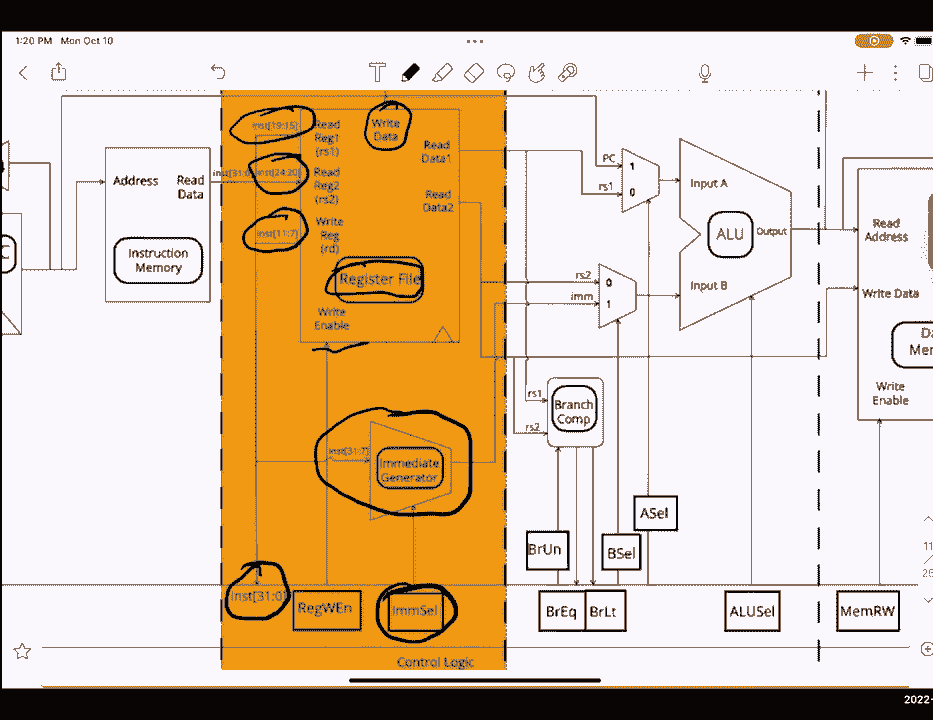

# 课程 P27：单周期数据通路详解 🧠

在本节课中，我们将学习计算机体系结构中的核心概念——单周期数据通路。我们将详细拆解其工作原理、五个关键阶段，并分析不同指令如何在这个通路上执行。这对于理解CPU如何执行指令至关重要。

## 概述 📋

单周期数据通路是CPU设计的一种基本模型，它在一个时钟周期内完成一条指令的全部操作。本节课我们将依次学习其五个阶段：指令提取、指令解码、执行、访存和写回。我们将了解每个阶段的功能、涉及的硬件组件以及控制信号的作用。

## 核心概念与术语 🔑

在深入数据通路之前，我们先明确几个基础概念。

*   **状态元素**：连接到时钟的组件，其输出在时钟边沿更新。数据通路中的一个主要例子是**寄存器**。
*   **关键路径**：两个状态元素之间最长的组合逻辑延迟路径。其长度决定了最小时钟周期。
    *   公式：`关键路径延迟 = 寄存器时钟到Q输出延迟 + 最长组合逻辑延迟 + 寄存器建立时间`
*   **最小时钟周期**：等于关键路径的长度。
*   **最大时钟频率**：最小时钟周期的倒数。
    *   公式：`最大频率 = 1 / 最小时钟周期`
*   **多路复用器**：根据控制信号选择多个输入中的一个作为输出。
    *   代码描述：`output = (sel == 0) ? input_a : input_b`

## 数据通路的五个阶段 🛠️

上一节我们介绍了基础术语，本节中我们来看看构成单周期数据通路的五个核心阶段。每个阶段都承担着指令执行过程中的特定任务。

以下是数据通路的五个阶段概述：

1.  **IF - 指令提取**：从内存中读取下一条指令。
2.  **ID - 指令解码**：解析指令，读取寄存器值，生成立即数。
3.  **EX - 执行**：进行算术逻辑运算或计算地址。
4.  **MEM - 访存**：从数据内存中读取或写入数据。
5.  **WB - 写回**：将结果写回到寄存器文件。

### 第一阶段：指令提取 (IF) 🎯

指令提取阶段的目标是获取下一条要执行的指令。

*   **程序计数器**：一个特殊的寄存器，存储当前指令的地址。
*   **指令内存**：存储所有指令。PC的值作为地址输入，输出对应地址的指令。
*   **地址计算**：一个加法器持续计算 `PC + 4`，以指向下一条顺序指令的地址。
*   **多路复用器**：根据控制信号，选择下一条指令的地址是 `PC + 4`（顺序执行）还是由ALU计算出的地址（跳转或分支）。

**关键输出**：从指令内存中读出的32位指令，它将进入下一阶段。

### 第二阶段：指令解码 (ID) 📖

在解码阶段，系统解析刚取出的指令，并准备执行所需的数据。

*   **寄存器文件**：包含所有通用寄存器。根据指令中的 `rs1` 和 `rs2` 字段，读取两个源寄存器的值。
*   **控制单元**：根据指令的操作码部分，生成一系列控制信号，用于控制数据通路后续阶段的多路复用器、ALU等。
*   **立即数生成器**：根据指令类型，从指令的不同位中提取并符号扩展为32位的立即数。

**关键输出**：从寄存器读出的数据、生成的立即数以及一系列控制信号。

### 第三阶段：执行 (EX) ⚙️

执行阶段是进行计算的核心环节。

*   **算术逻辑单元**：执行指令指定的算术或逻辑运算，如加、减、与、或等。
*   **分支比较器**：比较从寄存器读出的两个值，根据指令类型判断是否满足分支条件，并输出信号。
*   **多路复用器**：
    *   **A多路复用器**：选择ALU的A输入是来自PC还是寄存器 `rs1`。
    *   **B多路复用器**：选择ALU的B输入是来自寄存器 `rs2` 还是立即数。

**关键输出**：ALU的计算结果，以及用于判断分支是否发生的信号。

### 第四阶段：访存 (MEM) 💾

访存阶段负责与数据内存交互。

*   **数据内存**：存储程序数据的存储器。
*   **读写控制**：
    *   **加载指令**：从计算出的内存地址读取数据。
    *   **存储指令**：将数据写入计算出的内存地址。

**关键点**：只有加载和存储指令会真正使用数据内存，其他指令在此阶段“穿过”而不进行实际操作。

### 第五阶段：写回 (WB) ↩️

写回阶段将指令的执行结果保存到寄存器文件中。

*   **写回多路复用器**：选择要写回寄存器文件的数据来源。可能的选择包括：
    *   ALU的计算结果
    *   从数据内存读取的数据
    *   `PC + 4`（用于 `jal` 指令保存返回地址）
*   **寄存器写使能**：一个控制信号，决定是否将数据写入目标寄存器。

**关键操作**：将选定的数据写入指令指定的目标寄存器。

## 指令执行与关键路径分析 📊

了解了五个阶段后，我们来看看不同类型的指令如何流经这个数据通路，并分析其性能瓶颈。

以下是几条典型指令在各阶段的资源使用情况：

*   **`add` (加法指令)**：使用 IF, ID, EX, WB。不使用 MEM。总延迟为各阶段延迟之和。
*   **`lw` (加载字指令)**：使用 IF, ID, EX, MEM, WB。这是最复杂的指令之一，因为它使用了所有五个阶段。
*   **`sw` (存储字指令)**：使用 IF, ID, EX, MEM。不使用 WB，因为它不写回寄存器。
*   **`beq` (条件分支指令)**：使用 IF, ID, EX。可能根据比较结果更新PC，但不使用 MEM 和 WB。
*   **`jal` (跳转并链接指令)**：使用 IF, ID, EX, WB。将 `PC+4` 写回寄存器，用于子程序调用。

**关键路径分析**：
在单周期数据通路中，**时钟周期必须足够长，以完成最复杂指令的所有操作**。通常，`lw` 指令的路径最长，因为它依次经过了 IF、ID、EX、MEM、WB 的所有组合逻辑延迟。因此，系统的最大时钟频率由 `lw` 指令的执行时间决定。

例如，如果 `lw` 指令总延迟为 800ps，那么最小时钟周期就是 800ps，最大时钟频率为 1 / 800ps = 1.25 GHz。

**单周期数据通路的效率问题**：由于时钟周期必须适应最慢的指令，在执行简单指令时，数据通路的许多部分处于闲置状态，导致硬件利用率低。这正是引入流水线技术的主要原因。

## 控制信号示例 🎛️

最后，我们通过一个简表来直观感受控制信号如何指导指令执行。以下是部分指令的控制信号值示例：

| 指令 | PC多路选择 | 寄存器写使能 | ALU操作 | 内存写使能 | 写回数据选择 |
| :--- | :---: | :---: | :---: | :---: | :---: |
| `add` | `PC+4` | 1 | 加 | 0 | ALU结果 |
| `lw` | `PC+4` | 1 | 加 | 0 | 内存数据 |
| `sw` | `PC+4` | 0 | 加 | 1 | X |
| `beq` | 由比较结果决定 | 0 | 加 | 0 | X |
| `jal` | ALU结果 | 1 | 加 | 0 | `PC+4` |

*   `X` 表示“不关心”，因为该信号对该指令无效。
*   此表为高度简化版本，实际控制信号更多。

## 总结 🎉

本节课中，我们一起学习了单周期数据通路的完整框架。

*   我们明确了**状态元素**、**关键路径**等基础概念。
*   我们逐步剖析了数据通路的**五个阶段**：指令提取、解码、执行、访存和写回，理解了每个阶段的功能与组件。
*   我们分析了不同指令如何流经数据通路，并认识到 **`lw` 指令通常决定了系统的最大时钟频率**。
*   我们指出了单周期设计的主要缺点：**硬件利用率低**，为学习流水线技术打下了基础。

掌握单周期数据通路是理解现代处理器流水线、冒险处理等高级概念的基础。请务必结合图表进行练习，以加深理解。