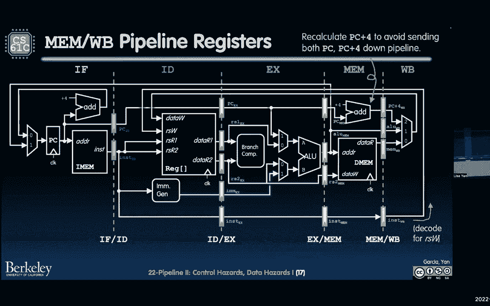

# 🚀 课程 P29：Lecture 22： RISC-V 五级流水线 II - 冒险

在本节课中，我们将要学习RISC-V五级流水线设计中的核心概念——冒险。我们将深入探讨结构性冒险和数据冒险，理解它们如何影响流水线性能，并学习一些基础的解决方案。课程内容将围绕单周期CPU与流水线CPU的对比展开，帮助你理解流水线如何提升吞吐量以及随之而来的挑战。

---

## 📊 单周期与流水线数据路径回顾

上一节我们介绍了RISC-V的基本数据路径。本节中我们来看看其单周期实现与流水线实现的区别。

在单周期数据路径中，一条指令必须顺序经过所有五个阶段（IF, ID, EX, MEM, WB）才能完成。整个时钟周期由最慢的阶段决定，总和为800皮秒。

**公式：单周期CPU时钟周期**
`T_cycle_single = T_IF + T_ID + T_EX + T_MEM + T_WB = 800 ps`

而在流水线数据路径中，我们将这五个阶段用**流水线寄存器**分隔开。不同指令可以同时处于不同的阶段。时钟周期由最慢的单个阶段决定，为200皮秒。

**公式：流水线CPU时钟周期**
`T_cycle_pipeline = max(T_IF, T_ID, T_EX, T_MEM, T_WB) = 200 ps`

这种设计极大地提高了吞吐量。

---

## ⚙️ 流水线寄存器与阶段划分

为了构建流水线，我们需要在阶段之间插入寄存器来暂存中间结果。这些就是**流水线寄存器**。

以下是各阶段之间的流水线寄存器：
*   **IF/ID寄存器**：位于指令取指（IF）和指令译码（ID）阶段之间。保存取出的指令和更新后的PC值。
*   **ID/EX寄存器**：位于指令译码（ID）和执行（EX）阶段之间。保存从寄存器文件读出的数据、立即数、控制信号等。
*   **EX/MEM寄存器**：位于执行（EX）和内存访问（MEM）阶段之间。保存ALU计算结果、要存储的数据、控制信号等。
*   **MEM/WB寄存器**：位于内存访问（MEM）和写回（WB）阶段之间。保存从内存读取的数据或ALU结果，以及写回控制信号。

控制信号也在ID阶段生成，并随着指令在流水线中前进，通过这些流水线寄存器传递到后续需要它们的阶段。

---

## 🐢 性能对比：延迟与吞吐量

理解单周期与流水线设计的优劣，关键在于两个性能指标：**延迟**和**吞吐量**。

*   **指令延迟**：执行一条指令所需的时间。
    *   单周期：`Latency_single = T_cycle_single = 800 ps`
    *   流水线：`Latency_pipeline = N_stages * T_cycle_pipeline = 5 * 200 ps = 1000 ps`
    *   **结论**：流水线增加了单条指令的延迟。

*   **吞吐量**：单位时间内完成的指令数。
    *   我们可以使用**处理器性能铁律**来分析：
        `程序执行时间 = 指令数 × CPI × 时钟周期时间`
    *   其倒数与吞吐量相关。
    *   单周期CPI为1，流水线在理想状态下CPI也为1（每个时钟周期都有一条指令完成）。
    *   因此，吞吐量的提升主要来自时钟频率的提高：
        `吞吐量提升倍数 ≈ T_cycle_single / T_cycle_pipeline = 800 ps / 200 ps = 4倍`
    *   **结论**：流水线显著提高了吞吐量。

---

## ⚠️ 流水线冒险概述

当指令在流水线中重叠执行时，可能会发生冲突，导致指令无法按预期执行，这种现象称为**冒险**。主要有三类：

1.  **结构性冒险**：硬件资源冲突。多条指令试图在同一时钟周期使用同一个硬件部件。
2.  **数据冒险**：数据依赖冲突。一条指令需要用到前一条指令的结果，但该结果尚未产生或写回。
3.  **控制冒险**：指令流改变冲突。由分支、跳转等指令引起，下一条要取的指令地址不确定。

幸运的是，在我们讨论的RISC-V五级流水线基础设计中，通过分离指令存储器和数据存储器（哈佛结构）、使用多端口寄存器文件等方法，已经**避免了结构性冒险**。本节课我们重点讨论数据冒险。

---

## 🔄 数据冒险与解决方案

数据冒险发生在一条指令（`I2`）需要读取一个寄存器，而前一条指令（`I1`）需要写入同一个寄存器时。根据`I2`读取时`I1`写入的状态，冒险的严重性不同。

以下是三种典型的数据冒险场景及初始解决方案：

### 场景一：写后读（同一时钟周期）
例如：`ADD t0, t1, t2` 后紧跟 `SW t0, 0(t3)`
*   `ADD`在WB阶段写`t0`，`SW`在ID阶段读`t0`。如果发生在同一时钟周期，`SW`可能读到旧值。
*   **解决方案**：通过设计**寄存器文件**支持**先写后读**。即在时钟周期前半段完成写操作，后半段完成读操作。这要求时钟周期不能过快，且是我们的基础假设。

### 场景二：ALU结果冒险（本次课重点）
例如：`ADD t0, t1, t2` 后紧跟 `SUB t4, t0, t5`
*   `ADD`的结果在EX阶段末产生，在WB阶段才写回`t0`。但紧随其后的`SUB`在ID阶段就需要读取`t0`。此时`ADD`的新值还在流水线中传递，未写回寄存器文件，导致`SUB`读到旧值。
*   **初始解决方案：流水线停顿（插入气泡）**
    1.  当检测到这种数据依赖时，流水线控制逻辑使`SUB`指令在ID阶段**停顿**（不向前推进）。
    2.  在停顿期间，向`SUB`之后的流水线段插入一个无效操作，称为**气泡**，以防止错误数据传播。
    3.  一直等到`ADD`指令将结果写回寄存器文件（WB阶段完成）后，才允许`SUB`继续执行。
    *   **缺点**：明显降低了流水线效率，引入了性能损失。

### 场景三：加载数据冒险（更严重的停顿）
例如：`LW t0, 0(t1)` 后紧跟 `ADD t2, t0, t3`
*   `LW`指令的数据直到MEM阶段末尾才从内存中读出，在WB阶段写回。而紧随其后的`ADD`在`LW`的MEM阶段就需要`t0`的值。这比ALU结果冒险的“距离”更远。
*   **解决方案**：也需要**流水线停顿**，且需要的停顿周期更多（通常为1个周期），性能损失更大。

> **提示**：解决数据冒险更高效的方法是**数据转发**，这将在下一节课中详细讨论。其核心思想是将尚未写回寄存器文件的、但已计算出的结果（例如EX/MEM或MEM/WB寄存器中的值），直接“转发”给需要它的ALU输入，从而避免停顿。

---

## 📝 本节课总结

本节课中我们一起学习了RISC-V流水线设计的核心挑战——冒险。
*   我们回顾了单周期与流水线数据路径，理解了流水线通过**提高时钟频率**来提升**吞吐量**，但增加了单条指令的**延迟**。
*   我们认识了流水线的**五个阶段**和分隔它们的**流水线寄存器**。
*   我们重点探讨了**数据冒险**，它源于指令间的数据依赖。当后续指令需要前序指令尚未产生或写回的结果时，就会发生冒险。
*   我们分析了**ALU结果冒险**，并学习了基础的**流水线停顿（插入气泡）**解决方案。虽然这能保证正确性，但会牺牲性能。
*   我们还了解到，更严重的**加载数据冒险**需要更长的停顿周期。

通过本节课，你应该对流水线为何能加速、以及加速带来的新问题有了基本认识。下一节课，我们将深入探讨更优的解决方案——**数据转发**，以及**控制冒险**的处理。