# 课程三：C语言入门 - 基础篇 🚀


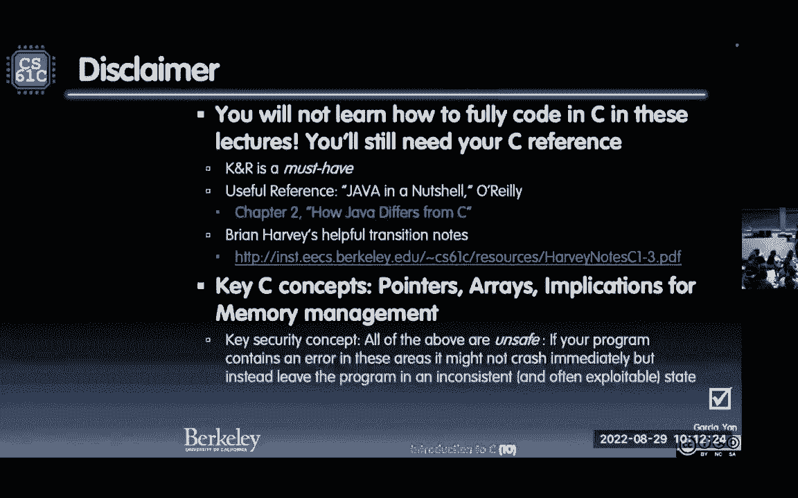


在本节课中，我们将要学习C语言的基础知识。C语言是一种强大且高效的低级编程语言，广泛应用于系统编程和性能关键型应用。通过学习C语言，你将能够更深入地理解计算机硬件的工作原理，并编写出运行速度更快的代码。


## 概述：为什么学习C语言？💡

C语言是一种低级语言，它能让你更接近机器，从而编写出比Python等高级语言更高效的代码。许多高性能库实际上都是用C语言构建的。学习C语言能为你提供全新的编程视角，并让你在C、C++和C#等语言家族中游刃有余。


上一节我们介绍了编程语言的抽象层次，本节中我们来看看C语言在这个层次中的位置。

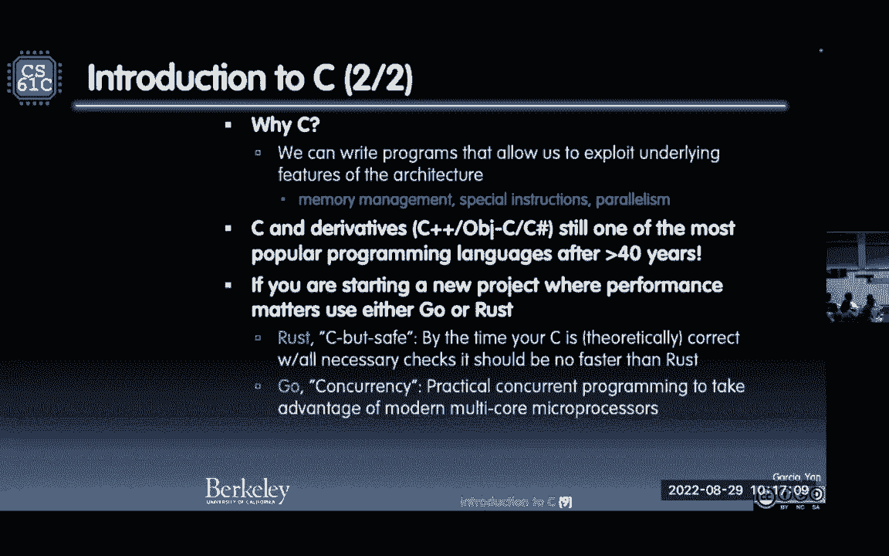

## C语言的历史与地位 📜

C语言并非一种非常高级的语言，也不是一种大型或专用于特定领域的语言。它诞生于20世纪80年代，其设计没有过多限制，能够很好地与低级硬件交互，同时又具备足够的通用性，使其对许多任务都有效。C语言的一个重大成就是，它被用于编写第一个非汇编语言实现的操作系统——Unix。


以下是C语言的一些关键特点：
*   **流行且强大**：C语言及其衍生语言（如C++、C#）是40多年来最流行的编程语言之一。
*   **现代替代品**：对于新项目，可以考虑使用更安全的Rust或更便捷的Go语言，它们都从C语言中汲取了灵感。
*   **学习资源**：可以通过实践和参考《C程序设计语言》（K&R）等经典书籍来学习C语言。


## 编译型语言 vs. 解释型语言 ⚙️

编程语言可以分为编译型和解释型。理解这一点对掌握C语言至关重要。


*   **编译型语言（如C）**：源代码通过**编译器**直接转换为特定计算机架构的**机器码**（可执行文件）。这使得程序运行速度极快，但可执行文件不能在不同架构（如Windows和Mac）间直接移植。
*   **解释型语言（如Python）**：源代码由**解释器**逐行读取并执行。代码具有很好的可移植性，但通常运行速度较慢。
*   **Java**：是一种混合模式。它先被编译成与架构无关的**字节码**，然后在运行时由**Java虚拟机（JVM）** 解释执行，实现了“一次编写，到处运行”。

C语言的编译过程通常包含三个步骤：**编译（Compile）**、**汇编（Assemble）** 和**链接（Link）**。你可以通过口诀“Cal”来记忆。

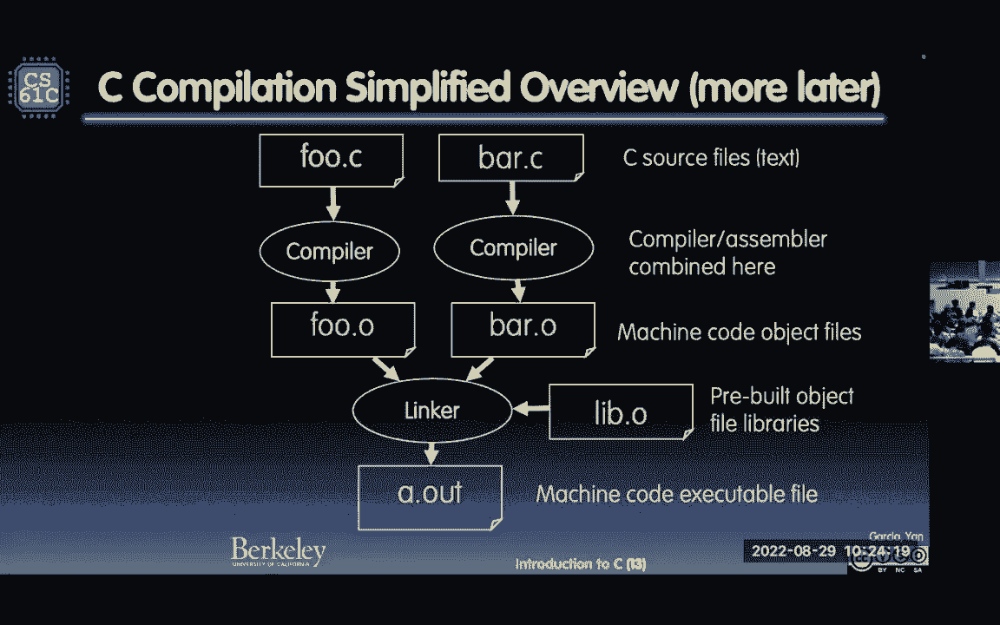

## C程序的构建过程 🏗️

一个C项目通常由多个源文件（`.c`）组成。构建过程大致如下：

1.  **预处理**：处理源代码中的`#`开头的指令（如`#include`），进行文本替换和文件包含。
2.  **编译**：将预处理后的代码转换为汇编代码。
3.  **汇编**：将汇编代码转换为目标文件（`.o` 或 `.obj`），即机器码片段。
4.  **链接**：将一个或多个目标文件与所需的库文件合并，生成最终的可执行文件。

这种分文件编译的方式支持团队协作和模块化开发。如果只修改了某个源文件，只需重新编译该文件并重新链接即可，无需编译整个项目，这大大节省了开发时间。工具`make`可以自动化管理这些依赖和构建过程。

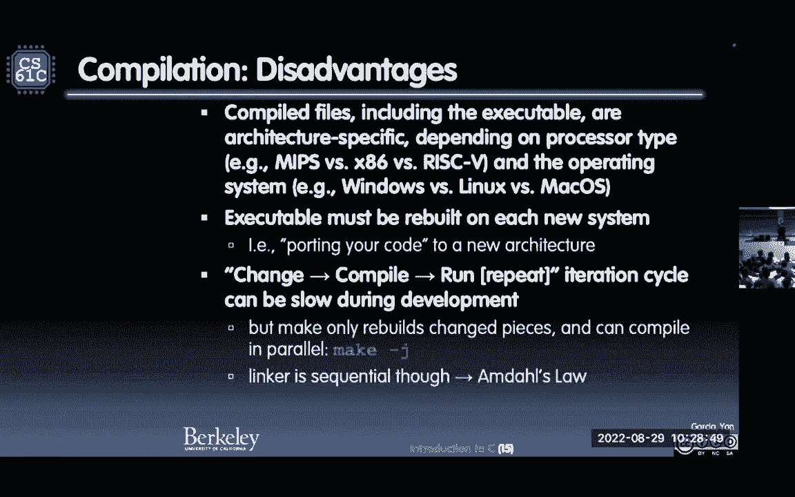

以下是编译过程的优点和缺点：
*   **优点**：
    *   合理的编译时间（借助`make`工具）。
    *   卓越的运行时性能。
    *   可与Python等脚本语言结合，兼顾开发效率和执行速度。
*   **缺点**：
    *   代码可移植性差，依赖于特定架构和操作系统库。
    *   开发周期中的“编辑-编译-运行”循环较慢。

## C预处理器（CPP）🔧

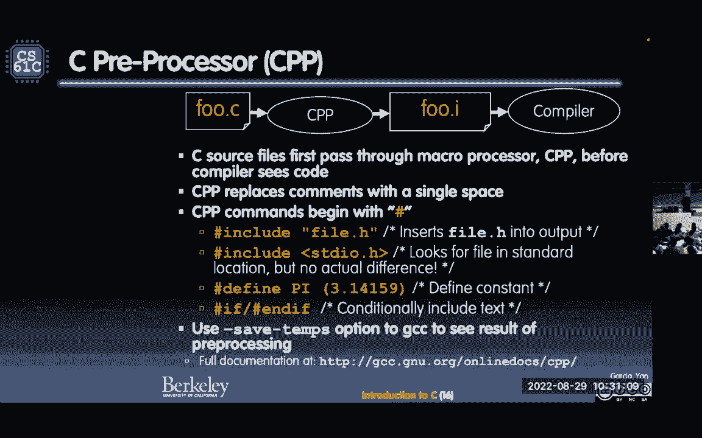

C预处理器在编译之前对源代码进行文本处理。以下是一些常见的预处理指令：

*   `#include <file.h>`：包含系统头文件。
*   `#include "file.h"`：包含用户自定义头文件。
*   `#define PI 3.14159`：定义常量或宏。
*   `#ifdef`, `#endif`：条件编译，用于编写可移植代码。

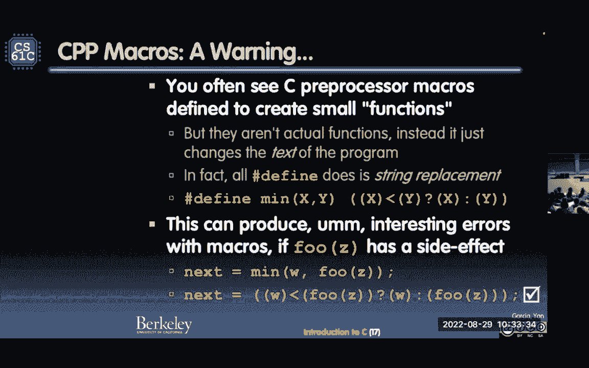


**宏**是一种强大的文本替换功能。例如，定义一个求最小值的宏：
```c
#define MIN(X, Y) ((X) < (Y) ? (X) : (Y))
```
需要注意的是，宏是简单的文本替换，如果参数是有副作用的表达式（例如自增函数），可能会导致意料之外的行为，因为参数可能会被求值多次。

## C语言与Java的对比 ⚔️

C语言和Java有许多相似之处，因为Java的设计深受C语言影响。以下是它们的一些主要区别：

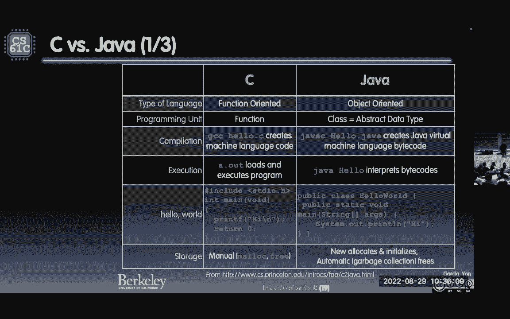

*   **编程范式**：Java是**面向对象**的语言；C是**面向过程**（函数式）的语言。
*   **内存管理**：Java有**自动垃圾回收**；C需要程序员手动管理内存（使用`malloc`和`free`）。
*   **编译与运行**：C全部编译为本地可执行文件；Java编译为字节码，由JVM解释执行。
*   **入口函数**：C是`int main(int argc, char *argv[])`；Java是`public static void main(String[] args)`。
*   **注释**：C使用`/* */`（不支持嵌套）和`//`（C99后）；Java使用`/* */`和`//`。
*   **布尔值**：C中`0`表示假，**非0**表示真；Java有明确的`boolean`类型。

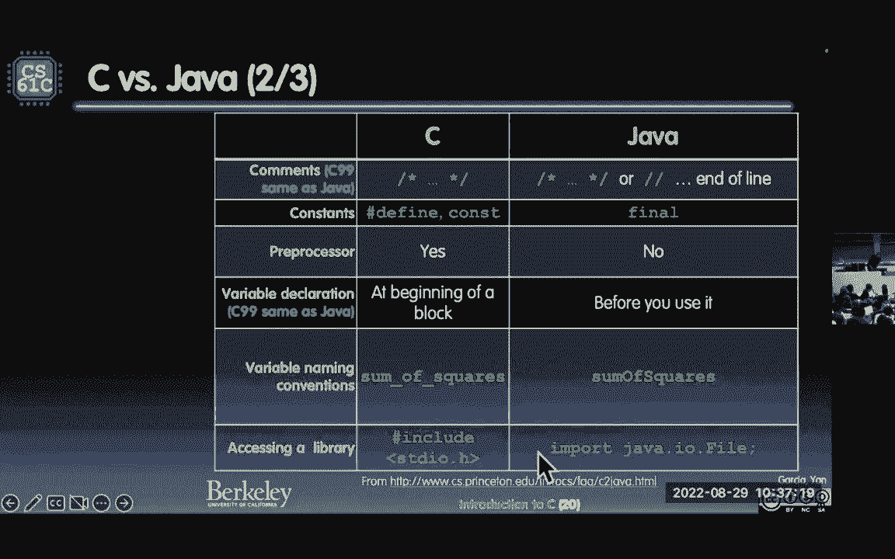


## C语言基础语法 🧱

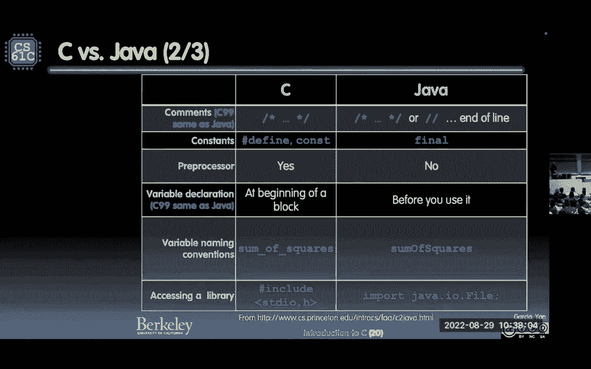

### 变量与类型

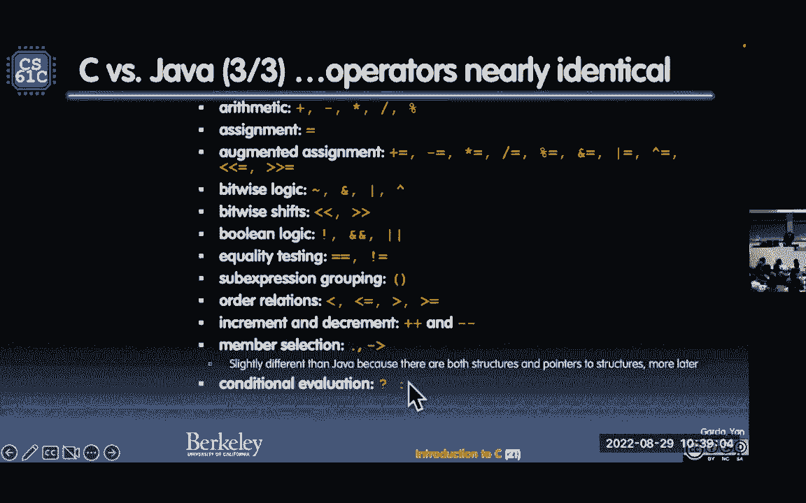

C是**强类型语言**，变量类型在声明后不能改变。基本类型包括：
*   `int`：整数。
*   `unsigned int`：无符号整数。
*   `float`, `double`：单精度和双精度浮点数。
*   `char`：字符。

建议使用明确指定宽度的类型，如`int32_t`, `uint64_t`，而不是模糊的`long`, `long long`。

**常量**可以使用`#define`或`const`关键字定义。**枚举（enum）** 能创建一组有名字的常量，提高代码可读性。


### 函数

函数必须声明返回类型和参数类型。没有返回值的函数返回类型为`void`。
```c
int add(int a, int b) {
    return a + b;
}
```


### 结构体（struct）

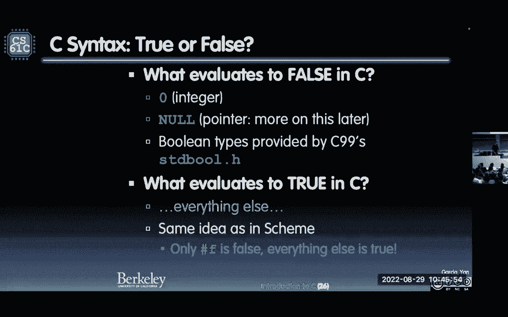

结构体用于创建自定义的复合数据类型，是实现抽象数据类型（ADT）的方式。
```c
typedef struct {
    int feet;
    int inches;
} Height;


Height h;
h.feet = 5;
h.inches = 11;
```


### 控制流

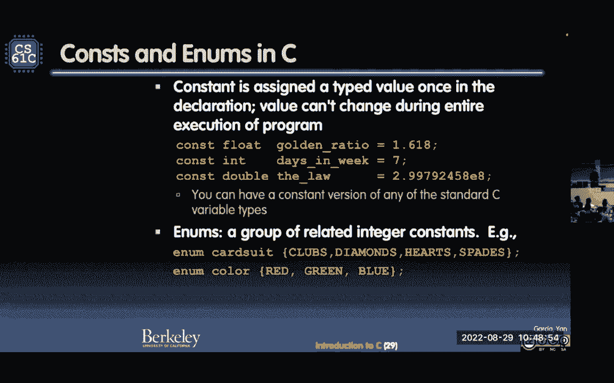

C语言的控制流语句（`if`, `else`, `while`, `for`, `switch`）与Java非常相似。强烈建议即使只有一行代码，也使用花括号`{}`包裹，以避免错误。

**特别注意**：`switch`语句中的每个`case`分支通常需要以`break`结尾，否则会继续执行下一个`case`（这称为“贯穿”）。

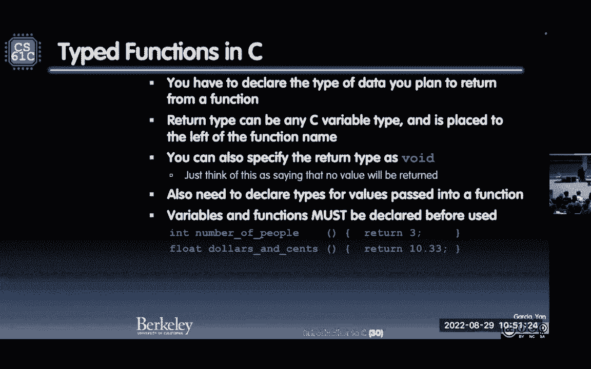

**避免使用`goto`语句**，它会使程序流程难以跟踪。

## 第一个C程序示例 🖥️

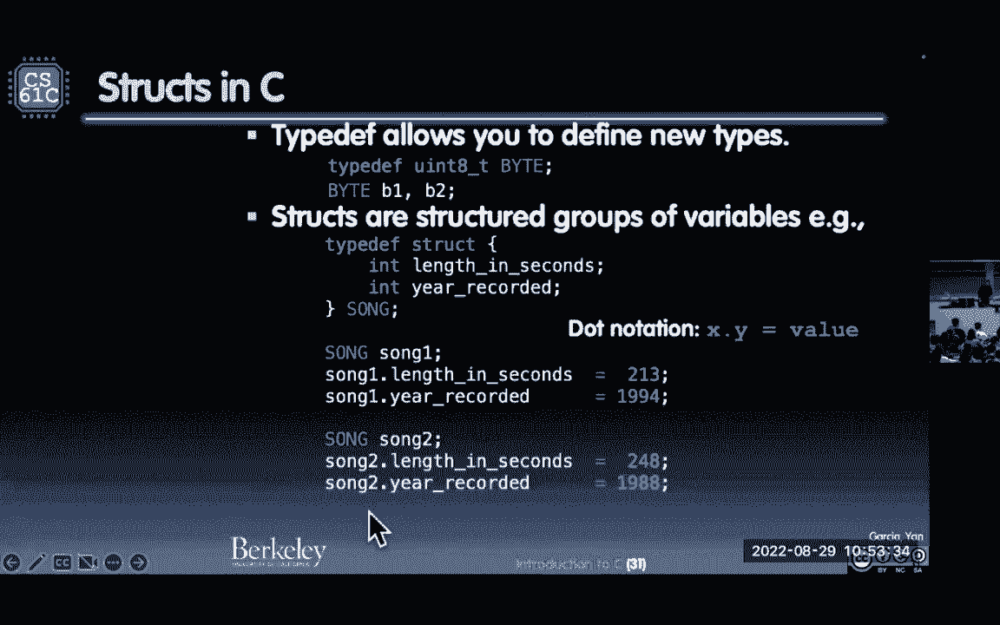

让我们看一个计算正弦值的简单C程序：
```c
#include <stdio.h>
#include <math.h>


int main(void) {
    int angle_degrees;
    double angle_radians, pi, value;

    pi = 4.0 * atan(1.0); // 计算π的近似值
    printf("Value of pi = %f\n", pi);

    for (angle_degrees = 0; angle_degrees <= 360; angle_degrees += 10) {
        angle_radians = pi * angle_degrees / 180.0;
        value = sin(angle_radians);
        printf("%3d   %f\n", angle_degrees, value);
    }
    return 0;
}
```

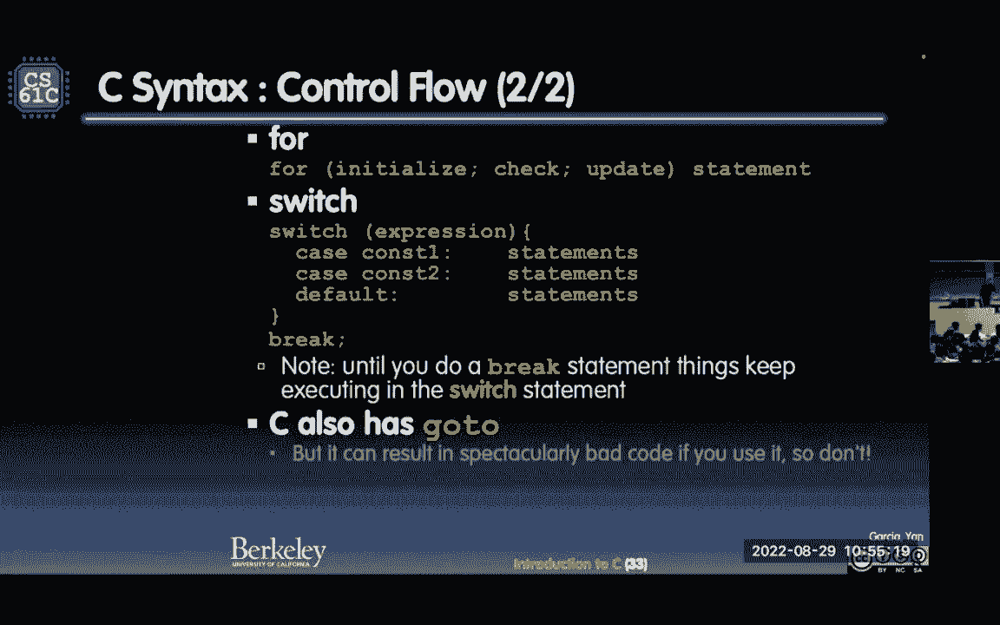


**重要提醒**：C语言中的变量**不会自动初始化**。声明一个变量后，它的值是内存中的“垃圾值”。直接使用未初始化的变量是常见的错误来源，可能导致程序行为不可预测（这种难以复现的错误有时被称为“海森堡Bug”）。

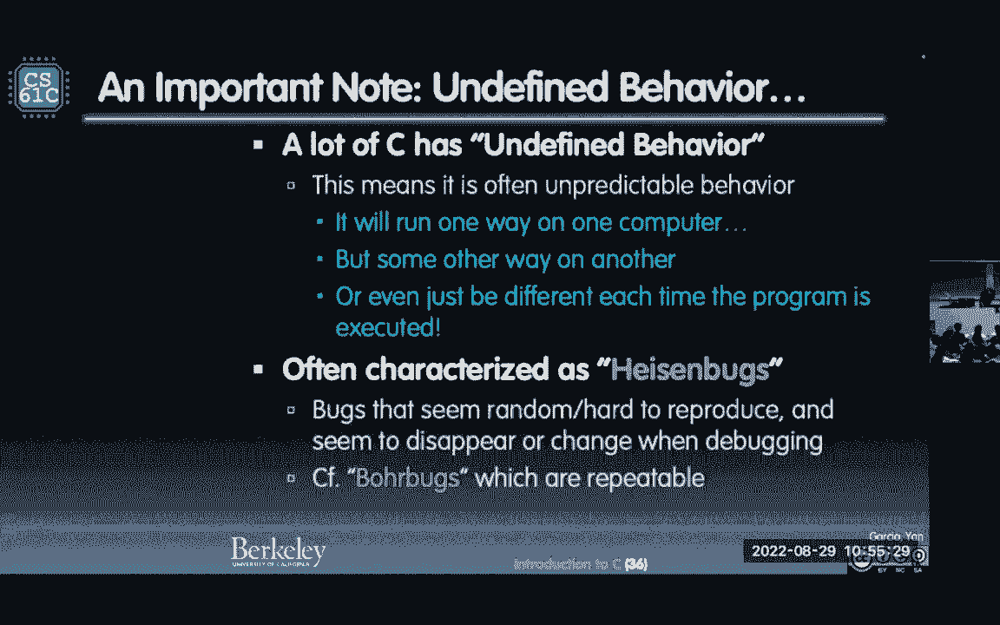

## 总结 🎯


本节课中我们一起学习了C语言的基础知识。我们了解到：

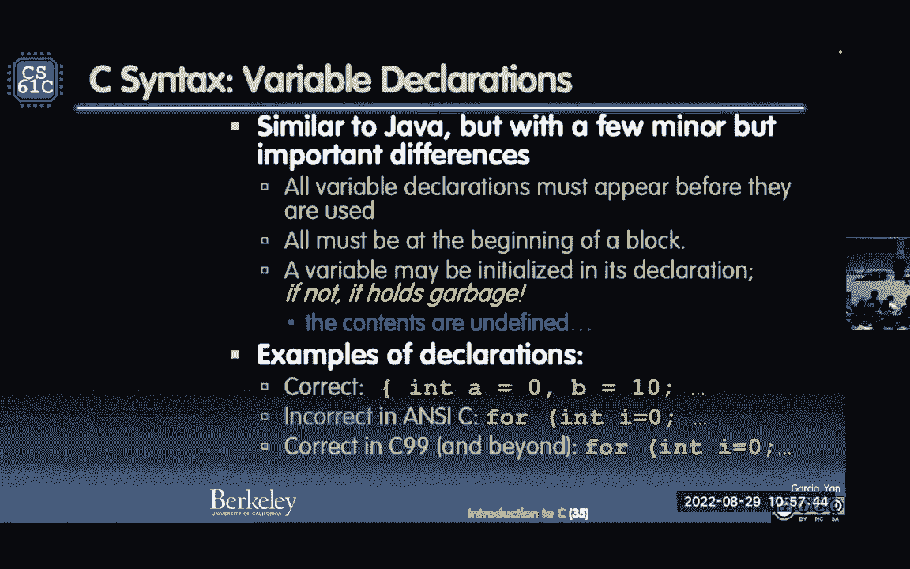

1.  C语言是一种高效、低级的编译型语言，能让你更好地利用硬件。
2.  C程序需要通过**编译、汇编、链接**的过程来生成可执行文件。
3.  **C预处理器**提供了宏和条件编译等强大功能。
4.  C与Java语法相似，但关键区别在于**手动内存管理**和**类型系统**。
5.  我们学习了C的基本构建块：**变量类型**、**函数**、**结构体**和**控制流**。
6.  必须注意**初始化变量**，并理解`0`在C中代表“假”。


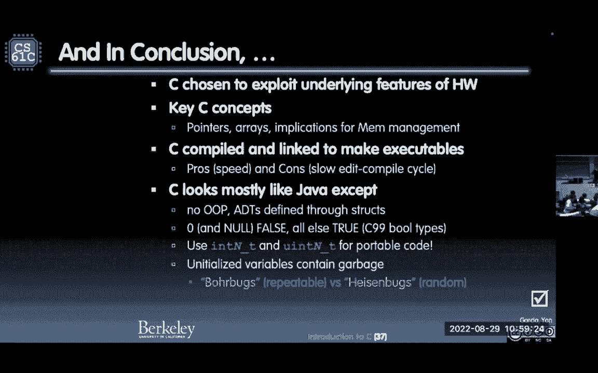

掌握这些基础是深入理解指针、内存管理等C语言核心概念的第一步。下节课，丽莎老师将带领大家进行更深入的探索。