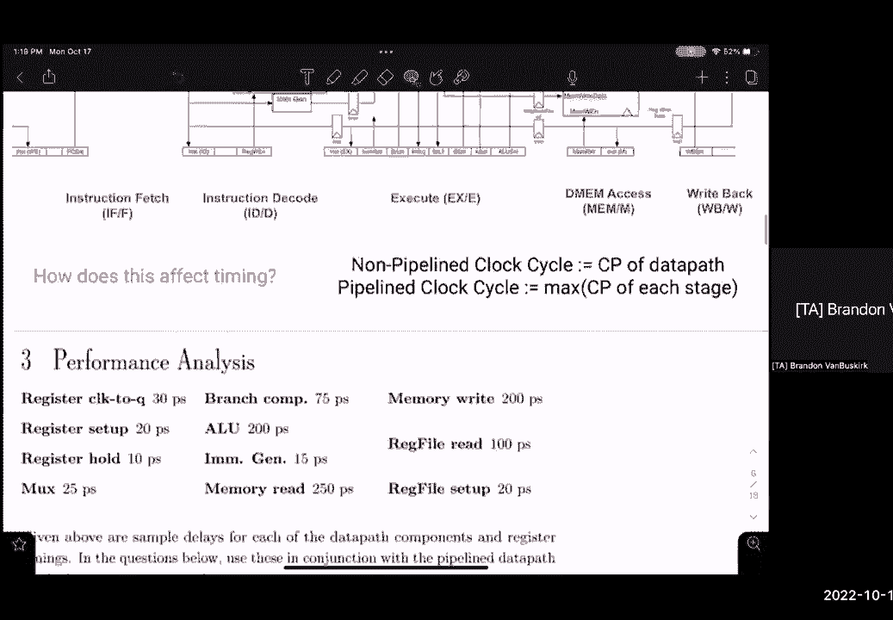
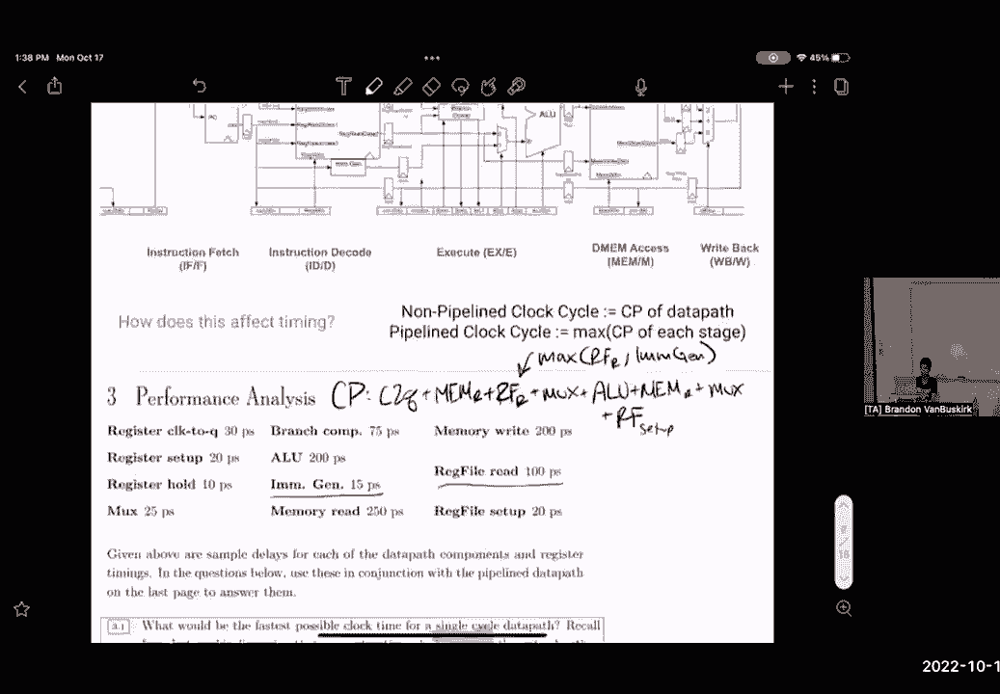
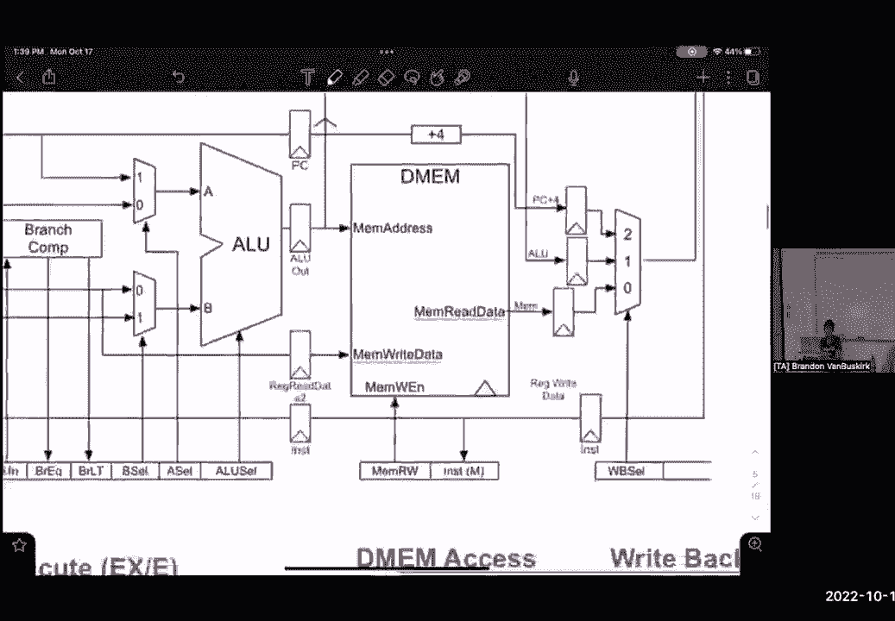
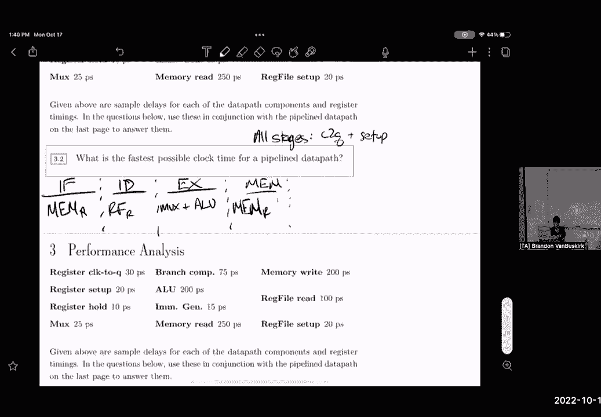

# P31：Discussion 8： Pipelining, Hazards - 这样好__ - BV1s7421T7XR

所以我们身后的期中考试，我们都结束了，每个人都过得怎么样，好啦，一种新的考试形式，嗯，但与其他考试相比，行吗，令人困惑，这肯定比像十六系列考试要好，我不知道，我是说，在过去的学期里，他们必须喜欢手写。

C代码，没有人喜欢，所以希望带回家的部分更容易使用，嗯，回到课程负载，我们星期三有第三个项目，嗯，希望你们能从这个开始，尽管与整个项目相比，A部分是相当小的，所以你应该有良好的信誉。

今天我们要谈谈管道和危险，你们中有多少人参加了上周的讨论或观看了上周的录音，我觉得你们很多人都在准备期中考试，好啦，我们将温习一下上周的材料，但是嗯，大多数时候试着直接去做，所以说。

我们现在正在使用管道数据路径，我们在数据路径中注入了额外的寄存器，使我们的临界路径更短，希望这将优化我们的数据路径，如果你们还记得在课堂上，我们讨论了一点吞吐量，呃，它允许我们平均每秒发出多个指令。

以最大的效率和结束级管道作为管道中的指令，所以我们可以用这种方式级联这些指令的想法，我们在任何给定的时间使用管道的每个阶段，但是，如果你去听讲座，你所看到的一切都变得有点混乱，嗯。

某些指令可能依赖于由其他指令设置的值和寄存器，不同类型的冲突给我们带来了危险，我们一会儿再谈，但就管道数据路径而言，在我们开始之前，大家还有什么问题吗？所以是的，所以我们要有这五个阶段，我们接到指令。

指令解码，执行内存并写回，嗯等，这是在你工作表的背面，但这本质上是我们将要使用的数据路径，有时候如果你看看过去的学期，你会注意到，像mgen这样的东西实际上会执行，与指令解码，但是嗯。

你总是被赋予一个数据路径来引用要处理的东西，但是嗯，正如我们在介绍数据路径时所说的，有一些组件在并行工作，指令解码中的通知，我们有重新归档和即时生成器并行，嗯，更深层次的话题，我们稍后会讲到。

这里的分支比较器实际上与alu并行，有人知道为什么，是这样的，是啊，是啊，呃，分支比较器将接受寄存器文件中的寄存器值，它将决定它们是否小于1，比另一个少，或者他们是平等的。

然后它会向控制单元发送两个控制信号，那口井，我是说，这是很好的考虑到所有ALU的一部分正在检查这种情况，不完全是这样，它与ALU是分开的，它会做一种，像算术一样，一种评估权，它将检查一个是否大于另一个。

嗯，但事实并非如此，它和外星人是分开的，但有人知道为什么这和ALU是平行的吗，从球棒上看是有点棘手的，如果我们使用分支指令，这是我们真正使用分支比较器的唯一情况，我们实际上对分支比较器提供的东西感兴趣。

嗯，那样的话，对于分支指令，我们的B细胞和A细胞总是一个，这意味着我们的程序计数器会自动地，我们有我们的即时发电机自动进入ALU，所以当我们弄清楚我们是否要拿走树枝的时候，我们已经有了，如果你真的喜欢。

从ALU出来，嗯，这些值是这些值被发送到这个多路复用器就在这里，所以我们要采取一些，或等于或大于将其发送到控制逻辑，那么在下一阶段，嗯，甚至在右后阶段，我们的控制单元将决定我们是否要把电脑。

加四或这里的ALU输出，所以本质上我们在做分支比较，分支比较，同时我们的ALU在这个阶段工作，这是一个，我希望我没有因此失去你，但是输了，所以说，那真的很重要，当我们想知道在这些阶段中最长的路径，就是。

嗯，我们需要考虑哪些组件在并行工作，哪些组件比其他组件慢，所以说，继续走，哎呦，也在这张幻灯片的底部，这是一个很重要的笔记，所以一个非流水线的时钟周期，依赖于整个数据路径的关键路径，对呀。

所以在非流水线时钟周期中，我们这里没有这些登记表，我们基本上只有这个PC寄存器，所以数据路径，或者关键路径是从这个寄存器的时钟到q，贯穿数据路径的组合逻辑，然后这个的设置时间，然而现在当我们把它输送到。

我们要把它分成几段，我们要说，我们CPU的关键路径真的取决于，其中任何一个阶段之间的最长延迟，任何有意义的阶段中最长的关键路径，是啊，是啊，我的名字更像是，嗯，是啊，是啊，是啊，是啊。

所以本质上我们有一个很大很复杂的电路，然后呢，流水线基本上可以让我们把复杂的电路，把它撕成碎片，因此，你知道的，如果我们做一个，嗯，就像一个非管道，呃，CPU，嗯，我们的指令将通过IMM。

可能会通过注册文件，嗯，穿过阿鲁河，但是看看如果我们在指令上得到U，这里所有的东西都是闲置的，所有这些东西，所以它允许我们更多地利用我们的CPU，反过来，我们可以每秒输出更多的指令，CG。

所以直接进入第三个问题，我给你一点时间，他们已经给你安排好了，所以我想是上周我们在设置上遇到了这个问题，还是在那之前的一周，呃，上面的SDS是上周的，那是上周，好啦，是啊，是啊。

所以上周我们决定最长的教学，或者关键路径是基于给定延迟的加载字指令，这个问题给了我们，嗯所以知道，试着找出最快的时钟，给你一点时间，我会把这个带回来，其实呢，让我们看看我能不能把这个复制过来。

如果您面前没有数据路径。

我真的需要这份工作，所以想想加载单词指令，考虑load word指令需要哪些组件，我们一会儿就回来，好啦，所以希望我们都有机会开始，嗯，所以让我们追踪加载字指令的路径，所以首先，管道中任何指令的开始。

我想从这里开始，个人电脑是的，PC的输出，是呀，所以我们就在这里，嗯所以呃，每一条指令都进入到项目中，我们需要从记忆中获得指令，所以马上，我们有，见，时钟到Q，嗯，我们从他们后面读出了记忆，所以说。

我的空间快用完了，我就写，所以我们要到这里来，而且我认为这个问题是假设，嗯，是啊，是啊，单周期数据路径，所以我们不是在管道方面工作，对不起，我们开始之前我没说清楚，不过，好吧，所以是的，是啊，是啊。

是啊，是啊，所以问题是说一个单一周期的数据路径，意味着一个时钟周期对应于正在处理的整个数据路径，所以我们这里不是在讨论管道数据路径，对不起，我应该在我们开始之前澄清的，但是嗯，是啊，是啊。

所以我们现在要忽略的所有这些管道寄存器，好啦，所有这些蓝色寄存器，我们假设我们有规则的单周期数据路径，好啦，所以向前看，从IMM出来，我们已经阅读了我们的指示，我们正在通过。

所以现在我们有两个平行的单元，我们有注册文件和即时生成器，我们对哪一个感兴趣，我们所看到的关键路径，所以说，我们要在计算中加入什么，媒体生成器好吧，所以我们有两个平行的组件，我们有15皮秒的延迟。

或重新文件读取，也就是一百皮秒，所以我们要选择最长的延迟，因为我们感兴趣的是最长的组合延迟，所以我们要添加我们的reg文件read，每个人都有道理，好啦，所以从注册文件中出来，我们对什么感兴趣。

穆克人是对的，因为我们不使用分支比较器，这只是一个加载字指令对吧，好啦，所以让我们在这里添加我们的多路复用器，通过多路复用器，我们直接进入ALU，这里没有别的路可走，对呀，是啊，是啊。

即使你用俄罗斯选手，你说它发生在ALU的一部分，然后这将归结为这样一个事实，如果ALU大于如果ALU，总比树枝回来好，然后你仍然不会用一堆确切的，谢谢你提起这件事，我们一会儿就会讨论这个问题。

还有另一个问题，但你百分之百，对嗯，如果我们有兴趣，就说这是一个分支指令，我们将权衡分支比较器是否比ALU花费更长的时间，是啊，是啊，完全正确，但是，是啊，是啊，所以我们将直接进入ALU。

我们能准确地确定ALU在这里对加载字做什么吗，我们为什么要用ALU，添加，是啊，是啊，立即在媒体上添加什么，是啊，是啊，是啊，是啊，所以我们加载了某种内存地址的偏移量，对呀，这个加载词接受了一个即时的。

这是我们给它的地址的偏移量，嗯，所以我们需要计算偏移地址，所以我们通过ALU，从阿鲁出来，我们直接进入DM，我们在这里用DM吗，是啊，是啊，这是一个加载词，所以我们必须进入主内存，所以我们要再读一次。

Amux，是啊，是啊，是的，是的，所以我们走出这个门，在这里直接将数据读入这个多路复用器，这个月之后还有什么事吗？所以我们读取了我们的记忆或从记忆中读取数据，现在通过这个多路复用器。

数据路径带我们去哪里，关于我们在做什么在加载词，加载字指令的最后一步是什么，是啊，是啊，回到我们的登记簿上，是啊，是啊，完全正确是的，所以我们要把从记忆中读到的数据，让我一路往回走，在我们的右边。

我们要把数据写回寄存器，所以这就增加了，哦耶，在这里重新设置，所以说，所以因为，我们的数据路径在这里结束于reg文件，它是一种注册权，这就是我们的设置时间，否则，我们通常有一组其他寄存器的时间。

但是是的，哎呦，你需要阅读的时间点在哪里，所以我们忽略了直接发生器，你知道为什么，因此即时生成器与reg文件并行，对呀，所以我们的指令分成了两条不同的路径，然后它们最终会聚在一起，嗯，因此。

既然我们试图计算数据路径的最长延迟，我们想，真的吗，是啊，是啊，我在这里没有说清楚，但这个，这里是reg文件之间的最大值，读或读，嗯，这就是为什么我们要带着区域数据一数据二下去，我将使用一个寄存器。

然后立即添加到，呃，是啊，是啊，有道理嗯，这里有一个微妙之处，所以说，事实上，每条指令几乎都要分支，但是，到达reg文件的控制信号将告诉reg文件，哪些是真正应该关心的，是啊，是啊，我想是的，我猜。

如果我们要用，就像两个寄存器都不可能比这更快，等着，是啊，是啊，我不认为，有一个实例，我们不会读取任何寄存器值，对于我们在这门课上所学到的任何指令来说，有没有一种情况我们不需要从寄存器中读取任何值。

我不这么认为，是啊，是啊，我不这么认为不，你总是要去读，是啊，是啊，所以是的，所以说，不管我们是什么，我们至少要从一个寄存器中读取一个值，也许两个好问题，在靠近电脑的左上角有什么标记。

下一步的聚会是什么，因为对于某些指令，PC本身必须取出，嗯，是啊，是啊，是啊，是啊，完全正确是的，所以这是一个加载单词指令，对呀，所以我们正在加载来自dm的内存，我们需要写回reg文件。

但同时我们也在计划中增加了四个，但是，我们在这里的关键道路并不依赖于那么多的权利，因为我们的数据路径在这里直接结束于重新文件，所以我们基本上有了一个关键路径的布局，在这里我们有所有的延误。

所以我们可以把这些加起来，我们的时钟延迟了30秒，我们有一个记忆读数，也就是，是一百个我们有一个多路复用器，也就是二十五，另一个内存读取，一共250块，我们还有一个杯子，也就是两块五。

然后Reg文件安装时间只有20微微秒，所以这最终，如果你把所有东西加起来，它最终是900皮秒，我们整个数据路径的关键路径，如果我们不是皮佩尔，好啦，但本节的全部目的是开始研究流水线，所以说，让我们。

让我们考虑管道数据路径的最快时钟时间，有人想提醒我，管道数据路径的关键路径到底是什么，我刚刚才说过，这是两个寄存器之间最长的时间，是啊，是啊，任意两个管道寄存器之间的最长延迟。

所以基本上我们这里最长的舞台，所以让我把这些处理掉，给你一分钟想想哪个阶段会是我们这里最长的，现在呢，把延误留在这里，我也想对你的电脑加4发表一点意见，因为你确实提出了一个很好的观点。

我想让大家明白当我们开始教学时，我们从这里开始，所以我们也有另一条平行的路径，我们穿过这里或这里，因为我们对最长的平行路径感兴趣，我们真的不认为这台顶级个人电脑加四台，好啦。

所以当我们开始考虑管道数据路径时，让我们把它分成五个阶段，我们的指令提取阶段包括，注意每一个阶段，所以我就写下来，每个阶段都有一个开始和结束的寄存器，所以每个阶段的每个关键路径都有Q延迟的时钟。

和安装时间，所以暂时忽略这两个延迟，嗯，我们在指示中处理的是什么样的延误，去拿，记忆是的，正是这样，我们在那里有IMM组件，所以说，这就是我们除了开始的PC寄存器之外的所有东西，和结束管道寄存器。

我们所拥有的只是那个阶段的IMM组件，但我们也不一定是真的，呃，我们也有这台PC加四台，我们刚刚谈到了多路复用器，但是我们的记忆读数会比我们的多路复用器长，我们这里有一些组件，我们对哪个组件感兴趣。

这会给我们最长的延迟，是啊，是啊，害怕的正是，所以我们有直接发生器，嗯，我们要处理的是，此阶段中的reg文件设置，或者只有三个，只是为了阅读，是啊，是啊，呃，reg文件设置，如果你还记得就在后台，它。

看起来是在这个阶段，但真的，它位于这个多路复用器之后，是右后卫的数据路径的末尾，所以让我们把指令写下来，解码，我们有我们的文件读取，接下来是执行阶段。

谈了一下这个，在这里，延迟是最重要的，它是多路复用加上Lu吗，是啊，说得好，呃，呃，包括那里的多路复用器，注意我们有两条平行的路径，我们有分支比较器，或者穿过淤泥，穿过阿鲁河。

所以两者之间的最大值是MUX加ALU，接下来是MEM舞台，我也会把我们延误的时间调出来。

这是我们在MEM阶段最长的延迟，我想我们可以从列出，比如MEM阶段有什么延迟，我们的记忆对吗，哦耶，去吧，只是内存读取，是啊，是啊，好啦，因为呃，就像注册文件一样，红色的右边。

这里的MEM也与右后台相关联，否，我错了，对不起，那不一定正确，嗯，但是是的，记忆是，记忆写二百，读二百五十，我们有什么，不要。

那么我们就在后台了，一切，在这些管道寄存器之后，这是我们在这里耽搁最久的时间了，是啊，是啊，标记加上右边和注册右边，所以我骗了你，因为呃，我们包括了设置时间和关键的，或者排队等待所有这些阶段的时钟。

对呀，嗯，你是对的，注册表文件，设置时间，下面是与之相关的延迟，但这也是数据传递的结束，所以所有这些阶段都包括一个设置时间，所以除了排队的时钟之外，唯一的延迟，设置是马克杯，这里。

对每个人来说都有意义吗，这是一个微妙的点，但是，我们不会有另一个设置时间后，山脊，对呀，本质上，所以我们这里有一个多路复用器，所以看看我们的延误，你认为哪个阶段会决定我们的关键道路，抓住他们，是啊。

是啊，完全正确，但是，正如你所看到的，内存是所有这些组件中最长的延迟，但是是的，我是说一切加上在设置中排队的时钟，这意味着总共延迟了30分钟，加，然后记忆是250，所以我们的关键路径是300皮秒的延迟。

这是我们的时钟所能达到的最快速度，是啊，是啊，嗯嗯，如果max+alu是大的呢，呃，记忆，在执行阶段，啊，啊，你的意思是，喜欢喜欢什么，如果这个阶段比内存读取的时间长，是啊，是啊，是啊，是啊。

所以在这种情况下，嗯，假设它也比这里读取的内存长，是的，这就是我们的电路的关键路径，是啊，是啊，那将是我们最长的舞台，有时是的，到目前为止，大家对此有何感想，有很多值得看的，但是，所以我们要继续。

所以我们基本上是在流水线化数据路径后，请注意，我们已经从900皮秒增加到了300皮秒，这是呃，将计算一条指令所需的时间缩短三，挺好的，那么为什么不把速度提高五倍呢，好了，我们把我们的数据路径。

把它切成五块，为什么不是，是啊，是啊，因为我们不会分成五个人，在我们的销售中给一些危险的人提供动力，完全正确是的，所以有些阶段可能会包括，可能是整个电路延迟的40倍或40%，所以当我们把它分开的时候。

那个阶段将决定整个赛道的一切，但是是的，所以说，我觉得这就足够了，对此有什么问题吗，所以让我们来谈谈危险，嗯，我们有三种主要的危险，这里有结构危险，本质上是两个指令试图在我们的电路中使用相同的组件。

同时我们也有数据危险，假设你有一条指令，它将设置寄存器的值，接下来的指令需要读取寄存器中的值，也许第一个指令还没有说出来，第二个正在读，是数据危害，然后我们有控制危险，嗯，与分支和跳跃有关。

基本上我们不会决定我们是否要采取一个分支，直到我们的指令执行到一半，所以我们不知道我们是否需要执行，以下指令或某些指令15行以下，那么我们在分支之后将哪一个排队进入数据路径，关于这三种危害的问题。

所以我首先要注意的是，风险五，基本上处理风险五架构基本上为我们处理结构风险，所以我们这里的电路，所以一条指令可能在后台，当我们的reg文件在不同的指令中从寄存器读取时，风险五架构在这个DM阶段分裂。

在这个IMM阶段，往那边走，我们有两个相互分离的内存访问，所以我们可以在一个阶段从内存中读取指令，然后在另一个阶段从内存中读取数据，所以我们从来没有真正遇到过需要，或者需要两个指令中的相同组件。

说我们没有那些东西，以下是一些后续的解决方案，我们可以轮流，使用资源，利用摊位，或者不是实际上，就像x零是你的整个指令，只是被忽视了，或者我们只是增加更多的硬件，就像我们在风险五号为我们做的那样。

我们只是添加了另一个组件，允许我们从内存中读取，所以最重要的是，我们有数据危险，所以考虑一下，例如，我们把直接的5加到t 0，是啊，是啊，这是上一张幻灯片，是啊，是啊，当你说软件解决方案时，比如使用。

就像我和法律为教练的危险，我是说我宁愿插入，在两条指令之间的是汇编程序，我想装配工会处理不，不不不，它将是编译器，你说的对，是啊，是啊，是啊，嗯，但就像它是一个火，是这个吗，这是什么意思，我实际上。

你知道的，就像你那个，程序正在运行，是呀，我是说，是啊，是啊，所以假设你的编译器和你的机器一起工作，因为我的意思是有很多编译器，是的，还有许多不同类型的计算机架构，你不想做，就像解散，像编译器被告。

或者像哈佛的被告，你可能会出现在搜索中，就像什么，部门有，那是个有趣的问题，所以基本上你会有硬件手柄结或延迟，有可能，是啊，是啊，你可以添加额外的控制信号，我想，是啊，是啊，是啊，是啊。

所以我们同时也有一个读-写-D图，所以我们我不知道，不不我们，我们不能同时读和写，因为这是一个阶段，对呀，这一个部件，所以这将是一个结构性的危险，所以有很多方法，就像阅读和写作来记忆。

这就是我们现在在数据转发方面所面临的问题，嗯，我们可以从那里开始，本质上，是啊，是啊，与内存有关的数据危险，说，在这种情况下，我们有加载词指令，我们要取一些地址，读取那里的内存并将其存储为T零，呃。

我的意思是，如果如果呃，如果寄存器使用不同的，呃，类似的内存地址，呃，有些寄存器可能需要一些其他地址，然后同时另一个寄存器读或写，呃，另一个地址，对不起，我不太明白，呃，就像呃，所以我们为我安排了。

所以说，在这种情况下，我们总是用为零，但如果有一个登记簿，也读写为零，作为一个整体，对呀，所以你是说在这里，我们会有另一个负荷词，那是，呃，就像一个零和一个像另一个加载词，或者像广告一样，好啦。

所以会怎么说呢，一零为一，记住这些会像这样层叠，所以当我们在这个阶段使用存储单元时，对所以我们，呃，在这个地址从记忆中读取，在下面的指令中，这个加载词就在这里，我们将执行即时偏移。

然后接下来的时钟滴答作响，我们将根据记忆读取，你看，所以它们不是同时发生的，他们就像一个接一个的时钟滴答作响，这有道理吗，就像，如果我们回到，一个加载词就在上面，下一个加载词就在这里。

所以这个加载字使用的是dm，就在这里，它会同时读取数据，另一条加载字指令将计算内存地址的零偏移量，所以在下一个时钟滴答作响的时候，我们正在写回我们在第一个加载字中读到的数据，同时。

因为这个加载字正在从内存中读取，所以它们实际上不会碰撞，但他们很亲密，好啦，清除，好啦，所以说，基本上，在这里，我们有这样的情况，这个指令是在这个加载字之后出现的，但它依赖于从t零读一个值。

当我们在t零处读到这个值时，哪个阶段有人知道，指令解码正确，所以当我们从reg文件中读取时，所以在这个指令中解码，我们需要价值，t零的更新值，但是，就在那个时候，这个加载字只计算偏移量。

它还没有更新这个T零，所以现在这个指令使用的是旧版本的t 0，所以数据转发说的很好，如果我们把记忆组件，所以当我们把这个偏移量的内存读为零时，让我们立即把数据发回那边，当add正在执行阶段时。

它只是短路在那里执行，这变得很复杂，因为有很多不同的地方我们可能需要转发内存，这增加了更多的控制信号，但它确实解决了这样一种情况，即你知道我们可以快速地获得下一条指令的信息，高层。

这对每个人来说都有意义吗，我们就这么加一根电线感觉不对，但是当你考虑设计一个CPU时，这些都是需要考虑的事情，基本上它的作用是，它使我们不必在这些指令之间放一个旋钮。

因为加上一个nop只会让我们的指令延迟另一个时钟滴答声，就像那个数据危险，我们有另一个数据危险，我们有简单的，比如添加说明，一些简单的算术指令，在这种情况下，呃，假设我们写的是5到t 0。

但是这个shift指令需要t为0的值，然后也更新T零，基本上我们不能等到写后台，在我们开始阅读之前，我们迫不及待地等着它写回寄存器，是另一种情况，我们要执行零加五，直接从ALU。

我们要把它送回ALU的开头，这样，当shift指令接收它的红色值t-0时，或者这个短路值t零，它就会直接进入路，然后移动两个，我们会没事的，说是的，好像是，你怎么知道什么是允许的，就像。

允许链接到的内容，因为这似乎是一种随机性，现在呢，你有什么具体的指导方针要遵循我们吗，哎呦，你不能这样做，原来你是，听起来好像，你有点像在思考这些想法可能带来的问题，对呀，是啊，是啊，嗯，你说得有道理。

我想在这里要意识到的主要事情是，当我们可以使用转发通知，呃，我是说，转发字面上有转发这个词，对吧，我们不能回到过去，但我们可以说你知道，我们计算了实际的t零值并执行，这条指令过去没有执行过。

当您真正喜欢需要该值的最新可能时刻时执行，因为你要用它来计算，因为那是在这个阶段之后，我们可以把它向前发送，记住，这些是同时在时间上，所以每一个时钟滴答声都对应于这些并行的过程，所以说，嗯其实。

我们快没时间了，不过，我得先看一下，所以说，我们将研究这个问题，所以我们这里有这些说明，嗯，这是我们时间的级联，有人看到这里有危险吗，哪些指令是危险的，坏眼睛和T零会准备好爱它吗，所以不会对，嗯。

如果我们看一下，我们有这个加i指令，它实际上不会更新T零，直到右后台右，它又回到了收银机上，但与此同时，这个加载字已经从某个t零地址的内存中读取，那是一个旧的t 0，所以这确实是个问题，还有别的事吗。

是啊，是啊，然后后面的add指令，是啊，是啊，所以这条指令将把一些数据加载到t 1中，但是这个指令需要读取，所以这是另一个危险，所以我们有两件事要做，然而，第一个让我们来看看这个嗯。

我们能用数据转发来解决这个问题吗，就像我们刚才看到的，在添加i指令中最快的时刻是什么时候，我们有必要的价值，执行，是啊，是啊，完全正确是的，所以我们要在之前零点的基础上再加四个，所以让我们我就这么做。

所以这是最快的，最近可能的时刻是什么，对于加载字，我们需要该值为零，因为你需要知道地址并加上偏移量，所以因为这是在时间上前进，我们可以使用数据转发，所以这就像我们之前说的，我们有我们的。

我想这就是ALU的样子，但基本上我们只有这个循环，它可以追溯到，然后我们的渣滓将决定，我们的控制信号将决定我们是否真的走这条路，好啦，但让我们快速看看另一个危险，因为这很重要。

我们能用数据转发来解决这个问题吗，否，为什么我们能做和以前一样的分析，什么是，我们能在什么时候得到这批货物的价值，字，记忆权，所以我们读取数据，它从我们的恶魔那里输出，但我们最快什么时候需要它呢？

还是对不起，我们广告指导所需的最新时刻，执行是，我们的ALU需要它，但这两件事同时发生，所以解决这个问题的唯一方法就是知道我们现在所知道的，才是我们真正需要的，就像这个时机，我们就这样算了。

我们可以使用数据转发，从这段记忆中，所以我们需要一个，我们得把下一个地址推迟一小时，对如果这些是时钟滴答声，我们再推迟一个小时，我们可以使用数据转发来解决数据危险，好啦，关于那个话题，这是一个。

这是一件复杂的事情，但这确实是数据转发最复杂的部分，所以指令是用t 0而不是t 1，然后你可以伪造到4只是为了确认，嗯，所以如果我们需要T 0的更新值，对呀，所以正确的后台发生在指令解码的同时。

当我们从reg文件中读取该值时，所以我们仍然需要数据转发，对呀，我们有合适的后台，所以我们必须把数据从，嗯，我是说，我们甚至可以从右到右写它来执行，中间有两条指令，那就没问题了，因为正确的后台会发生在。

嗯，这个指令解码，是呀，没问题，嗯，在你走之前我们的反馈表，我真的很感激。

