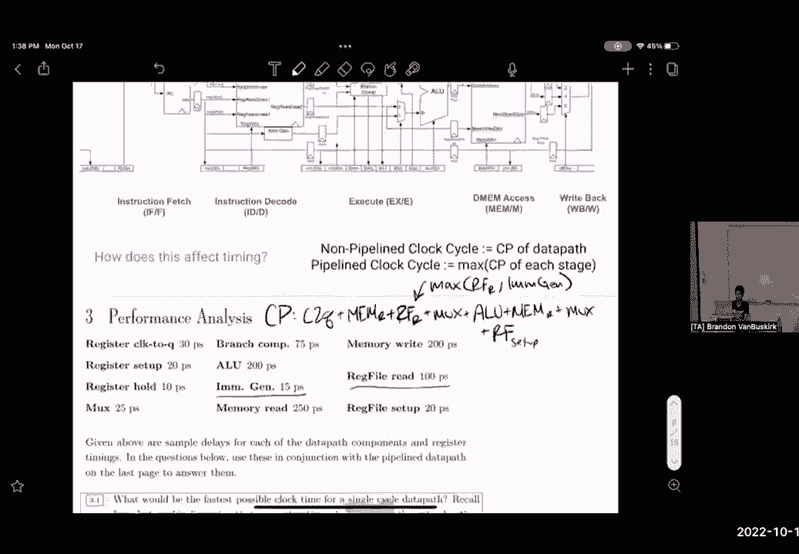
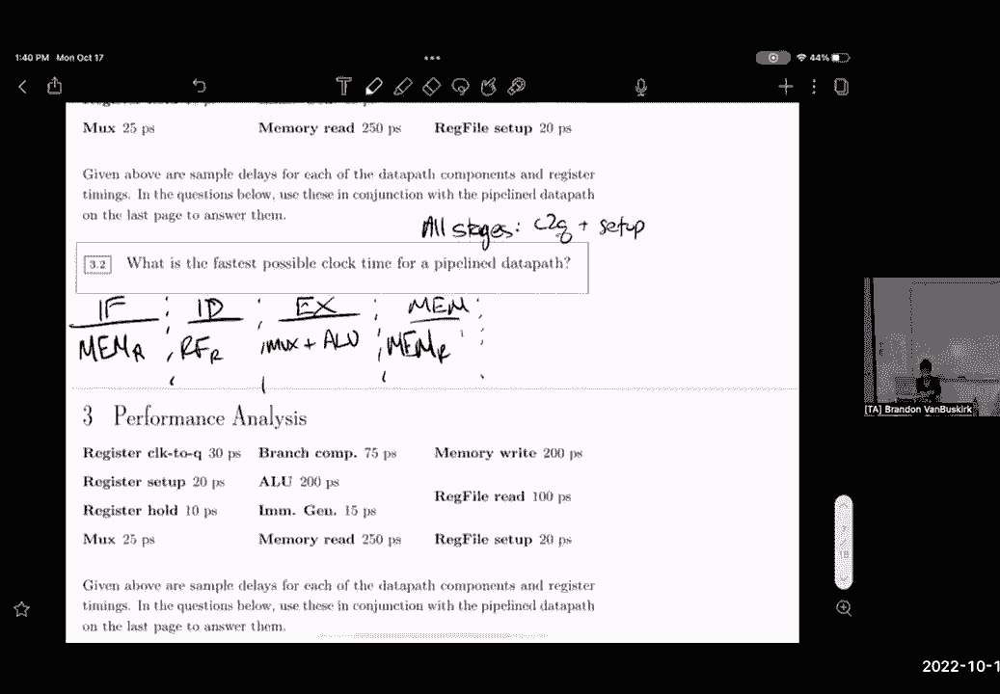

# 课程 P31：流水线与冒险 🚀

在本节课中，我们将学习流水线数据路径的基本概念，以及流水线技术如何通过缩短关键路径来优化CPU性能。我们还将探讨流水线引入的三种主要冒险（Hazard）类型：结构冒险、数据冒险和控制冒险，并了解如何通过数据转发等技术来缓解这些问题。

---

## 流水线数据路径概述 🔄

上一节我们介绍了单周期数据路径，本节中我们来看看流水线数据路径。流水线的核心思想是在数据路径中插入额外的寄存器，将指令执行过程划分为多个阶段。这使得每个阶段的关键路径变短，从而允许我们提高时钟频率，实现更高的吞吐量。

在RISC-V架构中，一个典型的五级流水线包括以下阶段：
1.  **IF (Instruction Fetch)**：指令取指
2.  **ID (Instruction Decode)**：指令译码与寄存器读取
3.  **EX (Execute)**：执行
4.  **MEM (Memory Access)**：内存访问
5.  **WB (Write Back)**：写回


**关键公式**：流水线CPU的时钟周期取决于任意两个流水线寄存器之间最长的组合逻辑延迟，即最长阶段的时间。

```
流水线时钟周期 = MAX(IF阶段延迟, ID阶段延迟, EX阶段延迟, MEM阶段延迟, WB阶段延迟)
```

---

## 关键路径分析 📊

在非流水线（单周期）数据路径中，时钟周期取决于完成一条指令所需的所有组合逻辑延迟之和。例如，对于一条 `lw` (load word) 指令，其关键路径可能包括：PC寄存器、指令内存读取、寄存器文件读取、ALU计算、数据内存读取，最后写回寄存器文件。将所有组件的延迟相加，可能得到例如 **900ps** 的总延迟。

当我们采用流水线设计后，关键路径被分割。每个阶段只包含部分组件。例如，MEM阶段可能只包含数据内存访问，其延迟为 **250ps**。加上寄存器时钟到Q输出（**30ps**）和建立时间（**20ps**），该阶段总延迟为 **300ps**。如果这是所有阶段中最长的，那么流水线CPU的时钟周期就是 **300ps**，相比单周期的 **900ps**，性能提升了3倍。

> **注意**：性能提升并非简单地等于阶段数的倍数（例如5倍），因为最慢的阶段会成为整个系统的瓶颈。

---

## 流水线冒险 ⚠️



流水线虽然提升了吞吐量，但也带来了新的问题，即“冒险”。冒险是指下一条指令无法在预期的时钟周期内执行的情况。主要有三种类型：




以下是三种主要冒险类型的介绍：

*   **结构冒险 (Structural Hazard)**：当两条指令试图同时使用同一个硬件资源时发生。例如，如果指令和数据共享一个内存，那么取指和访存可能发生冲突。RISC-V架构通过分离指令内存和数据内存（哈佛架构）来解决这个问题。
*   **数据冒险 (Data Hazard)**：当一条指令依赖于前一条指令的结果，但这个结果尚未产生或写回时发生。这是最常见的一种冒险。
*   **控制冒险 (Control Hazard)**：当处理器需要根据分支或跳转指令的结果来决定下一条执行哪条指令时发生。由于判断结果在流水线后期才产生，导致已经预取进入流水线的指令可能无效。

---

## 数据冒险与数据转发 🔄

数据冒险是流水线中需要重点处理的问题。考虑以下指令序列：
```
addi t0, t0, 4    # 计算 t0 = t0 + 4
lw   t1, 0(t0)    # 从内存地址 (t0+0) 加载数据到 t1
```
第二条 `lw` 指令在ID阶段需要读取寄存器 `t0` 的值来计算内存地址。但此时，第一条 `addi` 指令的结果还停留在EX阶段或更后面，尚未写回寄存器文件。如果直接读取，`lw` 将得到 `t0` 的旧值，导致错误。

**解决方案：数据转发 (Data Forwarding / Bypassing)**

数据转发的核心思想是：将计算结果从其产生的地方（如ALU输出端）直接“短路”到需要它的地方（如另一条指令的ALU输入端），而无需等待结果写回寄存器文件。

**代码示例**：在硬件层面，这通过增加额外的内部通路和多路选择器来实现。控制逻辑会检测到这种数据依赖，并选择转发过来的新值，而不是从寄存器文件读取的旧值。

```
// 简化的转发逻辑概念
if (EX阶段指令的目标寄存器 == ID阶段指令的源寄存器) {
    // 将EX阶段ALU的输出值，转发给ID阶段指令的ALU输入
    选择器选择“转发数据通路”而非“寄存器文件输出”;
}
```

然而，并非所有数据冒险都能通过转发解决。例如，对于 `lw` 指令后紧跟着一个使用其结果的指令（称为 **load-use hazard**）：
```
lw   t0, 0(sp)
add  t1, t0, t2   # 需要刚加载的 t0 值
```
`lw` 指令的结果在MEM阶段结束后才可用，而 `add` 指令在EX阶段就需要这个值。此时，即使立即从MEM阶段转发，时间上也来不及（它们发生在同一个时钟周期）。对于这种情况，硬件除了使用转发，还必须引入一个时钟周期的 **流水线停顿 (Pipeline Stall)** 或 **气泡 (Bubble)**，让依赖指令等待一个周期。

---

## 总结 🎯

本节课中我们一起学习了流水线处理器的基本原理与挑战。

*   我们首先了解了流水线如何通过划分阶段来缩短关键路径，提升CPU吞吐量。
*   接着，我们分析了流水线引入的三种主要冒险：结构冒险、数据冒险和控制冒险。
*   最后，我们深入探讨了最常见的数据冒险，并学习了通过**数据转发**技术来减少因数据依赖导致的停顿，从而优化流水线性能。


理解流水线冒险及其解决方案，是掌握现代处理器设计和高性能计算的关键一步。