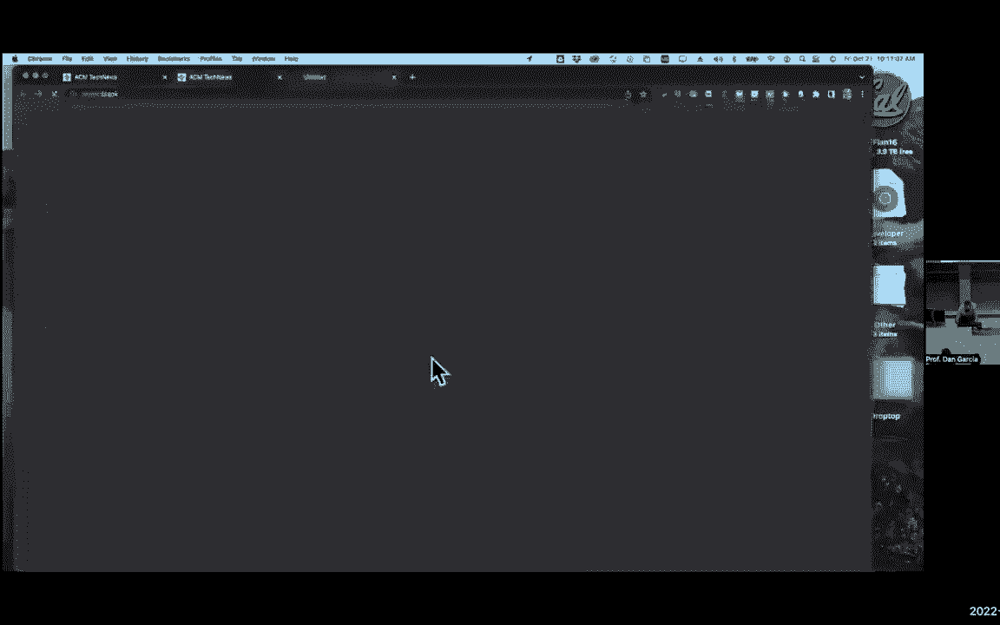

# 🧠 课程 P33：第 25 讲 - 直接映射缓存 II

在本节课中，我们将深入学习直接映射缓存的工作原理。我们将通过分析内存地址的构成、缓存的内部结构以及数据查找的流程，来理解这种最简单的缓存设计是如何加速数据访问的。

***

## 概述：缓存的基本概念

上一节我们介绍了缓存和内存层次结构的基本思想。本节中，我们来看看直接映射缓存的具体实现。直接映射缓存是最简单的缓存类型，其核心特点是：**每一个内存地址在缓存中都有且只有一个确定的位置可以存放**。这就像每个学生（内存地址）在教室里都有一个固定的座位（缓存行），我们只需要根据学号就能立刻找到他。

***

## 内存与缓存的映射关系

为了理解映射，我们首先需要将内存想象成一个线性的字节数组。当我们有一个缓存时，关键问题是如何知道一个内存地址的数据应该放在缓存的哪个位置。

### 一个简单的例子：4字节直接映射缓存

假设我们有一个非常小的缓存：总大小为4字节，每个块（缓存行）大小为1字节。这意味着缓存有4行，每行宽1字节。

*   **如何映射？** 内存地址会根据其值“模4”的结果（即除以4后的余数）被分配到缓存中对应的行。例如：
    *   地址0, 4, 8...（余数为0）映射到缓存第0行（蓝色）。
    *   地址1, 5, 9...（余数为1）映射到缓存第1行（红色）。
    *   以此类推。

*   **如何计算？** 在二进制中，计算“模4”等价于查看地址的**最低两位**。这两位直接告诉我们该地址属于哪一行。
    *   `00` -> 第0行
    *   `01` -> 第1行
    *   `10` -> 第2行
    *   `11` -> 第3行

### 增加块大小：8字节直接映射缓存

现在，让我们将块大小增加到2字节。缓存总大小仍为8字节，因此现在有 `8字节 / 2字节每块 = 4` 个块（行）。

*   **变化是什么？** 现在，每个缓存行能存放连续的两个内存地址（一个块）。例如，地址0和1的数据会存放在同一个缓存块（第0行）中。
*   **如何映射？** 此时，最低位（第0位）用于指示块内的哪个字节（偏移量）。接下来的两位（第1-2位）用于选择缓存行（索引）。地址除以4（看第1-2位）的结果决定了行号。
    *   地址0（`...00`）和地址1（`...01`）的最低两位分别是 `00` 和 `01`。它们的第1-2位都是 `0`，因此都映射到第0行。最低位 `0` 表示块内右字节，`1` 表示块内左字节。

***

## 地址分解：标签、索引、偏移量

通过上面的例子，我们引出了直接映射缓存中地址分解的三个核心字段。一个内存地址（例如32位）被划分为以下部分：

1.  **偏移量**：用于定位数据在**一个缓存块内部**的具体位置。偏移量位数由**块大小**决定。
    *   **公式**：`偏移量位数 = log₂(块大小字节数)`
    *   例如，块大小为8字节，则需要 `log₂(8) = 3` 位偏移量来寻址块内的8个字节。

2.  **索引**：用于选择**缓存中的哪一行**。索引位数由**缓存中的总块数**决定。
    *   **公式**：`索引位数 = log₂(缓存总字节数 / 块大小字节数)`
    *   例如，一个1KB（1024字节）的缓存，块大小为32字节，则有 `1024/32=32` 个块，需要 `log₂(32)=5` 位索引。

3.  **标签**：地址中剩余的最高位部分。当数据被加载到缓存中时，其地址的标签部分会存储在该缓存行的标签位中。用于在索引找到行后，**确认该行中的数据是否确实是我们想要的那个内存地址的数据**。

**记忆口诀**：可以记住 **TIO**（Tag-Index-Offset）的顺序，或者联想“Tío Dan”（西班牙语的“丹叔叔”）来帮助记忆：**T**ag 在左，**I**ndex 在中，**O**ffset 在右。

***

## 缓存查找流程

以下是处理器读取数据时，缓存控制器的工作步骤：

1.  **解析地址**：根据已知的缓存配置（总大小、块大小），将请求的内存地址分解为 **偏移量(Offset)**、**索引(Index)** 和 **标签(Tag)**。
2.  **索引行**：使用 **索引(Index)** 位找到缓存中对应的那一行。
3.  **读取数据**：根据 **偏移量(Offset)** 位，从该行的数据块中读取相应的字节。
4.  **标签比对**：这是最关键的一步。将地址中的 **标签(Tag)** 位与缓存行中存储的标签进行比较。
    *   如果**标签匹配** 且该行的有效位为1 -> **缓存命中**。数据直接从缓存返回给处理器，速度极快。
    *   如果**标签不匹配** 或有效位为0 -> **缓存缺失**。控制器必须访问更慢的主内存，读取整个数据块（包含目标地址的数据），将其载入当前索引指向的缓存行，并更新标签。然后，再将请求的数据返回给处理器。

这个过程类似于在机场行李转盘认领行李：你先根据航班号（索引）找到大概的转盘区域，然后通过核对行李牌上的详细信息（标签）来确认是不是自己的行李（数据）。

***

## 核心概念与示例

### 有效位

缓存刚启动或清空时，其中的标签和数据都是无意义的“垃圾值”。为了避免标签偶然匹配导致读取错误数据，每个缓存行都有一个 **有效位**。
*   **有效位 = 1**：表示该行中的数据是有效的，可以信任其标签。
*   **有效位 = 0**：表示该行是空的或无效的，无论标签是什么，都视为缺失。
初始化缓存时，所有有效位都被置为0。

### 计算示例

假设一个直接映射缓存配置如下：
*   总容量：8 字节
*   块大小：2 字节
*   内存地址：32 位

我们来计算各字段的位数：
1.  **偏移量(Offset)**：块大小为2字节，需要1位 (`log₂(2)=1`) 来区分块内的两个字节。
2.  **索引(Index)**：缓存总共有 `8字节 / 2字节每块 = 4` 个块。需要2位 (`log₂(4)=2`) 来索引这4行。
3.  **标签(Tag)**：地址总位数为32位。减去偏移量1位和索引2位，剩下 `32 - 1 - 2 = 29` 位作为标签。

因此，一个32位地址 `0x1022` 在此缓存中会被这样解读（假设按位展开后）：
*   最低1位 (`0`)：偏移量 -> 块内右字节。
*   接下来2位 (`01`)：索引 -> 第1行（从0开始计数）。
*   高29位：标签 -> 与缓存第1行中存储的标签进行比较。

***

## 性能术语

在评估缓存时，我们使用以下术语：
*   **命中率**：缓存访问中命中的比例。`命中率 = 命中次数 / 总访问次数`
*   **缺失率**：缓存访问中缺失的比例。`缺失率 = 1 - 命中率`
*   **命中时间**：从缓存中成功读取数据所需的时间（包括地址解码、标签比较和数据读取）。
*   **缺失惩罚**：发生缺失时，从主内存获取数据并加载到缓存所额外花费的时间。

一个“热”的缓存意味着它已经包含了工作集所需的大部分数据，因此命中率高，性能好。反之，“冷”的缓存则缺失率高。

***

## 总结

本节课我们一起学习了直接映射缓存的核心机制。我们了解到：
1.  直接映射缓存通过将内存地址划分为 **标签(Tag)、索引(Index)、偏移量(Offset)** 三个部分来定位数据。
2.  **索引**直接确定缓存中的唯一行，**偏移量**确定块内字节，**标签**用于验证数据身份。
3.  缓存查找的核心是 **标签比对**，配合 **有效位** 确保数据正确性。
4.  我们掌握了根据缓存容量和块大小计算各字段位数的方法。

直接映射缓存因其简单和快速而成为基础设计。理解它是学习更复杂的组相联或全相联缓存的重要基石。下节课，我们将继续探索缓存的行为和更高级的主题。