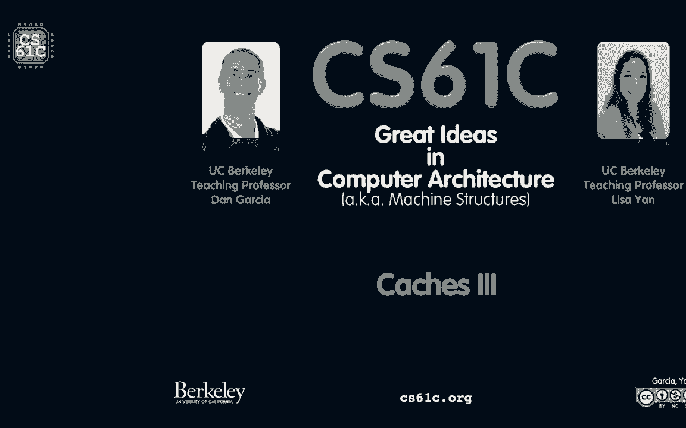
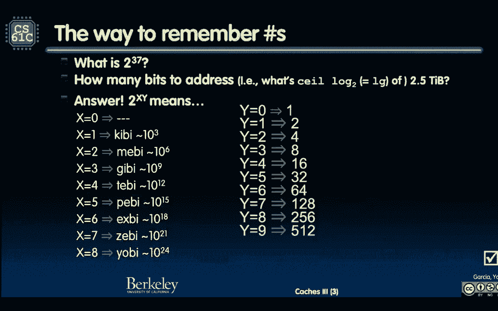
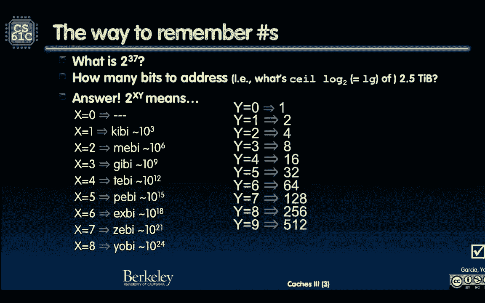
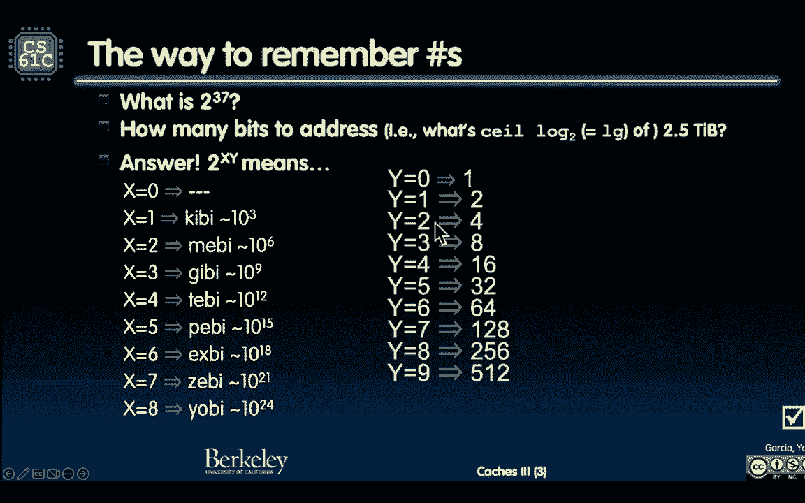

# P34：Lecture 26： Caches - MultiLevel - 这样好__ - BV1s7421T7XR

谢谢你，谢谢你，我的管理规则，禁止企业出口先进芯片，需要训练或运行中国最强大的人工智能算法，有一句名言，美国，同款中国AI技术是未来，我们和我们的盟友要去那里，你不能来，所以这不是战争。

但这不是一种友好的，让我们分享最佳实践，嘿，去年你发现了什么，让我们分享它不是那个，不会发生的，他们担心未来，所以这是对此的反应，只是试图实施贸易禁运，但基本上阻止了思想的自由交流，从字面上看。

材料的自由交换材料不仅仅是，嗯，不仅仅是今天的芯片，它是这里性能最高的芯片，你现在可以买一些完全不在桌子上的东西，但你连制造设备都没有，明天的筹码，所以这真的是一个有趣的谈话。

请务必观看一个自然的国家空间，请注意美中关系是怎样的，因为有点冷，现在有点冷，完全不是冷战，但它肯定不是一个温暖的，让我们拥抱一下那些，哦对了，呃，祝贺新首相，我相信英国，他们是那里的首相。

他们今早刚刚宣布，所以这也很令人兴奋，所以有一个全国性的新闻，并不是真正的建筑，但又一次，恭喜所有现在掌权的人，好啦，让我们在10点10分的时候提前20秒开始吧，女士们先生们，欢迎来到收银员，第三部分。

六十一，Z。

我们在这里，我们继续，我想确定你看过这张幻灯片。

我想这在之前的课程中被略过了，如果你玩缓存的时候，流畅地思考。

我说，哎呦，这是一个16千字节的缓存，你应该知道有多少位，即16 Kib字节，所以让我告诉你如何快速地做到这一点，这是一张XY的2号桌，我将用我的指针指向xy，x在这个表中，所以这是一件奇怪的事情。

X在这个表中，如果x为零，这没什么，如果x为1，这是一个Kibi空间，如果x是二，在梅空间里，希望记住这个gibi，美帝佩，什么事？佩XB齐·亚比，记住这句话，那是个好主意，嗯，你有任何类型的。

我想卡罗琳给你展示了一些你可以用的助记符，但你应该基本上记住这一个，这是伟大的，我想这是另一个需要记住的，因为这是两个数字中的一个，指数的力量，所以如果我说2到3 7，二三七，你应该先说，你去七号。

你总是先找对号码，因为七是一种系数，从某种意义上说，所以二二三七，我七岁，好的七一二八，我要说一二八，我说一二八，我的大脑在利用这段时间查什么，三就是这么一二八，当我慢慢地说，一二八。

让我们来看看什么什么，给我一个0到0之间的数字，我能做什么，顺便说一句，亚比之后是，呃，有些人我想加州大学在圣克鲁斯，认为亚比之后应该是海拉，变得很有趣，实际上，如果你谷歌一下这个，说一千个雅比是多少。

你得到了一个，上面写着海拉一号，海拉是个很有趣的东西，所以地狱是地狱是9，好啦，所以让我们开始吧，给我一个从1到99的数字开始，任何人，给我一个1到99的数字，有人有人喊一号，九十九去九十八。

九十八是二百五十六，海拉，那是九十年代，地狱，好啦，我再给我一个号码，快点，八十三，八十三就是八，我做对了吗，啊呀呀，Daryabby，有时我得到，我把Z和Y弄乱了，好啦，所以目标是现在就这么做。

如果我翻转它，如果我现在翻转它，如果我说有多少位解决2。5个胫骨咬伤，所以我的内存空间是2。5 Tib字节，你想要一个字节，每个字节的地址内存，我可以加载字节并存储字节，你用5个字节。

打那口井你需要多少钻头？两点五，比那更大的力量是什么，四是二，所以这是两个是一个，塔贝是四十岁，所以我要说，四个二位，四个二位换两个，五个字节，这听起来对吗？让我们一起做吧，所以2。5个标签咬。

所以Tabe将在40年代，那就是四十多了，两点五，二的下一次幂，大于，这是四个中的这个，所以是两个。

所以我数了4 2是对的，四个二位访问，2。5 tabb字节，好啦，所以这就是处理这个的方法，你通常从Y开始，这给了你系数，然后乘数，从某种意义上说，虎斑猫，雅比人，吉卜赛人，好啦。

很高兴能和你的朋友一起练习，在长途汽车旅行中做这件事是很好的，给你的朋友一些数字，或者逆转，你说的地方，要寻址多少位，你扔出一些大东西，哦你知道的，一百个，我们有一百个吉比井，一百是七。

因为一个28的原木底座，一口井中的两口，对数基数2，是原木底座的天花板，两百所以两百到六点左右，所以四舍五入的天花板是一个7，所以我要说，我说了什么，100吉比我说给我100吉比对吗，一百个吉比。

所以让我们吉比是，什么是gibi，也许是两个，给我三百三十一是七百三十七，好啦，原来你是这么做的，我要你练习这个，习惯这个，因为当我们开始玩独联体的时候，我说，嗯，现金，这是现金数额，这是你的现金。

突然间变得很快，好啦，这是我的比特数，好吧，用16个字节的现金，非常快的16个Kib字节，你应该去，哎呦，一共是1414位，好东西好的，记住这个，好啦，直接映射示例，我们在讨论直接地图缓存。

最简单的缓存，我们有，让我们做第一个直接地图示例，一定会很好玩的，我们一起做，希望我会停下来回答任何人的任何问题，当我们经历这16年，哦，我的天哪，16 Kib字节，多少位，十四，我们刚做了，好啦。

16GB现金，总共要访问14位，四个街区，四个单词块，我们的字在那里是四个字节，四个字节，那是四个字，每个字是四个字节，那是16个字节块，要索引多少位，什么方块，我在那个块中有什么字节。

16字节日志基数2 a 16是，你得动作快点，所以让我们回去，让我们在这里记住这个，它在哪里，我的十六岁呢？见，在座各位都记得，所以如果我十六岁，哎呦，有四个比特，我需要4位的偏移量来告诉我。

在那个街区的哪一口，好啦，这是你需要快速做的事情，所以你能算出，区域的宽度，我们只是做了这个区域，总面积，总面积是多少位，16 Kib字节，那是14位，那是我的领域，这是我的整体尺寸。

我的专栏宽度是多少，它有多宽，我们刚做了，在我的宽度中总共有16个字节，如果我画一幅画，但那，我不知道，如果我的人是这样，就继续看上面的东西，我就在这里画些画，我去拿支笔，让我想想是的，哎呦。

太感谢你了，是啊，是啊，是啊，是啊，他们以前有很大的粉笔，他们现在只有一支很小的粉笔，一半的时间你在里面拿起小巧克力，好啦，所以我做了一个长方形，我也不知道，这个长方形是什么，我要放大到我。

如果可以的话，但我知道这在我脑海中是十四位，我是十四比特，这是二对十四，好啦，所以我说了什么，四个单词块，所以我甚至可以做到，这是我的，这是我的四个字，是一二三四，每个字是四个字节。

这意味着宽度是16字节，是呀，16字节是多少位，二对四，二到十四，到四，这意味着有多少行，有多少块，我有，我记得这些，这是如何工作的，二到十四，除以二，四个减去指数，所以到十四个，十四减去四到十。

二的十分之一是多少，奇比，我有一个Kibi街区，这是你快速做这件事的方法，我们以前做过，我想上次我想我做了这样的问题，这是同样的数字，我们可以把灯关掉，我们无法感谢你，所以现在我们有了那个形状。

顺便说一句，我有，记得我一直告诉你，让我们绘制内存始终与缓存一样宽，这就像一次我不这样做，只是想让你知道，如果我列出所有不同的单词一直在加载浮动，花车是一个世界性的，所以我要给你看，内存中浮动的所有值。

这就是刚才我在画一个全世界的记忆，当我给你看一张光盘时是不同的，浮动不同，32位宽值，现在只需保持三个二但宽的值，好啦，所以现在我们说的是，哦，在我加载字节和存储字节之前，现在我说的是文字。

ABCD或四种不同的浮动，他们看这些地址，注意地址相差4个，然后我现在下去，一会儿在记忆中是，再过一会儿，很久以后，从81年开始，八八零一零，所有的十六进制都是i j k和l so，我要读四个地址。

十四一三四八十四，会发生什么，我们要经历的是，我有所谓的线索，顺便说一句，这叫做跟踪，我有这四个记忆请求的线索，到目前为止，我们只做阅读，只是要继续戳它，我们不是想在这里做权利，那很复杂。

只是为了看看发生了什么，这是我的四个地址，十四一三四八十四，我记得的第一件事就是丹叔叔丹叔叔，我和你把每个内存地址分成三个区域，标记t索引，我抵消了，那是你做的第一件事，都是机械的没什么，这些都不是。

我只是告诉你一个算法，一个非常简单的算法把它分成这些字段，标记索引和字节偏移量，当我们做这些的时候，你会注意到，这就是四个值，十四一三四八十四，注意到一些有趣的事情，首先呢，我看到了你可以在这里看到。

但是标签是一样的，让我们看看我的光标会是一样的，标签是一样的，是零，啊，不同标签，所以那会很有趣，我们来玩标签差异，在那里，这是我的索引，我的索引告诉我什么，谁能记得我的索引告诉我什么，Jania。

你有个主意，你现在举起手来，索引是我在哪一行，索引是我所在的行，偏移量是哪列，好啦，所以这就是我们做的对，顺便说一句，这里的总比特数，你能想出这是什么吗，这里有四个比特，猜猜我的宽度是多少。

这十块钱算我的身高，所以所有这些都使得试图与，我刚才在黑板上给你看的，好啦，试着让我们做吧，所以这是我的标签，它有16字节宽，或者当我在这里画的时候，这是我的缓存，它有四个字宽，这些是字节偏移量。

所以你看到的所有有字节的东西，偏移量为零，这是一个零字节，一二三，当我提到一个词时，我总是用最低的字节引用它，所以如果我想说到这个词，我要说零，这就是，我把光标拿回来，这就是如果我说零，这就是整个词。

我说四个，就是这个词，但这就像字节四乘六，五乘六乘七，但说到这个词，我会说四或零，顺便说一句，你还记得这个，每次你的词对齐，每次你的词对齐，你相信最低的文本数字将是零，四八或，零四八还是C好的。

所以一切都会是0-4-8-C好了开始吧，我们记得我们加了，因为我们没有哨兵标记，我们上次说过，已经是周末了，你忘了这个，没有哨兵，没有特别的标签，位模式，那是禁区，全部有效，所有可用的可能标记值，嗯。

那我怎么知道什么时候刷新这个，当我有垃圾的时候，因为一开始一切都是垃圾，作为垃圾的内存，但我将用这个来获得真实的数据，我不能把垃圾放在标签里，碰巧垃圾和我的标签匹配，哦，它匹配，我查到了。

我读了一些垃圾，我不想那样做，所以我加了一点有效的东西来告诉我，我能相信现金还是坚果，当它是一个，我可以信任它，所以是零，我不相信它，所以让我们通过，我做的第一件事就是重置，我刷新了我的缓存。

我的缓存现在是什么温度，天寒地冻，天寒地冻对吧，里面什么都没有，我不能用它来获得好的打击，一开始我什么都没吃，好的十四，我第一次读到，我要读十四，你要做的第一件事就是，做你的零碎。

我基本上画了一个小盒子，我画了一个有三个隔间的盒子，左索引上的标记上的标记和标记，在右偏移量上，我基本上是这样做的，这就是我们在上面所做的，把顶部降下来，我在每个问题上都是这么做的，现在这是算法。

我们要为很多案子做这件事，你要做的第一件事是看，你看中间那个，有点复杂，但是你看中间的那一行，我是在处理几楼的问题吗，在那栋大公寓楼里，我要去，街上有个聚会，公寓里有个派对，索引在哪里。

中间的告诉你我去哪排，所以说，是第一排，是一个，所以我去第一排，好吧好吧，在第二排，但从零开始，显然是对的，索引一，然后下一件事是什么，我检查，你真的喜欢想他们吗，我告诉你，你会怎么做。

你下一步会做什么，让我们一起想想，你下一步会做什么，检查标签听起来不错，检查偏移量听起来不错，还有什么比这更好的呢，检查有效位是否为施工中的整层楼，还是要开个派对，在那里，它适合居住，检查有效位。

是零井，我们要错过了，那将是一个失误，所以我从内存中加载数据，去萨克拉门托，一个半小时后见，我在萨克拉门托，我回来了，我把它装进去，随便啦，那四个字是，因为你看，我一次输入四个字，我在利用什么。

当我去学习一些邻近的值以及，什么样的地方，记住这个空间的单词，空间，空间区域设置，我在利用马上就去的机会，如果你去冰箱拿饮料，给我也买点东西，当你已经在记忆中，你在那里的时候去拿点东西，这才是重点。

所以抓取四个单词，把它们塞进这些单词里，可以编码任何东西，只是四个字，把它们塞到空间位置，我在利用，所以现在，接下来我做的是，我检查我的标签，我的标签看起来怎么样嘿，我刚刚装的比较吻合。

我从记忆中的那个区域加载的，它必须与，这是我第一次填写，标签为零，我的标签是零，顺便说一句，我不是，我其实不是在检查，我正在写，对不起，我是我是像，我其实是在写标签，我加载数据，然后我写标签。

我不检查标签，我在写标签，我画了一个零，这就是我现在得到的，我知道，因为我知道我从哪里得到的记忆，我知道我从记忆的标签部分得到了它，请记住，标记是缓存大小的计数，缓存大小，第一个缓存是零标记。

内存中的下一个完整缓存是，下一个完整的缓存是，这两种方法基本上是通过计算缓存大小来移动和计算内存，16 Kib字节，有多少这样的，啊，有多少不同的标签，世界上有多少不同的缓存，嗯，有十四比特的现金。

标签还剩多少，共计，还剩下什么，我得了18分，那么有多少，我们会有多少不同的标签，让我们做吧，是我的十八岁，让我们做得很快，十八二百五十，六千，基贝，好啦，这就是你想流利地说的事情，我看到一只手。

你有吗，是啊，是啊，请在，去吧，问得好，问题是它能走多远，我能再去拿点吗，答案是当我们谈论现金时，我是唯一，抢一个街区，那是你唯一的货币，但事情是这样的，你是缓存设计师，你可以让缓存变得又胖又瘦。

你知道胖和矮，或者你可以把它弄得又瘦又高，所以你有一个，如果我这么说，你只有14个零件可以玩，我有14个零件可以玩，你想做成十高四宽的吗？或者十一和三，你看我在做什么，或者十二和二看看我如何改变方面。

把这十四块从十四块中取出来，你给身高多少，你给多少宽度，他们只是把它们加起来，我只是加上出口，像四和十，我只是把它们加起来，所以你可以把它变成十一个，十二哦，一个非常热的，真的十二岁，只有两个，现在呢。

你只有一个字宽，你明白我的意思了，所以你可以控制，作为现金设计师，它的长宽比，所以这就是你得到好的地方，让我看看表演，我的意思是，看看使用这种电脑的人，周围有哪些应用，哎呦，这是一个特别的，只有游戏。

游戏在哪里做，这种方式，就他们如何访问内存而言，因此，我将自定义我的缓存，这样的话，你显然想让它尽可能笼统，但是您可以为您正在做的特定硬件进行定制，好的，好的，所以我在写我的标签嘣，这是我的零分。

我希望我能覆盖所有的幻灯片，现在我已经准备好了，现在我去抓住我想要的那个词，偏移量告诉我我想要哪个词，现在这个偏移量有一个4，我为什么不，为什么我只跳了一个，不应该，我已经跳过了四个，得到了D什么的。

超过了那个，我很困惑，帮我一下，帮我一下，是四对，那是一个零，这是一个四，为什么我只翻了一个，因为它是四个字节，然后是按字节计数，所以是四个字节，哪个是下一个词，那就是，好啦，只是为了确保我假装困惑。

我只是想确定你也有同样的困惑，我们澄清了，明白了吗，所以我爱我的B回话，B返回词，B，再快一点不行，其实更慢，因为我得去萨克拉门托，我不得不用我的现金做一些维护和簿记，其实更慢。

所以我实际上在那个特定的阅读上付了罚款，但也许我会也许我会受益，哪里是我的，我的小指呢？哦，也许我会受益，哪里是我的奥斯汀权力，挑剔，没人记得好吧，下一个一个C相同的算法，一个c除以我的三个字段。

我得到0 1和1 1 0 0，那是什么？那是我的C，最后一个文本值是我的偏移量，好啦，我再做的第一件事，算法，你看到的这个算法越多，你还记得，我做的第一件事就是去中间，检查我的索引。

派对在几楼派对在一楼，我喜欢一个人的派对，我只会穿，我昨天刚开了一个派对，那真的很有趣，接下来我要检查有效位，有一个，我们刚调到1，顺便说一下，我们写了一个，但当我填满它的时候，我设置了标签。

我还设置了有效位，正确，我没有提醒你，但我必须设置有效的，当然我们会把它设置成一个，所以这很好，标签标签匹配情况如何，标签匹配，我得到了我的D嘿，你猜我在萨克拉门托的时候，把abc和d的空间位置。

上次我想成为的人，这次我想，因为当你使用数组时就会发生这种情况，很有可能你会有一个邻居，你知道你在以某种数组从这里复制到这里，很酷吧，你把东西搬来搬去，你可能在逆转什么，我不知道你在做什么。

但不管重点是面部定位，很可能你会让你的邻居进入下一个嘣我的邻居，这是一个打击，人们不必去萨克拉门托，不不不不不，所有的交通，所有开车去萨克拉门托的人，今天不是我，今天不是我，谁对此感到兴奋，这是好东西。

好啦，对此有什么问题吗，所以那是一个成功，因为d是b的邻居，太棒了干得好，哦，我们开始了，三四，我们该怎么办，地址正合适，这是32位地址，三十四，那里有八个十六进制数字34是实际地址，嗯，三个字段索引。

三个，今天在不同楼层的各方，所以让我们去那一层楼，现在这个和我们第一次做的差不多，这是无效的，检查我的有效无效，嗯无效，所以我得去萨克拉门托，抓住这四个字，把它们塞在那里是无效的，我有东西，更改有效位。

更新标记，查看偏移量并返回您想要的值，现在偏移量是4，我的F和以前一样，和第一个很相似，好吧，问题是这是一样的，那是我们看到的第一件事，是啊，是啊，阿纳斯塔西娅，您从哪里获得值，我要去回忆。

我要去萨克拉门托，在右边的第一张幻灯片中，有一张记忆的照片，我要去萨克拉门托，不管那里有什么，我给你看，那些E F G和H是记忆中的东西，第一个像四个滑回来，我展示了一张记忆的照片，就像，就是这四个字。

只是加载这四个字，E f g和h在那个地方，是啊，是啊，不用担心，是呀，好啦，那么接下来呢，哦，我们开始了，八十四，接下来会很有趣，八十四使三个不同的领域，标签索引和偏移量，我的指数是多少，一个哦哦哦。

我喜欢一个，我刚刚在一个，两天前我参加了一个派对，前一天我不得不去，我喜欢地板的，让我们做吧，它是有效的，因为我会说我在用它工作，这里很好，我们去检查标签，我我是如此接近标签，没有匹配。

你不检查那个标签，你忽略了那个标签，你去偏移四，你要回到B，那不是住在地址的人，是什么，八百八十四什么的，不管那是什么，我不在那里，你得找到记忆的正确位置，缓存不能给你不同的值，只是让你更快。

希望这就是现金的全部，它让你更快，不应该改变你最终对你的程序所做的事情，如果我把每台电脑都有缓存，把它移除或放回原处，但这只是没有不同的价值观，相同的计算--只是更快或更慢。

缓存所做的只是让事情变得更快，体系结构是关于性能的，很多架构都是关于性能的，所以是雾，失手了，所以我用记忆中的东西替换了块，所以我得去萨克拉门托，对不起，看到大约一个半小时的轰隆声，去萨克拉门托。

坐那一排，把它塞进去，现在更新标签，标签是这样的，那个地址的标签，不是原来的标签，现在在未来，如果我有八十四或接近八十四的人，我会很棒的，好啦，返回j，现在开始，你自己做吧，我要保持安静。

现在这样怎么样，嗯，我只是随波逐流，啦啦啦不，你现在要做一些工作吗？读三十，顺便说一句，我甚至把它分成TIO给你，我有多好，然后读一个C去，会发生什么，顺便说一句，你可以回头看看会发生什么。

我会给你答案，不过，请便，花一分钟，让我们做吧，大家一起弹，你得读书，价值三十，你是做什么的，缓存中发生了什么，你是做什么的，别只把价值还给我，机制是什么，发生什么事了？是错过了吗，是热门吗。

你需要改变你的标签，你在挑一些有用的东西，好啦，让我们做吧，当你在努力的时候，你应该说的三件事，用你的方言来说，处理缓存应该是，这是价值，这是一个价值或错过与替换，这意味着它是错误的，因为标签不匹配。

我得做一个替换，所以只是错过了，因为街区那一排很冷，还是被替换错过了，在那里我从记忆的不同部分阅读，现在有点烦人，我得把它扔掉，多余的手，有人想要额外的施舍吗，你亲身经历过，一些额外的手。

这里有一些额外的，是的，是的，什么是错过和错过替换，替换的失误是当那里有数据的时候，我得把它换掉，在右边，我可能得做一些更花哨的事情来回信，或者做这样的事，一片空白，那只是意味着它是垃圾发生器。

所以到目前为止，这其中的区别，我们还没谈权利，但是在这个特殊的练习中，错过和错过替换之间的区别但很大的问题是，小姐只是说那是垃圾，我把它装满了，替换先生的意思是那里有什么东西，但它不匹配的东西。

我在检查标签吗，我没有得到答案，但我在检查一些东西，那排在右排，这就是替补先生的意思，到目前为止，一切都很好，好啦，我们准备好了，我看到人们大多抬起头来，不再写作了，我们一起来好吗，三十是热门。

为什么三十是一个热门，让我们试试，我们到这里来，三十是热门第三名，我们做的第一件事是什么，我们该怎么办，我的行右的第一个索引，什么是行，我做的下一件事是什么，我做的下一件事是有效的，检查标签，从零到零。

嘿打得漂亮，我做的最后一件事是什么，去我的偏移量，那是零，那么哪一个呢，我拿起E，这么好，那很成功，我拿到了E，顺便说一句，一个C怎么样，我们之前看到的一个C，如果你看到，记住。

我们以前在一次阅读中有一个1 C，那么我做的第一件事是什么，让我们一起做吧，索引，我在哪一排，聚会在几楼？那是一个，好啦，我做的下一件事是什么，这是有效的，接下来我要做的是什么检查标签零，让我们咀嚼。

我错过了替换的什么，我把那里的东西填了进去，我想它会是，我想那是abcd，我忘了那是什么，我想是一张CD，然后我做的最后一件事是什么，不是这个，那是零，那是零的偏移量，四的偏移量，八的偏移量，十二抵销。

那是十二分，所以我想我还一个D的样子，我做对了，我没有作弊，第一个是热门，E，下一个是有替代者的失误，是一个D，这节课你们要学的最重要的东西，不是那个愚蠢的算法，你先检查哪一个，最重要的是这些是阅读。

值必须等于内存值，它们是否被缓存，记住缓存只是让它更快，我们一起说，一旦你这么做了，呃，现金只是让它更快，那真的真的很重要，缓存从未改变，价值，只是让它更，只要优化一下，我们所做的就是优化，好啦。

当然好的，呃，哎呦，哎呦，哦男孩，在这里，我们去看看，我们在一个有软垫的房间里，幼儿园现在我们在一年级，我们现在要做的，就像操场上的硬边，你可以割破膝盖，这将是真实的，让我们现在现实点，好啦。

写入块大小和未命中，多字多字块直接地图缓存，它实际上是这样工作的，我们做得还不对，但我要给你看这张照片，所以这是我内存地址的图片，这是我的32位记忆地址，好看着，会发生什么，指数先入右后入。

这是我的十块钱，我们刚刚看到那排，这是我的排位，我的标签出来了，我的百分之十八的十八位，标签，我们谈到了二十五万六千基比，一千个不同的Kibi标签，是的，是的，它被检查是否与我要求的标签相等。

当它出来的时候，这是钥匙，有一个和哪个说它是一个命中，当且仅当标记匹配，还有什么是有效的嘣，看到那酷了吗，这就是那里，有我的命中与否，啊，有我的命中与否。

如果你有一个小灯或一些东西会在你的电脑上闪烁得很快，你可以看到光，哦击中耶，现在这种事，会发生什么，这四个词组成了一个多路复用器，什么规定了标记，我们回去吧，对了两个位，四件事，由标记指定的两位。

这里有什么规定，我们到这边来，它是块偏移量，这两个是字节偏移量，因为它换了一个，但我说的是所有装载浮子，我们现在讨论的是阅读花车，所以我只读花车，我不在乎下面的两个字节，因为它们总是0，零四八c。

你要求的每一个字都更好，是字对齐零四八C，所以这些都是零，别在意这里，另外两个部分是我想要的部分，我在这些街区中的哪一个，我想让这些词中的哪一个出现在街区里，那是上面的二乘二位，这两位指定了这些渣滓。

泥巴上写着，这些家伙中谁赢了，血就出来了，我的数据不是很好，对于一个16字节的字节来说，这有点酷，四个字，16字节块，同样的事情，我们画一幅画，这就是它的工作原理，真的有点酷。

我们在利用什么样的地方开始吧，哎呦，有一个小问题，我们在什么地方利用这个空间，手举高自豪，他的颞叶是谁？高高在上，两者都看到了，我在玩它，谁是一个谁是另一个不，这两个缓存，每个缓存都是时间局部性的。

当你有一个块大小，那是一个以上的元素，那是空间局部性，很容易回答的问题，每个缓存都是时态的，因为你还记得，每个收藏夹列表，即使你的手机，收藏夹，不是最喜欢的，最近，最近的每一个电话。

如果你只有其中一个是临时帐户，如果我最后打电话给某人，这是我最近的号码，即使我有他们中的一个空间说走，你什么时候去萨克拉门托，找几个邻居，你要去冰箱拿不止一样东西，所以两者都在这里，不是非此即彼。

一个问题，咬掉一套有什么意义，如果你总是加载一整块，字节偏移量，如果你抢了加载字节或存储字节，就是那样，您想要哪个字节，但对于这个，我只加载了四个字，但在某些时候。

有时您必须管理这些表单中实际使用的字节，我只是在展示如何阅读加载单词，在这一点上，我们只加载，我们没有储存任何东西，好吧，我们开始吧，现在的问题是，我们变得更复杂了，我们在正确的油井上做什么。

我们要怎么写，我只是在推，记得啊，从，谢谢你，谢谢你在网上找到，供我或商店加载，我一直做商店到现在，我将讨论如何将一些数据存储到内存中，我去藏两个，也许我该怎么办，I，有趣的是，你不记得这个了吗。

我认为缓存是我检查的第一件事，我把它放到缓存区然后穿过缓存区，还要确保内存已更新，所以直接通过意味着我两个都通过，我通过缓存进入内存，因为缓存更接近内存如果你记得图片，就像中央处理器，然后缓存和内存。

所以你通过它到较低的水平，所以直接通过意味着他们保持一致，他们总是始终如一，你把它推过去，但这也意味着，我得去回忆一下，我要去萨克拉门托，右后卫，说你知道吗，我只更新到现金。

你做这个记忆的那一刻是不一样的，也许我的意思是它可能有同样的价值，它已经在那里了，但可能现在内存与缓存不同步，现在我们有些问题，我们怎么知道它不同步，我们得记住它是不同步还是不同步，因此。

一个肮脏的部分是记忆，脏缓存是最近的一个，我刚给缓存写了信，如果马上回来，意思是现金是最近的，记忆很脏，像你知道的那样脏不干净，那不是最新的版本，这是旧版本，也许肮脏是正确的词，也许是更老的什么的。

但肮脏意味着不一致，当它们不一致时，发生的好事，它们可能会在很长一段时间内不一致，这就是右后卫的美妙之处，我不用去参加圣礼，我想尽量少去参加圣礼，所以我基本上我喜欢保持记忆肮脏。

我什么时候才能最终更新记忆，我在接球处来来回回，这就是我，这是我的，这是手势，就像你们中的那些做锅时间的人，这是手势，往返于缓存，没有结束到第一次，我圣礼，在我的类比之前就是这样，现在是这边，我不知道。

我不会去回忆，我什么时候得去回忆，当我运行完程序，在节目中做得很好，我只是退出并返回给用户，但我知道你要去哪里，但不知何故我受够了，当记住这是一个没有记忆不知道的值，我什么时候才能最终在这里记住它。

我们去给我，当那个街区被踢出去，整块置换，那是必须发生的时候，当我把它踢出去的时候，唯一有这个价值的人是这里的本地副本，那是我必须做的时候，所以我想阻止替换，我必须马上回去，问得好问得好，答得好。

顺便说一句，有一件事，如果你有一些输入和输出，像个键盘，或者进入他们的操作系统会刷新缓存，这意味着它会把它推到记忆中，因为I O可能会弄乱我的现金，这就是最后一行，说OS之前对猫脸红了。

我的意思是如果我有，啊，有人想接收密钥命令，我最好确保记忆是一致的，因为那个键命令可能需要内存，一种叫做记忆映射的东西，I，O，实际上它可能直接与内存连接，我们来谈谈表演技巧。

你能直接看到两者之间的表演吗，就像直接穿过去可能会更好，当右后卫可能更好的时候，你能想象一下，当这些中的每一个，我说二加一总是赢不了的原因，在某些情况下，穿过去比较好，一个马上就回来了。

可能也是因为如何构建硬件，也许添加一点肮脏的东西会更复杂，那就更复杂了，所以这有点难做，不仅仅是让它们不一致，但你可以想象很多阅读和写作，只是在追赶，救我，去萨克拉门托的那些旅行。

所以你可以经常看到想象一个案例，只是普通的案例，右后卫会更好，现在我们还没有谈到宽高比，你是缓存设计师，就像你有所有这些旋钮，你可以把所有这些很酷的旋钮，当你玩你的缓存时，一个旋钮是你的现金有多大。

这是显而易见的，你的现金有多大，把声音调大点，另一个是宽高比是多少，给定缓存的位数，又高又瘦和又胖又矮，我能成功吗，我的宽高比是多少，吴旭，你玩那个吗，这就是所谓的块大小，你为什么要把你的块大小。

因为行数显然只是，旧缓存的位，减去要匹配的行的宽度，宽度就是高度，所以多少行是一个因变量，那不是自变量，从这一点可以看出，如果我说，哎呦，有十四比特，如果我把这排宽4位，嗯，这里是十号，我把它做成十宽。

四高，你知道所有这些事情都是非常清楚地相互跟随的，那么更大的块大小有什么好处呢，如果你要去萨克拉门托，多拿点来，所以看起来如果越多越好，只要继续做得更大，你为什么不停下来，你为什么要把它做得尽可能宽。

块大小等于缓存大小，你有一排，这有道理吗，我们一会儿再谈这个，好啦，所以空间猫看，如果访问给定的单词，我们可能会进入附近的另一个，可能是邻居，也许是四路，也许八个，但出于某种原因，我只有四个字宽。

如果我的代码一直在想，第五幕开始，永远不会帮忙，也许让它记住另一个二的幂，也许可以得到八个宽，八个字宽，或许那样更好，事实上，对于那个应用程序来说，那会好得多，八点怎么样，就十六岁吧。

在某种程度上你得弄清楚，你什么时候停下来，所以说，存储程序的概念是，您可能会访问邻近的部分，存储程序的概念是程序和数据都在内存中，那是一家商店，程序概念说并不总是这样，程序曾经是，你会硬连线一些东西。

你真的硬电线什么的，然后在软件上运行数据，你只要，你知道插入一些数据，但它是为一个特定的问题而设置的，通用计算机大约是，让我们把程序和数据加载到同一个内存空间中，太神奇了，我们如何访问程序。

这一条指令缓存权，指示现金，这个，下一个是什么，下一个得到它PC加4，下一个，下一个，我正在线性访问它，它对空间局部性的尖叫是什么，我把整个街区都装进去，然后我有所有这些命中的邻居，哦，好吧。

猜猜有一个分支，前面三个后面三个，我已经上膛了，喜欢那个，数据怎么样，通常如何访问数组，你会随机戳一个数组，否，你流过它，你，你知道我等于一，你流过它，对空间局部性的线性尖叫，我刚好研究博弈论。

下一步就是一个随机的新位置，所以我在做你为缓存做的最糟糕的事情，这就像随机戳它的记忆，我就像走过游戏树，我不知道这个位置的孩子是什么，这是个新地方，我以前从没见过，记忆中的另一个地方。

根本不是那样联系的，现在有一些巧妙的优化，但那是最坏的情况，我随便戳，但大多数事情就像一系列线性扫过，我从这里抄到那里，这两个都在尖叫空间局部性，所以他们都希望你有更大的街区面积。

我说它很适合顺序数组访问，缺点较大，块大小意味着当我必须，当我错过了，可能是正常的错位或错位块置换，我得去萨克拉门托多花点时间，当你进去的时候，顺便说一下，当你去冰箱，去给我买薯片和薯片。

每顿饭也给我买，下周我要吃东西，就像等等什么，我从萨克拉门托回来，你看到他说了吗，那叫罚球失误，所以为什么不呢，这不是免费的，午餐，伙计们对，你造血，您的块大小，这对空间局部性很好，命中率可能会上升。

那太好了，但是一个更大的失误点球，当你错过了，好如果方块太少，你真的有这个案子，街区太少的地方，如果我从两个复制，假设我从数组的这一部分复制，再加上那部分军衔，把它放在数组的第三部分，最后有两行。

我不能把这三样东西换成现金，我不能从A和B复制，把它放在c中a加b等于c，我不能那么做，如果我只有两个地方，我可以从，我至少得有四个对吧，二四，所以这是个问题，当你的方块太少的时候。

所以让我们来看一个极端的例子，从字面上看，整个捕获是一个大洪水，就像煎饼一样，我做煎饼赚钱，世界上最大的煎饼，实际上是一排，偏移量的位数等于缓存的位数，我的索引零有多少位，因为我没有争吵，我有一排。

只是一排，我只是去那一排，它不是，我有选择，甚至不像我有一个或另一个，无行，顺便说一句，这是我的答案，圆周率是多少位，还记得我说过圆周率的第一个点击问题是多少位吗，永远，圆周率是多少位，像六十四无限。

如果我说什么，如果只有一件事，我的索引有多少位，如果我拥有一切，如果我真的，偏移量的位数等于缓存的位数，还剩多少，如果这是14，这是14，这里有多少位，二到零，我的索引有零位。

这就是为什么圆周率是零比特馅饼就在空气中，就像你呼吸和喝的东西，是啊，是啊，只有一排，二到零，所以索引没有位，你想吃点什么，不是说你什么都不能选吗，你得去那一排，一点都没有，一点都没有。

所以缓存中只有一个条目，如果项目访问良好，是啊，是啊，这是一个缓存时域，可能会再次被访问，但是是的，如果我从A复制到B怎么办，把它从缓存的这一部分复制到这一部分，如果他们碰巧不合身，我不能那么做。

正好是这个部分，在这里，到这里，内存中有不同的地方不起作用，因为我的行不够大，不能同时把这两个地方都放在内存中，这就是所谓的乒乓效应，或者我觉得每次都是错的，我从一个，A不在，放一排进去，B不在这里。

然后把B的行放进去，然后我转到井的这一部分的下一个值，那是B那是在那里面，只有一个人能拥有它，那是B现在，这是一个把它，太疯狂了，我会放一个进去，把它放在b井里b是b不，那是现在，把b放进去。

就像字面意思一样，每次都会错过，从A中复制一个非常简单的副本，然后把它放在B中，你只有一排，它们不合身，所以罚球失误与盖帽大小，那看起来像什么，你越想从萨克拉门托，处罚越多，很明显，好啦，那很容易。

这个速率与块大小的关系如何，嗯，我喜欢它，它是如何下降的，这是个很特别的地方，那个，我是真正的小姐，有多少失踪的井，如果我有你的邻居，我大概能做到，只是在最后它上升了，因为我曾经有两个。

你现在一路走到极限，我得到的太少了，我不能我有这种乒乓效应，所以它上升了一点，所以我会错过更多，一开始，它探索了空间局部性，就像我说的，最后一个暂时的卡利证明我没有足够的空间容纳，我想要的两样东西。

也可能是我在算法中所做的四件事，我没有足够的排来处理，四件事，从四个不同的地方访问四个内存，不管我在做什么，总平均数，下次我要给你们一个等式，但总体平均访问时间是这两者的函数，你最后像这样存钱。

你想要的是曲线上的膝盖，你可能没有听过这句话之前把这个写在膝盖上的曲线上，最低平均接入时间是多少，膝盖在哪里，你们中有多少人知道四十年前的戏剧，有一个著名的戏剧，我们也许可以在课堂上播放一段视频。

奶牛在最后几秒钟击败斯坦福的著名戏剧，在某种程度上，他们认为他们激怒了我们，但需求并没有落地，我们还在，他们声称膝盖撞到了地上，但在足球比赛中，他撞到了地上，球死了，我们在这里声称有必要这样做，看膝盖。

几乎不落地，那就像连接玩耍一样，这个膝盖不着地，曲线上的膝盖说，找到我的光标显示的地方，找到中间的块大小，如果把这两个因素都考虑进去的话，那就太好了，也许你有两个旋钮，一个旋钮是，但是缓存的总体大小是。

我们所说的第二个旋钮是块大小，所以把它调得恰到好处，所以你把膝盖放在曲线上才能得到最好的表现，挺酷的，又一次增加了点球失误，砰的一声击中了那个，误读了砰的一声，他们都上去了，很明显它会上升到那边。

失手有三种，让我们简单地谈谈它们，第一种叫做强制失手，这些强制性的错过是每个区域和记忆中的一个，你永远不会要求，每次你得到，你自找的，我从来没吃过，从来没上过膛，那是强制性的，你不可能绕过这一点。

做一个强制性的神秘主义者，因为以前从未见过，内存中的那个块以前从未被读取过，当缓存变冷时，这是一个强制性的失误，不包含任何数据，不能轻易避免，所以我们就不讨论这个了，内存中的每个块都会有一个强制错过。

我刚说了我又说了一遍，每个街区都有一个强制性的失误，你得记住，冲突失误是一种很好的失误，这是空的，如果我以前没做过，它是，这是一个强制性的错过，在强制小姐之前，我从来没有要求过那个街区，但我以前问过。

它不在那里，为什么不在那儿？这是因为一些其他标签在它应该在的空间里，如果是失手的话，因为另一个人在那一排，你说你以前问过，所以他以前住在那里，它过去常常去装货，居民，现在不是了，是井小姐，为什么是小姐。

因为标签不匹配，所以这就是所谓的冲突小姐，所以如果你追踪，每次你的第一次都是强制性的，之后呢，如果标签没有错过，这是不对的，这将是一场冲突，小姐，我们怎么处理，我们如何减少这种情况，记住我们是设计师。

我们怎么减少那口井，一个让演员阵容更大，那是一种办法，第二种方法是，也许我们可以有两个不同的街区，在同一区域，那个细节我们下次再谈，但如果不是记住，我们说它必须正好到这一排，它就不能排成一排吗？

也可能是下面的那个，像个邮箱，如果此邮箱已满，看看你下面的邮箱，或者一些很酷的东西能有这样的东西，那么这个极限是什么呢，一个完全关联的缓存说明了什么，如果我们能忘掉这一切，可能是盒子。

你知道你的邮件在这里，或者下面的邮件如果它真的可以去，任何地方，任何地方，任何地方，就像，这应该是件大事，任何地方如果我们去任何地方，我们称之为完全联想，所以有另一个旋钮，我现在想起来我告诉过你。

一个旋钮是缓存大小，第二旋钮为块大小，第三旋钮井，第三个旋钮就在后面，或者直接穿过，作为设计师的第四个旋钮是，你的联想能力有多强，直接地图就像，哦，你真的去了那一排，毫无疑问，完全联想的是你去任何地方。

可能在中间的某个地方，你只能去某个地区，我们下次再谈这个问题，好吧完全，所以你去任何地方，那是另一边，光谱的另一个头部是完全联想的，没有行，什么告诉你什么，我告诉你哪排了，你去，我是中间那个。

我们从中间开始，我没有我，如果你能去任何地方，没有我，团队中没有i，完全联想中也没有i，我瞎编的，让我们把它写下来，那很有趣，完全联想中的No i，缓存，这意味着我和所有的标签进行了比较。

你怎么知道它在不在，你得和每个人比较，他们不再吵架了，此缓存已满，我得到了一个新的，我从这里读到的，我读了一个街区，嗯，你知道吗，我要读这本书，已经到了吗，我不知道，检查每一个标签，看看它是否在那里。

对于一个3-2字节的块来说是完全关联的，并行比较所有标记，你得做，你得想想怎么做，福利，不再有冲突失误，这场冲突的整个想法都很烦人，好像只有一个地方可以去，不再有冲突失误，你得记住。

因为它可以去任何地方，什么导弹，我们将讨论下一张幻灯片，那有什么缺点，我要做一个比较器，检查硬件上的每一件事，那真的很难做到，谢谢你帮我找到这个，是的好的，第三种遗漏是完全关联缓存的遗漏。

如果你完全联想，强制神话的唯一原因，因为这是第一次，但在那之后，因为这里没有房间，如果你有更大的缓存，会成功的，但是因为我有一个有限大小的缓存，我没有地方放它，所以就是这样，容量错过是你看到的那种错过。

对于完全关联的缓存也是强制性的，所以这里有一个算法，让你自己先记住所有这些，我有一个痕迹，这是什么？我怎么给所有这些成功和失败贴上标签，通常它先错过了你的标签，考虑无限大小，全联想，像这样捕捉无限大小。

字面上无限的与内存相同的大小，无限尺寸，它发生的每一次失误都是强制性的失误，这意味着每个街区至少要有一个强制性的神话，就是这个意思，第二批，考虑我们想要检查的大小的有限侧缓存，那是完全联想的。

让我们假设我们可以去任何地方，这么说吧，我可以做一些奇迹比较器，让它发挥作用，你现在的每一次思念，那是一个容量小姐，将结合律从完全结合律改变为比完全结合律更小的结合律，我们要谈谈它叫什么。

一旦我做了那些，所有剩下的失手现在都被称为冲突失手，有道理，从逻辑上来说，好啦，我有时间问我的好问题，我太高兴了，三个问题，短信DDG二二，两个，三个，三三，或者去波列夫网站，斜线DDG，三个问题，说。

对于给定的缓存大小，较大的块大小比较小的块大小导致较低的命中率，如果您知道，通常可以使代码运行得更快，您的计算机的缓存大小和空间位置意味着，使最近的数据离处理器更近，各位请拿起电话，人们正在收拾行李。

请大家投票，在这里得到一些数字，我想我正在运行软件给人们，是啊，是啊，那里，很好，我的软件运行成功，我在看什么，好啦，让我们去投票吧，开始了，我们做得很好，我们做得很好，哦哦，我喜欢，好啦。

让我们讨论一下答案，一秒五九，我是完美的时机，哇塞，对这个讲座真的很满意，较大的块比较小的块会导致较低的命中率，较大的方块很好，但是你的意思是，答应了，乒乓效应，所以那是真的，你能让你的代码。

教授知道你抓到这个尺寸，哦是的，这是有史以来最大的真理，如果你知道你的缓存大小，您可以完全优化您的代码，所以中间是百分之百正确的，这是这三个问题中最重要的一个，如果你知道你的缓存大小。

您完全可以根据缓存大小进行优化，最后，在空间上，阿里的意思是靠近，保持左边，手段，保持最近的数据靠近处理器，否，那叫时间局部性，如此真真假假，我在找一个G做得很好的G，各位好吧，哦，天哪。

我们来总结一下，把你的标签分开，把你所有的记忆分成，T i和O去索引，那是你的排位，检查有效位，然后如果零加载块并将其设置为强制混乱，如果一个人检查标签，如果是失手，很受欢迎，如果是匹配的，很受欢迎。

如果不是，那就是冲突，错过加载标记中设置有效的块，使用偏移量返回正确的块，就是这张照片，就这样了，太感谢你了，乡亲们，我们星期三见，完美的时机。

