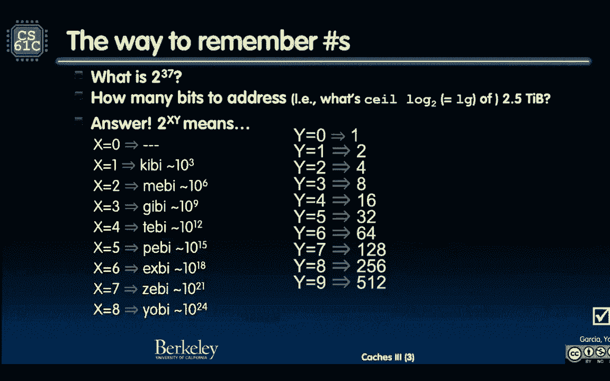

# 课程 P34：第26讲 - 缓存：多级与性能分析 🧠💾





在本节课中，我们将学习缓存（Cache）的核心概念，特别是直接映射缓存的工作原理、性能分析以及影响缓存性能的关键因素。我们将通过具体的示例和公式来理解缓存如何利用时间局部性和空间局部性来加速程序运行。

---


## 概述 📋

缓存是位于CPU和主内存之间的小型高速存储器，其目的是存储最近或频繁使用的数据副本，以减少访问较慢主内存的次数。本节课将深入探讨直接映射缓存的组织方式、读写操作流程，并分析块大小、关联度等因素如何影响缓存的命中率和整体性能。

---

## 缓存基础与地址划分 🔢

上一节我们介绍了缓存的基本思想，本节中我们来看看如何具体地将一个内存地址划分成缓存查找所需的字段。

一个内存地址通常被划分为三个部分：**标记（Tag）**、**索引（Index）** 和 **块内偏移（Offset）**。
*   **标记（Tag）**：用于标识该数据块来自内存的哪个大区域。当缓存行中的数据被载入时，其来源地址的高位部分就作为标记存储起来。
*   **索引（Index）**：用于确定数据应该被放置在缓存的哪一行（或哪个“集合”）。它直接对应缓存的行号。
*   **块内偏移（Offset）**：用于在找到的数据块（通常包含多个连续的字或字节）中定位所需的具体字节或字。

对于一个32位地址、总容量为16 KiB、块大小为16字节（4个字，每字4字节）的直接映射缓存，其划分如下：
*   总容量 16 KiB = 2^14 字节，所以需要 **14位** 地址来寻址整个缓存。
*   块大小 16 字节 = 2^4 字节，所以 **偏移量（Offset）** 需要 **4位**。
*   缓存行数 = 总容量 / 块大小 = 2^14 / 2^4 = 2^10 = 1024 行。因此，**索引（Index）** 需要 **10位** 来寻址这1024行。
*   **标记（Tag）** 位数 = 总地址位数 - (索引位数 + 偏移位数) = 32 - (10 + 4) = **18位**。

**地址划分公式**可以总结为：
`地址长度 = 标记位(Tag) + 索引位(Index) + 偏移位(Offset)`

---

## 直接映射缓存工作流程 🔄

理解了地址划分后，我们来看看对于一个读请求，缓存是如何工作的。

以下是处理一个内存读取请求的算法步骤：
1.  **根据索引定位行**：使用地址中的索引位找到对应的缓存行。
2.  **检查有效位**：检查该行是否包含有效数据。如果无效（例如初始状态或已被驱逐），则发生 **强制失效（Compulsory Miss）**。
3.  **比较标记**：如果有效位为1，则比较地址中的标记位与该行存储的标记位是否匹配。
4.  **判断命中/失效**：
    *   如果标记匹配，则为 **命中（Hit）**。根据偏移量从数据块中取出所需数据返回给CPU。
    *   如果标记不匹配，则为 **冲突失效（Conflict Miss）**。这意味着所需数据不在缓存中，且其位置被其他数据占用了。
5.  **处理失效**：如果失效（无论是强制还是冲突），缓存控制器需要从主内存中读取包含所需地址的整个数据块，将其存入该缓存行，更新标记位，并将有效位置1。然后，再从新载入的数据块中根据偏移量取出数据返回。

**缓存命中判断的逻辑可以用以下伪代码描述：**
```c
if (cache_line[Index].valid && cache_line[Index].tag == Tag) {
    // 缓存命中
    data = cache_line[Index].data[Offset];
} else {
    // 缓存失效
    // ... 从内存加载数据块 ...
    // ... 更新缓存行 ...
    data = newly_loaded_data[Offset];
}
```

---

## 写操作与一致性策略 ✍️

到目前为止我们讨论的都是读操作。当CPU需要写入数据时，缓存需要处理数据一致性问题：如何确保缓存和主内存中的数据副本是同步的？

主要有两种策略：
*   **直写（Write-through）**：数据同时写入缓存和主内存。优点是内存始终保有最新数据，一致性简单；缺点是每次写操作都会引发对慢速内存的访问，增加了写延迟。
*   **写回（Write-back）**：数据只写入缓存，并将该缓存行标记为“脏（Dirty）”。仅当该“脏”行被新的数据块替换出去时，才将其写回主内存。优点是减少了访问内存的次数；缺点是控制更复杂，且内存中的数据可能不是最新的。

“脏”位是一个额外的状态位，用于标识缓存行中的数据是否比主内存中的副本更新。

---

## 缓存性能分析 ⚙️

作为缓存设计者，有几个关键的“旋钮”可以调整以优化性能。

以下是影响缓存性能的主要设计参数：
1.  **缓存容量（Cache Size）**：总存储空间。容量越大，能存放的数据越多，命中率可能越高，但成本、功耗和查找延迟也越高。
2.  **块大小（Block Size）**：一次从内存载入的数据量。增大块大小能更好地利用**空间局部性**（程序很可能访问附近的数据），但过大的块会导致：
    *   **失效惩罚（Miss Penalty）增加**：从内存传输更多数据耗时更长。
    *   可能降低命中率：如果程序访问模式非常随机，载入的额外数据可能用不上，反而挤占了其他可能有用的数据。
3.  **关联度（Associativity）**：一个内存块可以放入缓存中哪些位置的限制程度。
    *   **直接映射（Direct-mapped）**：每个块只能放入一个特定行。容易冲突。
    *   **组相联（Set-associative）**：每个块可以放入一个特定“组”内的任意行。是直接映射和全相联的折中。
    *   **全相联（Fully-associative）**：每个块可以放入任何一行。冲突最少，但查找电路极其复杂。
4.  **写策略（Write Policy）**：如前所述，直写或写回。

**平均内存访问时间（AMAT）** 是一个重要的性能指标，其简化公式为：
`AMAT = 命中时间(Hit Time) + 失效率(Miss Rate) × 失效惩罚(Miss Penalty)`
设计目标就是降低AMAT。

---

## 失效类型分类 🎯

根据产生的原因，缓存失效可以分为三类：
*   **强制失效（Compulsory Miss）**：也称为冷启动失效。发生在第一次访问某个数据块时，因为该块从未被载入过缓存。这是不可避免的。
*   **容量失效（Capacity Miss）**：缓存容量有限，当活跃的工作集（程序频繁访问的数据集合）大小超过缓存容量时，即使缓存是全相联的，也会发生数据被被动替换出去导致的失效。
*   **冲突失效（Conflict Miss）**：在非全相联（如直接映射或组相联）缓存中，即使缓存还有空闲位置，因为多个内存块竞争同一个缓存行或组而导致的失效。

分析一个程序访存轨迹的失效时，可以按以下逻辑层次思考：
1.  假设一个无限大、全相联的缓存，剩下的失效都是强制失效。
2.  假设一个与实际缓存同大小、但为全相联的缓存，新增的失效就是容量失效。
3.  在实际缓存（如直接映射）上运行，再新增的失效就是冲突失效。

---

## 总结 📚

本节课中我们一起学习了缓存的核心机制与性能分析。
*   我们掌握了如何将内存地址划分为标记、索引和偏移量，这是理解缓存查找的基础。
*   我们详细演练了直接映射缓存处理读请求的完整工作流程，包括命中与失效的判断。
*   我们了解了写操作的两种主要策略（直写和写回）及其权衡。
*   我们探讨了缓存设计的多个关键参数：容量、块大小、关联度和写策略，并理解了它们如何影响命中率、失效惩罚和平均访问时间。
*   最后，我们学习了缓存失效的三种类型：强制失效、容量失效和冲突失效，并掌握了分析它们的方法。

理解这些概念对于编写高性能程序（例如，进行缓存友好的优化）和设计计算机体系结构都至关重要。