# P38：Lecture 29： Parallelism I： Thread-leve Parallelism - 这样好__ - BV1s7421T7XR

其他发生的一切，你的周末过得怎么样秋天到了，当然可以是的，暴风雨要来了，所以明天会下雨，注意那个，明天下午带把伞，我想他们说星期二会下雨，也许周末晚些时候会有一些，但希望我们肯定需要它，我们当然需要雨。

很高兴见到你很高兴见到你，季节实际上在改变，我将在新闻部分向你展示这个非常有趣的计算，就在这里，如果我点击这个启动它，这是谁记得嗯，这是一个大英雄六，大英雄六，你知道的，还有这些小机器人。

他做了一个机器人，一小块机器人可以像那样重新连接和自我配置，那是不可能的，记住大英雄六，当你看这个的时候，迷人的，引人入胜的工作，准备出发，我我想我不应该。

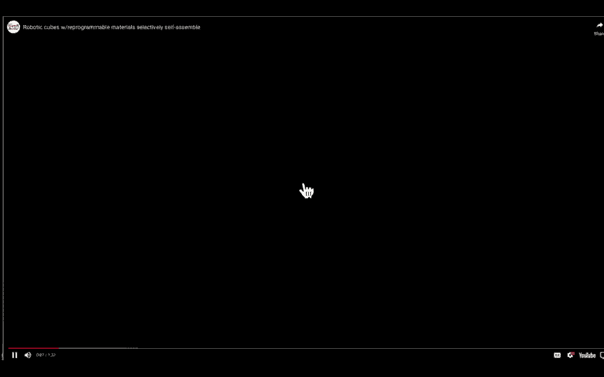

我做的。

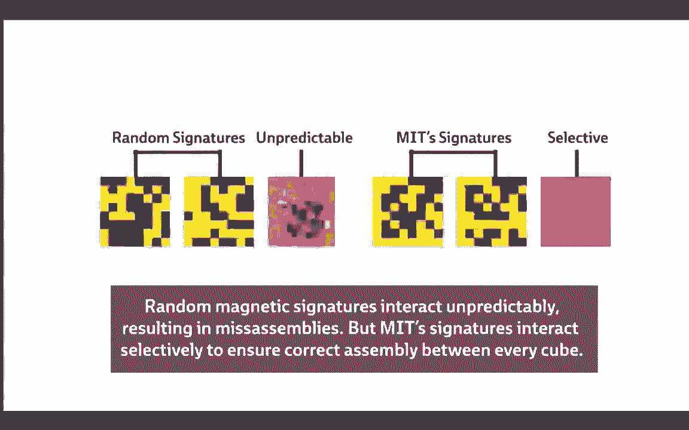

就像一张脸知道这一点。

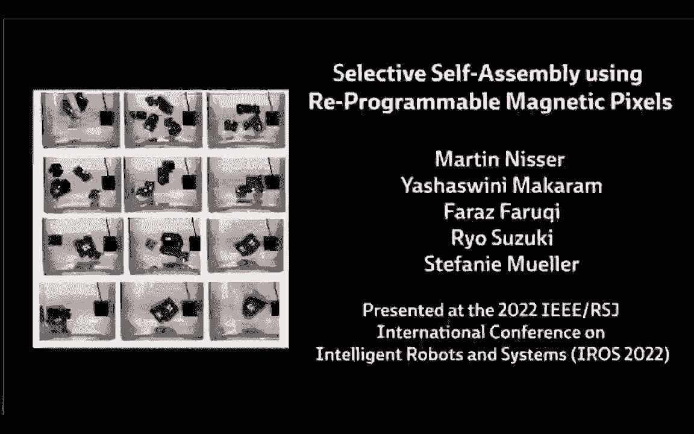

但事实证明，你可以有一种天性，并在上面签名，然后它们只与一个特定的签名对齐，所以你可以说，让我们用上面的签名来建造一个魔方，两个七个子立方体对每个必须连接的脸都有签名，如果两张脸不匹配，它们就会爆炸。

我们只是互相反弹，但当他们碰巧撒谎时，他们会一起去拍照，就像两块磁铁，所以不仅仅是你，你知道的，你被吸引了吗，你被排斥了吗，这是磁场的特征，只有当你以正确的方式对齐时，那不是很迷人吗？我觉得很有趣。

好啦，挺有意思的，所以让我去下一个，但是。

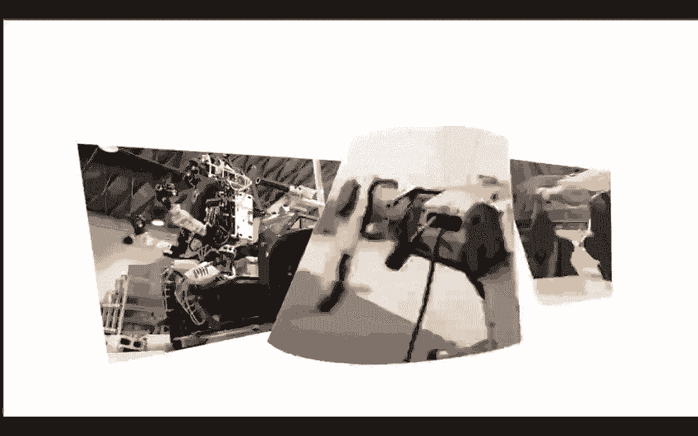

好啦，所以让我们开始吧，女士们先生们，万圣节快乐，每个人，很高兴有盛装打扮的人，谢谢你穿着戏服来，我也爱我自己，很好玩，谢谢你庆祝这一天，稍微改变一下总是很有趣的，我有个笑话给你，这就是问题。

为什么61不能，C学生说出万圣节和圣诞节的区别，这是经典的，你得知道这个笑话，你得知道这个笑话，我一直在等待，我等了一整年，我喜欢在秋天教书，因为这与它无关，因为10月31号或者10月3号，三一八等。

十二月二五，十进制基数二五，非常感谢，非常感谢，这不是我的玩笑，它不是，这是个众所周知的笑话，当然不是我的，我没有，如果我，如果我是，我会更高兴，但这只是个玩笑，我听说我想和你分享。

我们周五有一个关于平行的软性开场，我们看到西米在思考这个文化，现在我们要谈谈线程，一个大的新话题，这是正式的开始，一个名为线程级并行的新主题的正式开始。

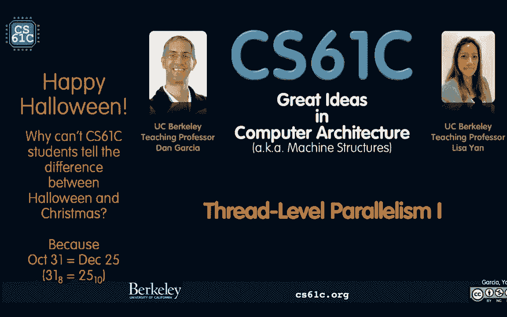

但是让我们回到过去，看看并行计算机体系结构。

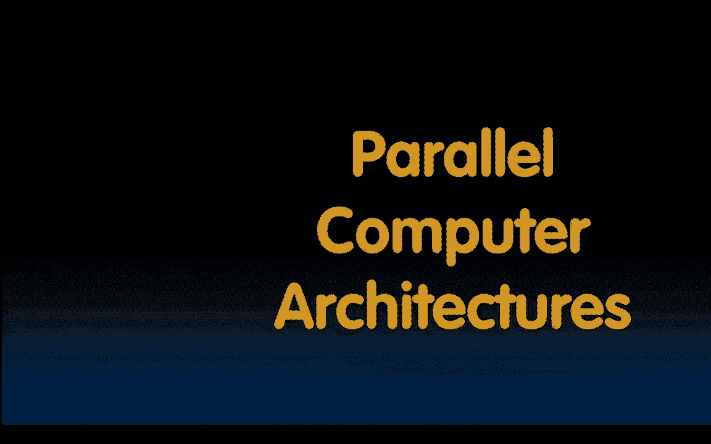

你打算如何并行地建造东西，为什么我们要平行地做事情，这门课提高性能的目的是什么，我们当然知道我们可以建造一台机器来处理我们的程序，那没什么意思，我们在连接硬件或软件之前就已经这样做了，已经完成的部分。

但现在我们已经建好了，你会怎么做才能让它变得更好，你会有更高的表现，你能做什么，什么是，你有几个旋钮，当然，最简单的旋钮是时钟速率，把时钟频率调高，把时钟调高温度有什么缺点，真的很难对付。

而且对环境也不好，你那样做效率不高，所以这是个问题，所以我们基本上是5千兆赫，你不会真的看到，我是说，你看到了伟大的，你知道的，世界纪录是8个，所以我们大约有5千兆赫。

在那个空间里低于2-3-4-5的东西，那是固定的，不能转那个，它已经很多年不能转动旋钮了，当丽莎和我长大的时候，当你们还是孩子的时候每年，哦，我有250兆赫，五百兆赫，1千兆赫，那是我们做的一件大事。

我们在转动旋钮，弗吉尼亚州，这是工作，它正在工作，丹纳德缩放仍在进行中，不能再做了，我们大约不到5千兆赫，几乎普遍，这就是我们接下来要研究的，我们谈到了较低的CPI，每条指令的时钟周期，太好了，辛迪。

一个崩溃周期，四个广告，那太棒了，这么宽，我们说的是更广泛的寄存器，咀嚼咀嚼XOR在四个不同的三个两比特量，我们喜欢这样，通常大部分是关于浮点的，所以通常是两个花车上的广告，四个浮点数，或者八个浮点数。

或16个低点数字，我们还谈到了降低CPI，当我们有管道，记住我们同时做多件事，所以CPI是这两个因素中的一个，更大的是什么，如果您可以同时执行多个任务，所以你可以有多个CPU，各自并行，喜欢这个。

任务可以是相关的，也可以是不相关的，我们一会儿再谈这个，如此相关，每个CPU执行，你知道矩阵的一部分，你在这里，我在下面这个矩阵里或者完全不相关，这对服务器来说很好，顺便说一下，考虑服务器对请求的响应。

每个请求都是完全不同的，你想要文件的这一部分，你想要网站的这一部分，你想把这个放在这里，服务器对此很好，因此，您可以将非常不相关的内容分发到hhttp请求中，超文本传输协议。

或者您可以在浏览器或电影中运行PowerPoint，你知道网络浏览器或类似的东西，或者你可以做所有的，我们将讨论做所有的，这基本上是你现在所有的电脑，全部做完，你把这三个都拿走，你得到了很好的性能提升。

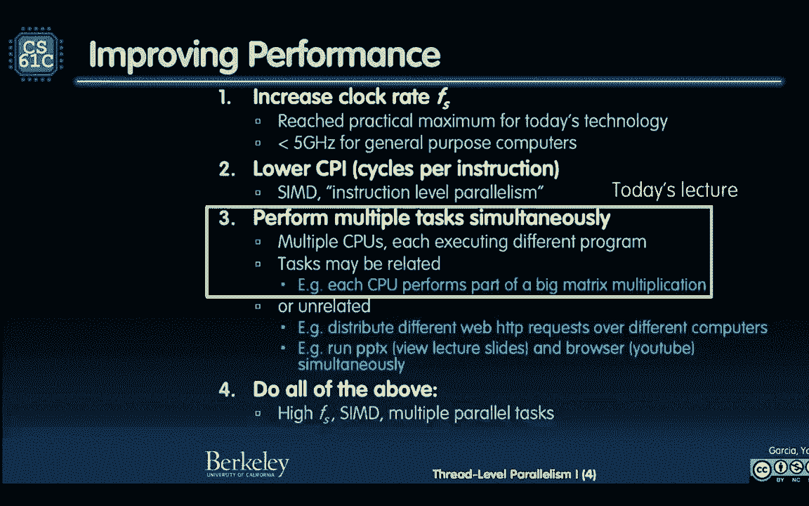

还记得我们之前看到的一些并行是免费的吗，最低层硬件描述，那三个二比特，我得到了一个A，一个X和一个Y，我将以，那些都是免费的，他们只是碰巧用这种方式接线，我们不必在体系结构上做任何明确的事情。

我们当然建造了它，我们建立了数据路径，我们对此不做任何明确的事情，我们得到了免费的管道，我们当然有建筑师在工作中，建筑师和，你知道的，戴上我们建筑师的帽子，你得一起打造，但一旦建成。

你只是从软件的角度来使用它，所以那是免费的，精通软件，我们讨论了一点并行数据，SIMD不是免费的，您必须在C代码中显式地添加这些内部函数才能使其添加，你得把它复制到大宽矢量上。

你得加上矢量才能把它带回来，所以你是手工做的，我们将讨论并行线，这又是你明确地做的事情，这不是免费的，通常，所以我们得考虑一下，当然，您可以有一个未来的智能编译器，对你来说就是这样。

但现在我们必须自己明确地做到这一点，你要控制它，这是伟大的，我们处理这部分硬件，其中的一部分，我们的口头禅是什么，我们与平行性有什么关系，明确，我们的口头禅是什么，唐纳德·克努斯，我上次展示过这个。

我们的口头禅是什么，过早，是万恶之源，至少在编程语言中，所以你要确保你想让你的程序，当我们讨论显式并行性时，确保你让它工作，在决定添加线程之前，在你决定让它平行之前，那样的话。

只要确保这对每个人都是一致的。

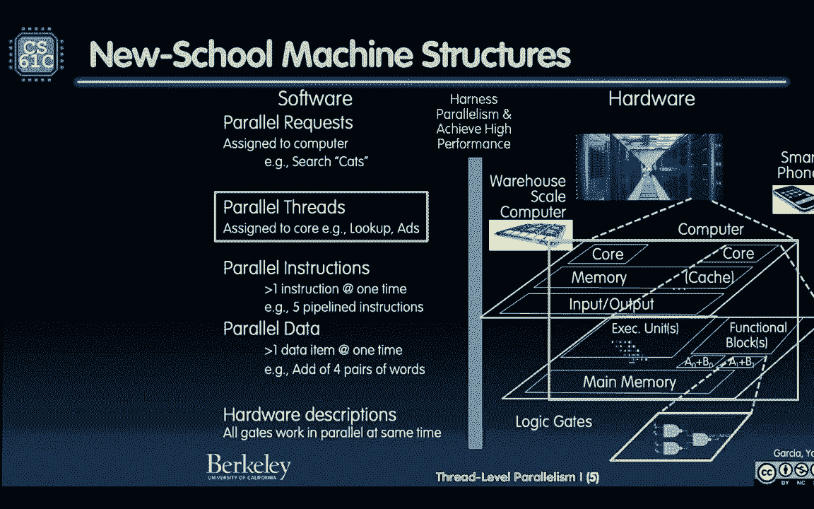

好啦，体系结构，他们回来干什么，啊，我不知道什么会看这个，那可能是这是顺便说一句，伯克利的一些作品，他们在做什么来恢复平行度，也许在，80年代，我们要说左上角的图片，从80年代开始，你想有平行的。

如果你买了很多电脑，你把他们都放在演讲厅的每一个座位上，你在那里放一台电脑，每个人都在运行不同的程序，或者某个大项目的共享部分什么的，你怎样才能把它们很好地连接在一起。

这些计算机连接的唯一方式是通过以太网，所以以太网变成了，你知道的，我要用的词，就成了瓶颈，因为所有数据都要通过瓶颈，想想瓶子，你想把水从瓶子里倒出来，这里很宽，但是脖子真的很小。

所以瓶颈意味着一切都归结为一个点，所以以太网成了那里的瓶颈，让我看看，让我们大规模地这样做，我们去劳伦斯伯克利国家实验室工作吧，或者劳伦斯利弗莫尔实验室，我们正在进行大规模的气候模拟，你需要对每一个。

你可以想象我的工作有多酷，就像电脑一样，这块小广场上的工作碰巧在内华达州上空盘旋，我的工作是了解气候将如何变化，因为我在预测一些事情，所以我的工作，现在我邻居的电脑正在用邻居的电脑工作。

所以你想要有真正快速的互连，所以他们开始建造，这使得这些计算机之间的互连速度非常快，所以它并不遥远，就像嗯，我得通过电线把它转到这里，路由器通过以太网返回到这台计算机，让我们有那些互连，非常非常小。

非常快，非常紧，为此进行优化，因为有很多数据传输，还有那些大模型，我们也每个人都谈了这件事，每台计算机都建立在一个多核系统上，所以现在你有了跨计算机的并行性，以及一个CPU内的并行性，今天的课就是关于。

那些多核是什么，我们怎么给他们编程，我们今天要谈谈这个，他们是如何交流的，所以这叫做多核芯片，GPU当然有大量的并行性，多年来一直在做平行，如果你想知道每个像素应该有多亮，但是多核CPU。

我们上次讲了一点，作为一个数据路径，有一些共享的材料共享，L三，当然有一段记忆，我马上给你看那张照片，你的蜂巢机器用的是那些电脑，你自己的笔记本电脑有一台电脑，我的表，你的手表使用了这种多核架构的想法。

那么有两个核心意味着什么呢，我们只看了一张照片，一个核心，这是你第一次看到这张照片，它是这样工作的，有一个记忆，有一个很大的记忆系统，记忆可能很大，你知道在最新的Mac上，我想两年前你可以点两个。

一分是多少，5TB的内存什么的，一些疯狂的内存真的真的很大，就像哦，几场演出，是啊，是啊，你以为你得是个记忆很强的人，是啊，是啊，几兆字节的内存怎么样？所以内存又大又贵，你必须每个核心都有它们的副本。

因为它们当然很小，好像他是个，他是核心课程，就像一个，一个大硬币的模具，或者一个，你知道的，五十美分，那是一个核心的大小，所以我们说的是记忆，比那大得多，所以你有两个核心。

每个核心都有自己的控制和数据路径，现在你看到的每一个都将与记忆相互作用，所以现在在某种程度上，你在想这里的瓶颈是什么，记忆有一个，还有很多，所以当我们看这个的时候，好好想想吧，你知道的。

我的记忆保持不变，我们这里有两个核心，都能运行两个独立的程序，两个独立的，我们要在第二个线程中说。

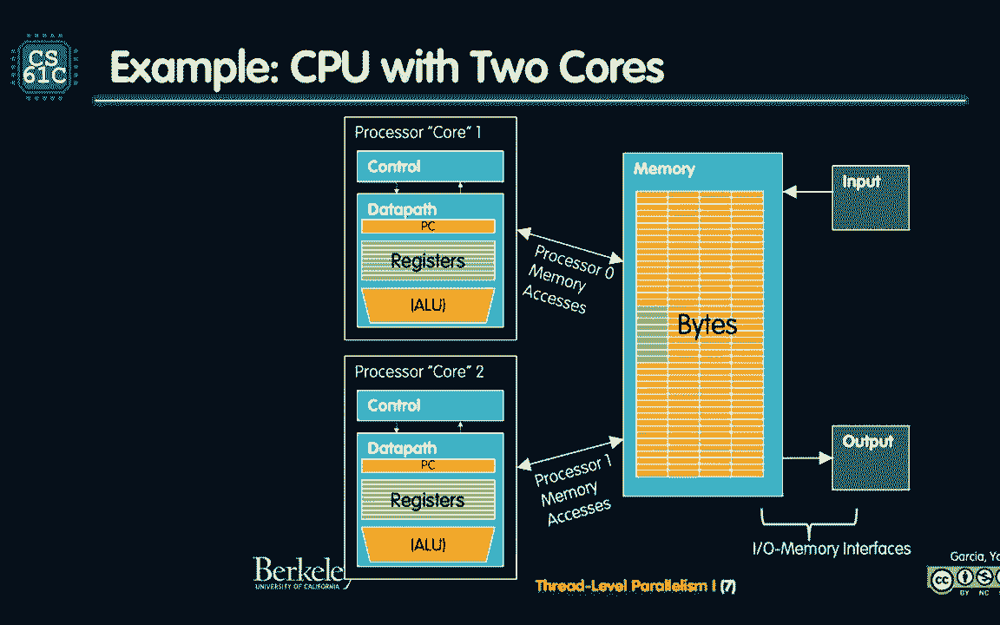

一个节目的两个七部分，这就是这两个核心的想法，他们在干什么，它们各自执行自己的指令，单独资源，什么分开得好，数据路径，让我们回到这里，让我们看看什么，什么是分开的。

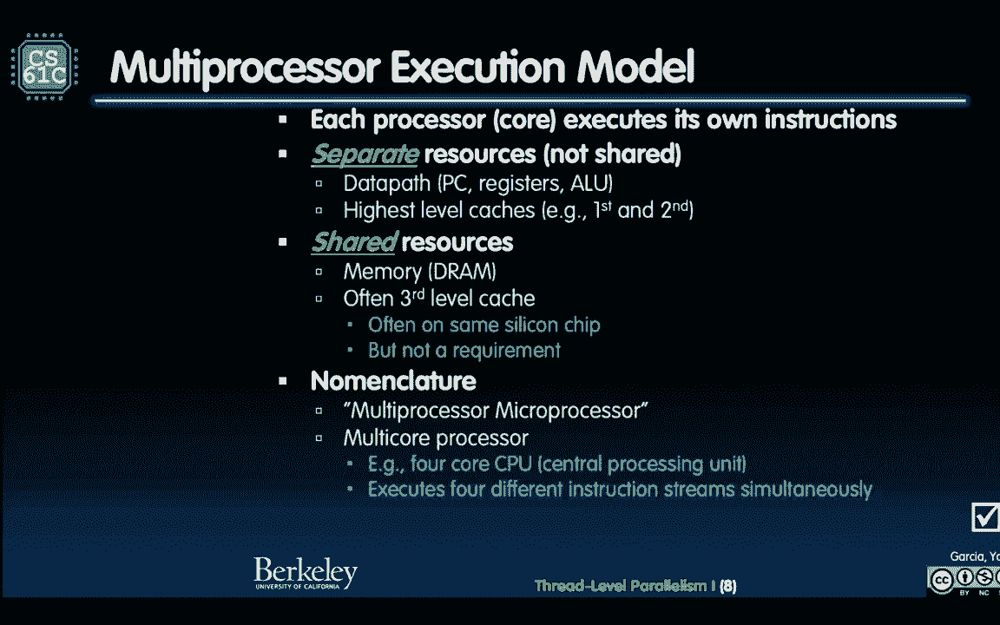

控制和数据路径，对呀，PC寄存器ALU都是分开的。

那太好了，那不是不，没有共享的东西的争论，那是我自己的小世界，我自己的小电脑，在某种程度上，每个核心在某种程度上都像老式的学校电脑，每一个都有最高的水平，在自己的核心上缓存第二级上的第一级。

你看到了一个共享的L三，所以在某个时候，他们开始分享，当然记忆是共享的，我们也谈过了，分享了什么，显然记忆，你说过第三级缓存，不是要求，所以我们把这个叫做，我有个新名字，确保我们明白这一点。

这就是所谓的多处理器微处理器，多处理器微处理器，也称为多核处理器，例如，一个四核CPU，我们谈到了同时执行四个不同的指令流。

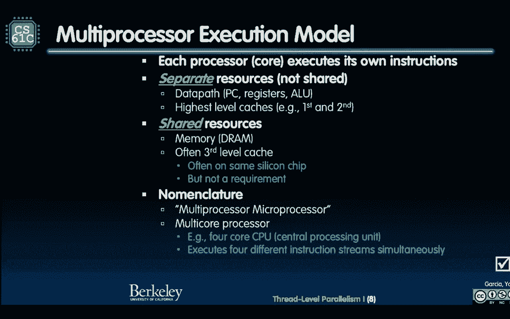

那么什么是多核呢。

我给你看了这张照片，我相信我谈到了数据路径，然后呢，让我们都回忆一下，有一个故事，我喜欢这张照片，这是我很久以来见过的最好的视觉效果之一，让我们一起回忆我们一起讲的故事，我想我在这上面花了十分钟。

故事发生在2005年，如果我能让我的光标在2005年左右工作，来吧光标给我一些爱，不给我哦那里它，两千零五年，我们无法冷却，我们的CPU，我们试过液冷，我们试过油基冷却空气，风扇很久以前就坏了。

我们不能再给他们降温了，所以我们必须冷却我们的能量，我们不得不减少我们的力量，因为他们不能称之为，那么如何降低功率，把频率调平，而不是高歌猛进，一旦我们达到5千兆赫，四五个，当它变平时，我们就停了下来。

我们看到了没有并行标准的顺序性能应用程序，你正在学习的东西61 C写你的第一段C代码，所以没有相似之处，压平，表演正在变平，丹纳德缩放，你得到的地方，这种自由增长已经停止了，上面的曲线是什么。

顶部曲线的成员被称为，每个集成电路的晶体管数，摩尔定律，不是性能，但晶体管的数量仍在继续，那么你怎么处理那些晶体管你得到了更多，我可以装更多的晶体管，工程师们在世界的那个地区做得很出色。

建筑工程师的那一部分让曲柄继续运转，他们继续把更多的晶体管堆在我的，原来如此，但我的表现平平，因为我不能再加快速度了，所以看看我的小动画，准备好了，波普和哒哒哒，你增加核心的数量。

你用不同的方式使用它们，你把它们用在两个不同的核心上，一死，现在看看这个，现在你可以看到并行应用程序的性能继续，所以对数据的渴望并没有减弱，人们继续拥有越来越大的数据集，皮克斯想要越来越多的现实电影。

没有人能阻止对数据的渴望，所以你需要继续满足这种饥饿感，但你必须给它输入一个现在并行的程序，不是连环的，你以前可以免费做，你知道它叫激光，它害怕只是懒惰，懒惰的程序员模型很棒。

只需在第四个算法中写一个非常低效的结尾，只是风，计算机的电流越来越快，会确保你的表现很好，现在就有效，你必须对算法非常聪明，如何使用内存，当然使它平行，我在这里看到一个问题，告诉我你的名字。

你只有一个在那里一个，是呀，是呀，问题是当你有一个CPU，有一个alu吗，是呀，只有一个陆，你一无所有，不用担心，这就是你所拥有的，顺便说一句，他们在多辆车之前就有了危险建筑，但这些都是异国情调的。

你会在劳伦斯买到，伯克利国家实验室，在那里他们把它们和非常快的，你知道的，因特网连接，而不是把它们放在同一个模具上，是啊，是啊，接下来的问题，再喜欢一次，是啊，是啊，什么是，这就是重点。

那么越来越多的晶体管有什么用呢，如果你只有一口井，也许是一个大一点的一一二缓存，它们中的每一个都在这样做，所以你在扩展机器的某些部分，但你没有改变，事实上，你有一个ALU算术逻辑单元在做你的工作。

但你可以用另一种方式，所以这是一个很好的观点，但他们在想，过渡是什么？我们在某种程度上如何处理它们，对他有帮助，在那里再加一个，是呀，我是说，你还能用它们做什么，你可以做更多的异国情调。

更多我们现在还没有了解的异国情调的建筑，超级缩放器正在流水线是一件大事，你能让你的部分有多宽，但仍然很有创意，他们用这些晶体管，我们可以把它们放在那里，是呀，问题围棋，我们要担心的是，马修，马修。

未决问题，马修，我们要担心两个核心，同一地点的权利，女士们先生们，每当您有共享资源时，你得担心丽莎，我在抓遥控器，对两者都是，她现在有了我现在有了她有了，你们两个在抢一样的东西，您有一个共享资源。

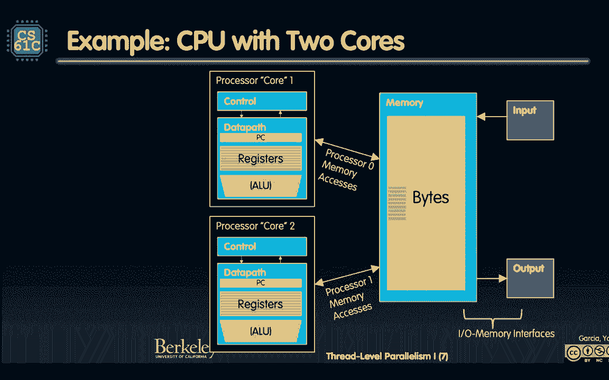

你已经明白了，好啦，所以这是完全正确的，阿门，我们会更多地讨论这个问题，实际上可能是下节课。

但这当然是个问题，好啦，这里有一张照片，这是苹果公司的营销图片，谢谢你，苹果公司公开了这艘14并不是最新的最伟大的船，但他们至少应该强调一些他们想谈论的事情，这是他们在大营销活动中的照片。

这是你知道的那种事情，蒂姆·库克谈到，他会指出所有这些要点，但让我指出一些事情，与本课相关的，就像一个新的六核CPU，顺便说一句，那很酷，是他们的移动芯片，这就像一个移动设备，是我的iPhone。

是A系列芯片，不是一米一二，那是他们的台式机系列，这是一个手机芯片，我的电话，六核CPU，我们继续走，四核GPU，这是一件令人难以置信的作品，我是说你，你拿着一台超级计算机，你的电脑，如果你回到过去。

给那些在劳伦斯伯克利国家实验室，二十年前，你的手机会被吹走的，他们房间的电源在你的手机上，令人难以置信的是，在过去的二十年里，性能有了如此大的提高，比如说四核GPU，十六核神经引擎做人脸识别和照片更新。

或者他们在做什么，在人工智能方面他们的神经引擎，高级图像信号处理，难以置信的技术，人们在一起，这只是一个例子。

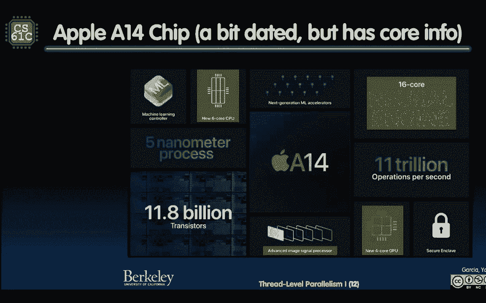

所有的公司都在一起，现在的芯片正在做他们正在做的不可思议的工作，和工程方面有所有这些核心，所以从2005年开始，这是很正常的事情，你以前找不到幻灯片，上面写着，哎呦，多核，那是件新鲜事，两千五就是全部。

这个时代的开始，所以马修说到共享记忆，每个核心都可以访问处理器中的整个内存，保持缓存一致性的特殊硬件，那是个问题，当然，我们将讨论下节课，优势很好，多么巨大的优势，如果两部分，两种不同的跑步方式。

我们要叫他们线程，但目前有两个不同的运行程序，我们会说现在都是，我们就是这么说的，共享同一程序，所以我想做乘法，您将此列添加，我会拿这个专栏好好补充一下，如果它是伟大的，如果您可以在同一个地方访问数据。

太多了，那样比没事容易多了，嗯，你抄到你那边，是啊，是啊，我抄到不不，事实上，这是你正在访问的一个地方，实际上使您更容易拥有同一程序的多个部分，访问我们喜欢的相同数据，慢内存被许多客户共享。

我们在讨论去萨克拉门托，更多的人需要去萨克拉门托，如果你不告诉我，这是个问题，也可能成为瓶颈，我们将讨论所有的法律，我想从现在开始几张幻灯片，几堂课之后，对不起，两种使用方法，要么是工作级别的并行性。

要么是所做的，一个作业分区，做不同事情的任务，所以我们之前说过，我来做最下面的滑梯，先把滑梯的底部，如果你有一个大的矩阵乘法，你可以把它分了，你在这里，我在这里，好啦，我们有十个人，你说这个专栏。

你留在这里，你呆在你的车道上，你做你的事，然后把它加在一起，并以某种方式为最终结果做出贡献，或者工作级别的并行性，你说你知道，我有很多事要做，一个是对这个列表进行排序，二是找东西，二是，我不知道。

在这里否定一些东西，或者做一些模拟，每一个，过程，核心在处理无关的问题，他们是同一个项目的一部分，也许吧，但他们在做的事情上有点无关，所以我要用这个记忆来做我列表中的事情，我正在使用的链接列表，在这里。

我的搜索是记忆的另一部分，所以我还在用同样的记忆工作，但我在做不同的事情，我们称这种工作级别的并行性非常不同，而不是我们都分享，研究矩阵，乘积在一起，仅仅分担并行处理的任务是很难的。

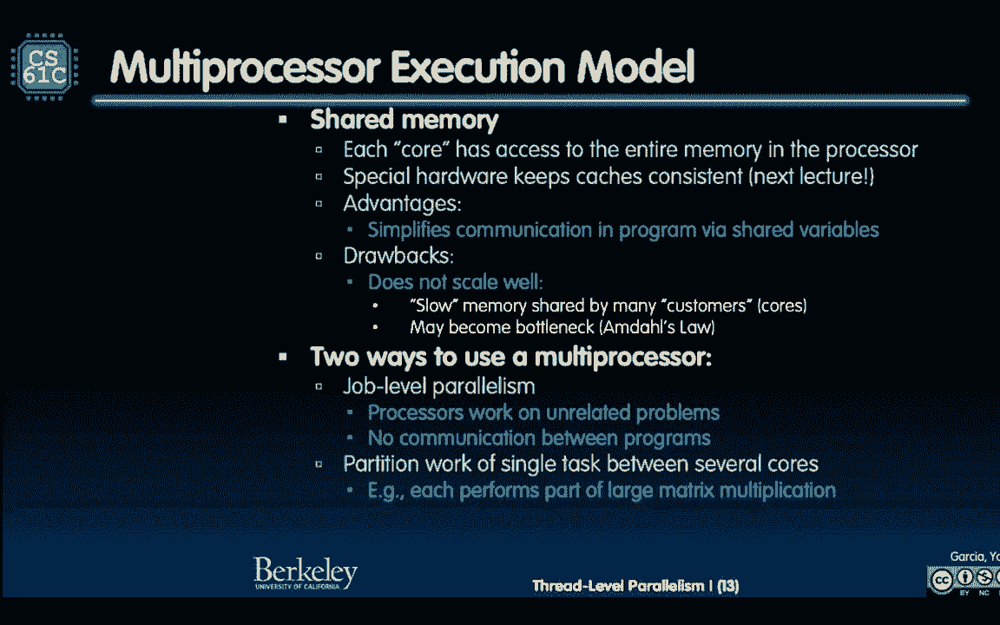

这就是为什么如果我真的希望我再次从幻灯片中出来，不要并行地对此进行优化，直到你真正知道你在做什么，这很难，一些人在这两个方面都写了博士学位，尝试用新语言支持并行编程，新技术，新支持，还有，那是凯西。

是啊，是啊，就像我们的一个，加州大学伯克利分校的研究主任有一个博士学位是，她有很多博士学位，一门新的语言，让它变得更容易，所以如果语言可以支持你，并行性可能会指导你，为你免费做事，那太棒了。

以及并行硬件，你怎么做某事，你如何优化最后一张幻灯片，对新算法更好一点，当两万五的时候，这是一件非常重要的事情，它被称为计算机的巨变，巨变建筑，所有人都很兴奋，算法的人很兴奋，因为现在我在想。

每个人都需要有并行算法，你如何把所有的传统算法并行处理，我们在说什么，运行时，所有的建筑师都很兴奋，所有新架构，所有的理论家都很兴奋，所以每个人在2005年左右都很兴奋，在这个部门工作真的很有趣。

这很难，并行编程真的很难，但这也是不可避免的，这是我们唯一能走的路，我们在传统的时钟调速方式上碰壁了，只是丹纳德缩放，只是等待，让系统更快，为了获得更好的性能，我们必须并驾齐驱，这就是现在的现实。

这就是我们，马离开了谷仓，我们当然都在无与伦比的，不行不行，我们要回到移动系统，我们在移动系统中看到，A14芯片有多个内核，他们现在有专门的处理器，作为运动处理器、图像处理器和神经处理器，很神奇的东西。

以及图形处理器，它现在一直在那里，你也可以好好想想发生了什么，如果可以的话，我不知道，想象一下二十年前的亚马逊，也许在一个大仓库里有一个一百万台电脑的仓库，不知何故冷却了，以某种方式互相交谈。

以某种方式支持一个大请求，比如运行亚马逊软件，想象一下，有多少独立的交易发生在亚马逊或Facebook上，或者任何社交媒体应用程序，所有这些都是并行的，只是有一个巨大的计算机房间，都在凑合。

这就是仓库缩放计算的意义所在，我们以后再谈这个，在每台计算机中令人兴奋的几节课中，你有多个节点，然后是几个CPU的盒子，当然还有明迪和西姆德，Simd本身，你在并行添加，在SIMD中浮点数。

你的计算机中有多核，所以它就像一个装满电脑的房间，在电脑里，你也有MD，宽宽，宽和和多个核心处理这些和。

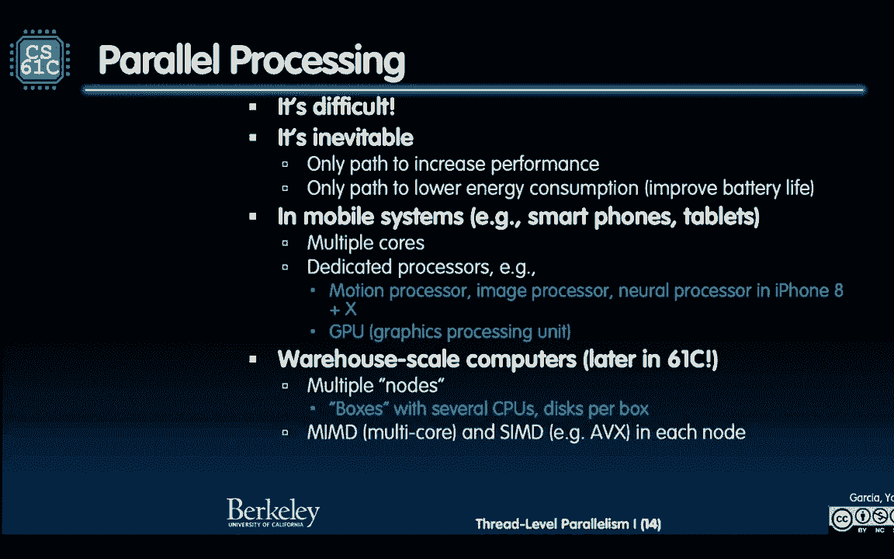

我们的表演怎么样，到目前为止进展如何丹·威尔，我给了你一个小曲线，继续往上走，但让我们来看看一些数字，如果我们从两千年开始看，三年大约是二十年，伊什到二十一，十二年，让我们回到十二年前。

从两千零九年到二十一，我们见过多少和弦，所以核心有点去了，记得我说过2005年还早，这么早，现在2000年初的一两个核心，我们大约有20个核心，18岁的典型，八十，八到八到二十，伊什，有些是更高的。

一些较低的，它很兴奋，所以如果你看这里，这是生长的8到20，大约两点，五x从2000和12作为一个九到二十一，向量有多宽，记住希德，我们讨论宽向量，同时加入大量彩车，一条指令大约是八倍。

这些载体长得有多宽，如果你把它们相乘，我们看到的节点浮点大约是12年后的20x20x，神圣的动机，那是什么意思，那大约是一分，两个，一年八次，两个，8%的连年增长，也就是每三年翻一番，那太棒了。

以前我们有摩尔定律，因为我们每两年将C上的晶体管数量增加一倍，然后每十八个月加速一次，所以每18个月翻一番是惊人的，每三年翻一番，我要表演，独立的东西，一个是晶体管的数量，我看到一个是表现。

每三个两个x是一个相当好的交易，我们仍然可以用它来工作，这是令人兴奋的，但又一次，程序员必须编写并行的代码，你现在不能免费得到它，如果我们能利用它，那是。

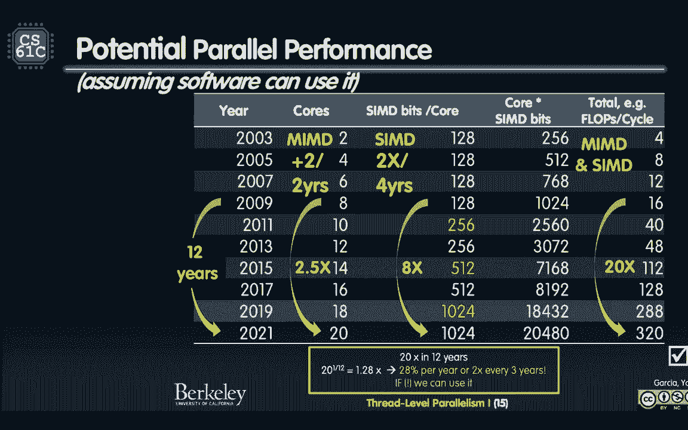

如果我们能利用它，我们如何使用它，让我们切入正题。

如果你去你的电脑，我鼓励你有一个笔记本电脑类型，PS PS列表，您正在使用的所有流程，这是一个关于典型事情的列表，看看这些恶魔，这就是所有以d结尾的东西都是守护进程，这是一个运行的后台任务。

操作系统你想了解更多，接下来的五六张幻灯片，只是为CS一六十二做广告，这是61年的后续课程，C，了解操作系统，这是其中的一部分，这是重要的一部分，他们在一百六十二教你什么，挺刺激的，我有156个。

一次运行的总进程，您的计算机是如何管理的，太神奇了，这是我们正在做的一部分，多核处理，好啦，想象一下，在同一时间做156项作业，基本上不可能，那么它是如何与这种新的想法技术一起工作的呢，称为线程。

我第一次正式告诉你，这是一个线程，就是所谓的执行线程，它是一个单一而独立的，单指令流，你知道指示是对的，添加加载添加加载存储，好啦，想想那一连串的指令，它是一个单一的指令流。

独立于其他可以在这些核心上运行的人，一个程序可以将自己分割或分叉成多个线程，并将自己分割开来，好好说，我需要有人再次，对此列表进行排序，这里有一个线程可以搜索其他区域，你的工作是推翻和否定一些事情。

所以这些线程中的每一个都可以由您控制，程序员和他们在理论上并行运行，这是一个简单的思考方法，现在呢，这是怎么做到的？我说过这个，您可以拥有串行运行的并行软件，非并行硬件，非并发硬件，怎么可能。

这是图片分时，我做了个类比，上次我谈到这件事是在星期五，如果你有父母，你得让六个孩子睡觉，你所做的就是给每个孩子一点时间，哎呦，你是个可爱的孩子，读一个故事，一个故事，晚安月亮大一点的孩子，好啦。

太棒了，哈利波特第一章，一个大一点的孩子，你真棒，你真棒，第二册，你正在经历，在你哄每个孩子睡觉之前给他们一点爱，这就是中央处理器的功能，CPU被称为分时机，分时机是如何，顺便说一句。

当我坐在你的座位上，我真的，这是很久以前的事了，三十年前，当我坐在你的座位上，我得写一篇文章，麻省理工学院的系统是一个分时机器，所以这是一个，我们认为一台非常快的计算机，但是所有的学生都在敲。

你可以想象我把，如果越多，我问你，如果你在父母负担中增加更多的孩子，这意味着每个孩子都有更多的时间还是更少的时间，更少的时间是吗，想象一下所有麻省理工的学生都想用这个系统来写论文，因为我们都没有电脑。

所以你必须把他们的东西写在这台共享电脑上，在分时计算机上，我讲故事，至少它不相信，我记得有一天我试图写一篇文章，你知道吗，高一新生，或者以前是什么，我有自己的电脑，我在某个时候买的。

因为它们是在80年代问世的，我打了一整行，屏幕的80个是80个字符宽，我在没有看到反馈的情况下键入了整行，想象一下打80个字符，希望我能有更多的时间，它基本上是在排队我所有的钥匙，然后我们去。

它会显示80，我有一些错别字，但请记住，它去了下一个人，所以我把光标向后向左向左向左，它不动了，因为我再也没有那个时间片了，所以我必须喜欢左左左，我想是12点以前，十二背，好啦，现在是d不是x，好啦。

这是正确的，我离开了，我去了，我的天啊，这是我以前写的一篇论文，所以分时是个问题，你得到的人越多，要求关注的人就越多，如果你有一个CPU，你得到的时间越少，所以这是一个真正的问题，因此，在时间机器中。

您可以通过减少并发运行的程序来提高性能，这意味着每个正在运行的程序都有更多的时间，所以如果你在后台有幻灯片，你不用它，别再说了，好吗？别再跑了，嘿用户，如果你要去吃饭，注销，所以说。

你得不到我们曾经分享的那一点点时间，好的，好的，所以时间共享是可以实现的，事情就是这样做的，如果你有更多，如果你有更多的线程，然后核心或CPU处理了这一点。

你只要给他们一点时间，好啦，我们谈到了线程，作为执行某些任务的顺序指令流，在我们称之为程序之前，我们先打电话，我们将称之为线程，现在呢，那是个新词，对于一组连续的指令集，这些指令集碰巧做了一些事情。

这可能是更大计划的一小部分，每个线程都有，这很重要，CPU的状态是什么，如果我问你们所有人，中央处理器的状况如何？PC，所有的寄存器，也许缓存，它是记忆的副本理论上来说，但如果我们都分享那段记忆。

那我现在就不用担心记忆的部分了，所以这里呢，专用CPU和所有寄存器，这里有两个新词，我想让你明白，我的系统可以处理一定数量的线程运行，因为我的硬件，你有多少个核心，所以一旦一根线。

我想说映射到一个物理核心上，我们将称之为硬件线程，所以一个硬件线程意味着它实际上在运行，好啦，这是你悬而未决的请求，今天真正被选中参选的，现在这叫做硬件线程，软件线程是你和软件要求一千个线程。

但我不会继续，一台能同时运行上千个程序的机器，所以那些是软件线程，请求是软件线程，那些真正被锁在里面的，男孩，好啦，下面是在这个硬件上运行的软件线程，它变成了一个硬件线程，所以软件是漂浮在以太中的。

用户可以请求一百万线程，硬件线程是今天实际运行的线程的计数，这就是区别，行为，所有没有映射的，所有没有映射到硬件的，我们只是在等待，只是等着享受阳光。

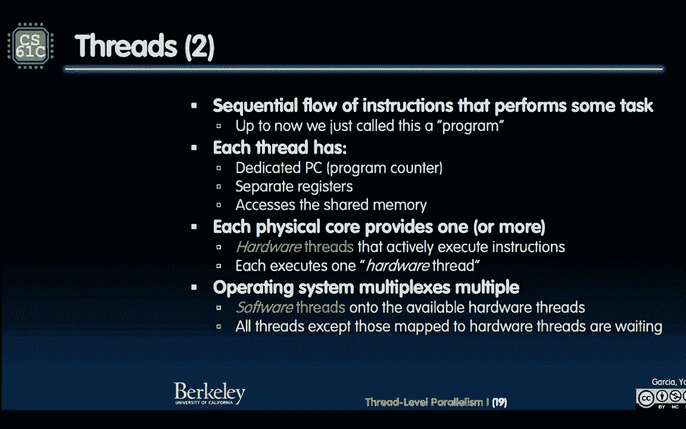

只是在阳光下等待他们的时间，这是我的同事，退休教授爱德华·李，谁有这句精彩的名言，我想要，我想读给你听，只是因为它太好了，尽管线程似乎是顺序计算的一小步，事实上，它们代表着一个巨大的进步。

他们抛弃了序列计算最基本和最吸引人的特性，线程作为计算模型是非常不确定的，程序员的工作变成了修剪这种不确定性，大句，意思是线程不按顺序运行，所以你有一个正常的序列，你拿起你的手指，你说我在这条线上。

我在这条线上，我在这条线上，我在这条线上，一旦你拿起两个手指说，好啦，现在可以有两件事同时运行，我告诉你它们可能以任何顺序发生，这个可以卖20英镑，这个可以卖1英镑，或者这个可以卖二十块，这可能是一个。

取决于等待萨克拉门托，或者取决于你在做什么，所以现在你有了，你最好，确保您的输出是有弹性的，这两件事可能会无序发生，完全像这样可以结束然后去，或者这可能会上升到10%，然后这个可以是五个，然后是十个。

无论发生什么顺序，这就是非决定论，我不知道，我做不到，我不能事先决定，确定性手段，我可以事先确定，这是序列，这就是问题所在，这就是将要发生的事，那是输出，非决定论说，我无法预测会发生什么事。

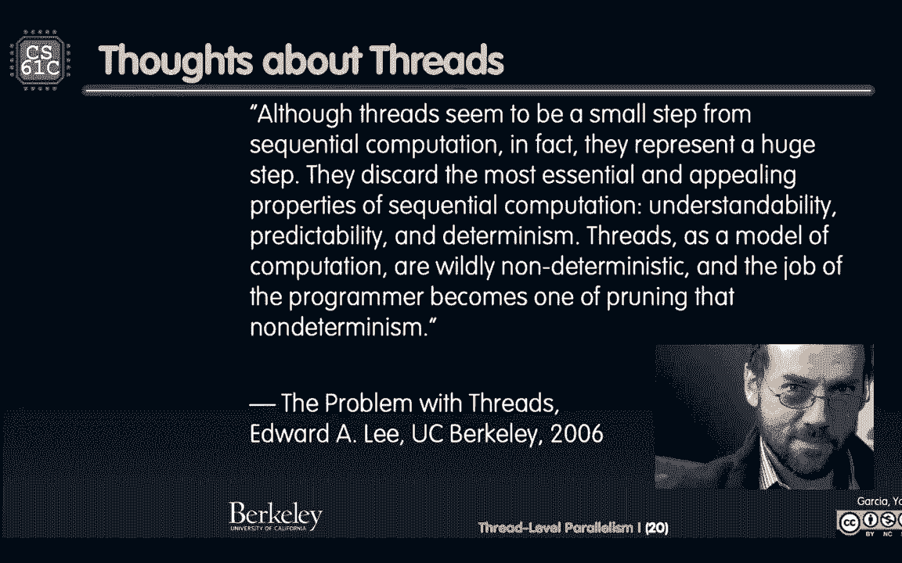

我只有两根手指，想象一下你有一千条线，全部同时运行，而这一切都完成了数字线程，六号，五十五，从头到尾，你的结果支持你吗，哦不不，这必须运行笑得很好，你是怎么做到的，这就是他所说的，你是怎么管理的。

如果程序中有任何数据依赖项，在有些事情必须发生之前，其他事情，这是最难的部分，这就是为什么这真的很难，东西，这就是为什么他们的PC都是关于如何支持支持，那个空间里的程序员，所以从另一个角度来看。

一六十二，了解更多关于这些东西的信息，从用户的角度，你做什么，什么样的幻觉，什么抽象，你提供给用户好吗，您希望给人一种同时有许多活动线程的错觉，独立于实际，它们正在成为，哪些软件线程正在成为硬件线程。

你想给他们一个用户，他们都在同时运行，第一，多路复用软件线程到硬件线程，意思是这是我的软件线程，得找出哪个映射到硬件线程，这就是操作系统现在要为我做的，OS也免费为我做什么，这是一种很酷的免费。

切换出阻塞的线程，所以你去缓存缓存是快的，你可以做一个指令循环，但有一个失误，现在你得去萨克拉门托，那将是一个漫长的等待，所以当我在等待的时候，我可能会把线换掉让别人抢那个位置。

所以把那个线程从硬件线程切换出去，暂停，让别人抓住它，在那里得到一些时间，哇哇哇，同时，我还是要去，这很有趣，你如何建造，怎么做，趁我还在萨克拉门托，为未切换的线程获取数据，所以这很复杂。

你是怎么做到的，你也可以有一个计时器，你可以说，让我们确保我们给一个计时器，每根线，你认识一个，你工作的每一毫秒，然后一毫秒我就会把你换到一份，这个，如果你有一千个请求，你只是八个人中的一个。

16个不同的硬件线程，你得给其他192个，有些爱，你不能让他们等到前八名结束，所以你得把它们调换一下，因为用户又一次认为它们都在同时运行，当你形成一千个软件线程，你以为你就不能说好吗。

第二天结束时的前八名，否，那是行不通的，你必须让他们认为他们都没有开关了，你要继续，可以从硬件线程中删除软件线程，请记住硬件线程仍在实际运行，通过中断执行删除它，它是什么状态？保存它的寄存器。

并将它的PC保存到内存中，所以你只需要把它拿出来储存在某个地方，你要把它储存在哪里，储存在记忆中，所以你现在去萨克拉门托，只是为了储存线程，那个有趣的怎么样，希望这是缓存，但你又一次得到了。

这也是一个问题，然后如何开始很好地执行一个新的软件线程，如果它在你加载之前就在运行，它是以前存储的状态，它的PC机和活动物理硬件的寄存器，PC和硬件寄存器，然后把它发射上去，好啦，跳到它的保险箱里。

PC，PC是它运行的地方，电脑说你那天在做什么，那是一种计数器，当前程序计数器的位置。

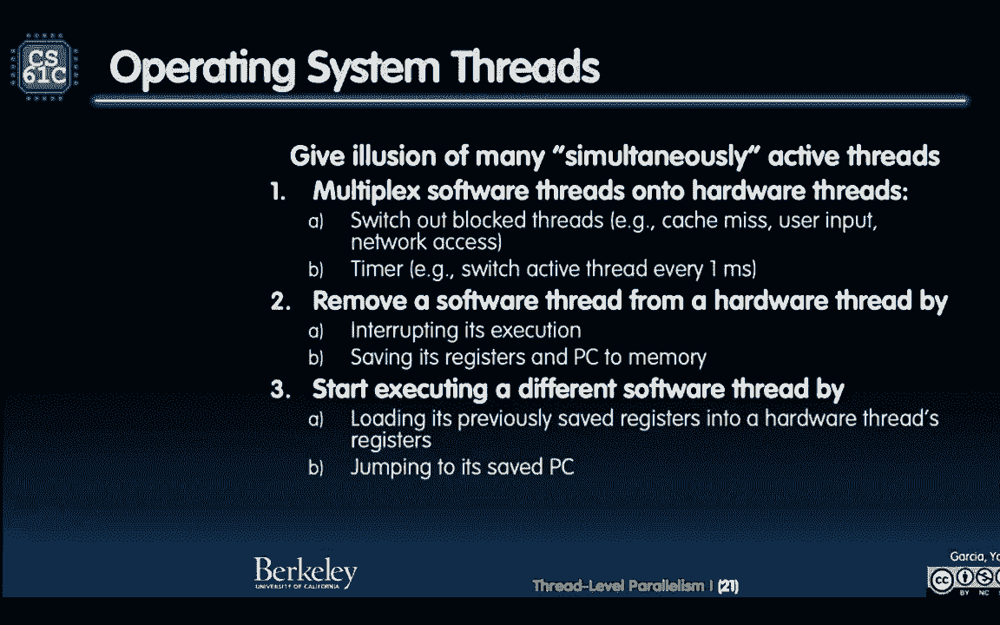

所有的事情都很复杂，你会学到比1962年更多的很酷的东西，这里有一个例子，四个核心是我在旁边列出的所有过程，如果我有四个核心，我的线程列表，都在上面竞争，是我的线程池，您的软件线程在线程池中。

你把它舀起来，你对他们说你今天要去五金店，你被选中了，你把他们扔进去，将它们映射到硬件线程，好啦，每个核心实际上一次运行一个指令流，就是这样，所以让我暂停一下，在我们明白之前，我有多个核心。

我们所有人的一大池，您作为用户，这就是程序，我说用户，我是说程序员，你是程序员，我要一千个活跃的线程，我不会就这样，假设我只跑到这里，硬件中的四个并发线程，我不打算拿前四个，让他们拥有整个空间。

直到他们完成，因为可能会有很多内存访问，可能是很多无所事事的等待，因为它可能不是很有效率，因为很多萨克拉门托人，你希望能够让用户认为，他们都是千人都在跑，所以我要抓紧时间，直到他们有点失速。

把它们弹出来，去拿其他的，所以用户说，哦耶，他们都得到了一点爱，你们都得到了一点爱，就是这个意思，但是每个核心一次运行一个指令流，问题是的，是呀，这是下一张幻灯片，你的问题很好，就像你说的。

每个核心一次可以有一个以上的线程，这正是下一组幻灯片的内容，亚尼亚号，就像一个伟大的源内存，所以喜欢如何如何如何，啊哈，那么如何知道何时交换硬件线程呢，你怎么知道该拖延什么正在发生。

你知道当一张卡被缓存击中时，我们看到一条电线说缓存命中或未命中，我们知道那根电线，所以我去做一个记忆请求，这是一个缓存雾，我知道会有处罚，试着得到它，也许还不算太糟，也许只有一二可能是一三。

可能总是去萨克拉门托，所以我知道那是个小姐，因为命中率不高，然后我知道这是一个机会，让我给一些其他的时间线索，所以使用缓存命中硬件让，你知道有一个缓存命中，这可能是一个切换线程的机会，问得好。

所以核心被用来，因为它还是会消耗很多，这是个好问题，这是个好问题，嗯我们要看的东西之一我看到了这个，但你最终会消耗力量，如果你换了很多，如果你总是处于零，什么都不做，你实际上消耗的能量更少。

所以如果在理论上如果你想象，我是说，这些核心仍在计算机上工作，数百个守护进程都在运行，需要访问，所以核心闲置的可能性很低，但想象一下在堕落的情况下，你可能有一个实际上没有什么作用的核心，电脑就像。

我喜欢，我在等硬件或地图给我，没人把它映射到我身上，也可能是模特，在未来，你有更多的硬件线程可以运行，软件线程的数量较少，但目前它更多的是软件而不是硬件，但是想象一下未来，他的软件和大量的硬件线程。

嗯就像在GPU里，也许什么的，如果我醒来无所事事，我只是说闲着是的，它比大量切换消耗更少的电力，你切换得越多，你能做的力量就越大，但只有一小部分你还在，你还是，你还在消耗一些能量，所以它比较少。

但不是很多，好啦，多线程。

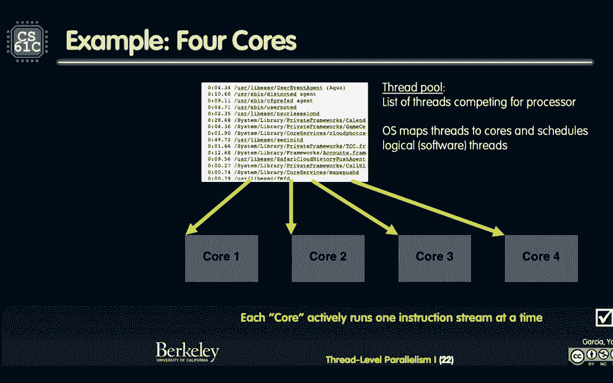

所以我有点导致，一个核心能同时运行两个线程吗，前情回顾2005年，我就像没有一个核心运行一个硬件线程。

你真的完蛋了，有趣的是，有一种想法叫做多线程，想法是这样的，活动线程，记住遇到缓存小姐，我们谈过，这是一个演员线程可能被踢出去的机会，所以它可能要等一千个循环德拉姆才能醒来，您可以运行另一个线程。

直到数据可用，我们很容易就谈到了你可以交换整个线程，但问题是，有什么问题，您可以保存当前线程状态并加载新线程状态，可能有很多寄存器，寄存器可能真的很宽，如果您使用大量SIMD寄存器。

你必须在不到一千个循环的时间内完成这个转换，因为如果你是如果开关本身需要一千多个循环，那你为什么要把它都换了，让我们跑到记忆恢复，硬件能帮忙吗，是呀，这就是我之前提到的，我们有很多晶体管，很多。

你能聪明地使用更多的晶体管吗，不如这样吧。

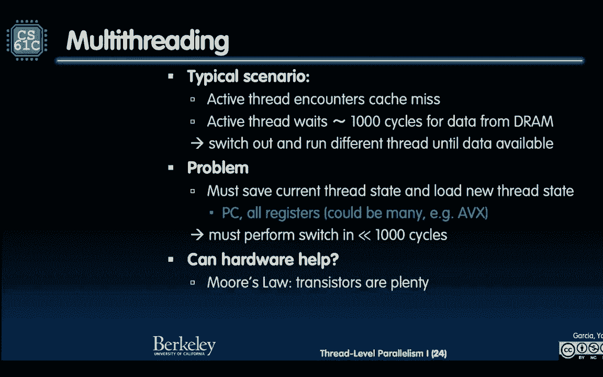

如果是你干的呢，这是一个核心，一个核心，不是两个核心，一个核心，左边的大箱子是一个核心，但是你可以在那个核心上运行两个线程，你需要什么，你得有更多的状态，整个州的移动很烦人，所以如果你有多酷。

这就是如果你只是添加了第二台PC和第二组寄存器，寄存器块很小，三十二乘三十二等于十，二十四位，这在模具上很小，里面有两份电脑寄存器，从……，这里有一件很酷的事情，我要介绍一个新词，从软件的角度来看。

它看起来和两个处理器一样，所以你想做一个抽象，你怎么告诉用户，你在下面，就像你在引擎室一样，全是汗，又热又油，就像泰坦尼克号之类的，你怎么告诉上面头等舱的人，下面真的有两个处理器，事实上。

你真的很家常有这张照片，你只有一个记忆，一个ALU，但从某种意义上说，你确实有第二台电脑，第二组寄存器，你可以假装你有两个并发的程序，只要你显然不想同时使用ALU，硬件辅助软件多线程，也称为超。

有很多这样的营销词，所以我们采用了，不幸的是，所有这些营销词他们用超线程这个词，所以如果你听到超线程这个词，它意味着硬件辅助软件多线程，这意味着这张照片，这只是一个核心。

但我们显然要对每一个核心都这样做，但这只是一个例子，理论上两个线程可以同时激活，只要他们不主动，使用ALU的人都在做，你知道的，写到相同的记忆区域什么的。

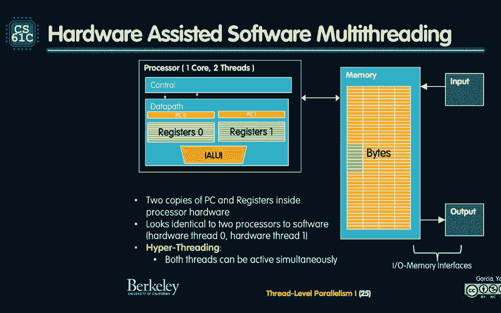

所以这是一张幻灯片，一张来自英特尔的幻灯片，展示了超线程是如何工作的，让我带你看看这张幻灯片，所以你有两个线程，红色的一根线，绿色的一根线，两根线，他们试图说明物理过程中发生了什么。

您仍然有一个物理处理器，有和没有超线程，在旧学校里没有快乐的穿线，线程一，红色的得先跑，然后绿色的会追着它跑，所以如果我考虑资源分配，这意味着您使用的是数据路径的哪一部分，缓存使用的内存的哪一部分。

你有时会看到它使用多次，但有时它是闲置的，你在等待，你在想，你看这些红色的方块，这里有很多蓝色的空块，另一个程序可能使用，如果我能弄清楚程序的顺序，也许我们用的另一个东西是无序执行。

也许你可以把幕后黑手弗雷德，但实际上拥有它，向前跳，并尝试重新安排一些硬件乱序执行中的教官，所以我的想法是，顺便说一句，你可以做到这一点，最大限度地减少我们在你的管道中谈到的停滞，或者你可以尝试优化。

您的超线程系统有多最佳，所以这个绿色的线，而不是等到红色的都做完了，实际上可以同时运行，如果你聪明点，也许一个小的重新排序，也许这就是编译器的工作，也许是在硬件上动态的，你在巧妙地移动这些。

也许这边有一个，但你在想怎么才能穿上绿色的，完成它的工作，吞噬所有空虚的忧郁，所有的忧郁都是空荡荡的，如果网格需要这些人，你真的可以让它发挥作用，所以它并不完美，意思是你不会总是得到两倍的进步。

但你实际上可以接近它，挺凉快的，所以我的想法是，同时多线程或超线程，意味着现在我们必须引入逻辑CPU的想法，有一个物理CPU说，你有多少个核心，那是物理CPU，逻辑是你能伪造多少。

你能告诉机舱上方头等舱的人，在泰坦尼克号上你有，我们将称之为逻辑CPU，因此每个线程在每个核心同时运行多个线程，我们说这是我在最后一张幻灯片中展示的艰难方式，每个线程都有自己的体系结构状态，PC寄存器。

等，您可以适当地共享资源，有一个完整的网站，对称多任务处理，多线程，对不起在华盛顿网站，我给你那里所以。

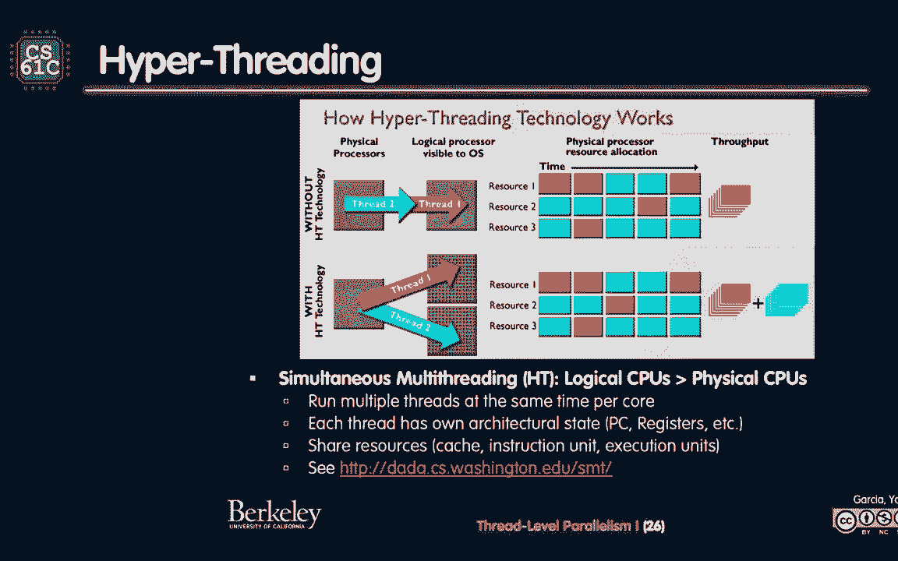

对这些逻辑意味着什么，现在我们要谈很多话，逻辑线程，你有一个硬件线程和软件线程，但现在你实际上有了这些逻辑线程，在逻辑CPU上运行，再多一点硬件，看那个，大部分硬件都是一样的，我是说。

我所做的只是添加了一些PC和一些寄存器，那只不过是，很酷的硬件，也许性能提高10%，因为这真的很难做到，有时候如果你真的是最佳人选，你可以得到几乎两倍的性能，但它非常，你知道的，我是说大约10%。

我们在这里，多核逻辑线程，所以这种风笛穿线不会给你一个两个X，但你知道在一个堕落的案例中，也许很接近那个，但大多数时候它都这么做，但还是更好，多核实际上有重复的处理器，重复核心，再多一点硬件。

但不是不去X更多的硬件，增加50%的硬件，和大约2倍的性能，如果他们独立工作，做得很好，所以说，如果你把它们结合起来，我们可以做得很好，机器对两者都有好处，我给你看一张照片，这就是我的电脑。

我把它装起来，我这里有最后一台笔记本电脑的号码，我不得不在最后一分钟改变它，如果我说是控制硬件，我有张单子上面写着，基本上我在戳硬件，说着，跟我说说你自己，硬件先生，你真可爱，嗨，我有八个物理CPU。

但我也支持十六岁，我也支持这个宽SIMD，它将告诉你的一切，所有这些都是为了了解情况，逻辑CPU，十六八核，16个线程可以同时运行，所有的一切都在那里，乔拉尼娅有个问题，这就是所有的操作系统，问题是。

谁决定映射操作系统是在超线程的最低级别上完成的，可能是硬件造成的，看说明书，说着，哦，我可以在这里做吗，也许我可以把它们重新排列一下，但不要太多，那是在较低的层次，但在软件层面是映射软件线程。

操作系统的工作是映射软件线程，到硬件线程，但在超线程的最低级别，那是最低级系统的工作，你不需要为他们担心，你可以考虑一下，嗯，我有16个核心，我真的没有，我有八个，但因为这些合乎逻辑的座位。

但我当然可以得到更多的表现。

好啦，来看看那个，让我们，让我们实际上，我是说，只是为了告诉你这是真的，这是英特尔W，就像，这是一年半前的幻灯片，但是天气很热，很新的花哨的机器，W3275m处理器，你能得到多少规格表。

我想在这里强调的规格是什么，核心数，你从后面的号码看不到，当然啦，上面写着28，线程数，前排写着什么，五十六，这就是超线程五六线程的想法，你可以在两个八个物理核心上同时运行，这是一个大的。

我们说的是效率，我们谈到了效率，我们谈到了性能，有一种他们称之为热设计功率的东西代表了以瓦特为单位的平均功率，处理器消散，我们在基频上工作，在英特尔定义的高复杂性工作负载下，所有核心都处于活动状态。

请参阅数据表，我的朋友不是移动设备，那不是移动CPU，这是一个需要，那应该放在你桌子的一边，拿着大扇子，把热量弄出来，两百瓦很热，好啦，那是件大事，这不是移动设备，但这是一个强大的。

不带囚犯性能驱动CPU五六逻辑线程，对于任何CPU问题都令人印象深刻，是呀，告诉我你的名字，走呀，走呀，现在有什么有趣的问题，也就是，哦男孩，我不是CPU设计师，但他们有点，我来猜猜。

它是设计师的一部分，一种新型CPU的制造设计，它需要一吨，我这么说是为了建立一个新的，一个新的晶圆厂，一个新的制造实验室，以新的工艺尺寸工作，工艺尺寸，在特定芯片上的两根电线有多小，我听说这是岩石定律。

就像10亿美元用于新的，这就像，你得在如何做到这一点上投入这么多，那么如何制造，那里有很多工程困难，设计也有挑战，因为当你把电线拉近时，你最后会说相声，还有其他元素你带来的东西现在很好。

这是一个坚实的一和一个坚实的零，现在他们有点，这将是一条高频线路，现在这是在翻转，什么的，有一些问题，当摩尔定律继续推动你时，能够有越来越小的工艺尺寸，很多物理学，很多量子物理学都在思考如何做到这一点。

原来你是这么想的，在过去的设计中，你根本不在乎，现在设计必须关心这一点，但你必须通过建造它来实现它，所以我想说我想说谁会赢，有一大堆困难的工程对话要进行，在它的设计和制造中，这是个很好的问题。

很好的问题，这里有一个关于一个特定系统的例子，该系统可能有六个核心，每个核心能够处理四个线程，假设你的系统里有超线程，同时可以做四件事，理论上，每个核心可以有四个逻辑线程，对于24个逻辑软件线程。

挺酷的。

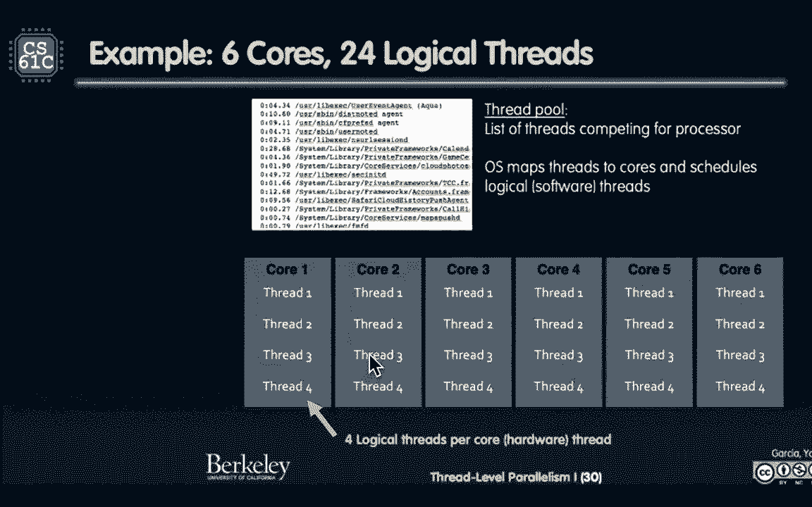

好啦，所以在我点击之前定义最后一张幻灯片，我喜欢这个点击问题，我想让每个人都插话，我们有时间做最后一件事就是复习，以下是一些定义，我们今天看到很多词，但希望不会太糟糕，一个头号线程，最重要的是。

这都是话题，这叫做线程级并行，我们说的是连续三堂关于威胁级别并行的课，但不知道什么是线，它是一系列指令，你以前叫它程序，我们称它为有自己的程序计数器和处理器状态的线程，例如，多核寄存器，是我们所看到的。

我们已经走了，我们知道为什么我们在2005年运行多核，你知道现在物理CPU的动机，它说每个CPU和软件操作系统开关一次处理一个线程，线程，通常是对碘事件的反应，就像磁盘读写或缓存中的内存丢失。

逻辑CPU允许在硬件中进行更细粒度的线程切换，用线程块，也许是缓存错过了超线程，也称为同时多线程，SMT允许超标量体系结构，超标量意味着多件事可以同时发生，体系结构支持在同一时间从不同的线程启动指令。

在法庭上的同一个CPU里，好吧，我们开始吧，这是整个系列到目前为止最好的问题。

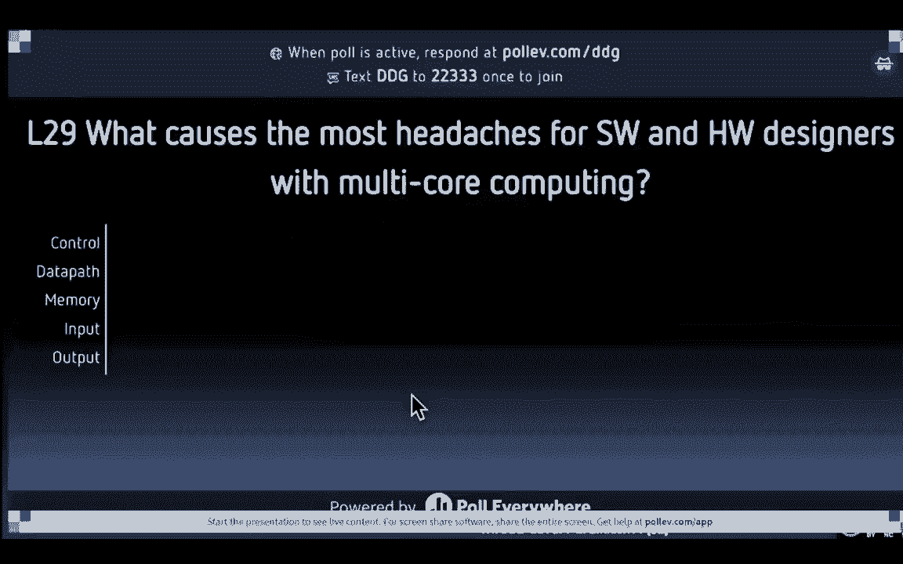

我喜欢这个问题，这让使用多核计算的软件和硬件设计师最头疼，好啦，所以我得到了电脑的五个部分，你以前见过，希望你能通过心脏控制，数据路径，内存输入输出，哪一种最头疼，因为我们现在已经走了，两千零五年。

就像，诅咒你空白，你在这里放的空白处是什么？诅咒你输入，诅咒你的数据路径，所有的软件和硬件设计师的针是什么，因为我们现在在这个CPU多核的世界里，称为控件的控件，逃跑，数据路径有一点动作，到目前为止。

没有人喜欢产出，如果我是个赌徒，我想说我现在喜欢控制记忆，但让我们看看这里会有什么，我们能得到更多的爱吗，更多的人投票，我不会的，我很想看到每个人都投票，包括在线的人，如果你在线，你还可以用这个。

只是提醒一下，文本ddg到二二三三三或polevy。com，砍DDG好吧，所以这里有点稳定，我们再去弄点来，好啦，有人想立案吗，为什么他们认为记忆是这样，你可能想，这里谁勇敢，亚当告诉我，为什么是记忆。

这是瓶颈，内存是共享资源，您有一个共享资源，这就是烦人的地方，丽莎和我很高兴能一起讲课，但只有一个遥控器，我们正在抓住它，我做了一个特别的市场，她不喜欢市场，我们不喜欢这样。

所以这是百分之百的记忆伙计们，它是共享资源，你们这些人，三分之二的人说干得好对你来说很好。

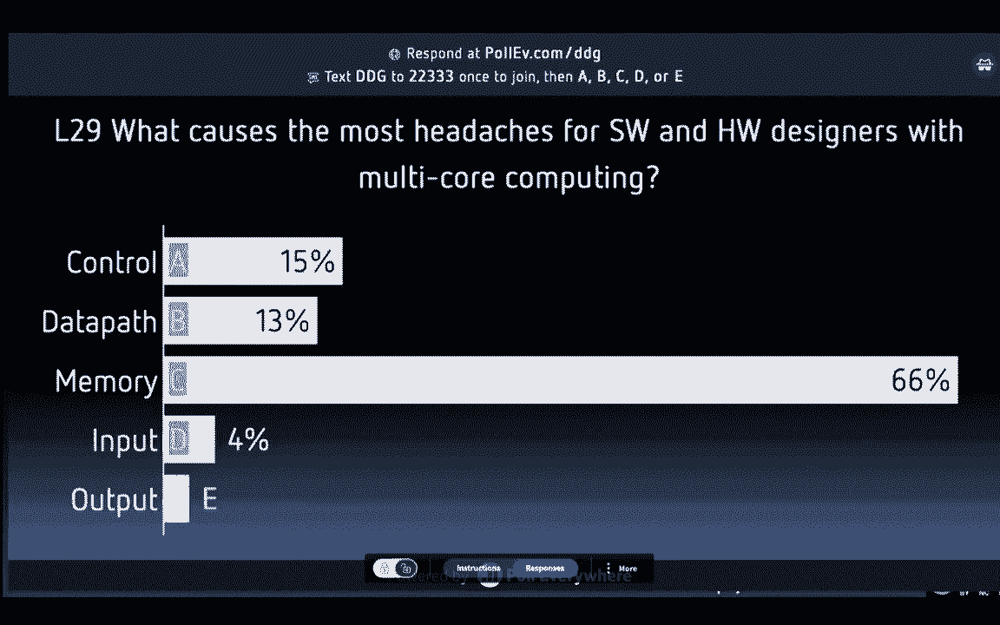

一张滑到这，总之，我们今天学到了很多，顺序软件执行速度有限，时钟速率持平或并行度下降，高性能要素，辛迪更宽，我们看到Mimi是线程级并行的向量，现在你知道MII中的M是什么意思了，医学博士是多个数据。

MI是多个指令，那是让我们学习的线索，这个情报有2个8 4 5 6线程，主要挑战，多进程高性能并行程序，随着数字进程的增加，那是规模。

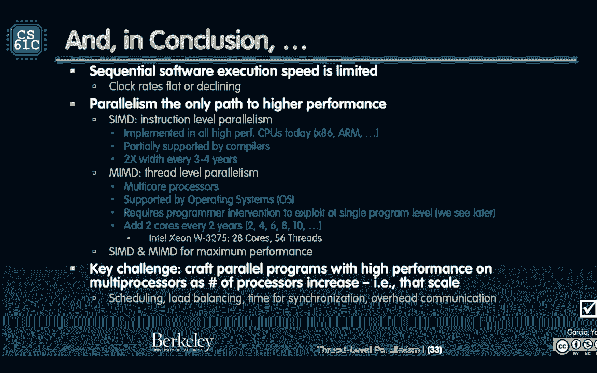

我还有最后一个开始给你，这是记住今天的万圣节，祝你万圣节快乐，诡计，Xor治疗是正确的措辞，你可以随意纠正，每个来你家的孩子，但在捣蛋和请客之间，这里有其他逻辑操作的选择，尽情享受吧。

