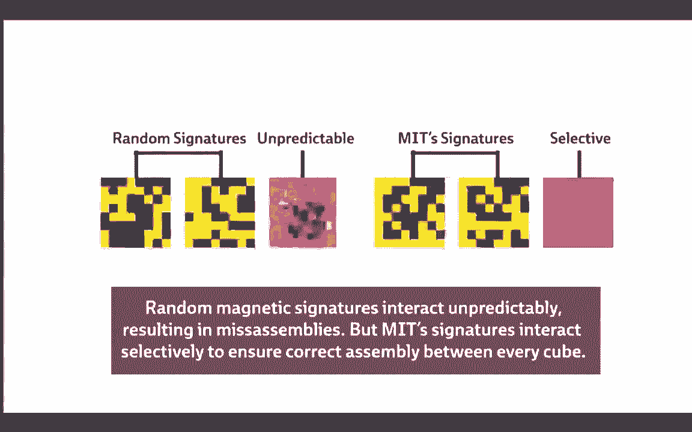

# 课程 P38：第29讲 - 线程级并行 I 🧵


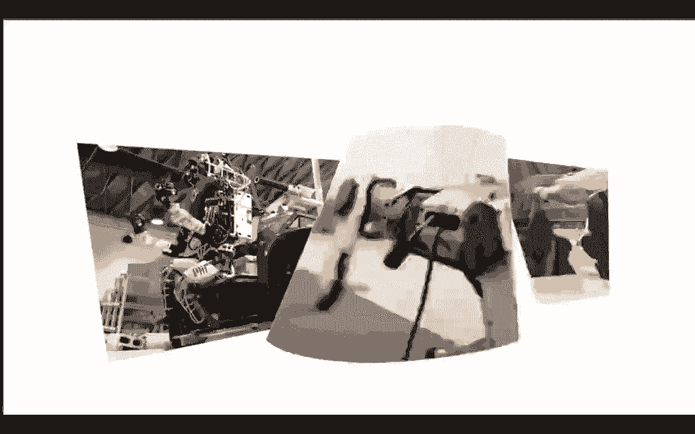

在本节课中，我们将要学习计算机体系结构中的一个核心概念：线程级并行。我们将探讨为什么需要并行计算、多核处理器的基本工作原理，以及线程的概念和挑战。

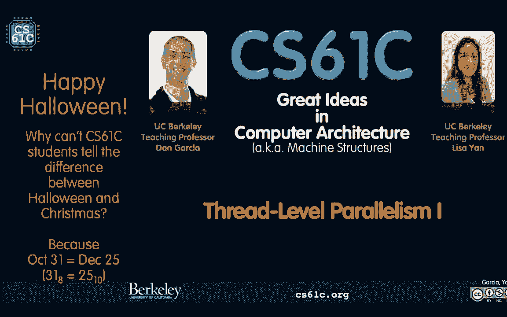


---

## 概述：为什么需要并行？

上一节我们回顾了性能提升的传统方法。本节中我们来看看为什么并行计算变得至关重要。


过去，我们通过提高时钟频率来提升性能。但这种方法遇到了瓶颈，因为过高的频率会导致发热和效率问题。目前，主流处理器的时钟频率大约在5GHz左右，很难再大幅提升。


另一个提升性能的方法是降低CPI（每条指令的时钟周期数）。我们通过流水线技术和更宽的寄存器（如SIMD指令）来实现这一点。然而，最根本的提升来自于**同时执行多个任务**，即并行计算。

**公式**：`总性能 ≈ 时钟频率 × (1/CPI) × 并行任务数`

当单个任务的速度无法再提升时，增加并行任务的数量就成为关键。这适用于处理相关任务（如矩阵计算的不同部分）或不相关任务（如服务器处理多个独立请求）。

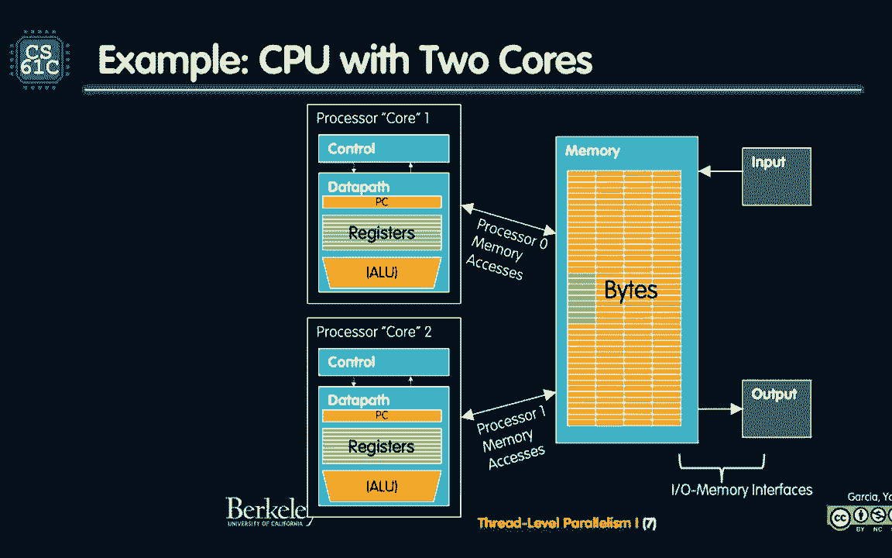


---

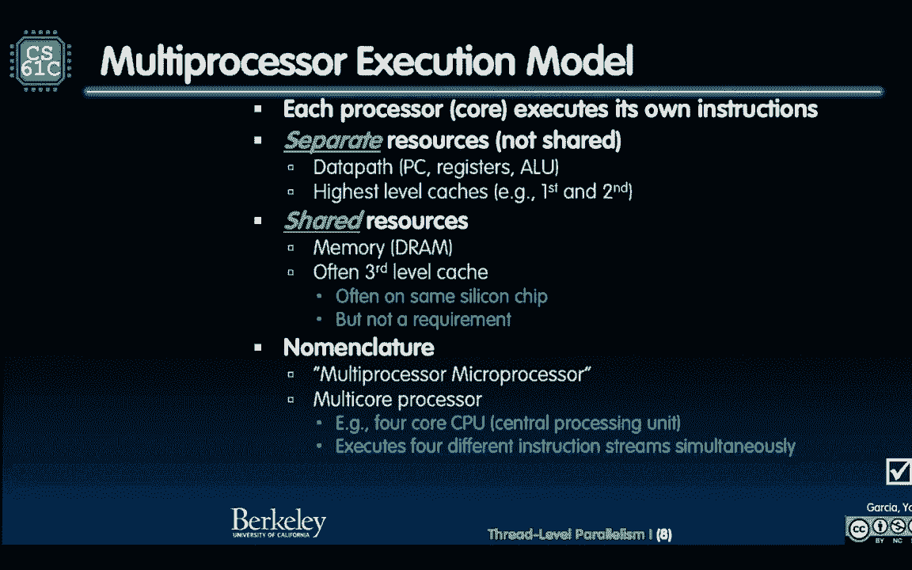


## 并行计算的发展历程

上一节我们提到了性能瓶颈。本节中我们来看看工程师们如何利用日益增多的晶体管来实现并行。

摩尔定律指出，集成电路上的晶体管数量大约每两年翻一番。虽然单核性能停滞，但晶体管数量仍在增长。工程师们利用这些额外的晶体管，不是去制造更快的单核，而是去制造**更多的核心**。

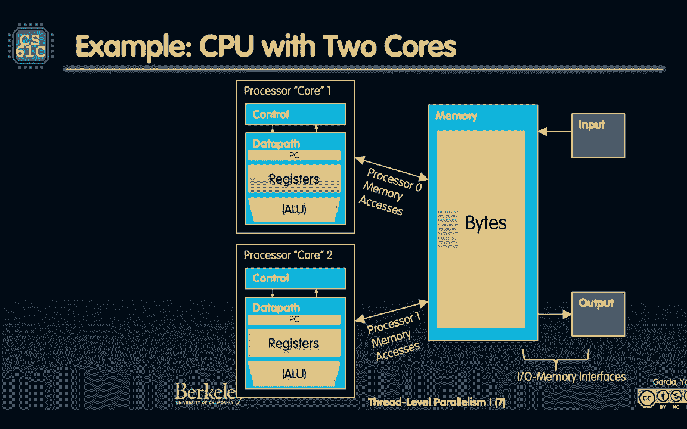

*   **2005年是一个转折点**：从追求更高的单核频率，转向在多核处理器上运行并行程序。
*   **多核处理器**：将多个独立的CPU核心集成在同一块芯片上。每个核心都有自己的控制单元、数据路径（ALU、寄存器）和缓存（L1、L2）。它们共享最后一级缓存（L3）和主内存。
*   **现代示例**：如今的手机芯片（如苹果A系列）可能包含六核CPU、四核GPU和专门的神经处理引擎，共同协作处理复杂任务。


---

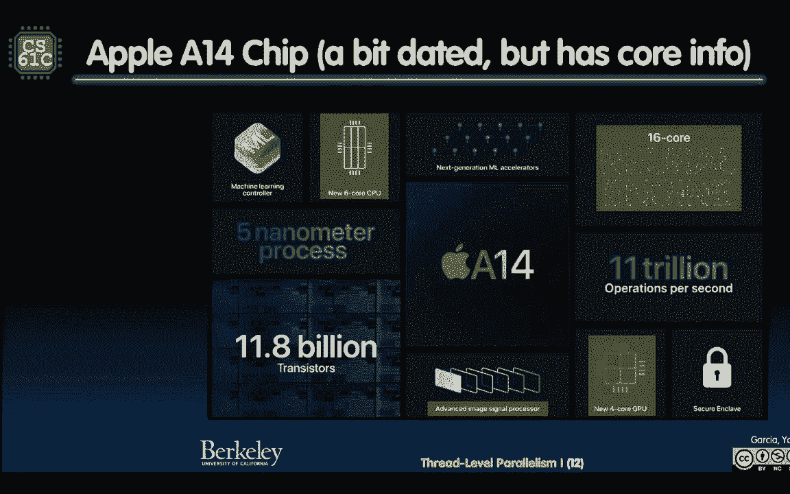

## 核心概念：线程

上一节我们介绍了多核硬件。本节中我们来看看软件如何利用这些硬件：通过线程。

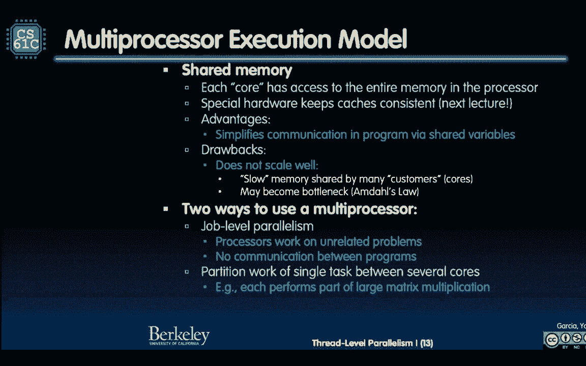

**线程**是一个**独立的指令执行流**。它拥有自己的程序计数器（PC）和处理器状态（寄存器值）。一个程序可以分成多个线程来并行执行不同部分。

需要区分两个关键概念：
*   **软件线程**：程序员或操作系统请求创建的线程。数量可以非常多。
*   **硬件线程**：在物理核心上实际执行的线程。数量受限于物理核心数。

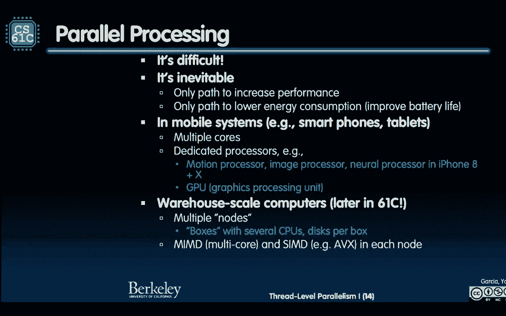

操作系统的工作是将大量的软件线程**复用**到有限的硬件线程上。当一个线程因等待内存数据（缓存未命中）而停滞时，操作系统可以快速将其切换出去，让另一个就绪的线程运行，从而保持硬件忙碌，给用户所有线程都在同时运行的错觉。

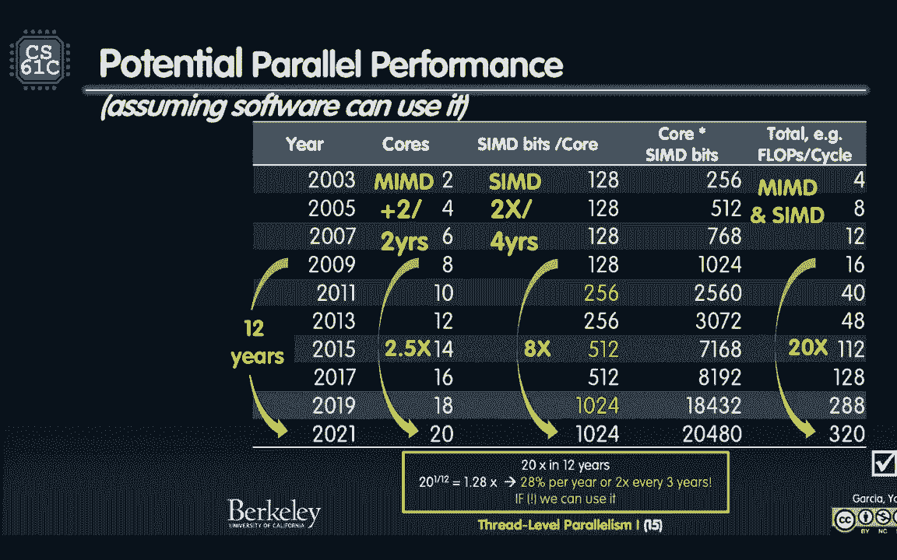

**代码概念**：
```c
// 伪代码：一个程序创建两个线程来分别处理任务
create_thread(process_task_A); // 软件线程1
create_thread(process_task_B); // 软件线程2
// 操作系统决定这两个软件线程如何映射到物理核心上运行
```


---

## 挑战：非确定性与共享资源

上一节我们了解了线程的基本原理。本节中我们来看看并行编程带来的主要挑战。

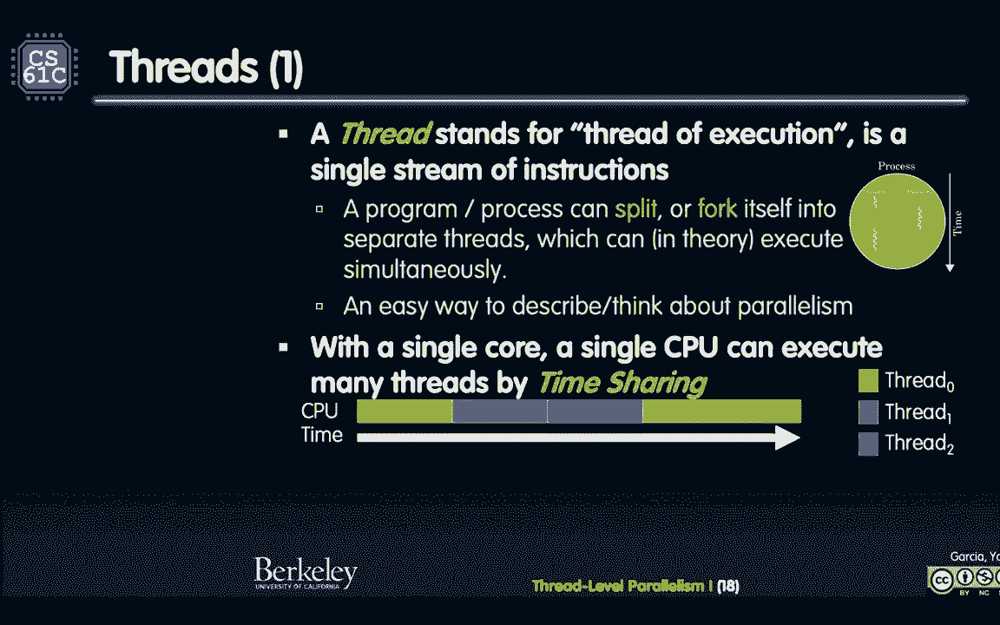

当多个线程并行执行时，它们的指令交错顺序是不确定的。这引入了**非确定性**。如果线程之间需要通信或共享数据，程序员必须小心地协调它们，以确保结果的正确性。正如Edward Lee教授所言：“线程作为计算模型是非常不确定的，程序员的工作变成了修剪这种不确定性。”


最大的挑战来自于**共享资源**，尤其是**共享内存**。当多个核心/线程同时访问和修改同一块内存区域时，会引发数据竞争和一致性问题。

以下是多核系统中主要的共享资源冲突点：
1.  **内存（Memory）**：多个核心通过共享总线或互连访问同一主内存，容易成为瓶颈。
2.  **最后一级缓存（如L3 Cache）**：被所有核心共享，可能发生争用。
3.  **数据路径（DataPath）**：在超线程中，单个核心的ALU等资源可能被多个逻辑线程争用。
4.  **控制（Control）**：涉及线程调度和同步的开销。
5.  **输入/输出（I/O）**：通常有专门的控制器管理，争用相对较少。

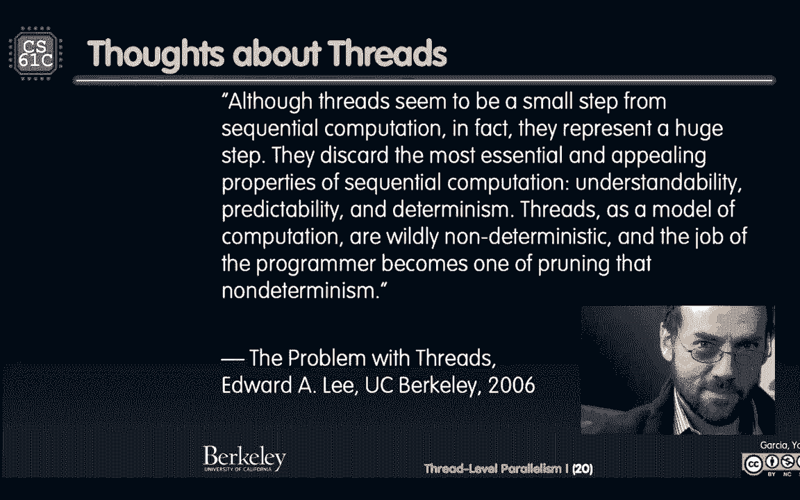

在这些选项中，**共享内存**是软件和硬件设计师最头疼的问题，因为它是通信和协调的基础，也是最容易引发性能瓶颈和正确性问题的部分。

---


## 硬件辅助：同时多线程（超线程）

上一节我们讨论了线程切换的开销。本节中我们来看看硬件如何帮助更高效地运行多个线程。

传统的线程切换（上下文切换）需要保存和恢复大量寄存器状态，开销较大。**同时多线程**（Simultaneous Multi-Threading, SMT），在英特尔处理器上常被称为**超线程**（Hyper-Threading），是一种硬件优化。


其核心思想是：在单个物理核心内，复制一份**体系结构状态**（如PC和寄存器组），使得从软件角度看，好像存在两个“逻辑核心”。这样，当一个线程因内存访问而停顿时，另一个线程可以立刻使用ALU等执行资源，而无需进行完整的上下文切换。


*   **物理CPU核心**：硬件上真实存在的处理单元。
*   **逻辑CPU核心**：通过SMT技术呈现给操作系统的“虚拟”核心。例如，一个8核CPU支持超线程后，操作系统可能看到16个逻辑核心。


**注意**：SMT并不能带来成倍的性能提升（通常远低于2倍），因为它共享了核心内部的大部分执行资源。但它能更充分地利用这些资源，提升整体吞吐量，特别是在线程经常停滞等待的情况下。

---


## 总结与展望

本节课中我们一起学习了线程级并行的基础知识。

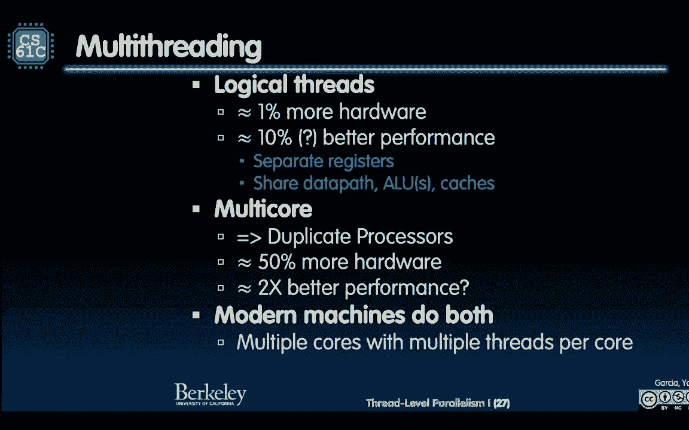

我们了解到，由于时钟频率提升的瓶颈，并行计算成为持续提升性能的必由之路。**多核处理器**通过在单芯片上集成多个核心来实现硬件并行。在软件层面，**线程**是并行执行的基本单位，操作系统负责将众多软件线程调度到有限的硬件线程上执行。

我们探讨了并行编程的核心挑战：**非确定性**和**共享资源（尤其是内存）的争用**。同时，也介绍了**同时多线程（超线程）** 这种硬件技术，它通过更细粒度的资源共享来提升单个核心的利用率。

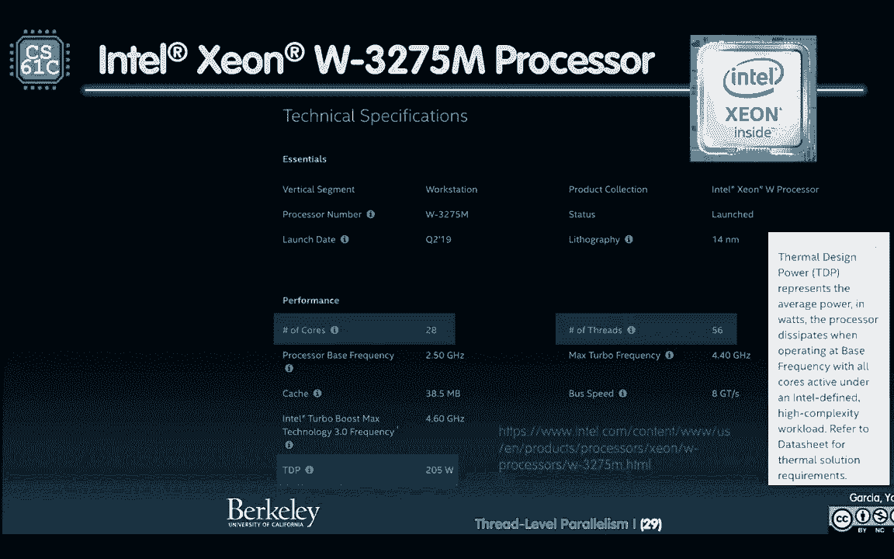


记住我们的口头禅：**“过早优化是万恶之源”**。在编写并行程序时，首先确保程序的正确性，然后再考虑优化其并行性能。


下节课，我们将深入探讨多线程编程中最为棘手的问题：**如何管理共享内存，以及如何保持缓存一致性**。

---

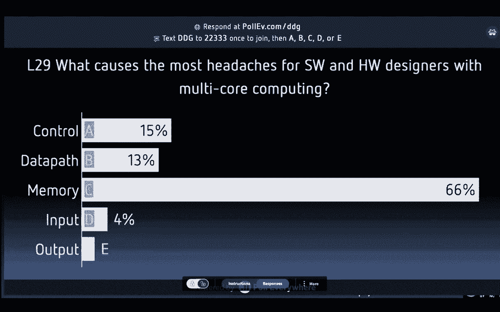


祝你万圣节快乐！🎃
（附：一个计算机风格的万圣节玩笑：为什么61不能和C学生区分万圣节和圣诞节？因为Oct 31 == Dec 25！(八进制31等于十进制25)）