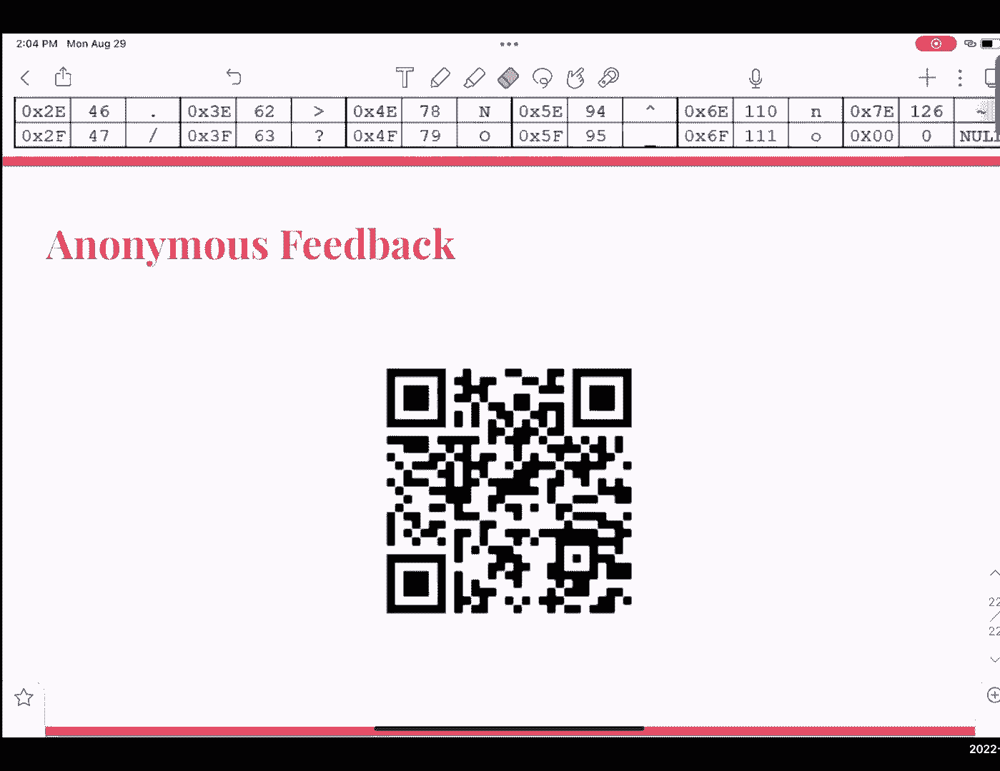

# 课程 P4：讨论课 1 - 数字表示法 💻

在本节课中，我们将学习计算机如何表示数字。理解数字表示法是学习计算机科学的基础，因为计算机中的所有信息，无论是程序代码还是数据文件，最终都以数字形式存储。我们将从不同进制之间的转换开始，然后探讨几种在计算机系统中表示数字的具体方法。

## 概述 📋

本次讨论课将涵盖以下核心内容：
1.  二进制、十进制和十六进制之间的转换。
2.  有符号数的几种表示方法：符号-数值表示法、反码和补码。
3.  偏移编码的原理和应用。

讨论课是可选参加的，但我们强烈建议你参与。你可以尝试不同的讨论班，找到最适合自己学习风格的助教。所有讨论课的核心目标是一致的：帮助你掌握课程练习、复习知识，并为考试做好准备。

---

## 数字系统基础

在深入具体表示法之前，我们需要理解计算机使用的基本数字系统。计算机使用二进制，这意味着所有数字都以 2 为基数。

### 二进制 (Binary)

*   **定义**：二进制数字中的每一位（bit）只能是两个值之一：`0` 或 `1`。
*   **位值**：一个二进制数中，每一位代表不同的 2 的幂次方。最右边的位是最低有效位（LSB），代表 `2^0`；最左边的位是最高有效位（MSB），代表 `2^(n-1)`（n 是总位数）。
*   **表示范围**：一个 n 位的二进制数最多可以表示 `2^n` 个不同的数。
*   **单位**：
    *   4 位 = 1 个半字节 (nibble)
    *   8 位 = 1 个字节 (byte)
*   **前缀**：二进制数通常以 `0b` 作为前缀，例如 `0b1011`。

### 十六进制 (Hexadecimal)

*   **定义**：十六进制以 16 为基数。它比二进制更紧凑，对人眼更友好。
*   **数字**：使用数字 0-9 和字母 A-F（代表 10-15）。
*   **与二进制关系**：**1 个十六进制数字正好等于 4 位二进制（1 个半字节）**。这是两者转换的关键。
*   **前缀**：十六进制数通常以 `0x` 作为前缀，例如 `0x1A3F`。

---

## 进制转换

上一节我们介绍了二进制和十六进制的基本概念，本节中我们来看看如何在不同的进制之间进行转换。

### 二进制与十进制互转

**二进制转十进制**
方法是计算所有值为 `1` 的位所对应的 2 的幂次方之和。
**公式**：`十进制数 = Σ(位值_i × 2^i)`，其中 `位值_i` 是第 i 位（从右往左，从0开始计数）的值（0或1）。

**示例**：将 `0b1101001` 转换为十进制。
1.  从右向左标记位索引和对应的幂：`2^0`, `2^1`, `2^2`, `2^3`, `2^4`, `2^5`, `2^6`。
2.  值为 `1` 的位是：`2^6` (64), `2^5` (32), `2^3` (8), `2^0` (1)。
3.  求和：`64 + 32 + 8 + 1 = 105`。

**十进制转二进制**
方法是找到构成该十进制数的 2 的幂次方组合。
**步骤**：
1.  找到小于或等于该十进制数的最大 2 的幂次方。
2.  将该数减去这个幂值。
3.  对得到的差重复步骤 1 和 2，直到差为 0。
4.  所有被用到的幂次方对应的位设为 `1`，其他位设为 `0`。

**示例**：将 105 转换为二进制。
1.  小于 105 的最大 2 的幂是 `2^6 = 64`。`105 - 64 = 41`。
2.  小于 41 的最大 2 的幂是 `2^5 = 32`。`41 - 32 = 9`。
3.  小于 9 的最大 2 的幂是 `2^3 = 8`。`9 - 8 = 1`。
4.  小于 1 的最大 2 的幂是 `2^0 = 1`。`1 - 1 = 0`。
5.  用到的幂是 `2^6`, `2^5`, `2^3`, `2^0`。因此二进制表示为 `0b1101001`。

### 二进制与十六进制互转

**二进制转十六进制**
关键是将二进制数从右向左（从 LSB 到 MSB）按 4 位一组（半字节）进行分组，然后将每个半字节转换为对应的十六进制数字。
**步骤**：
1.  从二进制数的最右边开始，每 4 位分成一组。如果最左边一组不足 4 位，则在**左侧**补 `0`。
2.  将每个 4 位二进制组转换为对应的十六进制数字（使用参考表）。

**示例**：将 `0b01101100` 转换为十六进制。
1.  从右向左分组：`1100` (C), `0110` (6)。左边不足4位，补0成为 `0110`。
2.  结果为 `0x6C`。

**十六进制转二进制**
过程与上面相反：将每个十六进制数字扩展为对应的 4 位二进制形式，然后连接起来。
**示例**：将 `0x6C` 转换为二进制。
1.  `6` -> `0110`, `C` -> `1100`。
2.  连接起来：`0b01101100`。

### 十进制与十六进制互转

通常以二进制作为中间桥梁进行转换。
*   **十进制转十六进制**：先将十进制数转换为二进制，再将二进制数转换为十六进制。
*   **十六进制转十进制**：先将十六进制数转换为二进制，再将二进制数转换为十进制。

---

## 有符号数的表示方法

我们已经学会了如何表示正整数（无符号数）。但在实际应用中，我们需要表示负数。以下是几种常见的表示方法。

### 符号-数值表示法 (Sign-Magnitude)

在这种方法中，最高有效位（MSB）被用作符号位（`0` 表示正，`1` 表示负），剩余的位表示数值的大小（绝对值）。

**示例**：用 4 位表示 `-2` 和 `+2`。
*   `-2`: 符号位为 `1`，绝对值 `2` 的二进制为 `010`。所以表示为 `1010`。
*   `+2`: 符号位为 `0`，绝对值 `2` 的二进制为 `010`。所以表示为 `0010`。

**特点与问题**：
*   **范围**：对于 n 位，可表示的范围是 `-(2^(n-1)-1)` 到 `+(2^(n-1)-1)`。
*   **存在两个零**：`+0` (`0000`) 和 `-0` (`1000`)。这浪费了一个编码，并且在硬件设计中需要额外处理。

### 反码表示法 (Ones‘ Complement)

反码现在较少使用，但理解它有助于学习补码。正数的反码与其二进制原码相同。负数的反码是其对应正数**按位取反**（`0`变`1`，`1`变`0`）的结果。

**示例**：用 4 位表示 `-7`。
1.  `+7` 的二进制是 `0111`。
2.  按位取反得到 `1000`，这就是 `-7` 的反码表示。

**特点与问题**：
*   **范围**：与符号-数值法相同，`-(2^(n-1)-1)` 到 `+(2^(n-1)-1)`。
*   **同样存在两个零**：`0000` (+0) 和 `1111` (-0)。

### 补码表示法 (Two‘s Complement)

这是现代计算机中最常用的有符号整数表示方法。正数的补码与其二进制原码相同。负数的补码是其对应正数**按位取反后加 1** 的结果。

**示例**：用 4 位表示 `-7`。
1.  `+7` 的二进制是 `0111`。
2.  按位取反：`1000`。
3.  加 1：`1001`。这就是 `-7` 的补码表示。

**特点与优势**：
*   **只有一个零**：`0000`。所有位为 `1` 表示 `-1` (`1111`)。
*   **范围**：对于 n 位，可表示的范围是 `-2^(n-1)` 到 `+(2^(n-1)-1)`。负数比正数多一个（因为 `0` 占用了正数区间的一个编码）。
*   **运算方便**：加法和减法可以使用同一套加法器电路完成，无需特殊处理符号位。
*   **溢出判断**：当两个正数相加结果为负，或两个负数相加结果为正时，发生了溢出。

**补码的数值计算**：
在补码中，最高位（MSB）的权重是 `-2^(n-1)`，其余位的权重与无符号二进制相同。
**示例**：`1001` (4位补码) 的值计算：
`1 × (-2^3) + 0 × 2^2 + 0 × 2^1 + 1 × 2^0 = -8 + 1 = -7`。

---

## 偏移编码 (Biased Encoding)

偏移编码是一种通过添加一个固定偏移值（bias）来移动数字线的表示方法。它常用于浮点数标准的指数部分。

**原理**：
1.  选择一个偏移量 `B`。
2.  要表示的数值 `X`，其存储的二进制码 `M` 满足：`M = X + B`。
3.  解码时：`X = M - B`。

**目的**：
*   将需要表示的数值范围（例如从 `-127` 到 `128`）映射到无符号数的范围（`0` 到 `255`）。
*   这样，比较器电路可以直接对编码后的无符号数进行比较，结果与对原数的比较结果一致。

**标准偏移量**：
对于 k 位，常见的标准偏移量是 `B = 2^(k-1)` 或 `2^(k-1)-1`。
*   当 `B = 2^(k-1)-1`（例如 8 位时 `B=127`），编码后的范围 `0` 到 `255` 对应原值范围 `-127` 到 `128`。
*   当 `B = 2^(k-1)`（例如 8 位时 `B=128`），编码后的范围 `0` 到 `255` 对应原值范围 `-128` 到 `127`。

**示例**：使用 8 位和偏移量 `B=127` 表示 `-42`。
1.  计算存储值：`M = -42 + 127 = 85`。
2.  将 `85` 以无符号二进制存储：`01010101`。
3.  解码时：`X = 85 - 127 = -42`。

---

## 总结 🎯

本节课中我们一起学习了计算机中数字表示的核心知识：
1.  **进制转换**：掌握了二进制、十进制和十六进制之间相互转换的方法，这是理解所有数字表示的基础。
2.  **有符号数表示**：重点理解了最常用的**补码**表示法，它通过“取反加一”来表示负数，消除了“两个零”的问题，并简化了硬件运算。同时，我们也了解了符号-数值法和反码法作为历史背景。
3.  **偏移编码**：学习了通过添加一个固定偏移量，将有符号数范围映射到无符号数范围的技术，这在浮点数表示中至关重要。

记住，相同的二进制位序列，在不同的表示法（无符号、补码、偏移编码）下，会解释为完全不同的数值。理解上下文和所使用的约定是关键。这些概念是后续学习计算机算术、数据存储和浮点数的基础。