# 课程 P40：第30讲：并行性 II - OpenMP ä¸å…±äº«é—®é¢˜ 🔄

在本节课中，我们将学习线程级并行性的第二部分，é‡ç‚¹ä»‹ç» OpenMP 这一并行编程库，并æ¢è®¨åœ¨å…±äº«å†…存编程中å¯èƒ½é‡åˆ°çš„“ç«äº‰æ¡ä»¶â€ç­‰æ ¸å¿ƒé—®é¢˜ã€‚


---


## 并行编程语言概览 🗺ï¸

上一节我们介ç»äº†çº¿ç¨‹çº§å¹¶è¡Œæ€§çš„基本概念。本节中我们æ¥çœ‹çœ‹æ”¯æŒå¹¶è¡Œç¼–程的ä¸åŒè¯­è¨€å±‚次。

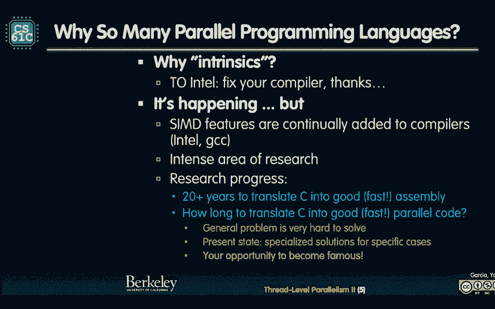

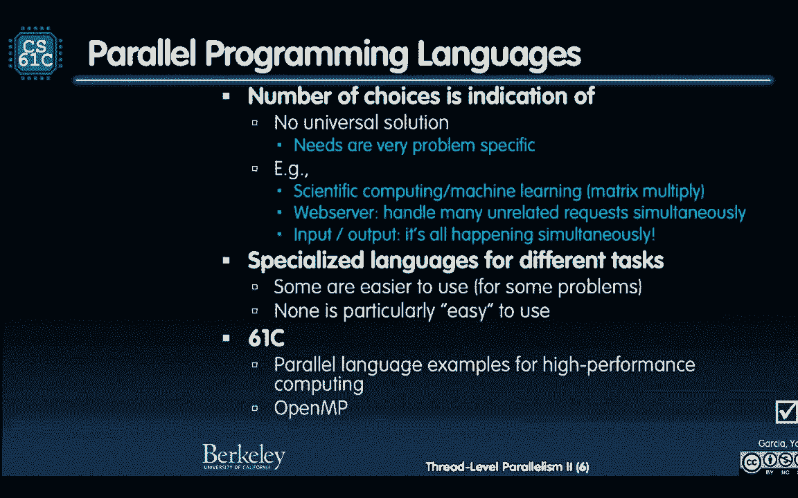

并行编程å¯ä»¥åœ¨ä¸åŒå±‚次上进行，例如æ§åˆ¶å¤šå°æœºå™¨æˆ–æ§åˆ¶å•ä¸ªæœºå™¨çš„多个核心。目å‰å­˜åœ¨å¤§çº¦40多ç§æ”¯æŒå¹¶è¡Œç¼–程的语言。


以下是选择编程语言时需è¦è€ƒè™‘的一些因素：
*   **æ˜ç¡®æ§åˆ¶ä¸é«˜çº§æŠ½è±¡**ï¼šåƒ C 这样的语言å…许程åºå‘˜æ˜ç¡®æ§åˆ¶ç¡¬ä»¶æ“作（例如，如何将数æ®ä»ä¸€ä¸ªéƒ¨åˆ†ç§»åŠ¨åˆ°å¦ä¸€ä¸ªéƒ¨åˆ†ï¼‰ã€‚è€Œåƒ Python 这样的高级语言则更关注“è¦åšä»€ä¹ˆâ€ï¼Œç”±ç¼–译器或è¿è¡Œæ—¶ç³»ç»Ÿå†³å®šâ€œå¦‚何åšâ€ã€‚
*   **任务类å‹å·®å¼‚**：ä¸åŒçš„应用领域（如科学计算ã€ç½‘络æœåŠ¡å™¨ï¼‰å¯¹å¹¶è¡Œæ€§çš„需求ä¸åŒã€‚
*   **输入/输出（I/O）处ç†**：I/O æ“作通常是异步和ä¸å¯é¢„测的，这本身就是一ç§å¹¶å‘问题，需è¦ç‰¹å®šçš„语言特性æ¥å¤„ç†ã€‚

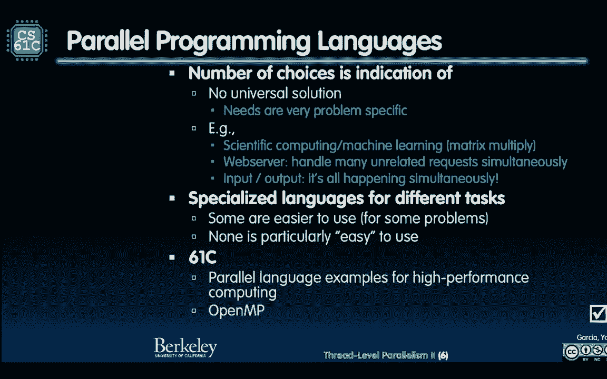

在 CS61C 课程中，我们é‡ç‚¹ä½¿ç”¨ C 语言，并引入 **OpenMP** 库æ¥å¸®åŠ©æˆ‘们利用多核处ç†å™¨è¿›è¡Œå¹¶è¡Œè®¡ç®—。


---


## 什么是 OpenMP？ 🧵

OpenMP 是一个支æŒå…±äº«å†…存并行编程的 C 语言扩展。它的主è¦ä¼˜ç‚¹æ˜¯å…许程åºå‘˜é€šè¿‡æœ€å°‘的代ç ä¿®æ”¹æ¥å®ç°å¹¶è¡ŒåŒ–。

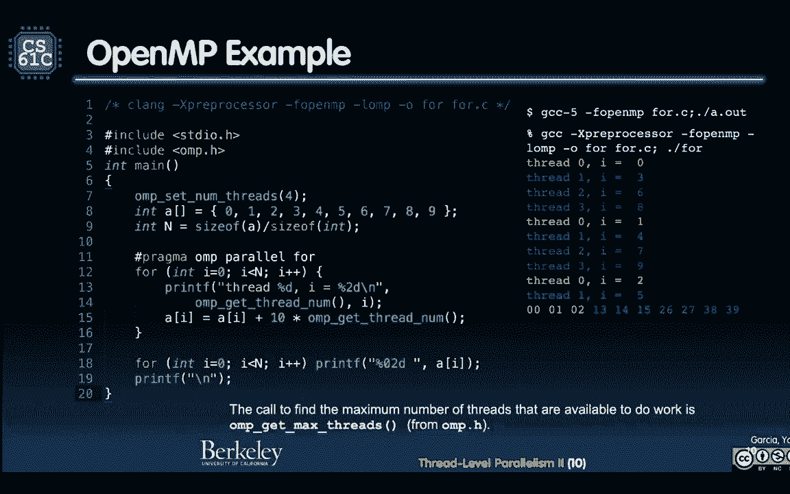

其核心æ€æƒ³æ˜¯ä½¿ç”¨ **编译指导语å¥**。这些语å¥ä»¥ `#pragma omp` 开头，对äºä¸æ”¯æŒ OpenMP 的编译器æ¥è¯´ï¼Œå®ƒä»¬ä¼šè¢«å¿½ç•¥ã€‚åªæœ‰å½“你包å«äº† OpenMP 头文件并å¯ç”¨äº†ç›¸åº”编译选项时，这些语å¥æ‰ä¼šç”Ÿæ•ˆã€‚

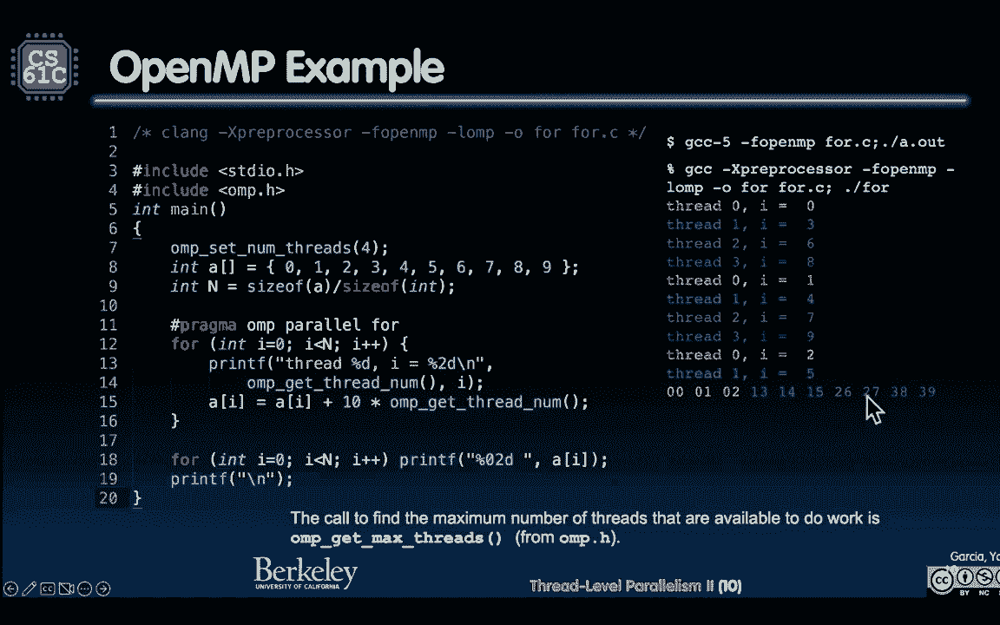

OpenMP 采用 **fork-join** 并行执行模å‹ï¼š
1.  程åºå¼€å§‹æ—¶åªæœ‰ä¸€ä¸ªä¸»çº¿ç¨‹ã€‚
2.  é‡åˆ°å¹¶è¡ŒåŒºåŸŸæ—¶ï¼Œä¸»çº¿ç¨‹â€œæ´¾ç”Ÿâ€å‡ºä¸€ç»„工作线程。
3.  所有线程在并行区域内执行代ç ã€‚
4.  并行区域结æŸæ—¶ï¼Œæ‰€æœ‰å·¥ä½œçº¿ç¨‹â€œåˆå¹¶â€ï¼Œåªå‰©ä¸‹ä¸»çº¿ç¨‹ç»§ç»­æ‰§è¡Œã€‚


线程是æ“作系统调度的软件å®ä½“，它们被映射到硬件核心上执行。为了è·å¾—准确的性能测试结æœï¼Œåº”ç¡®ä¿åœ¨è¿è¡Œå¹¶è¡Œç¨‹åºæ—¶ï¼Œç³»ç»Ÿè´Ÿè½½è¾ƒä½ã€‚

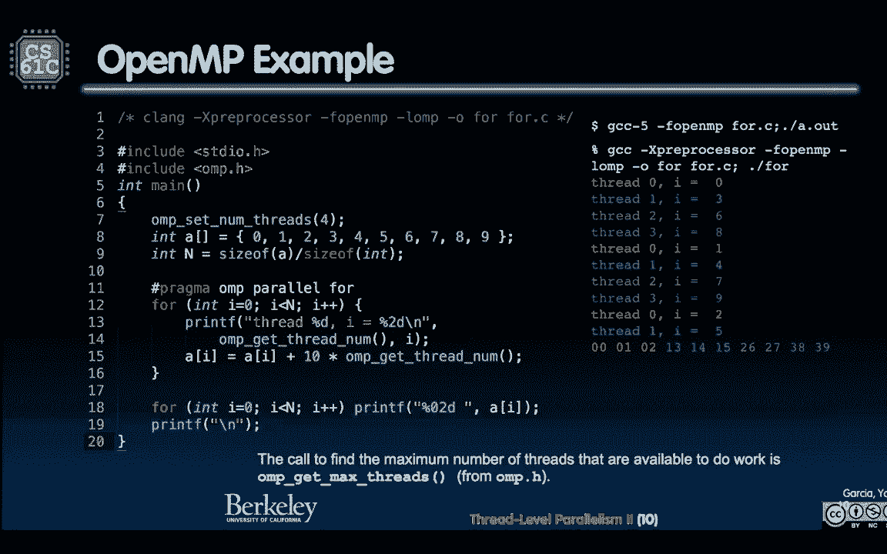


---

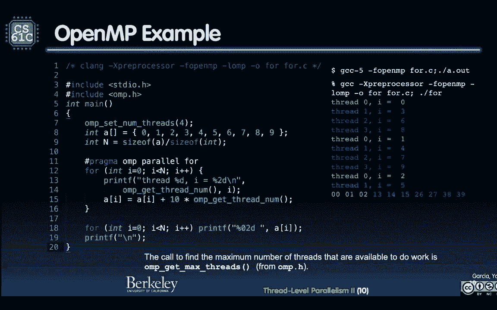

## 使用 OpenMP å¹¶è¡ŒåŒ–å¾ªç¯ ğŸ”„


一个é常常è§çš„并行模å¼æ˜¯å¹¶è¡ŒåŒ– `for` 循ç¯ã€‚å‡è®¾æˆ‘ä»¬æœ‰ä¸€ä¸ªä» 0 到 99 的循ç¯ï¼Œåœ¨æ‹¥æœ‰ 4 个核心的系统上，ç†æƒ³æƒ…况是将迭代空间大致平å‡åœ°åˆ†ç»™ 4 个线程执行。

使用 OpenMP å¯ä»¥æ其简å•åœ°å®ç°è¿™ä¸€ç‚¹ã€‚以下是一个基本示例：


```c
#include <stdio.h>
#include <omp.h>

int main() {
    omp_set_num_threads(4); // 建议使用4个线程
    int a[10];
    int n = 10;

    #pragma omp parallel for
    for (int i = 0; i < n; i++) {
        int thread_id = omp_get_thread_num();
        a[i] = i + thread_id * 10;
        printf("Thread %d: a[%d] = %d\n", thread_id, i, a[i]);
    }

    // 打å°ç»“æœ
    for (int i = 0; i < n; i++) {
        printf("%d ", a[i]);
    }
    printf("\n");
    return 0;
}
```
这段代ç é€šè¿‡ `#pragma omp parallel for` 指令将åç»­çš„ `for` 循ç¯å¹¶è¡ŒåŒ–。æ¯ä¸ªçº¿ç¨‹ä¼šæ‰§è¡Œä¸€éƒ¨åˆ†è¿­ä»£ï¼Œ`omp_get_thread_num()` 函数返å›å½“å‰çº¿ç¨‹çš„ ID。è¿è¡Œç¨‹åºæ—¶ï¼Œè¿­ä»£åˆ†é…到线程的顺åºæ˜¯ä¸ç¡®å®šçš„。


---


## å®æˆ˜æ¡ˆä¾‹ï¼šå¹¶è¡Œè®¡ç®— Ï€ 值 🥧

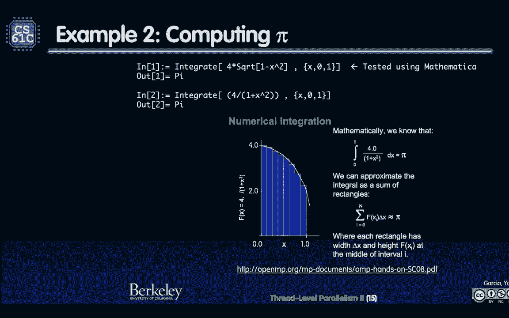

让我们通过一个计算 Ï€ 值的å®ä¾‹æ¥æ·±å…¥ç†è§£ OpenMP。我们使用数值积分法，公å¼å¦‚下：

**π = ∫₀¹ (4 / (1 + x²)) dx**

我们å¯ä»¥ç”¨é»æ›¼å’Œæ¥è¿‘似这个积分。以下是串行å®ç°çš„代ç ï¼š

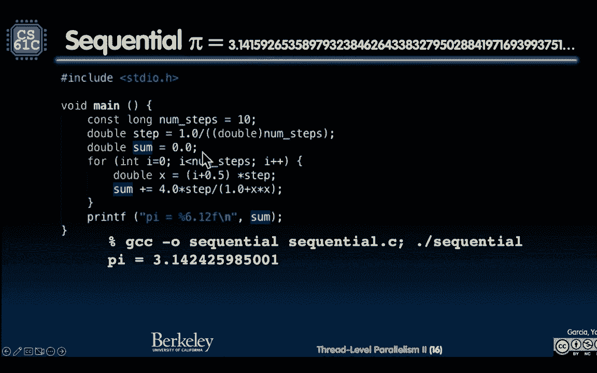


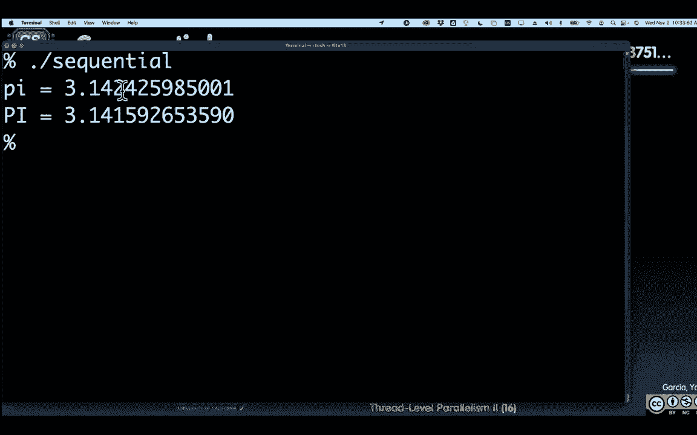

```c
#include <stdio.h>
#include <math.h>


static long num_steps = 1000000; // 积分步数
double step;

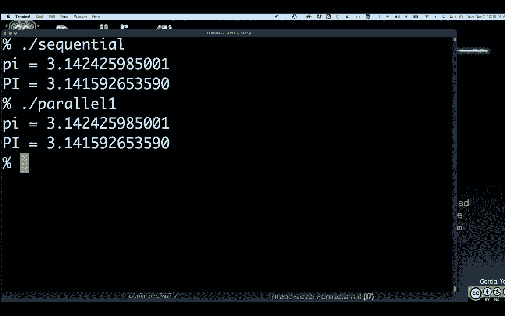


int main() {
    int i;
    double x, pi, sum = 0.0;
    step = 1.0 / (double) num_steps;

    for (i = 0; i < num_steps; i++) {
        x = (i + 0.5) * step; // å–中点
        sum = sum + 4.0 / (1.0 + x * x);
    }
    pi = step * sum;
    printf("Pi = %.15f\n", pi);
    return 0;
}
```

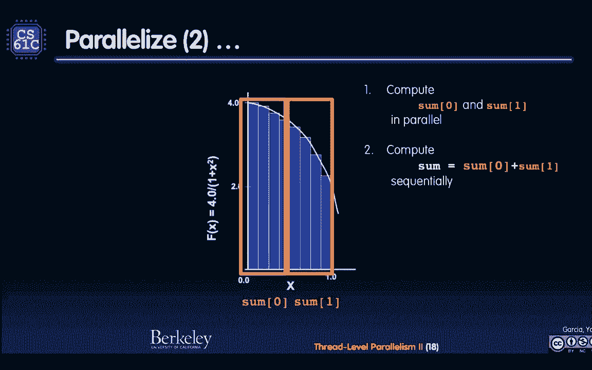

### 第一次å°è¯•ï¼šç®€å•çš„并行化åŠå…¶é—®é¢˜

我们å°è¯•ç›´æ¥æ·»åŠ å¹¶è¡ŒæŒ‡ä»¤ï¼š

```c
#pragma omp parallel for private(x) reduction(+:sum)
for (i = 0; i < num_steps; i++) {
    x = (i + 0.5) * step;
    sum = sum + 4.0 / (1.0 + x * x);
}
```
但请注æ„，这里存在一个关键问题。如æœåƒæœ€åˆé‚£æ ·å°† `sum` 声æ˜ä¸ºå•ä¸ªå…±äº«å˜é‡ï¼Œå¤šä¸ªçº¿ç¨‹åŒæ—¶è¯»å†™ `sum` ä¼šå¯¼è‡´é”™è¯¯ã€‚è¿™å°±æ˜¯ä¸€ç§ **ç«äº‰æ¡ä»¶**。


### 正确的并行化：使用归约å­å¥

正确的åšæ³•æ˜¯ä½¿ç”¨ OpenMP çš„ **`reduction`** å­å¥ã€‚它指示æ¯ä¸ªçº¿ç¨‹åˆ›å»ºè‡ªå·±çš„ `sum` å˜é‡ç§æœ‰å‰¯æœ¬ï¼Œåœ¨å¾ªç¯ç»“æŸæ—¶è‡ªåŠ¨å°†æ‰€æœ‰ç§æœ‰å‰¯æœ¬çš„值相加到全局å˜é‡ä¸­ã€‚

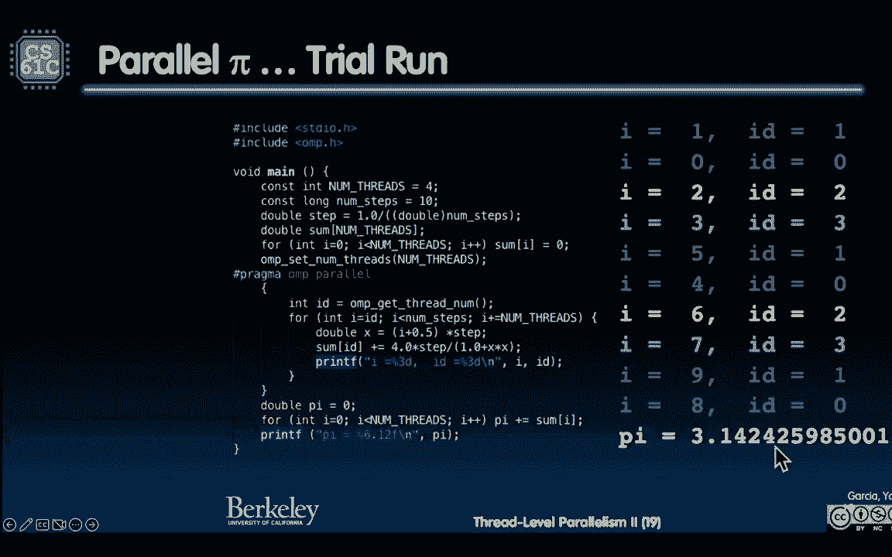

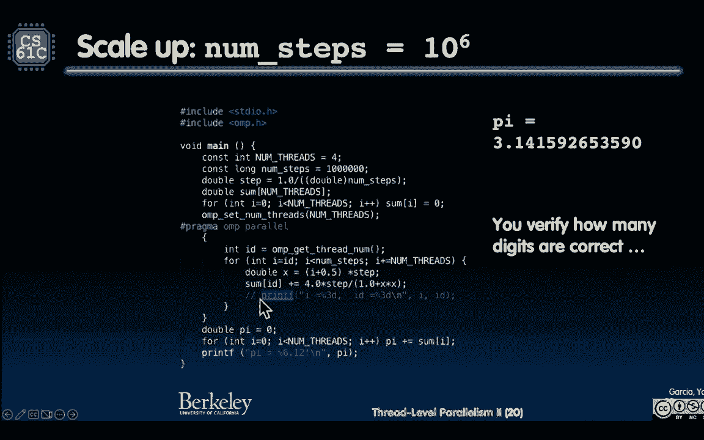

```c
#include <stdio.h>
#include <omp.h>


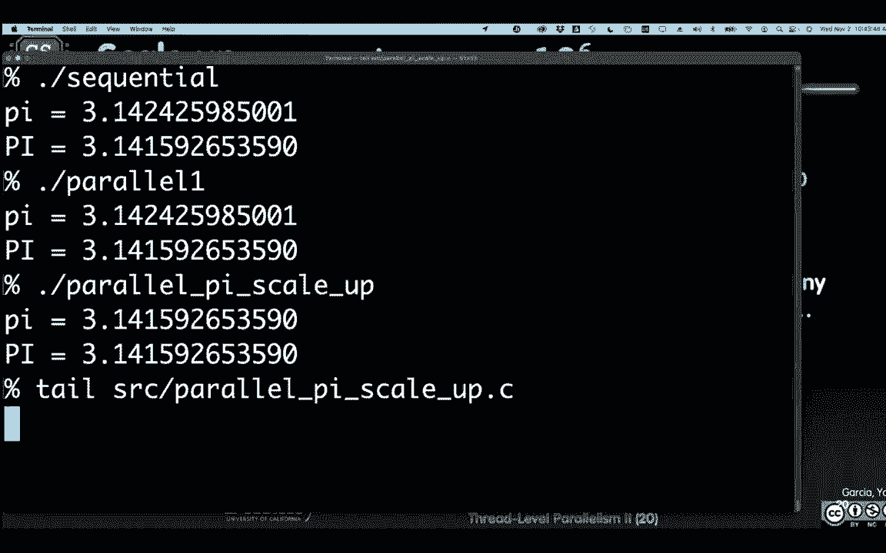

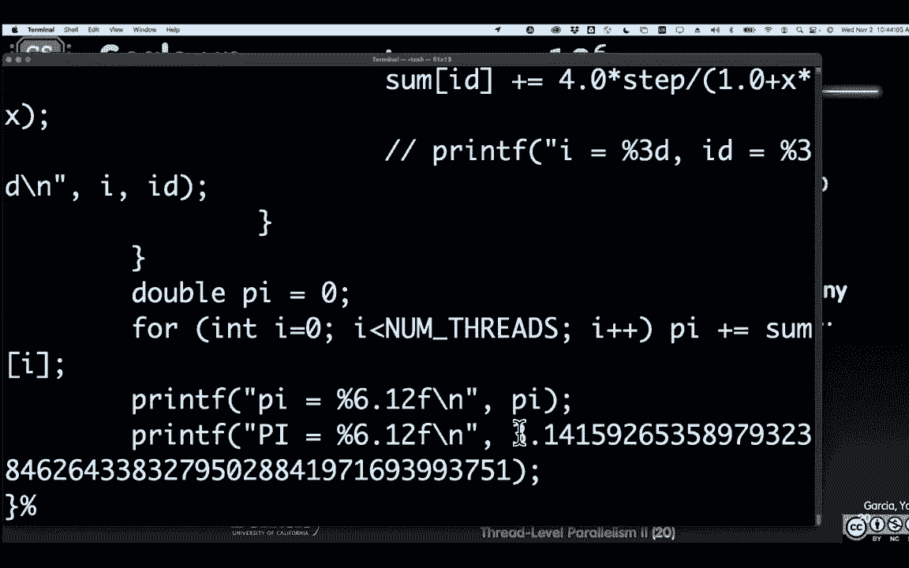

static long num_steps = 1000000;
double step;

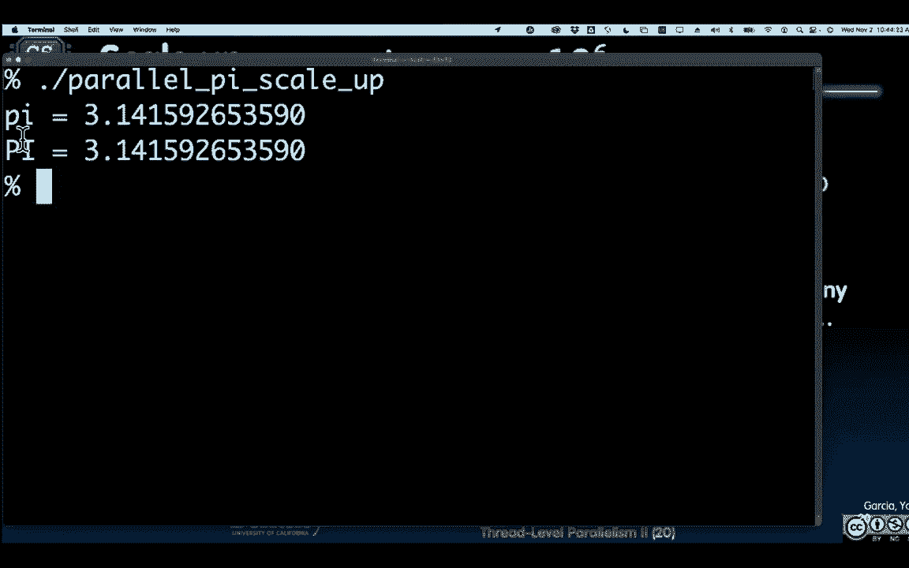


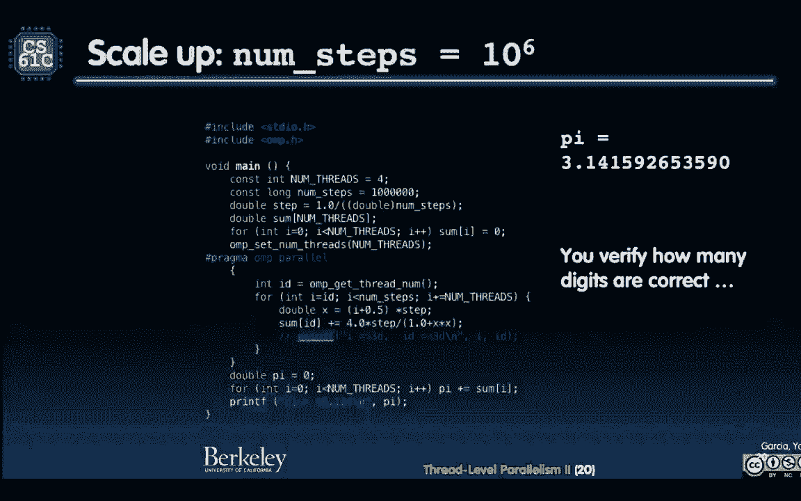

int main() {
    int i;
    double pi, sum = 0.0;
    step = 1.0 / (double) num_steps;

    #pragma omp parallel for reduction(+:sum)
    for (i = 0; i < num_steps; i++) {
        double x = (i + 0.5) * step;
        sum += 4.0 / (1.0 + x * x);
    }
    pi = step * sum;
    printf("Parallel Pi = %.15f\n", pi);
    return 0;
}
```
通过 `reduction(+:sum)` å­å¥ï¼Œæˆ‘们安全高效地å®ç°äº†å¹¶è¡Œè®¡ç®—，并能è·å¾—显著的加速比。

---

## ç†è§£ç«äº‰æ¡ä»¶ä¸é”机制 âš ï¸ğŸ”’

当多个线程åŒæ—¶è®¿é—®å’Œä¿®æ”¹åŒä¸€å…±äº«èµ„æºï¼ˆå¦‚å˜é‡ï¼‰æ—¶ï¼Œå¦‚æœæ‰§è¡Œç»“æœä¾èµ–äºçº¿ç¨‹æ‰§è¡Œçš„特定顺åºï¼Œå°±ä¼šå‘生 **ç«äº‰æ¡ä»¶**。这会导致程åºè¡Œä¸ºä¸ç¡®å®šå’Œç»“æœé”™è¯¯ã€‚


### ç«äº‰æ¡ä»¶ç¤ºä¾‹

考虑两个线程åŒæ—¶æ‰§è¡Œä¸€ä¸ªç®€å•çš„递å¢æ“作：`counter = counter + 1;`。
å‡è®¾ `counter` åˆå§‹å€¼ä¸º 100。我们期望两个线程执行å结æœä¸º 102。


但由äºæ“作ä¸æ˜¯åŸå­çš„（å¯åˆ†è§£ä¸ºåŠ è½½ã€è®¡ç®—ã€å­˜å‚¨ï¼‰ï¼Œå¯èƒ½ä¼šå‘生以下交错执行：
1.  线程 A 加载 `counter` (值 100)。
2.  线程 B 加载 `counter` (值 100)。
3.  线程 A 计算 100+1=101ï¼Œå¹¶å­˜å‚¨å› `counter` (ç°ä¸º 101)。
4.  线程 B 计算 100+1=101ï¼Œå¹¶å­˜å‚¨å› `counter` (覆盖为 101)。
最终结æœæ˜¯ 101 而ä¸æ˜¯ 102。这就是ç«äº‰æ¡ä»¶å¯¼è‡´çš„错误。

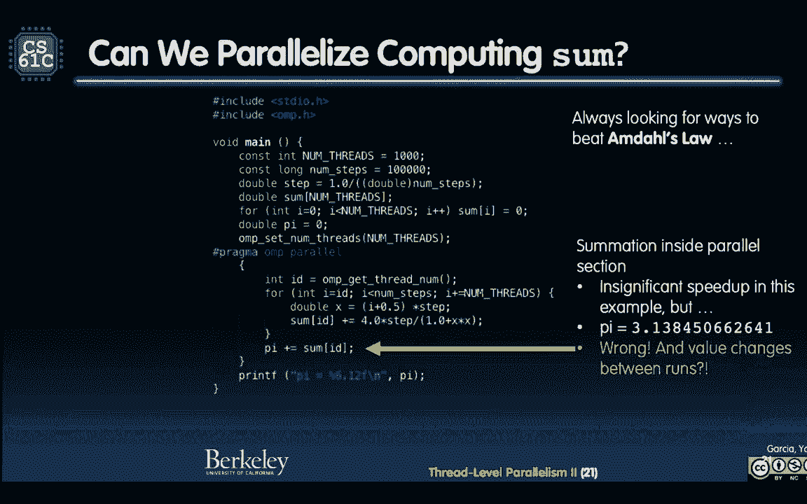


### é”：一ç§åŒæ­¥æœºåˆ¶

解决ç«äº‰æ¡ä»¶çš„一ç§åŸºæœ¬æ–¹æ³•æ˜¯ä½¿ç”¨ **é”**。é”ç¡®ä¿ä¸€æ¬¡åªæœ‰ä¸€ä¸ªçº¿ç¨‹å¯ä»¥è¿›å…¥è¢«ä¿æŠ¤çš„代ç åŒºåŸŸï¼ˆä¸´ç•ŒåŒºï¼‰ã€‚

é”的基本逻辑是：
*   **加é”**：线程在进入临界区å‰å°è¯•è·å–é”。如æœé”已被å ç”¨ï¼Œåˆ™ç­‰å¾…。
*   **执行**：è·å¾—é”å，线程安全地执行临界区代ç ã€‚
*   **解é”**：执行完毕å释放é”，å…许其他线程è·å–。

然而，å®ç°ä¸€ä¸ªæ­£ç¡®çš„é”本身也需è¦ç¡¬ä»¶æŒ‡ä»¤æ”¯æŒï¼ˆå¦‚测试并设置指令），以é¿å…在é”çš„å®ç°ä¸Šå‡ºç°ç«äº‰æ¡ä»¶ã€‚OpenMP æ供了高级的åŒæ­¥æŒ‡ä»¤ï¼ˆå¦‚ `critical` 区域），é¿å…了手动æ“作é”çš„å¤æ‚性。

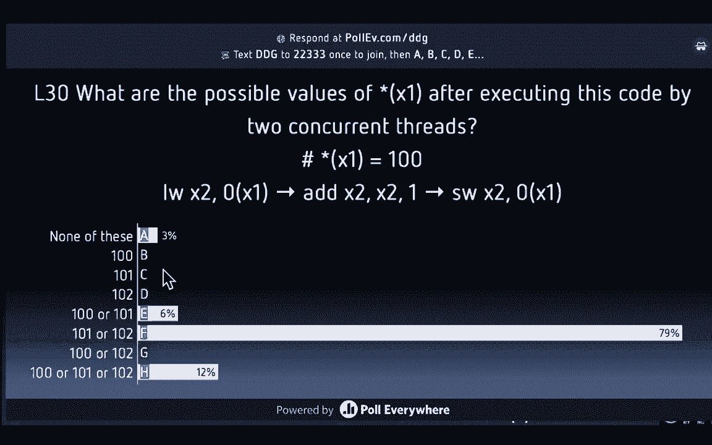

```c
#pragma omp critical
{
    // 这部分代ç ä¸€æ¬¡åªèƒ½è¢«ä¸€ä¸ªçº¿ç¨‹æ‰§è¡Œ
    shared_counter = shared_counter + 1;
}
```

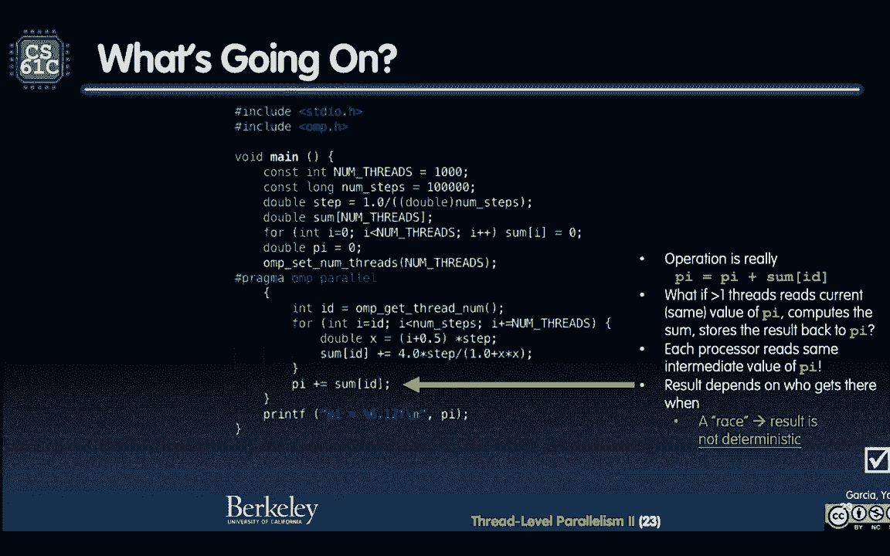


---


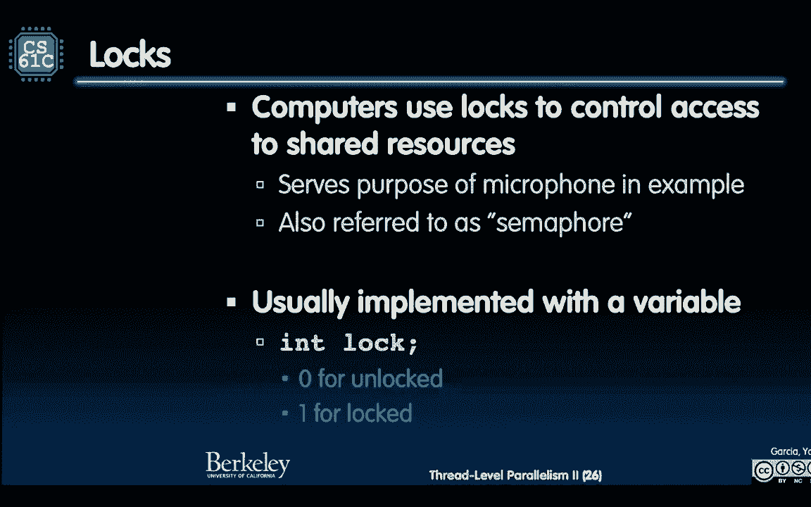

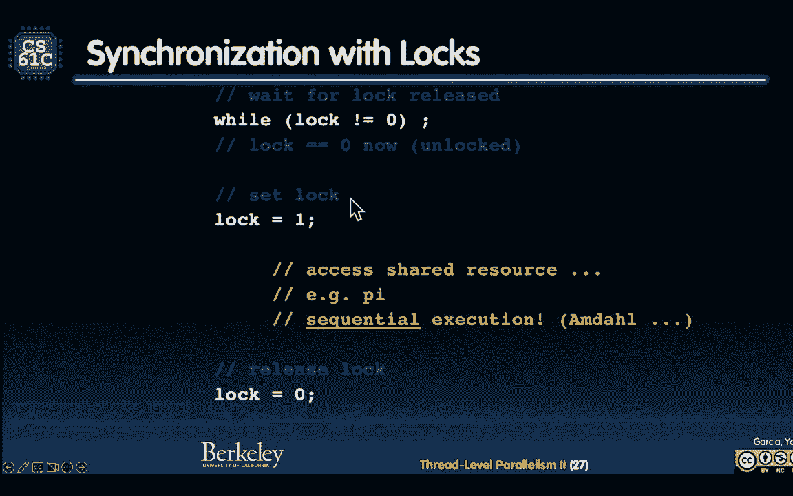

## 总结 📚


本节课我们一起学习了：
1.  **OpenMP 简介**：一个通过编译指导语å¥å®ç°å…±äº«å†…存并行的 C 语言扩展库，采用 fork-join 执行模å‹ã€‚
2.  **并行化循ç¯**：使用 `#pragma omp parallel for` 指令å¯ä»¥è½»æ¾åœ°å°†å¾ªç¯è¿­ä»£åˆ†é…给多个线程执行。
3.  **å®æˆ˜è®¡ç®— Ï€**：通过数值积分案例，学习了如何使用 `reduction` å­å¥æ¥å®‰å…¨åœ°å¤„ç†å¹¶è¡Œè®¡ç®—中的累加问题，é¿å…ç«äº‰æ¡ä»¶ã€‚
4.  **ç«äº‰æ¡ä»¶**：ç†è§£äº†å½“多个线程无åºè®¿é—®å…±äº«èµ„æºæ—¶ä¼šå¯¼è‡´ä¸ç¡®å®šçš„程åºè¡Œä¸ºå’Œæ•°æ®é”™è¯¯ã€‚
5.  **åŒæ­¥æœºåˆ¶**：认识了é”作为ä¿æŠ¤ä¸´ç•ŒåŒºã€è§£å†³ç«äº‰æ¡ä»¶çš„基本概念，并了解到 OpenMP æ供了更高级的åŒæ­¥åŸè¯­ã€‚


OpenMP 以其对ç°æœ‰ä»£ç æ”¹åŠ¨é‡å°çš„特点，æˆä¸ºäº†å…±äº«å†…存并行编程的é‡è¦å·¥å…·ã€‚然而，编写正确的并行程åºéœ€è¦ä»”细考虑数æ®å…±äº«ä¸åŒæ­¥ï¼Œä»¥é¿å…ç«äº‰æ¡ä»¶ç­‰é™·é˜±ã€‚