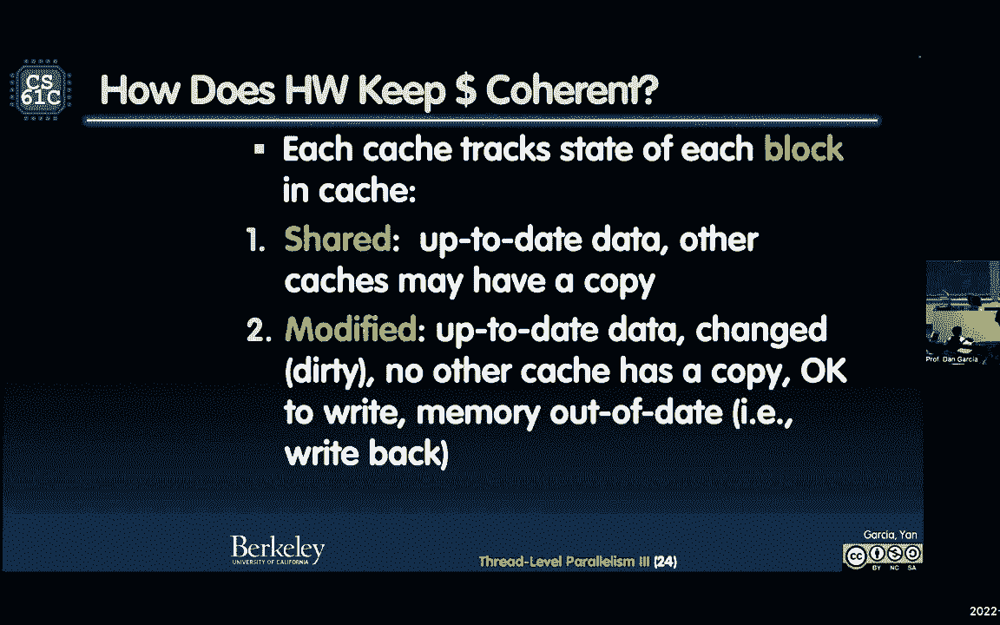

# 课程 P41：Lecture 31： 并行性 III： 缓存一致性、性能 🚀

在本节课中，我们将要学习并行计算中的两个核心问题：如何通过原子操作解决数据竞争，以及多核处理器中缓存一致性的工作原理。我们将从回顾数据竞争问题开始，然后深入探讨硬件级别的解决方案，最后分析共享内存系统中的缓存一致性挑战。

***

## 计算新闻 📰


我发现了一张关于量子计算的纸条。量子计算将彻底改变我们对计算机科学的看法。当它最终上线时，每个人都可以使用。


你可以通过亚马逊访问量子计算。这是一个新闻。有一家新的计算公司叫Q时代，它加入了亚马逊的云计算，让你可以访问。这是量子计算技术的另一个令人兴奋的提供者。

亚历山大·基斯林说，量子计算的冒险之一是你可以对量子比特层进行编程，所以你不必把它们都用完。也就是说你不必拥有整台电脑。当亚马逊负责排队这些请求时，你不必用整个东西。在以前的版本中，你必须保存整个东西。现在你可以说，让我们用这两个人和那四个人比赛。也许这个8对那个16个量子比特。他们在几年前达到了四个量子比特，所以现在达到二十六个量子比特是一件非常令人兴奋的事情。你可以构建不同原子的不同迷你集群来并行计算。


关于并行性的进一步讲座，考虑使用量子计算是非常令人兴奋的。如果你不知道量子计算的基础知识，所有的计算都是并行的，它们一起运行。所以不是一种线性算法。这些量子比特处于叠加状态。他们不是零就是一，他们在中间的某个地方。这真的是量子的一个基本问题。信息在中间，只有当你问它时，它才坍缩到零或一。但它处于叠加状态，直到你问它值多少钱。这真是令人着迷的东西。

如果你有一些量子比特，它在同时搜索所有可能性。所以如果我有一个3位的密码，我有3个量子比特，它实际上在同时搜索所有组合。有关于量子计算的高级课程，由我们的同事乌梅什·瓦齐拉尼教授讲授。我建议任何有兴趣了解更多量子计算的人去学习。


***


## 回顾与问题引入 🔄

上一节我们介绍了线程级并行性的基础。本节中我们来看看如何解决同步和数据竞争的核心问题。

上次我们离开时，我们对这种竞赛条件的问题感到震惊。如果你还记得，我们试着使用锁。你抓住锁，说如果我有锁，我可以访问读写变量。但问题是即使是抢锁也有竞争条件。这就是我们上次遇到的问题。


***


## 并行编程大图回顾 🖼️

以下是关于MP（一种C语言的简单并行扩展）的全面回顾。

你加一行 `#pragma omp parallel for`，整个for循环就是并行的。它并行在所有软件线程上，最终映射到硬件线程。真正美丽的是编译器如何做到这一点。

Pragma指示你在块中打破for循环。你将每个线程分配给一个单独的块。所以如果最大值是100，如果你在浏览一个数组，你会将0-49分配给一个线程，50-99分配给另一个线程。原因是你想让每个核心利用其缓存。你希望有时间局部性和空间局部性。你不想让他们随机抓取数组的一部分。给一个数组的连续部分，可以从缓存中受益。

对于支持OpenMP的编译器，你必须具有相对简单的循环结构。运行时需要能够确定有多少循环迭代分配给每个线程。你不能在并行区域内使用 `goto`、`break`、`return` 等跳出。在并行区域外做这件事。总的来说，只要用你的for循环非常干净地做就可以。


***


## 数据竞争与锁的困境 ⚔️


我们讨论了一场数据竞赛。我们有两个核心试图更新一个变量，就像圆周率的计算。每个人都想把他们的计算贡献加到圆周率上。

问题是 `pi += my_contribution`。因为你在读旧的值，你在给它增加新的价值，然后你把它放回去。两个人可以同时抢到旧的价值，将他们的作品添加到旧的价值中，然后都覆盖它。你将失去其中的一笔捐款。这就是我们上次在比赛条件下看到的。

我们必须通过同步来避免数据竞争。我们想要有确定性的行为。所以我们看到了锁，但即使是抢锁也有竞争条件。

***

## 硬件原子操作：根本解决方案 ⚛️

那么该怎么做？这是一个大想法，但除非你的硬件支持，否则不管用。任何软件级的解决方案在RISC-V架构下都不起作用。你必须添加一条新的指令，让你做一些叫做原子读取和写入的操作。它说我要在内存中做一些操作，没有人能阻止这一点。这是一个非常有力的想法。除非你有这个，否则你不能解决争用条件。

我们能够在一个指令中读写。在读和写之间不允许有其他操作。现在的关键是记住共享的东西。每个核心都有自己的寄存器集，自己的PC。他们可能有自己的L1、L2缓存，但L3通常是共享的。那么他们如何交流？唯一有保证的共同点就是内存。这是一个共享内存多处理器系统。所以内存必须是我们交流的方式。


典型的做法是使用所谓的原子“寄存器与内存交换”。这是我的本地寄存器的值。我想和内存中的值进行原子交换。其他人都不能夹在中间。内存中的东西会进入我的寄存器，我寄存器中的值会进入内存。这就是原子交换。


RISC-V在这方面有差异。我们将重点讨论原子内存操作（AMO）。这是一条新指令。它们原子地对内存中的操作数执行操作，并将目标寄存器设置为原始内存值。

例如，`amo add`。我想把一个贡献加到内存中的圆周率上。`amo add` 会获取内存的旧值，把它存在目标寄存器（左手），然后把我的贡献加到内存位置。谁也不能乱来。如果我不在乎旧值，我可以把它设为零。

但实际上更有用的是如何首先实现锁。因为一旦我有了一把锁，我可以做任何事。让我展示如何用交换操作实现锁。


***


## 实现自旋锁 🔐

假设锁在内存中。如果锁的值是1，锁就被设置好了，意味着锁是别人的。如果是0，锁就开了，意味着没有人拥有它。


这是一段所有核心共享的内存。所有人都想抓住那段记忆。如果指针指向的值为0，那现在就没人和那段记忆说话了，它可以被抓住。如果值是1，一定有什么东西被利用了。

就像有一盏灯亮着。当灯光亮起，有人在用它。当灯灭了，任何人都可以使用。零指向光在内存中的位置。


代码实现如下：
```assembly
li t0, 1           # 我的临时值是1，我想把锁设置为1
spin_lock:
    amoswap.w.aq t1, t0, (a0)  # 原子交换：尝试把1存入锁的位置，旧值存入t1
    bnez t1, spin_lock         # 如果旧值不是0（说明锁被别人拿着），继续循环尝试
# 拿到锁了
```


`a0` 是锁在内存中的位置。`t0` 是我想储存在那里的值（1）。`amoswap` 会尝试在那里放一个1。左手（`t1`）永远是旧的价值。我要检查旧值是什么。如果它是1，说明别人拿走了锁，我继续尝试。如果它是0，说明我拿到了锁，跳出循环。

`aq` 表示我正处于获取阶段，这是一种在最低层次上正确排序的方法。


当我完成后，如何释放锁？我必须把锁关掉。
```assembly
amoswap.w.rl x0, x0, (a0)  # 原子地向锁的位置存储0，不关心返回值
```
`rl` 表示释放。`x0` 是零寄存器，表示我不在乎返回值。我存储一个0，现在灯关掉了。

这种原子内存操作意味着不会有竞争条件。所有其他核心也在努力做到这一点，但只有一个会成功。

***

## OpenMP 中的锁实践 🛠️

在OpenMP中，使用锁更简单。以下是步骤：

1.  **声明并初始化锁**：`omp_lock_t my_lock; omp_init_lock(&my_lock);`
2.  **在关键区域前设置锁**：`omp_set_lock(&my_lock);`
3.  **执行关键代码**：只有拥有锁的线程可以执行这部分。
4.  **释放锁**：`omp_unset_lock(&my_lock);`
5.  **销毁锁**：`omp_destroy_lock(&my_lock);`


例如，解决圆周率计算的竞争条件：
```c
#pragma omp parallel for reduction(+:pi)
for (i = 0; i < num_steps; i++) {
    double x = (i + 0.5) * step;
    #pragma omp critical
    pi += 4.0 / (1.0 + x * x);
}
```
`#pragma omp critical` 指令确保一次只有一个线程执行 `pi += ...` 操作。


OpenMP的目标是最小化你需要更改的代码量。基本上是一个工作的串行程序，加上几条编译指示，就使其并行。


***


## 死锁：当并行陷入僵局 🚧


即使有锁，另一个问题可能出现：死锁。死锁发生在两个或多个进程互相等待对方释放资源，导致所有进程都无法继续。


一个经典的例子是“哲学家就餐问题”。五位哲学家围坐，每人需要两把叉子才能吃饭。算法是：思考，拿起左叉子，拿起右叉子，吃饭，放下叉子。如果所有哲学家同时拿起左叉子，每个人都会等待右叉子，而右叉子被旁边的人拿着，导致所有人都无法吃饭，形成死锁。


**解决死锁的方法**：
*   **序列化**：最古老的哲学家先吃，吃完下一个再吃。
*   **增加资源**：提供更多的叉子。
*   **引入超时和退让**：如果等待一段时间还没拿到第二把叉子，就放下第一把，稍后再试。


关键思想是：如果你发现你在拖延时间，就释放你持有的部分资源，让其他人有机会进行。


***

## 性能测量 ⏱️


如果要计算代码运行的速度，可以使用 `omp_get_wtime()` 函数。
```c
double start_time = omp_get_wtime();
// ... 要计时的代码 ...
double end_time = omp_get_wtime();
double elapsed = end_time - start_time; // 经过的秒数
```
`omp_get_wtime()` 返回从过去某个任意点开始的逝去时间（墙钟时间）。通过计算两个调用的差值，可以得到代码段的执行时间。

***


## 共享内存与缓存一致性 🧠

现在让我们谈谈大的话题：共享内存和缓存一致性。


你有一个多核处理器，每个核心有自己的缓存，它们通过互连网络连接到共享内存。这是一个共享内存多处理器系统。所有硬件线程在相同的内存空间中工作。

对于任何并行架构，你可以问三个问题：
1.  **它们如何共享数据？**
2.  **它们如何协调工作？**
3.  **能养活多少处理器（可扩展性）？**

在我们的模型中：
1.  通过单一的共享地址空间共享数据。
2.  通过内存进行协调，使用锁和原子操作等同步原语。
3.  瓶颈在于内存和互连网络。


使用缓存可以减少对主存的带宽需求。但问题来了：每个核心都有一个本地私有缓存。如果多个缓存拥有同一内存地址的副本，并且一个核心修改了它的副本，其他缓存中的副本就过时了。这就是**缓存不一致**。

保持所有缓存副本同步的问题就是**缓存一致性**问题。


***


## 缓存一致性协议 🤝


硬件如何保持缓存的一致性？每个缓存跟踪缓存中每个块的状态。


**关键机制：总线窥探**
*   当任何处理器写入其缓存时，它通过互连网络（如总线）通知其他处理器。
*   其他缓存“窥探”这个共享的互连，检查它们的标签。
*   如果另一个缓存有相同地址的已修改副本，它会使自己的副本无效（或更新它）。




**常见的缓存块状态（以MESI协议为例）**：
*   **修改（Modified， M）**：缓存行是脏的，与主存不同。只有这个缓存有这个数据的最新副本。
*   **独占（Exclusive， E）**：缓存行是干净的，与主存相同。只有这个缓存有这个数据的副本。
*   **共享（Shared， S）**：缓存行是干净的，与主存相同。多个缓存可能有这个数据的副本。
*   **无效（Invalid， I）**：缓存行中的数据无效。


**工作流程示例**：
1.  核心A和核心B都读取内存地址X，值都是10。两个缓存都进入 **共享（S）** 状态。
2.  核心A要写入X，值改为20。它发出“使无效”信号。
3.  核心B的缓存窥探到这个信号，将其副本状态改为 **无效（I）**。
4.  核心A现在可以写入其缓存，状态变为 **修改（M）**。主存中的值（10）现在是过时的。
5.  如果核心B后来要读X，它会发出读请求。核心A窥探到请求，将它的修改值（20）写回主存（或直接发给核心B），然后两个缓存的状态都变回 **共享（S）**，值都是20。

一个更优化的变体是 **MOESI协议**（修改、拥有、独占、共享、无效），它引入了“拥有者（Owner）”状态，可以更高效地在缓存之间传输修改的数据，而不必立即写回主存。

***

## 伪共享：隐藏的性能杀手 🐌

缓存一致性还导致一个微妙的问题：**伪共享**。


即使两个处理器访问的是同一个缓存块中的**不同变量**，系统也会认为它们在共享整个块。如果一个核心修改了它那部分，会导致另一个核心的整个缓存线无效，即使后者访问的是不同数据。这会导致缓存线在两个核心的缓存之间频繁“乒乓”，造成大量一致性失效，严重损害性能。


**如何预防伪共享？**
*   调整数据结构，让被不同线程频繁访问的变量位于不同的缓存行中。
*   某些编程语言或库提供对齐声明来帮助实现这一点。
*   意识到块大小是关键因素。块越大，两个无关变量落入同一块的可能性就越大。


***


## 总结 📚


本节课中我们一起学习了并行计算中两个高级主题：


1.  **原子操作与锁**：我们了解到软件级别的锁尝试本身存在竞争条件。根本解决方案需要硬件支持的**原子内存操作**，如 `amoswap`，它能确保读-修改-写操作不可分割。我们用它实现了**自旋锁**，并看到了在OpenMP中更简便的锁和临界区用法。
2.  **缓存一致性**：在多核共享内存系统中，每个核心的私有缓存会导致数据副本不一致。硬件通过**缓存一致性协议**（如MESI）来解决，主要使用**总线窥探**机制来使无效或更新其他缓存中的副本。我们还讨论了由此引发的**伪共享**问题，即无关变量因位于同一缓存行而导致的性能下降。


理解这些底层机制对于编写正确、高效的多线程程序至关重要。它们解释了为何并行编程有时比预期更复杂，也提供了解决问题的思路和工具。