# P42：Lecture 32： VM I： Intro - 这样好__ - BV1s7421T7XR

我们要开始放幻灯片了，有有一些，幻灯片中的一些缓慢，但他们很快就会被张贴出来。

所以今天我们要多谈谈这台电脑，我们一直在谈论的，丹一直在说什么，在过去的几周里，这种访问东西的高速方式不需要，一路走到记忆中，我们也一直在讨论线程，所以你有一些程序的想法，一些过程。

你想利用你拥有的多个核心，好啦，这就是所谓的多线程或多处理，但让我们后退一点，谈谈计算机。

好啦，那么我这么说是什么意思，让我们把老派的C61一幕，这里的机器结构图，你会看到我强调了一些事情，记忆就是其中之一，我们将在这个单元中更多地讨论记忆，但我们也要谈谈这件事，称为i o系统，我代表输入。

永远代表输出，然后我们要谈谈，假设某个操作系统，Mac OS X Linux，所有这些事情，你会发现它确实，超出61 C的范围，所以我们要把这些部分，这对我们正在谈论的事情很重要。

您现在可以使用一个62操作系统了解更多信息。

如果我们看一下新的学校机器结构图，我们在哪里，我试着把它放进去一点，这里没有真正的盒子，但我试着把这个小盒子放在这里，我们将讨论并行程序，好啦，所以你可以运行多个程序的想法。

让我们说幻灯片松弛或电子邮件或其他东西都在同一时间，在一台计算机上，在单个处理器上，这就是我们将在本单元讨论的内容。

到目前为止我们在哪里，我在项目方面概述了一点，项目四不在这里，不过，请你再忍耐一下，项目一是C程序的思想，事实上，我确实把项目给了一个同行，因为它是关于线程C程序的，你有一个单一的程序的想法。

它完成了一件事，然后也许你可以多线程，为了让它更快地完成这件事，我们讨论的第二件事是风险五，因此，一个互联网指令集体系结构和ISA，这是项目二，所以我们写风险五代码的想法，所以C代码正在编译成汇编。

然后程序集编译成机器代码，然后我们有项目三，构建自己的CPU，什么是CPU，记住只是那个处理器，它是真正做你想做的事情的东西，它与两个项目有什么相互作用，一个缓存，如果它存在，所以这有点像。

那是一个很容易得到你所有的，最近使用的数据，如果它不在你的缓存里，然后你去回忆，稍微远一点，你知道储藏室可能在校园里，然后记忆在遥远的萨克拉门托。

在这一点上你可能会想，你就像等等，坚持住，好啦，所以这在金星的环境中是合理的，我知道如果我发射金星运行一个程序，它会运行，然后它会简单地停止，但我的笔记本电脑看起来完全不同，第一名。

但假设左边是我的笔记本电脑，好啦，一号有视觉元素，好啦，不仅仅是代码，但你有一个屏幕，你有键盘，你有存储，这就是我们所说的输入输出，注意存储也在这个桶中，我一会儿要讲一点。

你的笔记本电脑做的第二件事是金星。

至少在我们的迭代中，但它不能同时运行多个程序，然后有这种，有一种叫做操作系统的软件，它将所有这些程序联系和管理在一起，好啦，所以我们要稍微谈谈操作系统是如何，还有哪些资源需要在所有这些项目之间共享。

现在你可能有点想知道，好啦，为什么输入输出，比如磁盘在哪里，让我们看看另一台电脑，那是带屏幕和键盘的笔记本电脑，所有这些事情，让我们来看看覆盆子圆周率，覆盆子圆周率是一台超级便宜的电脑，但它本身。

如果你没有在所有不同的端口上焊接，现在一块主板要三块五，如果你在上面焊接东西，然后你实际上可以插入东西，你可以插上显示器，你可以插入所有这些东西，然后运行像Linux或其他类似的东西。

那么让我们看看这里的主板上有什么，首先，我们从CPU和缓存开始，现在有个有趣的迹象，你见过美元符号，也许如果你没有，你的机会来了，美元符号是现金的简称，因为现金，听起来像是钱，就像现金，反正。

所以这里有个美元符号，所以你，如果你看到，如果你现在看到那个图标，你就知道它是缓存，好啦，所以这里有一堆缓存，离中央处理器很近，这里的第二件事是记忆，我们会谈谈这个，但是请注意，它与CPU是完全分开的。

它还在同一块板上，但它就像一个单独的东西，焊接在，这里还有一些其他的东西，许多不同的i o设备都是通过这种端口焊接的，好啦，例如，我们这里有一个USB端口，USB A端口，我们有一个网络，我喜欢。

假设一个以太网端口，我们有无线WiFi，我的东西是焊接在上面的，然后我们有一个迷你HDMI端口，可以连接到屏幕，然后还有第三个，这里还有最后一件事，它是一个存储输入输出，这是一张微型SD卡。

你只是扑通一声，好啦，所以这就是我的意思，当我说存储也是一种输入输出设备时，因为它通常是通过某种端口连接的，所以如果你有过外接硬盘之类的东西，这就是我们所考虑的存储方式，但即使在笔记本电脑里，例如。

我的笔记本电脑有256千兆字节的存储空间，那和公羊不一样，也就是8G的内存，在我的情况下，或者有时是千兆字节的RAM，这意味着Chrome经常崩溃，不过，我们可以以后再谈，那么六十一怎么样。

覆盆子皮怎么样，如果你对更多感兴趣，我们实际上并没有涵盖所有的概念，但你可以，你可以用覆盆子圆周率覆盖61 C中的所有概念，所以如果你对这个感兴趣，你绝对可以去下载这本书，真的很酷。

你可以买你便宜的覆盆子圆周率，或者你可以问，我们就能想出办法，也许吧，请一定要看看，这将是一个好时机，这将是一个很好的冬季项目，只是在上面建造你自己的电脑，在这个非常小的，极小装置，那么我们在哪里。

这是我们看到的原图，但这次我们要谈的是记忆，I，O，设备，以及如何管理共享资源集，在许多几乎同时运行的程序中，好啦。

所以这就是我们今天所处的位置，在接下来的两节课中，我将介绍操作系统，但又像，我们有整整一学期16周的时间来学习操作系统，我们只是要涵盖基本的，这样你就知道它是如何相互作用的，以及它如何允许您管理程序。

所以让我们来谈谈一个，首先是上下文切换的一个高级想法。

我要谈谈操作系统，所以对你们很多人来说，你可能会认为操作系统就像可怕的东西，这就像，就像一个神奇的东西，不知何故运行着所有这些东西，原来操作系统只是软件，这是保密软件。

所以它可以运行其他用户程序无法运行的特殊功能，但这只是软件，让我们来看看其中一个，呃，这个小代码库很酷。

让我们看看这里有没有，没有，好啦，把它移到屏幕上，我要试着放大。

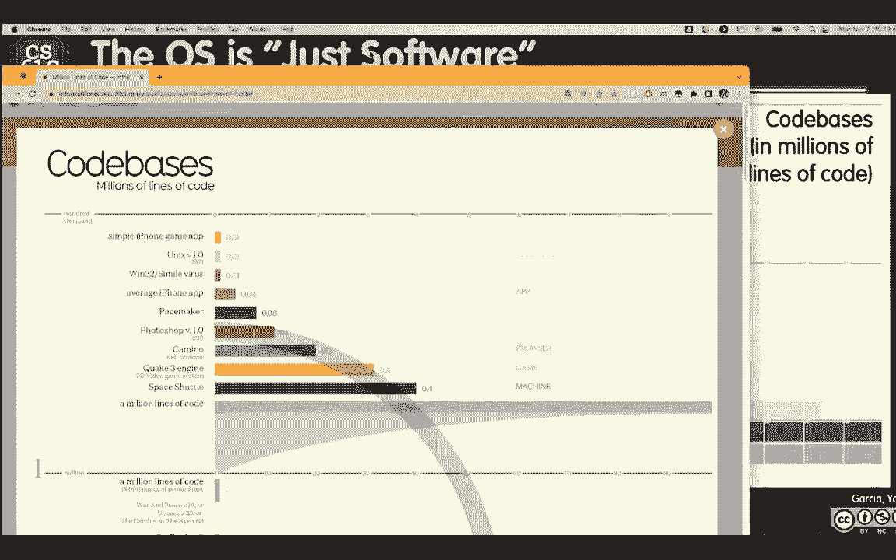

但我之前试过了，但它并没有真正起作用，所以让我们看看，如果你看到这里，这是呃，在数百万行代码中，你可以看到在一百个，好啦，所以第一组第一组酒吧，这里的灰色条是一百万行代码和下面的一切。

这是几十万行的帖子，你可以看到一个iPhone游戏应用程序很漂亮，这是一个很小的问题，零一所以就像，可能有一万行左右的代码，然后航天飞机实际上也很小，那很酷。

现在我们把这个由数百万条线组成的巨大的灰色长条映射到瘦骨嶙峋的灰色长条中，现在是一百万行代码，在第二组图表中，当我们向下滚动时，你可以看到，突然我们得到一些操作系统代码，所以这是Linux内核两点两点。

一个非常早期的版本，虚幻引擎也是两百万行代码窗口，在1992年，两千分之一的三点是两点，500万行代码，让我们继续向下滚动，哦Xbox，高清，DVD播放机，是呀，那个年龄很好，继续走窗户。

在1993年安卓操作系统，所以这是一个移动设备操作系统，现在有1200万行代码，我的续集因为某种原因是巨大的，很刺激，微软办公室，它只是不断增长脸书，好啦，不过，好吧，这就是我们想去的地方。

看看2014年的Mac OS Tiger，随便啦，这个号码在上面，八千六百万行代码，所以这是操作系统的大小，好的结果是你知道如果你向下滚动一点，谷歌来了，反正，所以你可以更详细地了解一下，如果你愿意。

如果你，如果你愿意，让我们回到幻灯片，当我试图把这个拿起来的时候，斗斗。

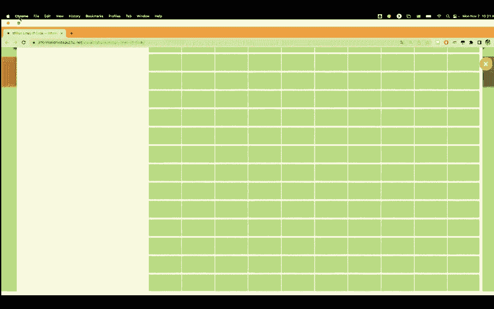

是啊，是啊，我们做到了，下面是操作系统的另一个视图，所以我们在之前的幻灯片上看到了Linux的早期版本，让我向你展示内核是如何，它是操作系统的核心部分，在数百万行代码中增长，所以这里的版本。

这些都是不同的版本，然后现在，随着我们越来越接近最新的版本，你可以看到它变成了数千万行代码，所以这可能是在你的机器上运行的最重要的软件，它也可能是软件中最大的一部分，当您决定安装操作系统时。

它需要几千兆字节的内存或存储空间，那是因为它只是大量的代码。

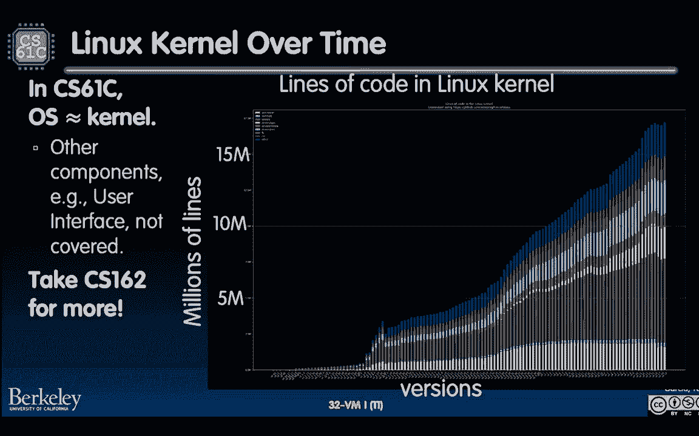

所以我告诉过你这很重要，我们可以看到，通过这里代码库的大小，但它又是怎么做的呢，这是系列演讲的第一课，在这里我们将讨论一点操作系统，以下是它所做的想法，好啦，第一件事是它是如此重要，以至于它有效地。

开始的第一件事，当计算机启动时运行的第一个软件，它在那个时候做什么，操作系统启动各种服务，我所说的服务是什么意思，文件系统，网络堆叠，所以像以太网这样的东西，WiFi卡，所有这些类型的事情，键盘，好啦。

所以这个t y代表键盘，至少在我们这里的语言中是这样，现在操作系统已经启动了所有的服务，它还能做什么，它提供了所有这些i之间的交互，o计算机上运行的设备和程序，所以说，例如，如果有储藏室。

如果有你知道的以太网卡，全部或像USBA，也许有什么东西插在那里，操作系统使用这些类似于硬件特定的驱动程序来管理所有这些，你可以说，你可以在以后的课上学习。

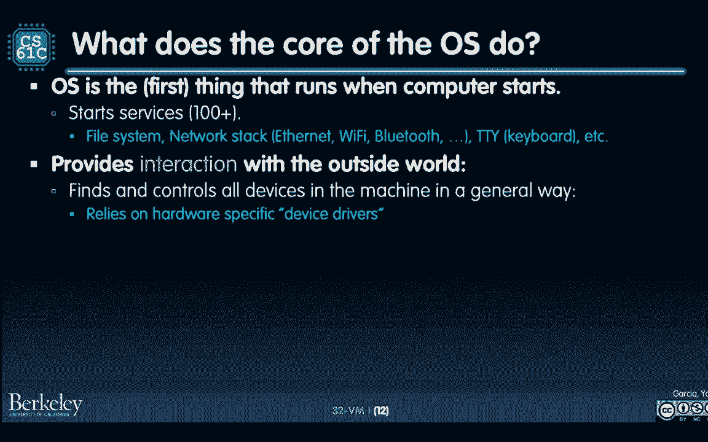

但我们想强调的是，至少在接下来的两堂课左右，两三堂课，操作系统管理不同的程序，所以它是一个管理其他软件的软件，好啦，它实际上加载了，你还记得吗，叫它装载机，其中的一部分，让我们，是啊，是啊。

最后一个电话，是装载机，是那个跑腿的，所以它告诉它，它告诉CPU下一个运行哪个东西，经理们会说，好啦，现在呢，CPU，现在您实际上应该运行这个程序，这里有几个关键术语我们要考虑，其中之一就是隔离，好啦。

因此，操作系统提供的是每个进程感觉像，它是孤立的，所以每个过程都感觉它可以控制所有不同的资源，记忆，所有这些可用的东西，通过这样做，虽然，即使每个过程感觉都是孤立的，它能控制一切，秘密发生了什么。

同时运行的，或同时运行的进程，例如内存，今天我们要谈很多关于记忆的事，第二个，伊诺，设备磁盘，网络，所有这些类型的事情，它甚至还可以分享时间，所以我们从记忆的角度来讨论资源，它也做时间共享。

操作系统管理这些东西，我这么说是什么意思，让我们假设您有一个CPU，为了在计算机上运行多个进程，这些进程需要以某种方式使用相同的CPU，如果CPU只有一个时钟，就像你知道的，只有一个管道。

然后操作系统负责分时，所有这些不同程序之间的CPU，好啦，所以资源共享和时间共享是操作系统所做的，但是从过程来看，它是一个独立运行的运行程序，这就是我们今天要关注的，但是明天我们要去。

我们不是明天星期三，我们将讨论操作系统的其他方面，好啦，我们真的要把重点放在内存和资源共享组件上，关于同时运行多个程序的另一个注意事项，这就是我们所说的多编程，不要与多处理混淆。

我想当我第一次知道这一点时，我很困惑，所以多处理就是当有多个CPU，多个处理器，您可以运行，假设多个线程或东西可以在不同的毛孔上同时运行，多编程，这就是我们今天要讨论的，东西可以同时运行。

在同一单核上引用未引用，好吧，为什么我又同时加了引号，CPU一次只能像一件事一样运行。

因为这条管道，我是说，好啦，它可以像指令级并行一样，但严格来说，它只能像一个单一的运行，就像不管怎样，让我们继续前进，报价，同时取消引用是从人类的角度出发的，当人类看到这些多个程序运行时，是啊，是啊。

他们可能像一个一样奔跑，一个在最初的十毫秒或一百毫秒内运行，一个在第二个10毫秒或100毫秒内运行，但是从人类的角度来看，这些东西大致是同时运行的，操作系统所做的是，它做这些非常快的事情。

这些非常快的东西叫做上下文切换，这是一个操作系统术语，这种上下文切换有效地完成了以下任务，它将当前进程状态保存在CPU上，例如，如果有一个程序计数器，就有寄存器，有一个特殊的状态寄存器。

所有这些都被保存在某个地方，然后下一个过程是将状态加载到CPU上，好啦，所以下一个过程是程序计数器和状态寄存器，所有这些东西都装满了，这里是这里是一点，虽然这个上下文切换，我们下次会更多地讨论。

这个上下文也不加载内存，所以它不会取代电流，在接下来的过程中，我有八个G的RAM，八格公羊或不管多少公羊，下一道工序需要，因为这个太贵了，我这么说是什么意思，让我们回到存储延迟分析。

我知道丹和我喜欢这张照片，所以我想把这张照片再贴一次，就像你知道的，在这里进行一场真正的荣耀之旅，所以我们有寄存器，那些真的离你很近，我们有校园，现金就在那里，现在的记忆是如果我们要去萨克拉门托。

所以想象一下在上下文切换上，假设你正在运行powerpoint，然后你想切换到你的互联网浏览器，谷歌Chrome什么的，想象一下，你不仅要切换CPU上的所有东西，超快的。

现在你必须把内存中的所有东西都换掉，所以你得一路跑到萨克拉门托，把所有东西都搬来搬去，然后一路回来，那就太慢了，那么这里的重点是什么呢，上下文切换只改变CPU中的内容，因此，关于进程如何共享内存。

需要有一些特殊的东西，即使他们不在运行，或者即使它们不是当前正在运行的进程，现在你可能会注意到这里有一个快速的符号，我可能会交替使用过程、应用程序和程序，这是故意的，从操作系统的角度来看。

我们考虑一个过程，单个程序，然后从产品中，你可以想象一个像Internet Explorer或谷歌Chrome之类的应用程序。

这些都是多个过程，好啦，但就目前而言，我们就假设每一个，如果每个应用程序都有一个进程，并且是一个程序，这就是我们在这节课里要做的，我们想知道我们是否有记忆，我们试图切换上下文，但我们不想总是切换内存。

所有可能大致同时运行的不同进程，好啦，所以这就是我们想去的地方，但首先，我认为了解一下。

内存和磁盘有什么区别，因为我想我们还没有完全讨论过这个问题，然而，我们在金字塔中从概念上看到了它，对你们中的一些人来说，如果你以前造过电脑，你大概知道我在说什么，但我只能假设，呃。

也许你们中的许多人还没有造出自己的电脑，所以我们现在要谈谈，我们现在在哪里。

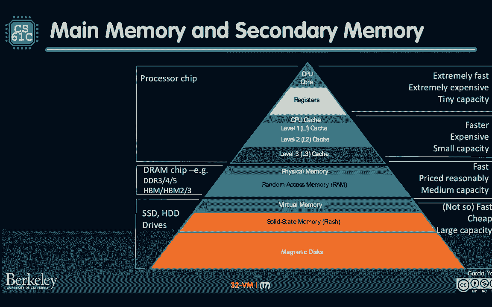

在这个内存层次结构的金字塔中，我们算是垫底了，这里我们讨论的是主存，它实际上是随机存取存储器。

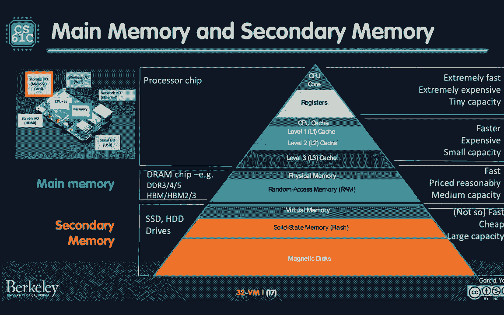

这里有一条绿色的线，让我们看看这东西今天能不能用。

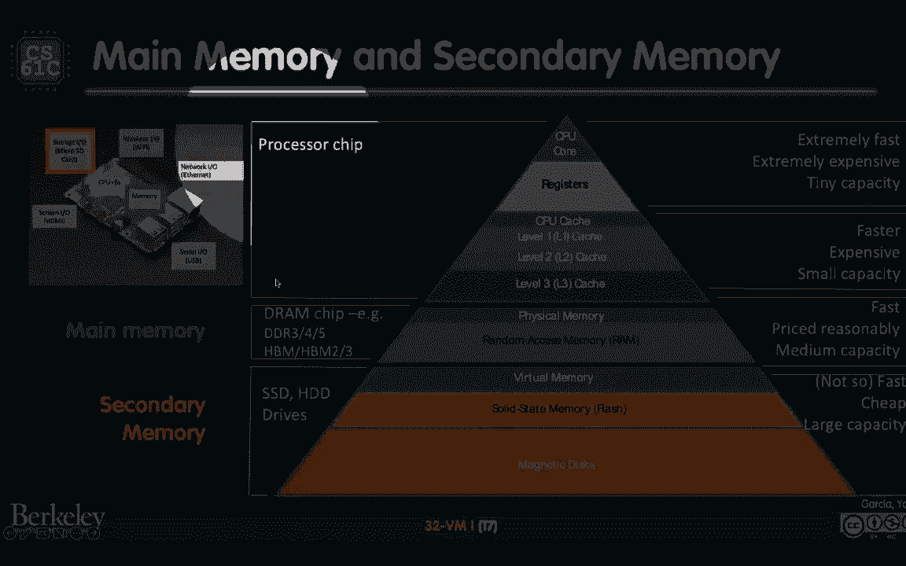

是啊，是啊，它的工作原理，就是这个绿色的小条，这就是我们所说的记忆，我们在这节课中不是在谈论缓存。

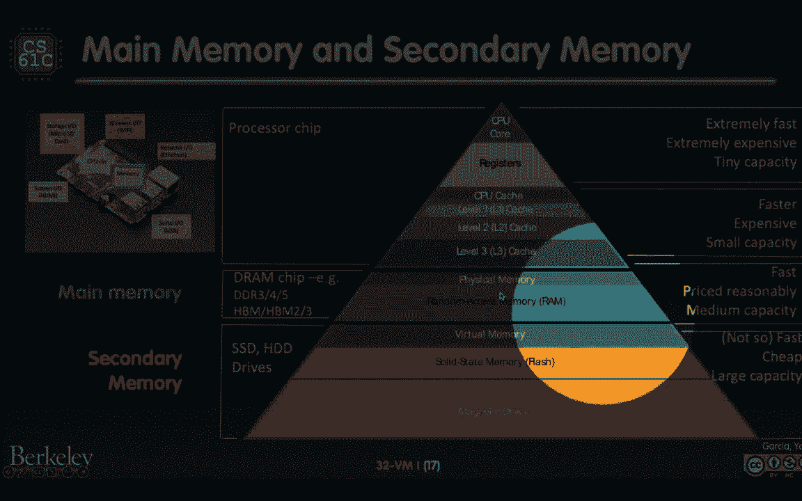

然后在它的正下方是二级内存。

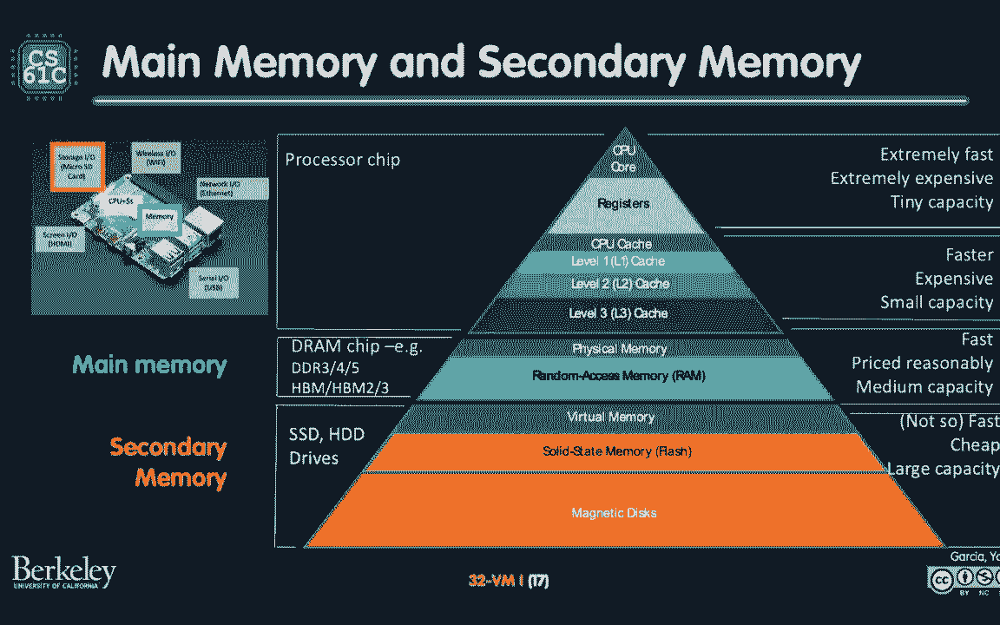

或者我们所说的存储或磁盘，所以你可以在这里看到，有固态记忆或闪存，这里还有磁碟，你还记得金字塔告诉我们，金字塔告诉我们，所有在更高层的东西实际上都是副本。

或者是下层的东西的子集，这仍然是真的，好啦，所以这就是我们在这里工作的想法，离磁盘非常非常远的东西，就像遥远的冥王星，会被复制到主存里，离这里只有萨克拉门托那么远，覆盆子派我们在哪里。

你可以想象下面的情况，我们有点像记忆，这里是芯片本身，但它与CPU是分开的，然后仓库，假设这是一张微型SD卡，它是一种输入输出设备，好啦，所以这有点像。

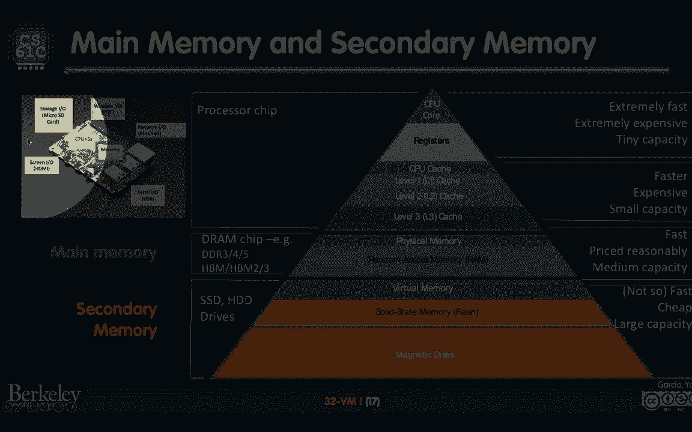

在这方面，呃，物理距离也是，让我们来谈谈这些项目。

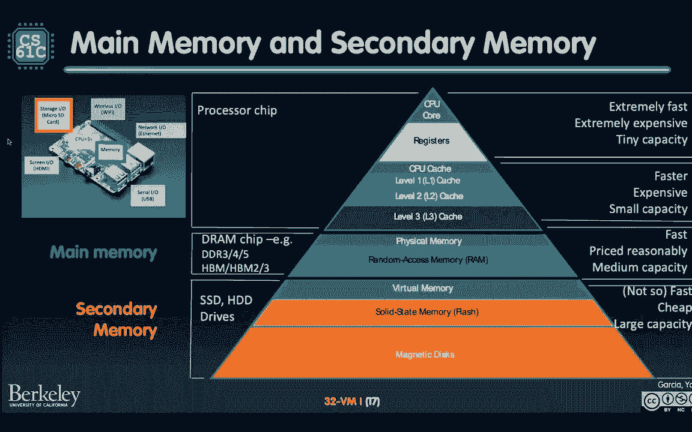

就像你可能看到的一些术语一样，如果你去买一些电脑零件。

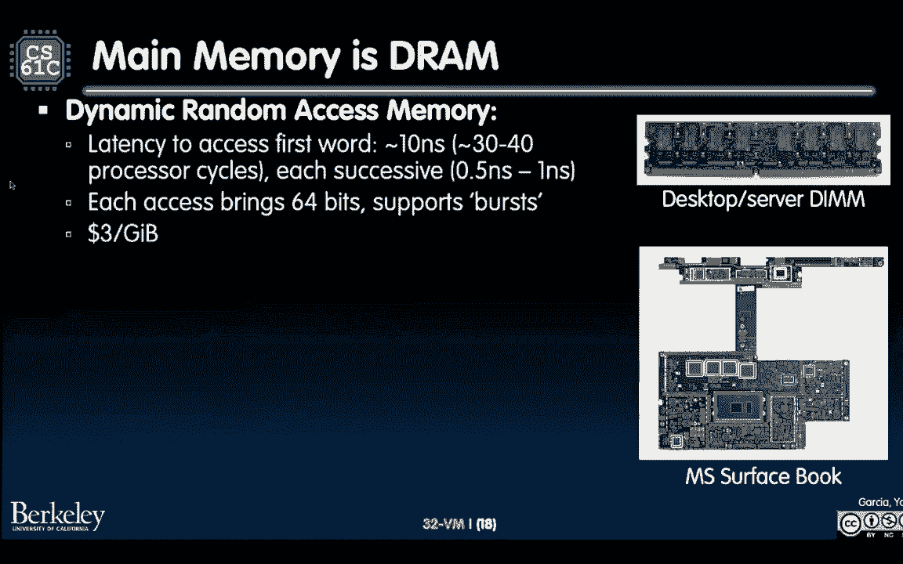

所以第一个是主存，你会听到我叫它Dram。

代表动态随机存取存储器，公羊大致做了什么，至少在统计方面，它是相当快的，所以只有10纳秒的时间，然后可能每一个连续的单词都快一点，每次加载一组单词中的每个轴，比如说六十四位，然后它还支持像脉冲加载。

这里是这里是这里的要点，也就是说，每千兆字节大约三美元，现在记住那个数字，为什么我有这个号码，一旦我们把它和s ram比对就知道了。

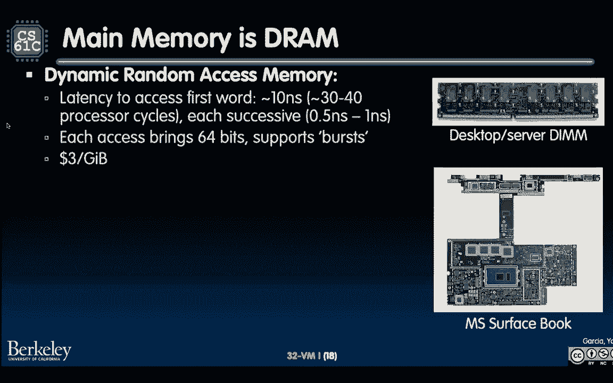

也就是缓存，但让我们来谈谈这个动态部分，因为你就像，好啦，DRAM就像记忆一样，记忆在改变吗，这里发生了什么事？动态实际上是指物理成分，就像这些DRAM芯片的物理创造，这里的动态是指L。

很多芯片上都有电容器，因此，通过或类似的表示位是通过某个晶体管实现的，可能是一个保持电荷或放电的电容器，对于那些学过物理7b或其他，呃，某种电子，M，电学和磁学类，你知道电容器，嗯。

随着时间的推移失去电荷，好啦，所以这里的动态部分是每隔一段时间，你只需要喜欢，再给它充电，这只是像DRAM现在必须做的事情，易挥发的部分，这是你会看到不稳定的东西，指的是DRAM需要恒定的电源。

从电容器的角度来看，这是有意义的，这没关系，电容器保持电荷，然后它不知何故输了，所以你总是要有一个恒定的电源，才能维持这样的电量，对比，这与SRAM或静态随机存取存储器，这是用来缓存的。

这里大致的区别是，静态意味着没有电容器，所以比特都是通过晶体管表示的，所以你不需要保持电荷，但它仍然不稳定，所以你仍然需要与权力有联系，而且要快得多，所以零点，五纳秒总是，但它更贵，而且密度也比较低。

好啦，所以DRAM的美妙之处在于你可以像，如果你只有一个电容器和一个晶体管，这比每个比特都有六到八个晶体管要小得多，都在行，好啦，这就是SRAM和DRAM之间的想法，这边有些照片，所以你可能又看到了。

如果你自己造了电脑，你见过这种暗淡的，这有点像笑话，当你添加更多的RAM时，或者喜欢下载更多RAM，你居然，你没有下载，在计算机中插入更多RAM，就是这个意思，但如果你要处理的是，比如说集成电路板。

就像笔记本电脑或微软的Surface，然后DRAM直接在芯片上，好啦，以及缓存，高速缓冲存储器，所有这些下一点，所以这是主存，超级超级快，有点贵，每千兆字节三美元，你可以想象它不能太大，现在呢。

让我们稍微谈谈磁盘，也就是我们所说的存储，也就是我们所说的二级记忆，这是不易挥发的，所以记住一个不稳定的，挥发性意味着你必须有一个持续的电源供应，非易失性意味着如果你拔掉电源，再插回去，你的数据还在。

最常见的两个版本，其中之一就是所谓的固态磁盘。

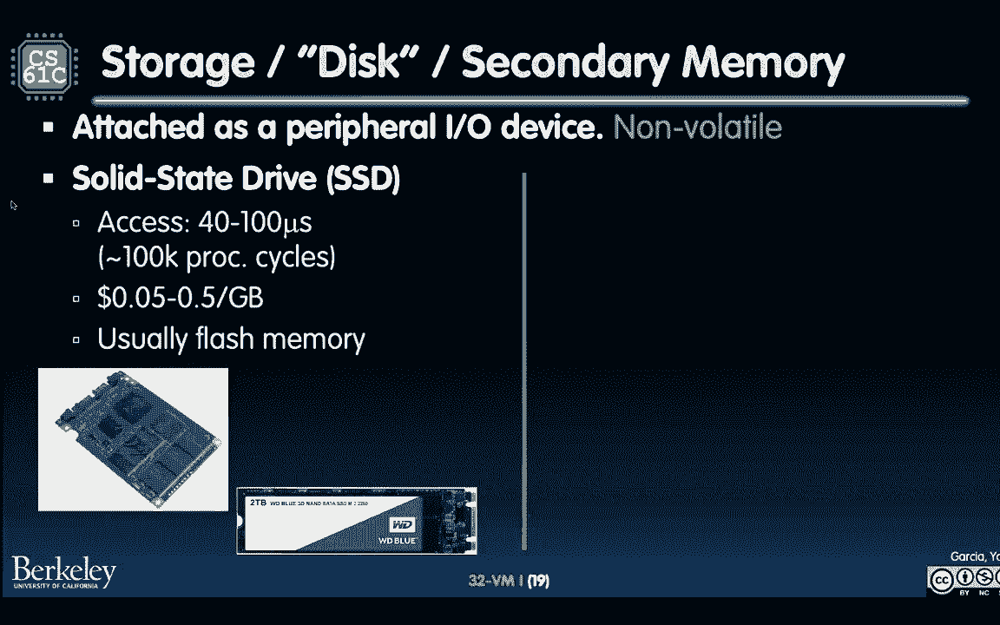

其中之一是所谓的硬盘驱动器，固态硬盘，原谅不是固态不稳定，SSD是什么，它通常是创建你使用一个构建使用所谓的闪存，这是一种略有不同的技术，但这里的想法是，现在我们在40到100微秒，对于那些不太记得。

纳秒和微秒的区别，纳秒是十的负九，微秒是10的负6，好啦，所以这比上一页的DRAM慢了一千倍，但是要便宜得多，DRAM是每千兆字节三美元，现在我们是，我们看到的可能是每千兆字节5美分，你可能见过一些。

呃，之前的一些标识，像西部数据，这些都有点像固态硬盘，但这里的想法是它是一个集成芯片，半导体技术是电子的，但它也是不易挥发的，另一方面，我们有机械硬盘驱动器，他们实际上有这个旋转。

这就是为什么它们被称为硬盘驱动器，然后他们有一个小机械臂，移动比固态硬盘便宜，也更稳定一点，我们将在一两周后进一步讨论这个问题，现在访问是五到十毫秒，毫秒是十的负三，所以这比SSD慢一千倍。

所以这是一种，我们在这里看到的角色。

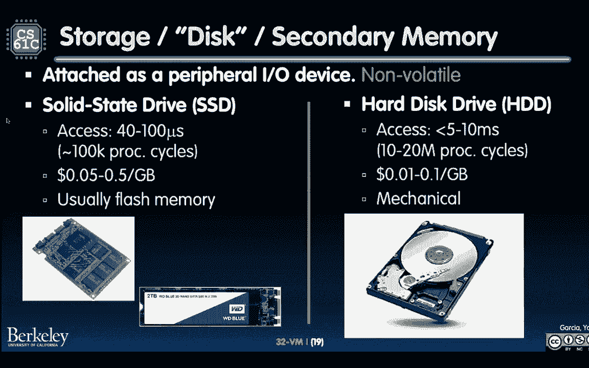

如果你有兴趣，这里有一段尼克·帕兰特的视频，我在斯坦福大学的一个同事，硬盘，他真的把它拆开了，然后你可以看到它就像机械，我只是做像商店商店反正，这是一个很酷的视频，好像有六分钟长，建议大家看一下。

如果你对SSD感兴趣，事实证明，固态硬盘是因为它们不像在单个芯片上，它们实际上可以像堆叠在一起，一种闪存中的三个D，方式类型，上课，如果您想了解有关SSD的更多信息。

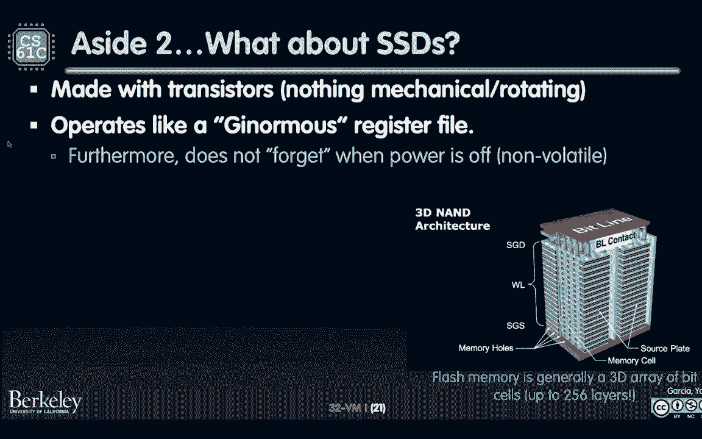

那是固态硬盘，又是这样，这有点像有趣的信息，对你有用，如果你有点像生活在CEF的生活中，但我今天想说的是我们的记忆是有物理限制的，以及存储或辅助内存的物理限制，因此。

我们需要某种方法来管理这些物理上有限的资源，在所有这些不同的过程中分享它们，这就是所谓的虚拟内存，还有虚拟地址，因为有虚拟内存。

我将用来激发虚拟内存的用例，您可能会想到更多的用例，但我觉得这两个人，在思考多编程方面最明显的，当多个程序共享同一内存时，如果主存很小怎么办，与程序地址空间相比，我们稍后将讨论地址空间的定义。

但相对简单，左边，这里我们有风险5 32位地址空间，那是什么意思，这意味着如果我们有字节可寻址内存，风险五架构说嘿，最多可寻址4G，好啦，所以这有点像，这个巨大的阵列就像在看这里，那是2到3 2字节。

那是五分，这就是节目所期待的，对吧，所以堆栈在最上面，就像所有的F，然后代码在最下面，然后堆在中间的某个地方，但就像程序期望的那样，你可以使用所有的空间，但是，如果你的DRAM。

如果你的主存只有1GB呢，就像身体上一样，你只有一首单曲，就像我们在上一页看到的那些小块，那么您将只有2到30字节的可寻址内存，相差四倍，那么你是怎么做的，你想尽力做好什么？

这里是这里是这里是一个解决方案，你说，好啦，我只是要尝试和地图，就像，我不知道，每次256个字节进入这个特定的物理内存空间，好啦，所以这里就像块，拦截器从所有零开始，这是下一个街区，这里是第三个方块。

这里是第四个街区，然后第五个方块，我的天啊，我就像没有空间了，就像没事一样，这可能不是该走的路，好啦，从某种意义上说，好啦，这里的洞察力是什么，洞察很可能，嗯，你们正在运行的程序可能很小。

所以你并不真的需要所有的两到三个两个可寻址的内存位，好啦，那么你如何计算出哪些字节保存在哪些内存中。

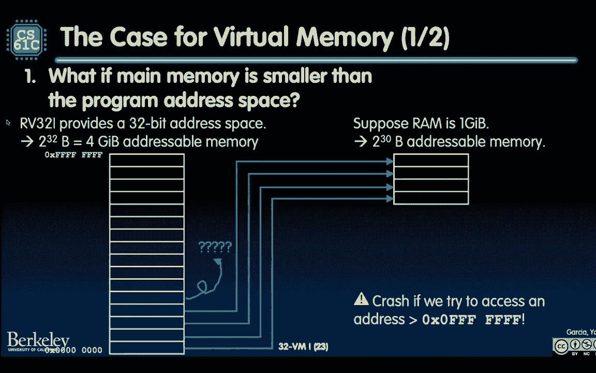

留在里面，或者说哪些数据要保留实际内存，问题是，这是第二个动机，即多个程序访问同一个内存地址，让我们考虑以下几点，假设现在我们有更多的公羊，我们决定一场演出是不够的，根据之前的幻灯片，我们就像，好啦。

让我们扩大到四个G的公羊，味道很合理，是啊，是啊，然后你有两个程序，你设法把他们，所以他们是一体的，分别是一个千兆字节和两个千兆字节，但让我们假设他们访问和覆盖相同的内存地址，例如。

也许程序一就是你的银行，你的银行程序，这就像把你的账户余额存储在这个地址一样，文本四百，所以它存储了四十二个很好的，也许你的化合物里有四两美元，那很好，但是你有程序二，上面写着，好啦。

现在我要同时运行一个电子游戏，在同一个操作系统上，就像在同一台电脑上，你会喜欢，我不知道，也许这就是你的生命数量，或者大约一万，然后你再把它储存起来，见鬼，四百块，会发生什么，突然间你变得富有多了。

但也不知何故是的，是呀，但就像是的，好啦，所以，但喜欢反正，程序已经覆盖了另一个程序数据，这很糟糕，这就是我们所说的腐败，好我们可以，你知道的，我们可以在这门课之外讨论腐败的其他定义，但那不是。

这就是这个想法的重点，我们要讨论的是数据损坏，这就是操作系统，虚拟内存类型的东西需要处理什么，保护程序或进程不受其他进程的影响，所以它们有不同的空间，他们甚至不知道彼此的存在。

它们不会干扰彼此如何运行和保存数据，或者访问他们的数据，所以这就是我们现在所处的位置。

我们有，好啦，谈谈定义，你先坐一下，因为时钟就像，好啦，所以如果你们知道，我不知道你们知不知道，但是在后面有一个红色的小钟，十一十四，现在不是时候，十四十，好啦，但这是我通常看的那个，我很害怕。

所以我吓坏了一秒钟，但我们还有20分钟，好啦，所以我们可以谈论虚拟内存，让我们来谈谈虚拟内存，虚拟内存是一个想法，你可以看到时钟，编辑你自己的时钟，有些人不是别人的道路，但让我们在地址的上下文中讨论。

进程拥有完整内存地址的想法或错觉，它可以和，它是孤立的，从某种意义上说，它不知道有另一个进程在运行，它还认为它有足够的内存地址空间，不知何故，这种管理正在发生，它解决了两件事，其中之一就是这种保护理念。

因此，避免从其他进程损坏进程，其中之一就是记忆是固定的，假设我们只有四个gib字节的ram，然后所有其他潜在的误差，比如进程需要访问的地址就在磁盘中的某个地方，好啦，所以这有点像在RAM中工作信息。

然后其他到目前为止还没有使用的东西都在磁盘上，每个程序，这就是虚拟内存所完成的，这里有一些好处，我们会再次报道Lyde，一旦我们确切地看到虚拟内存是什么，但其中一个想法是所谓的需求分页。

这大概就是我所说的，但我要再说一遍，程序将运行，它们会增加它们所拥有的内存足迹，换句话说，也许他们一开始在主存中没有信息，然后当他们跑得更多的时候，它们将更多的信息从磁盘加载到内存中。

然后更多的信息从磁盘到内存，但如果他们暂时不逃跑，这些记忆慢慢地被赋予其他进程，等等，等等，所以这是按需寻呼，稍后我们将讨论什么是分页，第二件事是我们在操作系统中讨论过的保护问题，第三件事是，实际上。

这个虚拟内存的想法实际上隐藏了不同的机器配置，好啦，所以即使一台电脑有4G的内存，另一台电脑有8G的内存，另一台电脑有16G的内存，程序都可以相信他们有2到3 2位或3位，两到三十二个可寻址的咬位。

咬可寻址存储器，至少在节目现场，虚拟内存给你带来了一种抽象。

今天所有这三个差异，或者像这三个好处一样，哪个最有用，事实证明，它实际上是不同过程之间的保护，当我们进入一些应用程序时，我们会更多地讨论这一点，但这里的想法是公羊变得如此之大，就像记忆变得如此之大。

进程共享内存实际上没什么大不了的，但它们绝对不应该互相覆盖，无论发生什么，好啦，除非他们被允许，今天是术语课，不过，别担心，下次我们也会复习很多，我说过地址空间，我只想说现在我们实际上有两个地址空间。

这就是虚拟内存的力量，第一个是所谓的虚拟地址空间，第二个是物理地址空间，我这么说是什么意思，虚拟地址空间是我们之前讨论过的风险五的土地，也就是说，每个程序或用户程序都认为它有从十六进制零。

一直到十六进制，在这个三位两位可调的空间世界里所有的F，物理地址空间是您在以前的幻灯片中看到的那些橙色框，这是可用的实际内存，这里可用的内存的实际字节地址，这对用户应用程序和虚拟内存是隐藏的。

所以这里的想法是程序总是在这个虚拟地址空间中运行，有某种翻译器可以翻译所有这些虚拟地址，所有这些访问和所有进入物理访问的东西，到内存或两个磁盘，你会听到我说这个词记忆管理器，但我会试着用翻译这个词。

因为我真的认为这就是这里发生的事情，将一个虚拟地址转换为物理地址。

让我告诉你一个有点像，让我给你看一个图表，可能会对这个想法有所帮助，假设在左边我们有多个过程，都同时运行，并将它们表示为不同的核心，或者你知道，就像一个不同的CPU，你可以想象所有喜欢不同的CPU。

也总是访问相同的内存，这是一个有用的，这是一种有用的思考方式，但这些也可能不同，就像CPU的咒语一样，它运行得非常快，同时非常接近，所以这些都是不同的进程，都在运行，他们都认为他们有自己的虚拟地址空间。

这包括工作人员，堆，他们自己的程序代码，就像在文本部分，他们自己的程序数据，所有这些类型的事情，好像有三份不同的副本，或者更确切地说，他们甚至不知道有三个独立的副本，他们只知道他们有自己的副本。

这就是虚拟地址，但是，引擎盖下发生的事情是那三份副本。

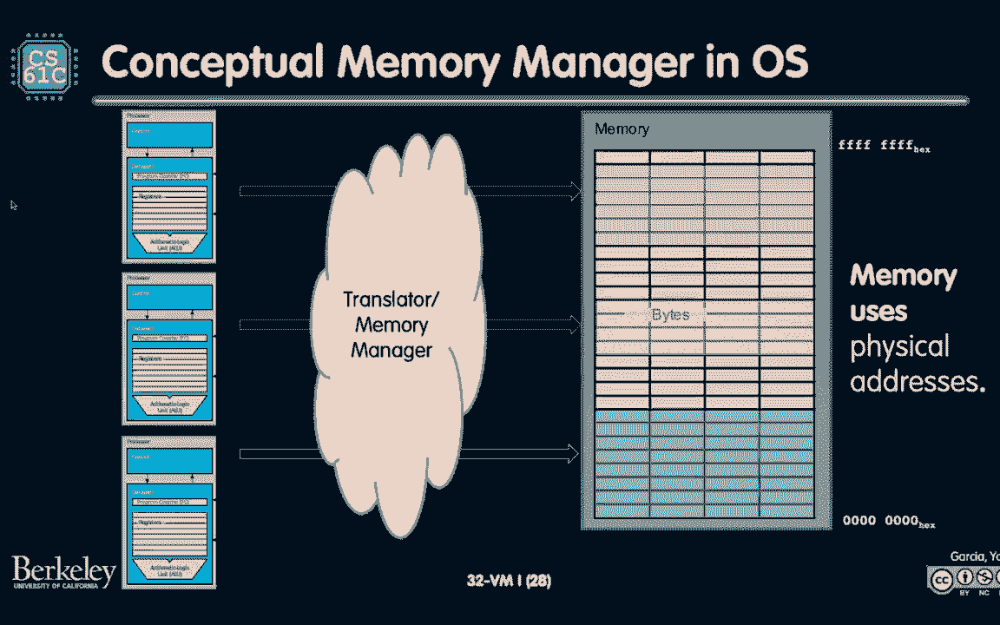

他们只是回到上一张幻灯片，那三个虚拟地址副本。

它们都映射到相同的物理记忆中，可能要小得多，所以这个翻译器所做的，或者内存管理器每次，任何进程都想访问内存中的某些内容，它总是通过这个记忆转换器。

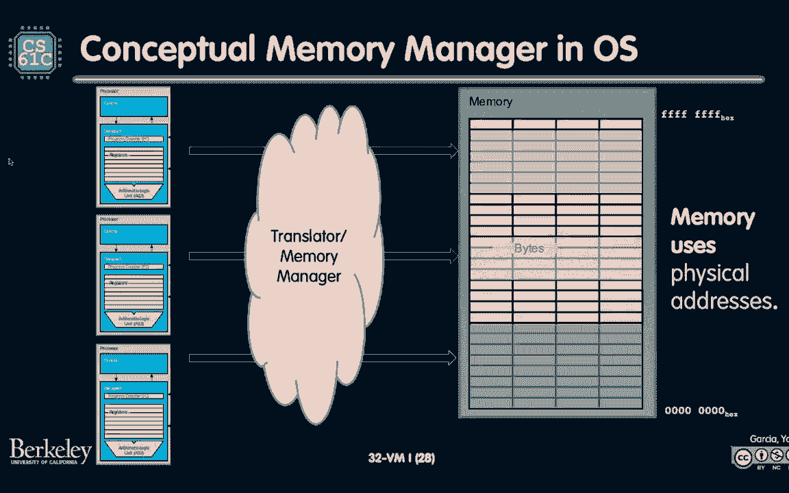

你知道它总是通过记忆转换器，然后可能程序一就会像上面这个区域，可能程序二得到了第二个区域，可能三号程序会进入第三个区域。

但它不知道程序，不知道这个，操作系统做什么，就像操作系统的翻译器，就是，它只是将这些虚拟地址映射到物理地址，现在呢，有点复杂，如图所示，这些区域是毗连区块，原来它不是连续的块。

但这正是我们接下来要讨论的。

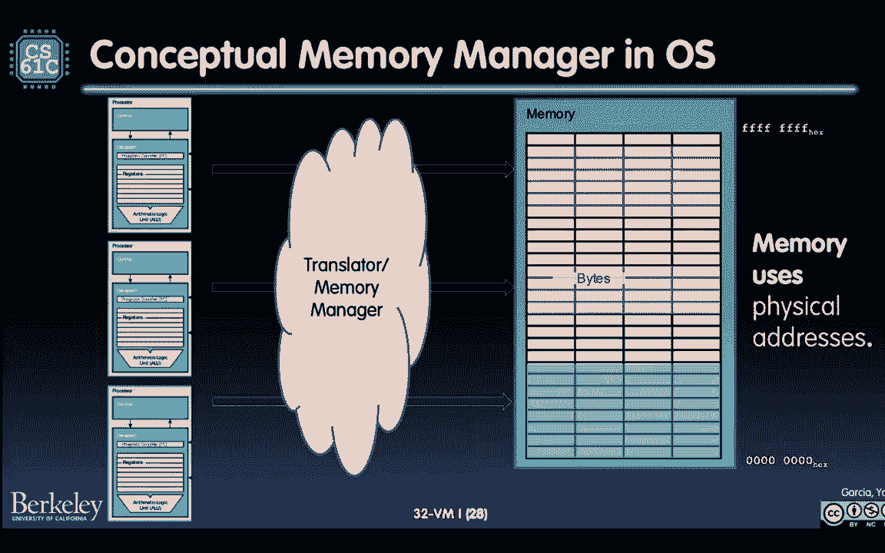

但在那之前，我只是想给你看看蜂巢机是怎么说的，关于这些地址空间，所以如果你呃中央处理器的信息，所以如果你只显示蜂巢机器的CPU信息，你会看到所有不同的处理器，你得到的所有不同的信息。

你可能已经在之前的课程中看到过了，我想用这个给你看看，呃，这个特殊的CPU信息，在最下面有一条小线，地址大小，上面写着39位可见和4位8位虚拟，我的天啊，所以这里好像发生了什么事，你就像，你知道的。

就像，如果你是个网络侦探，东西，你不知道虚拟内存，你就会看到这个，你就像，嗯哼，这是人们没有告诉我的事情，但我们现在告诉你。

我现在告诉你，所以我要以什么结束，他们很像吗？你知道的，这节课还有两个部分，但我要从，虚拟内存的概念真的很详细吗，好啦，但是为了理解虚拟内存，我想让你就像，你知道的，回到两周前。

忘掉你所学到的关于缓存的一切，我知道你喜欢，你为什么要这么做，是啊，是啊，我知道，不过没关系，所以事实证明缓存会很有用，因为他们就像真的一样，我们要看看它们是如何相互作用的，但这将是非常混乱的。

如果你现在考虑缓存，所以我们现在的抽象是，如果CPU想要访问内存，它必须一直到萨克拉门托，这里没有中间，这只会让下一节课更容易，然后我们将带回缓存并展示它是如何工作的，但现在假设每次内存访问都很慢。

好啦，有没有有没有，这里没有加速，我看到每次内存访问都很慢或更慢，好啦，所以你要么进入主存，或者你一直到磁盘，好啦，有没有有没有，这里没有捷径。

好啦，这就是我们正在使用的版本，这对我们有什么帮助，让我们考虑一下在这个领域中什么是有用的应用程序。

在那里我们没有任何缓存，嗯其实，也许这是一张很好的总结幻灯片，我要再重复一遍这张幻灯片，可能下次也是，但是这个虚拟翻译有三个责任，或者虚拟内存管理器必须做其中一个。

其中一项职责是为每个进程将虚拟地址转换为物理边缘，第二个是它必须有效地利用资源，所以如果我们只有缓慢和缓慢，AC将尝试管理内存之间的权衡，类似于内存的东西以及存储在磁盘中用于每个进程的东西。

它要做的第三件事是保护的想法，启用内存访问的排序，所以每一个过程都是孤立的，除非他们应该写在相同的位置，让我们详细地讨论其中的每一个。

但是让我们来谈谈页面内存，所以我要，好啦，所以我告诉过你要把一切都想清楚，让我让我像闪现一点缓存，记住缓存是如何像块一样的，你一次加载块和单词，现在我们要一次加载页面，页面要大得多，这里会有一点背景。

虚拟内存实际上是在缓存出现之前发明的，所以它使用了一个稍微不同的术语，我知道这很让人困惑，但这实际上会帮助你思考维度，在记忆的数量级上，所以页面内存，我这么说是什么意思，我的意思是，记住。

内存中的所有东西实际上都是从磁盘中的某个东西复制和加载的，所以这里发生的事情是，当任何东西从磁盘加载时，它实际上是以页面为单位加载的，挺大的，所以现在在现代操作系统上大约是四个KB字节，因此。

如果您有四个QB字节的数据，然后你把这个加载到你的记忆中，那么如何访问每个字节的数据，你在那里需要什么，比如你需要什么样的地址，你需要十二个比特，也许是因为如果你有四个QB字节，那是十二字节的二。

如果你想索引每一个字节，你需要12位我们称之为页偏移量。

为什么这有用，记住第一步，第一步，我们希望内存管理器将虚拟地址转换为物理地址，但这里有一个诀窍，许多内存管理器，事实上，所有内存管理器使用，也就是说，让我们保持物理页面和虚拟页面的确切大小相同。

翻译只是变成哪个虚拟页码，映射到哪个物理页码，然后这些地址的低位都是一样的，因为那是页偏移量，它有点提醒你自己那个缓存是什么，就像标记索引偏移的东西在这里，我们是说补偿都是一样的。

这使得我们可以非常有效地进行翻译，我们只需要查找哪个物理页码，ppm映射到哪个虚拟页码，反之亦然，所以让我们来看看这个，那是很多信息，所以让我们来追溯一下这个的两个版本，你看这里我有一张页表。

哪个是我们的查找表，在这里我把它放进云里，因为页表的写法和这个略有不同，但我的想法是，让我们假设我们要将一个字节加载到寄存器中，我们想通过文本加载，f，f，f，zero，one，to，t，zero。

in，x，zero，只允许我加零，这就是我们正在调查的地址，为了让这一切再次发生，程序只是在虚拟地址空间中工作，所以程序认为这确实是字节的地址，它想装进去，现在它尝试访问内存。

然后操作系统就像没有坚持住，我帮你翻译一下，其实呢，它甚至没有说不，就像是，哦耶，是呀，是呀，是呀，然后它就像偷偷翻译一样，然后得到信息，但是你知道，想象一下，所以页表，页表在这里做什么。

计算机实际上是操作系统，我们会更多地讨论这个问题，下次我们将分几个步骤将这个虚拟地址转换为物理地址，第一个是，它将尝试提取页码，虚拟页码，如果我们在处理一个3位2位可寻址的虚拟空间，每页都是二到十二位。

我们的页码将是前20位，这有点像想在这里快速地把它们脱掉，然后页表有一个巨大的，它只是一个巨大的查找表，页表上说可以，哪个虚拟页码，或者如果我在这里找到虚拟页码，是哪个物理页码，所以在这种情况下。

我们查一下，好啦，我们说好，这里最有趣的部分都是FS，我们在页表上查一下，哎呦，那是最后一排，最后一排，我不知道，我指的是，我有最后一排的一点，这里实际上是物理页面的第一页。

所以它进入了物理页面的第一页，但现在哪个字节加载得很好，它只是物理页码的串联，和原始页偏移量，那么这里的页偏移量是多少，页偏移量是虚拟地址的较低的12位，连接到物理页码的上二十位，在这种情况下都是零。

最底层的人，所以发生的好事，也许在我们这里的DRAM里，假设这是我们的尺寸，第0页是第一行，第一页是第二行，我们只是一直到最低的字节，我们加载那个字节，好啦，事情就是这样，所以让我们完成第三步和第四步。

第三步是它现在确实位于内存中，所以我们只是去访问物理内存，然后第四步是我们把咬到的东西，我们把那个字节返回给程序，好啦，不是那样的，让我们在这里再举一个例子，让我们假设我们处理的是。

让我们假设程序现在要加载，呃一千三十，好啦，它怎么会做同样的事情，页表会说，是呀，是呀，是呀，是呀，那个地址肯定存在，嗯哼，嗯哼，然后就像第一个，前二十位，六万查一下，这就是虚拟页码，查一下，就像。

我的天啊，它不在这里，它不在物理页面上，那么它是做什么的呢，它访问磁盘，它访问这个，在页面中加载对应于特定数据块的，在这一点上，现在它已经加载到那个页面到内存中，离开磁盘或离开磁盘，更新页表说，好啦。

也许这个页面现在在物理页面的第二行，最后它从内存中读入数据，好啦，注意这里有两个入口，在薄雾中，好吧，秋天在这一页上，我们下次再谈这个，但页表上写着，好啦，我们得一路走到磁盘上，所以OS做的是说，好啦。

我要一路走到磁盘上，将该页加载到内存中，然后我要把那辆自行车从记忆中加载回过程中，这里有两个入口，就这样了，这就是虚拟内存在一个非常非常高的水平上，好啦，那么页表是什么样子的呢，你知道我之前在云端。

所以让我们看看它是什么样子的，假设以下情况，所以我们仍然在处理同样的想法，这里我们有三个二位的虚拟地址空间，那应该是小写的，B我会解决的，小写b，我们做到了，这里的小写b位。

然后我们这里有2到12位的页面，如果是这样的话，我们有多少虚拟页码，如果我们寻址到每页12个字节，然后我们有两个到二十个虚拟页码，页表是什么样子的每个进程只有一个页表，因为这就是这个特定程序的所有查找。

它要做的是，顶部的页表实际上是实现的，每个虚拟页码都有一个条目，那个虚拟的入口会有一些东西，物理页码或磁盘（如果不可用），磁盘地址（如果不可用），也可能是一些状态位，我们下次会更多地讨论。

这个是如何地址的，或者这个是如何索引的，那么好吧，每个条目，有入口的零，这里是带页码的零，然后这里的最后一个条目，所有f的十六进制，那是最后一页的号码，所以用缓存术语来说，它有点像虚拟页码。

下面是页表项的索引。

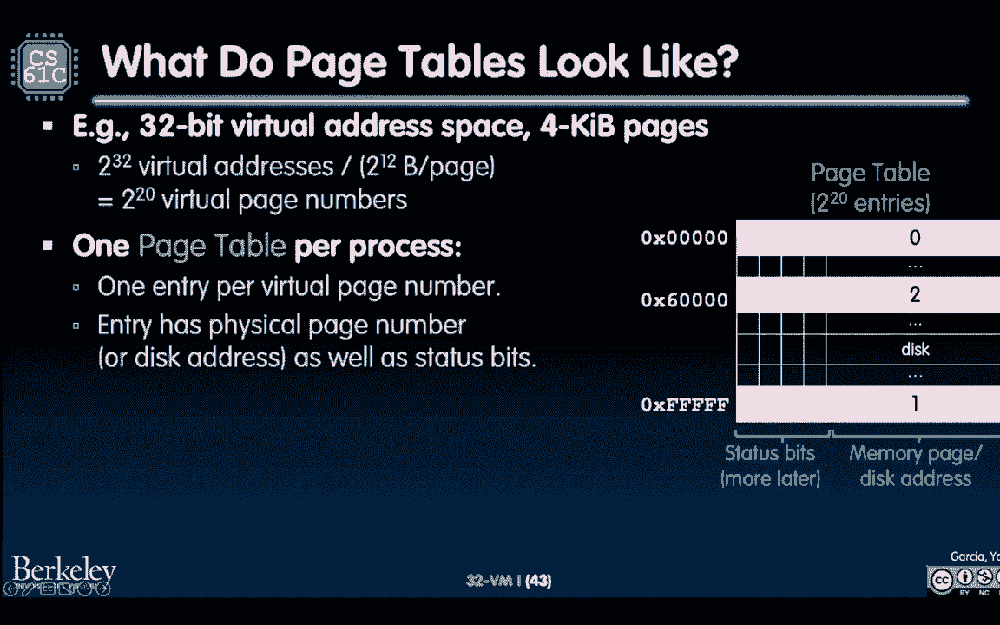

尽管我说过这是最重要的一点，这就是为什么我喜欢把它栓起来，如果你有讲义，你真的应该试着把它圈在这里，页表不是缓存，这就是为什么我们很方便地忘记了缓存，除了当我方便地把它带回来的术语，好啦。

所以页表不是缓存，为什么这里没有空间局部性的东西，有了这个查找表，每个虚拟页码都有一个条目，好啦，虚拟页码没有覆盖，内存中发生的页表中的其他虚拟页码，但不是在页表本身。

所有虚拟页面页表都有一个有效的条目，但如果这对你有帮助，也许又是一些术语，暗想缓存，就是，这里没有标签，索引是虚拟页码，就是这个想法，页表只是一个查找，现在呢，这有什么帮助。

这里有一点我只想用我们所拥有的来结束，现在，我们有一种方法可以通过这个页表进行翻译，虚拟到物理地址，我们有一种既使用内存又使用磁盘的方法，通过这个想法，如果它不在记忆中，然后操作系统将进入磁盘，上膛。

然后用正确的信息更新页表，但是这种保护思想呢，如果两个进程访问相同的内存，会发生什么，下面是视图的样子--每个进程都有自己的页表，假设我们这里有三个过程，我们有橙色的。

绿色的和蓝色的，他们都有页表，然后这些突出显示的是，呃，我们走吧，是啊，是啊，页表中这些突出显示的条目是那些在内存中有位置的条目。

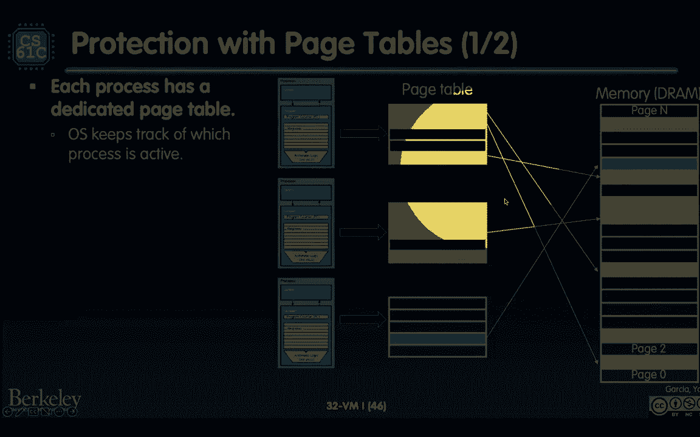

幻灯片底部的最后一个要点，您可以拥有跨不同进程映射到相同页码的虚拟页面，例如，也许您需要查找当前运行系统的用户，应该只对两个用户进程都读取的某种系统数据。

在看这些数据，那么，这是如何通过状态位权保护来实现的呢。

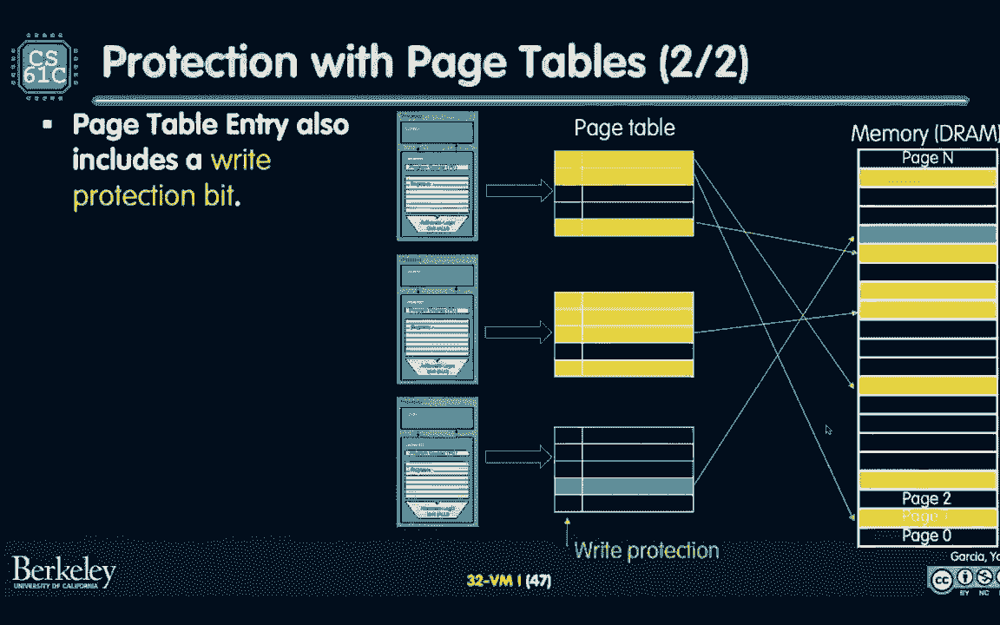

所以在这个特殊的情况下，我是说再来一次，我们没有特别的数学，也许我会稍微更新一下图表，但如果状态正确，然后页面受到保护，这意味着这两个程序，如果他们看到这个虚拟页面，他们只能从那一页上阅读。

如果他们试图存储到那个页面，然后操作系统就会触发，所谓的例外，然后不允许事情发生，也许中止这个过程，那么这是如何工作的呢，啊，有点诡异，下次再说吧，所以我们星期三再来，我们将更多地讨论虚拟内存。

这将是一个好时机，你们星期一过得愉快吗？记得投票，谢谢哇。

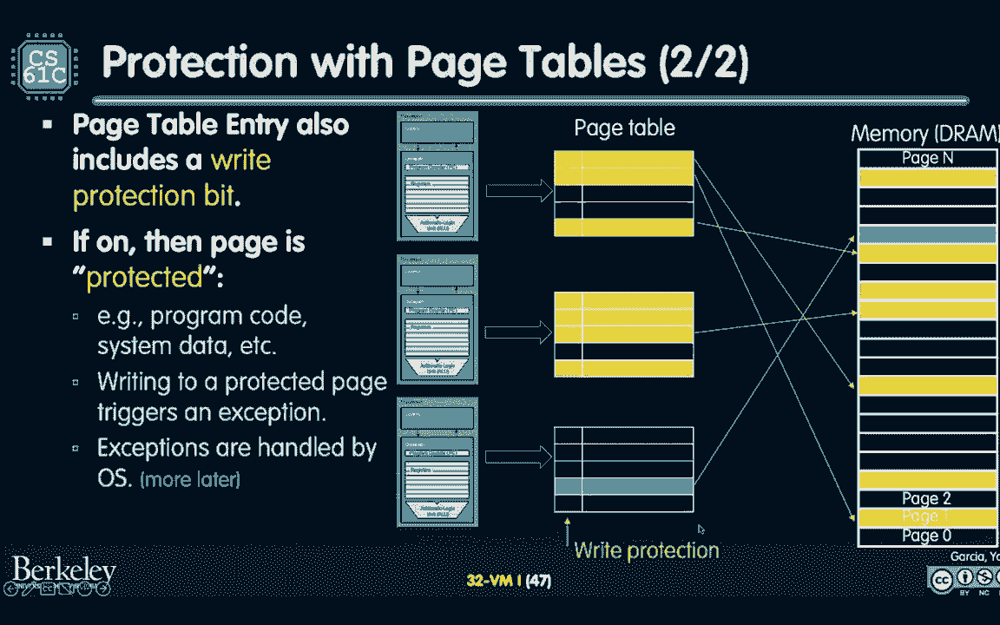