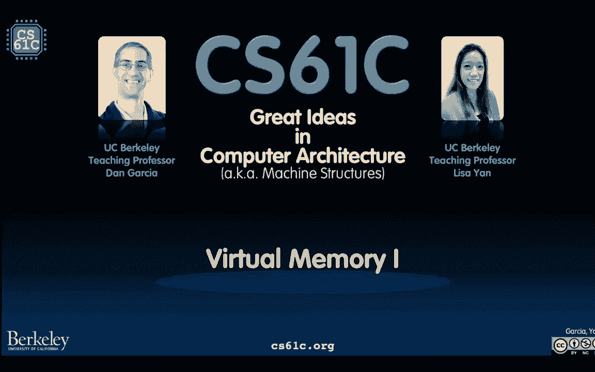
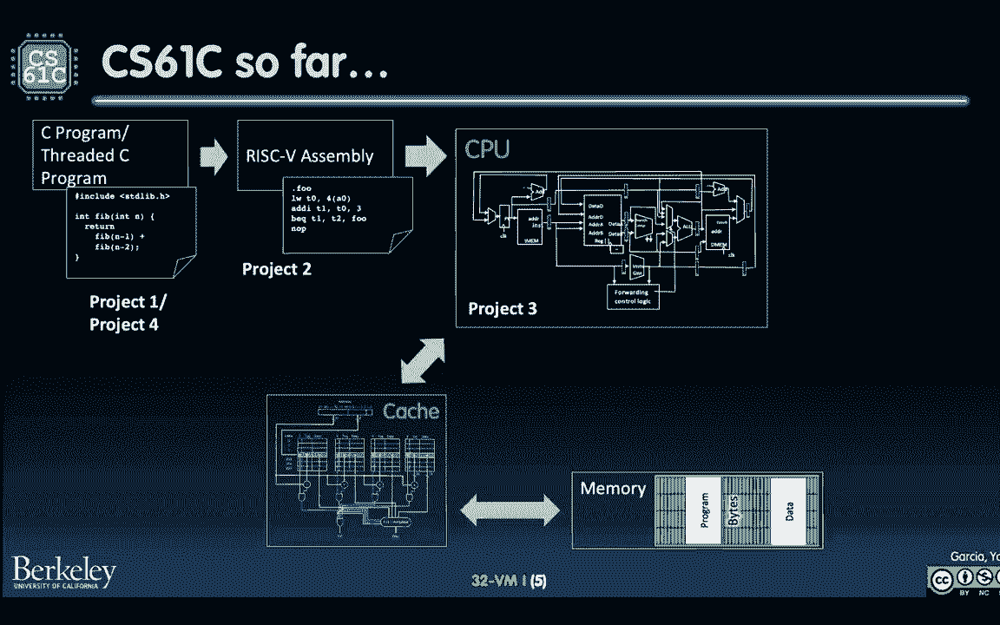

# 课程 P42：第 32 讲 - 虚拟内存 I：简介 🧠💾

在本节课中，我们将要学习操作系统的一个核心概念——虚拟内存。我们将探讨为什么需要虚拟内存，它是如何工作的，以及它如何让多个程序安全、高效地共享有限的物理内存资源。

---

## 计算机系统概览 🖥️

上一节我们回顾了计算机的基本组成。本节中我们来看看现代计算机如何同时运行多个程序。

我们要开始放幻灯片了。幻灯片加载可能有些缓慢，但它们很快就会被张贴出来。

所以今天我们要多谈谈这台我们一直在讨论的电脑。在过去的几周里，我们讨论了这种快速访问数据的方式（缓存），它不需要一路走到主存。我们也讨论了线程，即一个程序（进程）如何利用多个核心，这被称为多线程或多处理。

但让我们后退一步，谈谈计算机本身。

那么我这么说是什么意思？让我们回顾一下经典的 CS61C 课程中的机器结构图。你会看到我强调了一些部分：内存（我们将在本单元更多讨论）以及 I/O 系统（I 代表输入，O 代表输出）。我们还要假设存在某个操作系统（如 Mac OS X、Linux）。你会发现这确实超出了 CS61C 的范围，所以我们要把这些对我们正在讨论的事情很重要的部分拿出来。你现在可以在 CS162（操作系统）课程中了解更多。

如果我们看一下新的学校机器结构图，我试着在这里加入了一点内容：这里没有真正的方框，但我试着放入了这个小方框。我们将讨论并行程序，即可以同时运行多个程序（例如幻灯片、Slack 或电子邮件）的想法，即使是在单个处理器上。这就是我们将在本单元讨论的内容。

---

## 课程项目回顾与定位 📚

到目前为止我们在哪里？我从项目方面概述了一下。项目四不在这里，请再忍耐一下。

以下是我们在本课程中已经完成的项目：
*   **项目一** 是关于 C 程序的思想。事实上，我确实把项目一给了一位同行，因为它是关于线程 C 程序的。你有一个单一程序完成一件事，然后也许你可以多线程化它以更快完成。
*   **项目二** 讨论了 RISC-V，一个精简指令集架构。我们编写 RISC-V 代码，C 代码被编译成汇编，然后汇编再编译成机器代码。
*   **项目三** 是构建自己的 CPU。CPU 是处理器，是真正执行指令的东西。它与两个项目有交互：一个是缓存（用于存放最近使用的数据），如果数据不在缓存中，则需要去访问更远的主存。

在这一点上你可能会想：等等，这在 Venus 模拟环境中是合理的。我知道如果我启动 Venus 运行一个程序，它会运行然后停止。但我的笔记本电脑看起来完全不同。

假设左边是我的笔记本电脑。第一，它有视觉元素，不仅仅是代码，还有屏幕、键盘、存储设备。这就是我们所说的输入/输出。注意，存储也在这个范畴内，我一会儿要讲一点。第二，你的笔记本电脑可以运行多个程序，而 Venus（至少在我们的迭代中）不能。第三，有一种叫做操作系统的软件，负责管理和协调所有这些程序。所以我们要稍微谈谈操作系统是如何工作的，以及哪些资源需要在所有这些程序之间共享。

---

## 物理硬件：内存与存储 🧩

现在你可能有点想知道，为什么 I/O（比如磁盘）在哪里？让我们看看另一台电脑：那是带屏幕和键盘的笔记本电脑。让我们来看看树莓派。树莓派是一台超级便宜的电脑。如果你没有焊接所有不同的端口，主板大约 35 美元。如果你在上面焊接东西，就可以插入显示器等设备，然后运行像 Linux 这样的系统。

那么让我们看看这里的主板上有什么：
1.  我们从 CPU 和缓存开始。这里有一个美元符号图标，代表缓存（因为“cash”听起来像“cache”）。
2.  第二件事是内存。请注意，它与 CPU 是完全分开的，但焊接在同一块板上。
3.  还有许多不同的 I/O 设备通过端口焊接。例如，我们有一个 USB 端口、一个以太网端口、无线 WiFi、一个迷你 HDMI 端口可以连接到屏幕。
4.  最后一件事是存储 I/O：一张微型 SD 卡。这就是当我说存储也是一种 I/O 设备时的意思，因为它通常是通过某种端口连接的。

即使在笔记本电脑里，例如我的笔记本电脑有 256 GB 的存储空间，那和 8 GB 的 RAM 不一样。那么 CS61C 和树莓派怎么样？如果你感兴趣，实际上可以用树莓派覆盖 CS61C 中的所有概念。这将是一个很好的冬季项目。

那么我们在哪里？这是我们看到的原图，但这次我们要谈的是内存、I/O 设备，以及如何管理在许多几乎同时运行的程序之间共享的资源集。

---

## 操作系统简介 🛡️

所以这就是我们今天所处的位置。在接下来的两节课中，我将介绍操作系统的基础知识。我们有整整一学期（16周）来学习操作系统，我们只是要涵盖基本部分，这样你就知道它是如何相互作用的，以及它如何允许你管理程序。

让我们首先谈谈一个高级概念：上下文切换。

我要谈谈操作系统。对你们很多人来说，操作系统可能像是一个神奇的东西。原来操作系统只是软件，是特权软件，可以运行其他用户程序无法运行的特殊功能。

让我们看看操作系统的代码规模。在数百万行代码中，你可以看到 Linux 内核（早期版本）有两百万行代码，Windows 在 1993 年有五百万行，Android 操作系统有 1200 万行，而 2014 年的 Mac OS X 有八千六百万行代码。所以这是操作系统的大小，它可能是你机器上运行的最重要、也是最大的软件。

所以我告诉过你这很重要。以下是操作系统所做事情的概述：
*   它是计算机启动时运行的第一个软件。它启动各种服务（如文件系统、网络栈、键盘等）。
*   它提供了计算机上运行的 I/O 设备和程序之间的交互。
*   它管理不同的程序。它是一个管理其他软件的软件。它加载程序（通过加载器），并告诉 CPU 接下来运行哪个程序。

这里有几个关键术语：
*   **隔离**：操作系统使每个进程感觉它是孤立的，可以控制所有不同的资源（内存等）。
*   **资源共享**：同时运行的进程共享内存、I/O 设备等。
*   **时间共享**：操作系统负责在所有不同程序之间分时使用 CPU。

这就是我们所说的**多道程序设计**，不要与多处理混淆。多处理是指有多个 CPU。多道程序设计是指多个程序可以“同时”运行在同一个单核上。我为什么给“同时”加上引号？因为 CPU 一次只能运行一件事（暂不考虑指令级并行）。从人类的角度看，它们大致同时运行，因为操作系统进行非常快速的**上下文切换**。

上下文切换有效地完成以下任务：它将当前进程的状态（程序计数器、寄存器等）保存在某个地方，然后将下一个进程的状态加载到 CPU 上。注意：上下文切换**不**切换内存。因为切换所有内存内容（需要访问主存）太慢了。上下文切换只改变 CPU 中的内容。因此，关于进程如何共享内存，需要有一些特殊的东西。

---

## 内存与存储的区别 📊

我们想知道：如果我们有内存，并试图切换上下文，但又不想总是为所有可能同时运行的不同进程切换内存，该怎么办？但首先，让我们了解一下内存和磁盘的区别。

在这个内存层次结构的金字塔中，我们算是垫底了。这里我们讨论的是**主存**，它实际上是随机存取存储器。在它的正下方是**二级内存**，或我们所说的**存储**或**磁盘**。金字塔告诉我们，所有在更高层的东西实际上都是下层东西的副本或子集。

在树莓派上，你可以想象内存是芯片本身（但与 CPU 分开），而存储（如微型 SD 卡）是一种 I/O 设备。

让我们来谈谈你可能看到的一些术语：
*   **主存**：你会听到我叫它 **DRAM**，代表动态随机存取存储器。它相当快（约 10 纳秒），每 GB 约 3 美元。“动态”是指其物理成分（使用电容器存储电荷，需要定期刷新）。“易失性”是指 DRAM 需要恒定电源。
*   **缓存**：使用 **SRAM**，静态随机存取存储器。“静态”意味着没有电容器，通过晶体管表示位。它更快（约 0.5 纳秒），但更贵，密度较低。
*   **磁盘/存储**：这是非易失性的（拔掉电源数据还在）。最常见的两种是：
    *   **固态硬盘**：使用闪存技术，访问时间约 40-100 微秒，每 GB 约 5 美分。
    *   **机械硬盘**：有旋转盘片和机械臂，更便宜，访问时间约 5-10 毫秒（比 SSD 慢约 1000 倍）。

所以我们的内存是有物理限制的，存储（辅助内存）也有物理限制。因此，我们需要某种方法来管理这些物理上有限的资源，并在所有不同的进程之间共享它们。这就是所谓的**虚拟内存**。

---

## 虚拟内存的动机 🎯

我将用两个用例来激发虚拟内存的需求，这两个用例在思考多道程序设计时最明显。

**动机一：主存较小**
与程序地址空间相比，如果主存很小怎么办？左边，我们有 RISC-V 32 位地址空间。这意味着最多可寻址 4 GB（2^32 字节）。程序期望可以使用所有这些空间。但是，如果你的 DRAM（主存）只有 1 GB 呢？那么你将只有 2^30 字节的可寻址内存，相差四倍。那么你怎么做？你想尽力做好什么？一个解决方案是尝试映射块，但可能空间不够。洞察是：正在运行的程序可能很小，并不真的需要所有的可寻址内存。那么你如何计算出哪些字节要保留在实际内存中？

**动机二：多个程序访问相同内存地址**
假设我们有 4 GB RAM。你有两个程序，分别需要 1 GB 和 2 GB。但假设它们访问和覆盖相同的内存地址。例如，程序一（银行程序）将账户余额存储在地址 0x400，值为 42。程序二（游戏）将生命值存储在相同的地址 0x400，值为 10000。会发生什么？程序二覆盖了程序一的数据，这很糟糕。这就是我们所说的**数据损坏**。操作系统和虚拟内存需要处理这个问题：保护进程不受其他进程影响，使它们有不同的空间，甚至不知道彼此的存在，不会干扰彼此的运行和数据访问。

---

## 虚拟内存：概念与定义 📖

我们有……好吧，谈谈定义。虚拟内存是一个想法：进程拥有完整内存地址的想法或**错觉**。它是孤立的（不知道有其他进程在运行），并且认为它有足够的内存地址空间。这种管理解决了两件事：
1.  **保护**：避免进程被其他进程损坏。
2.  **内存有限**：假设我们只有 4 GB RAM，那么进程需要访问的其他地址就在磁盘中的某个地方。RAM 中存放正在使用的信息，暂时不用的放在磁盘上。

虚拟内存的好处：
1.  **按需分页**：程序运行时，逐渐将更多信息从磁盘加载到内存。如果暂时不运行，内存可能被分配给其他进程。
2.  **保护**：进程之间隔离。
3.  **抽象机器配置**：即使不同电脑内存大小不同，程序都相信它们有完整的地址空间（如 2^32 字节）。

今天所有这三个好处中，哪个最有用？事实证明，实际上是不同进程之间的保护。RAM 变得如此之大，进程共享内存实际上没什么大不了的，但它们绝对不应该互相覆盖。

现在是术语课。我说过地址空间。现在我们实际上有两个地址空间：
*   **虚拟地址空间**：这是 RISC-V 的世界，每个用户程序都认为它有从 0x00000000 到 0xFFFFFFFF 的地址空间。
*   **物理地址空间**：这是可用的实际内存字节地址。

程序总是在虚拟地址空间中运行。有某种**转换器**（或内存管理器）将所有虚拟地址访问转换为物理地址访问（到内存或磁盘）。

让我用一个图表来说明这个想法。假设左边有多个进程同时运行。它们都认为有自己的虚拟地址空间（包括栈、堆、代码、数据）。但引擎盖下发生的事情是，这三个虚拟地址副本都映射到相同的、可能小得多的物理内存中。这个转换器（操作系统）所做的就是将这些虚拟地址映射到物理地址。目前，图中显示为连续的块，但实际上不是。这正是我们接下来要讨论的。

---

## 虚拟内存的工作原理：分页 🗂️

虚拟内存的概念真的很详细。但为了理解虚拟内存，我想让你回到两周前，忘掉你所学到的关于缓存的一切。现在的抽象是：如果 CPU 想要访问内存，它必须一直到主存（或磁盘），这里没有中间缓存。这会让下一节课更容易。然后我们将带回缓存并展示它是如何工作的。

虚拟内存管理器（转换器）有三个职责：
1.  为每个进程将虚拟地址转换为物理地址。
2.  有效地利用资源（管理内存和磁盘之间的权衡）。
3.  实现保护，启用内存访问的排序，使每个进程隔离。

让我们来谈谈**分页**。虚拟内存实际上是在缓存出现之前发明的，所以它使用了一个稍微不同的术语。分页的意思是：内存中的所有东西实际上都是从磁盘中的某个东西复制和加载的。当任何东西从磁盘加载时，它实际上是以**页**为单位加载的，页的大小挺大（现代操作系统上约 4 KB）。因此，如果你有 4 KB 的数据，加载到内存中，如何访问每个字节？你需要一个地址。你需要 12 位来索引每个字节（因为 4 KB = 2^12 字节）。我们称这 12 位为**页内偏移**。

为什么这有用？第一步，我们希望内存管理器将虚拟地址转换为物理地址。诀窍是：让物理页和虚拟页的**大小完全相同**。翻译就变成了：哪个虚拟页码映射到哪个物理页码？然后地址的低位（页内偏移）都是一样的。这使得我们可以非常有效地进行翻译，只需要查找映射关系。

让我们来看一个例子。我们有一个**页表**，它是我们的查找表。假设我们要将一个字节加载到寄存器中，我们想通过 `lw` 指令加载地址 `0xFFFFF001`。程序在虚拟地址空间中工作，认为这确实是字节的地址。它尝试访问内存，然后操作系统偷偷翻译它。

计算机（实际上是操作系统）分几个步骤将这个虚拟地址转换为物理地址：
1.  提取**虚拟页码**。对于 32 位地址空间，每页 4 KB（2^12 字节），页码将是前 20 位。
2.  查询页表。页表是一个巨大的查找表，它说：对于这个虚拟页码，是哪个物理页码？假设我们查到物理页码是 0（第一页）。
3.  确定**页内偏移量**。这是虚拟地址的较低的 12 位（`0x001`）。
4.  形成**物理地址**。将物理页码（前 20 位）和原始页内偏移量（低 12 位）连接起来。在这个例子中，物理地址可能是 `0x00000001`。
5.  访问物理内存中的该地址，将数据返回给程序。

再举一个例子：假设程序要加载地址 `0x00001030`（十进制 4144）。同样，提取前 20 位作为虚拟页码（`0x00001`）。查询页表，发现它不在物理内存中（页表项可能标记为无效或指向磁盘）。那么操作系统会做什么？它会访问磁盘，将包含该数据的页加载到内存中，更新页表（现在该虚拟页映射到新的物理页，比如第二页），然后从内存中读取数据返回给进程。这里有两个内存访问：一个到磁盘，一个到主存。

---

## 页表与保护机制 🔒

那么页表是什么样子的？每个进程都有自己的页表。对于 32 位地址空间，4 KB 页，我们有 2^20 个虚拟页码。页表为每个虚拟页码设置一个条目。每个条目可能包含：物理页码（如果在内存中）、磁盘地址（如果不在内存中），以及一些状态位（如有效位、读写权限位）。

**重要提示**：页表**不是**缓存。它没有空间局部性的概念，它为每个虚拟页码都有一个条目。

这如何帮助实现保护？如果两个进程访问相同的内存，会发生什么？每个进程都有自己的页表。这些页表中的条目可以映射到物理内存中的相同页码。例如，系统数据可能被两个用户进程共享，并且都设置为只读。

这是如何通过状态位实现保护的呢？如果状态位正确，页面就受到保护。如果两个程序看到这个虚拟页，它们只能从该页读取。如果它们试图存储到那个页面，操作系统就会触发一个**异常**，不允许事情发生，甚至可能中止该进程。

---

## 总结 📝

本节课中我们一起学习了虚拟内存的基础知识。我们探讨了为什么需要虚拟内存（解决内存有限性和进程保护问题），介绍了虚拟地址空间和物理地址空间的概念。我们了解了虚拟内存通过**页表**将虚拟地址转换为物理地址的基本原理，以及如何使用**分页**机制在内存和磁盘之间交换数据。最后，我们看到了页表如何为每个进程提供独立的映射，从而实现进程间的隔离和保护。下节课我们将更深入地讨论虚拟内存的细节及其与缓存的交互。

记得投票，谢谢！