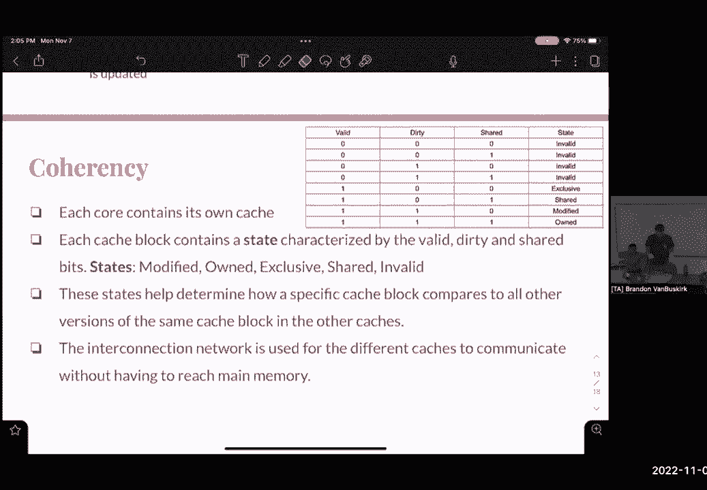

# P43：Discussion 11： Parallelism, Coherency, and Atomic - 这样好__ - BV1s7421T7XR

最近怎么样？每个人，到目前为止，每个人对平行度的感觉如何，像上周一样报道了这件事，但我们面前有很多相似之处，所以说，是啊，是啊，嗯，呃，我们有第三个项目，这星期三到期，明天我们还有另一份作业要做。

嗯无与伦比，家庭作业八，是啊，是啊，呃，我觉得应该是无与伦比的，是呀，是明天的家庭作业，我出来了出来了，是呀，是呀，是呀，是呀，我知道第七份作业已经到期了，是呀，让我们做最后一个，所以是的，所以我们要。

有点故障，不是吗？好了嗯，我们要覆盖线程级别，数据级，平行性和现金一致性，还有一点关于原子的，只是为了感受一下这个房间，让我们直接进入预检查，尽我们最大的努力，然后我会在一瞬间走过一分钟，给你几分钟。

每个人都在一个很好的位置，一个一个，每个人怎么会觉得是真的还是假的，假的也假的，呃，是呀，是呀，完全是假的，所以辛迪能告诉我辛迪代表什么吗，真正快速的单指令多数据，是啊，是啊，就是这样嗯是的。

我想指令级并行性是一个过载的术语，我想在演讲幻灯片里有一个音符，就像辛迪，是指令级并行，但他们使用了不同的指令级并行定义，但基本上这里的主要收获是，我们有一个操作同时发生在多个数据上。

不是两个不同的指令，我不认为，好啦，呃，一点二真假，辛迪真的只是一种理想的重复操作，所以如果我们有一个长数组，我们需要在整个数组上计算一个操作，那正是辛迪发挥作用的地方，一点三，让我想想，像下划线，嗯。

一个，两个，八，所有的资产实际上都对应于你芯片上的特定寄存器，比你的三个大，两位寄存器专门用来保存，假设四个整数值或四个浮点值，嗯，所以这些SIMD说明只允许我们专门使用那些，是啊，是啊，这就回答了。

呃，一分，五个，等一下，否，对不起，一分，四，呃，是啊，是啊，是假的，是啊，是啊，共享缓存会很乱，如果我们有多个线程做不同的事情，嗯是的，对每个硬件威胁都有隔离的缓存符合我们的最佳利益。

这实际上把我们带到了缓存中，凑在一起，看看我们一会儿再谈哪一个，是啊，是啊，所以当他们说每个硬件，意思是像这样，就像三十一，喜欢一台电脑和一组寄存器，所以硬件线程，你几乎可以认为是通过CPU核心的路径。

好啦，假设你有一个四核CPU，这将带我们进入下一个问题，有点嗯，但它们基本上就像硬件组件，使我们能够通过我们的核心发送指令，这回答了你的问题吗，就像核心通信，右右，一个核心对应于你做的。

或者你在第三项目中，几乎是一个数据路径，是啊，这就像艰苦的工作，对吧，那是一件事，是啊，是啊，但是呃，我们能不能，我们可以有两个，有一种东西叫做超线程，所以有一个想法是，你的数据路径，假设你有四个核心。

你的第一个核心正在等待一个过程，这个过程必须在第二个核心完成，所以这就像无所事事地坐一会儿，因此，拥有多个硬件线程符合我们的最佳利益，我们现在可以发送另一个过程，当一个硬件线程在等待时，是啊，是啊。

这些，我们这里有很多条款，所以我们有硬件线程，我们也有软件线程，对呀，线程级并行性，我们也有核心，但也，课程本身，他们分享，你有一个，我们有一个像L 3这样的节目，对吧，通常，是啊，是啊，是啊，是啊。

但是呃，如果我们有多个硬件线程穿过那个核心，我们可能有两个单独的缓存，一级缓存相当便宜，它们很小，它们在处理器上，现在，如果我们开始下降2 l 3，我们开始考虑更大的缓存，这种缓存关闭或关闭处理器，嗯。

那些通常是共享的，是啊，是啊，但如果你有道理，你对此有何感想？那里有很多细节，很多都超出了这门课的范围，但如果你好奇的话，有好的事情可以思考或调查，你想知道一个问题的答案，六个。

速度与硬件线程的增加成正比，这是个复杂的问题，呃，有个话题，你们把它盖上了吗，比尔定律讲座，他们一直在乱提，好啦，但你没有，我这里有一个等式，你看过这个吗，你没有，哎呦，两个月前的话，是呀，他们只是说。

哦不，好啦，嗯，我们都会学到，今天的阿马拉地段，这在范围内吗，因为他们从来不喜欢，我不知道为什么，我写了两遍，但这只是一个等式，是啊，是啊，它是，它是，呃，所以在平行度的范围内。

我们可以开始衡量我们实际上在多大程度上加快了我们的计划，我们代码的哪一部分可以并行化，以及它能以多快的速度上升，所以我们有两个参数，在这个方程中，P只对应于，比如我们整个代码的总执行时间的百分比。

我们的整个计划，是呀，它是速度增加的百分比，由于代码中的一个小优化，假设我们有一个C文件，里面有十个函数，但是其中一个函数，我们可以做一个，比如杂注，P平行四，它使它的速度提高了四倍，对呀。

这只是这个文件中十个函数中的一个，但我们可以运行它，呃说，4倍的速度，在这种情况下，我们的s将是，与提速相对应，然后p将对应于我们的程序现在运行的速度，在我们把之前的数据和之前的数据进行对比之后。

所以我在这里写了一个快速的例子，嗯就像说，在并行化我们代码的某些部分之后，那个功能是两倍的快，呃，这有点放大了，所以我们的s是2，嗯，现在让我们假设我们的程序运行速度比过去快30%，因为那个速度。

所以我们的p是零点三，所以这就把它们扔进了等式中，它会告诉我们程序的整体速度，因为有些部分是无法优化的，我们的代码会有一个基线成本，所以我们真的不能，呃，通常呃，获得百分之百的效率，但是，嗯是的。

这只是一个很好的等式，在一张纸上参考它，下次做作业的时候用吧，但是，It’那是什么样的，所以我们正在解决你代码的测试版，比如你在解什么，或者这是什么，嗯，所以这就像我们节目的速度。

与我们在程序中实现的这个小优化相对应，作为线程级优化，是的是的，只是一些线，呃，这个哦，这只是说，所以说，我们的程序中有一个函数，我们已经并行化了，它现在的运行速度是以前那个函数的两倍，嗯，所以这就像。

这是两个，所以这个函数现在加快了两倍，因为你必须，啊，因为你是最佳人选，我们在考虑总的执行时间，不一定像特定的线程，嗯，我是说，就像说我们在做，我们甚至不要去想线程。

让我们假设我们只是做一些D什么样的速度，你能想象我们能和辛迪，通常，我们通常有4倍的速度，因为在大多数情况下，我们可以在寄存器中放入四个整数，把它们同时相乘，所以这就给了我们四个s，是啊，是啊。

P和S的确切区别是什么，因为读了描述，我觉得他们有点多余，就像p就像执行时间，的速度，S也有点像优化代码的加速，因为我觉得我觉得这些都是多余的，但我不确定到底有什么区别，就整个程序而言。

S是我们优化的部分，好啦，是啊，是啊，是啊，是啊，会继续向DLP前进，已经说了很多了，嗯，但是我们之前说过的想法，我们只有一条指令，我们希望同时对多个数据进行操作，嗯所以是的，它们不是数据类型。

它们实际上是寄存器，你会看到一些看起来像铸造的符号，这只是向编译器指定，你要用某个寄存器，不是真正的演员，因为这些不是数据类型，嗯，但是是的，你经常会看到你是否想理解这些，这是256位的寄存器。

然后我们做加法运算的指令，然后像组件类型，你想读一读EPI代表什么，我想曾经知道它代表什么，但是是的，或者经常会在使用说明列表中给你一个问题，会有一个描述告诉你具体的指令是什么。

你不必用任何方法记住这些，好像有几千个，那么让我们来看看第二个，我们得到了这些指示，我们在这里有这个函数，我们想用SIMD来优化这个功能，花点时间，我们一会儿再来讨论这个问题，有人想跟我说说吗。

或者你可以谈谈，啊，我们去讨论第一行，我们需要初始化这个prod v准备好，是啊，是啊，是啊，是啊，完全正确是的，所以我们有，嗯这个说明书，好吧那我们就这么做，你知道吗，我不会把这些都写出来。

我就写第一套第一套是所有人，好吧，这一点，好啦，嗯好吧，呃，所以我们有两个循环，让我们，让我们讨论第一个for循环中的参数，谁有什么想法，除以四，除以四乘以四，是啊，是啊。

每个人都明白为什么我们除以四乘以四，所以他是说，我们除以4再乘以4，您希望第一个结果给您一个整数，楼层，整数的底数，然后把地板相乘得到，它是一个，而且是的，所以我们要乘，对不起，n除以四，对呀。

但是我们还需要乘以4，呃，那是什么，这对我们有什么好处，我们为什么要这么做，好像没什么意义，你得到了最高的水平，四，不到十分钟，是呀，是呀，完全正确，这么说，我们有18号，说n是十八岁，我们除以四。

这样我们就有四个人了，四乘以四十六，这是四次迭代中最小的一次，我们可以进入每一个，这样我们就可以一次分离出四种元素，从这个意义上说，保持不变，呃，同样的想法，下一个for循环呢，呃。

我们在下一个for循环中初始化什么，这个就在这里，因为这就是我们在第一个循环中停止的地方，这就是我们想在下一个循环中继续的地方，这叫我们的尾箱，每个SIMD循环都会有一个尾箱，我们总是有最后一个小循环。

我来处理，最后几个我们不能在倍数四中处理的元素，是啊，是啊，好啦，所以呢，这个呢，就在这里，我们增加了多少，我买，然后我们也要完成这一秒钟的循环，当我小于，而且是的，好啦，所以有两个循环，嗯。

现在第一个循环，在这个循环中我们需要做什么，该功能的总体目标是什么，是呀，我们要去，我们要把数组中的所有元素相乘，我们要找到整个产品，所以这条内线，这个产品，的，所以在SIMD中。

我们有一些指示可以使用，我们对哪些感兴趣，这里的这个是我们在这个案子中所需要的，嗯，我们可以开始写这个，所以我们又有了莫罗，我是，我是个小速记，但是，所以第一个寄存器输入可以是。

我不确定我们是不是该打电话，加载你，或者我们应该拥有并保持，是啊，是啊，这是因为我们有一个整数数组，对呀，呃，我们需要通过一个像SID寄存器这样的寄存器，可以利用这个加载指令，现在看参数和加载指令。

我们在这里做什么，关闭，嗯，你知道，你起来了，是呀，是呀，是呀，你们在正确的轨道上，所以让我们，我们就写吧，负载，你，但在我提到我们之前，我们有一个奇怪的铸造符号，这基本上是要告诉计算机，是不是毫米。

是啊，是啊，在两个下划线下，一二八一，然后这将是我们的一个加分，这对每个人来说都有意义吗，我们基本上是在指定，这将是一个寄存器指针，指向四个整数元素，所以你能涵盖你真正要求的部分吗，四要素。

每次都是负载，启动器会给你一个指针，一百二十八颗星，就在这里，是啊，是啊，是啊，是啊，是啊，是啊，所以它是，呃，有点像石膏，是的，嗯，所以我们指定，因为在这个加载指令中。

它采用了m-1-2-8-i指针类型，意思是它需要取四个整数，嗯，所以我们要给它一个指针，在该指针处携带整数，但如果我们给它一个指针，它是，它将指向一个整数，所以这是在做什么，它是，它说它在期待。

这是由4个整数组成的级数，我们将用这个指令把它加载到寄存器中，所以现在我们有一个寄存器，包含这个指针的四个整数，这里的a代表什么，A只是传递给函数的参数，所以A是我们需要相乘的整数数组，是啊，是啊。

是啊，是啊，所以基本上问的是负载函数，它会看到策划者A加I，然后把第一个精确地，是啊，是啊，是啊，是啊，大家都清楚了吗，加上我因为，哦尺寸，我就像在照顾指针，是呀，是呀，观察力好，是呀，好啦，是啊。

是啊，就像加载内存的实际地址一样，它怎么能加载，哎呦，等待它从每一个加载，然后呢，所以它允许从地址a开始的四个整数，加上我正好，是呀，是呀，好啦，好啦，所以不要这样做，施法不管用，呃，我不这么认为。

我没试过，呃，也许在你的下一个项目中尝试一下是件好事，但你是说这不是真正的课程，因为我们不一样，不像真正的类型，是啊，是啊，这不是真正的类型，就像一个，它是，它与CPU中的寄存器相对应，哎呦，是啊。

是啊，控制哪个寄存器和什么寄存器，或者只是在这里做，就像，我真的不能告诉你发生了什么，如果将浮点数传递到整数寄存器中，嗯，我不知道该怎么跟你说，呃，但我肯定会试着坚持整数寄存器，浮点寄存器，你知道的。

保持它们的一致性，是啊，是啊，但是是的，你只是，您只是指定要使用哪个寄存器，好吧那我们就开这家店，你在这个循环下的指令，所以我们完成了我们的循环，我们创建了四个产品的向量，一直到四的最大倍数。

所以现在我们有一个电话要储存你，我们在这里做什么，添加，呃，什么你，呃，所以我们需要找到所有值的乘积，所以我们不想求和，嗯，你为我们做了什么，呃说，存储128位矢量，at指针，P。

所以我们要从向量SID寄存器到内存中的指针，你想把它移回一个指针，回到数组，所以你以后可以把它们相乘，我喜欢，所以关于我们传递到这个函数中的内容，第二个会在那里为这个这个东西，所以第一个，你的意思是。

呃，你我们要储存勇武的成果，对呀，是啊，是啊，是啊，是啊，是啊，是啊，所以我们要通过结果，我们能不能把结果，所以您还必须将它强制转换为类似于寄存器类型，我有什么必要把它弄进去，你就是这样，如果我们回到。

在这里说明那个指令，我们注意到这是m 1 2 8 i指针，所以我们要把结果，我们将把它铸造成这个寄存器，我们要传递什么，我失去过任何人吗，我可以我可以回溯如果你想的话，这是我们存储我们的指针。

这里是Prod v，到目前为止，这就是我们的产品在这个Prod V寄存器中的内容，我们要把它扔进结果里，你指导的这家商店要做什么，就是，它要把这个，一二八寄存器，将这四个值扔到内存中的这个指针上。

记住我们不会有结果的，寄存器，我们不像将结果加载到寄存器中，嗯，这只是为了一致性，就在这里，它现在储存了我们的产品，到目前为止我们有四个元素，它们都是一些数字的乘积，所以现在我们要进入我们的尾箱。

零次的结果等于什么，是啊，是啊，我不认为那的利益应该是一个，是啊，是啊，所以我们将把数组中的最后几个元素，我们要把它们成倍增加，我们可以把它们相乘成，我们可以把它们乘成两个的结果，没关系。

因为最后我们要，我想我有点破坏了它，但最后我们要取四个元素的乘积，结果和回报，所以我只是告诉你，但是是的，我们只做零次，相当深入的问题，所以如果我们需要回顾一下，求求你了，是啊，是啊，回到标题问题。

它是数据级并行的，这是，之所以这么叫是因为我们会说出更多的数据，就像，对了20个整数，说最简单的方法是，我们只要做一个for循环，0乘以a等于i的a，然后遍历每个元素，这将需要20次for循环迭代。

这种情况下的二十次乘法，其实我们不会有尾箱，对呀，因为二十可以被四整除，呃，我们将对第一个for循环进行五次迭代，我们会有五个乘法，但是我们仍然有这四个乘法，但大量的人说阵列大约有5000个，我是说。

你是，你现在得加快速度，这是一个不断的现实，以产生最后的回报，总是四行，不管右边的大小，最后一次返回，是啊，是啊，所以我们不在乎，呃，我们正在做的事实，呃，零的结果，是啊，是啊。

但就像我们有一个由20个元素和500个元素组成的数组，像四个乘法是一个很大的，总乘法的较大部分，我想没有，我的意思是总的乘法，但这是，是啊，是啊，有一个小问题，那是DLP，呃。

我们有一点时间来进行TLP，嗯，每个人都对TLP没意见，到目前为止，我们有杂注p平行，平行于，基本上，这些是我们可以抛出的快速命令，就在代码块的顶部，所以并行的pragma将占用一段代码。

并在多个线程上运行该代码，软件线程，不是硬件线程，语用不会平行，因为如果你把它放在for循环之前，它将中断for循环的迭代，并将它们发送到不同的线程，因此，我们需要非常小心代码中的内容，因为它。

代码块本身取决于在其他线程中设置的值，我们有很多问题，让我们来看看我们有的几个，A部分，我们有实用主义，平行，然后盖住这个循环，所以它在问，有时是不正确的吗，总是不正确，如果是正确的，比连续剧慢吗。

或比连续麦片快，就像一个面包，我们怎么想，有人知道这里会发生什么吗，是啊，是啊，或者任何你应该储存在材料中的东西，因为这就像你基本上在做每一个产品的整个循环，你喜欢，是啊，是啊，就像，就像非常棒的一点。

是啊，是啊，所以我们要把整个for循环，然后运行它，但是，我们得到的许多线程真的很低效，它比只在一个线程上正常做要慢，是啊，是啊，接得好，那是给一个，是啊，是啊，是啊，是啊，比连环杀手还慢，所以真的。

我们没有优化任何东西，我们实际上在损害我们的表现，但为什么它不像通过第一个入口，所以语用学不会是平行的，就像没有四个指令，所以说，它没有拖尾，就像这个做的，那个做的是，上面写着这里的一切。

让我们给你发一个不同的线程，假设我们有四个线程，我们将在四个线程中的每一个线程上这样做，是啊，是啊，它只是把它，我们不知道，所以我们无缘无故地做了四次，基本上，但你永远不知道有多少线程正确。

只是它说它只是，嗯是的，其中一些我们不一定知道有多少线程，我想嗯，但是有什么方法可以指定线程，它会永远瘫痪吗，如果按顺序做更有效率，我猜这就像整个，就像，就像所有的，优化代码。

所以如果在一个线程中完成更有效，从此，只有一口井，否，因为你在指定你的电脑，在多个线程上运行此操作，所以不会像不一样，你错了，它只是会像，好啦，你得到了它像这样运行四次，是啊，是啊，你是。

我想你有办法让我们，或者解决这个问题，优化这个，是啊，是啊，是啊，是啊，没错，我把四个放在那里，因为它会说，好啦，线程，第一，你要做迭代，我等于零，第二，你要做迭代，我等于1以此类推，它会打破这个词。

好啦，所以B部分，这是有效的还是无效的，这似乎有些不正确，好吧好吧，我几乎总是不正确的，因为那里，因为像这样的，这将是辅助数字，就像他们，是呀，我解释，你知道的，很难让人喜欢，做点什么。

我们可能会按错误的顺序做某事，你弄错了，总是不正确的，完全正确，是呀，过境，刚好顺序对了，我的意思是，如果是这样的话，如果n小于或抱歉，如果n是是，少于四个，例如，那么我们有可能只在一个线程上运行这个。

做正确的事，但如果n大于4对，然后呢，五个，我知道，但就像这样感觉就像当你有一个人，就像顺序基本上就像不确定的，但经常喜欢线程，就像在迭代费雷尔，它们实际上是一个接一个地发生的，以正确的方式。

就像也许就像有效地，在那里，艺术品竖起了问题的屏幕，但它仍然通过纯块有效地串行运行，基本上有可能，但这可能不会发生，但这就像一个理论，呃，这个，我我是说，我是说它真的发生的可能性非常小，但是呃。

我得考虑一下，我不知道，啊，你介意吗，如果我加上这个，是呀，所以嗯，你以后会学到的，在cs类中看到了一种叫做调度器的东西，不幸的是，当你和计划者一起工作时，有时会发生什么。

它们有时可以优先处理不同的线程，如果你像某些线程一样优先于其他线程，最后会发生什么，如果你还没有更新正确的值，它将依赖于不正确的值，因为有这么多的数据依赖，你做，关于不正确的值，你不想要的。

所以理论上它可能是红色的，有时可能是正确的，我是这么想的，但是嗯，我认为数组被声明为全局的事实，每个线程将从较低的迭代开始，并增加，I，但我们正在访问较小的索引或索引，正因为如此。

你在假设你知道你不能从，我等于n向下，如果有道理的话，对呀，因为斐波那契就像一个递归函数，所以说，嗯，事实上，我们把它分成多个线程，此循环在不同线程中的多次迭代，那就是一个，它将依赖于其他线程。

不管怎么样，如果我让我们说，我们运行这个上，比如什么硬件线程，就像碰巧的那样，就像反应以正确的顺序进行一样，我可以看着，我想你这样说是对的，如果您在多个线程上执行，但每一根线都做了完整的事情。

以某种正确的顺序，就像在某些情况下，这是完美的秩序，他们做得一模一样是不是假设，就像没有一次投掷会在另一次开始前完成，哦好吧，哦很好，好啦，那样的话，然后是的，是呀，有一种假设，是啊，是啊。

好的一六二覆盖这个，这个内容更详细，所以如果你对穿线感兴趣，请收回，我们能对C做出任何结论吗？就像两个一样，最终答案是不可能的，不正确正确，是啊，是啊，是啊，是啊，看看我们怎么想，完全正确。

它不依赖于任何其他指数，对呀，我们要打破这个循环在不同的线程上，这不取决于其他任何事情，是啊，是啊，确切地说，那，D，问题是平行四，我们在增加指针，有什么可能出错的想法吗，数组不会得到更新的近似。

基本上我认为同一个地方，是啊，是啊，嗯，我的意思是，如果一个线程将数组指针递增，说五次，然后一个线程期望它是一个内存地址，而且是的，指针跳得满地都是，是啊，是啊，现在是两点钟，嗯，我是说，是啊，是啊。

我们没有去现金一致性什么的，但是嗯，你会掩护我吗，如果有人想留下来，我们可以谈谈，真的不对，他们今天应该被覆盖的，嗯不一定，我想它应该被正确地分配，否，就在外面，穿过去，就在后面，就在周围，就在外面。

好啦，没有权利，分配，我确实碰过，有一点上周有一点，所以你可以看看录音，如果你想了解更多，哦，我的天哪在互相交谈，是的，是的，哦，就像如果有人想谈论现金，然后说，我很乐意通过它来讨论，如果有人要离开。

我是说你可以走了，嗯，在那里所有的顺便说一句，在网站上，我们的记录和或在课程网站上，是啊，是啊，他们会像15个一样上传到网站上，节后二十分钟，是啊，是啊，嗯反正，呃，对于那些想留下来的人。

我们在每个状态下都有五种可能的缓存行状态，这张桌子看起来真的很方便，我们在共享位中有我们的有效位或肮脏位，这些位的任何组合都将对应于五种不同的缓存状态，所以我们有多个缓存的想法。

我们可以在不同的缓存中有相同的缓存块，我们希望通过这种方式保持数据的最新性，我们不会把过时的信息写回主存，所以这里的整个想法是，我们有一个修改的状态，表示此缓存块中的数据已在缓存中更改。

它在主内存中已经过时了，如果那个街区因为任何原因需要被驱逐，我们需要将这些数据写入主存并更新主存，但目前我们将把修改后的内容保存在缓存中，所以这意味着这是这个缓存块的唯一版本，在所有缓存之间，好啦。

我们有自己的国家，是啊，是啊，是与特定现金捕获块的状态相对应的状态，特定缓存块，是呀，每个现金块都有特定的状态，所以是的，三位，如果你想想每一个现金块，当我们经历了TIO崩溃，这是地址，现在呢。

每个缓存块将有三位元数据，它会告诉我们，我们能不能，我们指望这个缓存块具有有效数据或有效位，此现金块是否与主存一起被修改和过时，或者更与时俱进，我想这是最肮脏的部分，所以我们对它进行了修改。

然后是共享的，其他缓存中是否有此缓存块的其他版本，是啊，是啊，所以我们有了自己的状态，它基本上是一种经过修改的状态，但也与其他缓存共享，所以如果你看这里一个一个，但现在它被分享了，这里的意义在于。

如果你修改自己的状态，它将把更改传播到其他共享缓存，您正在更新多个缓存，而无需进入主存，我们有一个小组等着我们出去，但是独家的，这是所有共享缓存中唯一的现金块，我想我们刚刚谈过了，但是是的。

这些是关键思想，对不起，你不能通过它，是啊，是啊，他们会在中央指数上上升，论艾德，是啊，是啊，谢谢你。

