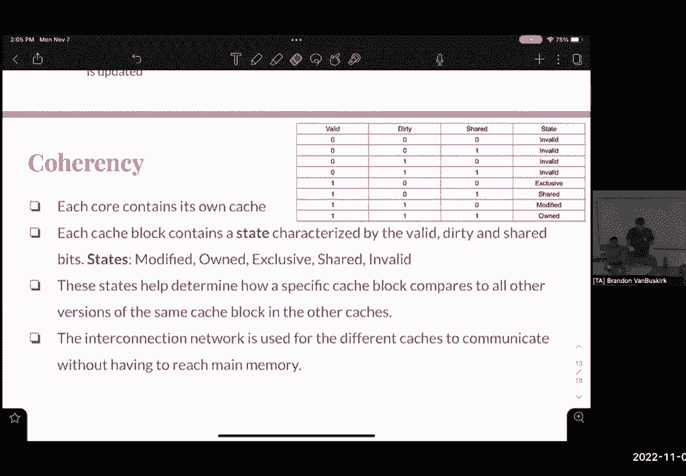

# 课程 P43：并行性、一致性及原子操作 🚀

在本节课中，我们将学习并行计算中的几个核心概念：线程级并行、数据级并行、缓存一致性以及原子操作。我们将通过具体的例子和公式来理解这些概念，并学习如何在代码中应用它们。

---

## 概述 📋

本节课将涵盖并行计算的基础知识。我们将首先探讨数据级并行，特别是单指令多数据技术。接着，我们会讨论线程级并行及其在实际编程中的应用。最后，我们会简要介绍缓存一致性的概念，以及为什么在多线程环境中保持数据一致性至关重要。

---

## 数据级并行与SIMD 🧮

上一节我们介绍了并行计算的基本概念，本节中我们来看看数据级并行。数据级并行是指一条指令同时操作多个数据元素的技术，这通常通过单指令多数据实现。

SIMD代表单指令多数据。它是一种指令级并行技术，允许我们对多个数据执行相同的操作。例如，如果我们有一个长数组，需要在每个元素上执行相同的计算，SIMD就能发挥作用。

以下是SIMD指令的一些关键点：
*   SIMD指令使用特殊的宽寄存器，例如可以容纳四个整数值或四个浮点值的128位寄存器。
*   这些指令允许我们专门使用这些寄存器来加速向量化计算。

在代码中，SIMD操作可能看起来像是对寄存器进行“类型转换”，但这实际上是指定使用特定寄存器的方式，并非真正的数据类型转换。例如，`__m128i` 表示一个128位的整数向量寄存器。

### SIMD优化示例

假设我们有一个函数，需要计算一个整数数组中所有元素的乘积。我们可以使用SIMD指令来优化它。

原始标量代码可能如下：
```c
int product(int* a, int n) {
    int prod = 1;
    for (int i = 0; i < n; i++) {
        prod *= a[i];
    }
    return prod;
}
```

使用SIMD优化的思路是，每次循环处理四个元素。以下是优化步骤：

首先，我们需要处理数组中可以按4个元素一组进行迭代的部分。
```c
for (i = 0; i < (n / 4) * 4; i += 4) {
    // SIMD操作：一次加载并计算4个元素的乘积
}
```
这里 `(n / 4) * 4` 是为了得到小于等于 `n` 的最大4的倍数，确保我们处理的是完整的SIMD宽度。

接着，我们需要一个“尾部循环”来处理剩余的元素（当 `n` 不是4的倍数时）。
```c
for (; i < n; i++) {
    // 用标量方式处理剩余元素
}
```

在SIMD循环内部，我们需要使用特定的指令。例如，使用 `_mm_load_si128` 指令从内存加载4个整数到SIMD寄存器。
```c
__m128i vec_a = _mm_load_si128((__m128i*)(a + i)); // 加载 a[i] 到 a[i+3]
```
然后，使用乘法指令（如 `_mm_mullo_epi32`）来计算这4个元素的乘积向量。最后，需要将SIMD寄存器中的4个部分积存储到内存中，以便后续合并。
```c
int partial_prods[4];
_mm_store_si128((__m128i*)partial_prods, prod_vec); // 存储部分积
for (int j = 0; j < 4; j++) {
    result *= partial_prods[j]; // 合并部分积
}
```

---

## 线程级并行 🧵

在理解了数据级并行后，我们来看看线程级并行。TLP涉及在多个软件线程上同时执行代码，通常使用像 `#pragma omp parallel` 这样的编译指令。

`#pragma omp parallel` 指令可以放在一个代码块之前，指示编译器在多个线程上运行该代码块。`#pragma omp parallel for` 指令则专门用于并行化紧随其后的for循环，将循环迭代分配到不同线程中。

然而，使用TLP时需要格外小心数据依赖性和正确性。

### 并行化案例分析

以下是几个并行化场景的分析：

1.  **无效并行化**：如果一个循环的每次迭代都计算整个数组的乘积，那么使用 `#pragma omp parallel` 包裹整个循环会导致每个线程都重复计算全部工作，这比串行执行更慢。
2.  **存在数据依赖**：对于类似计算斐波那契数列的循环（`a[i] = a[i-1] + a[i-2]`），迭代之间存在严格的数据依赖。如果强行并行化，线程执行顺序不确定，几乎总会得到错误结果。
3.  **可安全并行化**：对于像 `a[i] = a[i] * b[i]` 这样的循环，每次迭代只读写独立的数组元素 `a[i]`，没有跨迭代依赖，因此可以安全地使用 `#pragma omp parallel for` 进行并行化。
4.  **指针操作风险**：在并行区域内递增一个共享指针（如 `ptr++`）是危险的，因为多个线程会竞争修改该指针，导致其值不可预测，从而访问错误的内存地址。

---

## 缓存一致性 ⚙️

当我们在多核处理器上运行多线程程序时，每个核心通常有自己的缓存。这就引出了缓存一致性问题：如何确保不同缓存中的同一数据副本保持同步和最新？

缓存一致性协议通过为每个缓存行维护一个状态来实现。一个常见的简化模型使用三位元数据来描述状态：
*   **有效位**：指示该缓存行是否包含有效数据。
*   **脏位**：指示该缓存行中的数据是否已被修改，且与主内存中的数据不同。
*   **共享位**：指示其他缓存中是否也存在该数据块的副本。

基于这些位的组合，缓存行可以处于多种状态，例如：
*   **修改**：数据仅在此缓存中，且已被修改，主内存中的数据是过时的。
*   **独占**：数据仅在此缓存中，但与主内存一致。
*   **共享**：数据在此缓存中，也可能在其他缓存中，所有副本与主内存一致。
*   **无效**：该缓存行数据无效。

当某个核心修改了其缓存中的数据时，一致性协议会通过总线或其他互联机制通知其他持有该数据副本的缓存，将它们的状态置为“无效”，或更新它们的数据。这确保了所有处理器看到的内存视图是一致的。

---

## 阿姆达尔定律 📈

在讨论并行加速时，阿姆达尔定律是一个重要概念。它描述了优化部分代码后，程序整体所能获得的最大加速比。

定律的公式如下：
```
整体加速比 = 1 / ((1 - P) + (P / S))
```
其中：
*   **P** 是程序可并行化部分所占的执行时间比例。
*   **S** 是可并行化部分因优化而获得的加速比。

例如，假设某个函数占程序总运行时间的30%（P=0.3），我们通过并行化使其速度提升了2倍（S=2）。那么，程序整体的加速比为：
```
整体加速比 = 1 / ((1 - 0.3) + (0.3 / 2)) = 1 / (0.7 + 0.15) ≈ 1.176
```
即整体性能提升了约17.6%。这个定律表明，即使我们极大地优化了部分代码，程序的串行部分（1-P）也会成为性能提升的瓶颈。

---

## 总结 🎯

本节课我们一起学习了并行计算的关键概念。
*   我们探讨了**数据级并行**，了解了如何使用SIMD指令对多个数据执行相同操作来提升性能。
*   我们研究了**线程级并行**，学习了如何使用OpenMP等工具并行化代码，并分析了哪些循环可以安全并行化。
*   我们介绍了**缓存一致性**的基本原理，理解了多核系统中保持数据一致性的重要性。
*   最后，我们通过**阿姆达尔定律**了解到，程序的整体加速受限于其串行部分的比例。



掌握这些概念对于编写高效、正确的并行程序至关重要。