# P44：Lecture 33： VM II： Page Faults,Multileve,Interrupts／Exceptions - 这样好__ - BV1s7421T7XR

是啊，是啊，我们做到了，好啦，所以呃好吧，当班尼说话的时候，我想让你们知道，校园确实发送了关于正在发生的罢工学术工作的信息，这至少目前定于周一发生，从早上八点开始。

丹和我目前正在讨论这对61 C意味着什么，但我们不想抢先说事情会改变，做这些疯狂的事，不过，我们将在周末的某个时候发出一份声明，就像现在的情况一样，对于那些不知道，这次罢工是，呃那个，有，有，有，有。

gsis，有研究生研究员，整个加州大学，实际上是在为更公平的权利讨价还价，所以如果你有兴趣，请务必上网查看，但请注意，这可能，这可能会改变我们的一些员工，但我们在工作还是不工作，我们。

但是加州大学的管理部门正在与这个庞大的工会谈判小组合作，给你，希望星期一能得出结论，这就是为什么我们不想先发制人地发布信息，但就我个人而言，我想这其实是一种令人兴奋的，在那种潜在的打击世界里。

因为我觉得作为伯克利的学生，只是在工作中看到集体行动，但我们可以在今天的另一堂课上讨论。

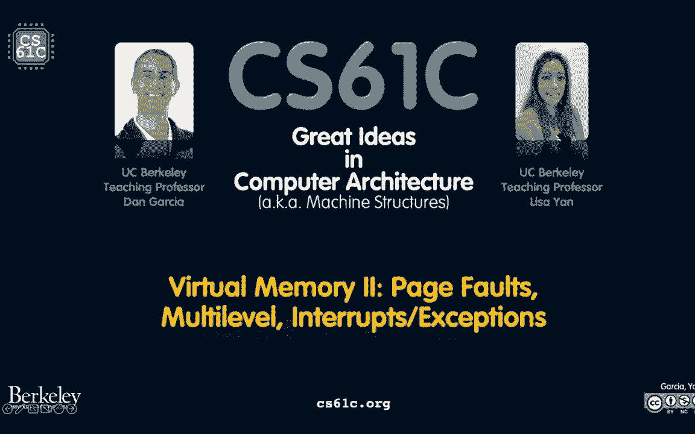

让我先简单回顾一下我们上次讲的内容，虚拟内存往往是CS六十一C中更难的概念之一，因为它把你目前看到的很多东西，所以这就是我们现在的处境，我们有一个CPU，即使我们有多个处理器，无论在特定的计算机中。

我们可能正在运行数百或数千个进程，发电厂大概运行了40个过程，谷歌Chrome运行大约五六十或一百个进程，以此类推，等等，到目前为止我们所学到的，操作系统可以在可用的课程中多路复用这些。

今天我们要学习一点，也许它确实在单核之间进行上下文切换。

但是，即使它能够分离这仍然只有一个单一的记忆，使用一种我们称之为DRAM的硬件技术，你会在一些幻灯片中看到它被称为ram，这对单个核心意味着什么，这意味着操作系统上下文。

它实际上不会把东西从内存切换到磁盘，因为那样太慢了，我们上次介绍的是虚拟内存的概念，特别地，我们引入了页表的概念，它说每一个单独的过程都认为它有自己的30个，两位字节可寻址空间，至少在风险中，五个。

操作系统所做的实际上是转换这个虚拟内存空间，到相同的单个物理地址空间，每个进程使用一个页表，所以在这个页表中，你可以查找你的虚拟页码是什么，然后找到物理页码，然后用它来创建一个物理地址，地址到内存中。

或者你现在从这里访问一些东西，注意这里有两个地址空间，我们骗了你，从一开始，我们说过，你知道这个过程只有一个地址空间，不，在电脑里实际上有两个地址空间，进程运行时，其中之一是过程所需要的。

那是虚拟地址空间，其中之一是CPU或操作系统，实际上，操作系统转换为访问物理内存，所以从现在开始在课程的最后几周，当我们说地址，你要问我哪个地址，虚拟或物理，好啦，然后我们必须能够进行对话。

页表bel的作用，它真的把虚拟页码本身转化为物理页码吗，偏移量，字节偏移量是在相同大小的页面中，实际上或物理上，偏移量不会改变，所以这就是我们如何创建这些地址，我们会看到一个例子。

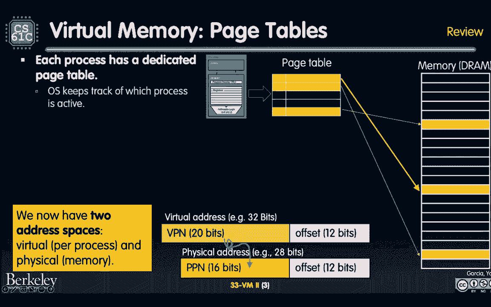

今天晚些时候我们将讨论一个例子，根据虚拟内存的工作方式，多个进程如何工作，每个进程一个页表，这允许操作系统保护进程彼此不受影响，将进程彼此隔离，我们还有这个额外的状态位，它发生在页表中。

您可以将此正确的保护位标记为，呃，允许多个进程共享同一物理内存，而不，也许互相写，所以你可以在这里看到，只有一口井，我有个小幻灯片。

是啊，是啊，你看看，所以你可以在这里看到，这里有一个共享页面。

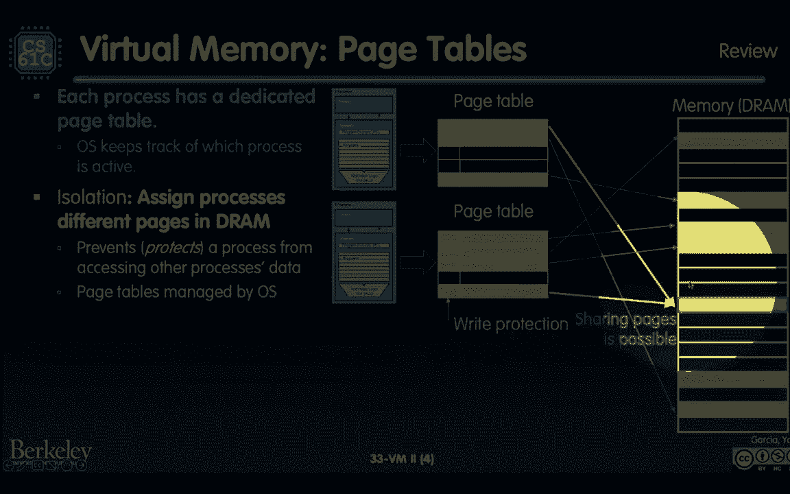

其实有条纹，这是橙色和绿色的条纹，我知道这很难理解。

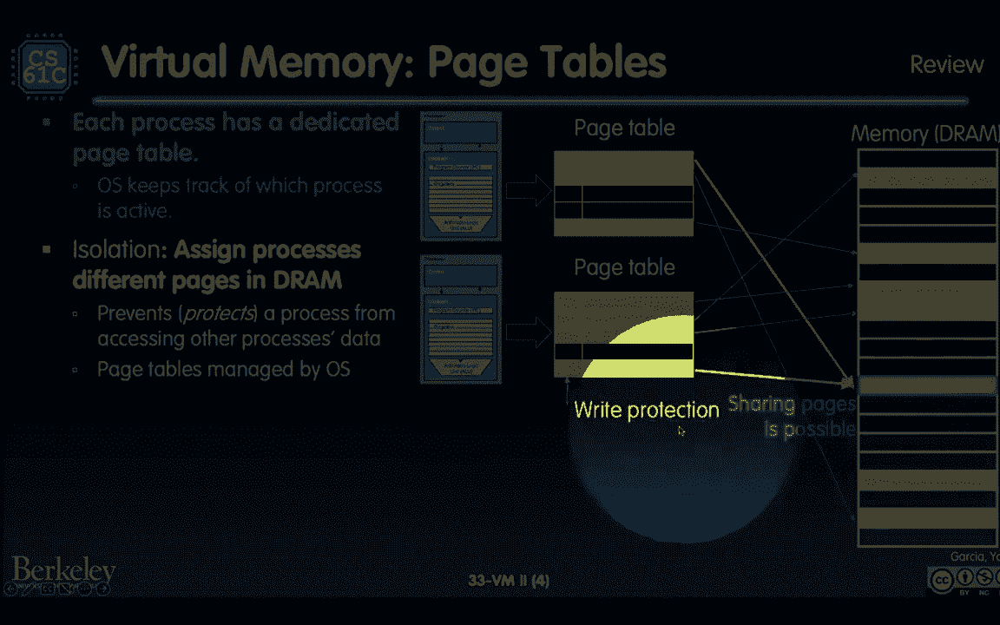

但这些都指向，或者至少是页表，对于这两个不同的进程都查找了相同的物理页码。

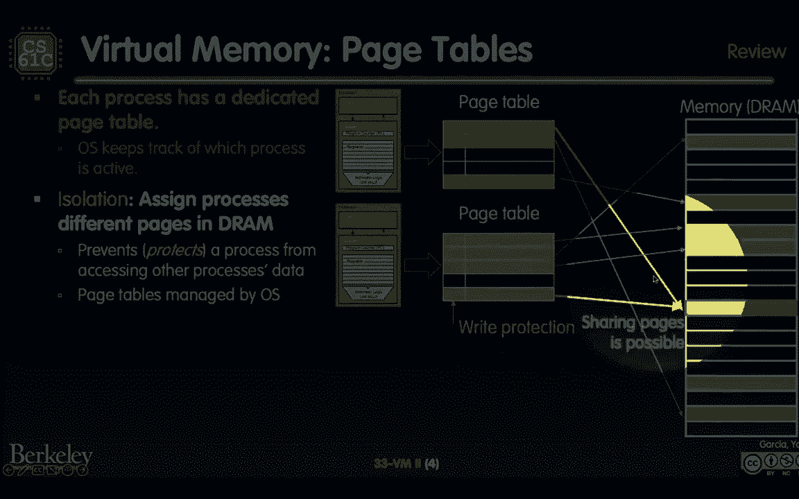

然而，也许我们只希望一个进程同时编写它，因此，我们会打开一个正确的保护位。

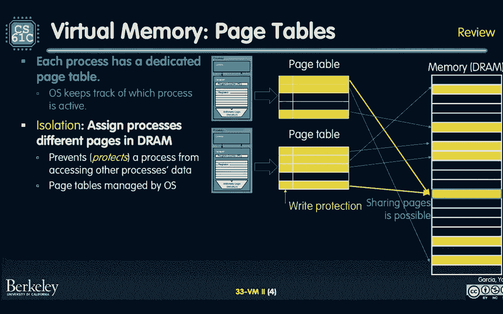

然后把另一个翻下来，这就是分享的理念，今天我们还是要暂停一下我们的怀疑，再想想，缓存不存在，它会让虚拟内存的事情变得更容易一点，下周一，我们将讨论这种重新引入缓存的方法，以及它是如何参与其中的。

但就目前而言，我认为每一次读取或加载数据的访问，或者存储或加载数据实际上直接进入内存，而不是某种SRAM缓存。

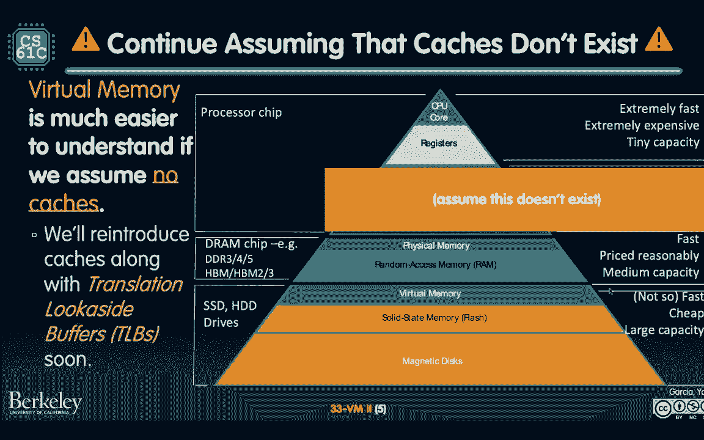

它去DRAM，可能会变成这样，所以我们来谈谈细节，页表第二部分完成，您可能想知道页面错误会发生什么，换句话说，如果我们必须一直到磁盘来加载我们的信息会发生什么。

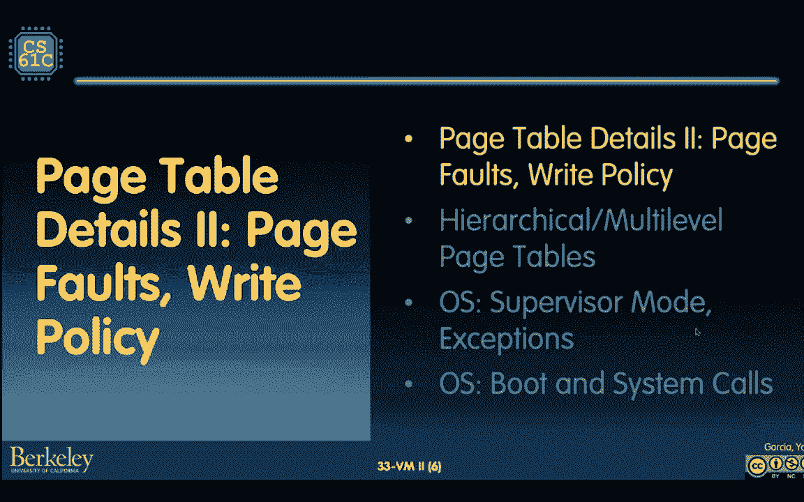

记住这里的整个想法是页表意味着现在。

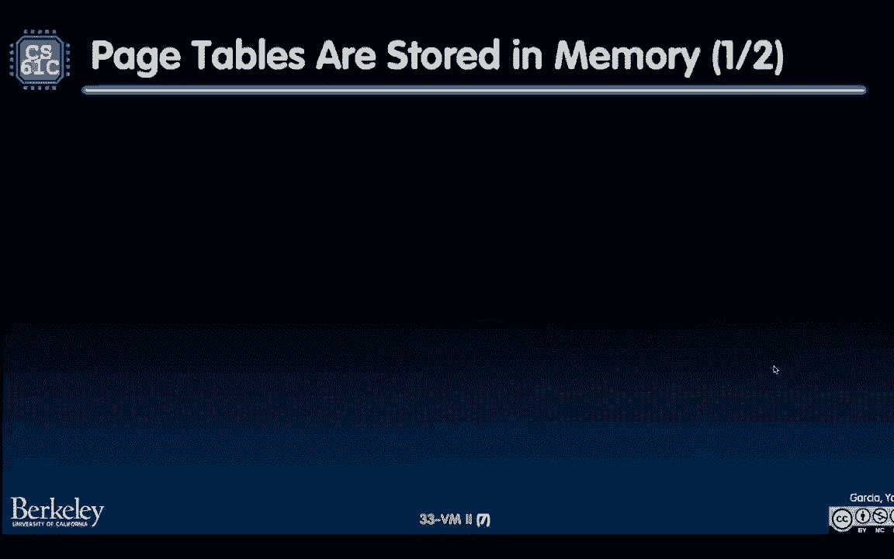

而不是加载所有三个两个字节，在DRAM中，每个进程都有三个两个字节的可寻址空间，我们一次将页面加载到内存中，有时我们可能需要加载额外的页面。

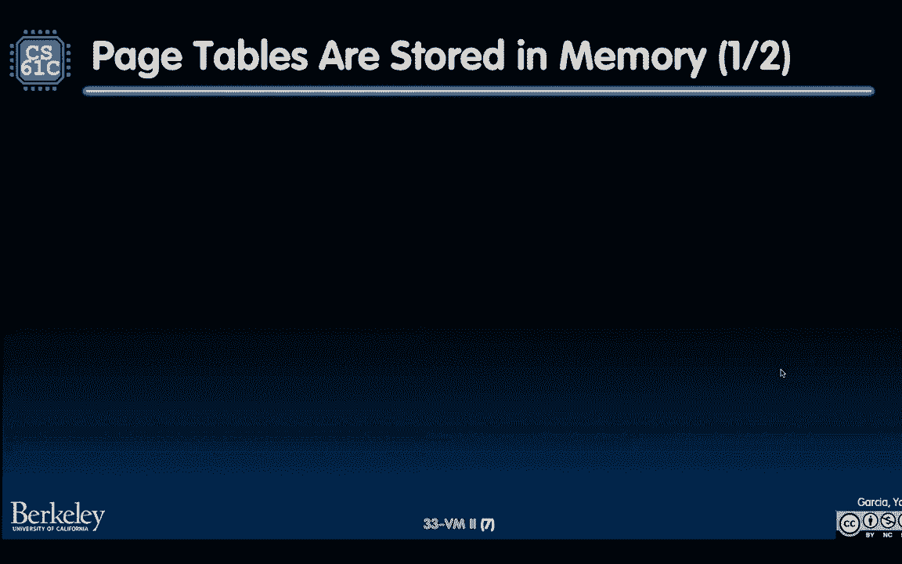

所以让我们来看看，其实还好，实际上我们还需要强调一点，也就是说，您可能想知道这些页表到底存储在哪里，我们知道页表可以让我们找出，内存或数据页在内存中的位置，但是页表本身呢。

让我们在这里做一些信封后面的计算，所以如果我们有一个3个2位字节的可寻址虚拟地址空间，然后我们在身体上有多少，我们有多少字节，我们有四个gib位，假设我们有物理页面的页面。

虚拟页面都是大小为4千字节的相同页面，这是什么意思，嗯，我们想弄清楚这些页表需要多大，记住页表是什么，每个虚拟页码有一个条目，计算页表大小的唯一方法，是计算出有多少条目，然后乘以每个页表项本身的大小。

那么在这种情况下，我们有多少虚拟页码，如果我们有2到32位，假设2到3两个字节的虚拟内存，每页2到12字节，然后我们有两个到二十个虚拟页码，好啦，这是页表中的条目数，您可能想知道页表中有多少信息，就像。

那包括什么，我们在上一张幻灯片上看到了一些，包括物理页码，它包括一些状态位等等，按惯例，至少对这门课来说，可能会说，可能每个页表条目有四个字节，所以对于每个虚拟页码，这是我们可以查到的信息。

如果我们快速算一下，四个字节乘以二到二十是，呃大约是四实际上正好是四，也许字节，那么这意味着什么呢，嗯，这是关于点的，我们拥有的DRAM内存的百分之一，我们拥有的，这还不算太糟，每道工序百分之一罚款。

不过，请注意，这就像四个，也许字节，还记得我们上次看到的关于缓存的内容吗，我知道我说过缓存不存在，它们确实存在一点，这里的重点是它实际上太大了，不能用现金储存，那么页表存储在哪里，它们也存储在内存中。

现在呢，这里有一个警告，这意味着如果我们，如果我们的，如果我们的指令说，加载字，例如，我们实际上必须进行两次内存访问，我们去看看，我们去看看，我们再按一次按钮。

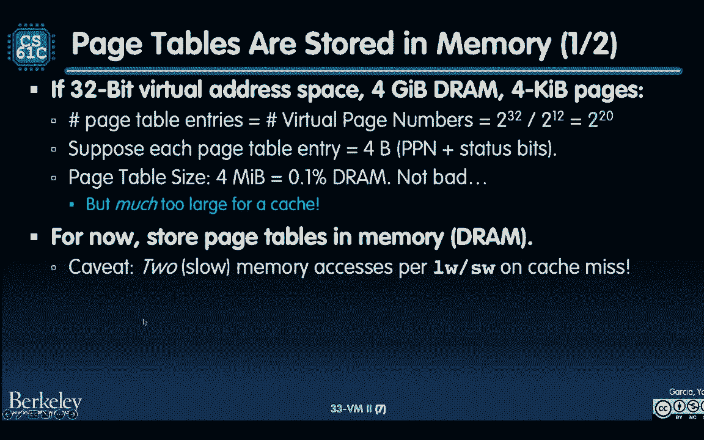

啊我们做到了，是呀，好啦，让我们检查这里的两个内存访问，每次我们执行加载字或加载字节或存储字或存储字节，嗯，首先，我们需要弄清楚我们在操作系统中，或者CPU需要弄清楚这对应于什么物理地址，记住加载字节。

商店的话，所有这些都将在这里使用虚拟地址，所以我们要查找页表，查看物理页码是什么，但是页表在哪里，在记忆中，这意味着我们首先进入内存查看页表，并找到物理页码，然后我们再次进入内存，进入数据页。

获得实际的单词，或者我们正在查看和读取的实际字节，如果我们在装货，所以这就是我的想法，它将花费两次内存访问。

不是最大限度地减少性能损失的最伟大的事情，一些我们可以做的事情，也许我们可以包括现金，哦哦，有趣的想法，但又一次，我们不是在谈论这堂课，但我只是把它包括在这张幻灯片上，所以当你在周一的讲座后复习它时。

会更有意义一点，好啦。

所以我只是想告诉你，这是页表所在的位置，因为它们也是信息，它们还需要在内存中访问，让我们谈谈页面错误，我说过我会的，我们现在谈谈，页面错误，或者当你试图查找那段记忆时，那个数据页实际上不在内存中。

但它就在这里，我把滑梯放好，过一会儿，但现在你要知道，包括每个页表项的右保护位还包括有效状态。

这表示位是否在DRAM中，好啦，所以如果它是有效的，已经在记忆里了。

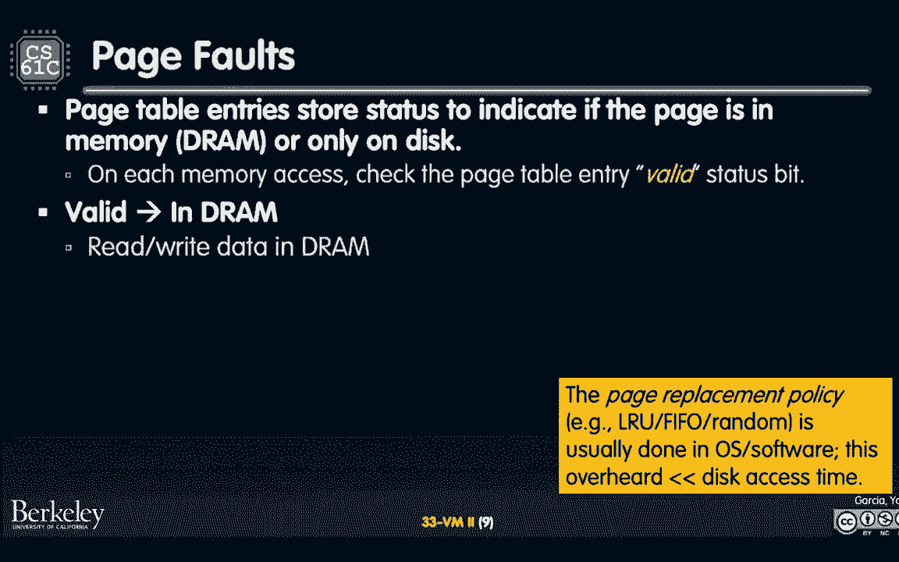

可以访问该数据页，然后如果它是无效的，那么数据页就在磁盘上的某个地方，那是什么意思，这意味着对于试图从内存中读取某些读取数据的进程来说，如果那东西在磁盘里，它需要先把它加载到内存中，那需要很长时间。

我来读读幻灯片上的单词，所以分页错误意味着这个有效位无效，这意味着我们试图寻找的数据实际上在磁盘上，所以操作系统所做的是它实际上干预，我们会更多地讨论这个问题，一会儿它就介入了。

它试图将我们试图从磁盘访问的页面加载到内存中，以便它可以将数据从内存加载到处理器，好的，好的，但它是如何做到这一点的呢，嗯，记住记忆就像一个有限的空间，所以如果你的DRAM的所有页面都已经填满了。

它可能需要选择要驱逐的页面，我突然知道操作系统有点像房东，但我们很少谈论这个，但我们要用“它”这个词，那么这意味着操作系统选择这个页面，通常这是在某种软件中完成的，比如页面替换过程。

并将请求的页面从磁盘读取到DRAM，最后，它将数据读入或写入，最后做负载，好啦，这就是页面掉落时发生的事情，现在呢，这里有一个关于页面替换策略的说明，我再重复一遍，再说一次如果我们考虑。

有一个小弯弯曲曲的箭头在那里，如果我们考虑驱逐你的页面，记住我们不是在谈论缓存，但是我们应该从那里学到一些概念吗，就像最近用的，我们也许可以用那种政策，也许我们想用先进先出，也许我们想用随机的。

所有这些事情，所有这些都将在软件中决定，这些东西并不是由硬件决定的，因为事实证明，去磁盘实际上是一个非常非常长的时间，所以我们可以在软件中做很多这样的逻辑，当磁盘被访问时，在读取磁盘页时。

所以再来一次状态比特，到目前为止我们学到了什么，我们学会了正确的保护措施，这是为了共享内存并保护进程不相互重写，如果他们共享相同的页面，我们有一个有效位，它告诉我们数据页是否确实加载到内存中。

否则我们就得走到这一步，然后我们还有第三个我们没谈过的，但我们现在要谈谈，哪个是肮脏的部分，这意味着如果页面上，如果页面如此，如果钻头开着，那么内存上的页面比这个页面更最新，你看看这个。

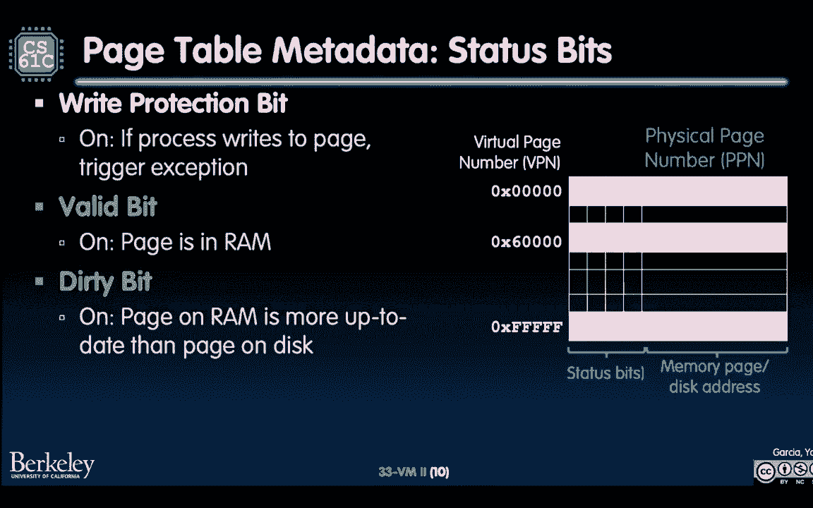

你就像，呵呵，我以前见过这种情况，我们今天不谈的是，丽莎一直在说的，那对我们来说有点熟悉，这是正确政策的一部分。

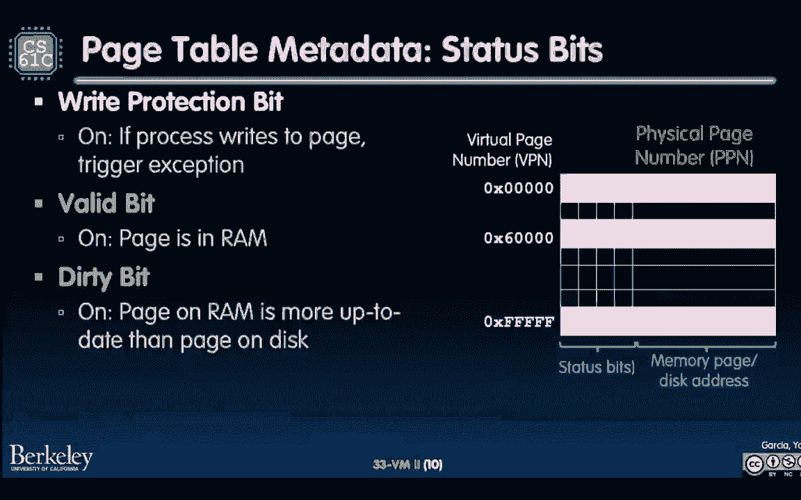

这个特殊的记忆需要做的。

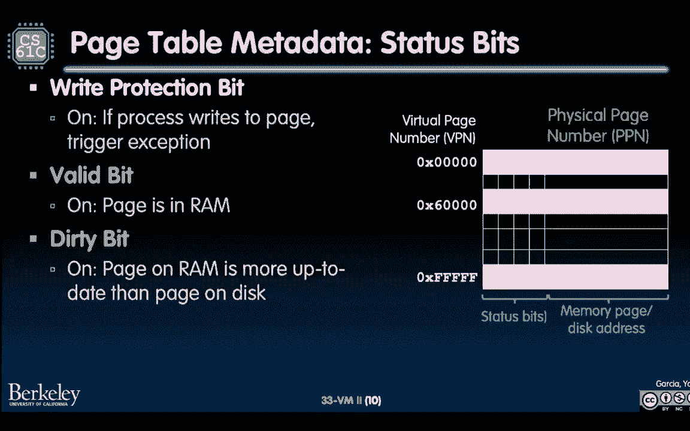

我们谈谈吧，所以我们知道缓存是内存缓存，内存有点像磁盘的缓存，换句话说，记忆中的每一页，实际上是这个东西的秘密副本，只是离处理器更近，所以处理器实际上可以读取它，但是，考虑与缓存相同的情况，也就是说。

如果我们写一些东西，如果我们编辑一些东西，那我们是不是应该在缓存上编辑它，并立即在内存中编辑它，这样就可以通过，或者我们应该回信，所以在缓存上编辑它，让它成为最新的副本，一旦那个块消失了，更新内存本身。

这就回来了，那么你认为我们应该做哪一个来记忆，当我们有一个页面，当我们更新内存中那个页面上的信息时，我们是不是也应该在磁盘上做一个右，或者我们应该马上回去，当页面被驱逐时，我知道观众中有些人。

你们觉得谁说的很有趣，这里有几只手，谁说右后卫有趣，这里还有几只手，呵呵，我们该怎么做呢？我们是不是应该，也许不是当你可以谈论一点点，这里有一个简单的方法来思考什么是正确的政策。

这也是我们拥有记忆的原因之一，记住这里巨大的内存层次结构，我们想尽量避免去磁盘，然而，磁盘是非常有用的，因为与内存相比，它就像是一种无限的存储，但我们想尽量避免去那里，如果我们有一个程序。

不断地编写和编辑东西，然后它会改变缓存很多，很可能会大大改变记忆，我们希望它也经常更换磁盘吗，当我们做正确的通过，好啦，我听到我听到一个响亮的不从像一个人在观众，是啊，是啊，有趣的想法。

所以这里的答案是，也许虚拟内存应该使用，因为这些过程耗时太长，是啊，是啊，有个问题，奇妙的问题，所以这里的问题是嘿，有这样的页表，记住，上次丽莎对页表大做文章，不是缓存。

就像它只是一个页码和其他东西的查找表，好吧，就在后面，就像页表一样，关于像这样的数据，这是怎么回事，非常非常好的问题，这是我们稍后要讨论的。

但如果我们回到页面错误，这里的信息真的很快，当我们在页表中查找东西时，引发页面错误，假设有效位是关闭的，我们需要进入磁盘，操作系统要做什么，它不仅要从这里检索数据页，它还会更新页面错误，我是说页表本身。

因为页表就像是关于每个，呃，每个虚拟页面所在的位置，不管是记忆还是只是这样，我们总是要对页表进行更新，但我真正想问的是，数据的更新发生在哪里，如果你在商店工作，这里的想法是，是的，对于数据的更新。

您可能希望只在内存中执行此操作，所以内存更新，或者说哪个内存到内存更新了什么，我们有，我们有页表更新要关闭，我喜欢打开有效的部分，因为现在它在记忆中，不管怎么样，然后现在我们还希望能够更新到任何信息。

就在这上面，这就像我，我就像我在这里疯狂地走着，但是是的，所以如果我们加载信息，因为那东西在磁盘上，然后我们更新页表，如果我们把数据从内存中取出，因为我们需要空间从磁盘加载更多信息，然后那个阻力。

我们也许应该做一个右后卫，好啦，所以我们总是在页面存储库上进行磁盘访问，但那是为了加载信息，是啊，是啊，问题，是啊，是啊，这里还有一个问题，是啊，是啊，哎呦，是否有某种现金一致性是个好问题。

我们星期一再详谈。

所以现在我们都在谈论理论层面，我要再介绍一个理论概念，然后我们要练习追踪记忆，一点点看看到底会发生什么，原来页表的整个想法，这个页表有虚拟页码的所有可能位置的巨大查找，对于一个过程，那还不错。

但是一旦你有很多很多的过程，你的坡道里只有很多很多的页表。

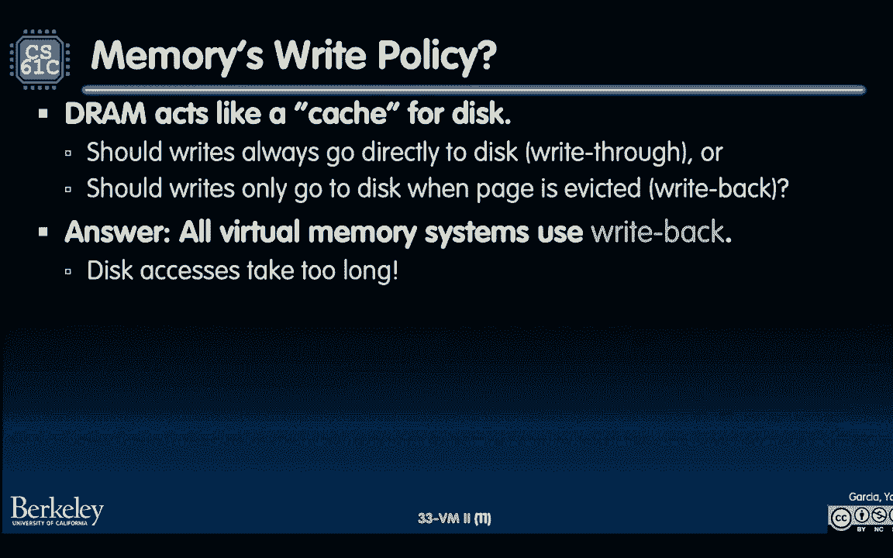

那占了很大的空间，而且有点浪费，所以我将介绍分层页表的概念，这就是页表的使用方式。

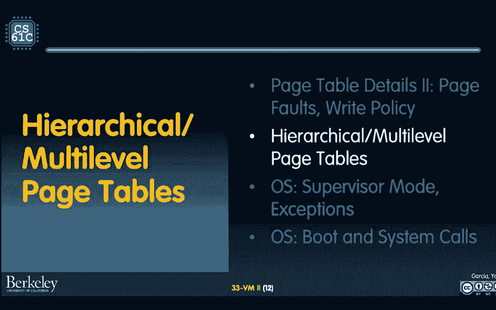

如今，您还会听到它们被称为多级页表，这就是为什么在这里包括这两个主题，我都看到了，呃这两个术语，所以让我们回到我们的页表条目有多大的想法，有多大我们的页表有多大，如果每个页表条目是四个字节。

这些是与上一张幻灯片相同的计算，所以如果我们有一个3个2位字节的可寻址空间，就像那是我们的三位一体的电脑，例如，我们有四个gib位的内存，我们有四个cubit大小的内存。

那么我们拥有的页面虚拟页码的数量，还是要到二十岁。

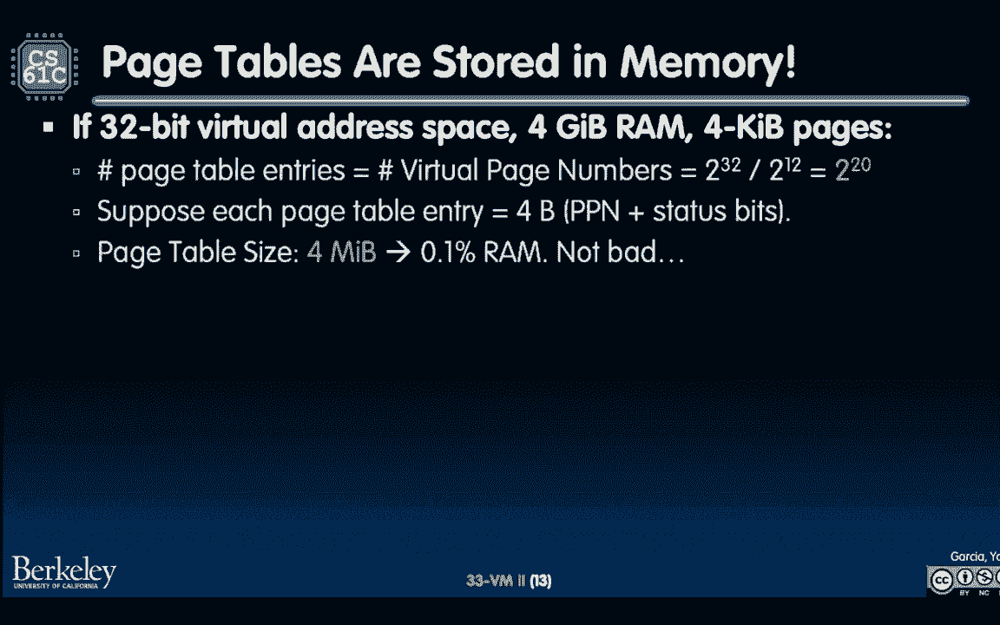

这和我们在上一页看到的计算是一样的，每个条目的页表大小是4个字节。

也许是一点点，仍然会是那个点，我们之前看到的百分之一，但是，因为每个程序或进程都需要自己的虚拟或自己的页表，如果我们有256个过程，对于我们的现代计算机来说，这实际上是一个非常小的数字，但请原谅我。

然后是256个过程，每一个都需要自己的页表，目前我们相信所有的页表都存在内存中，因此，要处理这256个进程页表，页表值多少信息需要在内存中，一个吉比字节，好啦，二到八次，二对二二，所以突然间，我们有2。

5%的珍贵记忆被利用了，只是为了页表的后勤信息，它似乎不太有效率，因为你记得我们刚刚争论了很久，好啦，当我们回到磁盘，我们必须正确地加载数据页面，我们想喜欢，避免加载太多的数据页在移动。

内存中的数据页太多，那么我们如何保持这种后勤记忆，这有点像页表内存，向下的问题。

这里还有一个复杂的问题，你们中的很多人可能会说，你为什么不把那些页表放到磁盘上，那就没问题了，好吧好吧，事实证明，您不能将整个页表交换为，就像你不能喜欢，否则你就会喜欢，就这样去吧，为了阅读东西。

你实际上必须从记忆中读出它，所以每次你想加载页表，你必须一直把页表加载到内存中，稍微读一下，然后可能把它驱逐回磁盘，在这里需要很多信息，好啦，所以需要有一个更好的方法来存储最喜欢的。

关于我们页表的最珍贵的信息进入内存，然后把剩下的放在这个地方，输入页表层次结构，这有点像这里的页表多元宇宙，其实有一点，我不看漫威，所以也许这是不对的，呃这里有个类比，但如果我们把页表，好啦。

这又是多层次的想法，那是什么，这里的关键问题是什么，我们的页表太大了，他们一个过程就可以了，一旦您有多个进程，它们只会占用太多内存。

如果我们执行以下操作呢，所以我们在左边有DRAM，然后我们在右边有光盘，在左边，我们将有一个一级页表和几个二级页表，这个一级页表有什么，它有一些二级页表的物理页码，可能在记忆中，或者他们可能一直在这里。

这就是多级页表层次结构所做的，以下是之前的洞察力，我谈论这里发生的事情的细节，这里的洞察力是我们的许多程序，你可能也写过很多这样的东西，即使我们有两个到三个两个字节的可寻址内存。

我们可能没有使用所有的2到3个2字节，我是说我们已经知道了，但我只是重复给你听，这意味着我们访问的页面，我们访问的页面并不多，这意味着我们访问的页表条目，我们需要访问的页表条目也不多，所以说，因此。

虚拟地址空间的稀疏性意味着，我们将只访问页表条目的一个相当小的子集，当程序运行时，因此，我们执行以下操作，我们做这个分层或多层页表，一级页表，抬起头来，它们在内存中的第二级页表。

然后第二级页表查找内存中的数据页，记住这个二级或那些二级页表，那些数据页--它们可以在内存或磁盘中，所以现在我们有了第二级页面，它们可能在磁盘中，但我们真正关心的是我们的数据。

我们正在积极访问以加载和存储我们的数据，当一级访问出现页面错误时，然后将二级页表从磁盘加载到内存中，这就是多层页表层次结构的思想，是啊，是啊，有个问题，哎呦，所以一级页面也有自己的驱逐策略，是啊，是啊。

又是好点子，我们将谈谈驱逐政策是如何运作的，就目前而言，只要暂停你的信仰，假设所有第一级的页面都在内存中，对于正在运行的所有进程，我们将讨论一些事情是如何改变的，下一个下一个，星期一，是啊，是啊。

但现在只需假设第一级页面总是需要在内存中，第二级的页面是可以被传呼的，在内存中进进出出，所以每当你有一个活动的过程。

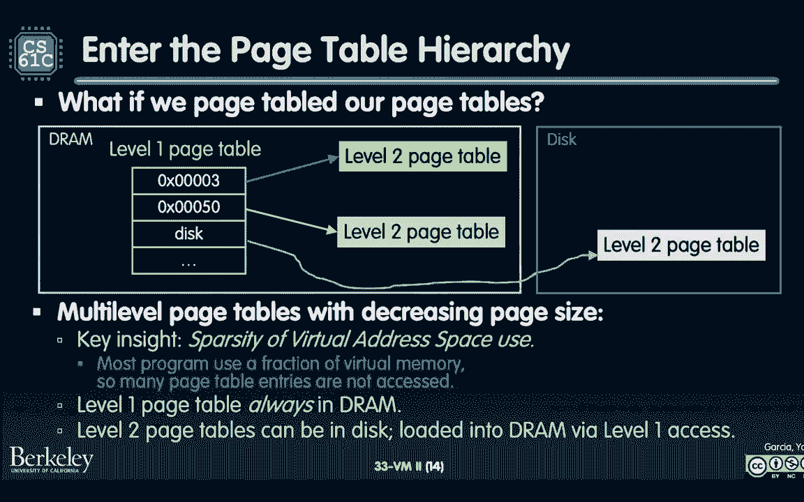

第一级页面总是需要在内存中的某个地方，但让我们来看看，这就是风险，风险5，3，2或c，rv，3，2，我根据它为这个多级页表层次结构定义的内容工作，以前我们有3个2比特的虚拟地址。

排名前二十位的是虚拟页码，现在我们说虚拟页码实际上是两个不同级别的虚拟页码，好的，好的，这里的顶层，最上面的。

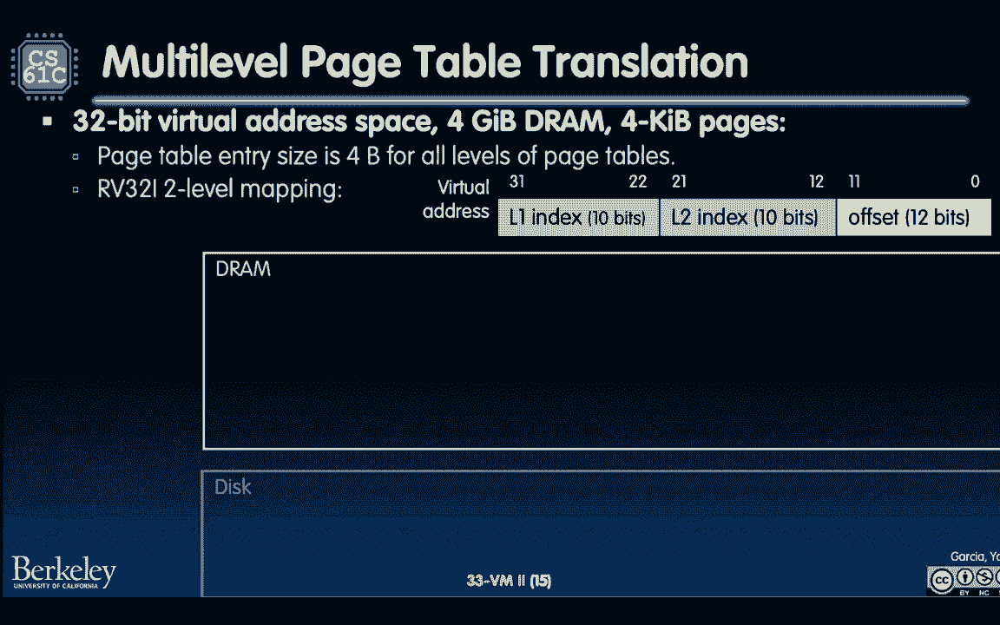

最上面的十位将是我们第一级的页码，中间的10位是我们第二级的页码，然后这里的所有页面都将是大小为2到12字节的，这就是在这里结束的偏移量，所以这意味着以下内容，这又回到了刚才问的问题，这没关系。

对于特定的过程，这里到底发生了什么，CPU有一个特殊状态寄存器，调用页表寄存器，它实际上被称为sptbr，我们稍后会看到缩写，但是这个页表寄存器是进程的一级页表的地址，现在。

这指向内存中某个地方的第一级页表，这个一级页表有什么，嗯，它有任何二级页表的物理页码，或者它说你知道你需要去磁盘，因为这实际上是磁盘地址本身也有状态位，这里有多少参赛作品，二到十的入口，好啦。

那么为什么会这样呢，或虚拟页码在此引用，一个索引的大小是10位，所以这意味着我们有可能找到两到十个，所以我们需要有一个页表，可以为这两个人服务到十个人，所以这就是我们所说的，这里最上面的十位。

那就是那首曲子，十是从，这些条目中的每一个都指向某个二级页面，或者对不起，推荐人，一些二级页面物理页码由二级物理页码，其中一些在这个，其中一些在记忆中，那么每个二级页表都有什么，它现在也有物理页码。

但现在是数据页，那么这里有多少条目，我们考虑一下这些二级页表的寻址或索引是什么，就是中间这十位，那么有多少条目是可能的，也是二到十，这就是我们所拥有的，好啦，注意这里有两组10位，这让我有点困惑。

这就是风险所在，五个ISA说，所以这就是为什么，但你可以看到这是两组不同的，到了这个水平，一个人说，在所有可能的索引中，我有十个一级索引中的两个，因此这就是，这就是我的第一层桌子需要有多高。

我们的二级页表，好的，两个指数，还有十个可能的指数，因此，这就是页表需要有多高，最后是数据页，这些是二级页表引用的，现在这些数据页是什么，嗯，它们的大小都是2到12字节，因为那是页偏移量。

这些物理数字存储在页表中。

让我们做一些数字，我知道这就像，又是一个非常密集的讲座，就像我说的，呃，我认为虚拟内存可能是这门课上最具挑战性的事情之一，因为有太多的细节在飞来飞去，所以让我们再做一些信封后面的计算。

我提出了分层页表的想法，和那种多层次的页表，说我们节省空间，在页表内存占用的排序中，但我们能节省多少空间呢，我要让你考虑一下，所以让我们假设我们有和以前一样的电脑，页表大小4字节，所有的好东西。

现在让我们运行16个进程，如果我们没有任何等级制度会发生什么，所以我们只有一级页表，所有那些第一级的页表都必须在坡道上，如果我们有这种风险会发生什么5 32页表硬层次结构，因此。

所有进程的第一级页表仍然需要在RAM中，但现在第二级会在别的地方，那么一级足迹是什么呢，我给你一分钟考虑一下，然后和你的朋友谈谈，我们会回来的，去你的粉丝，好啦，所以我要用一个小笑话打断你们。

那完全没有关系，但我想可能是周三。

所以我们可以谈谈，什么，你怎么让章鱼笑。

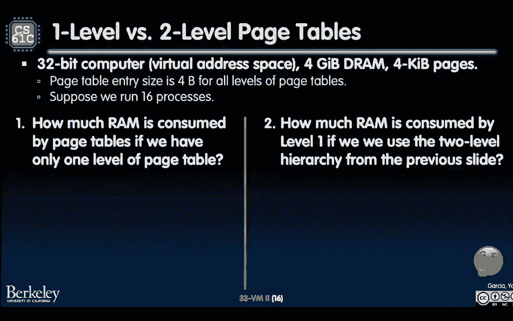

我不知道，你怎么让章鱼笑，你们听说了这是我的最爱之一，你给他们挠痒痒十下，是啊，是啊，不是哈哈，是啊，是啊，它与虚拟内存完全无关，但是你知道，我以为，这是一个让我们回到观众面前的好方法。

所以让我们稍微讨论一下，多级页表在第一级给我们带来了多少。

在正常情况下，所以在多级页表之前，在所有的等级制度之前，我们有多少一级或多少常规页表，嗯，我们需要计算它们自己的页表大小，这里的第一部分，前三颗子弹是我计算的四颗，也许又是字节。

但我已经把它包括在这里了，那我在这里做什么，我想说的是，好啦，电视有多大多少页，我有多少虚拟页码，因为这告诉我我的页表有多大，有多少页表，我只有一个办法，想想我用什么寻址方案，在这里进行虚拟地址转换。

我知道如果我们有四个立方体字节页，我们需要两个到十二个字节，否则一切都会好的，二到十二字节，是四个QB字节页，然后我们需要12位偏移量，在三个二位空间的可寻址部分。

然后所有其他20位都将是我们的虚拟页码，因此，我们的页表大小将是2到20位，页表项的页数，我们有几倍的大小到达每个入口，那是两个字节的二，或者常规片段中的四个字节，所有16个进程都有这4个字节表，因此。

这意味着平均是64，也许字节，所有这些进程只是为了存储它们的页表，其中很多可能会参考正在下降的页面，甚至没有被使用，另一方面，我们的二级版本现在给了我们什么，这是我们的二级风险五级版本给我们现在很好。

让我在这里调出上一张幻灯片中的地址翻译，这告诉我们我们的城市到底是哪十个比特，每级有多少位，你也可以计算它，并自己计算出一些逻辑，但现在让我们考虑一下，如果我们只考虑第一级页表和那些。

第一级中的每个页表都将有可能的条目数，或两个到可能条目的数量或数量，可由我们的一级指数调整，那将是十到十个条目，他们每个人，在这种情况下，我们继续假设有四个字节，这将包括物理页码。

任何形式的状态字节或状态位或任何东西，这意味着2到12字节的页表，我们有多少张页表16张页表，所以现在我们突然到了64岁，肾字节，我们落后了一千倍，我是说在1024年，那很好，作为，如此突然。

我们避开了我们的足迹，我们需要保存在内存中的最小页表数，为了让这16个进程现在都能运行，是呀，的确，这个分层的行会有一些页表，和二级页表，不过没关系，至少就脚印而言是记忆，足迹，我们太小了。

我们可能会慢一点，但至少我们更有效地利用了记忆，这里还有一个练习给你，我说他会翻译，然后呢，哎呦，这里有个问题，是啊，是啊，什么事？所以有一次有个问题，问得好，问得好，问题是嘿，好像我真的不明白。

如果喜欢为什么这个基本，喜欢原创页表设计，就像我们不能只是喜欢商店，页表的一部分，这是个很好的问题，呃，就本课程而言，我们要说就像，我们在这里使用的抽象，页表能够成功地查找所有虚拟页，就像，打扰一下。

是否能够成功地将所有虚拟页码转换为物理页码，或者告诉他们或者告诉我，所以我们不想让事情变得，页表级别的遗漏，我们想，至少能够回应关于，我们要找的这个页面是否真的存在于内存中，因此在这里，呃。

在这个原始示例中，因为我们有2到32位可能的可寻址空间，我们会有两到二十页，我们需要能够说出20个虚拟页面中的所有这两个，该物理页是在内存中还是在其中，这有点像这里的抽象之一，你说的就像是。

我们不需要记忆中的所有信息，在这里，Risk Five使用的一种方法是使用这个分层版本，也就是说我不能，或许可以查一下，我关心的所有数据的物理地址，但我会查看页表各部分的物理地址，我在乎的。

这就是为什么我们有这个等级制度，所以我们有这个等级制度说好吧，这个第一级页表告诉我所有第二级页表，我目前正在和，所有的身体，就像虚拟页码到物理页码，我目前在这里工作，他们都在这个一级表中跟踪。

那你说的就是，这就像我正在处理的实际数据，那些查那些记忆页，它们由这些二级数据表管理，所以这里只有一点点头顶，允许这种额外的间接性，但它实际上节省了CPU，它为操作系统节省了大量的查找时间。

它只知道我可以查这个然后查这个查这个，最后你可以从这里加载东西，我很乐意多回答一点，但希望这至少能让你开心一点，因为我觉得你说得很对，再来一个翻译演示，我们不打算这样做作为一个好的。

我至少会给你一些时间来处理，所以我们有一个虚拟地址，假设我们有以下地址，我想那是三块二。

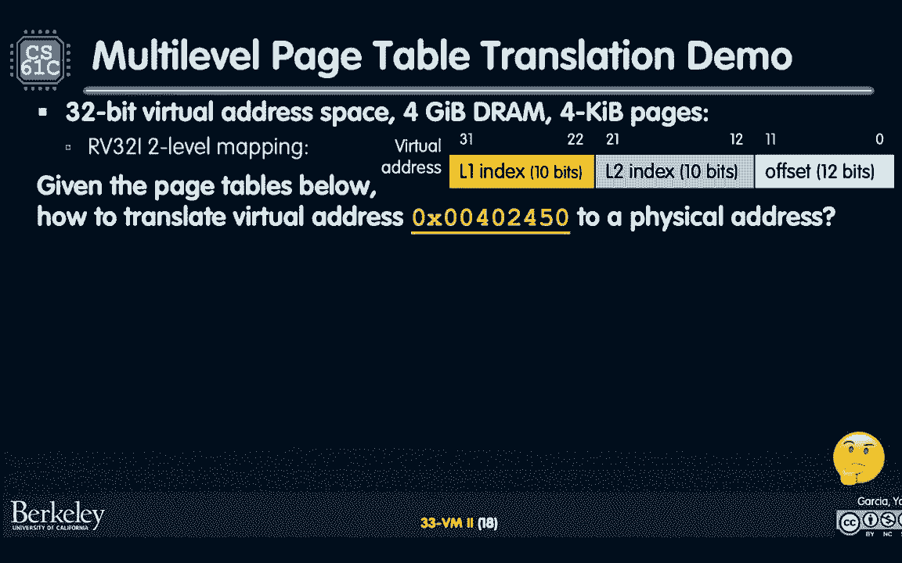

好啦，我们这里有以下地址，我们怎么翻译这个，如果我给你下面的页表，我假设所有这些页表都在内存中，还有其他的在磁盘里，但你怎么把它翻译成一个物理地址，你可能需要半分钟来处理，幻灯片上有什么。

美丽的父母不是超级美丽的标志，你知道吗，有时候声音会让我有点紧张，这是其中之一，这是其中一次，但我也告诉过你，所以这也是我的错，所以让我们谈谈，那么我们要做什么，我们从这个32位的虚拟地址。

我们正在努力翻译它，与此虚拟地址相对应的物理地址，这就是我们的目标，我告诉过你我们有一种分层的方式来翻译地址，然后我给了你一些查询表，对于层次结构中的每一部分，那么我们如何进行得很好呢。

我们可能想做的一件事，从这个3位2位的地址开始，好啦，告诉我Lone查找的前十个部分是什么，一级查找是，然后中间的10位是什么告诉我L 2查找是什么，等等，等等，所以我要在这里做，那么我做了什么。

你就像，我怎么得到这个我喜欢，其实呢，当我翻译虚拟内存地址时，我喜欢从下面的部分开始，因为通常这里的偏移量是很好的倍数，所以在这种情况下，较低的12位或3个十六进制数字，那是我的页偏移量。

不会是十六进制四五零，只要下三个十六进制数字，中间的10位相当于两个半文本数字，好啦，那么这与这里对应的是什么呢，那将是两个。

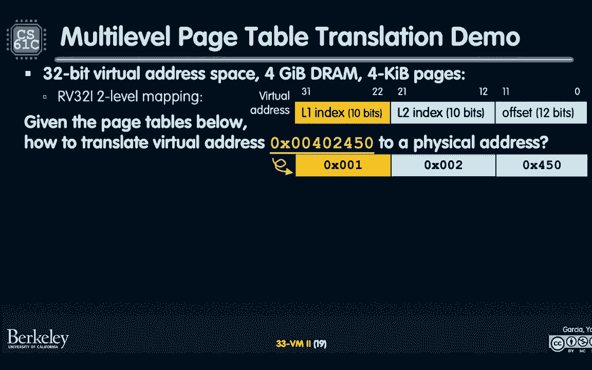

使用这里的指针，那将是两个，那是一个完整的十六进制数字，零是另一个完整的十六进制数字，然后这个4的下两位是零。

好啦，所以中间是零，零二，最后这里的最后十个位是四个位中的上位，哪一个是，然后是零，然后是零，那就是x 1，好啦，所以这就是，这就是翻译。

至少要弄清楚我们有什么指数，现在我们可以回到这张桌子上，所以现在我们知道了我们要查找的条目和一切，我们要去查查，好啦，那么我们在这里的查找是什么，也许我应该改变其中的一些。

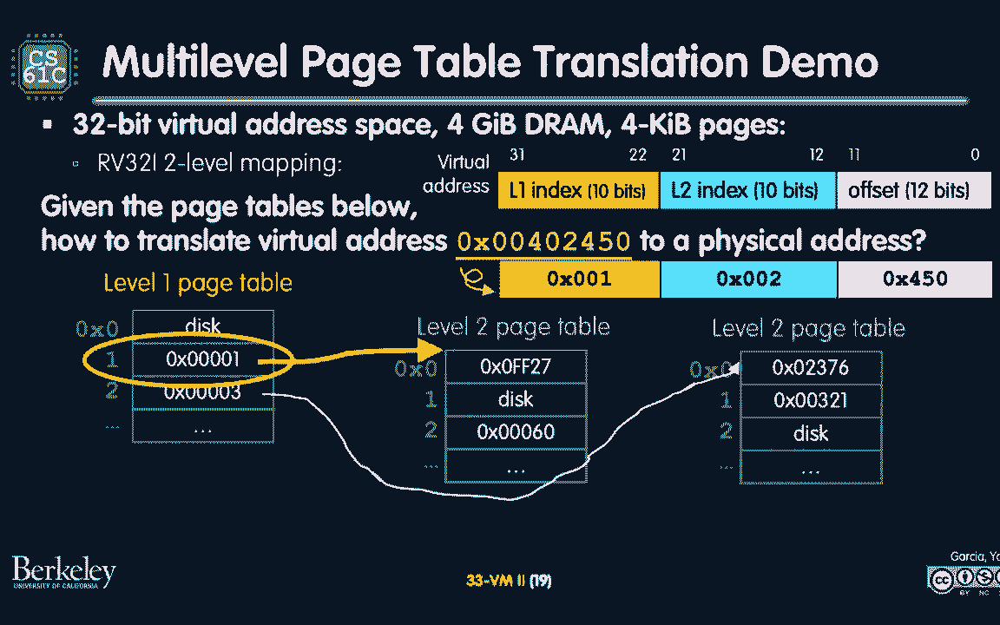

我要把这里的地址改一下，因为看起来有点吓人，十六进制一，我要把这个地址改成，就像一个疯狂的地址，因为我不想，我不想让屏幕上的两个把你弄糊涂了，所以好吧，我们开始吧，所以我们现在在这里，这篇课文是什么。

一个索引指的是这个十六进制的，这个级别，一个指数指哪个条目，我们应该看看一级桌。

所以我们不看第零项，我们不看牙齿的入口，我们看一次进入，所以我们就在这里，在行的实际索引本身，然后这个条目是什么，比如这个页表里的信息是什么，这个十六进制二零一或其他什么，那是物理页码，二级页表。

所以这是这里的箭头，这里好像有些信息，就像，你知道物理页码，不知何故，你需要把它转化为实际的，像三个二位需要是二级页表的物理地址，但这就是我的想法，这篇课文二零一大致是，呃。

在第二级页表开始的抽象级别上，现在我们有了这个二级指数，好啦，所以这个十六进制0 0 2，我们如何利用这些信息，我们使用它的方式是一样的，所以十六进制零二，这告诉我，我应该看第二级表的第二行索引。

我现在在看，所以我看着这个，这个入口就在这里，也就是十六进制六十，好的，好的，这就是信息，那是物理页面，我应该查看的数据页的编号，这就是所有的信息，我需要能够创建物理内存地址的物理页，我们去看看。

物理页码是多少，它是该级别数据的物理页码，两页第二页，不会是十六进制六十，物理页面的下12位是什么，物理地址，这将是页偏移量，原始页面，与虚拟地址的偏移量，我们试图翻译，所以现在是十六进制450。

我把它们连接在一起，因为我有三个二位，在这种咬伤的情况下，物理内存的可寻址内存，那将是十六进制零，我只是在这里把它们砸在一起，这些是较低的十二位，这是上面的二十位，我为什么要走过它，如此缓慢，我再想想。

虚拟内存，所有这些疯狂的翻译都在发生，我希望一个完整的例子能有所帮助，所以在过去的五分钟里，当然啦，我要谈一件事，你们很多人像我一样单独问，你就像他们在教室里走来走去，你就像你看到的，你好像少了一分。

然后每个人都像现金一样，下次我们将讨论缓存，但还有一点，我还没有谈到操作系统提到它，但现在您可能想知道页面错误实际上是如何工作的，就像这里到底发生了什么。

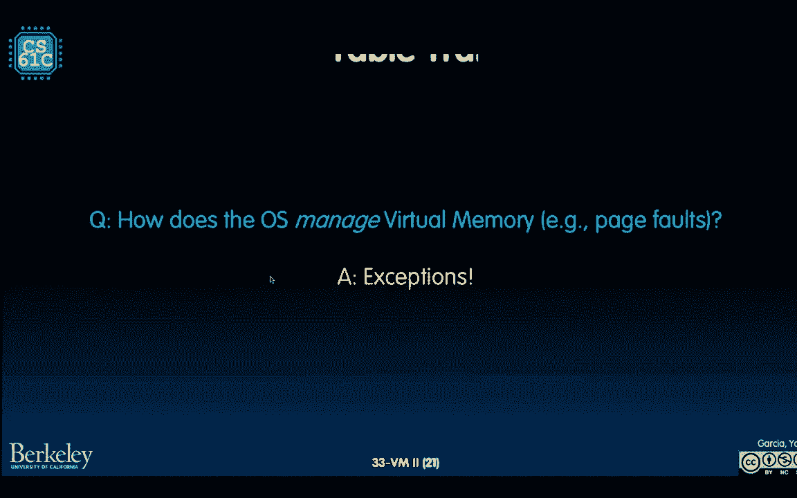

开始这个对话，我可能不会完成它，我们星期一再详谈，但这里有一个想法，错误和所有这些类似的，你知道的，在这一点上，我们一直在说操作系统会处理一堆东西，但操作系统必须以某种方式处理这些东西。

它本身就是一个软件，这本身就是一个过程，它还必须以某种方式使用CPU，那么对操作系统的高级理解是什么呢，这将允许操作系统进程与所有用户进程共享CPU，在请求记忆，然后就像做所有这些事情。

请求网卡，所有这些东西，答案是这里有两个关键特征，其中之一是CPU以两种不同模式执行的可能性，主管和用户模式，另一个是异常在这里的实际工作方式，主管模式与用户模式，想法是这样的，你有一些CPU。

或者我们从项目三开始就一直在建造的CPU，它可以执行任何，它给出的任何指令，它没有任何类似的东西，啊，我不能执行这个指令，只要是有效的指令，它会尝试执行它，但如果这就像一个流氓过程呢。

CPU只是盲目地访问东西，是啊，是啊，或者执行东西，但CPU说的其实就像，好啦，嗯，你不能进入，你不能看到记忆的所有部分，否则你不能做这些特定的事情，如果你处于所谓的用户模式，如果你是主管模式。

或者我们所说的内核模式，有时做这些事情是可能的，那么什么主管模式，这是一个，这是一个特殊的注册身份，有点说这个这个过程，这个特殊的过程可以执行这些类型的指令，它可以将约束强制到其他进程中。

就像超级用户一样，对于许多熟悉Linux系统的人来说，但这是在硬件层面，这种硬件主管模式经常，如果这里有例外，你会得到一个蓝色的死亡屏幕，你会发生疯狂的撞车事故。

那是什么意思，这意味着大多数东西实际上是在用户模式下访问和执行的，包括内核的很多部分，操作系统本身的许多部分，硬件主管模式使用得很好，很少，它用于从磁盘进行内存访问和页面加载，这里是它使用最多的情况。

就是这种例外和中断的想法，下次我们会更多地讨论中断，所以我只想，我想把这个幻灯片，两天内可能会有两次，下周三左右，但让我来谈谈这里的左手栏，异常异常是操作系统喜欢的方式，干预当前程序的执行，好啦。

所以这是同步发生的，例如，如果有一个非法的指令，当你想通过数据路径，突然间你解码了一些你喜欢的东西，他们就像，我不知道这看起来有什么异常，然后如果你只是想停止这个程序，它就在那里，可以除以零异常。

你可以像我喜欢的那样页错误异常，我不知道数据在哪里，帮我帮我操作系统，这就是允许用户进程使用此异常思想所做的事情，用户进程试图去流氓异常，这就是这就是一般的思想。

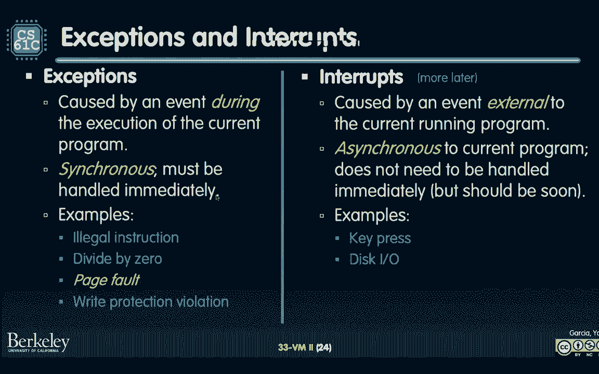

这是如何通过陷阱处理程序处理的，这是今天的最后一张幻灯片，我们下次也会更多地讨论，跟踪处理程序实际上是处理这些异常的东西，这是一种术语，我是说。

嗯，这绝对是术语，但我的想法是，假设你有那个页面错误，现在呢，操作系统需要接管，以便能够加载页或将所需的任何页从内存驱逐到磁盘，然后将页面从磁盘加载到内存中，所以操作系统在某种程度上需要控制过程。

那么发生了什么，你冲水，您在故障指令之前完成所有指令，记住我们有一个管道，所以事情还在执行，在未完成执行的指令之后的其他一切，然而，没有行动，做泡泡类的事情。

你知道管道危险的东西，它回来了，告诉操作系统做它的事情，操作系统在监督者模式下完成它的工作，把书页带回来，所有这些事情，然后返回到原始指令并重新执行它，好啦，那么我们下次要讲的是。

我们如何从用户过程的角度保持这种抽象级别，事情可能需要更长的时间，但过程不知道，感觉就像顺其自然，它的指令突然隐藏异常，我就像没事一样，我让操作系统来处理，在这里等着，在这里等着，至少，这就是。

你知道的，这就是用户进程的想法，然后继续走下去，如何工作留待下次，星期一见，祝你们周末愉快，谢谢你，嗨问题。

