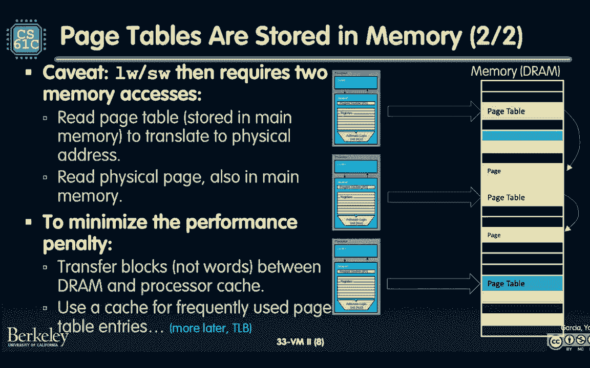
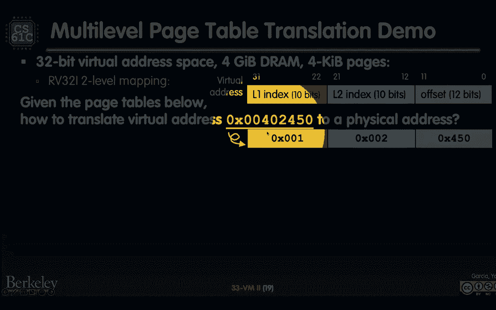

# 课程 P44：第33讲：虚拟内存 II：缺页、多级页表、中断/异常 🧠💾


在本节课中，我们将深入学习虚拟内存的核心机制。我们将探讨当所需数据不在内存中时会发生什么（缺页），如何通过多级页表更高效地管理内存，以及操作系统如何通过中断和异常机制来接管处理。这些概念共同构成了现代计算机内存管理的基础。


---


## 回顾：虚拟内存与页表


上一节我们介绍了虚拟内存的基本概念，特别是页表的作用。现在我们来回顾一下核心要点。


即使计算机有多个处理器，我们通常也会运行成百上千个进程。操作系统通过上下文切换在可用的CPU核心上复用这些进程。然而，所有进程共享同一块物理内存（DRAM）。


虚拟内存的概念解决了这个问题。每个进程都认为自己拥有完整的、独立的地址空间（例如，在RISC-V中是2^32字节）。操作系统通过为每个进程维护一个**页表**，将进程的虚拟地址空间映射到共享的物理地址空间。

**页表**的核心功能是将**虚拟页号（VPN）** 转换为**物理页号（PPN）**。地址中的**页内偏移量**在转换过程中保持不变。
```
物理地址 = (物理页号 << 偏移量位数) | 页内偏移量
```
这种机制实现了进程间的隔离与保护。页表项中还包含**保护位**，可以控制进程对共享页面的读写权限。


> 为了简化当前讨论，我们暂时假设没有缓存，每次内存访问都直接与DRAM交互。




---


## 缺页处理 🔄

当进程试图访问的数据不在物理内存（DRAM）中，而是存储在磁盘上时，就会发生**缺页**。这是虚拟内存系统的关键事件之一。


页表项中的**有效位**指明了对应的数据页是否已加载到物理内存中。如果有效位为“无效”，则表示该页目前在磁盘上。


以下是缺页发生时的处理步骤：

1.  **触发缺页**：CPU在访问内存时，通过页表发现目标页的有效位为无效。
2.  **操作系统介入**：CPU触发一个**异常**，将控制权交给操作系统内核（运行在**监管模式**下）。
3.  **选择牺牲页**：物理内存空间有限。如果内存已满，操作系统必须选择一个页面**驱逐**回磁盘。这涉及到**页面替换策略**（如LRU、FIFO等），该策略由软件实现。
4.  **执行换入**：如果需要，先将选中的“牺牲页”写回磁盘（如果它是**脏的**，即被修改过）。然后，将所需的页面从磁盘读入物理内存的空闲位置。
5.  **更新页表**：操作系统更新页表项，将其有效位置为“有效”，并填入新的物理页号。
6.  **重新执行指令**：操作系统退出异常处理，CPU重新执行那条触发缺页的指令。此时，数据已在内存中，访问得以正常进行。


> **脏位**：页表项中的另一个重要状态位。它标识该页自被调入内存后是否被修改过。如果被修改过（脏位为1），在它被驱逐出内存前，必须写回磁盘以保持数据一致性；如果未被修改（脏位为0），则可以直接丢弃，因为磁盘上已有副本。


---


## 多级页表结构 🏗️


单一的线性页表可能会占用过多内存。以一个32位地址空间、4KB页面的系统为例，每个进程的页表可能有2^20个条目，每个条目4字节，即占用4MB内存。如果有256个进程，仅页表就要消耗1GB内存，这显然效率低下。


然而，进程的地址空间使用通常是**稀疏**的，即它不会使用所有可能的虚拟页面。多级页表利用了这一特性，只为实际使用的地址区域创建页表，从而节省内存。

在RISC-V（rv32）架构中，虚拟地址被划分为多段用于多级查找。例如一个两级的页表结构：


```
虚拟地址 [31:22] | [21:12] | [11:0]
         一级索引    二级索引    页内偏移
```


以下是其工作原理：

1.  **一级页表**：由CPU中的一个特殊寄存器（如`satp`，页表基址寄存器）指向。它包含多个条目，每个条目要么指向一个**二级页表**的物理页号，要么表示该区域未使用。
2.  **二级页表**：由一级页表项引用。它的条目中存储着最终**数据页**的物理页号，以及有效位、保护位、脏位等信息。
3.  **地址翻译流程**：
    *   CPU用虚拟地址的高10位（一级索引）查找一级页表，得到二级页表的物理页号。
    *   用虚拟地址的中间10位（二级索引）查找该二级页表，得到目标数据页的物理页号。
    *   将得到的物理页号与虚拟地址的低12位（页内偏移）组合，形成最终的物理地址。


**多级页表的优势**：
*   **节省内存**：只需为进程中实际使用的虚拟内存区域分配二级页表。大量未使用的地址区域在一级页表中只需一个“无效”条目即可表示。
*   **灵活管理**：二级页表可以像数据页一样被换入换出磁盘，而只需保证一级页表常驻内存，进一步减少了内存常驻开销。


**示例计算对比**：
*   **单级页表**：16个进程，每个页表4MB，共需 **64MB** 内存存放页表。
*   **两级页表**：一级页表仅需2^10个条目 * 4字节 = **4KB**。16个进程的一级页表仅需 **64KB**。内存占用减少了约1000倍。


---

## 中断与异常机制 ⚙️

操作系统需要一种机制来响应像缺页这样的突发事件，并安全地接管CPU执行。这依赖于CPU的**特权模式**和**异常/中断**机制。

### 用户模式 vs 监管模式
*   **用户模式**：大多数用户进程运行在此模式下。在此模式下，CPU执行指令的权限受到限制，例如不能直接执行某些特权指令或访问所有物理内存。
*   **监管模式**（内核模式）：操作系统内核运行在此模式下。拥有最高权限，可以执行所有指令，访问所有内存，并管理硬件资源。从用户模式切换到监管模式通常由异常或中断触发。


### 异常
异常是**同步**事件，由当前正在执行的指令直接触发。例如：
*   非法指令异常
*   除以零异常
*   **缺页异常**


当异常发生时：
1.  CPU会**完成**异常指令之前的所有指令。
2.  将后续指令**冲刷**掉（在流水线CPU中）。
3.  保存当前进程的上下文（如程序计数器PC）。
4.  切换到**监管模式**，并跳转到预设的**异常处理程序**（一段操作系统代码）执行。
5.  处理程序（例如，缺页处理程序）执行必要的操作（如从磁盘加载页面）。
6.  操作完成后，恢复之前保存的上下文，切换回用户模式，并重新执行那条触发异常的指令。




### 中断
中断是**异步**事件，由外部硬件设备触发，与当前执行的指令无关。例如：
*   定时器中断（用于时间片轮转调度）
*   磁盘I/O完成中断
*   网络数据包到达中断


中断的处理流程与异常类似，也会导致CPU切换到监管模式执行相应的中断服务程序。中断是操作系统实现多任务和响应外部事件的基础。

> 通过异常和中断，操作系统得以透明地管理硬件、处理错误，并为用户进程提供“无限内存”的抽象。进程无需关心数据是否在磁盘上，也感知不到自己被挂起等待I/O，这一切都由操作系统在背后通过特权模式切换来完成。


---


## 总结 📚


本节课我们一起深入探讨了虚拟内存系统的三个核心高级机制：


1.  **缺页处理**：当访问的数据不在内存时，操作系统通过异常机制介入，从磁盘换入所需页面，并可能换出其他页面。**有效位**和**脏位**在此过程中起着关键作用。
2.  **多级页表**：为了解决单级页表内存消耗过大的问题，引入了层次化页表结构。它利用地址空间的稀疏性，极大地减少了页表本身的内存占用，是现代系统的标准设计。
3.  **中断与异常**：这是操作系统获得CPU控制权的硬件基础。**用户/监管模式**的划分提供了必要的安全隔离，而**异常**（同步）和**中断**（异步）使得操作系统能够处理内部错误和外部事件，实现了对硬件资源的统一、安全管理。


这些机制共同工作，使得虚拟内存系统不仅高效、节省物理资源，而且安全、透明，为每个进程提供了稳定独立的运行环境。在下节课中，我们将把缓存重新引入这个体系，探讨缓存与虚拟内存如何协同工作。