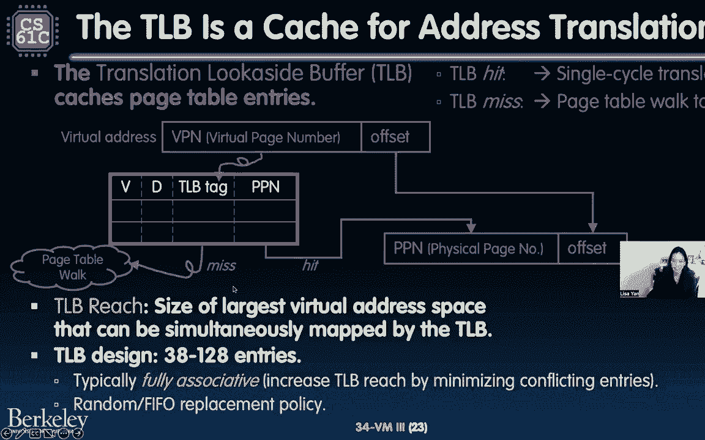

# P45：Lecture 34： VM III： TLB - 这样好__ - BV1s7421T7XR

大家好，欢迎来到61 C，我没有反应，因为我们用的是网络研讨会，不过没关系，我相信你们都非常兴奋，所以今天是星期一，但在我们开始常规的61 C之前，我确实想记下，呃，加州大学范围内的罢工确实开始了。

这是一次罢工，本科，Gsis，呃，其他学术秩序，工人，实际上，就像超过四分之三投票的人，我说四分之三的工会投票，有百分之九十，所以这就像，那是一个很大的数字，嗯，投票是因为，工会已批准罢工。

在工会之间没有协议的情况下，他的代表是，呃，UAW和UC在学术工作者等问题上，薪金福利，工作保障和对在职父母的支助，在许多其他的东西中，现在在61 C，我们给了我们一些时间，呃。

我们的员工决定他们想做什么，也让我们想出如何支持这门课，在没有工会的情况下，因为这堂课，就像加州大学系统中的许多其他东西一样，是真正依赖于劳动的，尤其是，这个工会的劳工，所以试图弄清楚该做什么。

试图承认和尊重，这就是为什么我们今天要开一个关于变焦的讲座的原因之一，所以随着时间的推移，事情可能会发生一点变化，但是为了更多的资源，请务必查看我们的广告帖子，我们会发出更多的更新，随着局势的发展。

希望明天，但考虑到这一点，让我们来谈谈虚拟内存，因为即使我是说校园里发生了这么多事情，我们也在考虑我们电脑里发生的一切，所以上次，我们对虚拟内存进行了超级超级深入的研究，有层次结构的页表之类的东西。

多级页表，这一次，我们要退一步，思考一下我们如何以一种方式实现虚拟内存，它和我们其他的操作系统一起工作，呃，这与我们在过去两年里一直搁置的缓存有关，两堂课左右，所以事不宜迟。

我们将继续我开始的关于异常和主管模式的讨论，所有这些我们都将有一个录音部分，我只是要跳过，超短的，就像五分钟。

但我想为了节省时间，我们要跳过它，然后我们要看幻灯片上的其他内容。

所以考虑到这一点，上次我们在哪里，好吧，上次当我隐藏浮动会议控制，上次我们考虑过这种处理者，那是什么意思呢？陷阱处理程序是一个允许，可能对每个人来说，好啦，我们走吧，呃。

陷阱处理程序是一个允许维修这些东西的东西，调用中断和异常，在硬件层面，但实际上，如果你有一个过程，或者我是说一个过程，我们称之为，从操作系统操作的程序，观点，如果您有一个使用CPU的进程。

有时你想改变这个过程，也许可以通过另一个过程来工作，或者你可能想处理一些错误，我们简要讨论过的两件事是中断和异常，两种不同的，这两件事的区别是，事实是中断与程序是异步的，他们是程序之外的。

所以如果你喜欢，按键盘上的一个键，或者你稍微移动一下鼠标，然后单击当前进程之外的内容，那正在发生，例外，另一方面，与您的进程同步，所以这通常是你的过程正在执行的东西，执行，然后发生了一些事情。

它需要有一个例外，调用异常，还有这个，例如，就像如果过程工作在进行，然后可能是它引发了页面错误，或者它有一个不正确的无效指令，在这个过程中。

不知何故，它需要退出，呃，从那里开始，现在陷阱处理程序是如何工作的，原来这里有几个维度，有几步，所以我现在就把一些放在页面上，它完成了之前的所有指令，引发我们所说的故障的那个，或者中断，或者例外，好啦。

陷阱手柄就像困住故障一样有效，好啦，这就是为什么它被称为陷阱处理程序，一旦完成，或者一旦它让处理器，CPU完成所有指令，然后它刷新所有未完成的指令，或者发生在错误之后，所以有两类指令。

在错误指令之前发生的事情，错误指令之后发生的事情，其中很多可能是不完整的，我们考虑之前发生的一切，然后说，好啦，你们都提前完成了，然后其他还没有完成的事情，在错误指令转换为，让我们说像一个没有行动。

因为它被冲走了，所以这与管道危险非常相似，我们把CPU冒泡出来，清除CPU以允许其使用。

然后发生了什么，然后陷阱处理程序开始运行，好啦，所以陷阱处理程序是一个过程，那就是用CPU的东西，它运行在主管模式下，好啦，这就是这里的想法，为什么我们有陷阱处理员，我们想为这些类型的事情服务。

比如中断和异常，而这一切，但我们喜欢你想要中断的一个主要原因，唯一的例外是发生了一件特殊的事情，当前以用户模式运行的处理器可能无法处理，所以它想调用主管模式，或者它希望硬件处于监管模式来访问特权内容。

现在陷阱处理程序以监督模式运行，处理指令，处理异常，然后呃，打断我们的开始，然后它可以选择返回到原始程序，然后重新执行错误指令，所以我有了这个想法，也许如果你按下你想激活的键。

就像操作系统需要处理所有的设备处理和东西，然后它需要返回到当前的程序，好啦，是啊，是啊，那把钥匙，那个键现在被按下了，我需要读取密钥中的数据，所以从程序的角度来看，在那段时间里一定看起来什么都没发生。

所以让我们更详细地看看这个，下面是一些例外的例子，所以我的意思是，再喜欢一次，这种打断的想法，我们星期三再详谈，当我们谈论木卫一的时候，但是如果，关于例外，下面是风险5中的几个例子。

您如何知道您有哪种类型的异常，假设陷阱处理程序开始，就像没事一样，我在这里该怎么办，它将查看哪条指令是错误的。

还有它在管道中处于哪个阶段，例如，假设有一个指令。

呃，假设有一条指令触发了一个异常。

在指令提取和指令解码之间很好。

因为它不是管道阶段，陷阱处理人员会像，好啦，嗯，它可能是一个pd是一个pc地址异常。

或者在指令解码和执行之间进行选择。

可能这里触发了一个异常。

然后轨道板就像，好的，好的，让我看看这个说明书，让我来看看这个事实，它介于id和ex st之间。

啊，可能是非法操作码，然后它会做一些其他的事情，以此类推，所以这是一些可能发生的例外的例子。

现在陷阱处理程序的一些细节。

就像我们说的陷阱面板会试着，完成运行的所有指令，然后能够开始自己运行，就像，然后很好地保存故障指令，让我们稍微考虑一下，那么旅行者擅长什么呢，首先，它保存当前程序或当前进程的状态，因为再一次。

它可能想晚点再回来，所以它需要保存所有的寄存器，程序计数器和其他东西，我们稍后会更多地讨论这个问题，第二件事是它需要做的正是我们在第一面所说的，它需要像，好啦，我们该怎么处理，中断或异常。

我要知道是什么引起的，所以它会浏览指令，它会看穿它执行舞台的地方，它会，它会检查收银机，也许是为了看看情况是什么状态，然后在此基础上，它将处理异常，在它处理异常或中断之后。

它会做两件事之一，它可能做的第一件事是返回到最初的过程，返回到原始程序，事情发展到这个地步，这样做是为了恢复程序状态，保存的所有寄存器，然后它将把控制权交还给程序。

请记住陷阱处理程序在此特殊主管模式下运行，嗯，它需要在硬件中将整个CPU返回到硬到用户模式，然后程序现在将继续运行，它做的其他事情，这里有一张很酷的图表，也许或者我是说，当我画它的时候。

我觉得它是一个很酷的图表，但这里有一个很酷的图表，说明了真正发生的事情，一步一个脚印，如果我们把这些圆圈中的每一个都看作是执行的指令。

那么在程序的情况下，程序将运行前面的指令。

然后在当前的指令下，哦例外。

因此，CPU将把控制转移到处理程序的第一条指令上。

谁要跑啊跑啊跑，如果处理程序想继续执行程序。

它将返回执行导致故障的提取。

然后程序就会继续运行，等等，等等，好啦，所以这是陷阱处理程序可以做的一个例子，但让我们假设这是一个完全古怪的例外，就像可能有一个分段故障，也可能有一个像特权访问，程序不应该做的事情。

然后陷阱处理程序应该退出程序。

它是如何做到这一点的，它实际上就像终止程序一样，我说的这口井是什么意思，同样地，程序将运行前面的指令，运行当前指令，然后导致异常或中断，CPU要转移，或者CPU将把控制权转移到处理程序。

处理程序将运行它的第一条指令，下一个指令一直到最后，然后就会像，好啦，我不想再回去执行升天的命令，我想完全释放程序资源，呃等等，等等，然后现在也安排一个新的节目。

我只想在这里做一个关于释放程序资源的笔记，注意，所有这些资源都是硬件级别的，所以像嘿这样的事情，也许在DRAM中使用了一个页表，在某个地方，我知道这个过程不会再发生了，所以我要杀了它。

不是指苹果之类的东西，或者所有这些类型的事情，你知道我们想，做所有这些小指针的东西，突然间一切都好了，嗯，你没有时间释放所有这些在硬件层面上的东西，内存不会被覆盖，因为至少对于程序来说。

从CPU的角度来看，还是从，只是不会，它不会知道那个过程不再可用了，因此，记忆不能被其他人使用，聊天室里有几个问题，呃，让我试着回答他们，一号匿名与会者说，陷阱处理程序如何决定是继续执行还是终止程序。

这是个好问题，这在很大程度上是基于第二步，因此，确定是什么导致了异常或中断，基于此，假设是页面错误什么的，你所记得的，什么是页面错误，上面说这一页，我要访问的此数据尚未在内存中，所以我需要先去磁盘。

然后返回并重新执行这个加载指令或存储指令，所以现在它可以，现在该进程可以继续运行，所以这是由于知道是什么导致了异常，中断，是页面错误，当您尝试执行MEM阶段时，在那段时间里。

可能处理程序决定将上下文切换到不同的进程，我们稍后会更多地讨论这个问题，但希望这能回答你的问题，这在很大程度上是基于哪条指令导致了故障，哪个错误指令，以及它在管道中的位置，匿名与会者二号的第二个问题。

也可能是同一个匿名与会者，呃，那是呃，我例外吗，这里是负1，完全完成，流经管道，处理程序处理异常之前，这也是一个很好的问题，我们简短地讨论了这个，但我要再重复一遍，所以是的，所以这样想。

如果我回到以前的幻灯片，如果它让我这么做，是啊，是啊，如果我回到以前的幻灯片。

这样想吧，让我们说呃，我们就在这里。

然后指令，错误指令触发此非法操作代码。

所以根据非法操作码，可能诱捕员决定，呃。

彻底扼杀程序，在这种情况下会发生什么，记住管道是如何工作的。

即使指示，故障指令当前正在指令解码阶段执行。

所有这些阶段都执行MEM，这些都是由发生在错误指令之前的指令占用和处理的。

所以这些都会完成，所以陷阱面板会让他们完成。

然后陷阱处理程序在状态下也会做同样的事情，然后想出把手。

例外，然后返回或终止程序，好问题好问题，好啦，所以呃，实际上是匿名与会者，第一个说还好，嗯，就像，陷阱处理程序会发生什么。

我在我阿姨的回答中提到了一点，我只想在这里多说一点，上下文切换的想法。

我们以前见过这个短语，但我想提醒你，它是上下文。

当你有多个程序同时运行在你的cpu上。

但同时从人类的角度来看，CPU只能喜欢单核。

CPU一次只能有一个进程在其上运行，操作系统所做的就是迅速地把它们交换出去，比如用一个新进程快速交换当前正在运行的进程。

它通过在高水平上改变处理器的内部状态来做到这一点，这到底涉及什么，如果您有多个like对quote反quote同时运行，呃，系统会设置一个定时器，可能在10微秒的水平上。

就像时钟周期空间中非常非常长的东西，但在人类空间里很短，当它到期时，它的性能是硬件中断，好啦，为什么我们要处理，这里硬件中断，因为当前的流程就像运行，然后突然从外面的操作系统就像，没有，对不起。

得开始下一道工序了，然后它的作用是，它的作用是因为它是一个硬件中断，它触发了一个陷阱处理程序，然后陷阱管理员说，哎呦，我在做一个上下文切换，我该怎么做呢，我将保存所有寄存器值，包括当前进程程序计数器。

以及我们所说的页表寄存器，这是活动进程页表的内存地址，还有其他各种寄存器，好啦，所以又喜欢了，我们想要什么，我们因为上下文切换，理想情况下，我们希望切换回当前的过程，为了让我们做到这一点。

我们需要保存所需的所有信息，这样我们就可以喜欢，呃，我们可以，我们就可以精确地，有了这些，呃，有了这两个项目，你可以，你可以想象程序计数器，那是指向当前指令的，这是当前正在运行的指令的地址。

或者下一条正在运行的指令，打扰一下，然后页表寄存器，这是页表现在在内存中的地址，还记得上次我们说的那些话吗，或者像前两次我们说的所有关于操作系统的东西，不会把东西从内存中冲走，因为那样会花很长时间。

所有这些陷阱处理人员正在做的事情，保存状态全部在CPU，像寄存器是超级超级快的，记住了，这是什么意思，这意味着所有同时运行的当前进程，你知道像再次，有了这个，所有这些上下文切换之类的。

所有这些当前活动的进程都在DRAM中，它们将继续在DRAM中，直到程序或进程终止，所以通过这样做上下文切换，就像，呃，只需更改页表，就可以为不同页表的另一个地址注册，我们不必担心改变页表本身。

或者换掉页表，所有的页表都留在那里，陷阱处理程序所做的唯一一件事就是切换出寄存器值，好啦，所以这就是，这就是上下文的力量，有一个定时器硬件中断发生，但是有两个人，非常重要的寄存器，程序计数器。

页表寄存器，允许下一个进程继续执行，甚至是继续执行的当前进程，没有任何变化，也没有任何想法，他们曾经暂停执行，所以还有另外两个部分，呃这个部分，只是讲了一些例子，好啦，所以实际上好吧，所以上下文。

这是陷阱处理程序现在如何工作的一个例子，让我们谈谈第二个例子，那是页面错误，什么是页面错误，我们已经谈了一点，但这里说页表有有效位没有设置，因为数据不在DRAM中，数据页实际上在磁盘的某个地方。

那么陷阱处理人员需要做好什么，陷阱处理员就像，好啦，我在处理什么样的例外，它就像看着指令一样，它看起来像它所在的地方，也许它看其他州，然后它说，好啦，这是假设这是一个页面错误，所以我需要处理这个异常。

如何处理此异常，嗯，我需要从磁盘上读出那一页，所以启动磁盘，我们要讲一下输入输出，下次它可能会更新任何页表，它可能需要进行上下文切换，因为磁盘记忆需要很长时间才能访问，所以也许在这段时间里。

从磁盘上抓取东西，它只会说，好啦，嗯CPU，你现在什么都不用做，所以请开始运行另一个进程，或者像继续运行一个不同的进程，等磁盘好了我再来找你，然后跟着页面错误，呃，陷阱处理程序决定重新执行指令。

以此类推，等等，打扰一下，这里的一个附带说明是，还有其他涉及内存的事情可能会导致异常，其中之一是侵犯权利，我们来谈谈到底是什么类型的，在今天的课程结束时，轨道处理程序是如何处理这些事情的，好啦。

我们将要讨论的第三种应用。

或者陷阱处理程序的例子是这个叫做系统调用的东西。

现在呢，系统调用有点混乱。

因为它们通常被称为软件中断，这可能是你更习惯的短语，我在这里看到了Sycall，就像程序从操作系统请求服务一样，好啦，类似于函数调用，只是它需要某种主管模式的东西，例如，呃，创建和删除文件。

访问外部设备，执行printf或malloc，所有这些类型的事情，甚至启动一个新的过程本身，注意这里我强调了这个e调用，你以前在项目2中见过这个，E的电话实际上是在做，就像。

实际上是要求陷阱处理员做一件事，所以现在你又回到了打印的事情上，然后你必须提前设置论点，是啊，是啊，这里也一样，它是一个叫做。

但它是由内核执行的，让我们来谈谈最后一点，这启动了一个新的进程，再说一遍，这是非常非常高的水平，因为老实说，这整张幻灯片可能是CS1262中的四堂不同的课，操作系统类，但我只是想回答你可能有的一些问题。

然后就像戳你的大脑一样，这样你就会被鼓励在未来的一个学期选修162这门课，但不管怎样，因此，假设shell想要启动一个新的应用程序或一个新的，呃就像一个，你知道殖民地计划。

也许你知道你打开Vim或类似的东西，嗯，系统调用shell，这个调用恰好被称为Linux中的分叉，它被困在操作系统内核中，虽然，换句话说，操作系统内核部分通常处于监管模式。

那么处于主管模式的操作系统当前占用了CPU，它会加载程序，有关更多详细信息，请查看呼叫讲座，然后跳转到，可能好吧，换句话说，设置PC，PC寄存器将成为缅因州新进程的第一条指令。

然后它将在下一个时钟周期返回到用户模式，然后新的过程就会开始，在这一切结束的时候，一旦进程或程序运行完成，壳牌有点像等待缅因州加入，所以有像另一个或像返回，所以有某种连接的东西。

这可能也需要一些回到主管模式，允许主管模式像，哦耶，这个程序已经完成了，让我们回到节目中，很多信息，这里的重点是什么，陷阱处理员很漂亮，这只是它如何工作的三个例子，页面错误和上下文对这个类更重要一点。

我只想解决一个叫做One的系统，因为我知道一切都会好起来的，哦是的，靴子，我们不会得到它，但是啊，但又一次，这里有一个五分钟的视频，你可以点击，非常棒，它在一个博罗旁边。

一直在教这门课，我确实建议你有效地检查它，它只是想告诉你，呃。

操作系统如何真正启动，有一种像BIOS的东西，这是第一件运行良好的事情，这个固件会再次喜欢。

呃，查看视频了解更多信息，它将操作系统内核从磁盘加载到内存中。

运行它或跳到它像，然后种子种子执行到操作系统，操作系统开始运行所有的服务，司机们，然后像启动一个应用程序，只是等待输入，又是这样，查看视频了解更多信息，好啦，这就是操作系统。

我们之所以如此详细地谈论接受是因为你还记得。

我们在哪里，我们正在考虑虚拟内存，是啊，是啊，我们正在努力思考如何，我们可以把虚拟内存带回我们在，班级，琥珀我就像上次一样，我想忘了现金。

现在我们要再次记住缓存，但要做到这一点，我们要做一些回顾，这是评论，缓存和主内存有什么区别，主要记忆是像DRAM之类的，它们使用不同的记忆单位，就像它也是不同的术语，所以缓存使用通常大约64字节的块。

然后内存使用页面，通常大约是4千字节，然后任何类型的数据，从缓存块或缓存页抓取的都是偏移量，关于那个单位，因此请注意，缓存块比主内存页和一般内存页小得多。

下面是这种看起来的缓存，呃，我们有有效的比特，你知道肮脏的地方，所有这些东西，也许它有一个或像，如果这里有个标签，如果我们在做某种直接的地图，或者如果我们在做一个完全关联的缓存，然后这里有一个数据。

好啦，所以实际上有数据被存储到这个缓存中。

另一方面，我们有主内存，当我们也有磁盘的时候，它们都使用这种称为页面的范例，它要大得多，然后也许有像，这里有很多页，所以有一些页面是DRAM的，然后有一些页面在磁盘中。

但是下面是关于每个缓存中的每个缓存中有什么信息的说明。

所以记住内存层次结构，金字塔的整个概念是下面的一切都像在更低的层次上。

我在更高的层次上看待一切，是低级别的所有东西的副本，或者说喜欢，让我说，随着时间的推移，我喜欢有点抓狂，所以一切，处于较高水平的一切都是处于较低水平的事物的子集，好吧，那么这个游戏的结局是怎样的呢？

每一关都是快速访问，较低级别的数据副本，较小的一套，但是超快的访问。

假设我们有一个小笑脸和一个缓存，这是一个小缓存，但这个块可能就在我们的L2缓存中的某个地方。

假设块的大小相同，呃，在这些级别中的每一个，这个方块，如果我们想想金字塔，缓存下面是什么，下面的缓存DRAM，所以这个块在DRAM中的某个数据页中的某个地方。

然后这个页面实际上这个DRAM页面也在磁盘的某个地方。

好啦，所以有效地DRAM或原始数据，主内存数据页类似于磁盘页的缓存，因为这就是内存层次结构的样子，这就是三角形的样子。

好啦，让我们将其与页表进行对比，好啦，因为这就像我们学到的新的其他结构，而不是CAS，几周前我们得知，现在我们很好地学习了页表，页表的功能与缓存转换不同。

地址，好啦，所以说，例如，我们这里有页表。

我们这样说吧，你知道的，这里有一个单级页表。

有一个查找，上面写着好吧，不管这个虚拟的，呃，就像这里的这个索引，这是某个虚拟页码的索引。

实际上是内存中的物理页码。

然后下面这一排，也许这是其他虚拟页码。

这将转换为磁盘中某个位置的物理页码。

所以它们不是缓存，页表不是缓存，因为它们存储物理页码和其他元数据，它们本身不存储数据，实际上，让我再说一次，他们存储物理页码和状态位，它们本身并不存储实际数据。

项目现在关心的，页表用于什么。

它们对于查找内存和磁盘之间的内容很有用，这就是我们所说的需求分页，我以前说过这句话，但我只在这里强调一下，因为再一次，在过去的几节课里，介绍了这么多术语，我真的想强调这个术语，正是因为我们将要使用它。

在接下来的演讲中，这里的需求分页是这样的想法，至少根据程序，也许它有一种像，2到32字节的可寻址内存，但实际上在后端，有一些重要的页面当前正在内存中使用，然后程序的其余部分都在磁盘上，直到需要加载。

直到流程或程序需要它，页表跟踪所有这些位置中的所有这些状态，然后按需更新。

所以让我们来比较一下这两件事。

缓存与需求分页，它们实际上也在做类似的事情，它将数据从较低的级别复制到较高的级别，以便更快地访问，好啦，但是缓存是在缓存之间，就像某个级别的缓存，假设主内存，也可能是缓存的较低级别。

然后需求分页是在主内存（通常是DRAM）和次内存（通常是磁盘）之间，所以让我们在这里比较一些术语，我们之前说过的内存单元块与页大小的关系，小得多，像64字节这样的块，然后页面就大得多了，就像，呃。

对于TB字节，小姐的名字也略有不同，所以在缓存中，我们称之为缓存未命中，如果必须从需求分页上的主内存加载它，所以在需求寻呼方面，我们称之为页面错误。

好啦，所以请注意这里的术语差异，然后你想起，缓存的全部思想是，比如整理存储空间的方法，当在一级缓存中缓存时，如二级缓存，我们可以有不同的选择，就像直接映射n路集关联，全联想，通常使用需求分页。

我们将使用完全联想，所以这意味着复制的主内存页，从磁盘加载的文件可以放置在主内存的任何位置，他们又不是，它们以任何方式被索引，它们可以被复制和粘贴，那么这里的替代政策是什么呢？用于缓存的井。

您经常使用最近使用最少的或随机需求分页，实际上也经常使用最常用的分页，最近使用最少，但这可能有点像排队，有点像第一个和第一个出来，或者是随机的，最后写政策决定，而缓存通常有右通或右回的选择。

仅需求分页马上回来，好啦，所以右后卫意味着什么，又是那个吗，我们有点喜欢，我们不想访问磁盘那么多，所以每次我们剪辑的时候，我们只是把它做成DRAM，直到这一页从磁盘中冲洗出来。

我说从DRAM中冲出到磁盘上，我们复制所有的信息，所有这些编辑回到磁盘页，好啦，所以再一次，这就像这是一个很好的幻灯片，只是为了让术语明确地开始幻灯片。

如果你是，如果你喜欢在这里记笔记，好啦，所以这是第一步，所以第一步就像我们一样，记住什么是缓存并试图，呃，在我们的头脑中把这些术语分开，你可能想知道，丽莎，为什么缓存有两种不同的术语。

虚拟内存证明虚拟内存是首先设计的，这两个大致是独立设计的，所以虚拟内存有一套术语，然后缓存就像，好啦，我现在要换一套，那里可能有更多的历史，呃，阅读维基百科，如果你想多查点，但是，让我们多谈谈如何。

我们将缓存合并回系统中，也使用虚拟内存。

它是通过一个叫做TLB或翻译的东西，往旁边看，缓冲区，所以让我们至少回顾一下，虚拟内存的一些目标，其中一个目标是，实际上这里有两个目标和一个机制，一种机制是地址转换，虚拟地址到物理地址。

它为什么要做这个翻译，嗯，一个是它想提供一个巨大空间的幻觉，做三个两个字节可寻址的事情，但第二，它想保密，好啦，它希望能够创造，给每个进程一个私有的工作空间，最后它想要统一的存储，或者这想要这种幻觉。

记忆是所有的，是这个巨大的酷，即使技术上有缓存和DRAM，还有磁盘和所有这些类型的东西，那么私处是什么意思呢，私密的部分是这个词叫做保护，这就是虚拟内存为我们提供的几个用户进程。

他们每个人都有自己的私人用户空间，它们都是由操作系统管理的，所有这些不同的页表。

第二件事，统一是什么意思统一意味着需求分页，好啦，所以有效地运行更大的程序，也许比DRAM，大多数东西可能都存储在磁盘上，然后它只是根据需要交换东西。

它还隐藏了机器配置的差异，假设你有小得多的DRAM，但是同样的程序虚拟内存仍然可以运行，或者虚拟内存和地址转换的想法仍然可以运行那个程序，即使你的主内存非常小，那么价格是多少？如果建立保护机制，呃。

支持保护，需求分页是此地址转换，它是虚拟内存的核心，我们需要在每次程序或进程运行或引用内存时执行此操作，我们得把那个内存地址，把虚拟内存地址转换成物理内存地址，所以如果我们在内存中有页表。

这将大大提高性能，或者喜欢它喜欢，都是一样的，我说，这是一个显著下降的性能，换句话说，会增加时间，访问内存的平均时间，所以让我们稍微谈谈这个，为什么会这么慢。

让我们想想我们要用虚拟内存做什么，一个好的虚拟内存结构设计应该是超快的，所以也许翻译只需要一个时钟周期，它还应该是空间高效的，我们不应该像，也许我们想要多级页表。

所有这些都是因为我们不应该占用我们所有的活动，我们带有状态位的主内存，我们可能知道的其他事情，每一条指令和数据访问都需要翻译地址，所以如果你得到一个指令，或者如果你喜欢有一台电脑，你想喜欢。

在该PC寄存器地址加载指令，嗯，该指令针对，虚拟是虚拟地址，所以你需要把它转换成一个物理地址，然后类似地，每次执行加载字或加载字节时，都要进行数据访问，所有这些也都是虚拟地址，它们都需要翻译成物理地址。

所以这就是我们在正确的图表上要去的地方，这里，你还记得吗虚拟内存的整个概念是存储页码，然后你有偏移量，虚拟页码与PPN，然后偏移量就像页面中的字节偏移量。

同样大小的，如果页表在内存中，然后我们执行所谓的每次访问页表遍历，好啦，那么我所说的页表走动是什么意思，我们只是查了所有的页表，直到我们找到我们要找的物理页码，与数据相对应，然后我们做另一个内存访问。

实际上从那个特定的物理地址读取数据，这对单级页表意味着什么，这意味着每个指令提取有两个内存访问，比方说，因为其中一个是像这样查找东西，在页表中查找物理，呃，物理页码，第二个是查找数据本身的物理地址。

然后如果你有一个两级页表，现在你有三个内存访问，第二级查找第一级和第二级页表，然后另一个从物理地址本身查找数据，是啊，是啊，这不是伟大的意义上的喜欢记住，记忆超远，有点像萨克拉门托，非常长的距离。

那么解决办法是什么呢，也许我们总是需要某种记忆，或者实际上，所以让我们用单级页表这样想，其中一种内存访问是访问页表，其中之一是访问数据，现在我们知道如何加快数据访问，我们把数据扔进缓存。

如何加快页表翻译，我们也把它扔进缓存里，哇塞，心灵震撼，这就是所谓的翻译，往旁边看，缓冲器或TLB，这是翻译的特殊缓存，事实上，这是下一张幻灯片的标题。

所以tlb转换本地缓冲区是地址转换的缓存，所以这就像是，离CPU也很近。

它实际上是另一个缓存，但它是一个特殊的缓存，专门用于这种类型的数据。

那么它是什么缓存，它捕获页页表项本身，例如。

呃，它有页面物理页码，你想去找的地方，它具有与页表项关联的所有状态位。

但现在它也有一个标签。

你就像，哎呦，哎呦，我的天啊标签，我知道我记得丹提奥叔叔，是啊，是啊，这是同一种纹身，同样的概念，这里的虚拟页码转换为tlb标记，好啦，然后呃，使用某种索引，我们将在下一张幻灯片中更多地讨论它。

然后将所有这些转换为物理页码。

无需进入内存访问页表，因为这个TLB在某个地方就像缓存一样，它要查找的最近的页表条目集，那么这意味着什么呢，如果我们有一个缓存命中，或者在这种情况下所有的结核病都击中了，那么翻译是一个单一的循环。

因为你只需要，你去缓存，你得到的东西，然后你就完蛋了，你有正确的页码，然后你只要翻译那个物理地址，就像你错过了一个小球一样，现在呢，你得走页表，您必须转到内存中的页表，抢占入口，把它放回去。

现在就像现在就像一个最近使用的条目。

我们把它放进tlp里，再转换成这里的物理地址。

但它很好，至少像现在这样，我们有不一定需要记忆的翻译版本，只要该条目在TLB中。

所以让我们把注意力集中在这个TLB上。

所以记住缓存，所有这些东西都有不同的策略，TLB试图最大化的一件事是，这里是TL B到达，好的，好的，所以我所说的TLB到达是指虚拟地址空间的大小，这是可访问的条目是在内部的反式，过渡看看缓冲区里。

我们想最大化这一点，它实际上有点像，这里发生了很多不同的页面，所以是的，就像它实际上就像，我们想要从缓存本身查找最多的页面数，这里的设计，它很小，三八对一二八参赛，但是因为它很小，然后它想完全关联。

这样就不会有相同索引的条目，有点相互矛盾，您可以将页表项放在表中的任何位置，然后有一个随机的，FIFO或替代政策，那个细节具体的细节留给你阅读，有几个问题，下面是一个在缓存等硬件中实现的tlb。

TB如何区分不同的页表，我们会写信问这些奇妙的问题吗，这将在接下来的几张幻灯片中介绍。

第一件事，虽然，我想区分tlb标签索引和偏移量吗，以及缓存标记索引和偏移量，因为他们在做完全不同的事情，tlb由虚拟页码索引，好啦，那么我这么说是什么意思，我是说你有一些虚拟页码。

你把它转换成一个标签和一个索引。

然后使用TB索引或标记，就像你在缓存中一样，好啦，所以这就是你如何加载它，你存储标签信息，然后你就可以走了，现在你可能想知道，嗯，这件事不是完全联系在一起的吗，所以不是整个TLB的事情是类型，是啊。

是啊，我知道这张图表就像，你知道吗，有点古怪，但你可以想象它被完全索引，TLB领带会占据整个虚拟页码，不管怎样，这正是你现在放进TLB的东西，虽然，呃。

它需要的TLB就像一旦你有了正确的页表条目和TLB，你得到了物理页码，然后你把它敲进物理地址，然后你只需复制页面偏移量，是虚拟地址中的原始内容，那不是虚拟页码，另一方面，数据缓存正在转换。

或者当他们使用标签、索引和相对于物理地址的偏移量时，好啦，所以物理地址实际上有两个视图，其中一个是佩奇，用于TLB的物理页码和索引，然后其中一个是标签，索引和偏移量，用于数据缓存，它使用块。

那么我在这里是什么意思，现在您可能有一些标记索引偏移量，这些是现金，然后索引为您找到正确的缓存项，右边那一排，然后现在偏移量是相对于块数据本身的，所以这些就是这里的区别，非常不同的是。

这是一个非常不同的想法，但使用过程相似，但是你实际上要做的事情是创建标签，指数和偏移量略有不同。

好啦，所以现在我们开始回答这里的几个问题，TP也是在像缓存这样的硬件中实现的，现在我们的问题是，如何落实，我们有一个数据路径，请记住，我们按照什么顺序做这些事情，所以这里有几个问题要问你。

缓存能保存请求的数据吗，如果相应的页不在主存中，其次，我们应该先转换虚拟地址，然后访问缓存，或者我们应该访问缓存然后翻译所有的地址，迷人的问题，所以我给你们三十秒来处理这些想法，就像，你知道的。

再检查一下，仔细检查您对缓存的理解，Tlb，DRAM页表，所有这些事情，你这样有什么意义，这张图是什么，我的意思是，丽莎，下面是什么，假设cpu当前正在执行这个指令加载字节，还有这个指令，呃。

有一个内存地址请求，十六进制f f f f零零四，也许嗯然后我们希望能够得到那个字节，在这个虚拟地址，那么事物的访问顺序是什么呢，所以如果我们喜欢，通过这个由不同块组成的巨大云提供一个虚拟地址。

我们希望能够获得并请求数据，但那片云实际上是什么样子的，关于我们现在正在处理的所有这些不同的块。

好啦，所以让我们考虑一下，缓存能保存请求的数据吗，如果相应的页不在主存中，我们在缓存审查中看到了这一点，所以再一次，就像缓存，缓存中的所有东西都在主存中，主存里的所有东西都在磁盘里，好啦。

所以答案是数据也必须在主存中，现在第二个稍微参考一下图表，我们应该如何访问这些信息，实际上有几种不同的实现，但我们将在CS中讨论的一个，61 C是所谓的物理索引，物理标记，现在你不需要特别记住这句话。

但你需要记住的是61C是怎么想的，是先有TLB然后是缓存。

这是什么意思，这意味着我们首先进行翻译，然后进行缓存，这些标签都是物理地址，物理指数，物理标签，所以如果我们没有一秒钟的记忆，然后是典型的翻译过程，如果一切都很成功，然后TLB就会像，哦耶。

我有正确的页表条目，现在我要转换物理地址缓存，去吧，缓存就像我有这个块，我会回来的。

或者我会满足那个请求，数据返回到CPU，现在如果tlb没有页表条目怎么办，有雾，它必须在页表上行走，好啦，所以它去或喜欢它，就像这里的处理器可能要进行页表遍历，因此发生页表锁定。

然后它得到正确的页表条目，现在这被更新或写入TLB，好啦，所以这有点像，这就是这，每当您执行页表遍历时，都会发生这种情况，有点呃，它是由，呃，操作系统和CPU本身，其实呢。

我会在TLB直播中回答这个问题，我们个人不写信给结核病，它是以同样的方式处理的事情，缓存也在更新中处理，从硬件上看，最后，如果块不在缓存本身中，会发生什么，好吧，那就不是缓存小姐，好啦。

所以如果结核病或无论如何，所以作为一个缓存神话，然后我们需要进入主内存，然后抓住右边的方块，把它放到缓存里，然后缓存将请求数据的特定字节返回到当前执行的指令，CPU内部，那么这里的重点是什么呢。

有什么好主意，让我看看，街区在哪里，我们没有街区，也可能我们有，呃，开始了，呃，这里的要点是，TLB现在是做翻译的人，不是页表，换句话说，最近访问的所有页表项都在TB中，就像变性人。

就像翻译逻辑发生在TLB内部，与缓存返回数据的方式相同，不是不记得对吧，内存将东西加载到缓存中，缓存将东西返回到CPU，页表为TB提供页表条目，然后在tlb中使用页表条目进行翻译，所以只要一张纸条好的。

现在我们准备好回答最后一个匿名与会者的问题，我们拿不到最后一节了，嗯，所以我就把它留到下一次，但是数据路径中的Tbis。

为什么这里指的是不同的页表，我们马上就能看到，我们从上一节中看到了什么，上一节说地址转换是虚拟内存的核心实现，它提供保护和需求分页，那么这意味着什么呢这意味着每次我们进行地址转换或地址转换时。

我们应该努力提供保护和需求寻呼，所以如果我们有这里的数据路径，我们的管道数据路径，然后让我们来看看地址转换确实会发生的两个地方，其中之一是当我们访问指令时，当我们加载指令时，如果我们要访问这个指令缓存。

我在，我们需要在那之前有一个结核病，至少在这门课上，好啦，因为我们先翻译，然后同样地，当我们试图访问数据存储器时，DM缓存，所以是的，不是数据存储器，数据缓存，在那之前我们还需要做一个地址转换。

这里会有另一个TLB，好啦，所以相似的两个不同的TLB，就像我们有两个不同的缓存一样，一个用来指导，一个是数据，那么这意味着什么呢这意味着这些小球中的每一个，当它翻译的时候，它需要提供所有这些保护。

所有这些需求寻呼。

所有这些异常处理，所有这些类型的事情，所以它应该处理以下TLB小姐，好的，好的，我们为什么要叫TLB，这里的小姐，TLB是缓存，因此，当你喜欢的时候，没有一个条目被称为小姐，不知何故。

您需要重新填充此TLB或更新此TLB，这通常是在硬件中完成的，只是重复一些问题从只是重复答案，对于之前聊天中的一些问题，它需要做的第二件事是，也许它应该处理页面错误，为什么我们要用过错这个词。

现在我们要处理的是需求寻呼系统，所以如果页面在磁盘上，它需要喜欢它，就像这里的整个系统需要一个精确的陷阱，好啦，然后任务可以，或者就像这里的赛道管理员会喜欢这样，好像它会处理异常，它会得到那些信息。

然后它会重新执行指令，最后它需要做专门的保护检查，此过程通过，比如试图访问它没有的内存，否则它可能违反了保护规定，然后软件也应该陷阱然后，哦，我明白了是的，然后也应该捕获，然后触发分段故障或类似的东西。

好啦，所以这个违反可能这个过程意味着，那个过程不能继续工作，它需要被终止，所以考虑到这一点，这是一个非常高的水平，也有一些硬件软件的分裂，所以你可以理解发生了什么，每次你翻译一个地址。

你做的第一件事就是在TLB上查一下，如果你，或者错过那些，只有这两个选择，这是TLB的，然后你做两件事中的一件，如果你击中了如果你击中了，然后你做一个保护检查，如果你一开始就能写或读这段记忆。

也许你检查了那个状态位或不，如果它被拒绝，那就是保护故障，然后你触发了一个异常，然后呃，陷阱处理程序应该在另一方面的某个地方造成错误，如果允许的话，然后你确实得到了物理地址，就像翻译工作一样。

然后现在你去缓存获取数据，所以再一次，这就像翻译部分本身一样，如果TLB没打中怎么办，然后进行页表遍历。

好啦，所以您遍历这个多级页表，也许你找到了物理页码，那么你擅长什么呢？您可以检查此页是否在内存中，或者此页是否再次不在内存中，也许是地位本身，它在记忆中，你更新了TLB，通常超快。

然后你回到流程图的开头来做翻译，理想情况下，你可以在那之后去缓存，如果页不在内存中，这就是所谓的页面错误，然后加载页面，也许做一个上下文切换，因为进入磁盘和所有这些东西需要很长时间。

然后回到流程图的开头，所以这就是翻译和保护流程图的想法。

所以大家可以看到，有很多不同的步骤，如果你有兴趣，有这样的，有一张古怪的桌子，好啦，这里其实还有三十秒，所以有一张古怪的桌子，呃，那将会，我会在下一张幻灯片里，录音里也有，但是上下文的想法在这里切换。

只有一个部分允许上下文切换发生，这是指。

呃，我们在问答中的最后一个问题，就像，还记得我们说过的页表寄存器，它也被缓存了，或者那也被保存了，每当我们做上下文切换时，事实证明，TL B，我们可以考虑T B条目的一种方法，就是。

也许T B项应该只与活动过程本身有关，因此，陷阱处理程序可以将所有的tlb条目设置为无效，然后就像新的加载过程，然后你有这个TLB小姐，因为它想繁殖，呃，到正确的页表，这只是一个选择，事实证明。

在当今大多数先进的处理器中，它只有多个页表，也许它的索引很少，但这是我们今天上课要用的，好啦，我们又没时间了，如果你对数据路径超级感兴趣，这一部分就会被记录下来，你想去看看吗，一定要去看看，呃。

但是有了那个，我们将在周二发布更多公告，大概啊，这一切将如何运作，鉴于罢工仍在进行，这意味着罢工没有结束日期，有了那个呃，非常爱你，所有的爱给我们所有的人，我们美妙的，地理规模和新规模，星期三见。

谢谢再见。