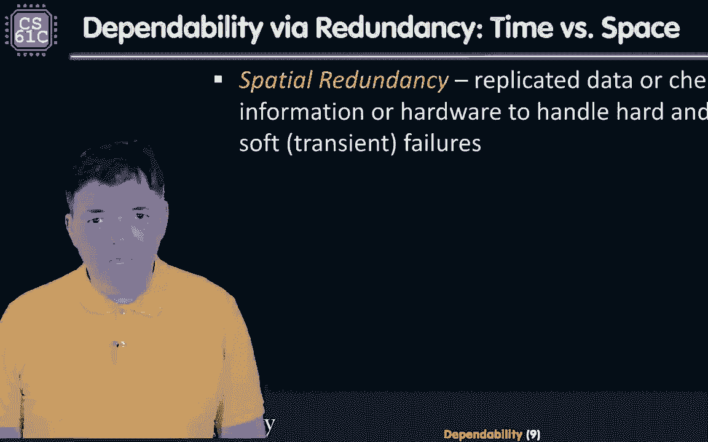
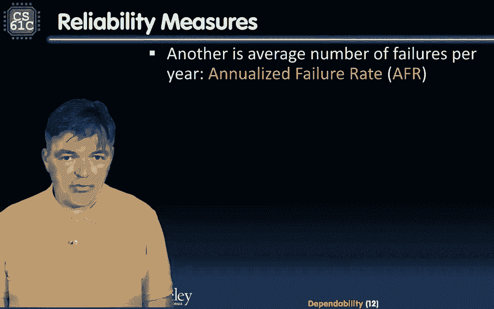
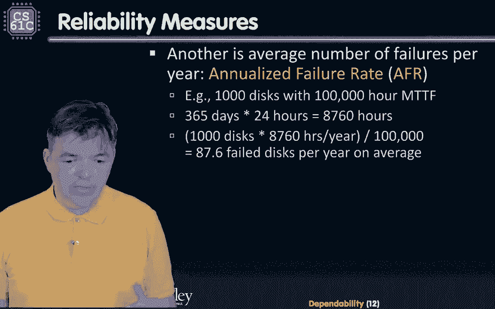
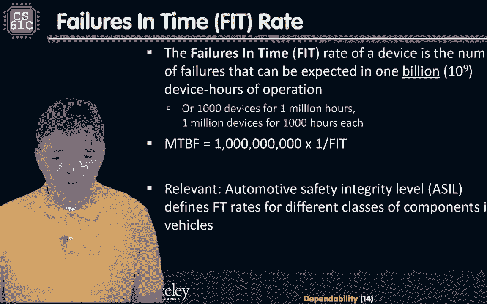
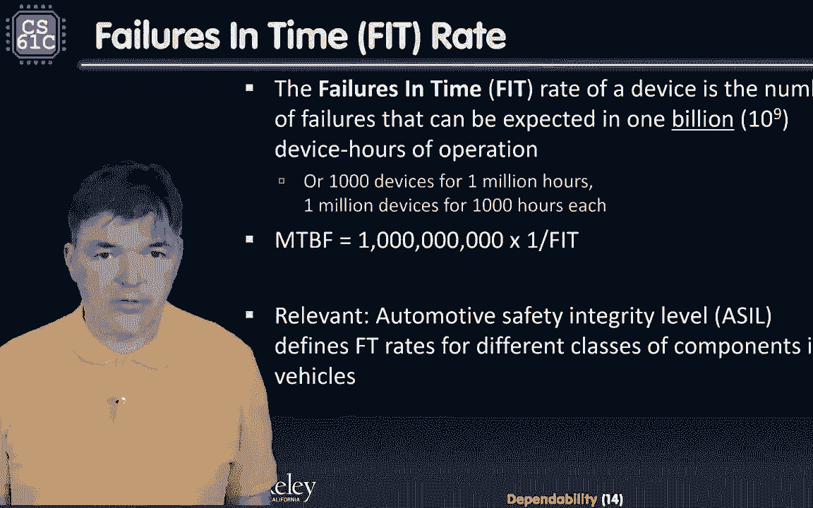
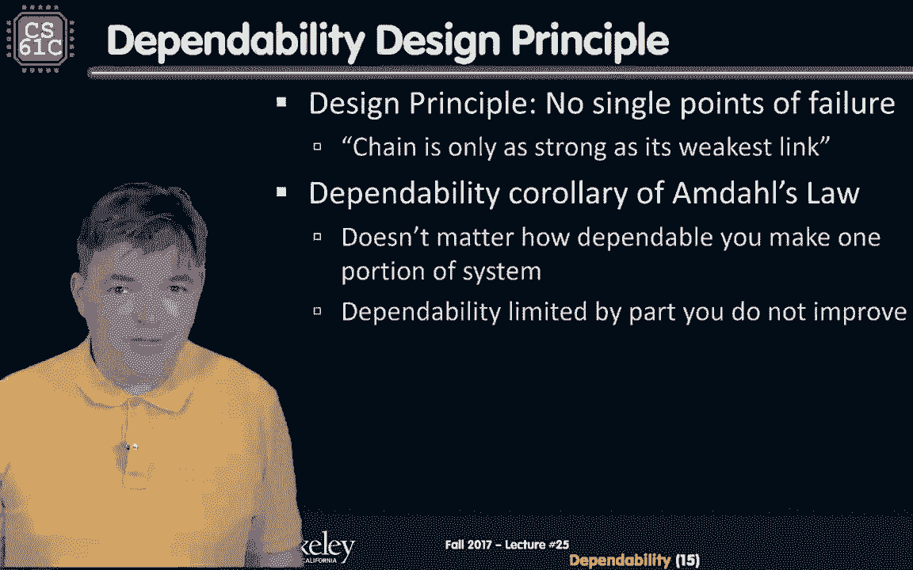
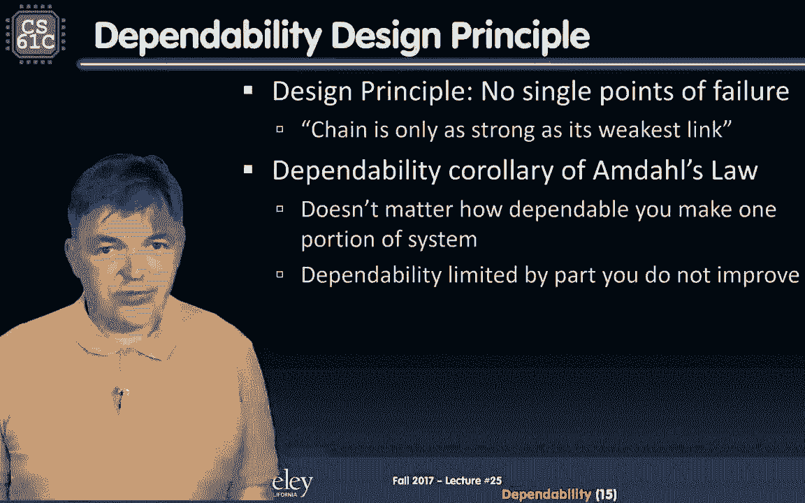
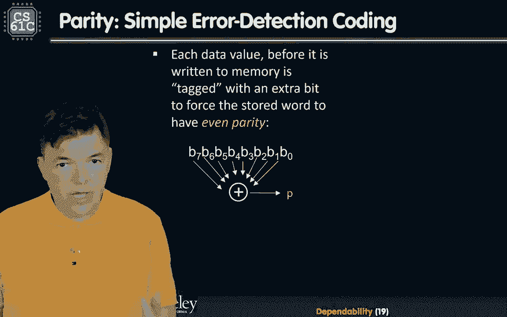
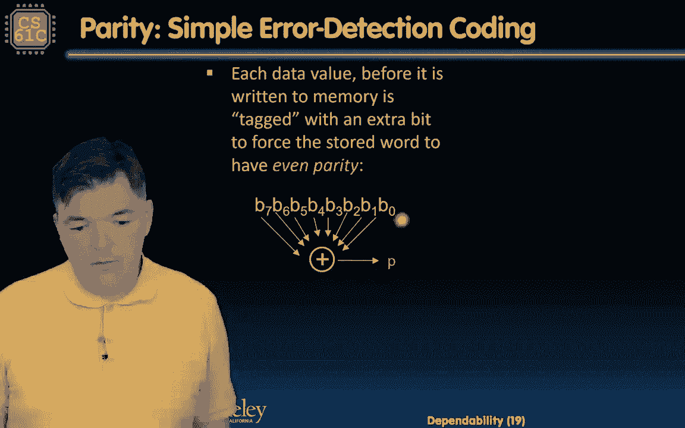
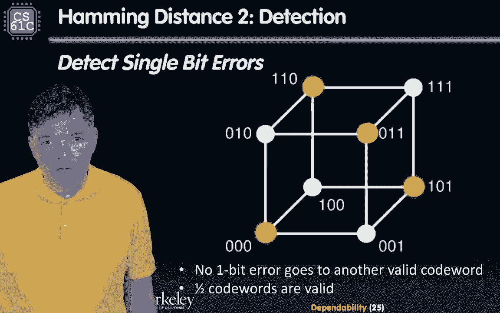

# P48：Lecture 37： Dependability,Parity,ECC,RAID - 这样好__ - BV1s7421T7XR

你好，欢迎回到61 C，这是一个全新的可靠性模块。

这是一个相当短的模块。

我们要触及它，还记得我们早期关于计算机体系结构中六个伟大想法的故事吗，所以说，我们已经讨论了使我们能够构建这些复杂系统的抽象层，在许多许多组件中，我们通过分层许多层的抽象来做到这一点。

我们已经谈到了Morslaw，它使我们能够集成如此多的设备，建造这些复杂的系统，2。我们已经讨论过……的原则，位置和内存层次结构，使我们能够建立这些看起来无限快的存储系统，无限大。

我们已经讨论过并行性作为提高性能的一种方法，在整个课程中，我们也谈到了性能度量和改进的概念，主要通过计算和平均内存访问时间的铁律，但是我们还没有讨论第六个好主意，即通过冗余实现的可靠性。

这就是我们现在要讨论的，为什么这很重要，嗯，我们在日常生活中越来越依赖我们的计算机系统，在纯粹不是很好计算的领域，我们所有的金融交易都是由计算机进行的，我们驾驶着一系列的电脑，是由某种计算机支持的。

我们真的需要关心可靠性，但事实是电脑出了故障，他们可能会暂时失败，我们以前见过，恐怕这些蓝色的屏幕，以及许多其他计算机故障模式，通常在计算机崩溃后，嗯，它可以回来，我们称之为瞬态故障模式。

失败可能是因为代码不好而发生的，嗯，你认识一个人，你知道我们，忘记清理退出功能的不仅仅是学生。

生产软件做到了这一点，有时也是，他们有。

你知道的，说着，你知道的，新版本，而且效果更好，但这些事情发生了，但有时这些失败，发生运输故障，因为硬件上有些东西不太对劲。

硬件出错。

如果这些错误持续存在，在计算机中确实有一些东西永久地失败了。

然后我们经常抛弃它们。

或者我们试图修复它们，如果它们是可以修复的。

这个模组。

我们要花点时间谈谈，我们如何减轻这些硬件故障。

所以我们在介绍模块的早期已经简单地谈到了这一点，当我们，替换系统的故障部分，这种冗余在存储系统中经常遇到，我们在记忆中有多余的东西，但是我们在并行计算机中，我们可能有备用处理器核心。

你会发现在市场上你现在可以买到，八核GPU还是七核GPU，当你看着芯片，它们完全一样，只是八核被禁用了，他们会把芯片卖给你便宜一点，为什么它被禁用是因为它不好，它失败了，不过没关系，你只是少了一点表演。

你有七个而不是八个，你要为此付更少的钱，所以它的工作方式是，你有多个复制品，会有某种投票机制，三分之二的人，也许会同意一加一等于二，我们就当这是答案，这是集成晶体管集成点的进步使这变得容易得多。

所以我们可以有更多这样的组件，现在还有一个陷阱，因为组件比三个更小，他们有一种倾向，你知道更频繁地失败，这并没有增加，故障率没有随着速度的增加而增加，我们可以在哪里整合更多的它们，所以我们可以增加冗余。

另一边，嗯，我们如何改进事情，我们如何减轻这些短暂的故障是，暂时，你知道的，东西可以暂时熄灭，我们仍然可以，在没有它们的情况下继续计算，例如，你知道，数据中心可能会走出去，我是说，可能会有飓风。

可能停电了，互联网可能坏了，数据中心走出去，天气系统消失了，数据中心已备份，我们遇到的另一件事是我们经常使用这些磁盘数组，如果磁盘，如果机械磁盘出现故障，没关系的，因为有办法掩盖那张磁盘。

在架子上有冗余，所以一架子光盘会有备用的，最后，我们可以使用一种特定类型的编码来，我们DRAM的冗余，所以我们的内存芯片，这是一种用于计算机的昏暗设备，如果你仔细看，它有九个存储芯片。

对应于九位而不是八位，原因是第n个是为了表示均等，这种纯度将被用来指示是否出了问题，我们现在要快速休息一下，然后我们来看看如何衡量可靠性，稍事休息后再见。

大家好，欢迎回到我们的可靠性模块。

模块的主题是，我们希望使用冗余来提高可靠性。

但请记住，在每一个计算机系统中，我们需要衡量一些东西，以知道我们是否改进了它，以及改进了多少，那么让我们来看看我们的可靠性度量标准是什么。

所以让我们首先了解计算机系统是如何运行的。

所以它在正常运行中，它为我们提供一些服务。

嗯，但它可能会失败，所以故障。

这和页面很不一样。

故障是计算机系统中组件的故障，或可能不会导致系统故障，取决于它是否被使用，以及是否多余。

还有其他东西可以接管，例如。

所以这个系统将在两个州之间运行，在一种状态下，它运行正常。

所以服务是在另一个状态下完成的，有一个服务中断，从正常操作转移到服务中断是失败的。

从系统中断中返回，这是一个偏离指定的服务回到正常的操作是恢复。

重要的是。

这种情况发生的频率有多高，当我们谈论裁员时，我们需要多长时间才能回来。

我们将看到冗余在时间和空间中的使用。

当你谈到空间冗余时，这意味着我们有一些东西的多个副本。

我们可能有多个计算单元的副本。

或者更常见的情况是，我们将有多个数据副本，数据的多个副本可能存在于DRAM或磁盘中。

在印度更常见的是，我们会有某种代数方法。

添加冗余位，这样我们就可以从硬盘中的临时错误中恢复。

我们经常保留冗余设备。

帮助我们从任何失败中恢复过来。

另一种形式的冗余本质上是时间冗余中的时间冗余。

嗯，这意味着如果有一个失败。

如果计算机系统出现暂时故障。

我们有时间重复计算，我们不妨那样做。

所以如果我们检测到计算失败了。

或服务未完成，我们再来一次。

如果我们完成了，我们会平安无事地恢复。

嗯，我们都很好。

所以这是一个时间冗余的例子。

让我们来看看这些可靠性措施。

嗯，你怎么知道，我们用什么样的标尺来衡量可靠性。

所以第一个也是最常用的是平均失败时间。

它基本上测量了我们需要多长时间。

拿着，把我们当成一个设备故障，或者在同一设备的两个故障之间，如果它们是可恢复的。

另一个指标是服务中断。

服务中断本质上是我们在中断状态下停留多久。

嗯，这是修复的平均时间，同时，故障之间是平均故障时间和平均修复时间之和。

然后我们可以定义一些非常重要的东西。

系统的可用性。

系统的可用性只是平均故障时间。

除以平均故障时间和平均修复时间之和。

我们怎么能。

如何提高系统的可用性，或者我们可以增加分子或者减少分母。

增加平均失败时间是什么意思。

所以组件会停留更长的时间，通常我们会用，我们通常会有某种冗余，除此之外，我们将添加某种容错性，这样如果一个组件出现故障，我们的系统不会崩溃，减少分母的另一个方法是减少地铁的同时进行维修，基本上。

它是关于改进已经检测到的工具，系统中有些东西不太正常，并使其回到正常的模型操作，所以这是关于可靠性的度量，接下来要定义的是这些可用性度量或可用性度量。

嗯可用性，正如我们已经定义的，它是平均时间与失败的比率，除以平均故障时间和平均修复时间之和，但它通常表示为时间的百分比，两者都意味着失败的时间或之间的时间，失败现在是用我们的来衡量的。

计算机系统，现代计算机系统很少出现故障，你知道的，至少这是我们习惯的很少崩溃的系统。

通常假设它会上升很大比例的时间。

在很大一部分时间里，意思是九十九点九九。

有百分之几的时间，9的数目，嗯通常是衡量每年9个可用性的数量。

那是什么意思，所以如果有什么东西90%的时间是可用的，嗯一年后。

那意味着你会倒下，呃，修理三个，六天。

如果百分之九十九的时间是可用的，这意味着它将下降三分，六天，我们每年有三六天的修理时间。

那很烦人，我是说很少有人会容忍这样的事情。

虽然在其他一些系统中，你知道交通可能没问题，你知道的，这是每天运营的公共汽车每年在商店里花费的天数，嗯，3个9表示系统将停摆，呃，每年修理526分钟，真讨厌，但越来越接近被接受，四九和五。

每年3分钟维修，而5个9是每年5分钟的修理时间，嗯，这越来越接近我们的预期，这是我们在这些服务中经常遇到的事情，我们实际上在互联网上使用，我是说，这是命令，4到5个9是YouTube的可用性，嗯嗯。

正如你在看这些视频时注意到的那样，YouTube有时会宕机，其他系统设计有六七个九，你知道的，我们更依赖的东西，这个系统崩溃的代价要高得多，嗯，例子有，你知道的，几年前，当YouTube关闭几个小时时。

YouTube的损失，这基本上是每分钟数百万的损失，好啦，这就是可用性度量。

让我们来谈谈三个能力衡量标准。

我们喜欢以不同的方式衡量。

这种可靠性是。

在一个有许多组件的系统中，我们每年有多少次故障，例如，假设我们操作一个有一千个磁盘的数据中心，每个圆盘的特征是有一千个，十万，嗯我们失败的平均时间，所以让我们看看，这意味着每年有多少磁盘会出现故障。

在这种系统中，那么我们如何转化为MTF的一个可靠性度量。

到另一个可靠性度量，年化故障率，这对数据中心来说非常重要，数据中心实际上会跟踪这一点。

所以我们一年有八千七百六十个小时。

然后我们有一千个磁盘全年都在运行。

我们的平均失败时间表现在我们的。

所以我们要把这个数字除以10万小时。

我们最终得到的是每年87。6个失败盘，平均，你知道的，所以我们必须把它四舍五入，因为一般失败的不是第六点磁盘。

所以有88个失败的磁盘。

嗯，这相当于年化失败率为8。8%。

嗯好吧，那没那么疯狂，这个数字实际上接近我们在实践中看到的，谷歌在2007年发表了一项研究，发现实际的，一场个人驱动的闹剧从第一年的1。7%不等，随着年龄的增长，他们的比例将达到8。6%，超过3%。

你知道的，三岁开车，挺有意思的，有有趣的网站，在线备份服务之一，背板实际上公布了他们驱动器的故障率，然后可能是有用的信息，你可以看看，你想买一个新的驱动器，他们是，它们对现代崛起很有好处。

它们要么是个位数，要么低于个位数，你知道的，实际上是大约一百万小时的订单，在失败和另一个好消息之间的一百万小时，我之前提到过这个，这个驱动器实际上正在变得更好，随着时间的推移，他们的失败越来越少。

慢慢地，但肯定AFR在减少，这里有减少的趋势，还有一个，可靠性度量，嗯，用于不同类型的系统，但是计算机系统必须坚持这一点。

这是时间上的失败，也是第五率的失败，嗯已经用了。

例如，及时为汽车和故障。

嗯，或设备的配合率，是在十亿个设备中可以预期的故障数。

几个小时的手术听起来很多。

我是说，十亿小时听起来是不可想象的，但是想象一下，我们有许多这样的设备同时工作。

所以这意味着一千个设备在一百万小时内。

或者一百万台设备。

最终失败或十亿设备，这大约是我们每小时有多少智能手机出现故障。

听起来是对的，我是说，如果你看着整个世界。

我想手机的故障率可能比，你知道每小时有不止一部手机掉线。

所以嗯，mtbf等于10亿乘1的5次方率。

这是相关的，因为计算机越来越多地进入我们的汽车。

所有这些关于你能力的规格都用适合率表示。

所以你会看到的。

尤其是做那种生意。

嗯，你会听到这个汽车安全完整性级别，定义了车辆中不同类别部件的不同配合率。

好啦，所以可靠性的设计原则如下。

所以当我们设计一个系统时，我们应该依赖于。

不能出现单点故障。

与之类比的是，通常来说，链条的强度取决于它最薄弱的环节。

有一个漂亮的。

这里所有amdahl定律的一个推论。

它总是帐篷里最长的杆子，会很突出的。

所以不管你知道，您可以不断提高一个组件的可靠性。

但最不可靠的人将占据主导地位。

嗯，所以我们通常要测量整个系统。

确保最不可靠的组件或最不可靠的组件足够可靠，好啦，所以我们要在这里快速休息一下。

然后我们要看看。

我们如何实际检测这些故障或故障，休息后见。

大家好，欢迎回到我们的可靠性模块，所以我们定义了度量可靠性的度量标准。

在此过程中，我们还定义了如何测量可靠性和可用性。

所以在尝试添加冗余之前，让我们首先弄清楚如何检测是否有错误，或者系统中的某种故障，我们需要对此做出反应。

所以让我们开始吧。

计算机系统中的错误可能发生在任何地方。

我是说我们可能会在真实的你身上犯错，我们的寄存器文件中可能有错误。

但很有可能是在记忆系统的某个地方，尤其是在公羊身上。

所以我们现在要做的是增加一点冗余。

一些多余的比特将使我们能够检测到。

记忆中的某个特定单词发生了错误。

所以我们要通过引入所谓的错误检测来做到这一点。

稍后更正代码。

所以你知道，为什么我们看到，为什么，为什么我们最有可能在内存中看到错误。

原因是我们有这么多的记忆细胞。

它们很小，所以当我们看DRAM定理时，本质上是在。

本质上，每一个比特都是一个微小的电容器储存一点点电荷。

如果储存在暗室中的电荷受到干扰。

我们可能认为我们在单元格中写入了一个零，但我们会读一个。

为什么会这样，它可能是由于电源中的扰动而发生的。

或者可能发生，因为一个粒子，呃。

以宇宙射线的形式，宇宙粒子的特定位置。

翻转钻头，基本上给电容器充足够的电。

为了改变对应于零的值。

对应于1的东西，这是一种特殊类型的错误，称为软错误。

真的没什么不对，身体上的记忆。

只是数据在里面的时候发生了错误。

所以当我们执行事情的时候，他们会工作得很好的。

与那些相反，有严重的错误。

位单元或内存中的一个字或整个芯片都可能失效。

这些就是所谓的硬失败或硬错误，嗯。

在那里，我们需要使用一种不同的冗余来修复它，我们可以修复里面的存储芯片。

那不在本课程的范围之内。

但你知道我们可以，嗯，更换有故障的芯片或有故障的芯片。

计算机系统中的这个驱动器，我们稍后会更多地讨论这个问题。

嗯，我们防止软错误的方法是使用所谓的错误检测。

和纠错码或简称edcs和ecccs，我们不能通过屏蔽我们的计算机系统来防御，不知何故，我的意思是，这些宇宙粒子中的一些可以穿过地球，所以你知道，我们通过其他方式保护我们的系统的可能性很低。

所以他们会打我们，不管我是什么意思，他们在打我们，他们在打我，就在我说话的时候，嗯，有可能他们会翻转一点，所以这里的想法是在我们的存储系统中添加一点冗余，告诉我们粒子撞击或供给扰动是否改变了某些比特。

所以这些多余的部分，与只是复制整个单词相反，呈现了很多，减去间接费用，更少的冗余保护，你知道的，把我们的，它的工作方式也是我们，在存储它们之前，先把我们的常规计算结果，我们操纵它们进入某种代码空间。

代码空间有冗余，所以如果错误指控将这个有效代码变成无效代码，我们可以检测到这一点，因为该代码字不存在于我们的代码集中，我说了很多关于，你知道的，很多关于假设的东西，让我们进入更实际的事情。

但在我们进入真正的实际例子之前，让我们首先介绍一些经常用于理解这些代码的重要内容，也就是所谓的汉明距离，它是以理查德·汉明的名字命名的，在贝尔实验室工作了很长时间的计算机先驱之一，后来转到学术界。

他在校正和探测方面做出了一些开创性的贡献。

他确实赢得了巡回演出奖。

汉明距离本质上是两个二进制数之间的位数差。

但当一点一点地看，你知道吗，这里有一个例子，我们打电话吧，假设我们有一个词p，另一个单词是Q，我们想知道它们在比特方面有多大的不同，所以p是0，1，0，1，q是0。

零一一一。

我们一点一点地比较，嗯，找出其中有多少是不同的，所以在最重要的一点上，它们都有零，下一个有效位是不同的，是1对0，所以到目前为止我们有一个距离，下一个比特是1。

我们只是嗯，你知道那是一样的，所以我们不必跟踪，单词p中的第四个有效位是零。

Q这个词是一个，所以汉明距离是2。

两个最低有效位都是，所以我们不增加这个汉明距离计数器。

所以单词p和q之间的距离是。

让我们再举一个例子，如果p和我们之前得到的一样。

零一零一和q有点不一样，一一零一。

P和Q井的区别是什么，让我们把它们和最重要的位位置进行比较。

我们有不同的距离，所以一个然后一样。

这个不同的一个对第三个位位置的零。

这个是一样的，第五位位置不一样，所以我们有三个。

最后一点是一样的，所以p和q之间的距离是3。

所以说，让我们看看当我们处理二进制数时，如何利用这一点，我们的计算结果只是二进制字，他们之间的汉明距离是一右，我们使用二进制表示，没有太多的冗余。

呃，因为我们想有效地使用我们的计算机硬件。

我们在这里要做的是不完全利用我们所有的存储，存储不同的二进制数，我们希望存储彼此有足够差异的码字，所以他们说有两个汉明距离，那么如果单词的汉明距离为2会发生什么呢，如果有一个比特错误。

我们从一个与我们的代码空间相对应的法律代码词开始，一个粒子一点点地撞击，一点点地翻转，所以这个新词，因为它与有效码字有一个距离，是无效的暗语，我们可以检测到我们有一个错误，让我们看一个实际的例子。

这很复杂，但是第一个实际的例子是一些非常常用的东西。

而且很简单，它在添加奇偶校验位，所以在我们的计算中，我们得到了一个二进制单词。

对于二进制单词的值。

在写入内存之前，我们添加一个奇偶校验位，所以我们以额外的位的形式添加了一个小标记。

这迫使存储在内存中的单词具有均匀的奇偶校验性。

嗯所以如果我们在工作，例如，在本例中有八个位的单词。

同样的事情也适用于三个两个位的单词。

我们怎样才能知道这个世界上有多少。

嗯，我们只要通过一个8输入的异或门。

异或门将产生我们的奇偶校验位，我们所做的，然后我们把这九个位，8位是我们的数据值和一个奇偶校验位。

把它们都储存在一起，在记忆中。

我们需要有更广泛的记忆，这就是为什么。

在一些昏暗的地方，我们有九个筹码。

其中一个来源，纯洁，好啦，当我们读到。

我们想检查一下我们的数据是否正确。

因此，我们将读取所有9位，并试图找出奇偶校验是否为偶数。

呃，我们怎样才能做好呢？

我们将再次通过一个门，这次和或门有八个输入。

我们将在输出端进行检查，支票，如果值为零。

然后在它的输入处有偶数个1。

所以这个词是有效的，如果是一个。

我们有一个错误，那么我们该怎么处理这个错误呢，嗯，这是画一个例外并让操作系统处理它的完美理由，有一件事你可以说服自己，我们稍后再讨论这个问题，因为我们储存的是，嗯，这里的冗余数字，我们可以说服自己。

在奇偶校验码的最小汉明距离内，我们必须有两个位的误差，为了从一个有效的代码字翻转到另一个有效的代码字，所以我们通过检查奇偶校验位来检测这个码字是无效的，现在我们检查错误的能力有限，对呀。

我们只能检查是否有一个位的错误，或者实际上有3位或5位的误差如果有奇数位的误差，如果我们有，如果我们同时翻转两个比特，我们不会发现的，但总的来说，只要一个奇偶校验位就足够了，因为你知道。

存储系统通常是这样设计的当被粒子撞击时，通常只有一个比特会翻转，下面是一个简单的例子，说明我们如何添加奇偶校验位。

所以我们从一个数据字开始，零一零一八位数据字，所以我们用X或门来检查这个词，我们发现我们已经有了偶数。

所以我们增加的奇偶校验位应该是零，所以我们加一个零，把这个9位的单词存储到内存中。

所以我们这里的等价是，即使你在这里有不同的数据工作。

零一零一零一，那个有五个一。

所以为了保持奇偶性。

即使我们要加一个1作为奇偶校验位，所以写在内存中的九位字。

现在会有偶数个。

当我们读到这个，让我们来看看我们存储在记忆中的第一个单词。

我们现在从记忆中读出它，如果我们用偶数个1来读它。

那么奇偶校验是均匀的。

所以没有错误，另一方面，如果有一点翻转，在这种情况下，在最有效的内存位位置中有一个位翻转。

我们数一数二。

三个，四五，因此，我们有一个x的奇偶校验输出。

或者是一个，有四个，有一个错误，在那一点上我们该怎么办。

我们。

你可能会问自己另一个快速的问题。

那么如果周边有错误会发生什么。

我们原词中的这八位都是正确的，最后一点是我们的奇偶校验位从零变成了一井。

我们仍然会检测到一个错误。

我们不知道错误在哪里，嗯，所以一次，在某种意义上，奇偶校验位受到保护。

但另一方面，你知道不会有任何差错，如果你没有一个对等的。

所以我们只能忍受，我们将讨论纠错。

稍作休息后，到时见。

大家好，欢迎回到我们的可靠性模块。

我们刚刚看到了如何引入奇偶校验位来检测。

本质上我们所做的，我们把汉明距离从一个增加到两个。

因此，我们可能的单词中有一半存储在记忆中。

嗯，是无效的。

所以如果我们读到一个无效的词，我们知道至少有一点错误。

我们不知道哪个是写进记忆中的正确单词。

因为2的距离不足以帮助我们进行校正。

简单地说，有多个单词离正确的单词只有一点远。

所以想出办法。

如何添加更多的冗余以执行纠错。

所以他提出了纠错码的概念，你需要的最小距离。

那是三的汉明距离，所以有一类代码基本上只做一次纠错。

双重错误检测，或者也被称为段代码汉明码是他实际上。

有趣的是他，发现他在所有的汽车上使用机械读卡器，在看他的穿孔卡片时经常出错，所以他把输入编码，这样他就不必处理连续的重读。

从概念上讲，这里是它的工作原理，假设我们有n位要编码。

因此有两个到n个可能的位模式，例如，假设我们有八个比特，因此可能会有256位的模式，所以你知道我们可以代表，你知道在这个空间里有256个可能的点，我们从这些单词中选择一个子集作为有价值的码字。

任何其他单词都是有错误的单词。

所以我们必须想出一些方法来检查文字的合法性。

然后我们会通过选择最近的法律代码词来执行纠错。

那个非法的暗语，嗯，你知道的。

我们在那里数，更短的错误模式更有可能，更长的误码模式，所以我们想回到最近的。

嗯，合法码字或有效码字。

所以如果我们有256个可能的暗语，我们从他们中挑八个。

嗯，一般来说，这是一个非常稀疏的模式。

如果有一点错误，我们基本上会回到最近的地方。

那个无效的暗语，这很可能是我们一开始写的词。

让我们看一个更有说明性的例子，在一个简单得多的案子上。

这是一个简单的案例，有8个暗语对应3位，它们被表示在一个立方体上，为了表明在那里你知道哪些实际上是相邻的，有一个汉明距离，而那些不相邻的。

会有一个大于1的距离。

所以如果你看看这些，嗯。

边缘，椅子和边缘，他们有汉明距离所以一个，如果他们有联系，他们有一个汉明距离，所以例如，零，零，零，和零，零一相距一点。

所以如果你想设计一个汉明距离为2的代码。

这使得我们可以检测到一点点错误，我们必须在这里选择一半可能的暗语。

所以我们会选择那些均等的，所以零，零，零一一。

零一，零一和零一。

请注意，我们基本上避免选择任何最近的邻居。

这是我们的奇偶校验码，所以这些暗语是无效的，但他们离最近的邻居只有一点距离，所以如果你看看这个暗语，零一零，我们不知道我们是否读到，我们不知道是哪一个，嗯，我们到底把哪个词。

是0 0 0 1还是1 1 0，三个人都有可能，所以为了做到这一点，我们需要一点时间来进行修正。

我们必须有更多的稀疏，或者在我们的代码中有更多的冗余。

所以我们需要少选一些词，所以如果我们把字数减少到四分之一。

我们可以选择在这个立方体相对边缘的两个。

所以这将是一个零零零和一一一。

所以我们有两个多余的位。

你知道的，我们只使用了八种可能模式中的两种。

就像我们在三个比特中使用两个多余的比特。

但现在如果有错误，如果我们读到这些片段中的任何一个，我们知道我们写到记忆中的最有可能的模式是什么，嗯，这些比特模式，零一零一零一，很可能是由零这个词引起的，因为他们有一个汉明距离，同样。

其他三个更接近于一个一个，因此，我们将通过执行纠错，我们会回到一对一，我们要看一个例子，我们怎么做，稍作休息后，再见啦，然后呢。

大家好，欢迎回到我们的可靠性模块，所以我们已经看到确实存在代码，不仅可以检测错误，但也能纠正。

但是我们展示的例子并不是一个非常实际的例子，因为它有很多开销。

为了编码有价值的一点信息，我们用了三个比特，所以我们有两百的开销，这里的诀窍和科学是如何设计这些代码，这样我们就可以用最小的开销获得所需的覆盖范围，这里所需的覆盖率就像单个错误检测。

一种具有双重错误检测的奇异纠错方法。

所以汉明也想出了这些密码，事情是这样的，我们将从我们计算的结果的数据位开始，我们将奇偶校验位与这些数据位交织在一起，形成我们要存储在内存中的暗语，在这种情况下，有一个特定的算法--如何将它们放在一起。

下面是在这个表上的交错是如何工作的，这里我们有将要存储在内存中的码字的位位置，一个，两个，三个，四，五个以此类推，在它下面编码的数据位位于特定的位置，一号在三号位置，D5已经就位，德二号在五号位置。

D3位于6号位置以此类推，这些其他位位置被奇偶校验位占据，P one，P二，P四，第八页，第16页，这是以一种特殊的方式完成的，使得奇偶校验位本质上总是对应于2的幂的位位置。

所以这些是二进制中对应于1-1-0的位位置，一个，零零，相对容易记住，但是在这个表格的底部，哪个数据位被哪个奇偶校验位覆盖，所以第一个奇偶校验位，Pone覆盖LSB等于1的所有职位。

所以所有奇数位都被第一个奇偶校验位覆盖，嗯，所以如果我们把P 1包括在那个位置，它也会覆盖自己，产生嗯，甚至奇偶性，所以基本上其他每一位都包括在第一个奇偶校验中，包括什么意思。

这些基本上是x或门中产生p 1的输入，最低有效位旁边的位等于1，所以这些基本上是对应于，你知道1，3，4等等，然后三个盖住四个的绳子以此类推，而且这种情况可以无限期地持续下去，但在实践中。

我们通常这样做一个街区，所以如果你有一个八位宽的数据字，我们将添加四个奇偶校验位来编码它，让我们来看看我们实际上是如何做到这一点的例子。

所以我们要生成这些奇偶校验位，为每个组创建均匀的奇偶校验。

假设我们想对一个字节的数据进行编码。

这个世界上有八位。

所以我们要创建一个编码词，通过把数据位放在它们应该在的地方。

然后我们把这些空间留给我们计算的奇偶校验位。

所以这些奇偶校验位应该放在它们合适的位位置。

所以先把第一部分，奇偶校验位进入位，位置一。

所以让我们来计算并通过这个例子，所以位置1将检查1-3位。

五个，七，九和十一。

所以我们要用黄色标记这些比特数一下有多少个。

一二，三四，因此，为了使均等。

奇偶校验位应该等于零。

位置二，它将检查2位对，三个。

有多少个。

有三个，因此为了使其均等，我们应该让这个问号等于1。

然后我们看一下四号位的检查，标记适当的位。

我们在黄色的碎片中只有一个。

因此，这也应该等于一，最后是八号位的检查，我们有参与文本的比特的最后一个，或者其中有两个，因此，这个问号应该等于零，好啦。

所以这是我们最后的代码，它由数据字和奇偶校验组成。

但让你知道。

不要看正确答案，让我们假设我们收到了一些东西，并想解码。

如果这个词正确，如果它不正确，我们喜欢纠正它，所以假设我们收到这个。

我们将把它映射到适当的位位置，我们会发现一点零。

前两位中的一位是奇偶校验位，这边还有一个，有一个奇偶校验位p 4，最后是一个奇偶校验位p 8，位8。

剩下的是数据位，让我们看看，如果这个词是正确的。

所以我们收到了这个，我们会很好地运行奇偶校验。

对于第一次奇偶校验，我们会找出你所知道的，奇偶校验位和该校验中对应的数据位。

数字是偶数，所以很好，它通过了第二个有这个。

P二，奇偶校验有一二三四五一。

所以不好，这是不正确的。

那个确实有错误。

然后我们要检查钻头，P四。

那张支票里有两张，所以这将是正确的，支票会没事的。

最后是p 8位错误。

因为它有三个1，然后有一个非常简单的方法，我们如何计算哪个位位置是误差。

你就可以算出代数，很简单，它非常优雅。

嗯它，这意味着位位置等于两个奇偶校验位之和。

第二和第八页，所以误差将在位位置10。

我们该怎么做才能解决这个问题，我们只要把不正确的部分翻过来。

把它变成零。

然后我们解码这个以确保它是正确的。

奇迹般地，所有的支票都满意了，我们已经很好地解码了正确的单词。

现在呢，如果我们必须处理具有，可能有不止一位的错误，所以如果你看看高端微处理器，他们通常使用代码，单次纠错，双重错误检测，但一些服务器处理器正在处理更有价值的工作，负载将有两个保护，以执行两位的校正。

所以有一种不同类型的汉明码叫做双重错误检测，三重错误检测，嗯还是口述，我们不打算深入讨论，嗯，你也知道，有很多关于这一点的参考资料，但通常当我们使用比微处理器更嘈杂的东西时。

比如通过WiFi发送数据或网络传输，以此类推，我们会看到更多的错误，这些错误通常是突发的，我们将看到如何增加冗余的不同方式，一般有，我们将要在那里遇到的事情，像循环误差，更正，像交错这样的事情。

打破这些模式，并用能够覆盖更少错误的代码攻击它们，但那是一种方式，超过本课程的内容，就是这样，这就是我们在这里要讨论的关于软错误的校正，这是我们在记忆中通常要做的事情，稍作休息后。

我们将看到对冗余的不同看法。

大家好，欢迎回到我们的模块可靠性，到目前为止，我们已经看到了如何添加位级冗余来避免软错误，某些瞬态效应引起的误差，像宇宙射线或环境中的扰动。

现在的问题是，当硬件出现永久故障时，我们该怎么办。

这个机制可能保护不了我们，并使用某种纠错来保护瞬态错误，有很高的开销，我们一般使用备件，嗯，在我们的硬件中，可以取代失败的部分，这种情况也发生在存储芯片中，但它深入到存储芯片的实际设计中。

所以对这门课来说是不够的。

但是有一个很好的例子，在这种驱动器的一种形式中。

所以这个驱动，传统上硬盘是机械设备。

他们确实倾向于失败，我们已经看到这些驱动器每年有一两个百分点的故障率。

呃，如今。

呃，这些驱动器上可能存储着有价值的数据。

一般情况下都有备份，但是把备份带回来的成本相当高。

嗯从到恢复驱动器故障后的操作。

所以一般来说，伯克利有个好主意。

作者：兰迪·卡茨和戴夫·帕特森。

在尝试提供冗余以帮助故障磁盘时。

这叫突袭，它代表廉价磁盘的冗余数组。

这个不贵。

在里面很合适，它适用于任何办公桌。

不管贵不贵。

这个想法实际上是作为一种替代方案部署的，而不是非常昂贵的。

高可靠性磁盘，可以用一系列相对便宜的磁盘替换。

现成光盘。

所以我们的数据就不会只存储在一个磁盘上，它将存储在多个磁盘上。

然后嗯，其中一件事。

所以说，存储阵列中通常使用的概念之一，文件是跨多个磁盘条带化的。

这是什么意思如果你有一个大文件。

而不是把所有东西都写到一个磁盘上，我们要把它分成几块。

并将其写入跨多个磁盘的条带，记住磁盘很慢。

所以如果我们能把文件并行地写入多个磁盘。

我们可以加快行动，所以这里的冗余可以用来加快磁盘操作。

但它也是为了防止，嗯，服务的减慢中断。

如果有失败。

所以它提高了我们的可用性，所以这还是会失败。

用户文件的内容仍将被重建，从数组中的剩余磁盘，当然有开销，我们没有使用所有的磁盘来存储不同用户的数据，我们正在使用一些磁盘作为冗余的来源，所以这就像，看看几种传统的方法如何看待这个多余的等级概念。

使用了一系列廉价的磁盘，有不同级别的速率零不提供任何冗余，不打算不打算谈论这个，它在那里只是为了加快速度，读一个是冗余的第一种形式，这个数组，所以本质上我们有两组磁盘，有多少就有多少，主磁盘。

就是这么多，嗯，我们有备份，这些被称为恢复组，基本上每一个磁盘，在最简单的情况下，我们这里只有一张磁盘，另一组中的一个将把数据从一个磁盘镜像到另一个磁盘，我们只有两份数据副本，这提供了冗余。

这里没有真正的速度权衡或利弊，我的意思是当这些不相等时就会发生一些轻微的权衡，当他们中的一个或一些比其他人慢的时候，或者他们可能在限制速度，但我们现在真的不需要深入讨论这个问题，这里的重点是。

我们需要的每一张磁盘都有100%的开销，我们提供一个额外的磁盘作为备份，但我们已经看到，我们真的不需要在，在DRAM纠错码中，那么，我们是否可以使用相同或相似的概念来在磁盘中提供冗余，所以我们当然有。

呃，这就是三的概念，我们在其中加上奇偶校验。

所以事情是这样的，我们可以有几个磁盘。

然后我们将在其中添加一个奇偶校验磁盘。

我们的数据将存储在这些磁盘中，你现在可以想象一下。

如你所知，单位数据，尽管这将在第三次突袭中以文字的形式被埋葬。

然后我们将在多个磁盘上对文件进行条带化。

所以我们要保存我们的数据，如果我们作为一个单独的位进行条带化。

更接近于突袭，但在射线3中我们可以想象这些是这些片段只是文字的代表。

然后我们将在一个单独的磁盘中提供奇偶校验，这里的差异度是用同样的方法计算的。

我们做得怎么样。

呃过去，如果我们有偶数。

世界上的比特，那么雪貂比特为零。

如果磁盘出现故障，然后奇偶校验将取代它，我们记得在拉姆，我们实际上不能那样做，我们的奇偶校验没有提供足够的信息来很好地知道错误来自哪里，这里实际上知道错误是从哪里来的，我们知道磁盘出了故障。

我们会得到一个额外的信息，即其中一个磁盘出现故障，我们知道哪个磁盘出了故障，所以这些奇偶校验位是用来恢复丢失的信息的，所以知道这个位为零，这个位是一，这个位是零，我们就知道丢失的位也是零。

所以那是射线3号突袭4号是它的变种，嗯。

它只是提供了更高的输入输出率。

所以这里是它的样子，这就是我们如何查看由五个磁盘组成的数组，所以有四个磁盘保存用户数据。

第五个圆盘保持奇偶校验，我们可以看到这些。

这些可能是增加逻辑磁盘地址，所以这些是不同的。

所以你可以把它看作是五个旋转的圆盘的内部。

较高的比率，I，O，那是什么意思呢？例如，你想做嗯，从磁盘零和这五个读取小文件，所以你知道，文件基本上可以放在一个磁盘里，所以我们基本上可以同时从零和五磁盘读取它们，同时，对于大磁盘，为了一个大的权利。

我们可以通过在所有的光盘上剥离来加快速度，它确实有一个，突袭4的挑战在于所有奇偶校验都驻留在一个磁盘上，所以如果你想写一堆小文件，那将是瓶颈，让我们快速看看，这是我们第五次突袭的灵感来源。

如果我们写两个小文件。

D0和D5，我们必须为每个。

现在的问题是我们如何生成奇偶校验。

嗯，为了生成奇偶校验，需要知道形成奇偶校验的所有其他数据。

所以我们需要阅读所有其他的，这个，所以也许你可以继续读它们。

然后重新填充奇偶校验。

或者相反，这通常是实际正在做的，在空中管制员那里。

嗯，奇偶校验盘有旧和，所以我们也许可以在你的阅读中重新计算奇偶性，用此数据更新并写回，这里是直线性代数，无论哪种情况，这里的瓶颈是八点五，所有的奇偶校验都被写到这个磁盘上。

所以我们可能需要读取奇偶校验数据，更新它，写回来，同时处理多个文件，所以一般来说，磁盘将是，突袭5的动机，Raid Five是提高吞吐量和保持奇偶校验的一种方法。

它的实现方式是通过简单地将奇偶校验分布在，在整个数组中交错奇偶校验，所以现在奇偶校验不仅仅是在我们的第五次驱动中，它将遍布所有部落，所以如果我们写到这里的D0和D5磁盘，会写在这两个独立的磁盘上。

我们可以同时做到这一点，因为它们的奇偶校验与3号和4号磁盘相关联，我们能做到的，我们也可以同时进行，简而言之，突袭，还有其他不同类型的突袭，通常使用更多的几个，一些额外的磁盘。

但我们不打算在这门课中讨论它们，总之，我们已经看到了冗余是如何提高我们的可靠性的，嗯，我们可以通过使用空间冗余来利用这一点，通过使用额外的硬件，以额外比特形式出现的额外硬件，额外支票，如果操作失败。

通过重复操作来冗余，我们第一次看到可用性和可用性的定义，我们已经看到了一个具体的例子，我们如何使用奇偶校验进行单个错误检测，然后我们看到了如何使用汉明密码，距离三到，加上一个比特，执行双重错误检测。

然后我们已经看到raarray是处理失败驱动器的方法，这是一个例子，额外的硬件如何，额外的光盘冗余提高了系统的可用性，如果磁盘驱动器出现故障，我们的系统不会崩溃，它的性能其实是，系统性能得到提高。

它不会因使用多个驱动器而降级，我们已经看到有不同的贸易水平，外面有更多的人，在实践中，无论如何，我们对它们是如何工作的有了合理的很好的了解，就是这样，这就是您想要涵盖的关于可靠性的所有内容。

这就结束了这个模块。