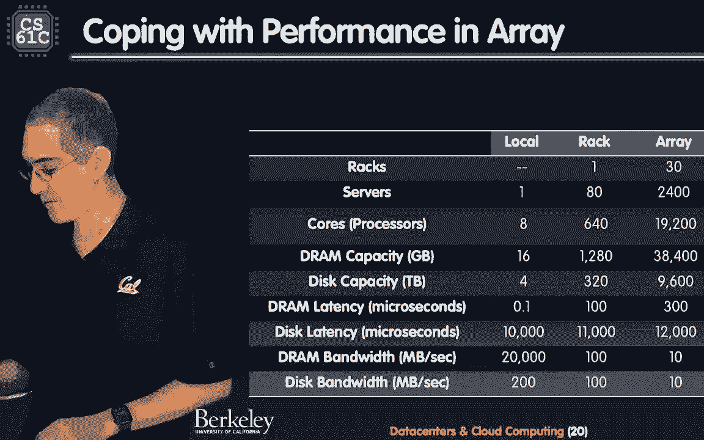
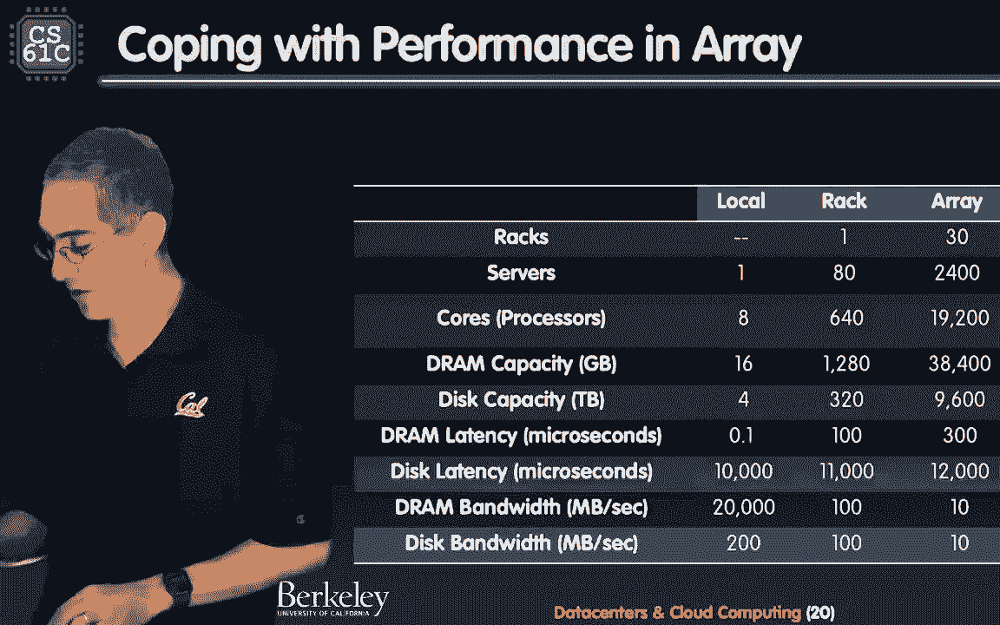
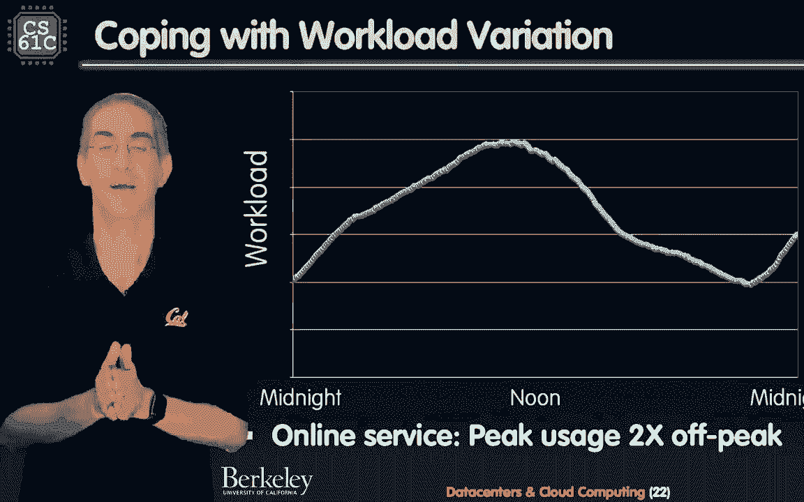
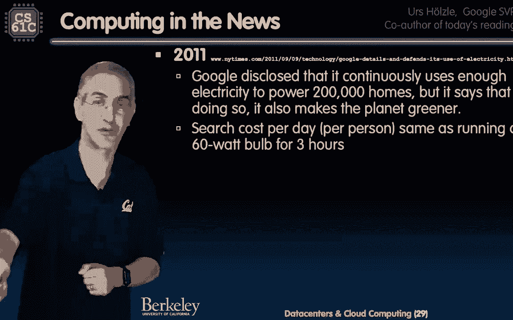

# 课程 P49：第38讲 数据中心与仓库级计算 🏢💻

## 概述
在本节课中，我们将学习数据中心和云计算的基本概念。我们将从计算机硬件的历史演变开始，探讨个人电脑时代如何过渡到后PC时代，并最终聚焦于支撑现代云服务的仓库级计算机。我们将了解其工作原理、设计考量、性能指标以及能效优化等核心主题。

---

## 计算机硬件时代简史 🕰️

上一节我们介绍了本课程的主题。本节中，我们来看看计算设备的发展历程。

计算机体系结构建立在一些核心思想之上，例如抽象层次和摩尔定律。摩尔定律在数十年间推动了计算机制造业的飞速发展。然而，大约在2005年，单线程性能的提升开始放缓，行业转向了多核架构。

我们探讨了从线程级并行到数据级并行的多个层次。像Spark和MapReduce这样的框架正是在云系统上高效运行数据级并行工作的典范。

在20世纪50-60年代，计算机是庞大且昂贵的机器，仅存在于大公司、研究实验室和大学。到了70年代，随着C语言和Unix系统的出现，计算机开始变得更小、更普及。

80年代中期到2000年代中期是个人电脑（PC）时代，计算机进入家庭和个人生活。编程语言如Java和操作系统如Windows、Mac OS成为主流。

---

## 后PC时代与智能设备 📱

上一节我们回顾了PC时代。本节中，我们进入后PC时代。

后PC时代以智能移动设备为特征，这些设备依赖无线网络和云计算服务。苹果、谷歌等公司制造了智能手机，我们使用C、Swift、Java等语言为其编程。

个人移动设备本身并不处理所有计算，它们依赖云端的数据中心提供数据和服务。例如，询问智能手表天气，其数据就来自云端的仓库级计算机。

编程模型也发生了变化，MapReduce和Ruby on Rails等框架被用于开发云应用。

---

## 仓库级计算机：架构与动机 🏗️

上一节我们提到了云端的数据中心。本节中，我们深入探讨仓库级计算机。

为什么云计算在近十年才蓬勃发展？早期，每家公司都有自己的IT部门和小型服务器机房。像谷歌、亚马逊这样的大型公司意识到，为了应对增长，他们需要远超传统机房的规模。

他们开始使用大量廉价的商用个人电脑来构建系统。虽然这些机器的故障率更高，但通过规模经济，其总体成本效益远高于维护一个中等规模的自建设施。此外，宽带互联网的普及和软硬件的标准化也促进了这一模式。

以下是租用云服务的一个例子：
*   **亚马逊AWS**：提供多种配置的虚拟机实例。例如，一个配置较低的实例每小时仅需几美分。
*   **存储服务**：提供弹性块存储，价格低至每GB每月几美分。

构建一个仓库级计算机意味着管理十万到百万台服务器。设计时需重点考虑成本效益、散热和电力供应。

---

## 仓库级计算机的设计与组件 🔧

上一节我们了解了建造仓库级计算机的动机。本节中，我们看看它的具体设计和内部组件。

仓库级计算机强调硬件的同质性和高可用性（例如“五个9”的可用性，即每年停机时间少于一小时）。它带来了新的挑战和机遇：
*   **大规模并行**：极高的并行度，适合数据级并行处理。
*   **组件故障**：由于机器数量巨大，硬盘等组件故障是常态，需要通过RAID等技术实现冗余。
*   **总拥有成本**：电力、冷却、人力等持续运营成本远高于最初的硬件采购成本。

谷歌等公司甚至定制了自己的服务器。在一台典型的谷歌服务器中，你可能会发现：
*   两个CPU
*   内存条
*   硬盘
*   一个关键组件：**电池**
这个电池作为本地化的不间断电源（UPS），比在建筑层面设置大型UPS更高效。

---

## 性能指标：延迟与吞吐量 ⚡

上一节我们讨论了硬件组件。本节中，我们思考如何衡量这类系统的性能。

性能可以从两个角度衡量：
1.  **响应时间/延迟**：单个任务从开始到完成所需的时间。公式可表示为：`延迟 = 完成时间 - 开始时间`
2.  **吞吐量**：在单位时间内完成的工作总量。公式可表示为：`吞吐量 = 工作量 / 时间`

用一个类比来说明：一辆法拉利跑车（低延迟）可以快速运送一个人，而一辆校车（高吞吐量）可以同时运送很多人。在计算机系统中，我们需要根据应用需求在延迟和吞吐量之间进行权衡。

对于一个由多个机架组成的服务器阵列，其总资源量是惊人的：
*   **计算核心**：可达数万个。
*   **内存总量**：可达数百TB。
*   **存储容量**：可达数PB。

更重要的是，在分布式系统中，一台机器不仅可以访问自己的内存和磁盘，还能通过网络访问阵列中其他机器的资源。这引出了分布式文件系统和操作系统的概念。

访问不同类型存储的延迟差异巨大：
*   写入本地DRAM：约 **0.1微秒**
*   写入同一阵列中另一台机器的DRAM：约 **10微秒**
*   写入本地磁盘：约 **10毫秒**

因此，像Spark这样的框架会尽量让计算在内存中进行，避免访问磁盘，从而获得高性能。

---

## 电力使用效率与优化 ⚡🌿

上一节我们探讨了性能。本节中，我们关注仓库级计算机的另一个关键方面：能效。

像Twitter这样的服务，其工作负载在一天内波动很大。但对于托管了多种服务的大型数据中心，由于大数定律，总体工作负载通常只会在2倍范围内变化。

仓库级计算机的软件开发面临诸多挑战：数据布局、容错、工作负载适应以及复杂的内存层次结构。

一个重要的指标是**电力使用效率**（PUE），其定义为：
`PUE = 总设施耗电量 / IT设备耗电量`
理想PUE值为1.0，表示所有电力都用于计算。实际值越高，意味着用于冷却、配电等辅助设施的“开销”电力越多。

研究表明，数据中心的平均PUE约为1.83，但有些设计可以做到1.2左右。

电力都消耗在哪里？除了服务器、网络等IT设备，很大一部分用于：
*   配电单元（PDU）
*   不间断电源（UPS）
*   冷却系统（冷水机组、空调）

谷歌等公司通过实践总结出许多优化经验：
*   **控制气流**：隔离冷热通道，防止空气混合。
*   **使用集装箱**：将服务器封装在集装箱内，便于管理和气流控制。
*   **提高温度**：适当提高冷通道温度（如80°F），仍能保证可靠性。
*   **本地化UPS**：为每台服务器配备电池，提升效率。
*   **利用自然冷却**：在气候温和的地区建设数据中心，使用外部空气或水进行冷却。
*   **分享最佳实践**：行业间开放合作，共同提升能效。

尽管数据中心耗电量巨大（例如，谷歌的用电量曾相当于20万户家庭），但云服务通过提高社会运行效率，并积极购买可再生能源进行抵消，致力于实现环境友好。

---

## 总结 🎯

本节课我们一起学习了数据中心与仓库级计算的完整图景。

我们回顾了从大型机到个人电脑，再到移动设备和云计算的演变历程。我们深入探讨了仓库级计算机的架构、设计动机、以及其如何通过商用硬件和规模经济来提供强大的云服务。

我们分析了衡量其性能的两个关键指标——延迟和吞吐量，并理解了在分布式系统中数据布局的重要性。最后，我们聚焦于能效这一核心挑战，学习了PUE指标以及通过优化冷却、供电等方式来构建更绿色、更高效的数据中心。

Parallelism（并行）作为计算机体系结构的核心思想之一，贯穿了从指令级并行到仓库级并行的所有层次。正是后端这些强大的仓库级计算机，支撑着我们每天依赖的无数前端应用和服务。