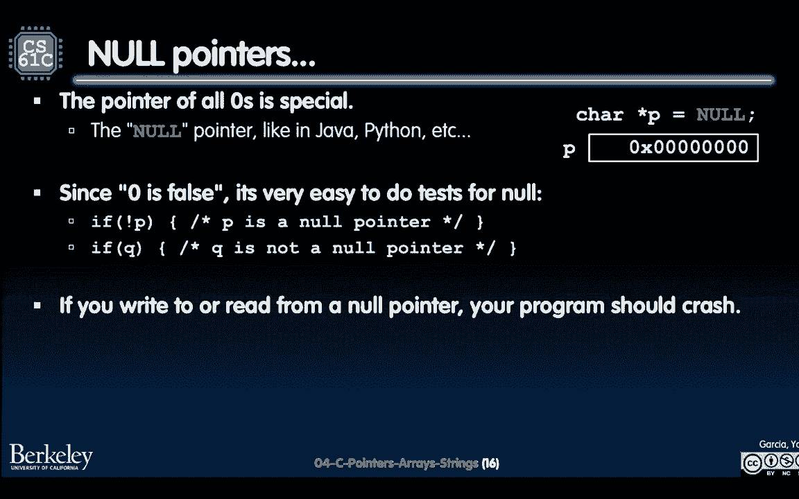
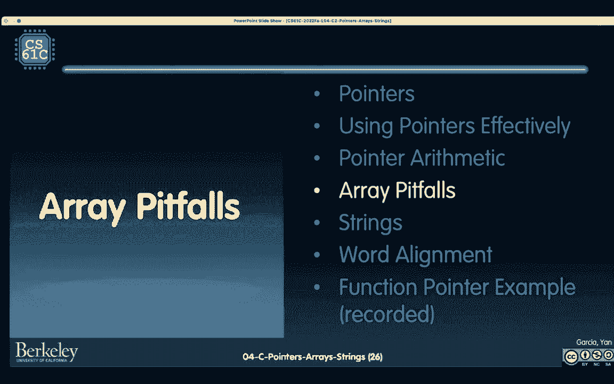
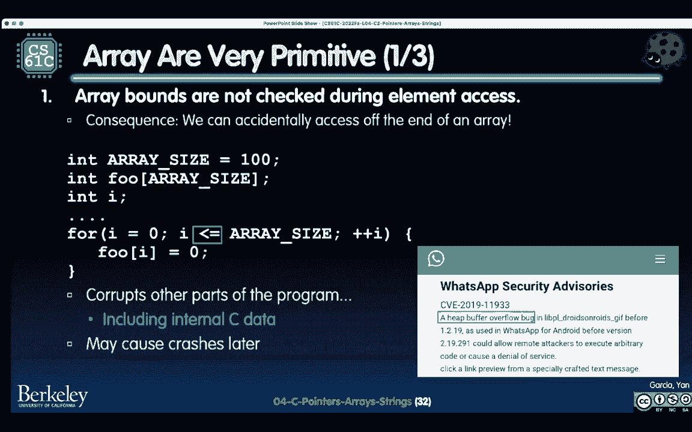
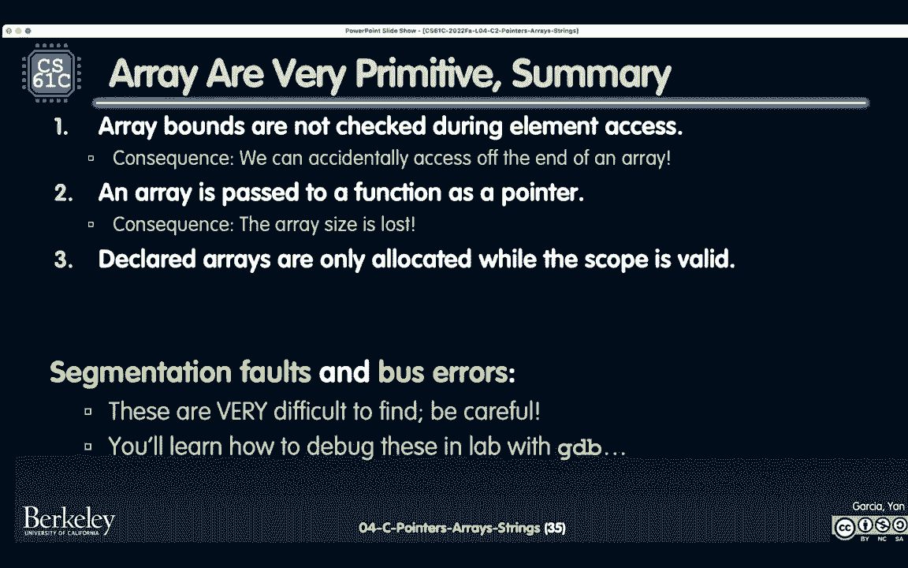
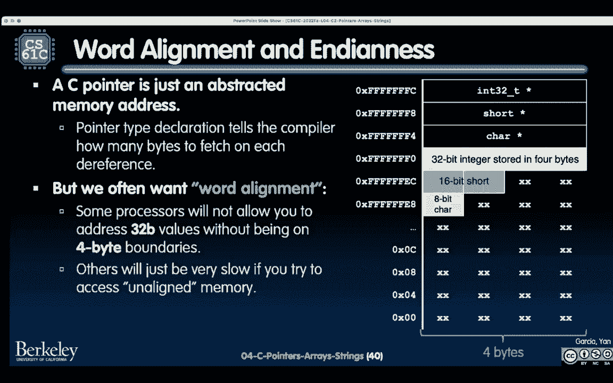

# P5：Lecture 4： C Intro - Pointers, Arrays,Strings - 这样好__ - BV1s7421T7XR

哦不，正在进行的录音，哦天啊，好啦，我想我们很好，如果你必须远离笔记本电脑，声音可能传不过去，所以你喜欢，如果你想，您可以尝试重新启动会话。

是因为它不是，计时器或扬声器应该因为某种原因而通过。

好啦。

好啦，下次我会好的，嗯，你觉得我们可以，如果我到处走，然后呢，因为我将不得不作为云的一部分四处走动，如果你喜欢在屏幕上，好啦，如果我在舞台上，没关系的，好啦，是呀，所以我要实话实说，好啦，酷真棒，是呀。

谢谢你。

好啦，欢迎大家回到，我们将继续讲c。

我们首先要讨论的是一种叫做指针的东西，你们中有多少人在半节课前就听说过指针，有多少你以前没有听说过指针，班上的另一半，这就是我现在要说的，这取决于你拿的是哪个版本的。

如果你没有，如果你没有看到指针，在我们现在谈论它之前，但在我们谈论指针之前，我想让你们思考一个特定的抽象，我们将使用，在接下来的一周或两周或三周左右，内存是一个巨大的数组。

这意味着这个巨大的内存阵列中的每个字节都是可寻址的，有一些地址，假设我们从地址0开始，我在这里用十六进制写的，好啦，所以这里有十六进制地址0，然后我们继续沿着这条线，也许我们得到了魔法一百。

我们得到十六进制1 0 4以此类推，以此类推直到无限，现在请注意，地址和值之间有一个区别，所以我们有蓝色的地址，零三和一零四，我们碰巧把价值存储在，也许这是一个字节23表示。

指针也是一个值，但它是什么类型的价值，它是存储地址的值，好啦，所以这意味着我们可以把它画得像一个小箭头，它指向某个地址，但是存储在这里的实际值将是地址本身，四个中的一个，这是一个在。

因此，让我向您展示如何在，C使用这个星型运算符，它将以两种不同的方式使用，其中之一是int星p，这声明了p，变量p放在这里，这个变量p是一个指针，它将特别地指向一个int数，我们还没到那一步。

但是假设我们也声明了一个值3的int，好啦，所以这里有一个X，这是商店，你记得就像巨大的记忆阵列，存放在一号或四号地址，它里面有三个值，请注意，就像上次丹的课一样，P刚刚声明，这里有垃圾。

所以我们要做的是在p中存储一个值，具体来说，我们将赋值p为1/4，我们将使用的方式，即通过这个与号运算符，好啦，这个和那个要做的是说嘿，你的地址是什么？X说1 0 4，好啦，存储到P中。

所以这意味着我们可以认为指针，我在这里有个小派对，我们可以把p看作是直指这个地址，说我指的是这个值。

但后来在后端偷偷地，C在说，好啦，这是一个或四个，好啦，这是现在存储在里面的值。

为什么这个有用，哦天啊，好吧一百，它还在那里，这是一个很好的地址，好啦，谢谢你，丹，这个有用的原因是现在我们可以说嘿，请打印出p指向的值，P会说，好啦，嗯，我在这里指什么，我指的是一零四。

那是一个还是四个？此值三，然后我把3代入printf函数，然后我们要打印出三个，我们也可以使用这个去引用运算符，另一边的星星也说我们有一些值5，我们希望把它存储在p指向，所以现在x不是3，会变成五个。

现在有几点我想注意，对于你们中的许多人来说，这可能是一种新的语法，这颗星实际上有两种不同的用途，其中一个是申报，指示p是在第一行的指针，第二种方法是所谓的去参考，要说，跟随指针，获取值或设置值。

第四、五行，分别。

好啦，所以你就像，好啦，太酷了，就像你知道的，这就像间接，但我们为什么要用指针，其中一个原因是因为C是如何像Java一样实现的，所以这意味着程序，函数法，但是，您想调用他们获取参数的副本。

如果你想改变这个值y，你只需传递它，传递值本身，我们这里其实有一份，此参数是值三的副本，内部，它将值从3改为4，但是一旦它返回y仍然是3，另一方面。

如果我们用指针，去看看，现在我们说我们传入一个指向y的指针，我们通过Y的地址，比如说为什么100在这里他得到的值是100，它仍然是按值传递的，但是现在传递的值，地址是，现在我们说得到100的值。

那将是三个，给它加一个，那将是四个，然后他们会把这个储存在指定的地方也就是把这个储存在。

一百，那就是四，所以在这结束的时候，为什么现在是四，当我们从函数很好地返回时，当我们从函数返回时，Y现在是4，好啦，所以在这里使用指针，注意语法，我们已经在参数中将其声明为指针，我们还传递了值的地址。

而不是值本身，这在这里很重要，那么为什么要使用指针呢，你还记得c应该是超级的吗，超级，超快，嗯，因为他是通过值传递的，如果每次我们想通过一个巨大的结构或数组或任何东西，看看如何喜欢。

把所有的记忆都拷贝进去，那会让我变慢的，因此如果我们有指针，传递这个指针更容易，因为现在只是个地址。

在C被创建的时候，就像70年代初左右，编译器确实在与许多类似的内存性能问题作斗争，C的设计是为了给人类程序员更多的灵活性，通过能够有这种间接的水平，现在我的意思是，最终编译器的速度要快一百倍。

计算机要快一百倍，嗯，但是您仍然会看到性能水平特别低的指针，因为一旦人类有了这种低水平的表现，我们希望开始使用指针，此外，执行其他职能，您需要实现其他语言，如通过引用传递的语言。

你现在仍然会使用指针之类的东西，一般来说，指针允许更干净、更紧凑的代码，但是，事实证明，指针实际上是c代码中bug的最大来源，那里一定要小心，使用最有问题的，呃，当我们分配热量的时候。

动态内存管理和内存泄漏，所有这些我们下次会讲到，但这个，今天这堂课的目的是让你们熟悉指针，使用它们很舒服，以及找出数组和字符串在C中是什么，下面是第一个常见的sebug垃圾地址，再次回忆，声明变量时。

它们没有初始化，它们可能包含任何东西，那么下面的代码是做什么的呢，然后我们有这个函数，我们就叫它F吧，它将ptr声明为存储地址的东西，然后它说好吧，去地址和商店五，有一些垃圾。

然后它进入内存中的某个随机位置，记住我们的记忆就像这个无限长的数组，它只是把五个编辑到那里，是啊，是啊，这将是很多工作，可能也有点吓人。

会发生什么，我们会谈谈这个，很快。

在我们继续之前，让我澄清一些关于指针的其他事情，在我们继续之前，我们在星指针声明中讨论了一点，事实证明，您可以在，从星星开始，搅拌以获得字符指针，结构指针，如果你也想的话，去争取吧。

但它们确实是一种类型，唯一不是的指针是这个名为void star的通用指针，我们不打算在61 C中使用虚空星，至少我希望不是，因为它产生了很多程序错误，安全漏洞和很多其他不好的事情。

但当你真正想玩的时候，它被用得很多，指针的东西，当你想创建自己的内存分配器和所有这些东西时，所以如果你真的对虚空之星很兴奋，做完61 C，然后做CS 162，但有件事我们要谈谈，它叫做函数指针。

函数指针是什么，如果记忆是这个巨人，这个巨人，呃阵列，事实证明，函数数据也在内存中，所以你可以有一个函数实际所在的地址，这是它的声明，它说我们有这个函数sn，它吸收了两颗虚空的恒星，它返回一个int。

我们给这个fn变量赋值，此函数指针指向此函数的地址，通过，如果你对申请感兴趣，丹录制了一段很棒的视频，关于如何用函数指针实现map，这真的花了两分钟，所以今天下课后一定要看看。

现在关于指针的另一个特殊部分，你还记得我们之前是怎么讨论垃圾地址的吗，有没有无效指针这种东西，C使用了一个约定，如果指针都是零，如果指针存储地址为零，这就是所谓的空指针，类似于Java和Python。

但现在你在引擎盖下看到了，它实际上只是所有零的地址，这让我们做的是，它能让我们检查那个地址是不是空的，或者它不是空的，事实证明，这是相当直截了当的，是啊，是啊，听众中有一个问题，并提出问题。

所以问题是所有人都这样做，对值为NULL的所有指针变量执行操作，他们只是指向地址零吗。

答案是肯定的，所以真正发生的，我们会好好谈谈的，下次可能会在地址0。

那就是你根本不能在那个空间里写作，你甚至不能访问那个位置并读取那里的数据，所以每次你看到它，上面写着，任何时候写入或读取空指针，你的程序应该崩溃，这是在c中实现的。

也是编译器级别的契约，这里还有一种我们使用指针的方法，这是关于项目一的结构，您将大量使用结构，当我们思考如何实现蛇游戏，重新审视结构，我们上次已经简单地讨论过了，但让我再说一遍，我们这里有一个结构和弦。

它的类型是f，或者我们把f打成了cord，但实际上这意味着这里有两个值，X和Y，结构内部，我们可以向一个和弦2声明结构本身，或者我们可以声明指向结构的指针，指针一和指针二，我们上次讲的。

我们可以用点符号来表示股票本身，如果我们有指针，我们可以用这个箭头表示法，这个箭头符号看起来像箭头实际上是速记，对于这个等价表达式，就是去那个被指向的区域，然后点，好啦，所以你知道。

就像看到其实有点道理，挺有意思的对吧，因为它是这样的，此错误外观，有点像指针，它在做一件事，是啊，是啊，反正，所以现在考虑到这一点，让我们在这里做一点纯指令操作，指针一等于指针二，这个编译。

但它有什么作用，好啦，假设我们这里有一个特殊的结构，因此，将两点指向一个已经初始化的结构，如果我们把指针1设为指针2，你觉得会发生什么。

所以我们要在这里到处投票，你要做的是，您将登录，我不知道为什么它不起作用，非常刺激。

您将登录到，艳娥出来了，我把它写在黑板上，Evie，这是我的名字，代替丹的名字，你可以点击选项A或选项B，让我们看看我是否能在另一个屏幕上工作，这将是，是呀，我在这里得到了一些小图像，挺有意思的。

好吧那么好，我们再给你几秒钟，稍微检查一下，哈哈哈，我看到几个，我看到几个，呃，左边是独立的思想家，那很好，太好了，哦不，图表越来越，它被所有的小点覆盖了，这很好。

好啦，高意，有点高，所以控制，我们仍然看到一切都很好，所以在a和b之间，答案是什么，让我们大声喊出来，有趣的选择，所以答案是。

让我们看看为什么，你可能还记得Java和Python和61和61，B，当你有这个赋值语句，字面上说的是指针二，它有价值，获取该值并将其存储到指针1中，那么这里的价值是多少，是个地址，好啦，然后在图表端。

是啊，是啊，箭，翻转和所有这些事情，但是如果你，如果把指针看作地址会让你更舒服，然后总是把它复制到地址周围，然后做那件事，做那个，如果把指针看作箭头会让你更舒服，做那个，如果你能把这两件事都考虑进去。

做那个，这就是抽象的力量，好啦，在我们讨论利率之前，关于指针的另一件事。

有一种叫做指针算术的东西，事实证明，它与，我们在这里思考数组的方式，所以C数组实际上是我们所说的一大块内存，这与你在Java和Python中看到的完全不同，所有这些都是因为如果你声明一个数组。

int数组二创建两个块，两个毗连区块，就在彼此旁边，他们身上可能有，从垃圾开始，因此，如果您想声明和初始化，您可以使用这些花括号，然后注意这里我没有提供尺寸，他已经知道它的尺寸了，它里面会有两种墨水。

这就是存储在右手图表上的内容，那么如何访问元素元素，请记住，当您考虑数组时，真的只想喜欢，能够索引到里面，我们会看到像许多其他语言一样，事实上，它是最早从from zero访问元素之一。

所以它使用了熟悉的方括号表示法，你们很多人都见过，它会把修女还给你，现在请注意，实际上在引擎盖下，这就是所谓的指针算术，看起来不像，但让我告诉你它是如何工作的。

指针算法说的是你可以取一个地址。

然后通过加值或减值将其更改为另一个地址。

如果我们提醒自己，上节课我们是不是简短地讨论过，但我会重复一遍，为了这次演讲，这就是所谓的编译时间，如此有效地告诉您对象中字节数的操作，当你说指针加n，这其实是你拿那个地址，然后你把这个数量的对象。

物体大小数，到达那个位置的下一个物体，如果指针减去n，减去n倍大小的物体，我给你看看这个，假设我们有一个int 3 2数组，好的，好的，现在我用的是我们上次看到的int 32t类型。

但我实际上是在给你看，因为我想能够正确地画出图表，上面写着，请创建三个相邻的INS，五六十个七十个，你会看到这里它们是分开的，一百一零四，零八，然后一个零，C，我记得十二个等等，等等。

现在让我创建这个指针，它将存储数组开始的地址，如果我打印出存储在地址Q的值，那我就五五分成，我还可以使用数组索引表示法，Q是零，得到q处的零元素，它会给你50，因为这是星号q加0，现在下一个。

如果我做星Q加1，这有什么用，它会说，给我下一个，从这个原始地址开始，好啦，那么它是做什么的呢，它给了我六十，同样，你可以用q和方括号，一个，现在你想变得有点无赖，你说不不，给我以前的int。

从这个地址开始，你会像没事一样，我要给你四十五万六千，七百八十二，它会返回那个值，因为再一次，这样想吧，这个指针算术，它不检查边界，它不知道发生了什么，它会计算出地址，然后试着去那个位置。

给你它是三二的值，是啊，是啊，有个问题，呃，Q加2，这就是所谓的错别字，是呀，是呀，谢谢你，所以说，这是减一，谢谢你，谢谢你，是呀，我会，我以后会在幻灯片里修改的，是啊，是啊，不过，还是谢谢你。

所以我们真的在看星星。

Q减1，会给你打上问号，如果你真的开始了Q加2，给你七万，是啊，是啊，谢谢你的澄清，我再把会议控制藏起来一次，好啦，所以处理指针，既然我们知道了指针算术，我们可以在思考函数时更大胆一点。

我们如何让一个函数改变指针，好啦，假设我们有相同的数组，指向数组开始的相同提示，我们希望递增指针指向，让q指向这个值60，相反，地址是1/4，如果我们这样实施，让我们看看顶部的增量指针。

什么会被打印出来，让我们看看会发生什么，记住C是按值传递的，所以我们递增指针，我们传入q的值，只要一百，指针将更改p的地址，这将是四个完美的之一，它返回q还是100，好啦，因此。

Q星Q仍然会打印出50个，另一方面，如果我们想处理指针，如果我们想改变指针，因为c是按值传递的，我们将使用所谓的双指针，指向指针的指针，我们去看看，你看上面这里，我们有星星H，这意味着什么，我们走吧。

这意味着当我们传入Q的地址时，它会给我们Q的地址，一共是一百二十，那不是Q的值，这就是Q在内存中的位置，指向这个框，那是提示，现在如果我们说请先换衣服，实际上解引用以获得存储在此地址的值100，加一个。

然后把它存放在同一个地方，接下来要做的是指针算术，我们将得到100加1，但因为一切都是整数，它会变成星星，它会，它在一个int中，它将增加四个字节，然后它会更新到1 0 4，好啦。

所以看看箭头类型的更新到现在，当我们返回并取消Q，我们会得到什么，我们要得到，双指针是你会一遍又一遍地看到的东西，你就会，你要在家庭作业上多加练习，在实验室里，在项目上也是如此。

现在数组陷阱，你们中有多少人喜欢Arra，是啊，是啊，当人们喜欢，是啊，是啊，我提出了我最喜欢的数据结构，好啦，嗯，让我告诉你射线是如何变成。

就像，我们对数组有爱恨交加的关系，这是一个红色的号码，其中一个，然而，数百万人，其中之一是考虑数组的大小，好啦，很多时候你会想说，我将声明一个大小为10的数组，然后我会从，我将填充这个数组中的所有元素。

所以我将有一个for循环，这也将是多达十个或少于十个，以此类推，等等，我们真正希望你养成的习惯是，只声明一次数组大小，并初始化数组大小一次，然后用它来声明数组，整个记忆块。

以某种for循环的方式遍历数组，这是一种文体上的东西，但我们常常认为这是一个很好的实践，其实呢，这是一个强烈鼓励遵循的做法，第一个是编译，不会有什么问题的，除了它会给你制造很多bug。

所以其中一个外卖看看，有一个单一的真理来源是有用的，然后你将在方向上利用，避免维护某物的两个副本，你会在蛇项目中看到很多这样的东西，当你必须创建板的大小。

然后维护行和列以及所有这些东西，第二件事，现在我们进入了杂草一点点，数组和指针的区别，即数组几乎与指针相同，但它们不是指针，我的意思是汽车星串和字符串数组，这里的小方块，这些几乎是相同的声明。

我们要看看他们有什么不同，在这节课的最后和下节课，非常有用的是，我们前面看到的数组元素索引，用方括号，那只是指针算术，所以实际上数组变量名，这就是我们所说的指针，就像对零宽度元素的大空气引号。

空中报价在这里超级超级重要，好啦，他们不是真正的指针，但是您仍然可以使用带有方括号的数组零，这相当于做星阵。

你也可以这样做，这就是为什么有一个小陷阱，让我们假设我们有以下情况，我们创建两个指针p和q，假设p点，面积x，然后q指向数组内的某个位置，好啦，所以p和q都是指针，然后A是数组。

我要做的是为每一个p打印出三件事，Q和A我要打印出来，我将取消对该变量的引用，我要把那个变量的地址打印出来，然后我要打印出来，假设我要打印出那个变量的值，然后我会打印出那个变量的地址，我们去看看。

p指针工作，如你所料，我们要做的第一件事就是在值x中存储一个，现在我们说，好啦，去参考，P，我们得到了什么，我们得到了一个，p的值是多少，这是地址，那将是一百零八，然后P的地址是什么，那是储存p的地方。

那是一百，同样的事情，首先我们取消引用，我们存储到位置，那个队列，我们储存一个二，什么是贬低，Q好吧，那个位置储存了两个，十一元是多少？Q1或Q4的地址是什么？你就像在滚动，你就像，好啦。

我做这件事也是为了加薪，会很棒的，然后我们看到一些不同的东西，现在我们仍然可以在这里做这个点或去引用和设置，所以这就是我们要做的，我们将储存在A地址，我们要储存三个，所以三个会储存在那里。

这意味着当我们取消引用时，我们会得到三个，当我们得到存储的值，或者一个，我们有地址，C中的一个，但我们得到了一个，我们也得到1/c中的一个，好啦，什么不是这里的1 0 3 1 0 c。

那么这里的重点是什么，关键是在K和R中，开襟羊毛衫里奇的教科书说，数组真的不是变量，因为A的类似值和A的地址给了你同样的东西，而在指针中，它们不，因为指针是一个单独的东西，它存储一个地址。

然后丽萨怎么说，Lisa说数组实际上就像这个大内存块，这不是地址，指针是地址，数组是内存块。

还有一个问题，是啊，是啊，有一个问题，其实呢，我在这里回答一个新问题。

然后耶，什么事？哎呦，好问题，那么数组的大小是做什么的，我把这个留给你在现场直播中弄清楚，是啊，是啊，问得好，这里还有一个问题，啊，是啊，是啊，所以问题是好吧，如果您喜欢创建此数组。

然后你改变了数组中的值，每个人的价值都会改变吗，是呀，就像这样，这个Q版本将提示点放入数组，然后更改数组内的值，是啊，是啊，这里还有一个问题，是啊，是啊，啊，大问题，如果声明大小为2的数组，你让它变长。

你不会想让它更长的，你能做到吗，他会对你大喊大叫的，是啊，是啊，原来如此，喜欢一些一些，不是摇头，所以观众有些颤抖，下节课我们将讨论动态内存分配，这就是你可以在和C中调整大小的地方，创建数组后。

这就是数组的大小，因为它说那是指理论的记忆块，我们有个问题，所以现在你就像，哦，我以为，通过我最喜欢的数据结构升起，这里发生了什么事？是啊，是啊，事实证明，在C语言中，它们并不是真正的数据结构。

它们只是巨大的记忆块，但让我们看看这种原始的天性是如何导致某些虫子的，这就是为什么我们有这些小右上角，这里有虫子，未选中第一数组绑定，还记得我们是如何用指针算术的吗，就像p减去1然后p减去100。

我们从来没有P减100，但你可以，所以在这种情况下，假设我们这里有一个小虫子，好啦，所以我们创建了一个大小为100的数组，然后我们第一百个元素，所以这就像是第一百个元素，因为我们从零开始索引。

我们把穿过射线末端的那个元素设置为某个数字，它将编译，但有时它会破坏程序的其他部分，因为你的程序都存储在这个巨大的内存阵列中，巨大的连续存储器阵列，您甚至可能损坏内部C数据，您可能会导致翻译器崩溃。

你不知道这有点吓人，实际上这个bug总是出现，当我实施我的第一个61 C项目时，我得了这种病三天了，我就像，哦，我的天哪，真的是的，这是61英尺的新闻经常发生，不仅仅是介绍61个C程序员。

它发生在您使用的设备和应用程序的程序员身上，1919年发生了什么报道了这个叫做缓冲区溢出的巨大事情，堆缓冲区溢出，我们会谈谈，下次留一点，它所做的是说，它可以允许远程攻击者执行任意代码，或创建拒绝服务。

因为内存是一个巨大的数组，它真的破坏了节目的其他部分，程序所能使用的。

第二点，我们只能说数组是非常原始的，三分之二，这里的第二点是数组作为函数传递，到函数作为指针，那么这意味着什么呢，这意味着如果我们有下面的声明，好啦，所以我们在这里有这个函数，它在方括号中接受两个参数。

然后它的大小是无符号的，原来数组是一个r r，这里等价于一个指针，你就像，为什么我认为C是通过值传递的，嗯，这是C决定做的事情之一，就像，好啦，我有这个数组，你就像，好啦，我准备用这个函数调用A。

然后你在比较，可以看到它就像没有没有没有停止，我不想复制所有的信息，让事情快点，把这个扔了吧，它在哪里，这就是你将要得到的，无论你在哪里工作，你都会得到这个地址，这是我在这个函数中唯一允许的东西，好啦。

那个阵列，我不在乎，函数将只有地址，现在你就像，如果我有这个地址，我不知道这个数组会有多长，所以让我至少把数组的大小也带来，好啦，所以现在你有了一个地址和喜欢的总数，数组中的任何内容。

这就是你传递到函数中的，好啦，所以这就是为什么，这里的一个要点是，您必须始终将数组长度显式传递给任何类型的函数，因为C会将数组衰变为参数中的指针，是啊，是啊，是啊，是啊，中间有个问题，所以问题是。

如果要在将指针发送到函数后将其增加1，会发生什么，问得好，问得好，所以这就像，好啦，嗯，这里的指针算术是如何工作的，然后呢，如果我真的喜欢。

让我们说，例如，这个。

我们的城市在星阵中，我加了一个，会发生什么，让我们想想算术是如何工作的，上面说我们有，这意味着我指向一个int，如果我想得到加一个，我想指出下一个int，所以在这种情况下，它将向地址添加四个字节。

所以它将指向下一个，不管那是不是整数，这将取决于如何声明大约like的初始数组，不管你是否包括那个空间，但是指针有一点，算术，当你添加地址时，你要经常考虑的一件事是，星星告诉你那是地址。

然后它的大小就像，那是在地址之后，就像那部分本身，所以如果你在双星，你会添加恒星价值的信息来到达下一个位置，我们可以晚点再谈，是啊，是啊，问得好，好问题，嗨，还有一个问题，是啊，是啊。

哦，好问题，如果您有一个int指针会发生什么，这并没有把它拉到内部的倍数，问得好，我会回来的，我将在后面定义这些错误的名称，这是一个错误，虽然，所以对于一个加薪的人来说，最不应该考虑的是，这是第三部分。

你有三个，也就是说，申报率只分配给，当作用域有效时，这就是我们下次要讲的内容，当我们完全描述记忆结构时，但实际上我们要说的是，如果在函数中声明某种数组，然后返回数组的地址，你能看到这个汽车明星吗。

我们要把这个汽车明星，如果我们返回数组的地址，现在那个空间是对的，垃圾，它就这样消失了，这就是范围的力量，所以修复是我们称之为动态记忆的东西，它将允许您在函数中创建数组，并保持它的持久性。

直到程序员决定扔掉它，是呀，这里也有一个问题，是呀，啊，问得好，是呀，所以这就像，你能再给我们解释一下吗，我们下次要从这个开始，因为这需要我解释，比如什么是堆栈，什么是内存中的堆，但这是一个伟大的。

你现在应该很困惑，你就会说，对我来说似乎很合理，我们要谈谈为什么，下次就有点不合理了，问得好，我想把它作为这堂课的一部分，你可以开始喜欢，有点怀疑自己是射线还是你最喜欢的数据结构。

所以总结现在我们回到你的问题，就是嘿，这些地址就像，它们都是有效的吗，我们讨论了一下这个空地址，无法从，但其他地址呢，即使我们说抽象是从零到无穷大，一切都将成为记忆，关于地址有两个错误。

其中之一就是分割错误，其中之一就是所谓的老板错误，分段错误是当你有一个地址，但它访问了你不应该访问的部分内存，除非你运行程序，否则你不会真正知道这一点，然后突然看到它，就像撞车一样，你就像西格五。

我做了什么，然后现在你要调试它，还有一个叫做总线错误的东西，上面写着嘿，也许您正在使用您可以访问的部分内存，但你提供的地址，它不是真正的int，就像一个int，再加上一个字节。

有时你会看到这个叫西格巴士的东西，这也将是一个错误，这些东西很难调试，因为有时候这取决于你的架构，有时它取决于传递到参数中的变量，等等，是啊，是啊，后面有个问题，是啊，是啊，CF自动垃圾收集奇妙的问题。

更多，下次你就像丽莎一样，你为什么要先做这个讲座，是啊，是啊，我知道我们要讨论的一件事，下一次是这个叫做要塞的东西，最终，C程序员负责分配密钥上的内容，所以简单的回答是没有C没有自动垃圾收集。

还有一个问题，我在后面看到，我不知道那个问题是否还有效，酷。

好啦，所以多了两个或者说多了一个事实，然后我们会更多地讨论记忆，越来越多的事实是这种叫做字符串的东西，这里谁喜欢琴弦，所以班上三分之一的人对这个没有比赛那么热情。

是啊，是啊，事实证明，你可能对此不感兴趣是有原因的，因为在C语言中，这些字符串只是字符数组，末尾有一个特殊字符，称为空终止符，这意味着您可以创建一个字符数组，你把它调到双倍，双引号字符串abc。

编译器要为您做的是，它将创建一个四字节数组，这里的最后一个字节是空终止符，这是我们自动为你做的事情，美丽，现在很好，为什么这很好，因为你还记得我们之前是怎么讨论函数的，或者像数组一样。

当它们被传递到函数中，他们现在就像失去了所有的大小概念，因为我们有这样一个抽象，即c字符串总是以空终止符结束，你能看到像string这样的标准库吗，点，H搅拌透镜得到绳子的长度，而且它可以。

它将继续在数组中传递和迭代，直到它到达空终止符，所以有一点要注意的是，空终止符不计算在字符串的大小中，绳子的大小算多少，一切都取决于空终结者吗，但它需要一个空终止符来知道何时停止。

所以如果你对这个代码感兴趣，一定要去看看，试着真正喜欢，在这堂课之后，你自己在gdb中完成它，但它是一个非常复杂的代码，从某种意义上说，你可能只需要十分钟就能像指针一样，算术我来找我。

然后你会在黑暗的房间里坐一会儿，然后在你的电脑上看看，是啊，是啊，会是个好时机。

但我也很乐意在课后解释这一点，我今天有办公时间，这是非常令人兴奋的，好了今天最后一件事，这个叫做单词对齐的东西，现在你可能会有很多问题，你就像，好的，好的，为什么我们要谈论指针和内存，而这一切。

内存的哪一部分是有效的。

让我再次向你们展示我们将在本课程中使用的记忆抽象，就像以前一样，内存地址确实是字节可寻址的，但是许多计算机体系结构的工作方式，他们从字数的角度来思考，这是计算机体系结构在更少的层面上做的事情。

在这下面的几个层次上，为了让事情变得更快，他们说我要考虑的唯一有效地址，是这个单词大小的倍数邀请，所以说，例如，如果我们有一个3位2位的架构，首先这一套，地址空间的最大大小，这里会有二对三二。

大约有四兆字节，或者不管怎样，所以这意味着指针的大小，任何指针，记住指针都是地址，指针的大小会很好，我在这里表示任何地址所需的最大位，所以n星的大小，汽车明星的大小，这些都是四个字节。

因为我们有三个二位，我现在也在这个方向上画了一个内存架构，你看左边这些是地址，它们以4的倍数上升，然后这些是字节，比如零一二三然后四五六七，以此类推，以此类推，好啦，所以你会看到这个，呃这个结构很多。

然后注意上面这里。

我已经储存了一些这方面的指针，所以你可以看到这个布局是如何发生的，现在还记得我是如何谈论单词大小的，对如何，假设CPU适用于计算机体系结构，一般工作，指针类型声明确实告诉编译器，要获取多少字节。

但这也告诉你，你想要的类型和风格，变量本身要进行字对齐，那么我这么说是什么意思，我的意思是，假设我们有一个8-3-2乘3-2位指针，它会指向某个地址，然后它会说好，如果我想取消引用，从那个地址开始。

我要得到那四个字节，得到一个整数，三位二位整数，又是小明星还是汽车明星，如果我想做短星，那是指某个地址，从那个地址开始，接下来的两个字节，这将给我一个16位短，汽车明星也一样，单词对齐意味着所有存储在。

就像我上面的三个变量，它们必须是单词对齐的，所以它们必须是4的倍数。

你可以看到有一点点浪费的空间，但实际上，这种浪费的空间是性能的权衡，因为CPU真的想，只需期望您的地址将是四个字节的倍数，好啦，关于结构的最后一点，我稍后回答你的问题，关于结构的最后一点。

关于结构的其中一件事是，能够解决一堆，通过声明结构将一组不同的数据类型组合在一起，你实际上稍微改变了内存中发生的事情，所以结构实际上只是一个关于，如何在桶中排列一堆字节，假设我们在这里有一个特殊的结构。

它有一个int，它有一辆车，它有一个指针，结构蓝星，指针，这个结构要做的是，它实际上会为结构创建一个12字节的内存，我来告诉你这是什么意思，int将占用四个字节，护理会占用一口，会有一些填充物。

这样你看到的指针，看星星吧，从单词行开始，好啦，所以这就像填充将是你结构的一部分，这是值得思考的事情，如果你看到一些垃圾词，或者如果你看到一些零的值，那可能是由于填充物，当你实际查看字节本身时。

我可以回答一个问题，我们仍然有同样的问题。

是呀，啊，一个奇妙的问题，如果我们有一个数组，那会是什么样子，所以我没有在这里画数组的原因是，因为这样会有点疯狂，但是假设你有一个int数组，数组，假设零元素，或者假设第一个元素是，它将占据整个第二排。

然后下一个元素将占据下一个地址，以此类推，但是如果你有一个关心数组，这里有一个字节，这里一个字节，这里一个字节，这里一个字节，但我们要谈谈为什么它被允许进入。

呃，大概三个星期的时间，但现在我们想要的是如果我们有三个二位值，他们要上场了，那个，这就是我们将要讨论的，为什么这种情况会在几周内发生在体系结构级别上。

你还记得一件事，是啊，是啊，每次还有一件事，还有一件事这里发生了什么，你还记得丹上次的演讲吗，我们可以在课堂上教你们的一件事，如何编程和查看，因为为了编程和查看，你实际上必须喜欢C语言的程序。

我们在课堂上做的一件事，我们告诉你所有这些概念，我喜欢的讲课方式，是你重新审视，当你在实验室里看的时候，当你在看作业的时候，所以这是我想提出的一点，你还记得我说之前是怎么说的吗。

假设我们有一个int星在三个2星指针，它指向某个地址，然后从那个地址有四个字节的信息，它将代表我的int，我按哪个顺序读取字节，第一个字节会像右边，大多数字节将是最左边的字节，这里是什么情况？你看。

为什么这是个问题，我是说这四个字节肯定是由int，但它是像最低的地址是像最左边的字节，是那个，最高的地址是61 C蜂巢机器上最右边的，我们有一点绿色，这意味着什么，先存储最低有效字节，在这种情况下。

假设我们有一个指针，它指向这个以f 0结尾的地址，f为零的那个字节，这实际上是最不重要的78然后加1，所以如果1是5，6将是下一个最低有效的字节，以此类推，等等，这就是所谓的小印第安人。

这是一个计算机体系结构，是一个依赖于建筑的东西，相反的是大尾端，我们在课堂上很少讨论，但我想让你知道它的存在，再一次，我们要做的是家庭作业二，有一种激情是通过字节来查看。

我们优秀的助教们的所作所为实际上被报道了，你将如何看待这件事，结束。

这与GDB有关，所以我很乐意回答问题，祝你星期三愉快。