# 课程 P5：第4讲 - C语言入门：指针、数组与字符串 📚


在本节课中，我们将学习C语言中三个核心且相互关联的概念：指针、数组和字符串。理解这些概念是掌握C语言编程的关键，它们提供了对计算机内存的直接操作能力。


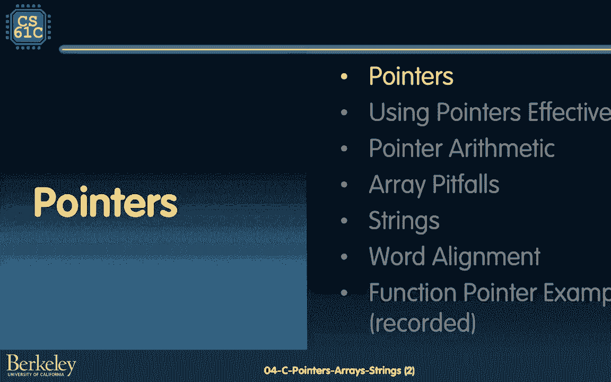

## 内存抽象：一个巨大的数组 🧠

在深入细节之前，我们需要建立一个关于内存的抽象模型。我们可以将计算机的内存想象成一个**巨大的字节数组**。这个数组中的每一个字节都有一个唯一的地址。


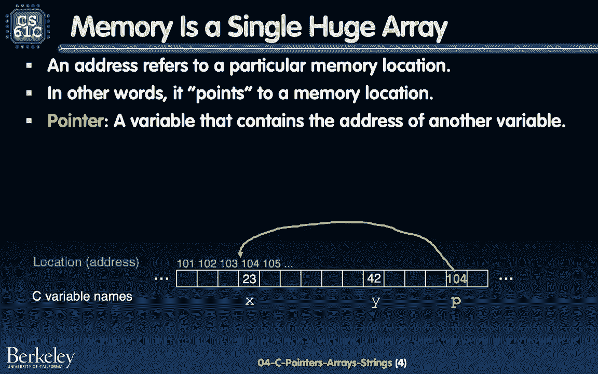

*   地址从0开始（通常用十六进制表示，如 `0x0`）。
*   地址会一直递增（如 `0x104`）。
*   每个地址处存储着一个具体的**值**（例如，字节 `23`）。

**核心区别**：地址（位置）和存储在该地址的值是两个不同的概念。


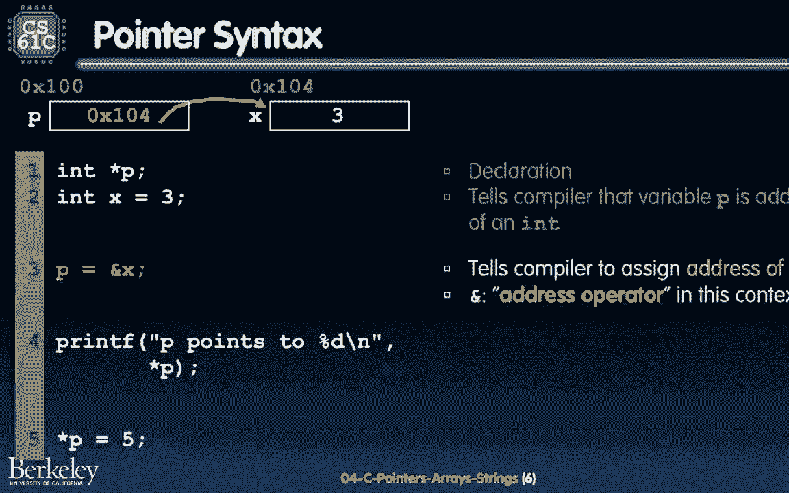

## 指针：指向内存地址的变量 🎯

指针本身也是一个值，但它存储的是**内存地址**。我们可以把它想象成一个箭头，指向内存中的某个特定位置。


### 指针的声明与使用


在C语言中，我们使用星号 `*` 来声明和操作指针。

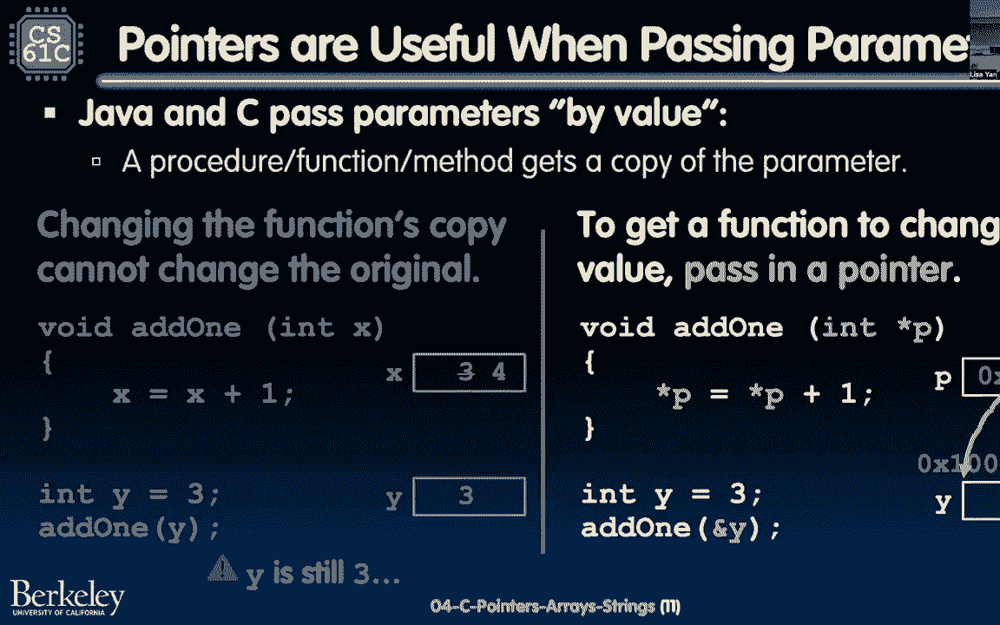

```c
int x = 3;        // 声明一个整数变量x，值为3
int *p;           // 声明一个指针p，它将指向一个整数
p = &x;           // 使用 &（取地址）运算符，将x的地址赋值给p
```

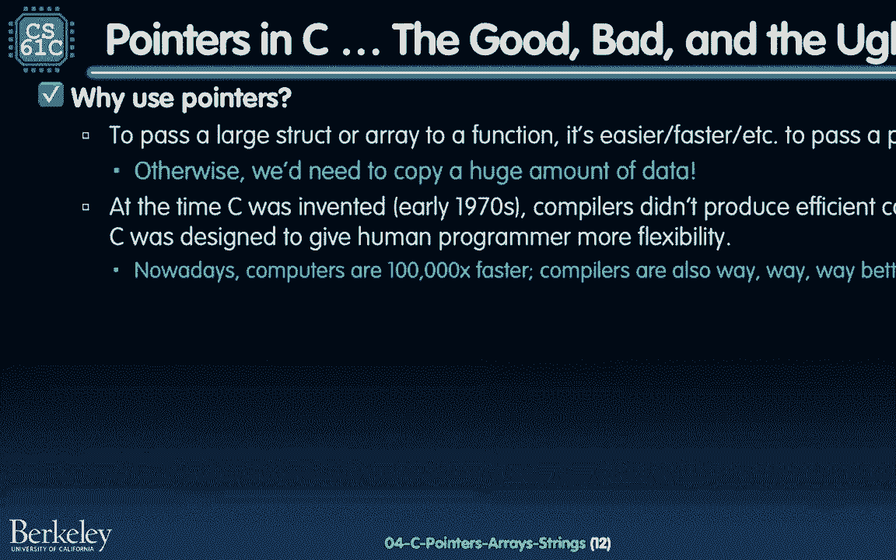


*   `int *p;` 中的 `*` 用于**声明** `p` 是一个指向 `int` 的指针。
*   `p = &x;` 中的 `&` 是取地址运算符，它获取变量 `x` 的内存地址。
*   现在，指针 `p` “指向”变量 `x`。`p` 中存储的值就是 `x` 的地址。

### 解引用：访问指针指向的值

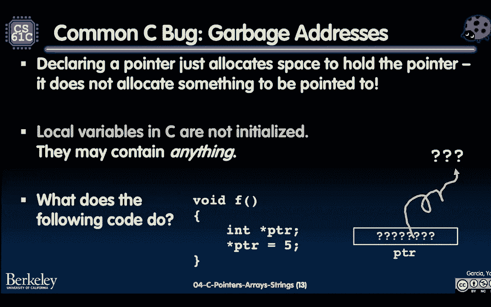

我们可以通过指针来读取或修改它指向的值，这称为“解引用”。


```c
printf("%d\n", *p); // 输出：3。*p 解引用p，获取它指向地址的值。
*p = 5;             // 将p指向的地址的值改为5。现在 x 的值也变成了5。
```

*   这里的 `*p` 中的 `*` 是**解引用**运算符，意思是“跟随指针，获取它指向的值”。

### 为何使用指针？


上一节我们介绍了指针的基本语法，本节我们来看看指针为何如此重要。

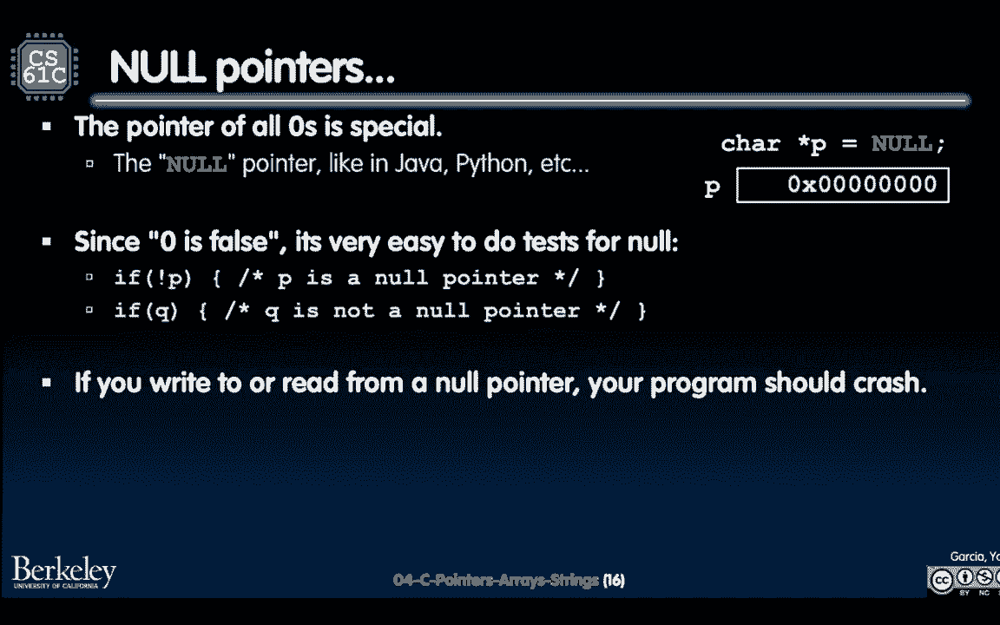

1.  **实现“按引用传递”**：C语言默认是“按值传递”函数参数。这意味着函数得到的是参数值的副本。如果想在函数内部修改外部变量的值，就需要传递该变量的指针（即地址）。

    ```c
    // 按值传递 - 无法修改外部变量
    void increment(int y) {
        y = y + 1; // 修改的是副本
    }
    // 按“引用”传递（通过指针）- 可以修改外部变量
    void increment_ptr(int *ptr) {
        *ptr = *ptr + 1; // 解引用ptr，修改它指向地址的值
    }
    int main() {
        int a = 3;
        increment(a);      // a 仍然是 3
        increment_ptr(&a); // a 变成了 4
        return 0;
    }
    ```

2.  **提升效率**：传递一个大型结构体或数组时，复制整个数据开销很大。传递指针（一个地址）则高效得多。
3.  **实现动态数据结构**：链表、树等数据结构依赖于指针来连接各个节点。


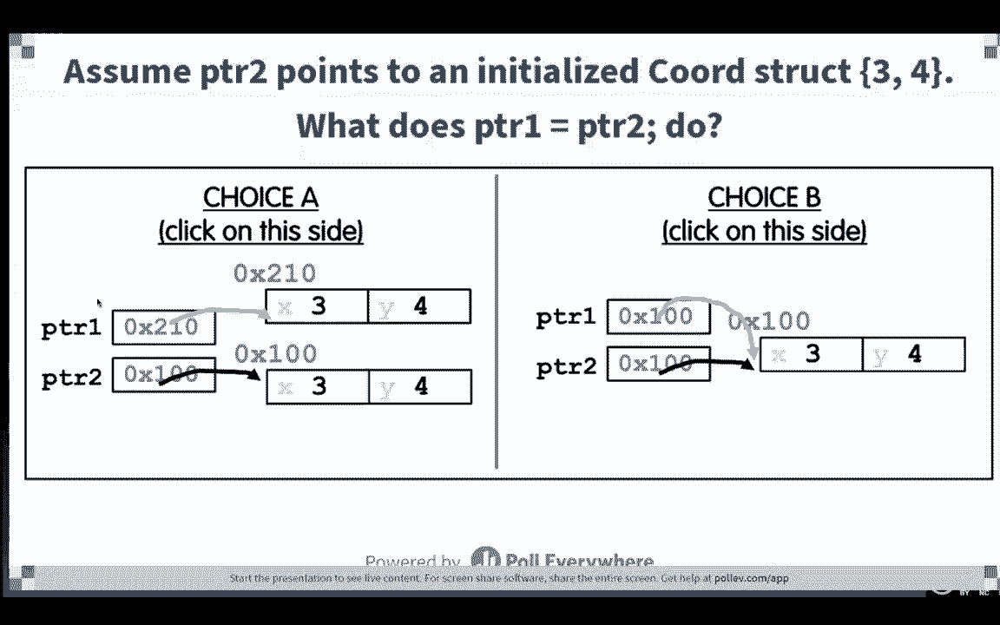

**注意**：指针功能强大，但也是C程序错误的主要来源之一，使用时需格外小心。


## 指针的常见陷阱与高级话题 ⚠️

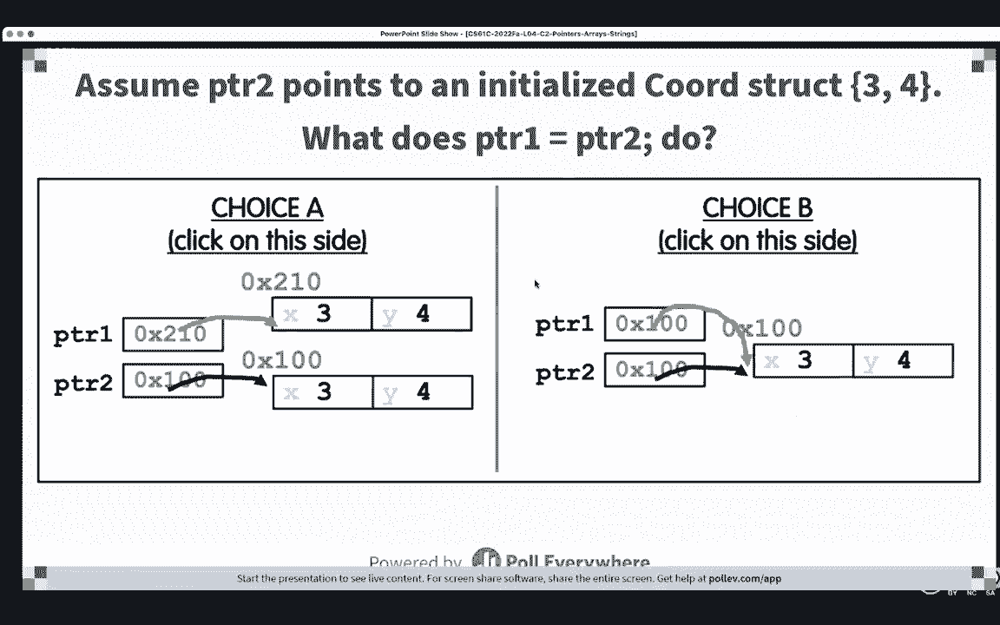

### 未初始化的指针（野指针）

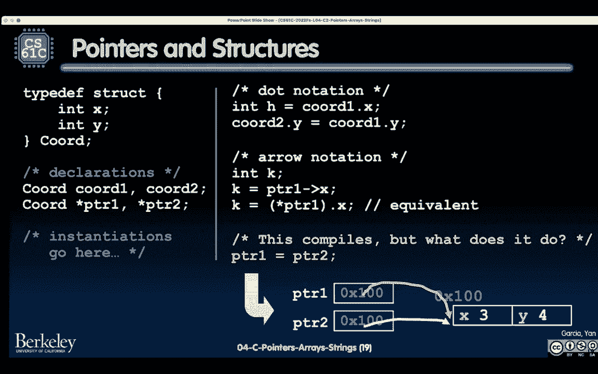

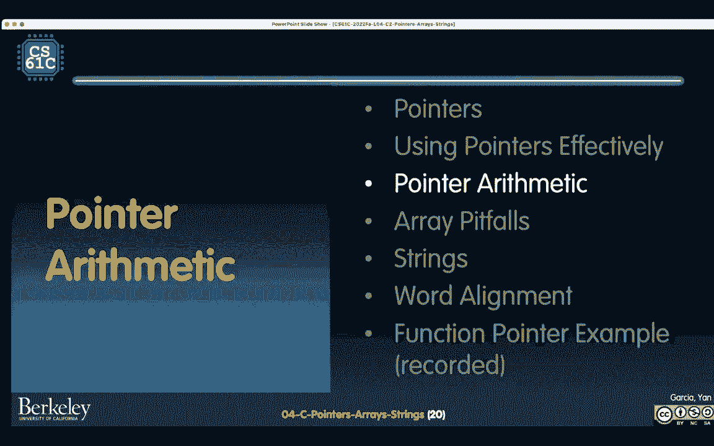

声明指针变量时，它不会自动初始化。它可能指向内存中的任意位置（垃圾地址）。

```c
void dangerous() {
    int *ptr; // ptr 包含垃圾地址
    *ptr = 5; // 灾难！向一个未知的内存地址写入5
}
```


向一个随机的内存地址写入数据可能导致程序崩溃、数据损坏或难以调试的错误。

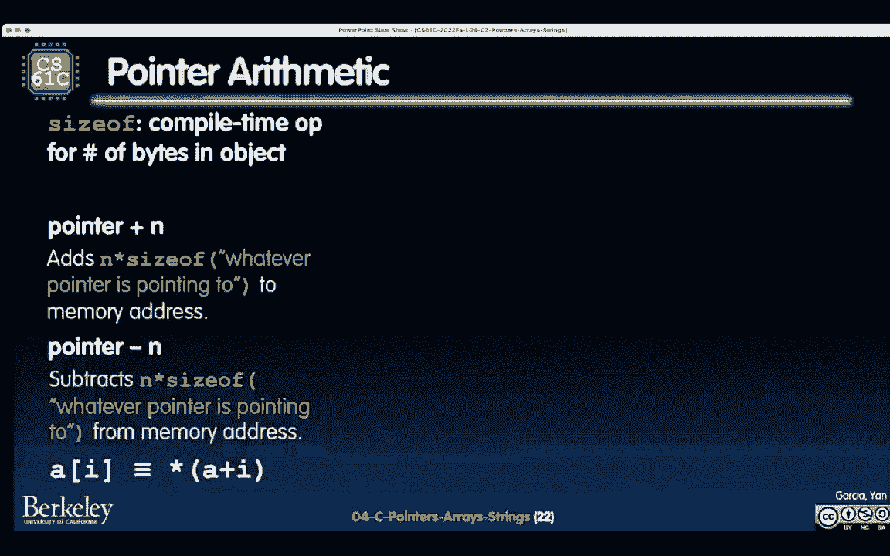

### 空指针

C语言约定，地址为 `0` 的指针称为**空指针**，用 `NULL` 表示（类似于Python/Java中的 `None`）。

```c
int *p = NULL;
if (p != NULL) {
    *p = 10; // 安全的解引用检查
}
```

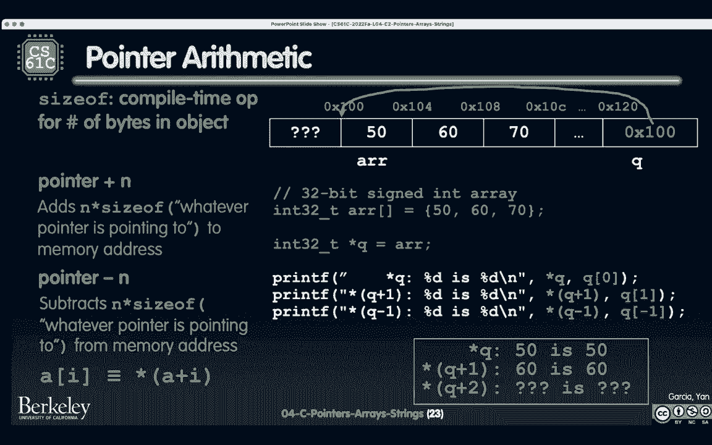

尝试读写空指针（`NULL`）通常会导致程序崩溃（段错误），这是一种保护机制。

### 指针算术

指针可以执行加法和减法运算，这与数组紧密相关。指针算术的单位是**它指向类型的大小**。

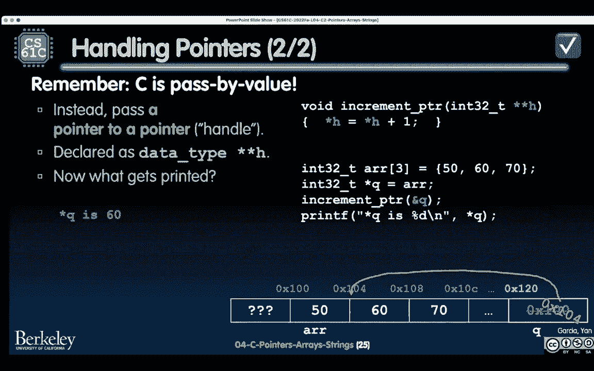


```c
int arr[3] = {50, 60, 70};
int *q = arr; // q 指向数组第一个元素 (arr[0])
printf("%d\n", *(q + 1)); // 输出：60。q+1 指向下一个int（地址增加4字节）
printf("%d\n", q[1]);     // 输出：60。等价于 *(q+1)
```

*   `q + n` 表示：从地址 `q` 开始，向后移动 `n * sizeof(所指向类型)` 个字节。
*   数组索引 `arr[i]` 在底层其实就是 `*(arr + i)`。


### 双指针（指向指针的指针）


既然指针是变量，它也有地址。我们可以创建指向指针的指针。

```c
int value = 100;
int *p = &value;
int **pp = &p; // pp 是一个指向（int指针）的指针
printf("%d\n", **pp); // 输出：100。先解引用pp得到p，再解引用p得到value
```

双指针常用于需要修改指针本身（而不仅仅是指针指向的值）的函数中。


## 数组：连续的内存块 📦

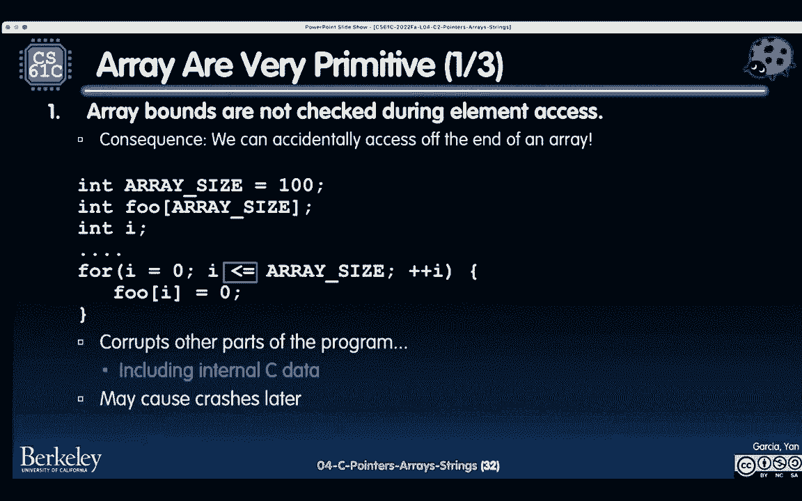

理解了指针算术后，数组就很好理解了。在C语言中，**数组本质上是一块连续的内存**。


```c
int arr[2]; // 分配两个连续的int大小的内存块
int arr_init[] = {10, 20}; // 声明并初始化，编译器自动推断大小为2
```

### 数组与指针的关系

数组名在大多数情况下会被编译器“退化”为指向其第一个元素的指针。


```c
int arr[3] = {1, 2, 3};
int *p = arr; // arr 退化为 &arr[0]
printf("%d\n", *arr);   // 输出：1，等价于 *(arr + 0)
printf("%d\n", arr[2]); // 输出：3，等价于 *(arr + 2)
```

**关键区别**：数组名不是指针变量，它更像一个“标签”，代表那块内存的起始地址。因此，`sizeof(arr)` 会得到整个数组的字节大小，而 `sizeof(p)` 只会得到一个指针的字节大小。

### 数组的陷阱

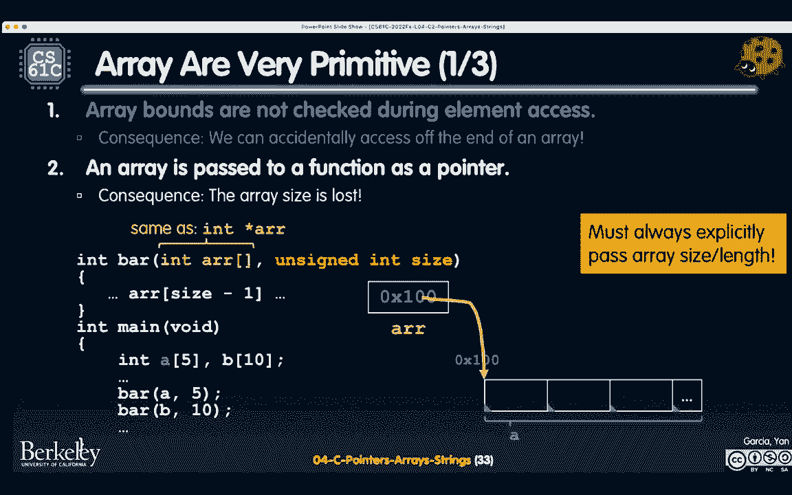

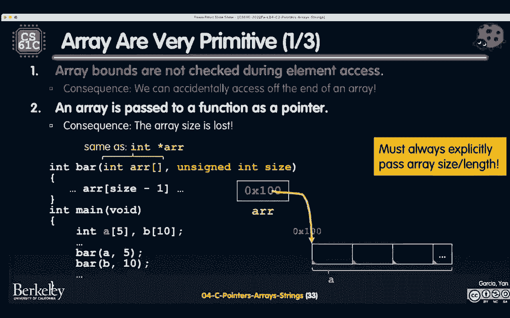

1.  **未检查的数组边界**：C不会检查数组访问是否越界。越界读写会破坏相邻内存的数据，导致不可预知的行为和安全漏洞（如缓冲区溢出攻击）。

    ```c
    int small[10];
    small[100] = 99; // 严重错误！但编译器可能不报错。
    ```

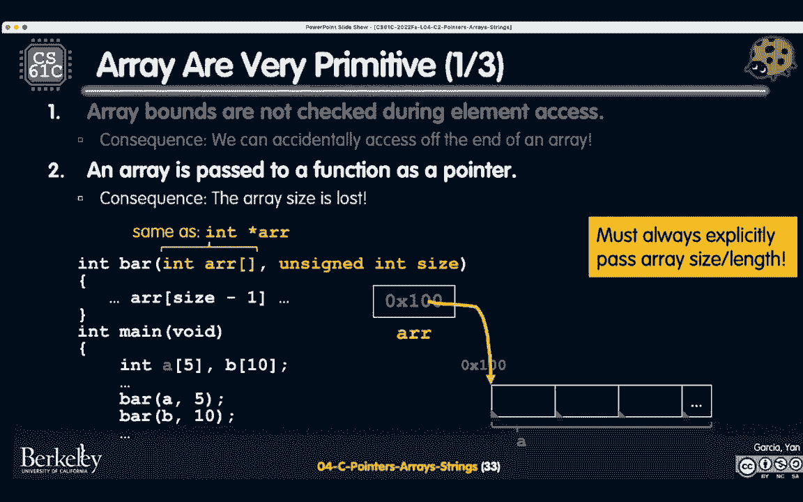

2.  **数组作为函数参数会退化为指针**：将数组传递给函数时，传递的只是其首地址，丢失了长度信息。因此，通常需要额外传递数组大小。

    ```c
    void print_array(int *arr, unsigned int size) {
        for (int i = 0; i < size; i++) {
            printf("%d ", arr[i]);
        }
    }
    ```

3.  **函数内局部数组的生命周期**：在函数内部声明的数组是局部变量。函数返回后，其内存可能被回收。因此，**不要返回指向局部数组的指针**。

    ```c
    int* bad_function() {
        int local_arr[10] = {1,2,3};
        return local_arr; // 错误！返回后 local_arr 已失效。
    }
    ```

## 字符串：以空字符结尾的字符数组 🔤


在C语言中，字符串并不是一种独立的数据类型，它就是一个**字符数组**，并且约定以特殊字符 `\0`（空终止符）结尾。

```c
char str1[] = "abc"; // 编译器会自动创建包含 ‘a‘, ‘b‘, ‘c‘, ‘\0‘ 的数组
char str2[4] = {‘a‘, ‘b‘, ‘c‘, ‘\0‘}; // 与上面等价
```


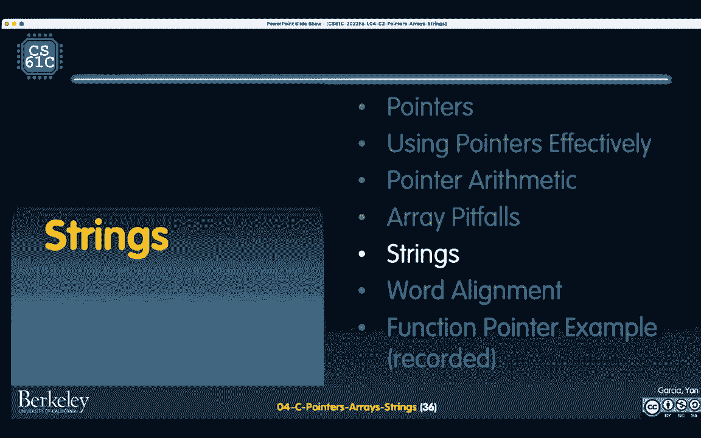

### 字符串的特性

*   空终止符 `\0` 标志着字符串的结束，其ASCII码值为0。
*   标准库函数（如 `strlen`, `strcpy`）都依赖空终止符来工作。
*   字符串的长度**不包括**末尾的空终止符。

```c
#include <string.h>
char s[] = "hello";
int len = strlen(s); // len = 5
printf("%s\n", s);   // 输出：hello。printf 会一直打印直到遇到 ‘\0‘
```


## 内存对齐与字节序 🏗️

### 内存对齐


现代计算机体系结构为了高效访问内存，要求数据存储在特定地址倍数上（通常是4或8字节），这称为**内存对齐**。编译器会自动处理对齐，但了解它有助于理解内存布局。

*   一个 `int`（假设4字节）的地址通常是4的倍数。
*   结构体内部可能会有“填充字节”以满足每个成员的对齐要求。

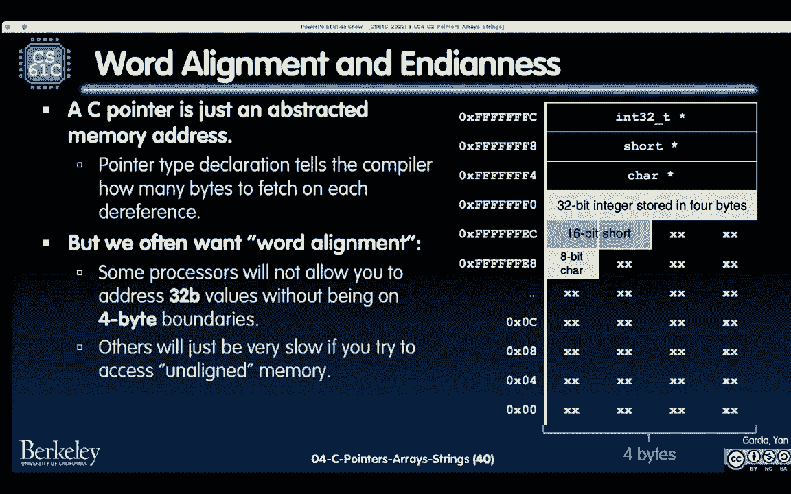

### 字节序（Endianness）

字节序指的是多字节数据（如 `int`）在内存中字节的存储顺序。
*   **小端序**：最低有效字节存储在最低地址。61C课程使用的机器通常是这种。
*   **大端序**：最高有效字节存储在最低地址。


例如，整数 `0x12345678` 在小端序机器上的内存布局（从低地址到高地址）可能是：`78 56 34 12`。


---

## 总结 📝

本节课我们一起学习了C语言的核心底层概念：
1.  **指针**：存储内存地址的变量，通过 `&` 取址，通过 `*` 解引用。它实现了间接访问和高效的数据传递。
2.  **数组**：连续的内存块，数组名可退化为指向首元素的指针。访问数组本质是指针算术。
3.  **字符串**：以空字符 `\0` 结尾的字符数组，是C中处理文本的基础方式。

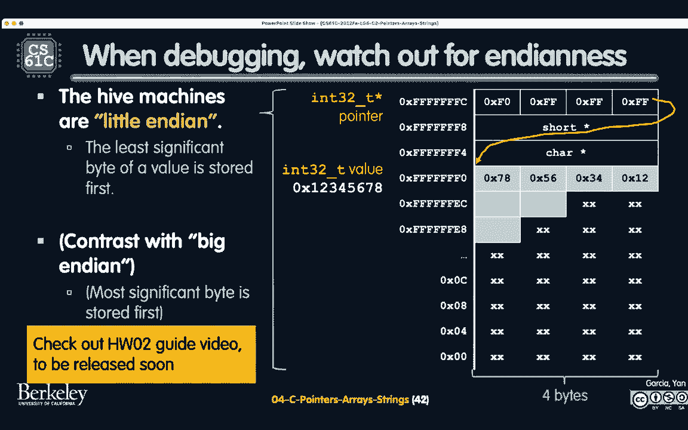

我们还探讨了与之相关的常见陷阱，如野指针、数组越界、以及内存对齐和字节序等底层细节。掌握这些知识是写出正确、高效C程序的基础。在接下来的课程和项目中，你将有机会大量练习这些概念。