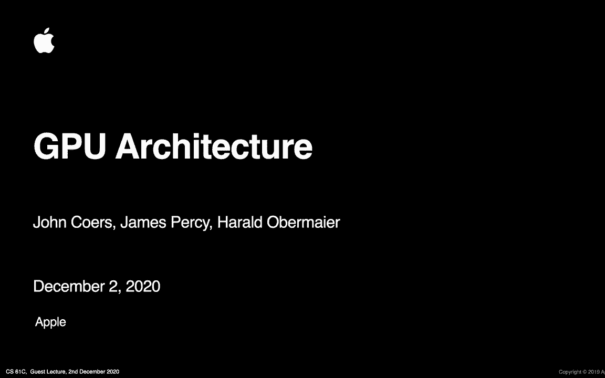
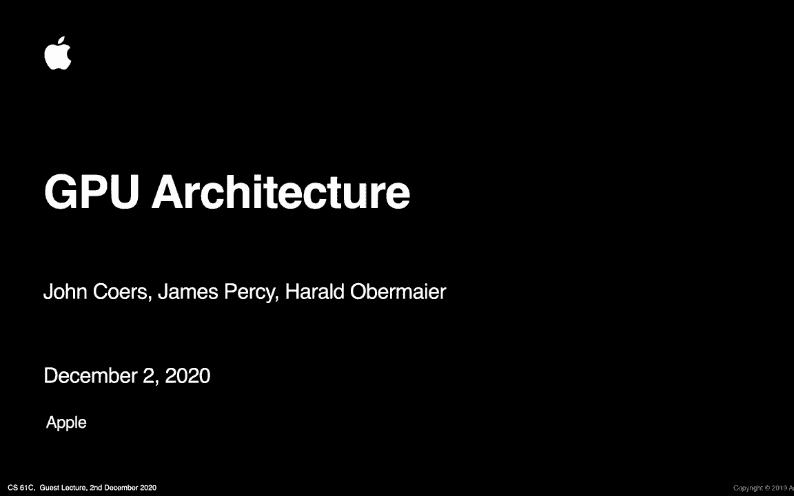
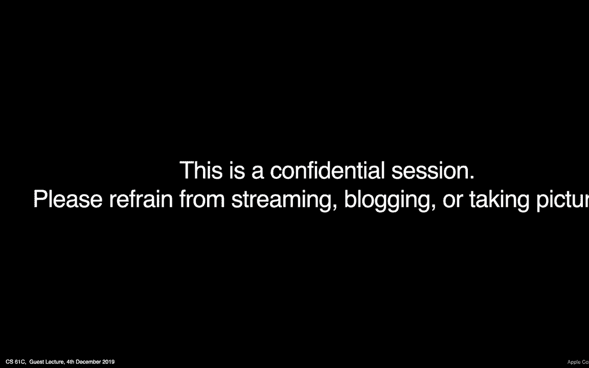
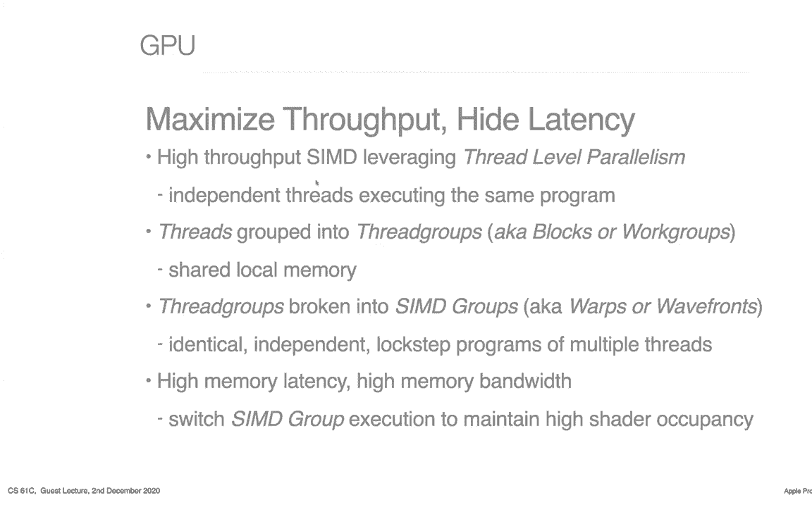

# P50：Lecture 39： Guest Lecture with James Percy from Apple - 这样好__ - BV1s7421T7XR

实际上我们可以看到詹姆斯，是呀，是呀，詹姆斯是黑暗的，哎呦，他还在，他好多了，他是更好的，我们好了就好了，是啊，是啊，好啦，好啦，好啦，女士们先生们，欢迎来到倒数第二堂课，我们很棒的主人的客座演讲。

来自苹果的James Percy谈GPU架构。

好开心，所以说，我要停止我的相机，确保加上詹姆斯的相机。

在他的聚光灯下，现在你加入了，我把我的拿出来好吗，詹姆斯，该你了，谢谢你，谢谢你，Rnn，呃评论，詹姆斯，该你了，欢迎光临，非常感谢你来分享我们，Gpus是如何工作的，他们是什么。

实际上不得不对它们进行编程，这是非常令人兴奋的事情，我想同学们都在等着看，这么好的东西，那是摇滚乐，谢谢你的介绍丹，所以是的，我们今天将讨论GPU架构，这是一个演讲，我和我在苹果约翰的两个同事。

在我们开始之前，核心和哈罗德·迈耶已经在一起了。

我有，我们确实有一个，呃，背景要覆盖的东西，我知道我们是为伯克利人录制的，但在课堂上我想提醒大家，请勿录制、张贴或流媒体任何幻灯片，或因保密目的而拍照。

所以我把它拿走了，我现在应该更好的照明，那么我们今天要讲什么呢，所以我想概述一下，什么是GPU，他们为我们做什么，我们将讨论一些关于图形管道的细节，高层，我们将讨论一些主要的主要阶段。

谈谈gpu内部的可编程性，为什么这种可编程性很强大，然后我们将遍历一个编程示例，希望我们能试着，我会试着在我的Mac上运行一个现场演示，嗯给你们看看，嗯GPU的力量，当谈到并行编程时，我们能做什么。

一路上问问题，直接进入聊天框，丹会帮我监控的，我们也会试着在最后留出一些时间来回答问题，那么首先什么是GPU，嗯，嗯，回答这个问题的一个好方法实际上是将它与CPU进行比较。

我相信你们中的许多人都熟悉CPU架构是什么样子的，坦率地说，CPU架构更容易考虑，我是说它们本身就很复杂，有很好的理由，Um和gpus也很复杂，但出于一些不同的原因。

所以我这里的显然是一个非常程式化的版本，左边是CPU，右边是GPU，与非常相似的组件，这些组件是彩色编码的，在一个非常高的水平上，你可以考虑，嗯，希望你能在这里看到我的光标，CPU的工作方式是。

有一大堆，说明，有一些执行单元实际上做数学计算并运行这些指令，它有记忆作后盾，通常是分层的哈勒级缓存，然后是一个存储系统，一般的想法是从CPU中获得更好的性能。

您希望通过所有这些不同的步骤来最大限度地减少延迟，事实上，现代CPU，的，您测量的从这些执行单元到内存的延迟周期数，是你表演的关键部分，这不是决定你表现的唯一因素，但这是一个非常重要的作品，嗯。

Gpus也有类似的担忧，你可以看到这些盒子的风格，你有很多很多的执行单位，你有更小的控制单元，可能更简单，但你有更多的人控制着所有这些执行单位，然后你还有这些小缓存。

这就是这些黄色的东西与每个控制单元的联系，他们都有同样的支持，同样的，这里的关键点是，我们将深入了解这实际上意味着什么，但这里的关键点是这些蓝色方块被乘以很多很多倍，所以当你看到CPU复合体时。

你可能有两三个或四个，在给定的芯片或SoC上甚至可能有多达八个CPU内核，在现代大型GPU上，你可以很容易地上升到100多个，这就是关键的区别，这就是我们最大的相似之处，呃，并行编程的提升。

我们从GPU中得到的东西，所以我们要从GPU中获得最大的性能，你真正的，您的目标实际上是通过所有这些蓝色执行单元来最大化您的吞吐量，或者换句话说，你有一份名单，您想要优化的所有这些并行处理单元。

尽可能多地使用它们，我们要谈的是，当我们经历这个演示时，很好地映射到屏幕上移动的像素，你可以想象，如果你有一大堆像素，您可以将它们分布在这个执行单元数组中，它们可以在某种程度上并行执行。

这就是我们今天要讲的内容，所以这张幻灯片是对，我刚才说的，我关心的一些，嗯，就像我们试图优化CPU和GPU性能一样，我谈到了，CPU上的核数，我们通常在GPU频率上有更多，我们通常更关心CPU上的。

这些天没那么多了，但是在90年代末和2000年代初发生了频率战争，在那里，我们所关心的CPU性能只是推动最大频率，Gpus不是推动最大频率，而是推动最大吞吐量，这就是我们在上一张幻灯片上谈到的。

我不会把这张幻灯片上的每一行都看一遍，但要指出几点，嗯，投机和执行命令很重要，尤其是，如果您了解过CPU体系结构，gpu上的推测和执行顺序趋于简单，比在CPU上，CPU是一个非常可怕的逻辑。

在一个花在周围的领域，我怎么做，如何进行分支预测，如何重新排序指令以最大限度地提高性能，Gpus通常不会简单地做到这一点，因为，在执行单元的数量上进行这些优化，我们在前面的图表中显示的是非常复杂的。

伸缩性不是很好，所以这不是我们试图优化的东西，优化GPU上的ON，结果是我们的动作执行控制变得更简单，我在这里要提到的最后一件事是一致性，在CPU上也差不多，有一个，尤其是当您有一个多核CPU复合体时。

在管理一致性方面有很多复杂性和花费的精力，跨多个CPU威胁，有充分的理由，您希望有一个相对简单的编程模型，对于GPU，我们有一个更复杂的软件编程模型，稍后我会展示一些例子，一致性倾向于软件管理。

这意味着您有两个不同的线程需要相互通信，由程序员或开发人员来管理这种同步，确保数据一致性，所以詹姆斯，有一个非常有趣的，布莱恩提出了一个很好的类比，他听到一个比喻，CPU就像数学教授。

而GPU就像小学生的教室，而你却给他们俩出数学题，但你想把复杂的问题交给教授，许多对学生来说容易的问题，你对这个类比有什么看法，我喜欢，布赖恩，这是一个有趣的类比，我想如果你，你知道的。

如果你在一天结束时的目标是得到尽可能多的简单，呃，数学题在尽可能短的时间内完成并足够短，那是个很好的类比，因为你真正想要的是，是一群小学生，他们可以平行地曲柄，一堆简单的问题，简单的问题，是啊，是啊。

即使是最聪明的数学教授也跟不上，和一百个聪明的学生在一起，嗯，如果你只是快速通过基本的数学题，所以从这个角度来看，我想那是一个，这是一个很好的思考方式，爱它，爱死它了，谢谢，所以最大化吞吐量。

隐藏潜伏期，我们已经讨论过吞吐量，我们想优化，我们想尽可能多地使用这些执行单元，你们中的许多人可能听说过一个叫辛迪的东西，Cindy是并行编程中一个非常重要的概念，代表一条指令，多个目的地或多个数据。

这意味着你。

你有一套指令，您将在一个大数据集中执行，所以每一个元素，例如，你有一个屏幕上有一堆像素，屏幕上的每个像素都将执行相同的指令，这给了你我们所说的线程级并行性，所以通常你会听到线程，或工作组，或翘曲。

或者类似的事情，嗯，一般来说，您放入线程中的工作都将执行，一样的，同样的指令，GPU的工作和GPU的复杂性是管理，那么我该怎么做，我如何在所有这些不同的执行单元之间安排工作。

这样我就可以在我拥有的所有数据中获得最大的吞吐量，以及我需要安排的所有不同的指令，所以这才是真正的意义所在，有很多复杂的，嗯，你知道的，这些东西是如何访问内存的，嗯，你怎么，呃，这又回到了当前的一致性。

你是怎么安排的，他们是如何交谈的，嗯，一些复杂性落在程序员和驱动程序上，其中一些落在硬件上的心脏上，这里还有一件事要提，重要的是它的内存带宽方面，在内存带宽方面，我们将在概念中讨论。

在像素、游戏和图像的背景下，嗯，但通常gpus可以访问非常高的内存带宽，在GPU上有更高更多的内存带宽，对不起在CPU上，原因是如果你想象一个游戏，如果你在玩游戏，你需要刷新你的屏幕。

每秒钟30次让你的游戏看起来很好，就在那儿，你需要刷新你的屏幕，你需要触摸屏幕上的每个像素，但最重要的是，你需要渲染它背后的一堆东西，我会告诉你渲染是什么样子的，所以你来回移动数据来生成这些，呃图像。

一秒钟多次，所以你需要有很高的内存带宽来做到这一点，有效地做到这一点，所以很多GPU的挑战和优化都围绕着，减少内存带宽，我们如何移动更少的数据，我们如何拥有缓存层次结构来减少。

从芯片上移动到芯片外的数据存储器，我应该说从芯片到物体，所以这些都是基本概念，让我们来谈谈管道是什么样子的，以及我们如何应用这些概念，所以在很高的水平上，GPU实际上由四五个主要部分组成。

这是顶点处理部分，我们在那里处理顶点，我们正在对它们进行一些计算，我会更详细地解释其中的每一个，有有光栅化，我们把三角形，显示在屏幕上的单个像素，有碎片处理。

我们可以在单个像素上运行程序来生成它们的颜色，然后是帧缓冲区部分，我们实际上将像素输出到内存中的缓冲区，所以它们可以显示在屏幕上，一个细节，我掩盖了，我在片段处理的上下文中提到过它，但是对于顶点处理。

您还可以在每个顶点上运行单独的程序，现代GPU实际上使用相同的硬件，这就是你在左边看到的统一着色器核心，在这里运行这些程序，这真的回到了我之前谈到的并行编程模型，为了每秒处理数百万像素。

每秒可能有数百万个顶点，你需要有一个大的计算能量引擎来运行这些程序，所以你得到的，你所看到的，在右边这个程式化的例子中，这些在单个像素中，这个，这些红色的家伙，这些蓝色的家伙，这些绿色的家伙，例如。

它们中的每一个都可能运行一个程序来生成这些最终的像素，把它们写在记忆中，所以一个思考的方法是，如果你在玩游戏，你在屏幕上看到像素，你可能是，嗯，屏幕上的每个像素都在运行一个程序。

现在他们可能在运行相同的程序，一样的，所谓的像素着色器，但他们都在运行一个程序，这就是GPU的美妙之处，并行处理，在一天结束的时候，我们将通过一些例子来说明，建立这个框架。

你会得到一个看起来像这样的图像，你有这样的对象，呃，这种独角兽，中间闪亮的独角兽，你有背景，嗯上面有烟火，你有这些，背景中的这些物体，上面有M，代表金属，这些是这些是纹理，我来解释一下什么是纹理。

你得到了这个表面，这有点反映了，那些是基于纹理和照明模型的，所以我们将讨论一些，制作框架的细节，像这样的框架，所以让我们进入管道，再深入一点，如此典型，嗯，如果你在做游戏，你有一个你的世界的模型。

或者你至少有物体，你有由三角形组成的模型，所以有人会给他们的游戏编程，嗯，在图形API中，例如金属，这就是我们在苹果上使用的，苹果设备，他们是，他们基本上会输入他们的模型，或者他们的顶点在游戏中的位置。

给他们描述一下他们是如何联系在一起的，它们是如何变成转弯和三角形的，嗯，所以我们要，我们要运行我们的顶点，处理我们的房间，我们说过要生成，把这些单独的顶点变成三角形，让我们召集集会。

你会注意到我们有这样的世界，这里的立方体或或或或形状，我们实际上剪掉了这个三角形的一部分，它没有被渲染，所以我们经历了一个剪裁模型碎片的过程，我们看不见，我们光栅化或扫描，转换它们，你可以想象一个过程。

如果你有一个给定的三角形，你在屏幕上的每个像素上从左到右走，和说嘿，这到底是不是在我的三角里面，如果是的话是的，你把它呈现出来，如果不是你，你把它扔了，那不是，这不是一个很好的优化算法。

但这是一个可行的算法，你可以概念化你如何，嗯，如何将三角形转换为单个像素，然后我们进入碎片处理，我们有的地方，我们做照明算法，我们要搜索三角形内的每个像素，我们要计算一个照明方程，我们可以把它。

我会解释这意味着，从记忆中提取纹理，你可以计算效果，你基本上可以做任何你想做的事情来生成最终的像素，然后我们把它们发送到我们的屏幕上，所以让我们深入一点顶点处理，我们刚才看到的场景，这是画好的。

在底部有个叫线框的东西，你可以看到独角兽，你可以看到这个形状，如果你仔细观察，你可以看到所有的东西都被分成三角形，即使是背景中这些方形的形状，如果你仔细观察，大家可以看到，可以看到对角线。

所以它被分成了一个三角形，原因是三角形是平面的，它们对硬件来说要容易得多，呃，一起工作，而不是真正的三D三D形状，所以我们需要做的第一件事是我们需要得到我们的，我们的独角兽进入了世界的右边。

所以你可以用顶点着色器来做到这一点，通过在独角兽上做一些转换，你可以旋转它，你可以翻译一下，意思是移动它，你可以在x、y或z维中拉伸它，这基本上就是顶点着色器要做的，它也将把世界，在世界上放置一台相机。

所以你可以想象，如果我们在游戏中绘制渲染这个，这个相机可能就像相对于独角兽所在的地方移动一样，或者独角兽可能相对于摄像机四处移动，嗯，这并不重要，顶点着色器将获得世界上所有的对象。

通过这些转换到一个特定的地方，这样我们就可以从屏幕上呈现出来，只是想把这和学生们现在所做的联系起来，他们正在研究一个更快的矩阵，倍增，这正是这里正在发生的事情，变换矩阵矩阵是四乘四矩阵，像素矩阵是。

但是，你得到了很多顶点，基本上是那个非常高的矩阵，乘以四乘以四，这就是一切的原因，就像这正是GPU的本意，在我们有通用GPU之前，我们的GPS知道如何快速完成，拿着这些，把这些点转换成正确的空间。

真的吗，这正是他们优化的目的，你们可能知道的所有转移，可以表示为四乘四的大调，你可以把前乘法，你知道这些矩阵在一起，这就是你在真正的顶点上所做的，着色器来做这些计算，对不起，或者我认为你和没问题。

我们的学生不，不管是幸运还是不幸，不要编程一个GPU，这一次，他们只是在过去的好时光里得到了一个松懈的扩展，当我学会这些东西的时候，Gpus实际上有我们所说的固定功能硬件来进行这些转换。

所以这意味着你会编写一个矩阵，不完全是这样描述的，但你基本上编程嘿，我的旋转变换是什么，我向GPU的翻译转换是什么，你会把它反过来，然后它就会帮你做转换，在后面吐出三角形，这基本上就是现在会发生的事情。

而不是有固定功能的硬件来做到这一点，做这些特定的乘法，这些东西是在我们所说的Vera文本着色器中表达的，意思是你可以用任何你想要的转换来编程，不管是多是少，不管是什么矩阵，只要他们做这些转换不是荒谬的。

好啦，让我们来谈谈几何学，嗯，我会选择，在这里试着加快步伐，几何处理，所以我们把我们的三角形，我们现在已经组装好了，我们把原始组装成三角形，所以我们不再真正处理单个顶点了，我们在处理三角形，有一点细节。

我会很快地复习一下，但有一件事，并不是所有现代GPU都能做到的，他们实际上会把屏幕空间中的三角形，这就是左边显示的，然后把它们捆起来，这就是右边想要代表的，所以右边这张图片代表的是浅色。

或者白色代表三角形的复杂性，你可以在这里看到的是我们映射到独角兽头发的地方，这里有很多小三角形来做头发，尾巴也一样，所以你可以得到一个近似值，这个场景的渲染成本有多高，仅仅基于三角形的数量，然而。

如果你进入背景，有零三角形，所以它只是黑色的，或者在我们这里展示的这两个表面上，三角形不多，所以他们是，它们是灰色的或接近黑色的，嗯，这一点很重要，原因有很多，嗯。

它可以让你估计渲染那片场景的成本有多高，这可以帮助你分配工作，回到我们之前的话题，在那里一切都是关于优化机器的吞吐量，我们可以用它来估计，嘿嘿，这个场景会很贵，所以说，我们希望能把这一幕，很多执行单位。

所以并不是所有的GPU都是这样操作的，但是许多现代GPU做得很好，所以光栅化，所以我们已经我们现在在台阶上，哪里嗯，我们得到了我们的三角形，我们要去，我们要做一个叫做扫描转换的过程，扫描转换是一种。

我之前提到过，它把三角形转换成单个像素，所以你可以想象一个算法，也许我从这个开始，这个顶点，我沿着边缘走，然后直到我遇到另一个边缘，然后我走过去一点，我走回去，那基本上是扫描转换，我把这个三角形。

我把它变成了单个的像素，为了这次演示的目的，我将跳过Anti-Sing，但你可以想象沿着这些边缘，你实际上可以创建更多的样本来制作更高质量的图像，如果你想，所以一旦我现在弄清楚了我的像素，我要好好想想。

我该怎么做，我要怎么给它们上色，这一步叫做碎片处理，嗯所以嗯与，呃，与每一个，我们现在有这些，屏幕空间中的这些三角形，我们还携带深度信息与每个像素，我们可以做一个深度测试。

深度测试基本上告诉你我的三角形是否可见，所以如果你有两个像这样的三角形，在屏幕上显示，他们和这个相交，假设左边的这个在后面，你不需要渲染那个三角形的部分，大多是，嗯，如果它没有显示在屏幕上。

所以我们就把它扔掉，只渲染上面的三角形，嗯，所以这就是深度测试，然后场景的其他部分可能只是不成文的，所以我们可以为每个人储存一点，每块瓷砖还是真的，意味着屏幕上的每个像素，嘿嘿，就是这个清亮的颜色。

我们不会碰它的，我们不必对那个特定的像素做任何事情，所以现在是真正有趣和令人兴奋的部分，哪个是哪个是阴影，所以我们讨论了这个，这个执行顶点片段的通用统一着色器核心，我们没有谈论计算机。

但我们会在硬件上增加一点着色器，着色器让你指定，你要运行的每像素算法来进行照明计算，因此，只是为了给出一些关于这可能是什么样子的见解，有没有一个茶壶的例子，在左边你可以看到，只是很简单。

它是黑的还是白的，没有，它没有有趣的阴影，基本上就是，看起来很简单，右手边是同一个茶壶，但它被一个带有镜面照明的，这意味着，你可以看到茶壶顶面反射的光线，取决于光线来自的角度。

这给了它一些有趣的阴影效果，你可以在顶部的把手上看到，然后在这里放一点黑啤酒，所以这是一个相对简单的照明算法，但它确实需要相当多的计算，你得计算一些角度，你你需要，你需要做一个纹理查找。

我马上就会解释什么是纹理查找，去计算一下，你需要对每个像素都这样做，或者在屏幕上，所以这不是一个便宜的计算，这又回到了一个事实，我们之前说过的Cindy算法，这个茶壶上的每一个像素。

我们要去运行这个程序在这里，我们可以并行地做到这一点，所以它发生得很快，而不是你在CPU上一次给我们做一个像素，它需要它需要，可能需要更长的时间，这就是拥有专用GPU硬件的美妙之处。

我得到的这个链式程序就是一个例子，下面右边是用金属写的，它也是苹果的编程语言，苹果硬件，你可以看到它在计算一个基于，基于一个正常的，它在做点积，正在做一个纹理查找，以找出弥散的颜色，呃。

根据光的计算角度，这就是它输出的内容，这基本上就是我们要做的，我们要把这个茶壶的每一个像素都遮住，有一种现代的训练，语言要复杂得多，最初我们可以做一些简单的数学，数学运算，在纹理查找中，嗯，这些年来。

为了获得更好的计算操作，它们变得更加复杂，矩阵乘以，嗯啊，神经，做神经网络的特殊说明，任何与并行处理有关的东西，IS现在是现代GPU着色语言的一部分，我之前提到过连贯性，还有进行同步的说明。

所以你可以等其他线程完成，所以你可以同步数据，有一些有限的预测，你不会想把一吨，如果您的内部有其他声明，您的着色器程序，这对性能不好，但有一个，呃，有一些对谓词指令的支持，这就是我们接下来要讲的。

呃在最后，我希望给你看一个节目的现场演示，在cpu和gpu上运行，所以要更多地讨论执行模型，嗯，所以我说了我们要怎么，我们将对每个接触过的像素执行这个片段着色器，所以这个茶壶上的每个像素。

我们将以一种方式做到这一点，利用线程级并行性，这意味着对于每个像素，我们将对多个数据运行相同的指令，所以我们回到我们的SIMD概念，所以如果我们要这么做，想象一下这个。

我们的这种正方形是这个茶壶的放大部分，嗯，你可以想象一个算法，我们一次走一个，从左到右，对这个正方形内的每个像素，我们运行程序，会成功吗？但它显然很慢，因为它一次只做一件事。

所以Simi Simi机器的想法，你有一组在锁锁锁步中工作，打扰一下，所以你可能只是作为一个简单的例子，在这个大正方形里，四人一组，二乘二的子正方形，你要执行同样的指令，同时为这些像素。

然后是一个简单的例子，你只是执行简单的指令，他们只是要执行，一二三四步调一致，锁步，同时完成，现在你不能再举更复杂的例子了，我要稍微掩饰一下，你可能会有一个像素，必须运行高延迟纹理获取或延迟操作。

这意味着你必须把所有四个像素，所以你把它们脱下来，你拖住他们，这就是这张图想要显示的，你去找一套不同的工作去跑步，因此，您可能会找到一个不同的线程组，您可以执行，我可以在这个高延迟操作运行时取得进展。

这就是很多复杂性的地方，坦率地说，GPU有趣的部分是，因为您要管理机器中运行的数千个线程，并试图在一个，以最好的方式填满机器，对于一个非常困难的问题来说，这是一个非常困难的问题，我将简短地谈谈纹理映射。

所以我有时间去演示，所以我一开始就提到了，在我们的小马的背景下，我们有烟火，我们也有这些M出现在这些表面上，嗯，此背景不是以编程方式或动态生成的，作为渲染算法的一部分，这些是预先存储的图像或纹理。

你可以做的是当你有像这样预先存储的图像时，就像这些烟火，您可以将它们映射到您的渲染图像中，所以你可以想象有一个大三角形或抱歉，后面有个大广场，你要做的就是把你的世界里的每一组像素，把它们弄成这样。

这基本上就是纹理单元或纹理映射所做的，它是将屏幕上的像素映射到纹理中的像素吗，现在呢，这实际上会产生一些非常有趣和具有挑战性的示例问题，你可以想象如果这个图像很小，与您想要在屏幕上呈现的大小相比。

你有你有一个问题，如何对正确数量的图片像素进行采样以显示，同样，你也可以有相反的问题，在那里你有一个非常大的图像，你在屏幕上很小的区域取样，所以有很多硬件内置在纹理单元中，全力做好采样工作。

这是一个例子，这表明你在棋盘格上画了一个正方形，然后你把它映射到一个又高又瘦的东西上，你可以看到这样做的结果，映射是你的漂亮正方形，图像现在是一个数字，一些长方形，这基本上就是纹理硬件要做的。

这是一种更先进的，它被称为各向异性滤波滤波模式，如右手边所示，这就避免了你在顶部屏幕上看到的一些奇怪的工件，但那是呃，这可能有点超出了今天的演示文稿，这就是我们之前提到的反走样，那是反的一个版本，好啦。

所以我们的最后一个阶段我们需要得到这个，把我们处理过的所有像素，把它们记在心里，所以通常会有一个指令，不一定暴露在开发人员面前，但在某个时候，你得到了所有这些像素，通常在芯片上的缓存中。

您需要将它们实际写入帧缓冲区，然后告诉帧缓冲区，告诉显示器，通常嘿我的形象，我的渲染完成了，把这些数据拿出来放到显示器上，这就是输出阶段，那里还有一些台阶，有混合测试，有一些模具测试，我稍微掩饰了一下。

但那才是真正的，呃，它的要点和你在上面看到的，这张图片的右下角是，这是一种帧缓冲区，就像中渲染一样被捕捉到了，所以一些瓷砖或一些像素已经完成了，你可以在屏幕上看到他们，别人都没有这样的你。

所以你基本上需要等到所有的工作完成，在你说你准备好展示之前，好啦，所以让我们来看看我们的例子，我想离开，呃，大约十分钟，最后提问，我想给你们看的是萨克斯圆周率算法，在CPU和GPU上运行。

实际上比这更简单，我们只是用C语言实现一个函数，它需要一个数组x的浮点，将该数组中的每个元素乘以浮点a，并将其输出到输出数组y，所以我们要遍历整个数组，而且做起来非常简单，我们甚至没有做额外的部分。

所以我们只做乘法部分，所以我们要在一个单独的CPU上用C来实现这一点，我们将在GPU和金属上做类似的事情，所以这种代码段是，对你们来说可能没有C程序那么熟悉，但它本质上做了同样的事情。

我有一个数组x和输出缓冲区y，我要把它们乘以，所以它有同样的功能，只是一种不同的语言，那么这看起来像什么，所以，我将尝试在一秒钟内交互式地做到这一点，但基本上这一个结果，我向你展示的是。

这里正在经历许多不同的缓冲区大小，嗯，所以它真的是我平方，所以你可以在这里看到缓冲区的大小，下一栏是，GPU完成计算所需的时间，然后最后一个，最后一列是CPU完成计算所需的时间，所以有几件事你会，呃。

当您查看这些数据时，您会注意到，当你非常清楚地到达底部时，一次，当您的缓冲区大小变得非常大时，GPU显然击败了，CPU的性能，完成这些操作所需的时间更短，交叉点是它在哪里，这是一种，就在这附近。

我们看到的这个区域，GPU开始被打败，CPU，你会注意到CPU做了很多，好多了，嗯，在比GPU更小的缓冲区大小上，而且真的，这告诉你的是，GPU不擅长做一些小块工作，原因是，有很多开销。

设置和启动GPU，尤其是在这个平台上设置运行计算，所以你可以看到，当我经历最初的五六次跑步时，所需的时间大致相同，实际上它在上下摆动，你知道的，系统中发生的其他随机事件，但一旦我们到了这里。

嗯时间开始增加，所以这告诉你的是，这里有一些固定的GPU开销，而且CPU要好得多，原因很简单，我们没有得到并行处理的任何好处，对于这些非常小的缓冲区，所以对于非常小的简单的工作，你的CPU会做得很好。

一旦你开始做数百万或数亿个元素大小的工作，GPU会做得更好，那么为什么那口井可以追溯到我们的，我们在这次演讲中一直在谈论的是SIMD处理，所以如果你回到过去，我和我会回到我们的例子。

CPU基本上在做我们在左手边说过的事情，这里，它实际上是在数组中运行这个非常简单的计算，一次一个，所以当这个，它需要进行计算的条目数量变得非常大，要花很长时间，GPU实际上正在执行，嗯。

缓冲区中的元素实际上是四个以上的组，大概三个，二六十四，甚至更大，所以我们要在，我们叫它六十四或六十四大小的大块，这意味着GPU将，会更快地执行这些指令，我们开始看到，随着缓冲区的大小变得非常大。

非常大，所以我将尝试现场展示这一点，我还在运行缩放和共享缩放，所以我们拭目以待我们拭目以待，但是你能看到的，假设我的电脑没有崩溃，这个程序是执行的吗，我们成功了，把它弄大一点，正在执行这个。

在谈话中很好地执行了这个现场，你可以看到，希望GPU的性能开始超过CPU，当我们走的时候，在那里，GPU开始击败CPU，CPU时间越来越长，我们现在大约是GPU的两倍。

大约三个X我能听到我的风扇升起来了，那里有，有一个问题是，新的M是否正在这样做，或者这是否会改变事情，我希望它是在M上做的，否，我奇怪的是我的，呃，我妻子有一个，因为我给她买了一个。

但背景是我为了工作而穿上这个，我相信是一个二千一八，基于英特尔的系统，我不知道确切的时间，准确的数字，但这是一个，这是一个英特尔集成的GPU，然后你可以看到当我们完成这里的时候，对于最大的CPU来说。

GPU几乎是CPU的七倍，最大缓冲区大小，这是一个非常简单的程序，事实上，精明的工程师可能会注意到，这个东西实际上没有做那么多计算，所以它实际上是，IS至少在GPU内存限制上，我们讨论了内存带宽。

早些时候，GPU在移动块方面要好得多，比CPU有更大的内存块，所以我们是，我们不仅受益于执行单元的数量，但是我们拥有的内存带宽，现在事实证明，我认为在我运行的这个特定的CPU上。

因为我们已经明确地说过要在一个单一的核心中运作，单线程方式，CPU核心很可能是Mascul，虽然我还没有真正测试过，好啦，这是我们刚才所做的曲线图，这显然不是我刚才做的实验，但你可以看到结果很相似。

所以我在周末跑了这个，没有缩放和其他东西在后台运行，这是一个对数刻度，所以请注意我们在底部有射线眼，运行时在y轴上以毫秒为单位，你可以在这里看到交叉点，然后再看到，记住这是一个对数刻度。

当我们达到这些非常大的缓冲区大小时，图形处理器在跳动，方便的CPU性能，好啦，所以让我们把它包起来，然后留出一些时间来回答问题，所以嗯，所以如果你从这次演讲中什么也没得到，嗯，请把这三点拿走，因此。

从GPU中获得效率和性能就是最大限度地提高并行性，通过并行性最大化吞吐量，你想运行并行程序，我们在做半操作，您正在多个数据上运行相同的指令，这就是GPU性能的意义所在，那里有，你知道的。

一些固定函数的东西来做专门的数学，喜欢喜欢纹理，但实际上我们优化的是通过并行性来最大化性能，像图像处理，为了为了，对于摄像机，做计算摄影，为了跑步，呃，图像检测算法，所以神经网络，神经网络，是啊，是啊。

要在GPU上完成，我刚问过特斯拉，恰到好处，和gpus现代gpus很容易扩展到做通用计算，所以像英伟达和AMD这样的公司在销售GPU方面非常成功，不仅仅是为了游戏，但对于建筑计算，gpus农场。

做机器学习算法之类的，所以这是一个，这是近年来gpus的一大增长因素，所以我就到此为止，希望你们觉得这个有趣，嗯，刚才有什么问题，这是伟大的詹姆斯，谢谢谢谢，谢谢你，谢谢你太好了，精彩。

我们有几个悬而未决的问题，嗯第一个是嗯，实际上管理GPU一致性的软件是什么，嗯，这会是操作系统内置的东西吗，或者如何管理一致性，确保你担心，嗯，线互相踩，这是个好问题，答案是应用程序和驱动程序的结合。

也就是说，编程和管理GPU的低级细节，所以如果你去看一个现代的GPI，GPU API，例如金属，例如，嗯，金属编程语言内部有一些设施，为您提供线程同步和内存同步的机制，这些高级设施被映射到低级硬件命令。

就像现金冲水或篱笆，或者是一个障碍，司机会把它转化为努力工作的人实际上可以理解的东西，所以也许要把它带回问题上来，程序员必须意识到这些同步要求，以及如何结合驱动程序管理并行编程。

因为如果你没有意识到这些事情，你就不会得到，在这种相同的话题上，一个好的回应是有意义的，你需要担心Gpus中的死锁吗，呃硬件组，意思是我的团队，嗯，在编程级别，你需要担心，从类似的角度来看。

你会担心挂一个CPU，通过写一个无限循环或两个循环，尤其是当你在做并行编程的时候，那种相互依赖，以可能造成僵局的方式相互依赖，如果您深入到硬件实现细节，实际上有各种各样的危险会导致死锁。

我们花了大量的设计和验证时间试图找到，要么在架构上避免，要么设置僵局打破器，你可以在硬件上调用它们，这样硬件就不会把自己锁起来，所以是的，它是，这是我们非常担心的事情，但这些就要来了，就像你回答的那样。

再问四个问题，你给我闭嘴，学生们，学生，学生们做得很好，我们这里有七十个学生，嗯，理想的关系是什么，或者，有理想的关系吗，在像GPU中的像素数和执行单元数之间，也许当你去六千八百公里的时候，那怎么会。

你知道的，有一些，Gpus不能驱动8K屏幕是有一些限制的，那只是在屏幕上说话，但是就计算而言，你对地图了如指掌，也可能是一个好的一个好的，那是一个，这是个好问题，GPU处理的好处是它的伸缩性非常好。

尤其是如果你的分辨率超高，八个K显示器，那你会想要，尤其是当我们在玩游戏的时候，你想要高帧率，你现在会需要一个大的GPU来驱动它，嗯，没有固定的关系，你可以有一个小型的现代GPU，驱动四K或八K显示器。

嗯，你只会在比赛中得到更少的表现，如果你在玩游戏，你可能不会得到每秒30帧，所以你的游戏可能看起来不稳定，打得不好，所以没有固定的要求，如果你愿意，嗯，但当然，如果你要运行一个复杂的现代游戏。

在非常高分辨率的显示器上，你会想要一个更大的GPU，有更多的核心来获得良好的游戏体验，所以我有点是的，我和我不明白用户对，每秒120帧，我觉得我的眼睛做不到，是呀，有很多争论，大约三十六年是二十赫兹。

甚至有用的好，电影里也有，我的意思是指环王，有60或120个，我就想等等，这看起来电视在这里看起来有点不同，完全正确嗯，这是艾德丽安提出的一个很好的问题，有哪些令人惊讶的应用。

在我们可能意想不到的地方使用GPU，哦哇哦，那是一个，这是个奇妙的问题，是啊，是啊，我爱他们，我不确定这些天来这是否令人惊讶，但如果你看过，如果你开特斯拉或者开过特斯拉，我对特斯拉没有什么秘密。

我不知道特斯拉的任何秘密，所以就把它扔出去，嗯，但我的理解是，他们使用GPU硬件在我们的房间里进行大量的图像处理，用于自动驾驶，所以你会发现你会在汽车上找到GPU，你会在很多地方找到GPU。

几年前你不一定会想到他们，在任何现代手机上也是如此，我不是专门说苹果，但在任何现代手机中，会进行大量的计算摄影，这是一个很好的观点，这是一个很好的观点，运行GPU以生成或混合图像以生成图像，对呀。

所以摄影不仅仅是像嘿，我的传感器有多少万像素，关键是你运行的算法有多好，你能做多少，你和其他马力你必须运行这些算法，例如拍照的人可以在不到一秒钟的时间内看到它，所以它是交互式的想象，如果你在拍照。

最后一张照片花了十秒钟才出现，对于一个手机类型的用例来说，这不是很有趣，所以GPU在那个空间里也很重要，尤其是使用hdr图像，我的意思是你可以你可以压缩，你知道色调映射，你有屏幕的亮部分和屏幕的暗部分。

但是GPU可以同时或按顺序拍摄许多照片，然后把它们压缩成一个只捕捉高潮和低谷的，减小动态范围，我喜欢它，嗯，我知道这是顺便说一句，我得到一个，呃，你知道吗，有一件事令人惊讶，呃，是比特币挖矿，比特币。

你知道比特币挖矿基本上是因为，你知道吗，几年前，它的价格很低，Gpus已经卖完了，我是说不可能买到一个更低的，因为它们都很迷人，我不知道，是啊，是啊，现在你可以买到便宜的专用硬件，使这些哈希函数更有效。

那是呃，三年前，我想是12月比特币起飞的时候，你找不到高端的，GPU的人是，我们以数千美元的比特币挖矿价格出售它们，所以这是一个，顺便说一句，我正在看最新的Mac Pro，高端的GPU就像两千块钱。

只是他们自己，在价格之前，你知道增加，因为人们想，你知道的，买他们做这些事，高端GPS可能非常昂贵，嗯，我是亚当，一个很好的问题，我就知道会发生这种事，这太酷了，我们学生如何玩一些图形图像处理代码。

我们如何编写代码来使用GPU，我想第一个答案是买一个Mac，是啊，是啊，是啊，是啊，买一个Mac，我们有金属，苹果有金属编程指南和非常简单的入门示例，如果你只是谷歌，我应该在这里放一个链接。

但是如果你只是谷歌金属编程，比如介绍，有一些在线教程，你可以浏览并像嘿一样，我怎么写你好，使用金属的gpus世界，我相信英伟达和AMB在他们的硬件上也有同样的东西，使用其他语言，所以肯定有教程。

我想还有，嗯，库达和开放CL，是这样吗，那两个图书馆，那些是编程API，英伟达特有的CUDA，开放的CL蘑菇，这几天一套用得一样多，那是更开放的，API跨平台，我想它已经被库达和其他的东西取代了。

他没事，我再问一句，你用金属显示的代码，您可以在内置的CPU上运行，在笔记本电脑或高端Mac Pro上，用专用的两盒CPU，你需要担心这个吗，在那个级别，在金属层面，它只是它只是由，由抽象层，对呀。

那是很长的路，那是并行编程友好的，如果你的目标是手机内置的东西，这并不重要，或者如果你的目标是一个巨大的GPU系统，API会帮你处理的，现在真是太好了，不幸的是，我有，我想还剩下14个问题。

但我们答应过化学，它实际上需要这个，本次网络研讨会，就像现在，我们现在进入他们的网络研讨会两分钟，所以各位，让我们帮詹姆斯一把，非常感谢你来分享关于GPU James的想法，谢谢。詹姆斯，精彩，精彩。

精彩，很高兴你能来，谢谢再次感谢，杰出杰出讲座，有一个关于这些幻灯片的元问题，机密井，我们没有幻灯片的副本，但我们有，我们有网络研讨会，所以我们就留着它，他们可以通过网络研讨会观看幻灯片，我猜，是啊。

是啊，好啦，完美完美，非常感谢，好啦，保重，大家留在这里，如果你想看这个讲座，好啦，保重，每个人，再次感谢，詹姆斯注意安全，乡亲们太棒了。

