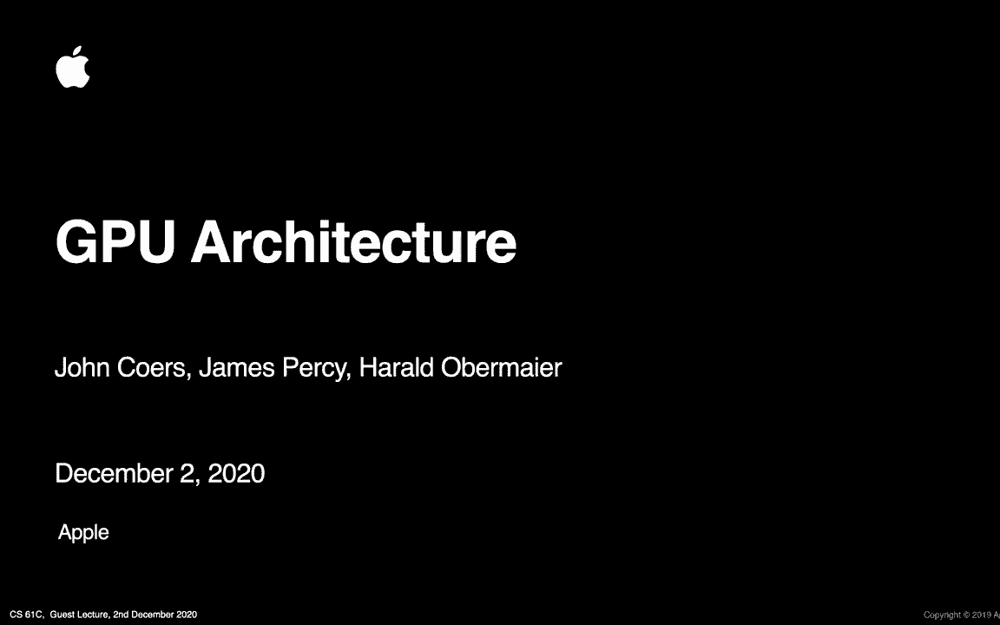
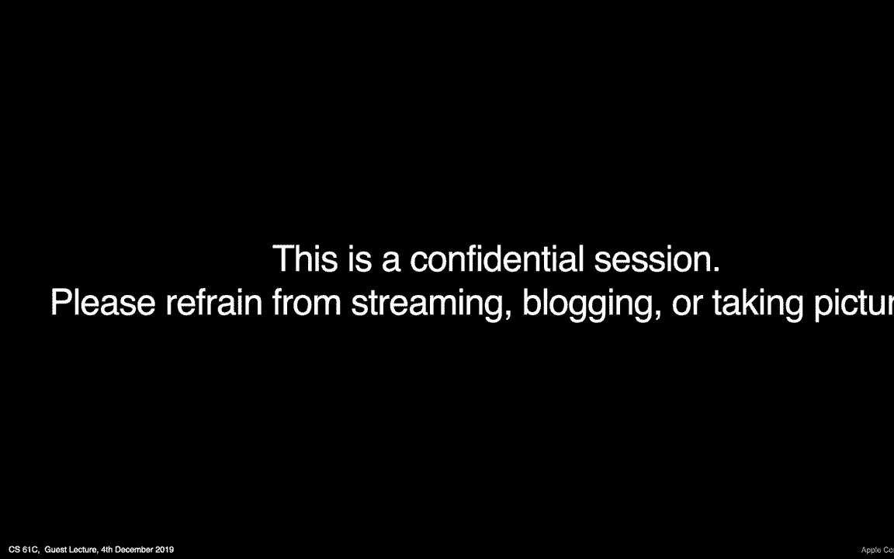

# 课程 P50：第39讲 - 与苹果公司 James Percy 的客座讲座 🎤


在本节课中，我们将学习图形处理器（GPU）的基本架构、工作原理以及它与中央处理器（CPU）的区别。我们将从高层概念入手，逐步深入到图形渲染管线的各个阶段，并了解GPU强大的并行计算能力。最后，我们将通过一个编程示例，直观地对比CPU与GPU在处理大规模数据时的性能差异。




## 什么是GPU？🤔

要理解GPU，一个好方法是将它与CPU进行比较。CPU架构本身很复杂，但更容易理解。GPU也很复杂，但原因不同。

下图是一个高度程式化的对比。左侧是CPU，右侧是GPU，它们有颜色编码的相似组件。

*   **CPU**：有一系列指令，由执行单元执行数学运算和运行这些指令。它有内存支持，通常是分层缓存和存储系统。优化CPU性能的关键是**最小化延迟**，即减少从执行单元到内存的周期数。
*   **GPU**：同样有执行单元、控制单元和缓存。关键区别在于，GPU中的蓝色执行单元方块被**大量复制**。现代大型GPU上可以有超过100个这样的执行单元，而CPU核心通常只有几个。

因此，从GPU中获得最大性能的关键是**最大化吞吐量**，即尽可能多地利用这些并行处理单元。这与CPU优化延迟的目标不同。

## CPU与GPU的设计哲学对比 ⚖️

上一节我们介绍了CPU和GPU的基本结构差异，本节我们来具体看看它们设计目标的对比。

*   **核心数量**：CPU核心数较少，GPU核心数（执行单元）非常多。
*   **频率与吞吐量**：CPU曾追求高频率，而GPU主要追求高吞吐量。
*   **推测执行与乱序执行**：CPU有复杂的逻辑进行分支预测和指令重排以优化性能。GPU的这些操作趋于简单，因为在大规模执行单元阵列上进行此类优化非常复杂且扩展性不佳。
*   **一致性管理**：在多核CPU中，硬件需要花费大量精力管理多个线程间的一致性，以提供简单的编程模型。在GPU上，编程模型更复杂，**一致性倾向于由软件管理**，即由程序员或开发者来管理线程间的同步和数据一致性。


## 最大化吞吐量与隐藏延迟 🚀

我们已经讨论过吞吐量，目标是尽可能多地使用执行单元。许多同学可能听说过**SIMD**这个概念，它代表“单指令多数据”。

这意味着你有一套指令，将在一个大数据集上执行。例如，屏幕上的每个像素都将执行相同的指令。这提供了**线程级并行性**。GPU的工作和复杂性在于管理如何在这些不同的执行单元之间安排工作，以获得最大的数据吞吐量。

另一个重要方面是**内存带宽**。GPU通常可以访问比CPU更高的内存带宽。例如在游戏中，每秒需要刷新屏幕多次，并渲染大量数据，因此需要高内存带宽来高效移动数据。GPU的许多优化都围绕着减少内存带宽需求，例如通过缓存层次结构来减少芯片外数据移动。

## 图形渲染管线概览 🎨

在高层面上，GPU图形管线主要由四到五个主要部分组成。

1.  **顶点处理**：处理顶点并对其进行计算。
2.  **光栅化**：将三角形转换为屏幕上的单个像素。
3.  **片段处理**：在单个像素上运行程序以生成其颜色。
4.  **帧缓冲区处理**：将像素输出到内存中的缓冲区，以便显示在屏幕上。

一个细节是，现代GPU使用相同的硬件（统一着色器核心）来运行顶点和片段处理程序。为了每秒处理数百万顶点和像素，需要一个强大的计算引擎来并行运行这些程序。在游戏中，屏幕上的每个像素都可能正在运行一个程序（像素着色器）来生成最终颜色。

## 深入图形管线 🔍

上一节我们概述了管线，本节我们来更详细地看看每个阶段。

### 顶点处理

在游戏中，世界或物体模型由三角形构成。程序员通过图形API输入模型顶点及其连接方式。

顶点处理阶段会将物体（如独角兽）放置到世界中的正确位置。这是通过**顶点着色器**完成的，它可以进行旋转、平移（移动）、缩放等变换。同时，它也会根据摄像机位置进行变换，以便从屏幕视角渲染。

**与课程的联系**：同学们正在研究更快的矩阵乘法。这正是顶点处理中发生的事：将许多顶点（可视为矩阵）与变换矩阵（4x4矩阵）相乘。GPU最初就是为了快速完成这类计算而优化的。

### 几何处理与图元组装

在此阶段，我们将顶点组装成三角形（图元）。并非所有现代GPU都具备的几何着色器阶段，可以将屏幕空间中的三角形分组，并估算场景的渲染复杂度（例如，毛发部分三角形多、成本高，背景三角形少、成本低）。这有助于分配工作，优化GPU吞吐量。

### 光栅化（扫描转换）

此过程将三角形转换为单个像素。一个简单的算法是：从三角形顶点开始，沿边缘移动，填充内部的像素。为了更高质量的图像（抗锯齿），可以沿着边缘创建更多样本。

### 片段处理与着色

现在我们有了像素位置，需要决定如何为它们上色。此阶段包括：

*   **深度测试**：判断三角形是否可见。如果两个三角形相交，只渲染前面的那个，丢弃被遮挡的部分。
*   **着色**：这是最有趣的部分。**片段着色器**（或像素着色器）允许你指定每个像素上运行的算法来进行光照计算。例如，计算光线角度、进行纹理查找等。茶壶上的每个像素都会并行运行相同的着色器程序，这正是GPU并行处理的威力所在。

现代着色语言非常强大，可以进行复杂数学运算、矩阵乘法，甚至包含用于神经网络或同步的特殊指令。

### 纹理映射 🖼️

在我们的示例中，背景的烟火和表面的“M”标志不是动态生成的，而是预先存储的图像，称为**纹理**。纹理映射将纹理图像上的像素映射到渲染物体的表面像素上。

这会产生一些挑战，例如纹理图像与屏幕渲染区域大小不匹配时的采样问题。GPU的纹理单元内置了硬件来处理各种滤波和采样模式，以生成高质量的图像。

### 输出合并

最后一个阶段是将所有处理过的像素写入内存中的帧缓冲区。通常，像素会先存储在芯片上的缓存中，然后被写入帧缓冲区。之后，通知显示器图像已渲染完成，可以显示。此阶段可能还包括混合测试、模板测试等操作。

## GPU执行模型与线程级并行 ⚙️

我们提到要为每个像素执行片段着色器。这是通过**线程级并行**实现的，即对多个数据（像素）运行相同的指令，回到SIMD概念。

设想一个简单情况：一次处理一个像素很慢。SIMD机器的想法是让一组线程（例如2x2的像素块）以锁步方式同时执行相同指令。

更复杂的情况是，如果某个线程需要进行高延迟操作（如纹理获取），它会被挂起，GPU调度器会寻找其他可以执行的线程组来运行，以保持硬件忙碌。管理机器中运行的成千上万个线程，并以最佳方式填充硬件，是GPU复杂且有趣的部分。

## CPU与GPU性能对比演示 💻

现在，我们将通过一个具体示例来对比CPU和GPU的性能。我们将运行一个简单的SAXPY算法（单精度αX加Y），即计算 `y[i] = a * x[i]`。

我们将在CPU（单线程C程序）和GPU（使用Metal API）上分别实现这个计算，并比较处理不同大小数组所需的时间。

以下是演示的核心代码概念：

**CPU端（C语言）伪代码**：
```c
for (int i = 0; i < array_size; i++) {
    y[i] = a * x[i];
}
```

**GPU端（Metal着色语言）伪代码**：
```metal
// 每个线程处理一个或多个数组元素
int i = thread_position_in_grid;
y[i] = a * x[i];
```

**预期结果与分析**：
*   当数组规模很小时，CPU表现更好。因为启动GPU有固定开销，且小规模任务无法充分利用并行性。
*   当数组规模变得非常大时，GPU表现显著优于CPU。因为GPU可以以SIMD方式并行处理大量数据块（例如64个元素一组），并且拥有更高的内存带宽。

这个简单的程序展示了GPU在并行处理大规模数据时的优势。

## 总结与要点 🎯

本节课我们一起学习了GPU架构的核心知识。

如果你从这次演讲中只记住三点，那么它们是：
1.  GPU的效率和性能来自于**最大化并行性**，从而最大化吞吐量。
2.  GPU通过**SIMD**（单指令多数据）模型运行并行程序，在大量数据上执行相同指令。
3.  现代GPU已高度通用化，不仅用于图形渲染，还广泛应用于需要并行计算的其他领域，如**图像处理、计算摄影和机器学习（神经网络）**。

GPU已经成为现代计算中不可或缺的一部分，从游戏、自动驾驶到科学计算，其强大的并行处理能力正在驱动众多领域的发展。

---
*注：本教程根据James Percy在伯克利大学的客座讲座内容整理，专注于技术概念讲解，已去除原讲座中的语气词和互动部分。*