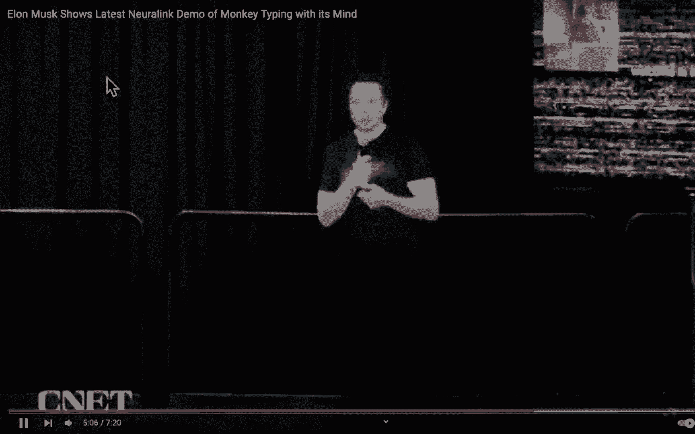
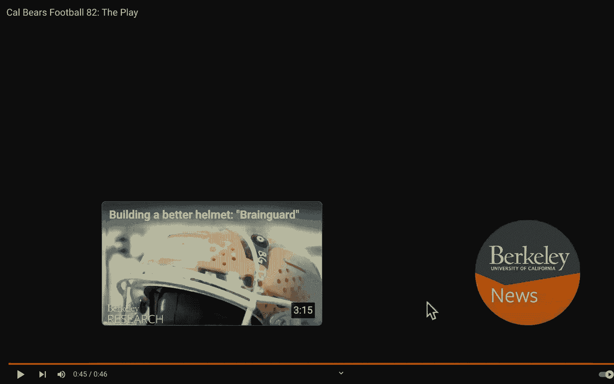

# P51：Lecture 40： Summary, What's Next？ - 这样好__ - BV1s7421T7XR

试试看，你听说任何东西在广泛的情况下都有效，负担得起，规模大，它是，这是疯狂的困难，嗯，有句老话说百分之一的灵感，百分之九十九的汗水，但我想可能是百分之九十九，但是九十九点，百分之九的汗水。

我能给出的最好的例子是容易的想法，如果执行起来很难，即将登上月球，是去月球的想法，容易，去月球很辛苦。

我们一直在努力，你准备好迎接我们的第一个人类了，显然我们要非常小心和确定，在把设备植入人类之前，它会很好地工作，但我们已经投降了，我想我们给食品和药物管理局的大部分文件，我们认为大概六个月后。

我们应该能够在人类身上建立第一个神经链接。

所以说。

但正如我所说，我们尽一切可能测试。

以前甚至没有进入过人类，即使进入动物体内。

所以我们做台面测试，我们做加速寿命测试。

我们有一个假的大脑模拟器，就像模仿大脑，但它有点像橡胶，所以在我们想把一个装置放在动物身上之前。

我们尽我们所能进行严格的台式测试，所以我们不会漫不经心地把设备放进动物体内，我们非常小心，然后呃，我们每次做植入手术时都想要这个装置，呃你，如果是羊或猪，或者一只猴子来确认，不是探索性的。

所以我们希望我们已经尽了最大努力进行了台面测试，只有到那时，我们才会考虑把一个装置放在动物身上。

他们做各种各样的任务，我们尽一切可能确保事情是稳定的和可复制的，像这样的东西设备可以持续很长时间。

然后呃，你看到的是它看起来像矩阵，但那是，呃，实际上那是神经信号的真实输出，所以这不是模拟，或者只是一个屏保，或者这些是真正的神经元在放电，这是其中一个读数，看起来像这里，你可以看到清酒。

是另一只猴子在键盘上打字，但现在这是心灵感应打字，所以说清楚，这实际上不是在使用键盘，他用意念把光标移到突出显示的键上，现在呢，技术上来说，我们实际上不会拼写，所以我不想夸大这件事，因为那是。

那是下一个版本，嗯所以，但真正酷的是，这是清酒，猴子在移动鼠标光标，只用他的头脑，将光标移动到突出显示的键，然后拼出我们，我们想要的，我想拼的，但是嗯然后，呃，所以所以这个，这是一个可以用于某人的东西。

谁是，谁说的，A，呃，四肢瘫痪病人。

甚至在我们做这个之前，脊髓的工作是能够非常重要的。

因为我们我想付钱给植物。

然后呃，我认为表明这一点也很重要，嗯，清酒其实很喜欢做演示，又不是绑在椅子上什么的，猴子们真的很喜欢做演示，因为他们有香蕉奶昔，这是一个有趣的游戏，所以嗯，我想聪明的做法就像，我们非常关心动物福利。

然后嗯，我很确定我们的猴子很开心，你知道的，做这个做这个。

好啦，你能变焦看到吗，有人能再检查一下变焦吗，阿黛尔。

你看到了吗你看到了吗，你看幻灯片，一切都好，好啦，所以让我开始吧，好啦，女士们先生们，欢迎回来面对面指导，我很想你们，女士们先生们，CS六十一C总结并落得很好，讲座，因为我就像喔，感谢大家的到来。

感谢大家冒着严寒，很高兴见到大家，我要把这个视频面板藏起来，这样就不会挡住屏幕，让我看看我是否能做到这一点，并隐藏加载和视频控制，好啦，我希望你们都能听到我，看到我。

好的变焦，在这个班上，这是一个强大的班级，我很自豪能掌舵这个，这堂课真是太棒了，教你这么多电脑是如何工作的，但也包括系统是如何工作的，如何成为一个更好的程序员，以下是你学到的六个好主意。

我记得一开始就告诉过你，我记得三个月前站在这里，当谈到这六个人和丽莎，我和她分享了舞台，你现在都看到了，你已经看到了所有的抽象层，从黏糊糊的到大海，冒五个险，到实现，五险一机，现在你越过ISA到硬件。

作为机器，谁知道这些片段意味着什么，我们一会儿再谈这个，一直到，你怎样把那台机器造好？让我们控制一下，是提线木偶，数据路径为，怎么，管道怎么样，怎么了怎么了，钻头如何顺利流动，如何构建ALU。

我们谈到了什么比那口井更鼓风机，什么是多路复用，你怎么能决定，你知道的，像个旗手，这里的数据还是那里的数据，我们学习如何建立它，你是怎么打那口井的，那是晶体管用完了，那是怎么工作的，我们一直谈到最后。

这是一件神奇的事情，你学会了所有的抽象，如果你问，他们能够登上月球，这是抽象的，抽象是所有工程中最有力的思想之一，计算机科学是工程学的一部分，所以我们当然讨论了摩尔定律和表现，在摩尔定律中。

如果你记得一条曲线，我向你展示了，在表演中，对不对，摩尔定律是…的指数增长，集成电路上晶体管的数量，人们总是感到困惑，因为所有的性能都在呈指数级增长，它也在生长，但是摩尔定律的字面意思是，哦哇哦。

每两年翻一番，然后它实际上变成了每18个月翻一番，我们看到了局部性原理，有多值钱，我们在两个缓存里都看到了这个，在那里我们可以使缓存的速度大小，但是整个内存层次结构的内存大小。

我们看到了我们也看到了在你的电脑上有很少的RAM的能力，但是一个大磁盘驱动器，但是您的系统可以认为它有磁盘大小的RAM，所以这是一种奇妙的幻觉，是抽象的，但这也是你得到的幻觉。

多亏了缓存和虚拟内存中的内存层次结构，平行性我们看到了多种方式，我认为五种不同的平行效应，从所有的门，所有32个零件和门一起工作，一直到mapreduce，你如何控制，你怎么控制提线木偶。

使用非常轻量级的，如果你记得看过讲座，我们共享火花，你输入，几行蟒蛇，就从六二和几行蟒蛇，一百万台电脑醒来执行你的命令，太神奇了，所以我们谈到了我们也有规模计算，业绩计量，如果没有非常好的度量标准。

我们就无法改进我们的系统，伟大的度量，盾构大进步，其中一个关于，如果你有一个软指标，就像，最好的画是什么？最好的画家是什么，谁是国际足联最好的足球运动员？嗯，所有这些不同的元素，这是非常令人兴奋的。

如果你说不，否，谁进球最多，他们为此颁奖，谁在世界杯上进球最多，如果你有一个非常明确的指标，然后你可以试着努力，那可能意味着你不太及格，因为你想进最多的球，但目标是有一个明确的指标。

所以我们已经有了明确的衡量标准，是吞吐量吗，是潜伏期吗，我们试图优化什么，我们的基准是什么？然后有一个关于你裁员可靠性的讲座，你看到很多，很多方法，你看突袭，它有多个驱动器可以支持。

如果一个驱动器出现故障，你知道在哪里你不会丢失任何数据，这也是惊人的纠错记忆，两个讲师这样一个就可以罢工了，一个还可以在这里，我们都还在正常工作，也可以工作所有的冗余。

通过冗余实现可靠性，所有的一切都好吧，我们学习了老式的机器结构，从上到下，这是学校的老照片，这是一种抽象层，你在这里没看到什么新鲜事，61C在中间，我们不谈论高级抽象，我们的申请实际上是一百六十九。

如何在这里做软件工程，低年级的很多双E班，我们有点在中间，但我们确实越过了ISA的界限，那很令人兴奋，你也看到了他们有史以来第一次联系的方式，那天我们一起在这个房间里跳舞。

当那天联系在一起，那是令人惊奇的一天，当我们最终建立了控制使整个事情工作，太神奇了，原来这又是新学校，这些是幻灯片，你大概看过六七次，左边的人，你见过所有这些平行的，五个不同的平行层，非常强大。

从顶层搜索猫，两个人同时在并行线程上处理谷歌文档，我们甚至学会了如何控制这些线程，你了解了这个叫做开放NP的东西，哪个对你有好处，真的很棒，它会把你的for循环发送到所有的软件线程。

希望它们能映射到硬件线程，你在一个非常快的机器上运行，一切都奏效了，我们讨论过并行指令，管道，能够，你能在同一时刻的时间阶段。

一个指令阶段之一，两个中的两个，另一个指令第三阶段，就像这些，所有的东西都是分割的，就像流水线，如果你看看装配线，如果你把它冷冻起来，好好给它拍张照，一台电脑几乎，所以说，你在做电脑，或者制造一辆车。

一辆特斯拉，一辆车刚刚贴上最后一张贴纸，一辆车正在油漆，一辆车的电池坏了，放一辆车，这只是一个基本的框架，我是说你有不同的层次，在任何时候，你都有管道的所有这些层。

我们已经知道了亨利·福特已经知道了装配线，这种想法这种价值一直存在，我们还学习了管道的灌装和排水，为什么我们没有完美的效率，因为你得把它包起来，这就像高尔夫球场，你想要一个高尔夫球场。

你一开始是赚不到钱的，为什么因为你有一个女朋友洞，一个十七个洞是空的，因为你在早上，没有人，你不能马上开始，如果你有比赛，他们有猎枪启动，人们在赛道上开车，所以你们都在同一时间开始。

这是一个非常有趣的方法，然后你们都打十八洞，但顺序不同，所以你要从六点整开始玩到十八岁，然后回到一个，所以如果你用散弹枪，管道里没有填充物。

但通常一个普通的高尔夫球场，你早上赚不了多少钱，这是一个洞里的第一个人，然后两个人，现在有三个人，现在四个人现在高尔夫球场的管道被填满了，然后现在是一天结束的时候，现在它被抽干了，因为没有人开球。

当黄昏的时候，天黑了，差不多下来了，没有人对整件事发球，你在抽干管道，所以你学到的所有东西也是现实的一部分，你退休得很好，我想我不会接受新的研究生，我要把我现在的研究生管道，随着时间的推移。

试着让他们毕业，那是在耗尽我的管道，所以你在61年看到的所有东西，你也看到了你的生活，你拿起你的电话，最近怎么样？最近的是一个缓存，这是最近使用最少的缓存，你最近打的电话很漂亮，好啦。

我们谈到了并行数据，并行数据的四个字母缩写是什么，你想同时做四件事的广告，那叫什么，SIMD单指令，多重数据，所以我们看到了你们四个能有多宽，你能做八个吗，你能做16个吗，你能做多宽。

作为曾经强大的想法硬件描述，很明显底层的门都是平行的，总是同时运行，那很酷，所以他看到了这个非常惊人的。

我们看到了这样一个事实，我们让硬件和软件接触，一切都有点，真的很快，你可以把任何东西数字化，你可以将情感数字化，零零一很高兴，零是一，零是可悲的，你可以将任何东西数字化，并通过系统处理它们。

我们烧了大局，太神奇了，太神奇了，这是你即将到来的日历，顺便说一句，这是一个简短的讲座，这是即将到来的日历，这是我们周五的总结，你有一个星期的假期来学习，我们的期末考试是第一天早上。

星期一上午8点到11点，我们在那里见，我们将讨论你将在哪里的细节，我们预订了几个房间，我们得弄清楚这一切，但我们要去那里看看，我们有了，现在有个问题，你们是怎么采购的，我们有一具骷髅，一群人。

所以你可能会有更少的学监，但我们相信你，我们给了你期中考试，我们说不用学监就去做，所以我们会有几个人来确保一切都好，回答问题，更多关于你的问题而不是反作弊。

因为我们会相信你的，所以最后的考试细节，我知道你很在乎，我在网上发布的大部分内容，以及期中考试后的所有资料，罢工后的任何事情都是轻描淡写的，我给你们举了一个例子，我们轻描淡写地问，有多项选择。

罢工后对事情的接触很轻，我们知道人们非常关心，我要学多少，我没有得到任何办公时间或讨论的支持，我们知道这一点，我们正在写非常轻量级的问题，只是为了确保你看了讲座，你明白吗？三个小时。

但我们的目标是用不到三个小时，我们的目标是这次考试，如果我们能在一个完美的世界里有我们的助教，大概4-5分钟，希望学生们，你们两个小时就完事了，我希望房间在三小时前清空，我不希望这次考试。

历史上几乎每一次六C考试，我经营的所有公司，至少在其中，全程，这需要考虑很多，我们所学到的所有东西最后都要评估，否，这件事我们有了新的想法，顺便说一句，这是我第一次这么做，我还没告诉你结果呢。

但是期中考试，我们从来没有一个期中考试的数字像这学期一样高，这是61年历史上最高的数字，我想给你看，因为他们想让下层的人对此感到难过，但这是你唯一不能与之竞争的，你知道吗，我们给61C带来的另一件事是。

它不是曲线类，绝对是分级班，嗯，感谢大家的到来，这是这是最好的数字，我们从第一天或第二天上课开始，所以这学期我们改变了一些事情，我们第一次，我们从来没有，我们第一次，我们有一个未经检查的期中考试。

从来没有这样做之前，我们说，带回家，我们相信你这太棒了，所以我真的很感激，我很感激你的诚实，也很感激你，你知道的，荣誉代码和数字令人惊叹，所以我们真的很高兴，我们还尝试了一个新的实验。

我们说过我们没有机会，那种材料，你只有一次机会，我们给了你时间带回家，我们告诉过你会是，我们告诉过你问题，希望他们不会太糟糕，你做得很好，希望，现在期末考试不需要花整个学期的时间。

只是有一点所以因为那个，因为不是你，我的天啊，我现在有16个星期的时间来临时抱佛脚，只是几个星期而已，实际上几乎多亏了罢工，工作少了，你知道你不必学习，就像你在最后一部分一样，那是比较轻松的问题。

所以我的目标是一个轻松得多的考试，我们希望你能粉碎它，我们都希望你能通过这次考试，你可以带一些学习表，这是伟大的，我们没有那个，为了期中考试，因为我们真的很想了解结尾的内容，Lab，一部分真的很冷。

但这些东西是新的，还有一些其他的东西，所以我们要有，两面都有两张手写的纸，也不能从朋友那里复制，或者很像它必须是手写的床单，没有数字，那个建议，顺便说一句，这是做这件事的过程，有人告诉我。

我在最后发了这个帖子，我都没用过床单，就像所有的工作把床单放在一起，把它放在我的脑袋里，这就是我们的目标，我甚至没用过床单，所以你可能会发现自己，你知道我把床单，我甚至不知道你需要参考他们。

因为他们太棒了，如果你做得很好呢，如果你喜欢这门课呢，我有几个人在办公时间就被认出来了，谢谢你在办公时间来，顺便说一下，请考虑一下成为我的员工，我很乐意，我在春天教这个，做我的学术实习生。

我已经在和一些人约会了，我从办公室知道的，请到我的，来这个群，成为我们家庭的一员，帮助教导我们，学术实习生成为导师，导师变助教，会得到全额学费，我们在没有协商的情况下听证，我们不知道结果如何。

但就工作而言，我们听到了不错的数字，你一路高升却突然有人付钱给你，因为你一直在努力，惊人的交易，所以想想乔丹，不是为了钱，很明显，但想想做吧，因为你喜欢材料，你想继续和其他问题分享，是啊，是啊，呃。

是呀，问得好，有一张参考书，是呀，我说我们要调整一下，因为这几乎都是关于期中考试的，我们实际上拿出了流水线图和数据路径，因为我们不会让你困惑，因为考试里没有，很明显我们把它加回去了，我们要说。

我们真的需要风险5来回答任何问题吗，如果我们不需要它，我们把它脱下来，所以我们有，我们还在修水坝，我们会给你你所需要的，但也会让你知道，这样你就知道该写什么了，所以它至少会是它在那里的样子。

我们可能会脱掉一些东西，你不需要它，原来如此，但我们显然要加上流水线，我们还将在，所以如果你表现好，请加入我们的工作人员，我很想拥有你，我家庭的一部分，我们打电话给CS，六C族，6C成功的部分原因是。

顺便说一句，我希望你喜欢你的经历，在这里感谢我的工作人员，这真的不仅仅要感谢我们两个在舞台上，我们有一个了不起的炸药小组和我们一起帮助解决这个问题，房间里的一些人，非常感谢所有的支持，从所有的助教那里。

家庭教师和助理，我们爱你，非常感谢你，让我们为工作人员鼓掌，非常感谢你所有的辛勤工作，你们投入的太多了，我在最后确实有一个位置。

在那里我感谢了他们，但也许我们该感谢他们几次，所以这是我的离场演讲，这是一个简短的讲座，不是整整一个小时吗，利用卡尔的机会，这是几年前你收到邮件时的一个很好的短语，说教父为电影回答上帝。

回答了生活中所有的问题，其中之一是，让我谈谈为什么这是相关的，我们是世界上最顶尖的大学，有许多不同的，有很多不同的收视率，但我们是世界顶尖大学，他们中的许多人肯定是世界上顶尖的公立大学。

这甚至不是一个问题，原因是研究，原因是人们在做创新的事情，打破，打破从未被访问过的知识界限，所以不管你是想读研究生还是想从事工业，你经常需要有人为你担保，教父就在那里，黑手党的事进来了。

你需要有人为你担保，所以你做的方式，和我们中的一个联系起来，我们只有几个人，这里大概只有八十个教职员工，他们仍然活跃在CS项目中，显然也活跃在项目中，所以想想订婚吧，我有几件事。

我会有一些幻灯片关于你如何能我，取决于你的兴趣，也许你喜欢AI，有很多人工智能教师，我对这个很感兴趣，你可能最终会和一个支持他们的研究生一起工作，太神奇了，所以如果可以的话就参与进来，你是怎么开始的。

你知道我甚至不知道如何开始，这是第一条，找出你喜欢的，想想吧，做一些反省，四处走走，这个，在澳大利亚的意思是，决定你是谁，决定你喜欢什么，拿去吧，抽空好好想想，做大量的网络研究，到了上班时间。

否则这就是我的秘密，是因为没人知道，这是你找到他们在哪里教书，在讲座结束时和他们见面，带他们去参加下一个活动，你保证有十分钟，如果你发送电子邮件，他们不回电子邮件，当他们外出旅行时，我去了办公时间。

但不知道他们在哪里教书，和他们一起去下一个教书，这是一件伟大的事情，我让你的学生见过我，有谁知道，我很好，我很想和你谈谈，做，当我们离开这里的时候，我很想和你谈谈，他们中的一些人匆匆忙忙。

但很高兴和你聊天，找到他们，与他们同行，与他们交谈，太棒了，有两个网站研究，伯克利EDU研究，匹配赫罗库点com。

很明显，有很多网站可以找到其他东西，好东西，好啦，所以在系统中，如果你喜欢61 C，在61 C中你能做什么，人们在这个领域获得博士和硕士学位的东西是什么，就在这里，嗯，一号将军，这不是我的幻灯片。

我是戴夫，帕特森，幻灯片，戴夫谈通用应用程序，制作蟒蛇，Python是如此美妙的语言，这么容易写，我喜欢它作为学习编码的第一语言，我们在62岁的时候做了正确的事情，太美妙了，制作蟒蛇，它很慢。

虽然很明显让Python像C一样运行，你怎么拿我的，如何学习用纯Python编写，也不让用户担心任何事情，但你可以把它，并对其进行优化，使其运行速度与优化后的C运行速度一样快，就像以前一样。

我们说快四千倍，但是辛迪德和种子和选择男孩，差别很大对吧，那么我们怎样才能让它跑得那么快呢？所以ho代表更高级的语言，那么如何让高级语言运行风险五，所以风险五是新的，显然我们选择的新ISA。

那么我们该怎么做呢，也有以ds为中心的特定领域，有特定领域的语言和特定领域的体系结构，dsl和dsa代表正确领域特定语言的排序，你能创造一种新的语言吗，这几乎需要，这需要你选修这门精彩的课程。

叫做CS 164，当然是关于编程语言的，如何为特定领域设计自己的编程语言，然后你如何设计语言和架构，如果这是一件经常做的事情，它有很多计算需求，你能为特定领域的语言设计一个特定领域的体系结构吗。

那里很有趣的空间，很明显，我们谈到了高级编译技术，又是164，当然啦，新疆域不拔高，不是不是为什么他们不在那里，不是那个而是匹配优化，所以思考如何优化，你想做什么，他们不只是说好，让我取c。

试着把结构拉出来，那不一样，让我看看你想干什么，它可以将硬件与你试图设计的语言相匹配。

好啦，我该怎么做，我做什么是为了好玩，教学之外，我做计算机科学教育，我出版了，我出版了很多方式，我发表我们的论文，但也通过海报、研讨会、物以类聚的会议和小组讨论，我做了很多事，在CS教育领域非常活跃。

尤其是这几个学期，我想提高CS十，我想证明6 2和z 2，所以我应该把它添加到列表中，我也想证明这一点，但CS十是最早的，那是我面前的第一个，把我们使用的语言，所以如果你是这个团体的一员。

或者你吃了10片，我喜欢那样，非常感谢你成为我们家庭的一员，我想我会回来拿这个，我也想建一个，至于所有管道，实际上这个房间里有一些人，他们是我小组的一员，我想为所有的工作做一个。

在后端你需要很多软件才能让它工作，我需要知道你在做什么，就像现在，你怎么知道你的成绩，我想有一个仪表板，你可以去看看你的成绩，有多近，如果你一切都好，如果你把所有东西都炸了，那看起来像什么，有什么事情。

哦，你可以，这是一个你可以免费继续工作的项目，没有迟到的惩罚要继续努力，所以他们应该能看到这一点，这是以某种方式突出的，你留着吧，冻死了，这是你的期中成绩，你不能改变那个，但这个你可以改变。

回去修复你的项目，我希望能够把它形象化，并把它给学生，所以我想做更多的事情，我希望能够支持未完成学业的学生，如果你这学期没有完成，这真的很难，很多手工工作要协调，剩下的，哦，我在那里做了这个任务。

你以前的电子表格是什么，我们希望能够自动化其中的一些，那么我们该怎么做呢，所以无论如何，那是王牌的一部分，为所有家庭，来加入我，如果你想，如果你感兴趣的话，我也，顺便说一句，我以前喂这群人。

这组我以前直接从61 C喂食，太神奇了，我研究计算博弈论，如果你喜欢棋盘游戏，如果你喜欢国际象棋或跳棋，如果你喜欢任何游戏，那是没有机会的，我做那个，它被称为游戏工匠，我们一周见三次面，这是春季时间表。

十一点到中午，六六个，苏打水，星期一，星期三，星期五，我想鼓励所有对博弈论感兴趣的人，我们要做的是，我们编写求解器，快看快看，61 C材料有多少机会，我们有贾斯汀·雅科塔。

他现在是加州大学伯克利分校的讲师，是我61年的学生，C变成了六二一C ta变成了六头，T成为了一名六C讲师，获得了硕士学位，现在他是个讲师，多么惊人的成功故事，他是通过游戏工匠来的。

他在savio集群上写了一个惊人的并行来解决kynect 4，我们曾经在两周内解决连接四，他五个小时就解决了，有这么多相似之处，所有这些都是他61岁时留下的，C知识，成为下一个贾斯汀·伊科塔。

成为下一个，喜欢六二和C材料的人，哦，我喜欢零碎和压缩的东西进来吧，我得到了我得到了我想要的地方，我爱算法进来吧，我喜欢思考求解器，就像，我来教你有关博弈论的知识。

我们会玩得很开心，快来游戏工匠，十一点和正午，六六个，苏打水星期一是星期五，那是春天和秋天。

好漂亮，这就是我现在要做的，每当我逃课的时候，我正往那个方向跑，因为那发生在11点，我得去追这个丽莎有一些研究兴趣，她对机器学习和数据分析技术的应用感兴趣，学生编程作业，在大型计算机科学课程中。

不幸的是，我刚刚问她，她这个学期没有多余的房间了，也可能是未来，也许在秋天。

但不是这个学期她的项目，好啦，那么你可以选修哪些课程呢？这里有一些很棒的课程，152是计算机结构与工程的课程，如果你喜欢CPU设计，项目三吊杆，很棒的后续课程，我们以前提到过这一点。

162是操作系统课程，如果您喜欢VM，以及操作系统是如何工作的，你想了解更多，做一个更好的程序员，我保证需要一个62，又是一门很棒的课程，我提到了我的游戏，工匠课程，它被教导为，要么是一个。

九十八像木豆，不是贴花，贴花由学生教授，以前是学生教的，你应该提高那个词，贴花，它被教导，你也可以拿，作为一名学生，在那里我没有做任何研究，顺便说一下，是一个研发小组，所以你们两个都可以编码。

但也在探索新的空间，我们以前从没想过，所以你可以上一门课，作为一个九十八或一个九十九，我有两个，当然要报名参加，还有另外两个贴花，我帮助运行和帮助管理IO，如果你想学习如何编写iOS。

有一个iOS贴花实际上很难找到一些促进者，但我真的希望祈祷，他们会有一个春季2-3的主持人，所以抬起头来，IOS开发贴花，你还看到虫子，如果你喜欢皮克斯电影，想学习如何制作它们，他们背后是什么。

如果你有艺术，如果你总是画素描，或者如果你总是喜欢想三部D皮克斯电影，我们将在一个叫做UC bug的课程中教你如何制作它们。

我帮助协调了主持人，UC臭虫太棒了，这里在东边，这是博拉拼凑的一张幻灯片，所以我只是借用一下，就在街对面，成本赫斯特，16a和16b，我相信你知道，那是双东区球场的下层，信号处理基础。

学习控制电路设计师相信他们最终会有一个语音控制机器人，太神奇了，你想学习如何做到这一点，16a和16b，但我想那是在16b，二十个系列是信号系统，通信网络与优化课程，五个14X中的一个在电路中。

三十系列是了解我看到的东西是如何工作的设备，一五一一五一真的是，当然，我在大学时爱上了，我在这里教六二和三的原因之一，因为我爱上了我的151，回到麻省理工学院数字电路导论，到系统和电路，太神奇了。

你建立了风险五处理器外设，他们经营一个FPGA，创建芯片布局真的很酷。

非常非常酷，东西好吧，这些是我之前给你看过的课程，我给你看了一段埃隆·马斯克和他的神经墨水公司的小视频，这让我大吃一惊，顺便说一句，这个职位我已经有十年了，在那公司成立之前，我写了，忘了这是我的话。

忘了克隆吧，把电视忘在你的愿望上，观看未来一百年最大的发明，直接连接你大脑的能力，所有的矩阵，到计算机，这将在你有生之年发生，而且已经发生了，他们显然会从需要它的人开始，盲人，可能第一次看到。

第一次能听到的人，有残疾的人，在电机控制方面，可能会走路或移动手臂，他们从来没动过，太神奇了，我们将看到一些令人惊叹的，对真正需要的人来说是惊人的突破，但一旦那一次，他们都被覆盖了。

我们当然可以支持他们，我想它会很开放，你能记得你的梦并重播吗，你能不能想想办法，你能在下棋的同时访问国际象棋数据库吗，不用做任何事情，通过思考和奇妙的方式联系，这到底意味着什么。

我甚至我甚至不知道是什么，那就意味着，太神奇了，它正在发生，我刚给你看了一段他谈论，一只猴子能用意念控制事物，完全不动手臂，太神奇了，神奇的东西，所以猕猴已经可以控制机械臂了，您已经有了控制光标的功能。

有思想有思想的人，所以有输入和输出的问题，一个是我在驱动世界，所以我在脑子里做一些事情，然后你知道它在开车，开飞机，顺便说一句，不管他们谈了什么，把飞行员和这个联系起来，因为飞行员比手的动作思考得更快。

所以你真的能驾驶一架神经控制的飞机吗，不是用你的手控制，那就太好了，我是说我不是一个喜欢打仗的人，但这对安全来说是惊人的，如果这对他们很重要，但我们还没谈过，另一边，电脑能驱动你的大脑吗。

这到底意味着什么，没有你的耳朵它能发出声音吗，让你看到像，我在那个维度上是什么意思，能够让你的电脑驱动你，而不是你驾驶一个惊人的系统，所以把它输入和输出，强大的东西，几年前他加入了一个学院。

他研究脑机接口，正是这个，和你在神经链接中看到的完全一样，他对此也非常非常感兴趣。

我要感谢工作人员，我想停止这一切，提出，我想我可能已经辞职了，让一扇窗户开着，我想把61 C页拿出来，只是很快，如果我能在这里，让我到这里来，这里是61个C点组织，向你展示我出色的员工。

如果你们都能看到这个，我来帮你看看，是啊，是啊，好啦，你希望你能在屏幕上看到这个吗，我可能不得不改变分享不是PowerPoint，但是呃，它在哪里。

这个呢，也许我只做桌面的，希望有用，这是我们的员工，我要谢谢丽莎，丽莎在那里是一个了不起的伙伴，她太棒了，她比我强，在很多方面，如果我今天退休，我很高兴，因为丽莎很好。

你真的很幸运能让丽莎加入你的教学团队，我们有一群很棒的头TA，我要感谢他们，他们很了不起，我应该把这里放大给你看。

他们太棒了，管理750名学生，我要感谢他们所做的一切。

我们有一群很棒的助教，所以我要慢慢滚动来显示这些TA，如果你能帮我认出你的名字，顺便说一下，我们将讨论课程评估，你得知道你助教的名字，所以请检查一下，在做评估之前，一定要知道助教的名字，炸药队的人。

希望我们能在春天把它们都留在身边，其实呢，所以我们真的很高兴能保留这样一个炸药，炸药队，我只是在滚动，所以你们都可以看到春天的名字，很棒很棒的一群人，一群很棒的人和导师，我也想感谢导师和AIS。

我们没有得到这份名单上的广告，但我绝对要感谢都铎王朝和AIS好吧，所以我也要感谢，我经常没有机会这样做，我要感谢所有为这门课程做出贡献的六位One C导师，我们都是一家人，所以我将在下学期教一门课。

并把它交给下一任老师，他们会借用95%的幻灯片，再加几个，所以我们都在为这个奇妙的六人身体做出贡献，二和c，这不仅仅是我，我显然已经加入了我的那份，但他们不只是我，所以我要感谢所有的人。

他们是61 C教学家庭的一员，因为我真的需要承认他们，我们站着，我们站在巨人的肩膀上，你可能听过这句话，在我把未来留给未来之前，加州校友，开始了，让我取消这个，隐藏和浮动窗口好吗，那么未来是什么。

当我们再次向前思考，在一个较短的讲座中，未来会怎样，这是新的千年，顺便说一句，你得到了，你是带着这个长大的，我不是带着这个长大的，所以这是一个新的强大的东西，无处不在的计算，到处都是计算机。

这是你的电话，无论你走到哪里，你走到哪里都有手表，多核手表，走路是个疯狂的世界，我们有量子计算即将突破，密码在某种程度上意味着什么，在一个量子计算可以一次计算所有密码的世界里，看看哪一个打破了它。

打破了你的系统，当量子计算真正上线时，看看会发生什么将是非常有趣的，进入那个，如果你对未来感兴趣，量子有未来方向之一，这是非常令人兴奋的纳米技术，非常非常非常小的东西，你在想你怎么，你怎么能拿一个芯片。

里面有小东西，可能会动，然后得癌症什么的，那都是纳米技术，物联网，在我身上的每一个地方，我有一些WiFi灯泡，你在开玩笑吧，有一个WiFi灯泡，我可以去哇，是红色的，哎呦，太酷了，像四个。

四块钱在好市多，喔喔，网上什么红了，它有一个WiFi地址，它有，你知道的，它有一个IP地址，太疯狂了，那么你在你的车周围看到的所有东西意味着什么，一切都会在网上，那是什么意思，我是说对黑客来说也是。

是啊，是啊，想想看，161是我们要教你的安全课程，AI无处不在，我是说我可以告诉你，爱非常非常擅长看模式和辨别事物，这是像素的模式，我不知道它们是什么，但它是一只猫，我现在可以做得非常非常好。

我可以生成东西，让我们给你展示一些权利，这一代人，这对艺术意味着什么，我说不仅仅是这样，对放射学领域意味着什么，它看着像素，说骨折或癌症，如果计算机能做到这一点，这对一整块田地意味着什么。

我可能会把它们吃光，真的很迷人，对教育意味着什么，是为了我的工作，是一台电脑，现在谁能知道，你呀，了解自己的长处和短处，用正确的方式戳你，帮你指引你，所以你没有感到沮丧，你不是在做徒劳的斗争。

但你正在进行富有成效的斗争，这是练习的积极方面，就像你知道的在墙上，我不能得到这个愚蠢的虫子，但挣扎着，就像如果你走得慢，但你还在进步，那么电脑怎么能比人类做得更好呢，现在还没有，但也许他们将来可以。

那到底是什么意思，所以人工智能教育是一个迷人的开放空间，平行革命，我的意思是，我们有仓库大小计算规模的想法，您现在可以控制的计算，用几行蟒蛇让我大吃一惊，太美妙了，每个人手中的有力工具。

这到底意味着什么快速的变化，后PC时代，你的电脑无处不在的想法，电脑现在是你的手机，是电脑，但云是后端，这对思考如何获取知识意味着什么，学生们知不知道，我再也不需要知道乘法表了，他们是四十七倍，九十三。

答案是四千，三百七十一个，我需要知道吗，那我需要长长乘法吗，长除法，如果我能永远这样做，如果每个人都能做到，我需要能够喜欢吗，我们需要教他们什么，教育意味着什么，如果我们有这样的机会获得知识。

这是令人着迷的东西，你应该允许辩手能够拉起互联网，你应该允许，你知道版主说，这是个谎言，这里有一个被一些人引用的网页，你知道很多人都说那是谎言，对不起，撒谎，因为我有电脑，他们不这样做，你知道他们说。

啊，有记者说，哦，那里，那是谎言，那是个谎言，那是你的真理的延伸，不，如果你是实时的呢，如果有人说对不起检查它，从技术上讲你不能这么说是的，但是你知道，不管你知道什么，太迷人了，思考，辩论意味着什么。

政治意味着什么，这是什么意思，当Facebook和其他社交网络能够分享错误信息时，实际上改变一个，顺便说一下，这太迷人了，我刚从收音机里听到的，有选举，我想是在圣克拉拉圣何塞，在那里有一个真正的领带。

就像和投票打成平手，他们在抛硬币，那不是吗？他们不知道，否，查一下，他们在抛硬币，因为我刚刚重做了，我不知道是什么，比抛硬币要好，抛硬币，抛硬币，世界上最好的教育，拥有世界上最好的。

你可以利用作为一头牛的优势，利用…，利用这里的所有机会，我谈到了研究，利用一些你从来不感兴趣的领域的演讲，你从来不知道，你，永远不要只是参加一些会谈，它倾向于，我做了十年研究生，所以我爱。

我在这里已经三十年了，人们思考所有正在发生的事情，有舞蹈表演，有zelach的表演，有无伴奏合唱，我过去常常去尽可能多的事情，我在研究生的时候试过，我比本科生有更多的时间，但我也在这里呆了十年。

作为一名学生，但利用所有这些东西，所以世界上最好的教育也意味着世界上最好的，一切都像什么，我们有三十五个部门，其中四分之三在世界前十名中，你知道首先谁是三十五号吗？但不管怎样，关键是这很神奇。

三十四三十五只鸟是前十名，你去一些随机因素，他们有世界上最好的，不管他们跟他们说什么，他们学习学习，吃点东西，像十个研讨会，你知道十号十号就像天文十号，你对天文学了如指掌。

就像十个数字是一个部门向你提供该领域的一种方式，参加这十门课程，了解更多关于，考虑获得硕士学位，接受教育的时间可以长一点，永远不要放弃，这是来自嗯，顺便说一句，如果我们最近把斧头拿回来了。

我们能拿回斧头吗，是啊，是啊，围棋熊，很高兴看到永不放弃来自戏剧，这是一个非常著名的，你看过这出戏吗？你知道这出戏是什么吗，好啦，随着戏，我一点也不给你看，但这场比赛是发生的美妙的足球经历，八十岁。

我想是90年代，你还记得哪一年，八十二，我想是82，是啊，是啊，70年代末82年初，我们落后了，我们也会输掉比赛，我想是约翰，埃尔韦，我说的对吗，他是斯坦福大学的，我们做了这个，如果你知道这件事。

我应该证明这一点，这个从来没有长大过，是关于戏剧的，给大家看一下，好戏来了，我们有时间，只有四分钟，四点了，四分钟的事，我去找剧本，这是一个。

但这一点你必须知道，这就是牛文化，你得知道，奶牛养殖，开始了YouTube，在这里看戏。

我们一炮而红，我很荣幸为YouTube介绍YouTube，那出戏不是坏事，我只是在想，好啦，在这里，我们走在这里，我们要看这个。

我希望我希望我希望我必须缩放，我得把这个放大，等等，等等，你一定要看，不要看，不得不说新股，新股，我分享这个，我在分享视频音频，我希望能成功。

好吧，分享，我想如果我这么做，会有用的，我得到了这个，我什么也没做，罗杰斯在场边，你能听到任何仍在困境中的声音吗，在中场，他们试图做，哈哈哈哈，我不知道为什么，你什么都听不到，我会看的，好啦。

等一下等一下，好啦，我来做，有了它，保罗就松了，熊必须出界，边线上的罗杰斯，另一个他们在中场仍然深陷困境，他们试着做几个球，他们还是把它交给罗杰，他们现在还给我了，到三十岁，他们只剩下二十个了。

所有的乐队都在球场上，他现在要，他从后面出来了，有一次铲球，长号，你需要看看吗，我的天啊，没有办法，我们应该赢那场比赛的，我们不可能赢那场比赛，那是一段神奇的时光，有七个侧翼，T恤是做的。

他们甚至有一座新雕像，我相信你看过这个，有一座新雕像，像这样纪念这个人的游戏。

有了涡轮增压轮，在那里他猛击，乐队在球场上，那是著名的台词，乐队已经出局了，他失声了，好啦，他刚刚退休，他只是把纯粹的，是他最后一件事，想想乔，斯塔基。

是他的名字，人在外地，他只是把它扔进特朗普奖金，我们赢了比赛。

嗯，永不放弃，是精神，所以你知道，事情让你沮丧，你出了点问题，不管是什么，不管路上有什么颠簸，你从未放弃，那是牛气，所以和牛灵在一起，艾伦凯很有趣，我只是随便拿起一段视频，视频是艾伦·凯的。

他就是引用这句话的人，我不知道我打了什么剧本，我得到了alk，所以它认为神经链接，对呀，神经链接，他有一句精彩的名言，预测未来的最好方法是发明它就像，我不知道未来会怎样，我们自己做吧。

这是一个惊人的强大的想法，表明你可以控制它，与其被动，被动地经历生活，你有控制权，创造未来，创造自己的未来，拿托盘，控制它，那真是太好了，这就是我要说的，我想感谢你给我这个机会，伙计们你们太棒了。

非常感谢你给我机会教你，你真了不起，坚持一个Z，未来由你决定太好了，让我现在就做这件事，让我请你拉这个把你的电脑拉出来，我看出来了，就像9%的比率，我把这个留给所有在线的人，如果你能在网上看到这个。

现在就这么做，看看能不能，我相信它有一个移动访问这门课程的评估点伯克利EDU，我把这个放下，现在就做，它确实帮助我们得到一些关于课程进展的反馈，请随意花更多的时间，并为开放式注释添加更多的细微差别。

但请做这门课程作为伯克利大学的评估，只要确保你们都明白就行了，我会关上我的笔记本电脑，让你静静地拿着它，但请这样做，请给我们一些课程的反馈，为下学期做得更好，就像我说的，我在春天教它，所以让我过得更好。

让我知道什么做得更好，课程短跑评价，伯克利埃杜好吧，谢谢，变焦，好吧，我会让你。

我让你这么做，我就，我就悄悄地。

