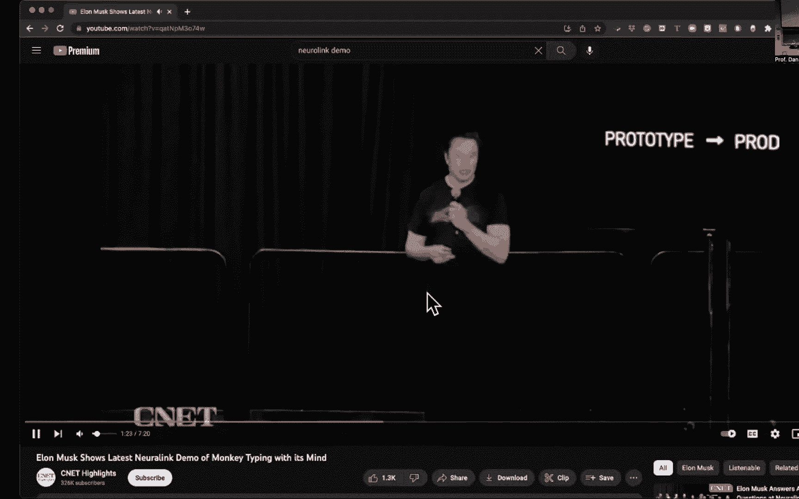

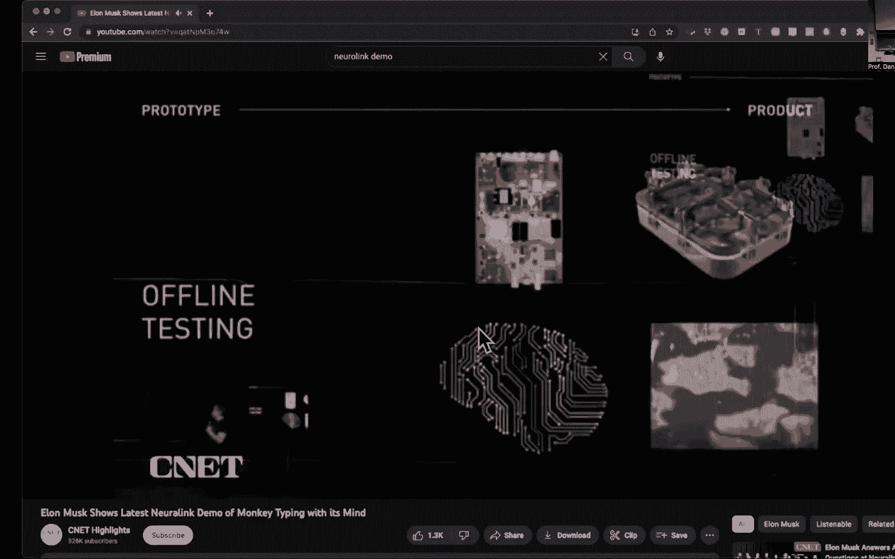

# 🧠 课程 P51：第40讲 - 总结与展望

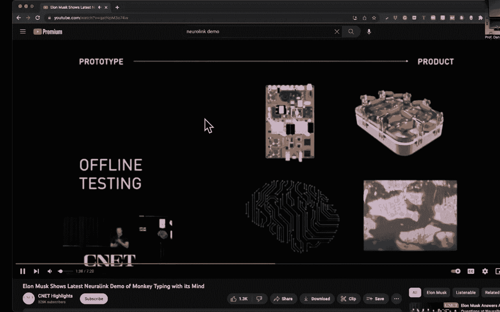

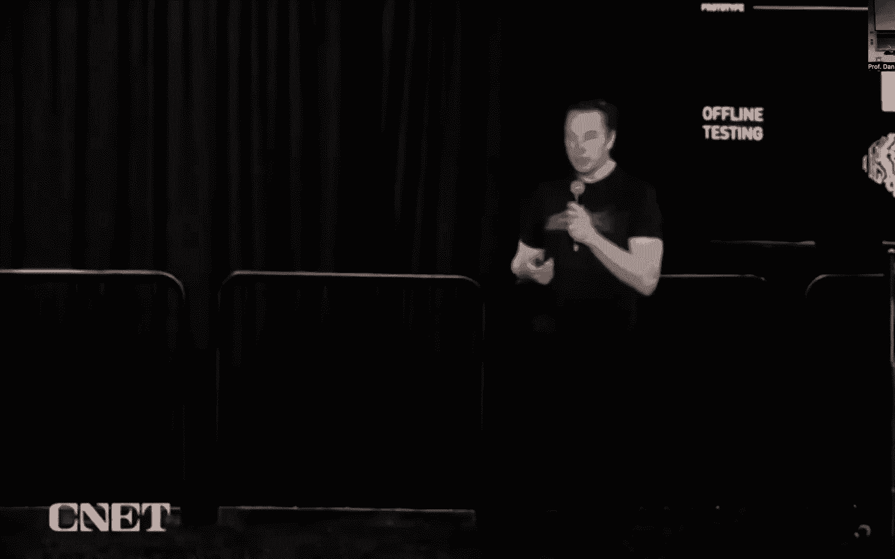

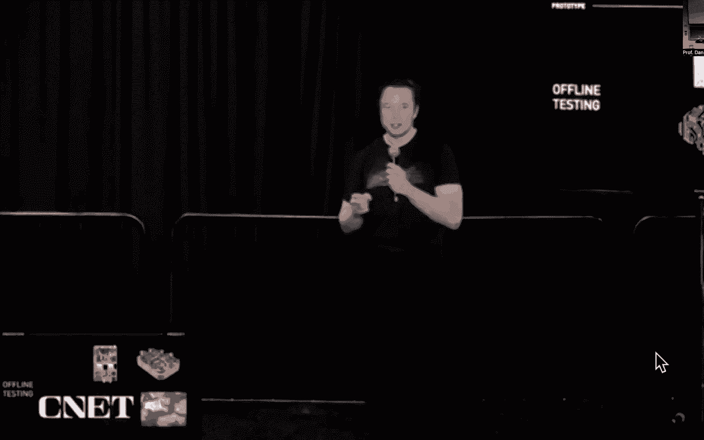

在本节课中，我们将对CS61C课程的核心内容进行总结，并探讨计算机科学领域的未来发展方向。我们将回顾所学的重要概念，并了解如何将这些知识应用于前沿研究与创新。

***

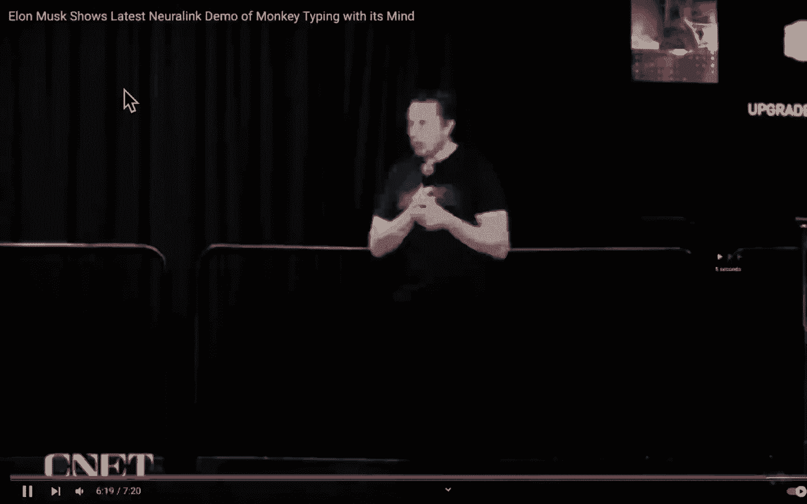

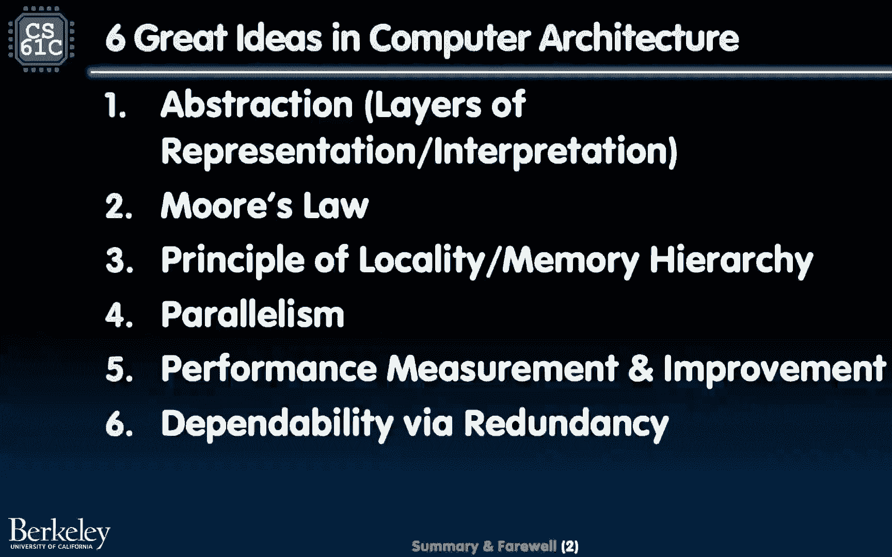

## 📚 课程核心思想回顾

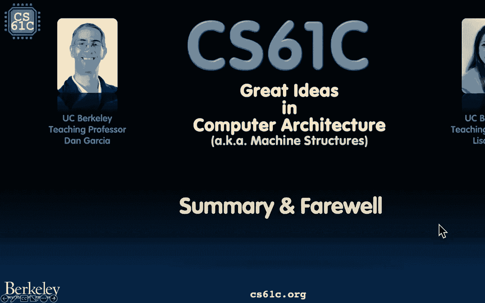

上一节我们介绍了本课程的目标与结构，本节中我们来看看贯穿整个课程的六个核心思想。

1.  **抽象**
    抽象是所有工程领域中最强大的思想之一。计算机科学作为工程学的一部分，其力量在于构建层层抽象。我们从高级语言（如Python）开始，穿越指令集架构（ISA），最终抵达由晶体管构成的物理硬件。每一层都隐藏了下层的复杂性，例如，**虚拟内存** 让系统认为拥有磁盘大小的RAM，这是一种由内存层次结构（缓存与虚拟内存）实现的精妙幻觉。

2.  **摩尔定律与性能**
    摩尔定律描述了集成电路上晶体管数量的指数增长。虽然其字面意义是关于晶体管密度，但它也驱动了计算性能的持续提升。我们学习了如何利用**局部性原理**来设计高速缓存，从而在内存层次结构中平衡速度与容量。

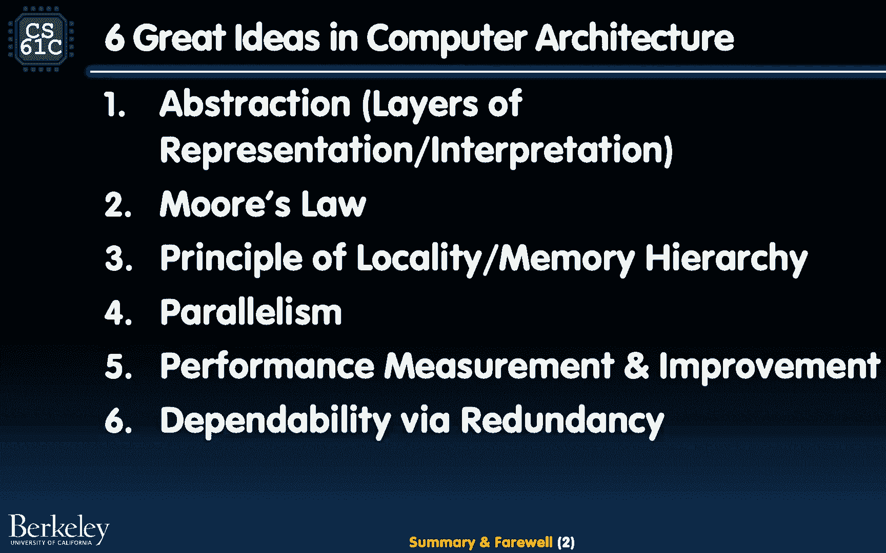

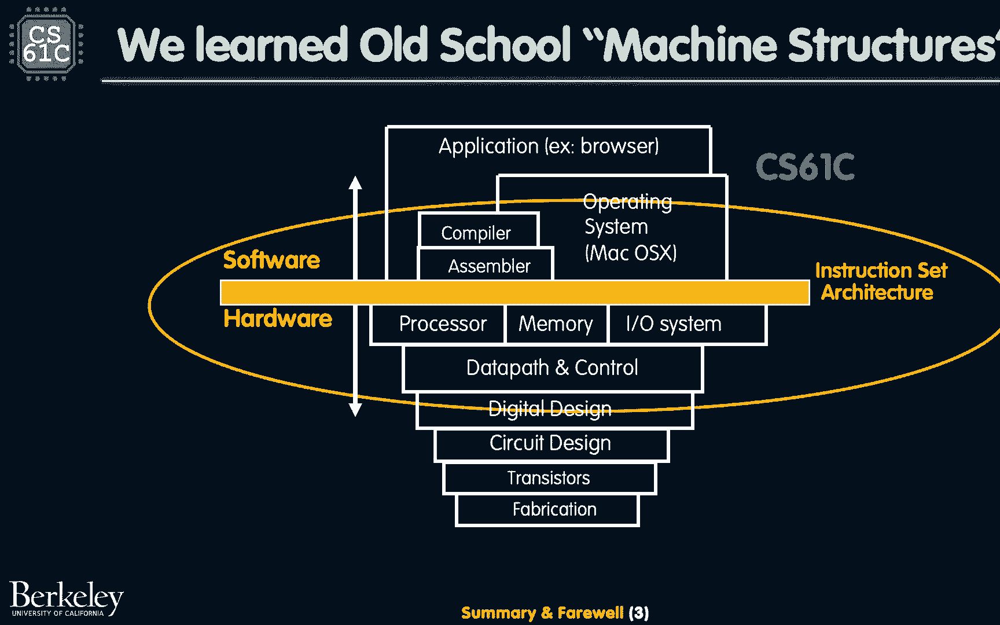

3.  **并行性**
    我们探索了五种不同层次的并行性：
    *   **门级并行**：所有逻辑门同时工作。
    *   **指令级并行（ILP）**：通过流水线技术，让多条指令的不同阶段重叠执行。
    *   **数据级并行（SIMD）**：单条指令同时处理多个数据元素。
    *   **线程级并行**：多个线程在多个处理器核心上同时运行。
    *   **任务级并行**：例如MapReduce，在成千上万台计算机上分布式处理任务。

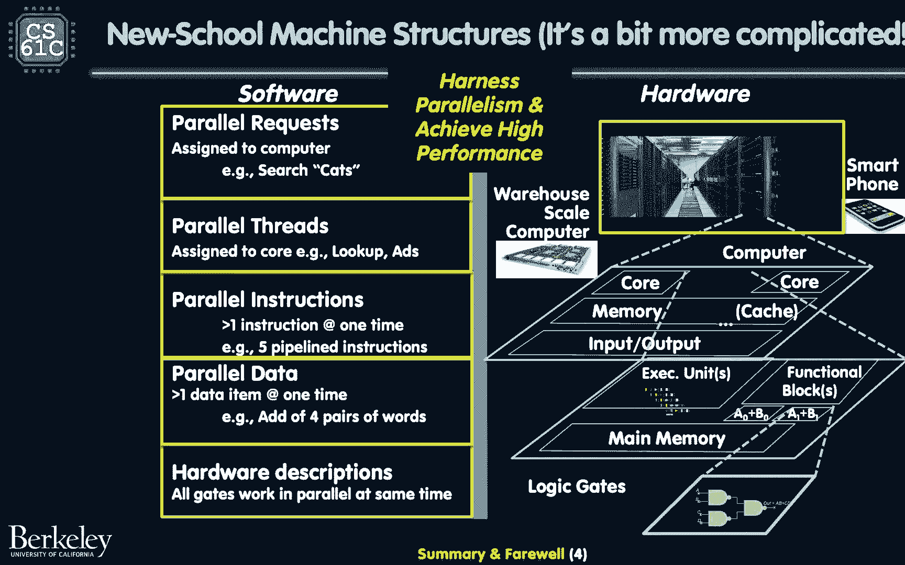

4.  **性能度量**
    如果没有清晰、可量化的度量标准，我们就无法改进系统。我们讨论了关键指标，如**吞吐量**（单位时间完成的工作量）和**延迟**（完成单个操作所需的时间），以及如何设计基准测试来评估和优化系统。

5.  **通过冗余实现可靠性**
    可靠性是系统设计的基石。我们学习了多种通过冗余实现可靠性的技术，例如：
    *   **RAID**：使用多个磁盘驱动器，即使一个故障也不会丢失数据。
    *   **纠错内存（ECC）**：能够检测和纠正内存中的位错误。
    *   **双机热备**：一个系统出现故障，另一个可以立即接管。

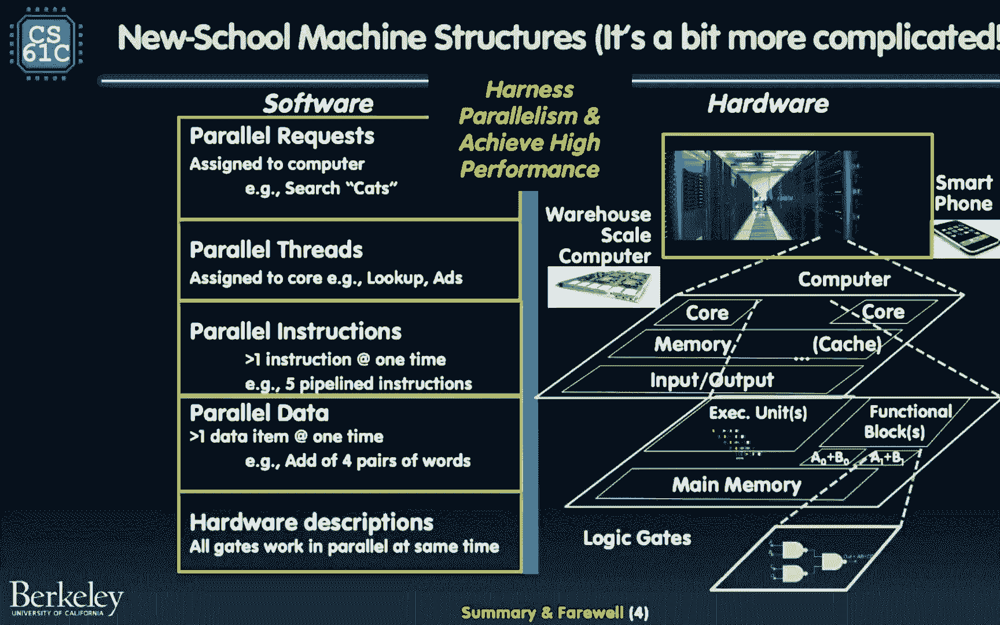

6.  **硬件与软件的协同设计**
    本课程的一个独特之处在于跨越了硬件与软件的界限。我们不仅学习了如何用高级语言编程，还深入了解了指令如何在底层硬件上执行，以及如何通过理解硬件特性来编写更高效的软件。

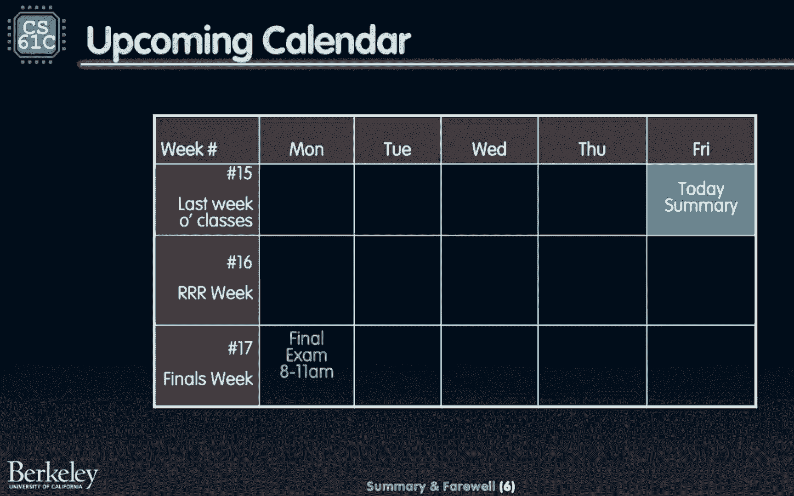

***

## 🔬 从理论到实践：研究与应用

我们不仅学习理论，也看到了知识如何驱动突破性创新。以神经链接（Neuralink）为例，它展示了脑机接口领域的巨大潜力。

*   **严格的测试流程**：在将设备应用于人体之前，必须进行极其严谨的测试。流程包括：
    1.  台面测试与加速寿命测试。
    2.  在模拟大脑环境的模型中进行测试。
    3.  在动物（如羊、猪、猴子）身上进行确认性实验，确保设备稳定、可靠且可长期工作。

*   **技术演示**：猴子“清酒”能够仅通过意念控制屏幕光标，移动到高亮的按键上进行“心灵感应”打字。这项技术的目标是帮助四肢瘫痪患者恢复与世界的交互能力。

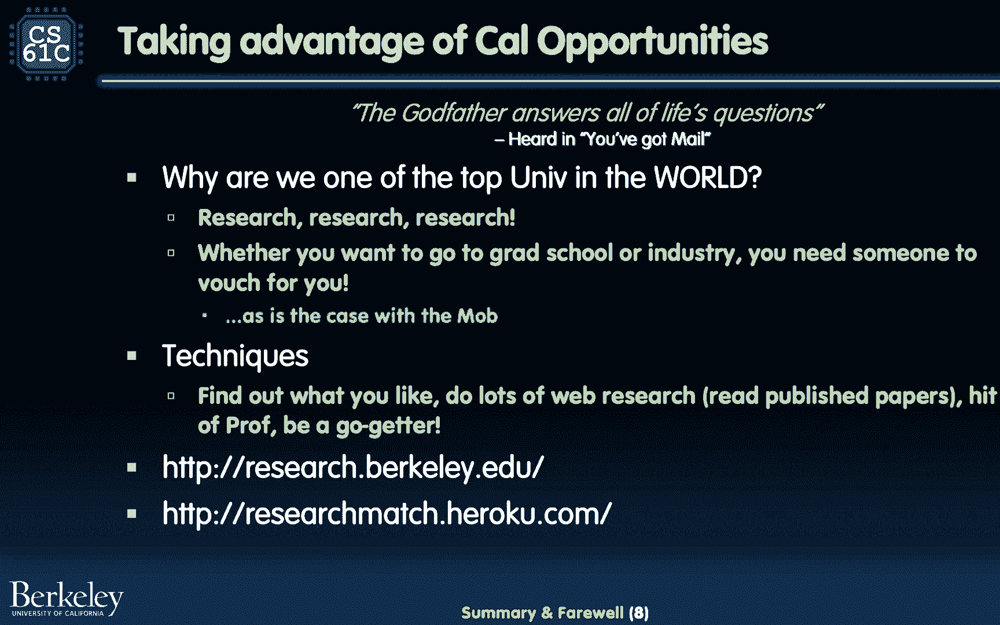

*   **伦理与动物福利**：在进行此类研究时，确保动物参与者的福祉至关重要。动物在参与过程中获得奖励（如香蕉奶昔），并将任务视为一种游戏。

***

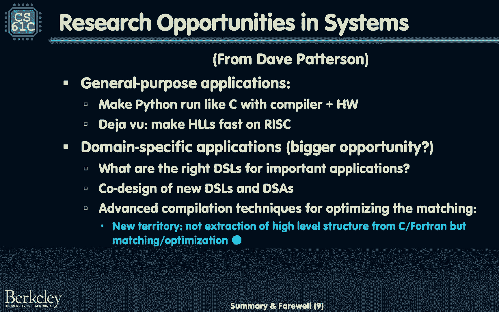

## 🗓️ 课程结束与后续安排

以下是关于课程结束的重要时间节点和信息：

*   **复习周**：接下来的一周是复习周，供大家准备期末考试。
*   **期末考试**：定于周一上午8点至11点举行。考试将重点覆盖期中考试之后的内容，难度设计上会比传统期末考试更友好，目标是大多数同学能在更短的时间内完成。
*   **考试允许携带的资料**：可以携带两张手写（非打印）的“小抄”纸（正反面均可），但必须是自己独立完成的。
*   **课程成绩**：CS61C不是按比例曲线划分等级的课程，而是采用绝对评分标准。

***

## 🚀 未来学习与参与机会

如果你热爱这门课的内容，有许多方式可以继续深入：

*   **成为课程工作人员**：考虑申请成为学术实习生（AI）、导师或助教（TA）。这是一个深化理解、帮助他人并获得支持的绝佳途径。
*   **参与研究**：与教授建立联系是进入研究领域的关键。可以通过参加他们的办公时间、讲座后交流或使用`research.berkeley.edu`等平台寻找机会。
*   **相关后续课程**：
    *   **CS 152**：计算机体系结构与工程，深入CPU设计。
    *   **CS 162**：操作系统。
    *   **EECS 151**：数字设计导论，涉及FPGA和芯片设计。
    *   **Decal课程**：如“游戏工匠”（博弈论与求解器开发）、iOS开发、UC Bug（计算机图形学）等由学生教授的特色课程。

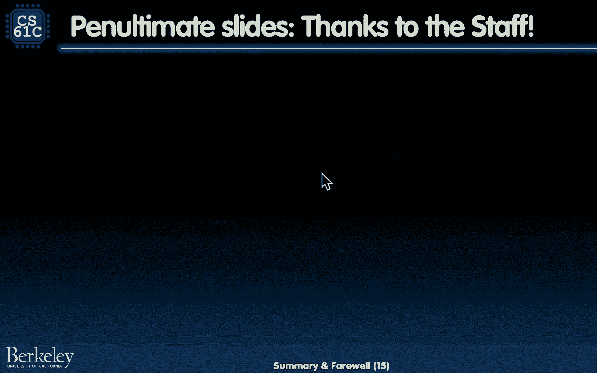

***

## 🌌 计算机科学的未来展望

我们所处的时代正经历着深刻的技术变革，以下是一些令人兴奋的未来方向：

*   **无处不在的计算**：计算设备融入环境（物联网）、可穿戴设备成为常态。
*   **量子计算**：可能对密码学等领域产生革命性影响。
*   **纳米技术**：在极小尺度上操纵物质，应用于医疗、材料等领域。
*   **人工智能的普及**：AI不仅在模式识别（如图像、医疗诊断）上表现出色，更可能重塑教育、艺术创作等领域。
*   **并行革命与后PC时代**：云计算和分布式计算使得个人能操控巨大的计算资源，改变了我们获取和处理信息的方式。
*   **脑机接口**：正如神经链接所展示的，直接连接大脑与计算机将从医疗辅助开始，未来可能扩展人类认知与交互的边界。

***

## 🎯 总结与寄语

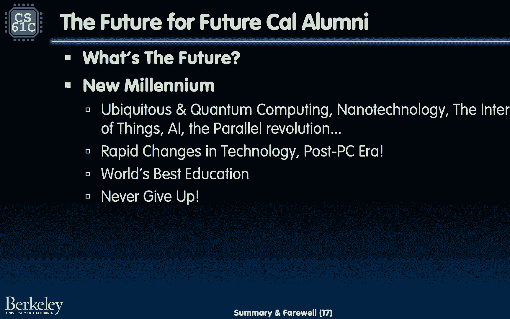

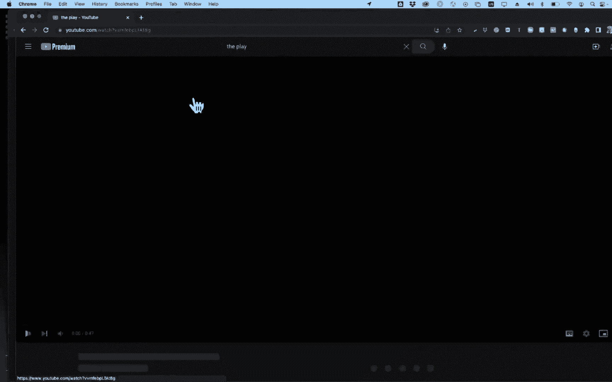

本节课中我们一起回顾了CS61C的核心思想：**抽象、性能、并行性、度量、可靠性和软硬件协同**。我们看到了这些知识如何从理论走向改变世界的实践。

最后，分享两条寄语：
1.  **永不放弃**：无论遇到什么困难，坚持下去。就像加州大学伯克利分校橄榄球队那场著名的“The Play”所诠释的精神一样，奇迹往往发生在最后一刻。
2.  **创造未来**：正如计算机科学家艾伦·凯所说：“预测未来最好的方式，就是发明它。” 不要被动地接受未来，主动学习、探索和创造，去定义属于你自己的、也是属于我们所有人的技术未来。

感谢大家本学期付出的努力！请通过课程评估系统提供你们的宝贵反馈，帮助我们让CS61C变得更好。

祝大家在期末考试中取得优异成绩，并拥有一个美好的假期！