# P6：Lecture 5： Memory(Mis)Management - 这样好__ - BV1s7421T7XR

关于上次还有一些我们没谈的事情，所以当你安定下来，让我们想想下面的练习，我们不会为此在各地进行民意调查，但希望问题很清楚，我们有这个代码，我在问你打印的选项是什么，a b，所以我给你一两分钟考虑一下。

和你的朋友谈谈，如果你旁边的人是你的朋友，和你的新朋友谈谈，我们一会儿回来。

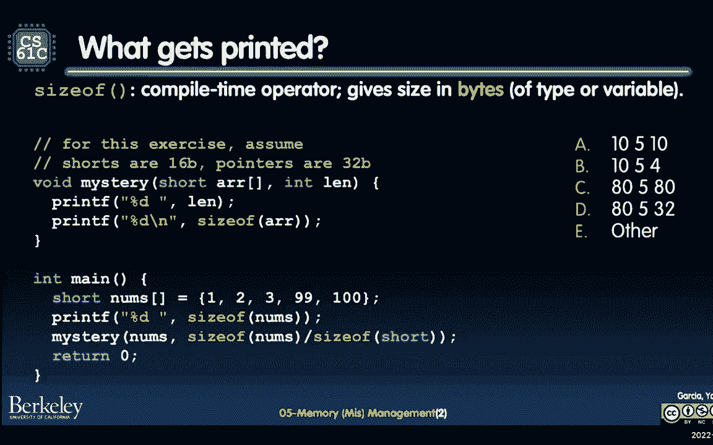

好啦，依此类推，数到三个人亲自来喊这封信，他们认为答案是，然后放大聊天，你只会把信的内容发到垃圾邮件上，数到三，一，二，三，所以有很多不同的答案，我听到很多b，我听到一些，我也听到了一些。

这里发生了一点流氓事件，所以这里的正确答案是B，让我来解释一下，在最上面有一点，我已经谈到了，这里运算符的大小，也就是我们所说的编译时间运算符，换句话说，意思就是。

当c编译器试图将代码编译成可执行文件时，它会看到每一个版本的大小，然后试着把它转换成它认为要去的数字，它认为它会如此，例如，如果有大小的短，你知道短，那种短的，然后它会说，好啦，嗯。

我马上就知道那将是什么，我只是要插入字节数，短型占了，注意这里我说的是字节，现在第一个最棘手的部分，我认为是试图弄清楚数组的大小，所以说，让我们在声明中稍微讨论一下这个问题，转到数组声明的位置。

大小会没事的，刚刚为我声明的这个内存块的大小是多少，在这种情况下，因为它是一个数组，我记得上次数组只是内存块的变量名，在这种情况下，它会说好，我有多少条短裤，一二三四五五短裤。

然后也许在我的特定系统中我们的短裤是16位，所以这意味着数组将是，两个字节还是十个十个，所以这似乎是合理的，但是，这东西是干什么用的？注意这里我有一个神秘的函数，我在数组中传递，变量名数。

然后我也说好吧，传入NUM的大小，按短件大小划分，好吧，让我们来看看数学，我们知道从第一个printf开始修女的规模将是十个，十个字节，这是数组大小，然后大小很短，那将是两个字节，所以是五个。

所以修女有多大，修女是一个短数组，除以数组内元素类型的大小，它将给出数组中元素的数量，最后，这最后一部分是我们上次讲到的概念之一，就是衰变阵列的想法，当作为神秘的参数传入时，作为论据。

神秘函数从一个数组衰变，这个数组是一个内存块，指向指针，只是一个地址，所以如果我指示，如果我们的地址是三个二位，这意味着我们的指针大小将是4字节。

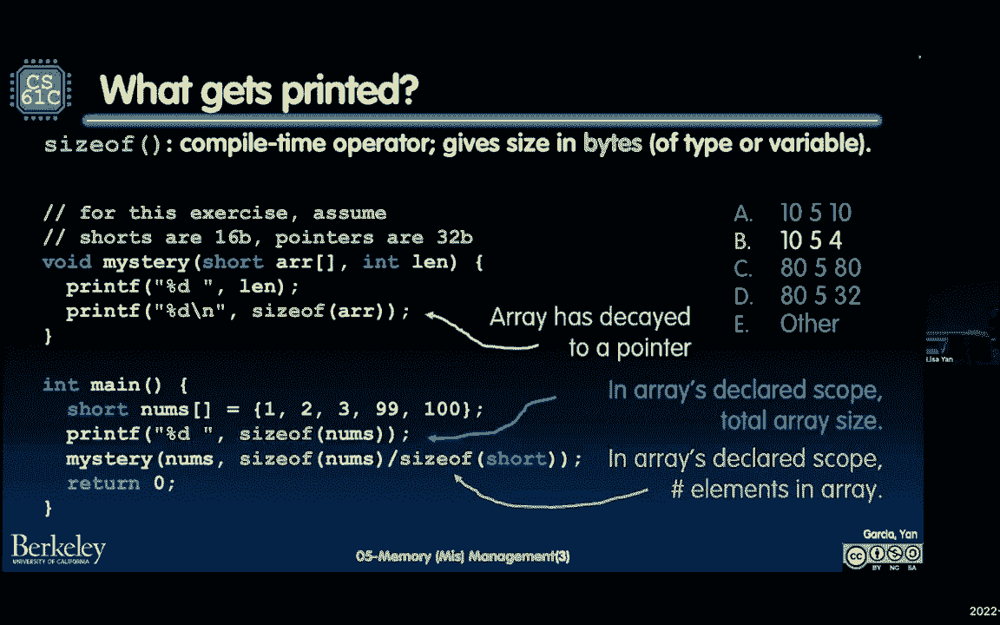

所以当我们打印最后一面墙的时候。

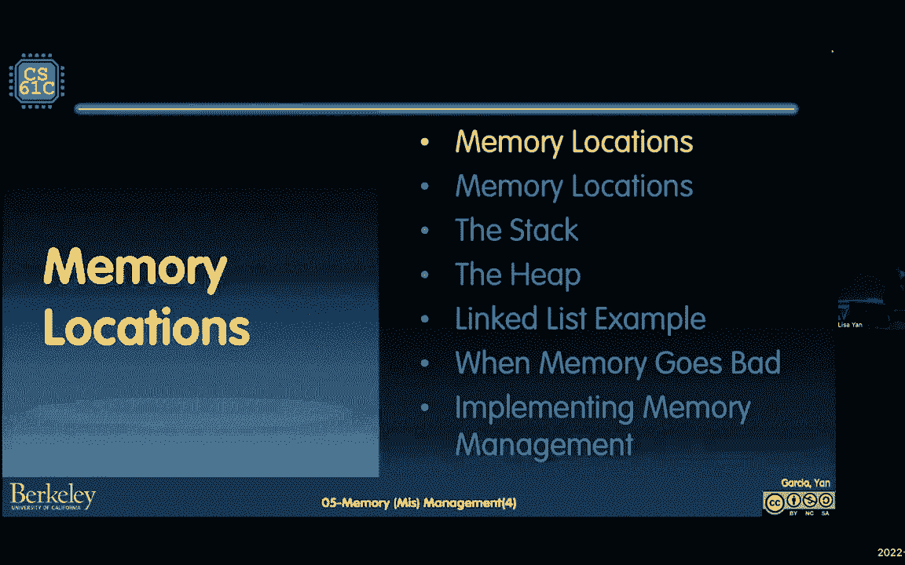

如果我们打印数组的最后一个眼睛大小，在这里引用引用，a r r实际上是一种指针类型，因此，它将返回。

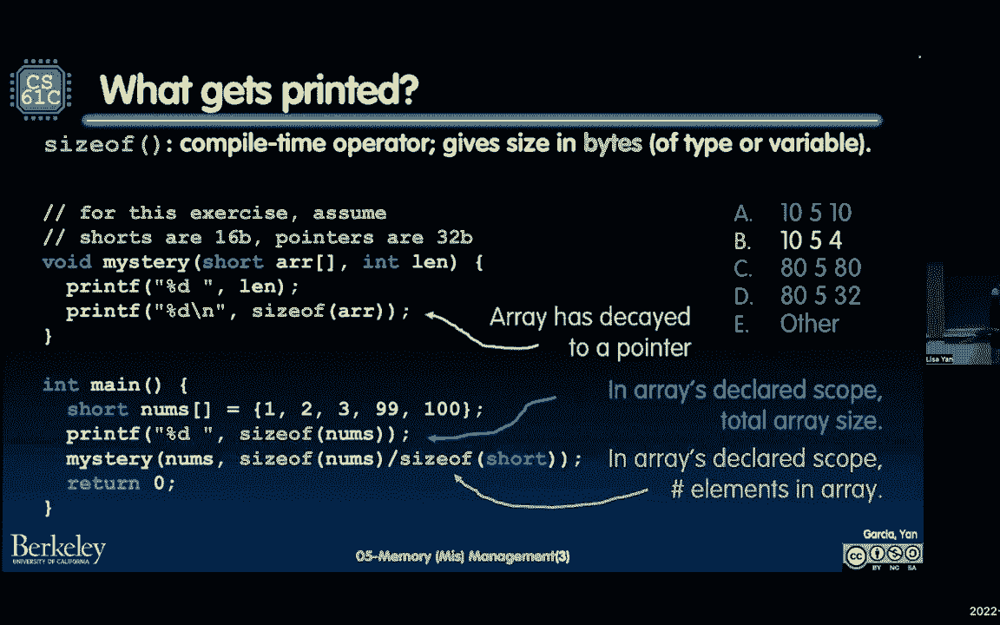

那么我为什么要谈论它的大小，事实证明，它的大小将非常有用，当我们在热度上宣布记忆时，但在我们谈论堆上的内存之前，我只想谈谈记忆位置。

总体情况，当你说话的时候，有一件事很重要，当你说到c的时候，当你在编程时，C有一个关于C程序地址空间的心智模型，所以在我们的版本中，我们要做的是在接下来的几周里，我们只是要想象这个数组。

内存是这个巨大的长数组，从零到最大可寻址字节数，那么二赔三，例如，或者两个到六十四，如果你在一台64位的机器上，然后在那非常非常长的连续，所有可访问内存，记忆有四个不同的部分，其中一个叫做堆栈。

堆栈的作用是所有局部变量，让我们说说你的论点，在接下来的几周里，所有当地的东西都在那里，调用函数时，存放的地方，第二个区域，这就是我们将详细讨论的，今天是所谓的堆，堆是指针请求的空间。

通过所谓的动态分配或malloc，我们将详细讨论，请注意，堆栈和堆以不同的方向增长，所以当堆栈调用更多的函数时，堆栈内存增加，但不是向上增加，它实际上是从顶部开始的，它向下增加。

我们将在几张幻灯片中看到这一点，堆，另一方面，从一个较低的地址开始，然后向上生长，所以在某个时候他们在中间相遇，这将是非常令人兴奋的，如果他们在另外两个地方，我要指出的是静态数据区和代码区。

这是所有全局变量所在的静态数据，在任何类型的函数之外声明的变量，嗯，这也是许多常数存在的地方，我们可以稍后再讨论字符串常量，但这个区域没有增长或缩小，所以当编译器工作时，C就像，他们喜欢。

决定静态数据的大小，静态数据段将是，然后这里的最后一个区域代码，也叫文本，那是你的程序代码所在的地方，所以再一次，如果我们想想我们的记忆，只是被咬了一大口，可寻址数组，您的程序本身，但实际上。

就像将要执行的实际行，也活在这段记忆中，他们住在非常非常靠近底部的地方，你听到了吗，你会听到它叫短信，所以我才告诉你，最后在这里非常非常非常的底部，我们并不真正称之为特殊地区，不过，我想提醒你。

这里的空地址实际上是地址的简写，很抱歉地址全是零，所以这是一个非常像，你不能对着它读也不能对着它写，如果你这么做，你的程序就会崩溃，让我来谈谈静态的东西，因为我知道你们中的很多人在不同之前还没有看到它。

静态数据区域和静态数据区域之间的唯一区别，堆栈区域有点，变量在程序中的位置，它在函数之外声明，那就叫全球，那是静态的，如果里面声明了，是本地的，并将其放入这两种内存类型的堆栈中。

我们将看到内存管理是自动的，我们在上一张幻灯片上谈了一点，只是一个段的静态数据，它的大小不会改变，然后我们接下来要看的堆栈，它是如何自动生长和收缩的。

让我们检查堆栈，所以我提到堆栈是，每个函数的所有局部变量，他们将要住的地方，我们称这些为，呃，我们称这些范围中的每一个，堆栈帧，你们可能在以前的课上见过，它现在包含了，它包含返回指令。

参数和其他局部变量的空间，所以你可能对参数和局部变量的空间很熟悉，但你就像丽莎，这是什么返回指令琥珀，我是怎么说文本部分的，你所有的指示都在那里，所以程序的每一条指令都有地址，将存储在堆栈中的东西之一。

是完成此函数后返回的地址，就像我之前提到的，你的堆栈要做什么，当您调用每个函数时，一个新的框架将被放在堆栈上，这里的这个小P，这就是我们所说的堆栈指针，这只是说，您最新的堆栈框架的开始是这样的。

当这个函数结束时，堆栈指针将从下一帧向上移动到下一帧的开头。

等等，等等，让我们看看这一点的作用，让我们假设我们有这五个函数，从主开始，这也是c main中的一个函数，它将调用，那么会发生什么，首先是好，梅因要开始了，它将创建一个堆叠的框架，它位于白色。

试图和颜色代码一点点，至少在幻灯片上，我知道它不在下一个打印件上，当a被称为井时，它得到了这个参数零，这个，这个，它将存储这些信息，它也会储存，将返回地址存储到main，现在它将调用b，然后b被称为。

那是一个，这是这里的橙色来匹配B函数，然后b会调用c，然后c会调用d，请注意，一旦d返回，堆栈指针每次都向下移动，然后堆栈指针将向上，备份，倒车再倒车。

现在我要谈谈，我将重温我警告过的一个概念，上次有一点，它是先将指针传递到堆栈中，我会说什么是好的，实际上经常受到鼓励，然后我要说什么是超级不好，因此，可以将指针传递到更低的堆栈空间，我这么说是什么意思。

我是说如果你在缅因州，如果你有缓冲区，像字符缓冲器之类的，然后您需要调用一个函数来加载缓冲区中的信息，嗯，在这种情况下，我称之为buff的缓冲区，在调用方的整个执行过程中都会存在。

所以牧羊犬的记忆会在那里，直到打电话的人我看到相反的方式，所以这里的呼叫者是主要的，然后这里的群体是负载buff，所以在梅因等待的时候，主buff的局部变量仍然可用，另一方面，不好的是下面，也就是。

让我们说，在另一个上面的东西在堆栈中更低，到堆栈上较高的帧，这个案子，假设我们在调用函数中创建了这个缓冲区，使buff，然后我们回来了，然后现在使buff消失了那个框架，但仍然有一个指针指向原始位置。

声明良好的局部变量，然后是福，哪个函数会被调用，它就会被堆放在主干道旁边，因此，当堆栈地址指向潜在的垃圾时，也许buff最初的价值已经不在了，所以这是要小心的事情，这就是我们所说的灾难性的糟糕。

返回指向堆栈中某物的指针，为什么呢，因为内存会被覆盖，然后你的数据也可能不再存在，如果你写到那个地址，它们可能会覆盖新函数的键指针，是啊，是啊，有个问题，我们在后面，问得好，所以问题是嘿。

你能让事情全球化吗，因此，我们就不必担心堆栈了，就像堆栈式的销毁和重新分配信息，那是一种选择，但你可以想象，你创建的全局变量就越像，你拥有的越多，就像那个巨大的头部，就像嘿，这些都是每一个人。

微小的功能将管理，所以我们要讨论的是，接下来是这个称为堆的内存位置，它将允许您进行动态分配，并允许您拥有跨函数的持久内存。

我们去看看，髋关节就是所谓的动态记忆，我的意思是它将被分配，它将在程序运行时被释放，所以这不是编译器提前知道的事情，它将被创建这么多街区，或者类似的东西，像跑步者这样的战斗将是可执行的。

在这方面会很灵活，这就是java new命令发挥作用的地方，所以如果你有Java新的，那其实是，它在给java的堆分配内存，它对于跨函数调用的持久内存很有用，但它也是指针错误和内存泄漏的最大来源。

现在这里有一个小不幸的名字，这也许是所有名字中最不幸的一个，六十一b对六十一c，也就是说堆不是设计的，像堆数据结构，好啦，所以这两个字对我来说是这样的，同样的单词heap实际上是指两个不同的东西。

其中之一是堆数据结构，你知道从61 b，然后另一个是C堆内存，好啦，我们现在做的是61C，所以说，我要告诉你的一件事是关于61C，堆是这个巨大的内存池，它不是按连续顺序分配的。

但它也不是以堆数据结构的方式分配的，你从以前的课程中思考的方式，现在呢，这意味着背靠背的热量请求，记忆确实会导致相距很远的块，所以有某种堆管理器或堆分配器，谁决定记忆的去向。

然后完全有可能如果你请求记忆一次，然后你立即再次请求记忆，那两个街区可能住得很远很远，在这个巨大的长内存阵列中，如果我们在今天结束的时候，我将谈谈如何实现加热。

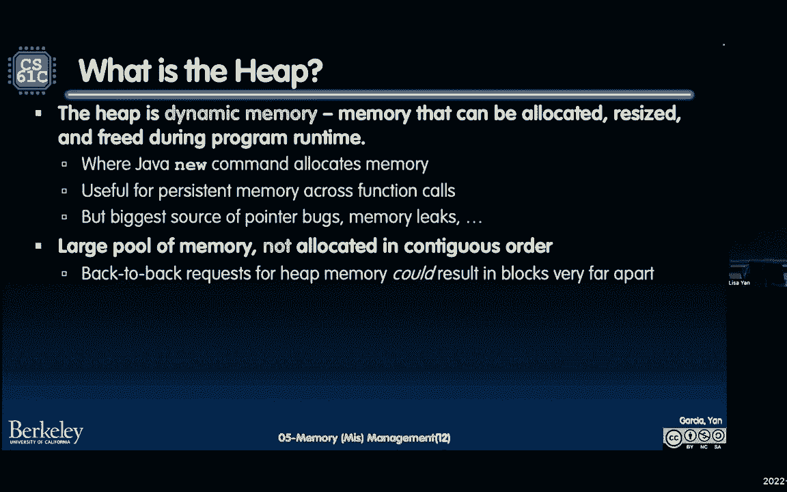

所以你真的可以看到一些差异，在接下来的几张幻灯片中，虽然我将讨论哪些c函数允许你分配，定位，在HEA上调整内存大小，其中一个叫malloc，它代表什么呢？代表内存分配，这里的m代表记忆。

它从堆中分配原始的未初始化内存，我们会讨论一些关于这个的论点，第二个是免费的，这是D分配，它将释放堆上的内存，第三个是重新分配房地产，也就是说，它将以前分配的内存调整到不同的大小。

所以如果你想分配一个特定的数组，然后你实际上用完了空间，你现在可以把它变成一个更大的Interray，与堆栈不同，只有当程序员显式地要求内存时，内存才会被重用，或显式释放内存。

所以我们将在接下来的时间里更多地讨论这份合同，在接下来的幻灯片中，第一个是malloc，好啦，那么木槌的作用是什么呢，它有一个，它分配这个未初始化的内存块，但它有几种类型，你可能有点不熟悉。

让我们谈谈那个p n，这就是我们所说的无符号整数类型，它实际上是一种类型def，但这有点过分了，但是你能想到的这个数n是，这是一个足够大的数据类型，这样它就足够大，可以计算您拥有的内存字节数，好的。

好的，所以如果你在二到三的时候，如果你在一个三二比特，体系结构大小t将足以枚举所有两个到三个，两个字节将在那里，同样的事情是64位，以此类推，关于malloc的另一件事是返回一个虚空星。

你还记得上次我说虚空之星有点吓人吗，这就是他们害怕的一点原因，但是我们在这节课里能想到的，空星只是一个指针，它是一个内存块的地址，Malloc不知道你想要什么类型的信息或什么类型的数据，它只是会喜欢。

接受您对字节数的请求，并返回一个地址到这些字节数，这里有一点，即返回NULL将表示没有更多的内存，所以如果你收到一个全是零的地址，来自malloc的null，你应该回来，或者你应该像，好啦，嗯。

我做完了，因为我的程序内存不足，我对此无能为力，所以我们将要看到的一件事，你应该总是检查没有，因为如果你内存不足，你不应该一直这样，因为那样你的程序就会像哇哦，喔喔，哇我，他们再也没有能力做任何事情了。

下面我们来看两个如何使用malic的例子，其中之一是以下内容，如果你有，假设一个树节点结构，然后我们说下面的话，我们说，让我们有这个指针TP，它将存储malloc分配给我的位置的地址。

这里我要指出两部分，首先就是，尽管我说Malloc请求许多字节，我们喜欢按惯例做什么，不是计算出结构的字节数。

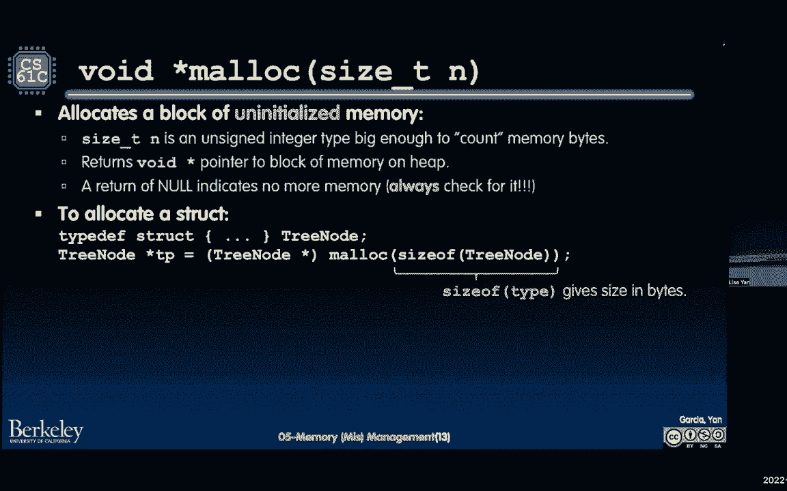

还记得上次我们谈到填充吗，听起来有点怪，我们只是说它的大小。

因为它要做的是编译器，当他们组织起来，你所有的C代码都会说，好的，好的，我可以插入正确数目的树节点，就像这里正确的字节数，取决于我想如何组织树节点，我想指出的第二件事是，因为malloc函数返回。

虚空星，我们要做的是，强制转换显式强制转换，使得虚空星号实际上变成了树节点指针，这里的第二个实际上是，从技术上讲，如果你没有类型化，它是有效的，但是C会警告你，你会像哇，你确定这将是一个树节点星。

你说是的，我敢肯定，因为我要求的空间，我要在那个位置放一个树节点，这里还有一个，下面是您将看到的malloc的另一个版本，那很常见，你可能会在第一个项目中使用这个，即分配一个20英寸的数组，例如。

那你是想说，好啦，好吧，又来了，我要在一个地址，它将是一颗int星，因为我将指出一系列的开始，我要投，因为我知道这个地址会有一个int，然后不是说80字节，我要说20倍于int的大小，为什么这口井。

很多年前，在不同的架构上，过去是像八位，16位现在在某些系统上有3个2位，就像在Python中，实际上有64位，所以，因此，你不能真的对，你的会有多大，这就是为什么我们使用命令的大小。

它允许您的C代码可移植并转移到不同的体系结构，是啊，是啊，有个问题，奇妙的问题，所以我们的结构总是存储在堆上，或者它们可以存储在堆栈上，它们可以存储，也可以存储在堆栈上，所以在之前的几节课中。

我们刚刚宣布，记得我们宣布，我想是坐标P，或者坐标x，或者类似的东西或者协调一个，然后我们用分号声明，我们在说，好啦，这将是一个存在于局部作用域中的变量，如果我们说下面的话，就是我们在上面的这个。

这里我们有一个指针，然后我们Malloc，然后就像那个木槌宣言说的，好啦，我把这段记忆放在堆里，然后我把这个地址还给，那么在本地声明的是tp指针，但是这个结构，或者实际上它甚至不是一个结构，在这一点上。

结构将要使用的字节数，会是关键，是呀，很好的澄清问题，是呀，还有一个，是呀，哦哦，问得好，所以有两个问题。

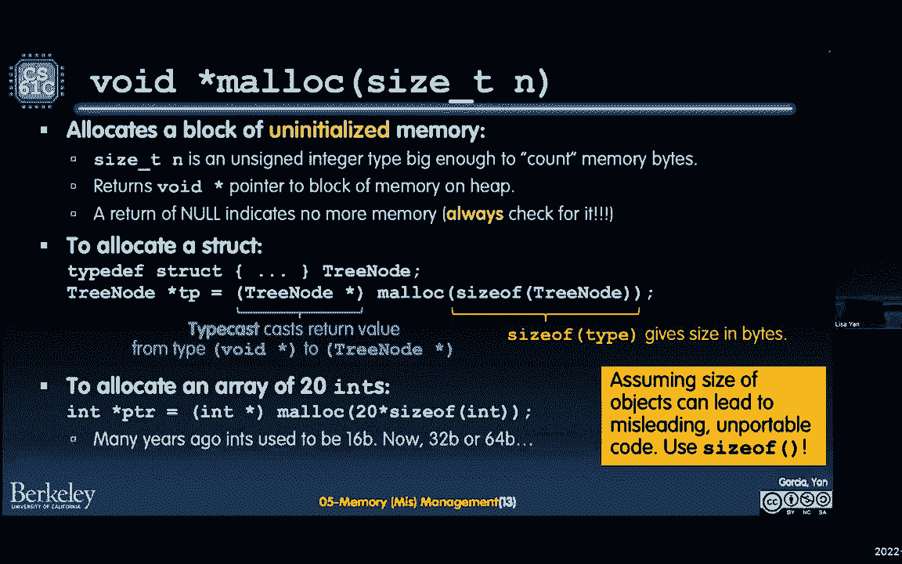

其中一个是嘿，全球在哪里啊，然后第二个是，你为什么要做一个比另一个，我要回答第一个问题，然后第二个，事后我很乐意回答，因为这更像是一个设计类的问题，是啊，是啊，所以第一个，如果我快速回滚。

我们这里有一张很好的照片，嗯，我是说我认为这是一张相当不错的照片，也就是说有四个代码区域，然后这里的问题是全球数据存在于哪里，堆上实际上并不存在全局数据，它存在于堆下面的区域，是啊，是啊。

就像静态数据一样，这是全局数据存在的地方，因此它不能生长或收缩，因为就像堆在它之前就已经开始了，所以这是编译器提前决定的，就像没事一样，我需要这么大的区域来存储我所有的全局变量，在那之后我不会改变它。

一旦程序开始运行，是啊，是啊，问得好，好啦，所以回到热度，我们刚刚结束了对malloc的讨论，并试图将其与堆栈区分开来，现在我要谈谈免费，所以malloc就是分配，空闲是内存或分配中的空闲。

它需要一个论点，这是一个地址，指针，具体地说，它必须是一个指针，其中包含最初由malloc返回的地址，那么这意味着什么呢，这意味着如果你malloc，让我们说，呃。

那个20大小的int数组或20大小的int数组，然后你可以释放相同的地址，内存块的起始地址，现在注意这里确实有一个明确的自由，这是所有C程序员的要求，当你释放记忆，你需要实际归还原件。

您需要提供提供给您的原始地址，所以我要试着去做，有点像教父，你有一个小合同，我要试着模仿丹·加西亚，那一天可能永远不会到来，我可能会请你为我做一件事，但在那一天之前，我会给你一份合同和大量的记忆。

你把它放回来，我们有教父，我没有在这之前我和丹说过话，我没看过教父，但我在这个意大利国家长大，叫新泽西，所以我希望这已经足够好了，所以我们来谈谈为什么，如果你违反了教父的合同。

就像那部电影，但是让我们来谈谈第三个命令，我们亚历克，也就是说，如果您想调整以前提供的内存的大小，其工作方式是提供原始指针，你就是木槌，然后你提供一个新的尺寸，你希望那个记忆块，然后现实会给你一个地址。

或者是一个新的地点，那么这意味着什么呢，这意味着如果你要求20个，然后他们，然后你得到了那个字节数，然后你说不，其实呢，你知道我想要一百块，然后你打电话给Realloc Realc。

堆分配器在类似的情况下可以在幕后做的是，它可能只是说像，好啦，我要把这二十条信息一直抄到这里，因为只有在这里我才能得到一百个有价值的信息，按相邻顺序，我把这个新地址还给你，所以这是个危险，新地点的地址。

嗯，这可能是一个新的地点，这里有两个边缘盒，我要谈谈，也就是说，如果你做亚历克空指针，然后尺寸，这会表现得像Malloc，我的意思是如果你说嘿，不管这里有什么，请调整到此大小，现在看，它会看着这个。

就像，哦好吧，好啦，我实际上不能在零的时候调整任何东西的大小，因为就像我不会把零还给你一样，你不能对着那东西读写，所以我会自动在一个新的区域上创建一个新的位置，在堆上，然后把它还给你，这是它的一个理由。

第二个是realc指针，逗号零，上面写着嘿，我有这个位置，它有一些内存分配，我想把它的大小调整为零，然后实现，就像马洛克，底部的分配器会像没事一样，嗯，你什么都不要，所以我要给你免费的，好啦。

所以这两个版本实际上被明确地写入了手册，是啊，是啊，中间有个问题，哎呦，当你不知道会发生什么，是啊，是啊，问得好，就像，好啦，嗯，您如何处理这里的返回值，这取决于你作为一个c程序员，但是是的，是啊。

是啊，我们一会儿再谈这个，这里有一个例子，我要展示它，也就是说，如果你重新分配这些，嗯十，然后你想调整它的大小，首先，当你第一次收到malloc，您应该通过检查来检查您是否真的得到了该空间。

如果它是空的，然后当你重新分配到一个更大的尺寸，甚至更小的尺寸，您应该再次检查它是否为空，如果你用零号看，那你实际上是在说免费，我个人，我真的不太喜欢写这个，我只是喜欢自由写作，因为作为一个程序员。

我很清楚，我实际上是在释放这个空间。

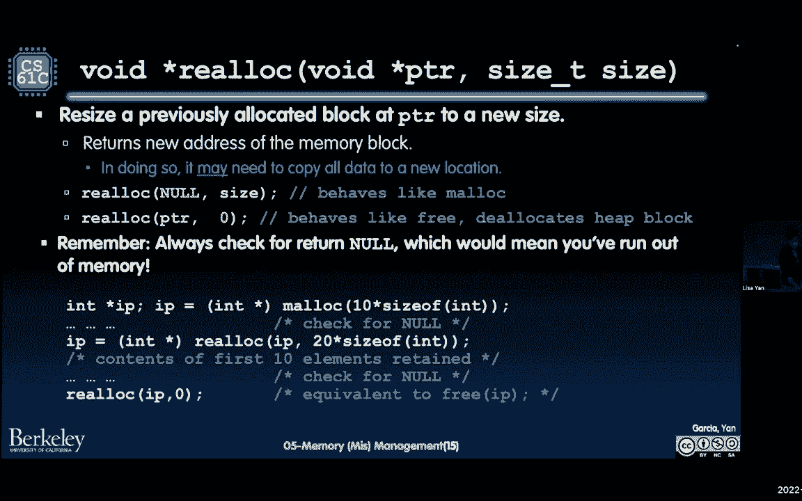

好啦，让我们再看一个相关的例子。

我将介绍这个例子的开头，如果你有兴趣，您可以查看谷歌驱动器上的代码以获得更多信息，我要做的是一个链表示例，其中我们有以下结构，它有一个，它里面有两个指针，其中一个是明星，换句话说，字符串。

另一个是指向下一个结构节点的指针，在这个演示中，我将把它称为struct node，那么我要做的是，我要说好吧，嗯，在我的血管里，我将创建这个列表的头部，换句话说，喜欢好，因为我从一个空名单开始。

我什么也不说，我要指向空，我想在这个字符串前面插入或添加，所以这就是双指针的概念出现的地方，我知道从上次开始，双分球就像这样，你就像，哇塞，那是一次疯狂的旅行，是啊，是啊。

所以我要说的关于双指针的一件事是，就是，我记得当我第一次拿61 C的时候，当教练向我解释的时候，我就像，哦耶，有道理，然后我想我下课后马上就想了想，我就像刚刚发生的事情。

所以我花了两三次时间才看到这些信息，然后理解它，这是一个完全正常的过程，你要经历这些，这就是我们报道它的原因，现在你会在实验室里再看到它，你会在讨论中再次看到它，希望这能帮助你建立对双指针的理解。

让我们从下面开始，如果我们看第二行，当我们调用add到front时，我们正在通过头部的地址，还有这个呃，字符串abc，所以它要做的是添加到前面，将有两个参数，它们的值将是头部指针，会指向头部的位置。

然后这里还有数据，这是一个汽车明星，它将指向地址，abc字符串的开头，末尾有一个all终止符，现在如果我们移动到前面的添加，呃，但我们要创建一个节点，填充它，然后在这个函数的末尾。

我们希望head指向我们刚刚创建的新节点，这就是这个函数的目标，让我们看看它是如何工作的，我们要做的第一件事，记住，如果我们要创建信息，把它还给同事，打电话给我们的人。

然后我们需要恶意地创建我们将要创建的所有信息，因为它需要存在于我们的堆栈之外，所以我们要做的是，我们要做的第一件事，在堆上分配一个结构节点，然后我们把这个指针，本地指针指向堆上的某个地方。

我在这个地址文本里写了，三百元稍后就会派上用场，假设那是一个堆地址，我们要做的第二件事是，我们必须填充这个结构节点，但是节点在这里有两个不同的指针，其中之一是它应该有一根绳子。

另一个是它应该有一个指向另一个节点的指针，结构节点，所以在这个特殊的例子中，我们要说我们不知道这个abc字符串是什么，以后会在哪里，所以我要复制一份，具体来说，我将首先将这些数据分配给。

能够将字符串存储到堆上，然后我现在就把数据复制进去，你就像喔喔喔，在这里挺快的，什么是，第三份是什么，这些是字符串点h标准库函数，你会在实验室里看到一点，以及项目。

上次的Berlin给出了不包括空终止符的字符数，有副本，另一方面，将复制字符串的所有字符，包括空终止符，所以你需要多吃一口，从STEN或从C分配到，能够在空终止符中实际复制，我们可以长篇大论。

你们中的一些人喜欢开始复制丽莎，你为什么要这么做总是用严厉的副本，我们可以稍后再谈，我相信你们的助教也会讨论这个问题，但现在在这一点上，如果我们移动如果我们移动到6号线，我们需要填充另一个。

结构的另一个字段，所以我们要做的是，嘿嘿，头部指针，你指的是哪里，你指的是什么价值，然后呢，头指针说我指向空，然后取这个值NULL，你打算在下一个地方储存什么，下一个节点是空的地方，现在最后一行。

这可能是最复杂的一行，是试图更新，所以你实际上可以像返回一样，让这个结构在某种意义上仍然存在，仍然被指向，所以让我们一起走过最后一行，即我们有节点，你还记得那种，呃，这个通道在右手边，节点这里说节点。

你有什么价值知道我有十六进制三百，刚好是个地址，但我只想说，这是十六进制三百的值，三百元，你打算把这个值存储在哪里？在头指针指向的位置，所以说，头部指针指向这里的这个位置，它被x 300填充。

所以我们这样画一个橙色的箭头，所以请注意当我们返回时会发生什么，当我们回来的时候，让我再做一次，当我们回来的时候，那些本地指针，节点，本地指针变量节点，这些参数头指针和数据--它们消失了。

因为堆栈指针只是向上移动，但是，我们仍然有一个指向堆上该位置的指针，因为这种双指针现象，如果你在某种意义上对更多感兴趣，就像这个苹果的例子一样，请注意，如果我们在内存中没有这个特定的位置。

那我们就不能真正喜欢，记住这个地址将在哪里，这是因为我在这里写的这个函数，它不返回值，但这是一个空白，上面只说，请将该值作为参数的一部分存储在此位置，是啊，是啊，中间有个问题，哎呦，一个奇妙的问题。

所以我打了两个malloc电话，一次一个，第四行，3号线和4号线，这些会挨着吗，答案可能是不知道答案可能是不知道，所以我们要做的是，如果我今天还做不到，我要发布一段录音，关于堆分配器如何工作的可选材料。

以防您想实际查看，哦耶，实际上他们的记忆中有些空白，是啊，是啊，问得好，还有一个问题，是啊，是啊。

是啊，是啊，如果你不使用双指针会发生什么，这有点关系到什么，呃，我刚才说的。

因为这里有一个函数，什么都不回，如果是你干的，如果你不能喜欢，修改内存中的此位置，所有的局部变量都消失了，所以你需要以某种方式说，好啦，我要做我喜欢的一切，我要去储存，就像，在这里记录我的信息。

我所做的事，你记录的是，在内存中创建并保存的结构的地址，是啊，是啊，所以为了更多，如果您正在考虑如何释放列表，一定要查看2号实验室驱动器上的讲座代码。

您还将看到一个循环链表，这将是一段美好的时光，所以让我们来谈谈当记忆变坏的时候。

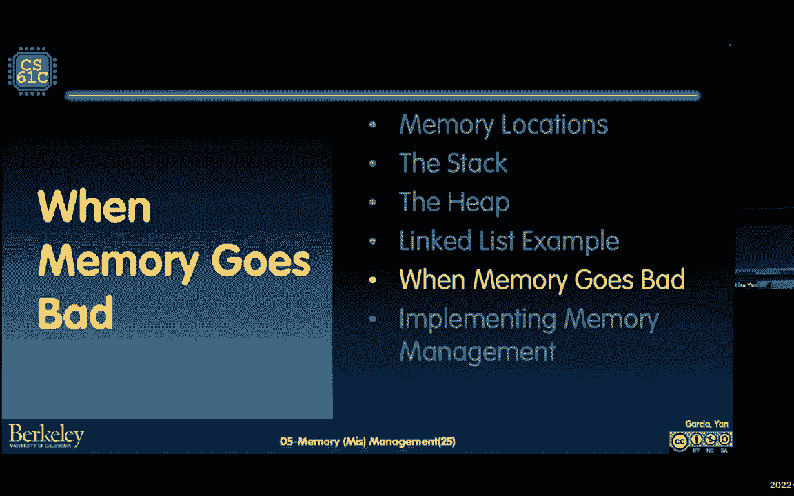

那么我这么说是什么意思，如果我们考虑像静态存储这样的代码，像全局变量，静态变量，所有这些事情，作为一个C程序员，它相对容易使用，因为记住，我一开始说的其中一件事，我再说一遍，当你，当你是一个C程序员。

你必须有某种关于记忆如何工作的工作模型，你的变量会在哪里，如果你知道你的变量是全局的，这是合理的，在节目的大部分时间里都会有，它们从不生长或收缩，他们不会离开的，挺好的，空间，也比较容易。

从某种意义上说，他们被创造和毁灭，倒数第一，你唯一需要记住的是避免所谓的，悬空指针，所以指向现在分配的位置的指针，我们讨论了一下那个bug，但后来堆积如山，堆是野生的，从某种意义上说。

因为一旦你创建了一个对象，一旦您在堆上分配了一些东西，其他函数都可以在堆上分配东西，也在你身边，所以还记得我们是怎么谈论教父合同的吗。

教父至少在暗中警告你三件事，其中之一是内存泄漏，所以如果你忘了分配内存，会发生什么，您的程序最终将耗尽内存，我将在下一张幻灯片上讨论这个问题，另外两种是免费后使用和双免费后使用，所以也许你喜欢一些指针。

然后你就说不，实际上，你知道我想再用一次，然后你就像在同一个指针上调用它，疯狂的事情也会类似地发生，如果你打两次免费电话，手册上说，如果您试图在适当的位置释放相同的位置，则会发生未定义的行为。

这些将导致可能的崩溃或可利用的漏洞，但让我们谈谈这次失败，为什么内存泄漏有点可怕，因为内存和这种内存的分配和分配，它的性能非常关键，在C程序员的生命周期中没有足够的时间，在编译器的生命周期中检查以查看。

如果程序员未能管理内存，所以通常会发生的结果，你要破坏内存分配器，在堆的内部结构中，你以后就会知道了，在代码中完全无关的部分，这里有一个例子，假设你有，假设你有一个内存泄漏，我是说。

这个例子是在通常会发生的事情中，一切都很顺利，你好像不，完全没问题，我喜欢，做了三件事，好像起作用了，好啊来，他们不工作，好啦，突然间你的表现就一落千丈。

这个巨大的夹子，然后你知道你的程序有点长，然后它就停止了，因为真正发生的事情，我们会更多地讨论这个问题，当我们到达虚拟内存，操作系统说我的内存用完了，因为你喜欢回家，理学硕士课程回家。

所以这是值得思考的事情，你的很多节目，你在写，你会像，哦好吧，我的程序太小了，它并不真的占用任何记忆，但如果你的节目很好，另一个程序员决定在他们的程序中使用你的程序。

然后突然你的主要功能变成了他们主要功能的子程序，然后你的小程序中发生的任何泄漏，突然间扩展成这个庞大的程序，那是值得担心的事，那就是，这就是为什么我们总是把它作为一种释放记忆的练习，让我们来谈谈第二个。

一点点，这种免费后的使用会导致一个dang，我是说，免费后使用，是悬空引用或悬空指针的症状，这又是当你喜欢继续使用指针，即使已经分配了，我们在堆栈上看到这个，在堆上又发生了，假设我们喜欢木槌什么的。

然后我们把它释放了，然后我们以后继续用，这是一种可怕的阅读，免费后可能会被破坏，所以你有一些地址到一个你不再控制的地方，如果在后端分配的堆，重用了这些信息，并且已经将堆的这一部分提供给了其他人。

然后突然间你可能会说，如果你读到这些信息，很可能是别人的信息，如果你写信给那个地方，那就错了，你会腐蚀其他正在使用的人，实际上，这将是一个非常大的安全漏洞来源，还记得上次我们讲的堆溢出吗，有什么事吗？

好像有个虫子，事实证明，免费后的这种使用也很常见。

第三次双免费，双免费主题，合理，你会像丽莎一样，我永远不会写这个代码，你在开玩笑吧，我不是跟你开玩笑，它会发生，因为当你释放信息时，你还记得我们看过，我们有的例子，我们只是在创建节点，在前面加上。

稍后的另一个函数必须释放该信息，完全有可能，可能那个函数会被再次调用，然后你再释放它，我们不希望这种事发生，这就是为什么它要么在免费后调用使用，可能是为了找到，为了找到您的链表。

您需要询问已经释放的访问指针，这将导致我们在上一张幻灯片中看到的许多问题，或者你可能只是喜欢损坏的热量数据，因为也许你是在给那个地方写信，是啊，是啊，我回答一个简短的问题，是啊，是啊。

你能不能把f设为空。

这取决于你的范围，那是那是，这就是我要说的，这在很大程度上取决于您的程序，我说，这些东西你看到代码你就像，这似乎很简单，但是当你调用所有这些不同的函数时，很容易忘记，所以从某种意义上说。

你需要意识到的一件事是，作为一个C程序员正在定义这些契约，关于哪个函数要分配东西，哪个函数会释放东西，是啊，是啊，问得好，所以这里还有一点我没有，这不是三大问题之一，但导致了很多bug和挣扎。

就像C程序员忘记现实一样，可以根据，当它复制东西的时候，这里有两个例子，我要，我要谈谈其中的一个，这很常见，然后另一个也很常见，是这样的，也就是说，您已经保存了指针，G，是那个地址的复印件。

最初对你来说是malloc，然后你更新，或者那个地址被更新了，原来的内存块得到更新，但是你忘了更新G，你知道你有两个指针指向同一个位置，一切都很顺利，然后你突然意识到其中一个指针实际上指向了正确的位置。

其中一个指针仍然指向原始位置，是啊，是啊，这会引起一个问题。

这里还有一个很常见的，就是忘记设置返回值来保存现实的返回值，好的，好的，你就像，哦耶，你知道我只要求，还有更多，也许那个空间就足够了，结果发现这还不够，在引擎盖下的Malloc实际上移动了你的指针。

但你的修女们仍然指向原来的位置，因此，这两者确实会导致损坏和损坏的读取，或写入会损坏其他数据的内容，因为你有指向内存中某个位置的指针。

所以让我们以各地的民意调查结束，询问此代码中有多少内存管理错误，我把它留在这里，再过一分钟，我转到结果幻灯片，但如果你想回应，请去投票EV网站，砍一刀，最后是一刀，或者你可以发短信给两个两个，三个。

三三加入再来，随时和你的朋友和你的新朋友谈谈，与。

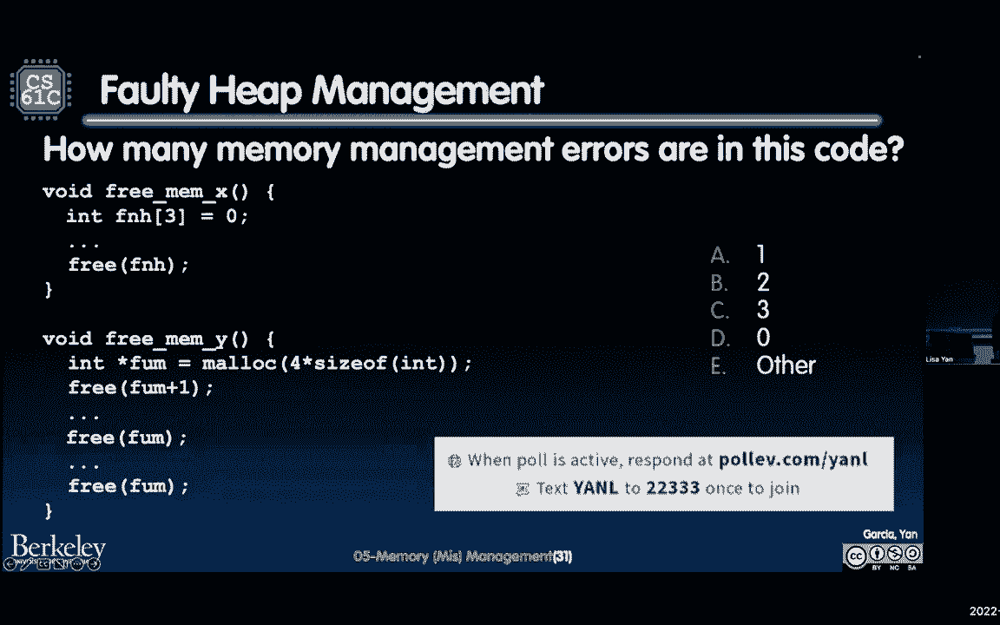

让我们看看它是什么样子，有趣有趣，所以你有很多三个，这是关于加州大学伯克利分校的一个很好的部分，你们都很擅长考试，所以你看到的是零，立刻开始怀疑，所以我很高兴你们都没说零，根据讲座的流程。

所以答案是三个，让我们把它们指出来，第一个发生在screen mex函数中，我们有一些f和h变量，但它在堆栈上声明了，然后你试图在指针上调用空闲，在堆栈上声明的，这违背了预期。

指针是从木槌呼叫或现实呼叫中创建的东西，所以这是一个错误，你会看到，实际上，我相信编译器在这种情况下会崩溃，可能或可能发生在运行时，我真的会尝试一下，第二个是当你释放一个指针，又不是那个。

那不是木槌传回的地址，因为你释放了地址，加一个，然后像三就会像好的，我要试试，但又一次，因为Malloc在引擎盖下的工作方式，我们不打算说太多，这也可能出错，然后这里的第三个是双免。

这个在幻灯片上很容易发现，但这也是一个非常复杂的问题。

一旦你真正开始写真正的C代码，这里有什么外卖，阀门研磨救援，我们将讨论一种叫做阀磨或阀磨的工具，取决于你生活在世界的哪个地方，我开玩笑的，它实际上叫瓦尔格林德，但很多人把它叫做布莱恩，反正。

它以一个数量级的速度向你的程序流动，但允许您实际检查内存泄漏，滥用数组末端的自由写入。

所有这些都是必不可少的，你会知道最后一小块是。

我想给你看一个预览，如果您要观看堆分配器如何工作的记录。

就是这里，给大家看一下，为什么堆不一定按连续顺序分配东西，假设我们有一个用100字节调用的请求r one mala，然后他就像没事一样，我在向上成长，你会得到这里的第一个街区。

然后第二个请求是Valten字节，然后分配器可能会像好吧，听起来很酷，真寒心，我要把你放在我们的上面，R一个走了，也许免费的R 1发生了，然后R 3出现在我们的三个，说嘿，给我M50字节。

现在分配器有一个决定，我应该把我们的三个放在热的开始，还是我应该把它放在暖气的尽头，什么使最多的选择，如果我在中间有这样的空间，就像这里的50个字节，会把我的堆弄得支离破碎吗，就像不允许我做得更大。

或者以后收到更大的请求，查看视频了解更多信息，有一个精彩的劳动，白天周末保持凉爽，天气会很热。

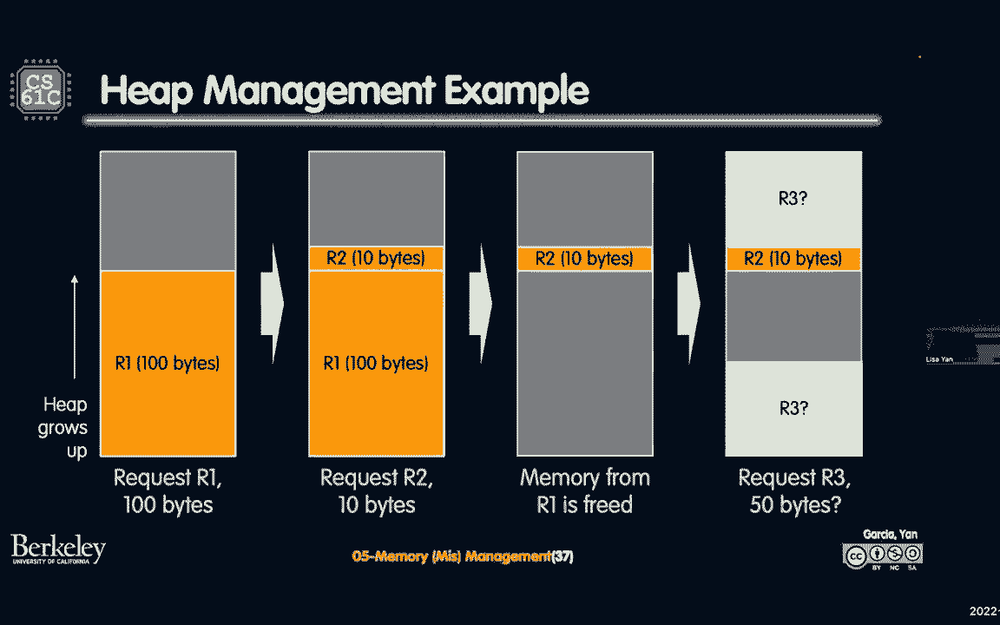