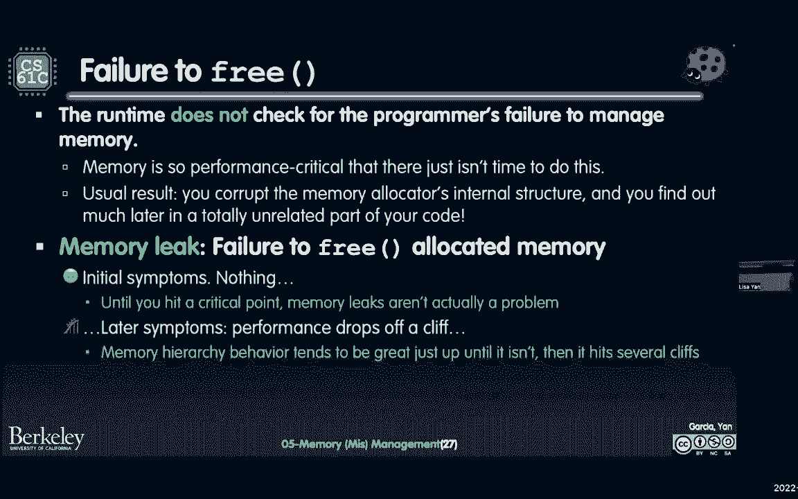

# 课程 P6：Lecture 5 - 内存（错误）管理 🧠💥

在本节课中，我们将要学习 C 语言中内存管理的核心概念，包括内存的不同区域（如栈和堆）、动态内存分配函数（`malloc`、`free`、`realloc`）的使用，以及常见的内存错误类型。理解这些内容对于编写健壮、高效的 C 程序至关重要。

## 数组大小与指针衰减 📏➡️📌

上一节我们介绍了数组和指针的基本概念，本节中我们来看看一个关于数组大小的具体练习，它揭示了指针衰减的重要现象。


考虑以下代码，问题是：打印出的选项是什么（A 或 B）？


```c
#include <stdio.h>

void mysterious(int arr[]) {
    printf(“%zu\n”, sizeof(arr));
}

int main() {
    short nums[] = {1, 2, 3, 4, 5};
    printf(“%zu\n”, sizeof(nums));
    printf(“%zu\n”, sizeof(nums) / sizeof(short));
    mysterious(nums);
    return 0;
}
```

正确答案是 B。让我们来解释原因。


*   `sizeof` 是一个编译时运算符。编译器在编译阶段就会确定其操作数的大小。
*   对于数组 `nums`，`sizeof(nums)` 计算的是整个数组占用的字节数。这里 `nums` 是一个包含 5 个 `short` 类型元素的数组。假设 `short` 占 2 个字节，那么 `sizeof(nums)` 的结果是 `5 * 2 = 10` 字节。
*   `sizeof(nums) / sizeof(short)` 计算的是数组中元素的数量，即 `10 / 2 = 5`。
*   关键点在于 `mysterious` 函数。当数组 `nums` 作为参数传递给函数时，会发生“数组到指针的衰减”。这意味着在函数内部，形参 `arr` 不再被视为一个数组，而是一个指向数组首元素的指针（即 `short*` 类型）。
*   因此，在 `mysterious` 函数内部，`sizeof(arr)` 计算的是指针 `arr` 本身的大小（例如，在 32 位系统上是 4 字节，在 64 位系统上是 8 字节），而不是原数组的大小。


理解 `sizeof` 在数组和指针上的不同行为，对于后续理解动态内存分配非常有帮助。

## C 程序的内存布局 🗺️


在深入讨论动态内存之前，我们需要建立一个关于 C 程序地址空间的心智模型。我们可以将内存想象成一个非常长的字节数组。

以下是内存的四个主要部分：

1.  **栈**：用于存储局部变量、函数参数和返回地址。当函数被调用时，其栈帧被压入栈；函数返回时，栈帧被弹出。栈通常从高地址向低地址增长。
2.  **堆**：用于动态内存分配（通过 `malloc` 等函数）。堆从低地址向高地址增长，与栈的增长方向相反。堆的大小可以在程序运行时改变。
3.  **静态数据区**：用于存储全局变量和静态变量。这个区域的大小在程序编译时确定，不会增长或缩小。
4.  **代码区（文本段）**：用于存储程序的可执行指令。


此外，地址 `0`（NULL）是一个特殊地址，对其进行读写通常会导致程序崩溃。

静态变量（在函数外声明）存储在静态数据区，其生命周期贯穿整个程序。局部变量（在函数内声明）存储在栈上，其生命周期仅限于其作用域。接下来我们将重点讨论栈和堆的管理。


## 栈内存管理 ⬇️

栈内存的管理是自动的，由编译器负责。每个函数调用都会在栈上创建一个新的“栈帧”，其中包含了该函数的参数、局部变量以及返回地址。

一个称为“栈指针”的寄存器始终指向当前栈帧的顶部。考虑一个调用链：`main` -> `a` -> `b` -> `c` -> `d`。随着每个函数被调用，栈指针下移（栈增长）；随着每个函数返回，栈指针上移（栈收缩）。

关于栈指针，有一个重要的注意事项：**将指针传递到更深的栈空间（即调用者的栈帧）通常是安全的**，因为调用者的局部变量在调用期间依然存在。例如，`main` 函数中有一个缓冲区，将其地址传递给另一个函数 `load_buffer` 是可行的，因为 `main` 的栈帧在 `load_buffer` 执行期间仍然有效。


然而，**返回指向栈内存的指针是灾难性的错误**。如果一个函数返回了其局部变量的地址，当该函数返回后，其栈帧可能被后续的函数调用覆盖。此时，指向原栈地址的指针就变成了“悬空指针”，读取它可能得到垃圾数据，写入它则会破坏当前活跃函数的栈帧，导致未定义行为。

为了避免栈内存的问题，并实现跨函数调用的持久化数据存储，我们需要使用堆内存。

## 堆内存与动态分配 ⬆️

堆内存，也称为动态内存，在程序运行时通过特定函数进行分配和释放。这与 Java 中的 `new` 关键字作用类似。堆内存对于需要跨函数持久存在的数据非常有用，但它也是指针错误和内存泄漏的主要来源。


需要澄清的是，这里的“堆”是指内存区域，与数据结构中的“堆”是完全不同的概念。堆内存的分配不是连续的，两次连续的 `malloc` 调用返回的地址可能相距甚远。决定内存块具体位置的是“堆分配器”。

以下是用于堆内存管理的三个核心 C 库函数：

*   `void* malloc(size_t size)`：分配指定字节数的未初始化内存块，并返回指向该内存块起始地址的 `void*` 指针。如果分配失败，则返回 `NULL`。
*   `void free(void* ptr)`：释放之前由 `malloc`、`calloc` 或 `realloc` 分配的内存块。参数 `ptr` 必须是之前这些函数返回的地址。
*   `void* realloc(void* ptr, size_t new_size)`：调整之前分配的内存块的大小。它可能返回一个新的地址，并将原有数据复制到新位置。如果 `ptr` 为 `NULL`，则其行为等同于 `malloc(new_size)`。如果 `new_size` 为 0，则其行为等同于 `free(ptr)`。


与栈不同，堆内存只有在程序员显式调用 `free` 时才会被释放，否则将一直存在，直到程序结束。

### `malloc` 使用示例

以下是使用 `malloc` 的两个常见例子：

1.  **为结构体分配内存**：
    ```c
    struct TreeNode {
        int value;
        struct TreeNode* left;
        struct TreeNode* right;
    };
    struct TreeNode* tp = (struct TreeNode*)malloc(sizeof(struct TreeNode));
    ```
    注意，我们使用 `sizeof(struct TreeNode)` 而不是硬编码字节数，这保证了代码在不同平台上的可移植性。同时，我们将 `malloc` 返回的 `void*` 显式转换为 `struct TreeNode*`。


2.  **为数组分配内存**：
    ```c
    int* arr = (int*)malloc(20 * sizeof(int));
    ```
    这里我们分配了一个足以容纳 20 个 `int` 的连续内存块。同样，使用 `sizeof(int)` 确保了可移植性。

### `free` 与 `realloc` 注意事项

使用 `free` 时，必须传入由分配函数返回的**原始地址**。违反此约定会导致未定义行为。

使用 `realloc` 时，必须注意其返回值可能是一个**新的地址**。因此，常见的模式是使用一个临时指针来接收 `realloc` 的结果，检查是否为 `NULL`（分配失败），然后再赋值给原指针。
```c
int* new_arr = (int*)realloc(arr, 40 * sizeof(int));
if (new_arr != NULL) {
    arr = new_arr; // 更新指针
} else {
    // 处理分配失败，原 arr 指向的内存依然有效
}
```

## 链表操作示例 🔗

让我们通过一个在链表头部插入节点的例子，来综合运用动态内存分配和双指针的概念。

```c
struct node {
    char* data;
    struct node* next;
};

void add_to_front(struct node** head_ref, char* new_data) {
    // 1. 为新节点分配堆内存
    struct node* new_node = (struct node*)malloc(sizeof(struct node));
    // 2. 为新节点的数据分配堆内存并复制字符串
    new_node->data = (char*)malloc(strlen(new_data) + 1);
    strcpy(new_node->data, new_data);
    // 3. 设置新节点的 next 指针指向原链表头
    new_node->next = *head_ref;
    // 4. 更新链表头指针，使其指向新节点
    *head_ref = new_node;
}


int main() {
    struct node* head = NULL;
    add_to_front(&head, “abc”);
    // ... 后续操作
    return 0;
}
```


在这个例子中：
*   `add_to_front` 接收一个指向头指针的指针（双指针 `head_ref`），这样它就能修改调用者（`main` 函数）中的 `head` 变量。
*   函数内两次调用 `malloc`：一次为 `struct node` 节点本身，一次为节点内的字符串数据。这两个内存块都在堆上，生命周期独立于函数调用。
*   最后一步 `*head_ref = new_node;` 通过解引用双指针，直接修改了 `main` 函数中 `head` 变量的值，使其指向新创建的节点。


如果不使用双指针，函数将无法修改调用者的头指针，新节点在函数返回后就会丢失。


## 常见内存错误 🚨

堆内存管理不当会导致多种严重错误。我们可以将其类比为一份必须遵守的“教父合同”，违反合同将招致麻烦。



主要的错误类型包括：

1.  **内存泄漏**：分配了内存（`malloc`），但在程序结束前忘记了释放它（`free`）。这会导致程序占用的内存不断增长，最终可能耗尽系统资源。泄漏通常不会立即导致崩溃，但会严重影响性能和稳定性。
2.  **释放后使用**：在调用 `free` 释放了一块内存后，仍然通过指针访问该内存。这会导致读取到垃圾数据或写入时破坏其他数据（如果该内存区域已被重新分配），是安全漏洞的常见来源。
3.  **重复释放**：对同一块内存多次调用 `free`。这会导致堆管理器的内部数据结构损坏，进而引发不可预知的崩溃。

此外，在使用 `realloc` 时也容易犯错：
*   **忘记更新指针**：`realloc` 可能返回新地址，如果忘记用返回值更新原指针，原指针就变成了悬空指针。
*   **直接使用原指针接收返回值**：如 `ptr = realloc(ptr, new_size);`，如果 `realloc` 失败返回 `NULL`，则原指针丢失，导致内存泄漏。


## 错误识别练习与工具 🛠️


识别内存错误需要练习。考虑以下代码片段，其中包含了多个内存管理错误：

```c
void some_func() {
    int f, h;
    int* ptr = &f;
    free(ptr); // 错误 1: 尝试释放栈地址
}


int main() {
    int* p = (int*)malloc(sizeof(int));
    free(p + 1); // 错误 2: 释放非 malloc 返回的原始地址
    free(p);     // 正确
    free(p);     // 错误 3: 重复释放
    return 0;
}
```


错误分析：
1.  错误 1：`ptr` 指向栈上的局部变量 `f`，对其调用 `free` 是未定义行为。
2.  错误 2：`free` 的参数必须是 `malloc`/`calloc`/`realloc` 返回的**精确**地址。`p + 1` 不是原始地址。
3.  错误 3：对已经释放的指针 `p` 再次调用 `free`，属于重复释放。


为了帮助检测这些错误，我们可以使用名为 **Valgrind** 的工具。它可以检测内存泄漏、非法内存访问、使用未初始化的值等多种问题，是 C/C++ 程序员调试内存问题的利器。

## 堆分配器内部机制预览（可选）🔍


为什么堆分配不是连续的？堆分配器需要管理一系列空闲和已用的内存块。当收到分配请求时，它会在空闲块中寻找合适大小的空间。当内存被释放时，该块又变回空闲。这个过程可能导致内存碎片——即空闲内存分散在许多小块中，无法满足一个大的连续分配请求。分配器需要采用策略（如“首次适应”、“最佳适应”）来决定如何分配和合并内存块，以平衡性能和碎片化程度。


---


本节课中我们一起学习了 C 语言内存管理的核心知识。我们了解了栈和堆的区别，掌握了 `malloc`、`free`、`realloc` 等动态内存管理函数的使用方法，并通过链表示例实践了双指针的应用。最后，我们重点分析了内存泄漏、释放后使用和重复释放等常见错误及其危害。牢记“谁分配，谁释放”的原则，并善用 Valgrind 等工具进行检查，是写出高质量 C 代码的关键。