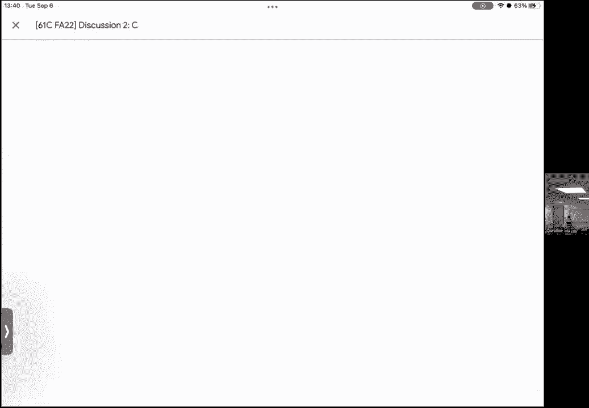
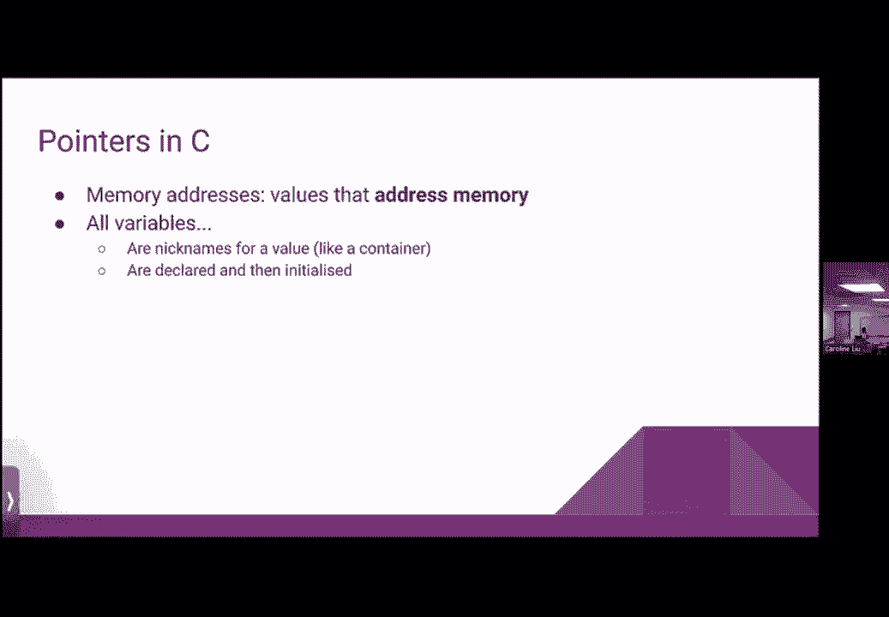
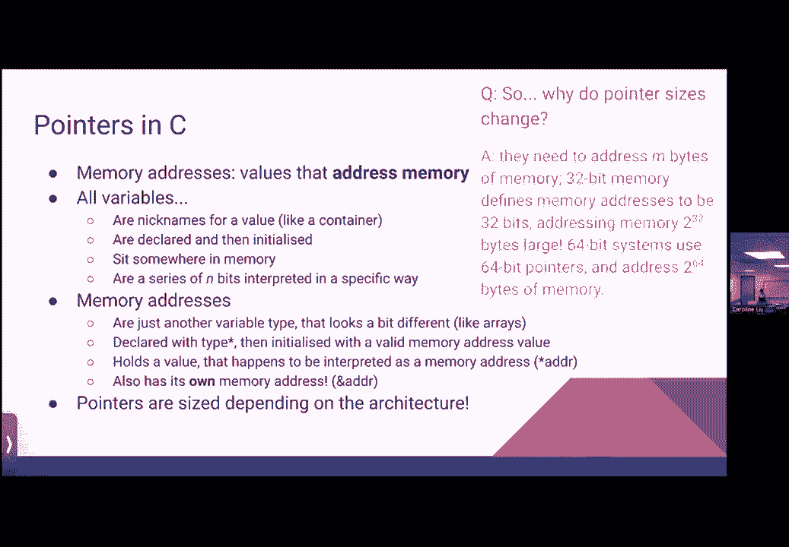
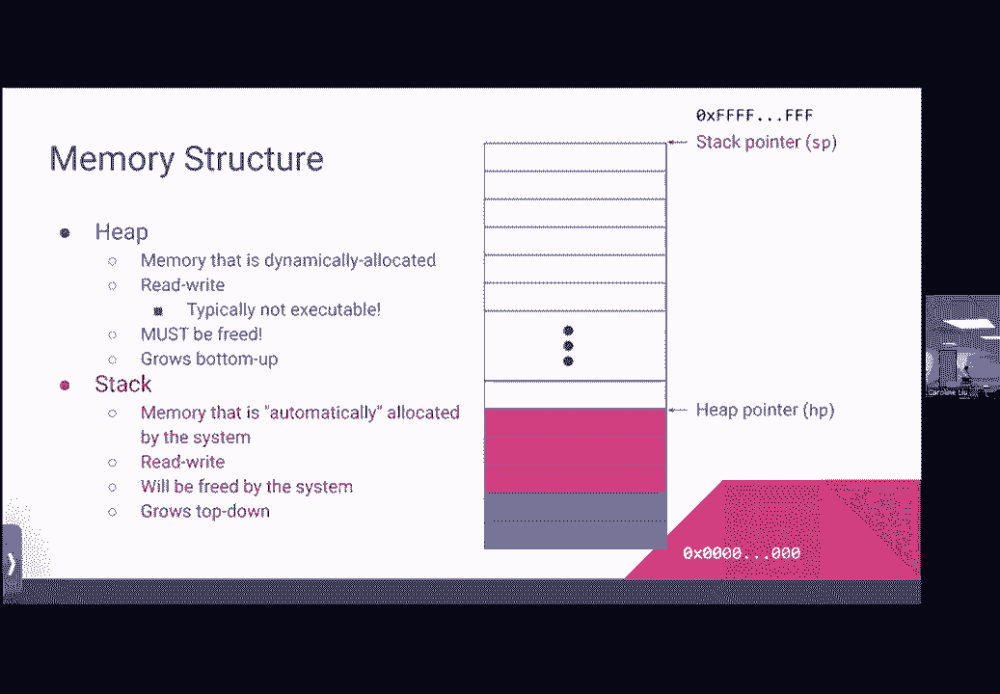
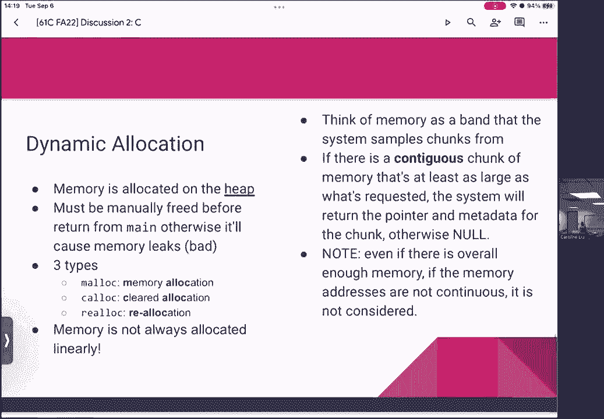
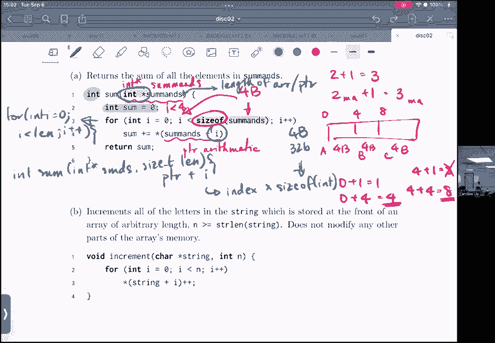

# 课程 P7：讨论课 2 - C 语言内存基础 🧠


在本节课中，我们将学习 C 语言中关于内存的核心概念。我们将回顾 C 的基础知识、内存的结构与行为、函数调用时的内存状态，并通过练习题来巩固理解。课程内容力求简单直白，适合初学者。


---

## 概述 📋

C 语言是静态类型的，这意味着我们需要明确指定数据的类型。类型决定了如何解释一系列比特。例如，八个比特可以解释为一个字符、一个整数或一个内存地址。

**核心概念**：类型转换（Casting）
```c
int a = 10;
char c = (char)a; // 将整数 a 转换为字符类型
```

---

## 数据类型与大小 📏

一个字符（`char`）总是一个字节（在 61C 课程中定义为 8 位）。其他类型的大小可能因系统而异：
*   `short`：至少 2 个字节。
*   `int`：至少 4 个字节（通常是有符号的）。
*   `long`：至少 8 个字节。
*   指针（内存地址）：在 32 位系统中是 4 字节，在 64 位系统中是 8 字节。本课程默认使用 32 位系统。

指针的大小之所以变化，是因为它需要能够寻址系统所有可用的内存字节。32 位系统有 2^32 个可能的地址，因此需要 32 位（4 字节）来表示。

---




## 内存与数组 🧱

内存可以被视为一个巨大的连续字节数组。数组就是内存中一块连续的存储区域。




**核心概念**：数组索引与内存地址
假设有一个字符数组 `char arr[5]`，它在内存中占据 5 个连续的字节。`arr[0]` 的地址是最低的。

关于字节在内存中的存储顺序，有两种方式：
*   **小端序（Little-endian）**：最低有效字节存储在最低的内存地址。这是 x86 等大多数现代系统使用的方式。
*   **大端序（Big-endian）**：最高有效字节存储在最低的内存地址。

---

## 指针详解 🎯

变量是存储在内存中某个地址的值的“昵称”。指针是一种特殊的变量，其存储的值是一个内存地址。

**核心概念**：声明与解引用
```c
int x = 2;        // 一个整数变量
int *p = &x;      // p 是一个指针，其值是 x 的内存地址
int y = *p;       // 解引用 p：获取 p 所指向地址（即 x 的地址）存储的值，y 等于 2
```
*   `&` 运算符：获取变量的地址。
*   `*` 运算符（在类型后）：声明一个指针。
*   `*` 运算符（在变量前）：解引用，获取指针指向的值。

指针本身也存储在内存中，因此可以有指向指针的指针（`int **pp = &p`）。

---

## 内存的布局与分区 🗺️



程序的内存通常被划分为几个主要部分：


1.  **代码/文本区（Code/Text）**：存储可执行的机器指令。通常是**只读（Read-Only）**的。
2.  **静态/数据区（Static/Data）**：存储全局变量和静态变量。部分可能是只读的（如常量），部分是可读写的。
3.  **堆区（Heap）**：用于**动态内存分配**（如 `malloc`, `calloc`）。由程序员手动管理（分配和释放）。从低地址向高地址增长。
4.  **栈区（Stack）**：用于函数调用，存储局部变量、函数参数等。由系统自动管理。从高地址向低地址增长。

栈和堆相向生长，如果它们相遇，就会发生“堆栈溢出”。

**权限说明**：
*   **R**：读
*   **W**：写
*   **X**：执行
现代系统通常遵循“W^X”原则，即一块内存区域不能同时可写和可执行，以增强安全性。

---

## 动态内存分配 ⚙️

动态内存分配在堆上进行。如果分配的内存不再需要，必须手动释放，否则会导致“内存泄漏”。

**核心函数**：
*   `void *malloc(size_t size)`：分配指定字节数的内存，返回指向该内存的指针。内存内容是未初始化的“垃圾值”。
*   `void *calloc(size_t num, size_t size)`：分配 `num` 个长度为 `size` 的连续内存，并**初始化为 0**。
*   `void *realloc(void *ptr, size_t new_size)`：重新调整之前分配的内存块大小。
*   `void free(void *ptr)`：释放之前分配的内存。







**内存碎片化**：频繁分配和释放不同大小的内存块可能导致空闲内存不连续，即使总空闲空间足够，也可能无法满足大块内存的分配请求。

---

## 指针算术 ➕

可以对指针进行算术运算（加、减），其单位是**指针所指向类型的大小**。

```c
int arr[5];
int *p = &arr[0]; // p 指向 arr[0]
p = p + 1;        // 现在 p 指向 arr[1]，地址实际增加了 sizeof(int)（通常是4）个字节
```
这比直接操作地址更方便，因为编译器会自动考虑类型大小。


---

## 字符串与字符数组 📝

在 C 语言中，字符串本质上是**以空字符（`\0`）结尾的字符数组**。

**重要区别**：
```c
char str1[] = "Hello"; // 字符数组，内容在栈上，**可以修改**
char *str2 = "World";  // 指针指向字符串字面量，通常存储在只读数据区，**不可修改**
```
`str1` 是一个数组，你可以修改其中的字符。`str2` 是一个指针，指向一个字符串常量，尝试修改其内容可能导致运行时错误。

处理字符串时，请务必确保其以 `\0` 结尾，否则使用 `strlen`、`strcpy` 等函数时会出现错误。

---

## 按值传递与按引用传递 🔄

C 语言的函数参数传递默认是**按值传递**。这意味着函数内部获得的是实参值的一个副本。要修改原始变量，需要传递它的指针（即按引用传递）。

```c
void increment(int x) {
    x++; // 只修改了副本，不影响外部变量
}
void real_increment(int *x) {
    (*x)++; // 解引用指针，修改原始变量
}
```

---

## 总结 🎓

本节课我们一起学习了 C 语言内存管理的核心知识：
1.  **数据类型与指针**：理解了变量、内存地址和指针的关系，以及如何声明、初始化和使用指针。
2.  **内存布局**：认识了代码区、静态区、堆区和栈区的不同作用与特点。
3.  **动态内存管理**：学习了如何使用 `malloc`、`free` 等函数在堆上分配和释放内存，并了解了内存泄漏和碎片化的概念。
4.  **字符串本质**：明确了 C 语言中字符串是以空字符结尾的字符数组，并区分了可修改与不可修改的字符串声明方式。
5.  **参数传递**：掌握了 C 语言按值传递的特性，以及如何通过指针实现按引用传递。



掌握这些概念是理解 C 程序如何运作以及后续学习更复杂主题（如数据结构、系统编程）的基础。请务必通过练习题来巩固这些知识。