# 课程 P8：Lecture 6 - 浮点数表示法 🧮

在本节课中，我们将要学习计算机中如何表示带有小数部分的数字，即浮点数。我们将从简单的定点表示法开始，逐步过渡到更高效、更通用的浮点表示法，并深入探讨其背后的IEEE 754标准。

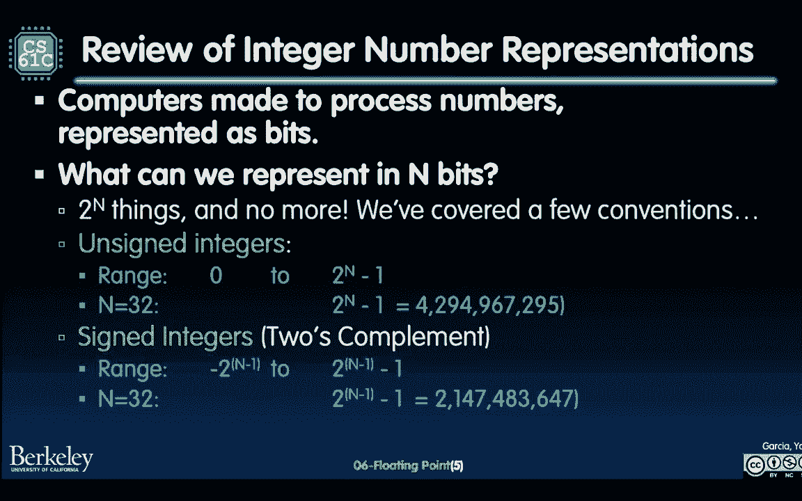

## 概述：从整数到小数

到目前为止，我们一直在讨论整数的表示方法。我们学习了无符号整数和有符号整数（特别是补码表示法）。然而，现实世界和计算中不仅仅只有整数，还有包含分数的大数或小数。例如，每千年的秒数（约3.1556×10¹⁰）或极小的物理常数（如5.29×10⁻¹¹）。这些数字无法用我们之前学过的整数格式来精确表示。

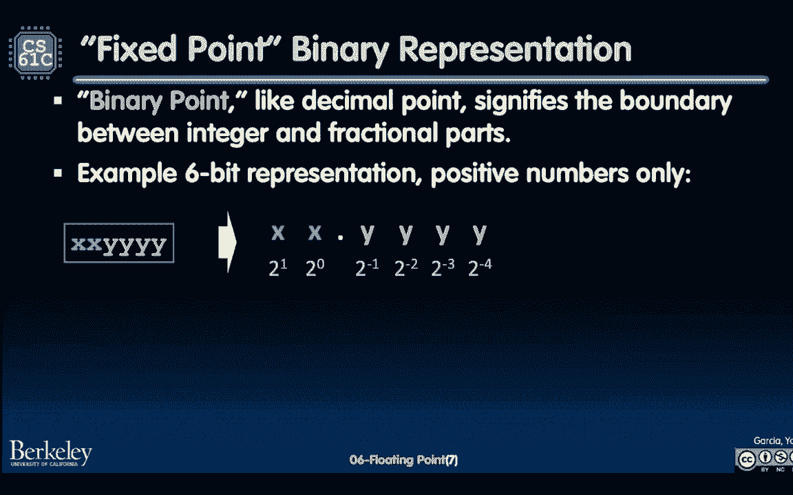

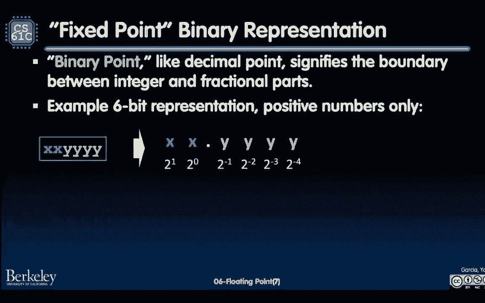

为了解决这个问题，我们需要一种能够表示整数部分和小数部分的方法。本节我们将首先探讨一种直观但有限的方法——定点表示法，然后引出更强大的浮点表示法。

## 定点表示法：一个简单的起点

为了表示同时包含整数和小数部分的数字（如2.66或2.5），我们首先考虑一种简单的方法：定点表示法。这种方法将二进制点的位置固定在某两位之间。

在定点表示法中，我们像处理无符号整数一样处理比特位，但二进制点左侧的位代表2的正幂，右侧的位代表2的负幂。

**公式**：对于一个定点数，其值可以计算为：
`值 = Σ (位_i × 2^(位置_i))`，其中位置_i可以是正数（整数部分）或负数（小数部分）。

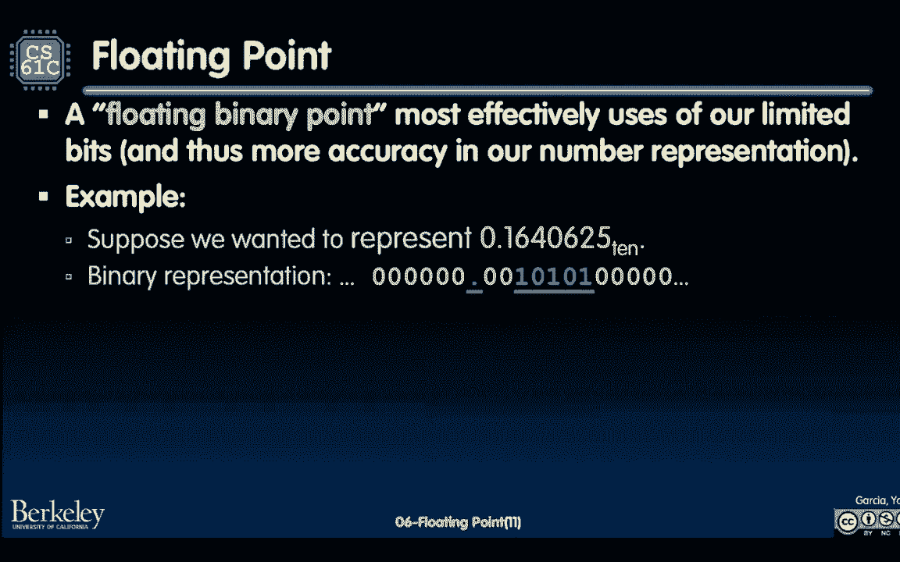

例如，对于6位定点表示 `101.010`（二进制点在第三和第四位之间），其计算过程如下：
*   1 × 2² = 4
*   0 × 2¹ = 0
*   1 × 2⁰ = 1
*   .（二进制点）
*   0 × 2⁻¹ = 0
*   1 × 2⁻² = 0.25
*   0 × 2⁻³ = 0
总和为 4 + 1 + 0.25 = 5.25（十进制）。

定点数的加法和乘法与十进制算术类似，只需对齐二进制点即可。然而，定点表示法有一个明显的缺点：为了同时表示非常大和非常小的数，我们需要非常多的位数。例如，表示一个10³⁴的大数可能需要左边34位，而表示一个10⁻¹¹的小数可能需要右边58位，总共需要92位，这非常低效。

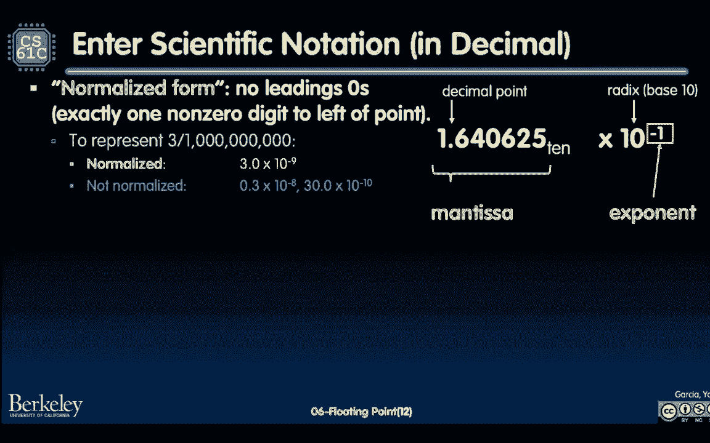

## 浮点表示法：更聪明的方案

既然定点表示法在表示范围上效率低下，那么一定有更好的方法。这就是浮点表示法。其核心思想类似于科学计数法，让二进制点可以“浮动”，从而更有效地利用比特位。

在浮点表示中，一个数字被分为几个部分来存储。以下是一个将十进制数1.640625转换为二进制浮点表示的示例：
二进制表示为：`1.101001`（后跟许多0）。
关键部分在于：
1.  **有效数字**：存储非零的有效数字部分，例如 `101001`。
2.  **指数**：存储二进制点需要移动的位数，例如，对于 `1.101001`，点需要左移1位（从 `1.101001` 到 `.1101001`），所以指数为 -1（以2为底）。

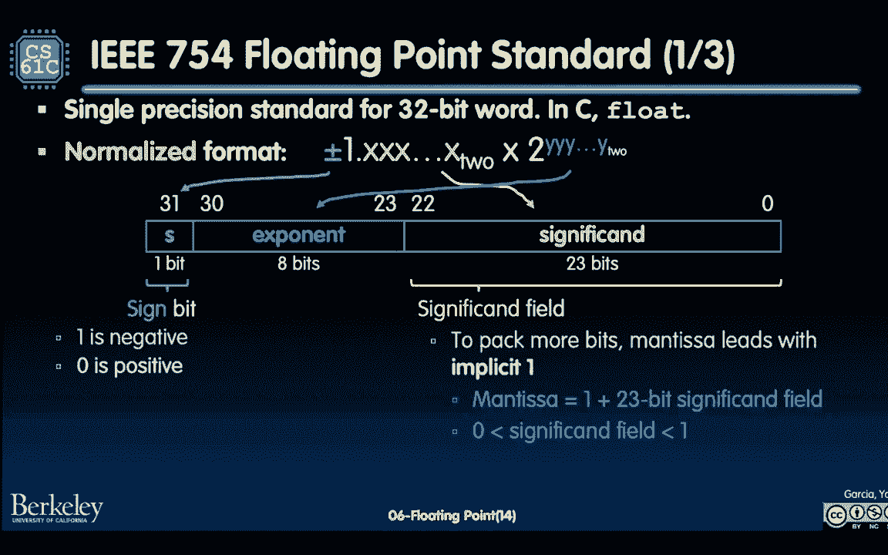

通过分别存储有效数字和指数，我们可以用更少的位数表示更大范围的数字。

## 科学计数法与规范化形式

浮点表示本质上是二进制下的科学计数法。让我们回顾一下十进制科学计数法，它由两部分组成：
*   **有效数字**：包含所有有效数字的部分，例如 1.640625。
*   **指数**：以10为底的幂，例如 10⁻¹。

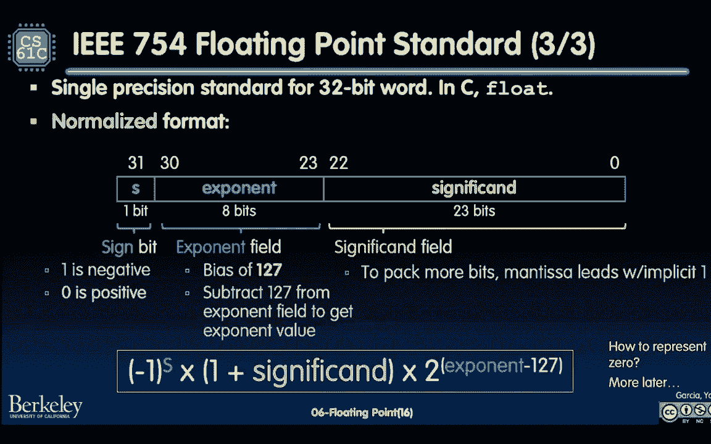

在科学计数法中，我们通常使用**规范化形式**，即确保小数点左边有一位非零数字。例如，`3.0 × 10⁻⁹` 是规范化的，而 `0.3 × 10⁻⁸` 或 `30 × 10⁻¹⁰` 则不是。

在二进制中，规范化形式有一个非常重要的特性：由于二进制只有0和1，一个规范化的二进制数其小数点左边总是**1**。这意味着在存储时，我们可以隐含这个前导的1，从而节省一个比特位，提高存储效率。

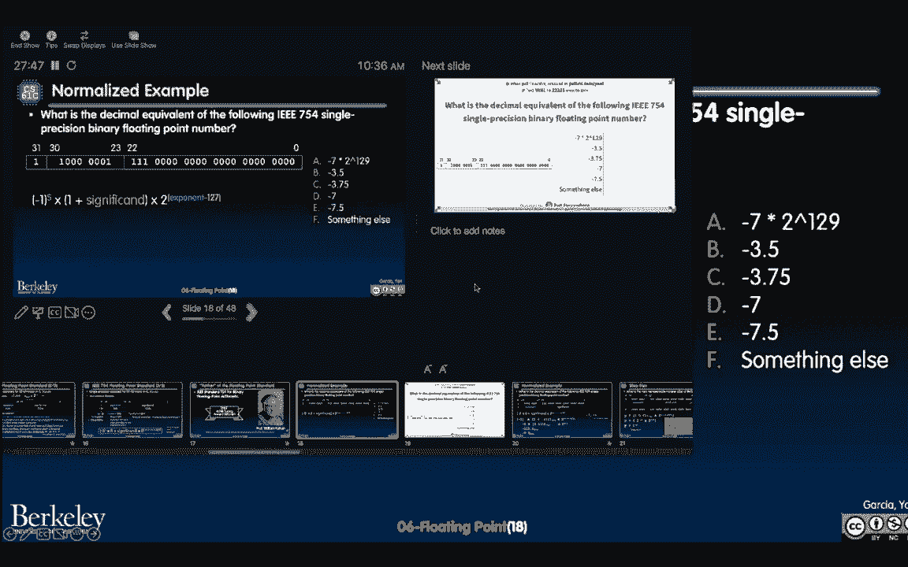

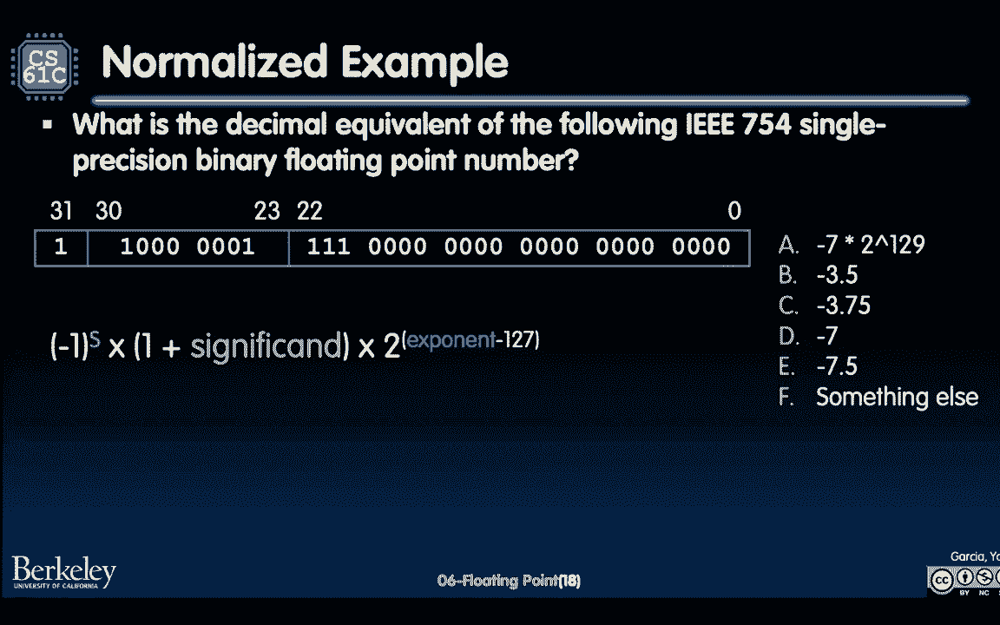

## IEEE 754 浮点标准

为了统一不同计算机体系结构中的浮点运算，IEEE制定了754标准。这是当今绝大多数计算机使用的浮点数表示和运算规范。我们将重点学习32位的单精度浮点格式。

一个单精度浮点数（float类型）的32位被划分为三个字段：
1.  **符号位**：第31位（最高位）。0表示正数，1表示负数。
2.  **指数域**：第30位到第23位，共8位。它采用**偏置表示法**，存储的值是 `实际指数 + 127`。这样设计是为了便于用整数比较硬件来快速比较浮点数的大小。
3.  **有效数字域**：第22位到第0位，共23位。它存储的是规范化二进制小数点的**小数部分**（即去掉前导1之后的部分）。因为规范化数的前导1总是存在，所以被隐含存储，在计算时需要加上。

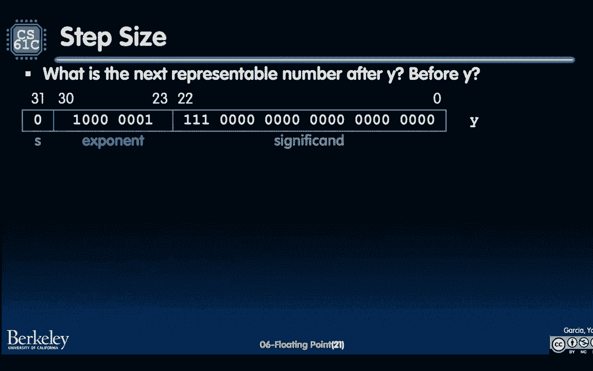

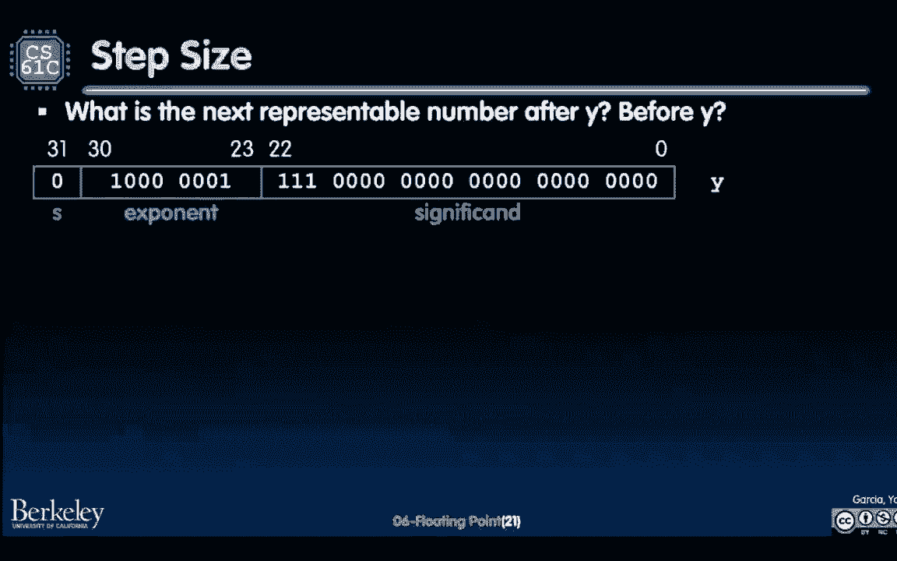

**公式**：一个单精度浮点数所表示的值可以用以下公式计算：
`值 = (-1)^符号位 × (1 + 有效数字) × 2^(指数 - 127)`

让我们通过一个例子来理解这个公式。假设32位模式为：`1 10000001 01000000000000000000000`。
*   **符号位** = 1，表示负数。
*   **指数域** = `10000001`（二进制） = 129（十进制）。实际指数 = 129 - 127 = 2。
*   **有效数字域** = `01000000000000000000000`。隐含前导1后，完整的有效数字为 `1.01`（二进制）。
*   计算数值：`-1 × (1.01)₂ × 2²`。
    *   `(1.01)₂` = 1 + 0 × 2⁻¹ + 1 × 2⁻² = 1 + 0.25 = 1.25（十进制）。
    *   乘以 2² = 4，得到 1.25 × 4 = 5.0。
    *   最终结果为 **-5.0**。

## 可表示的数字与步长

由于浮点数使用固定位数（如32位）表示，它无法表示实数轴上的所有数字。可表示的数字是离散的。两个相邻可表示浮点数之间的差值称为**步长**或**精度**。

步长的大小不是固定的，它取决于指数的大小。
*   对于相同的指数，步长是恒定的，等于 `2^(指数 - 127) × 2^(-23)`。
*   当指数较大（表示很大的数）时，步长也较大。这对于科学计算是合理的，因为大数之间的微小差异相对不重要。
*   当指数较小（表示很小的数，接近0）时，步长非常小。这提供了高精度，对于处理微小常数的科学计算至关重要。

这种可变步长的设计，使得浮点数能够在广泛的数值范围内（从极小的分数到极大的天文数字）保持相对合理的精度。

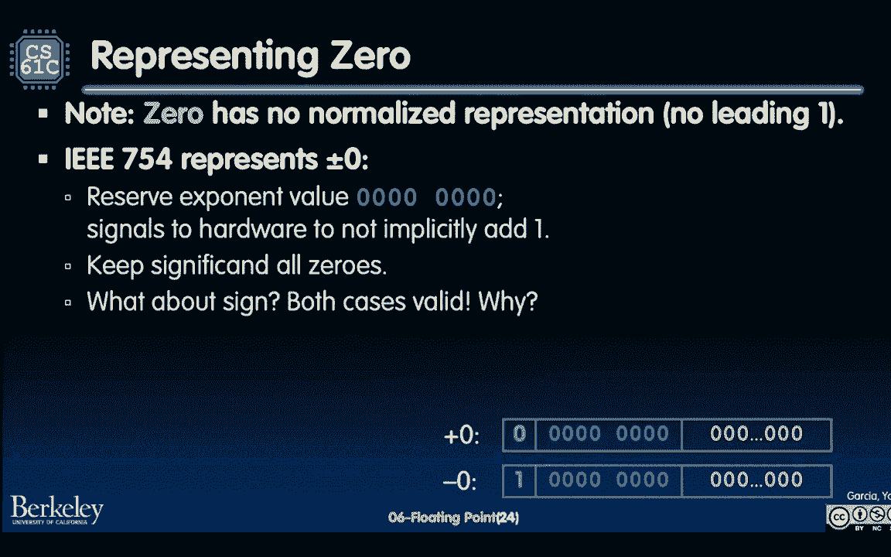

## 特殊值

IEEE 754标准预留了一些特定的指数和有效数字组合，用于表示特殊值，这对于健壮的数字计算至关重要。

以下是主要的特殊值：
1.  **零**：指数域和有效数字域全为0。根据符号位不同，有 `+0` 和 `-0` 两种表示。
2.  **无穷大**：指数域全为1（二进制`11111111`），有效数字域全为0。用于表示溢出（如除以0）的结果，有 `+∞` 和 `-∞`。
3.  **NaN**：指数域全为1，有效数字域**非零**。表示“非数字”，用于处理无效操作的结果（如对负数开平方、0/0等）。NaN有很多种，有效数字域可以用来编码错误类型。
4.  **非规范化数**：指数域全为0，但有效数字域**非零**。这些数没有隐含的前导1（即有效数字为 `0.xxx`）。它们用于表示那些比最小规范化正数还要接近0的数字，实现了**渐进式下溢**，避免了在0附近出现巨大的“精度空洞”。

## 溢出与下溢

*   **溢出**：当一个数的绝对值太大，超过了最大规范化浮点数所能表示的范围时，发生溢出。结果通常被设置为 `±∞`。
*   **下溢**：当一个数的绝对值太小，比最小规范化正数还要小，但又大于0时，发生下溢。在支持非规范化数的系统中，下溢的结果会以非规范化数的形式表示，精度逐渐降低；在不支持的系统中，可能直接归为0。

整数运算只有溢出（结果超出表示范围），而浮点运算既有溢出也有下溢，因为它需要表示非常接近0的数值。

## 总结

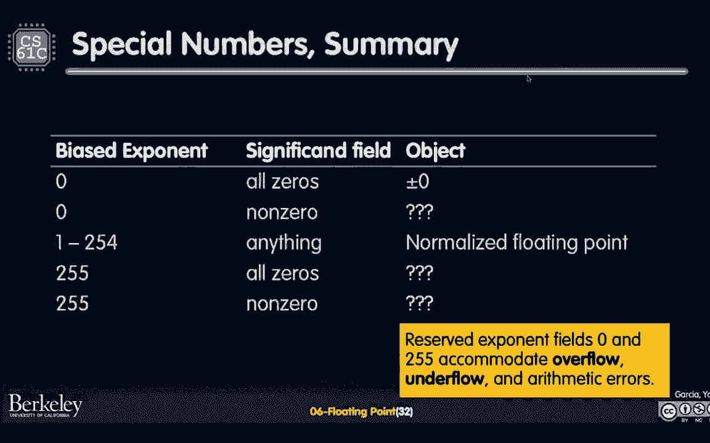

本节课我们一起学习了计算机中表示实数的方法——浮点数。我们从定点表示法的局限性出发，引入了类似于科学计数法的浮点思想。然后，我们深入探讨了业界通用的IEEE 754标准，了解了单精度浮点数的位布局、规范化形式以及其计算公式。我们还学习了浮点数可表示的数字范围、可变步长的概念，以及标准如何通过定义零、无穷大、NaN和非规范化数等特殊值来处理各种边界情况和算术错误，从而构建一个健壮的数值计算系统。理解浮点数的这些特性对于编写正确、可靠的数值计算程序至关重要。