# P9：课程7：RISC-V汇编语言入门 🚀

在本节课中，我们将结束对浮点运算的讨论，并开始学习新的主题——RISC-V汇编语言。我们将首先介绍一个实用的浮点转换工具，然后深入探讨浮点数的精度、舍入模式以及运算特性。最后，我们将正式进入汇编语言的世界，了解RISC-V的基本概念、寄存器以及简单的算术指令。


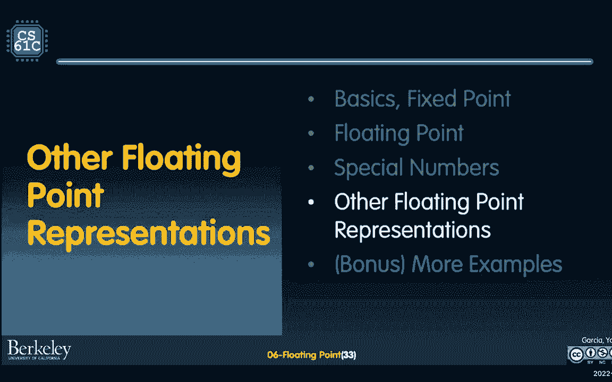

## 浮点运算回顾与工具介绍 🔧


上一节我们讨论了浮点数的基本表示。本节中，我们来看看一个非常有用的在线工具，它可以帮助我们直观地理解浮点数的位表示。

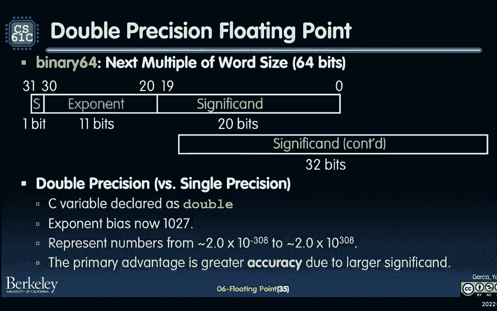

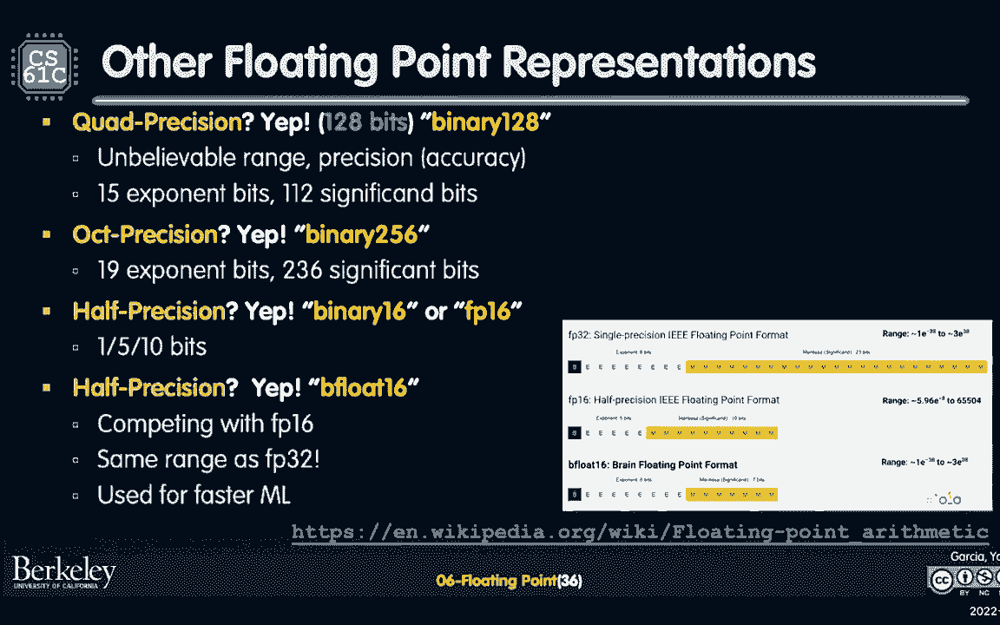

这个工具名为“IEEE-754浮点转换器”，链接在幻灯片中。它能精确地展示比特位如何映射到单精度浮点数（32位）的三个部分（符号位、指数位、尾数位）。例如，你可以勾选尾数域中的各个位，观察数值如何变化。工具会显示有偏指数、实际指数、所表示的十进制小数以及二进制和十六进制表示。


以下是一个演示：假设我想表示一个非常大的数，例如 `1.5 × 10^38`。我可以在工具中输入这个十进制数，它会自动填充对应的各个比特位。工具还提供了“加一”和“减一”按钮，用于跳转到下一个可表示的浮点数。这很好地印证了我们上节课提到的概念：在给定的指数下，你只有2^23个可表示的数字。通过这个工具，你可以精确地计算出下一个可表示的数字是什么。

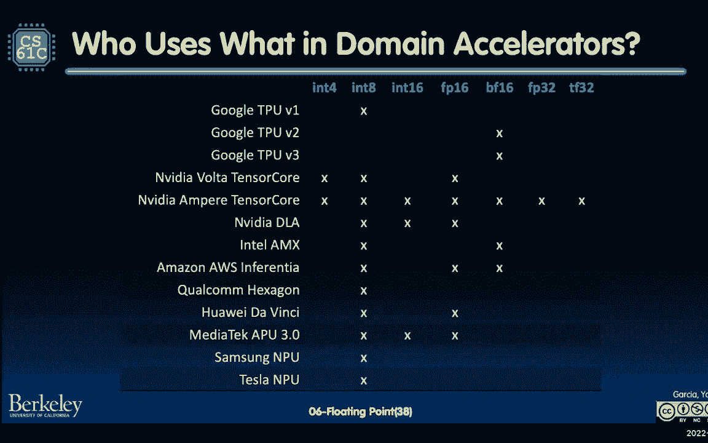

需要注意的是，这个工具目前仅适用于32位单精度浮点数。


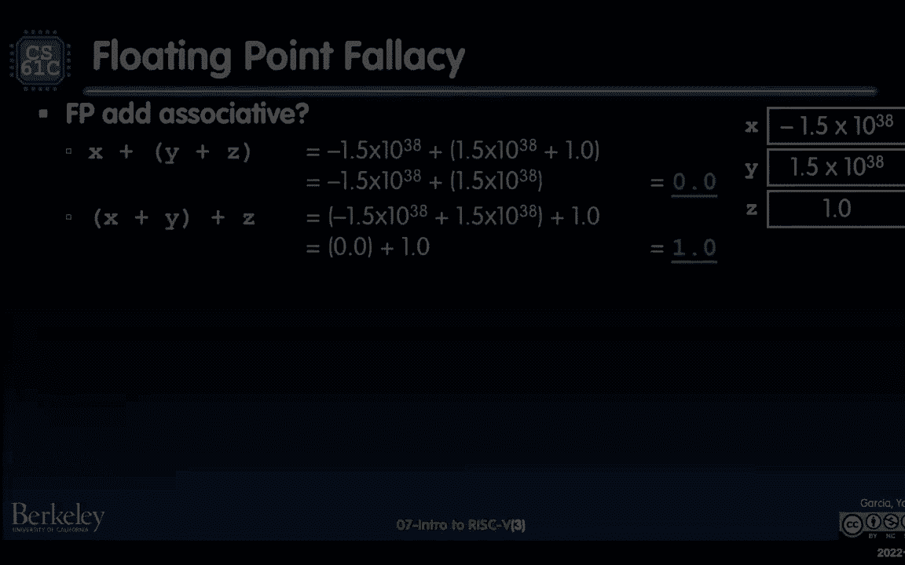

## 浮点数的精度、准确度与其他格式 📊

接下来，我们讨论一些其他表示形式，并厘清两个重要概念：精度与准确度。

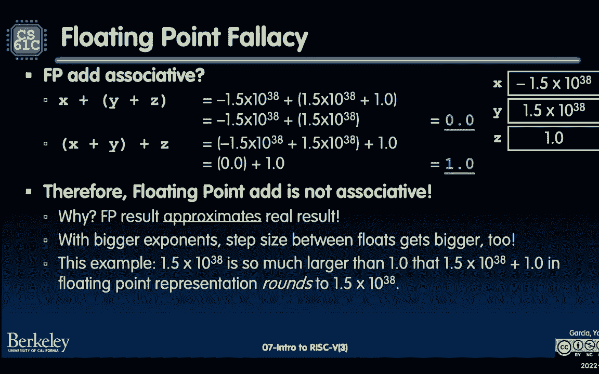

*   **精度** 是指可用的比特位数。例如，单精度有32位（1位符号 + 8位指数 + 23位尾数）。
*   **准确度** 是指计算机的表示值与你想要表示的高精度实际数值的接近程度。更多的比特位通常能带来更高的准确度，但这并非绝对保证。例如，无论你用多少位浮点数，都无法精确表示无理数π，只能得到它的近似值。

现在，让我们看看其他浮点格式：

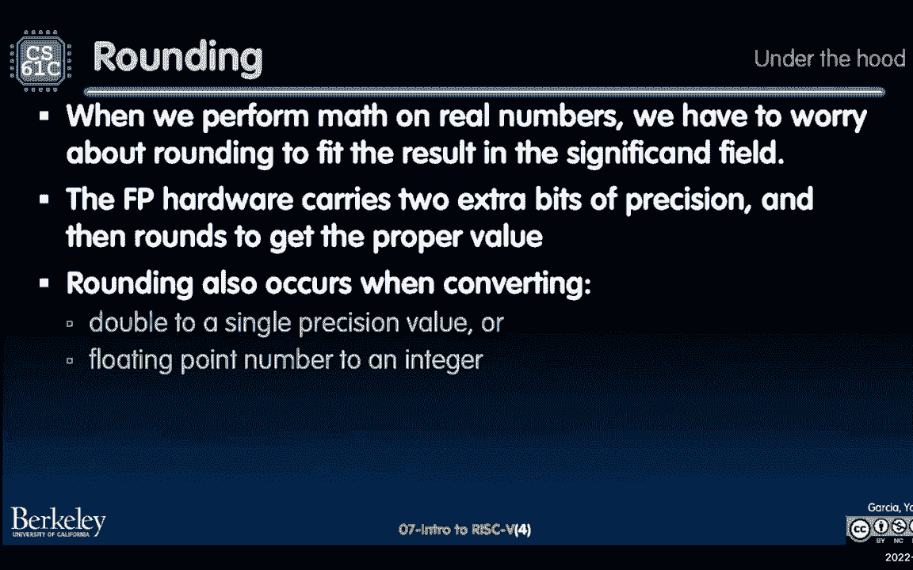


*   **双精度浮点数**：在C语言中称为 `double`，也称为binary64。它使用64位：1位符号、11位指数和52位尾数。指数偏移量是1023。与单精度相比，双精度的主要优势在于其尾数位更多，因此具有更高的精度，可以表示更大范围的数字（大约从10^-308到10^308）。
*   **其他精度**：除了单精度和双精度，还存在其他格式，如半精度（16位）、四精度（128位）等。在一些特定领域（如机器学习）的架构中，可能会使用定制的浮点格式（如FP16, BFloat16）甚至整数来表示数据，这通常是为了在精度和效率（如功耗、速度）之间取得平衡。

## 浮点数的特性与运算 🧮

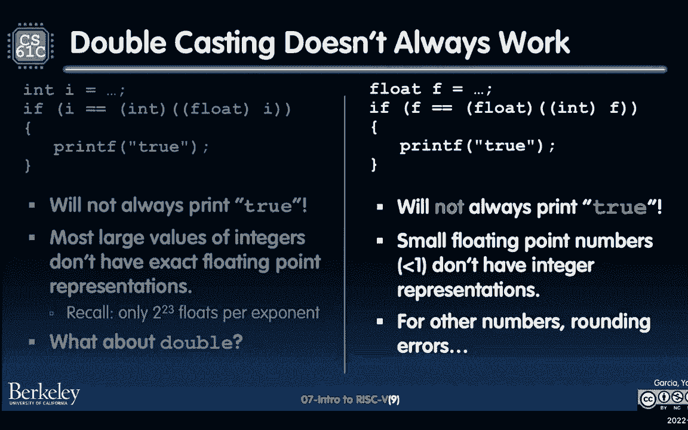

浮点数运算有一些不同于整数的特性，理解这些对编程至关重要。

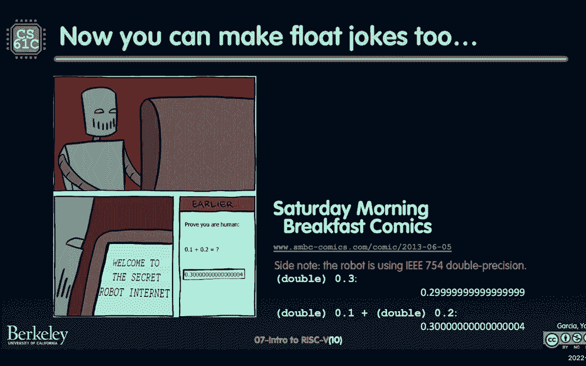


首先，**浮点加法不满足结合律**。例如，考虑 `(x + y) + z` 与 `x + (y + z)`。如果 `y` 是一个非常大的数（如 `1.5e38`），而 `z` 是一个很小的数（如 `1`），那么 `y + z` 的结果可能仍然是 `y`（因为 `z` 在 `y` 的“步长”下无法被分辨）。这会导致两种计算顺序产生不同的结果。


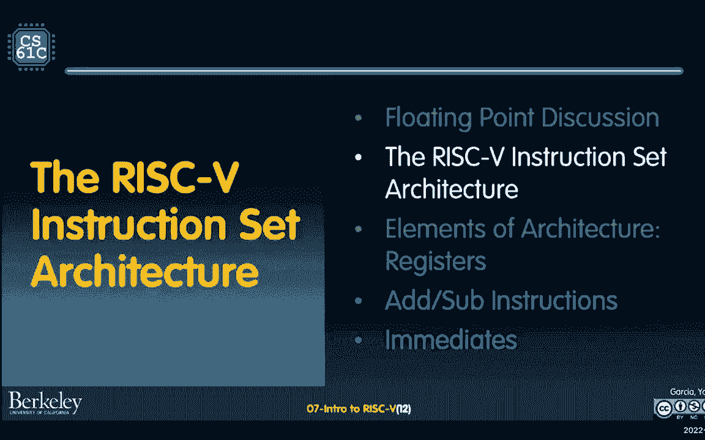

由于浮点数不能表示所有实数，因此必须定义**舍入模式**来处理近似。硬件通常使用额外的精度位来决定如何舍入。常见的舍入模式有：
*   向正无穷大舍入
*   向负无穷大舍入
*   向零舍入（截断）
*   向最近偶数舍入（默认的“无偏”模式）

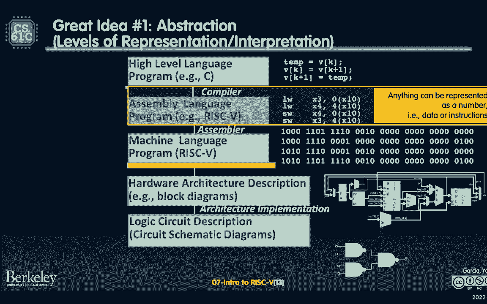

“向最近偶数舍入”规则是：当恰好处于两个可表示值的中间时，选择偶数那个。例如，2.5舍入为2，3.5舍入为4。这种模式平均而言不会总是向上或向下舍入，保证了计算的公平性。

**浮点加法运算**比整数加法更复杂，因为需要对齐指数。基本步骤是：
1.  对阶：使两个操作数的指数相同。
2.  尾数相加。
3.  将结果规范化（调整尾数和指数）。

**类型转换**也需要特别注意：
*   将 `float` 转换为 `int` 会**截断**小数部分。
*   将 `int` 转换为 `float` 会舍入到最接近的可表示浮点数。
*   注意，转换可能不是无损的。例如，一个大整数转换为 `float` 后再转回 `int`，可能因为 `float` 无法精确表示该整数而得到不同的值。同样，一个带小数的 `float` 转换为 `int` 再转回 `float`，小数信息会丢失。

一个著名的例子是验证码问题：“0.1 + 0.2 等于多少？” 如果你用双精度浮点数计算，结果可能是 `0.30000000000000004`，而不是精确的 `0.3`。这是因为 `0.1` 和 `0.2` 在二进制中无法精确表示，它们的和也存在微小的表示误差。

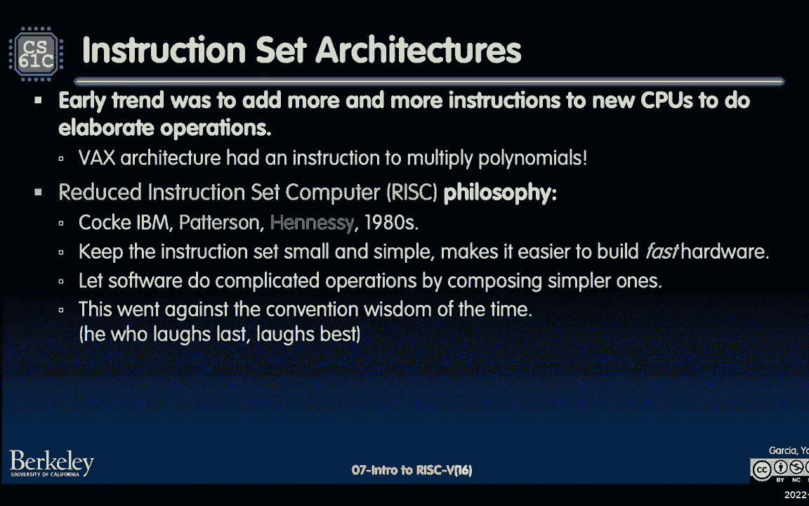

## 进入汇编语言与RISC-V的世界 ⚙️

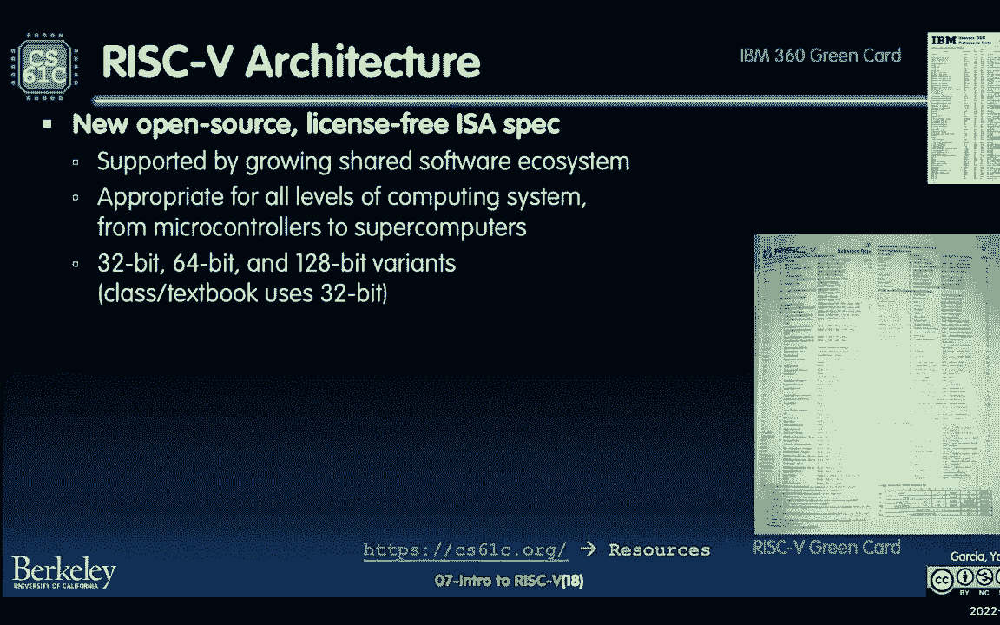

现在，我们将“换低档”，从高级语言（如C）深入到更低的一层：汇编语言。我们将聚焦于一种名为 **RISC-V** 的指令集架构。

我们可以将计算机系统想象成一系列层次：
*   高级语言（如C）
*   汇编语言（如RISC-V）
*   机器码（比特位）
*   处理器（CPU）
*   逻辑门


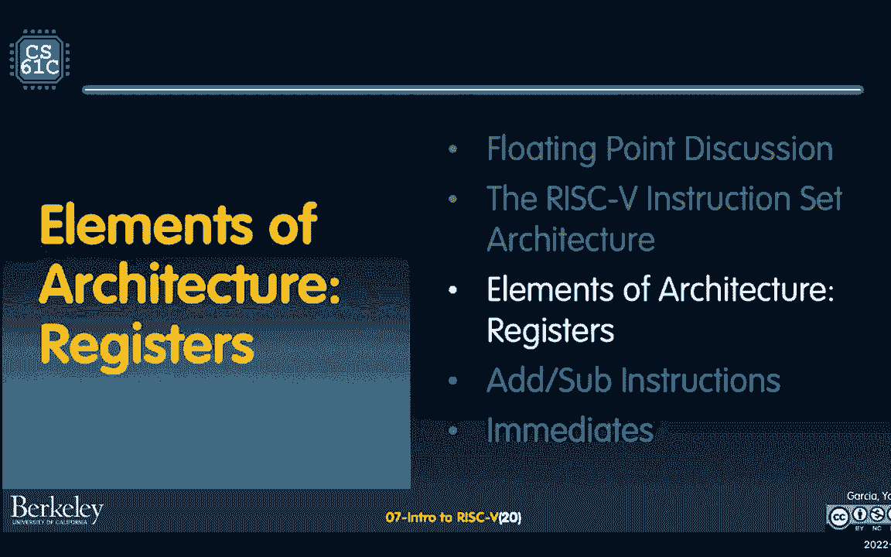


**汇编语言**是CPU能够直接理解的指令的一种人类可读表示。每一行汇编代码通常对应一条CPU指令。**指令集架构** 定义了CPU支持的所有指令和规则，它是硬件和软件之间的契约。常见的ISA有x86（Intel/AMD电脑）、ARM（手机）等。

RISC-V是一种 **精简指令集计算机** 架构。它的设计哲学源于20世纪80年代David Patterson、John Hennessy等人的工作，旨在通过保持指令集简单来简化硬件设计，而将创造复杂功能的智能留给编译器。这与当时主流的**复杂指令集计算机** 思想相反。2017年，Patterson和Hennessy因对RISC架构的贡献获得了图灵奖。

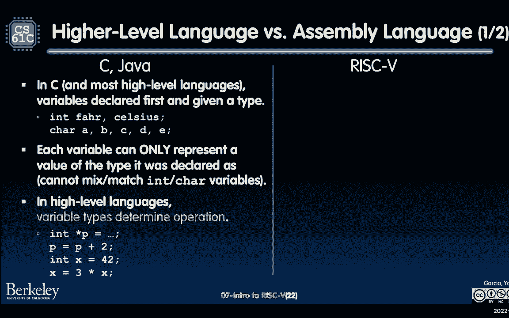

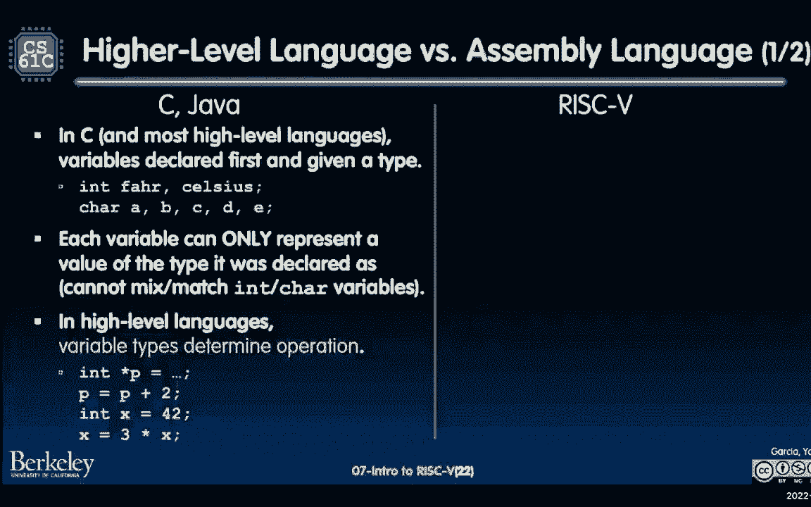

我们选择学习RISC-V是因为：
*   它简单、优雅，易于教学。
*   它是一个开源的、免版税的规范，正在被广泛采用。
*   我们的教科书也以其为基础。

## RISC-V基础：寄存器与算术指令 🧠


汇编语言与C语言的一个关键区别在于：C语言操作**变量**，而汇编语言操作**寄存器**。

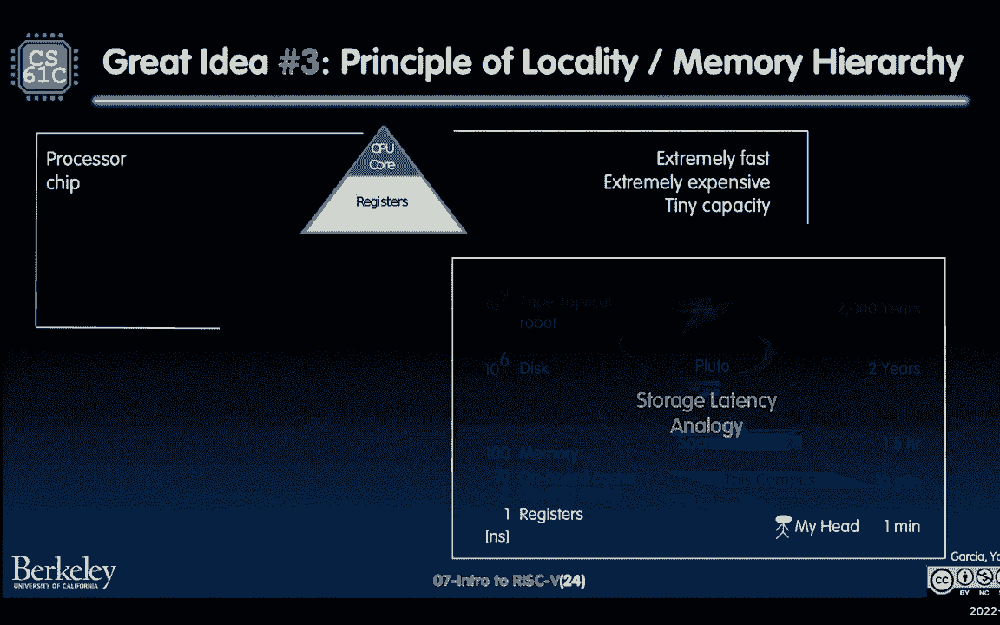


*   **变量（C语言）**：具有类型（如 `int`, `float*`），类型决定了操作的含义（例如，对指针加2意味着地址增加8字节）。
*   **寄存器（RISC-V）**：是CPU内部少量的、高速的存储位置。**寄存器本身没有类型**，它们只是存储比特位。是**指令**决定了如何解释这些比特位（如作为有符号整数、无符号整数或地址进行操作）。

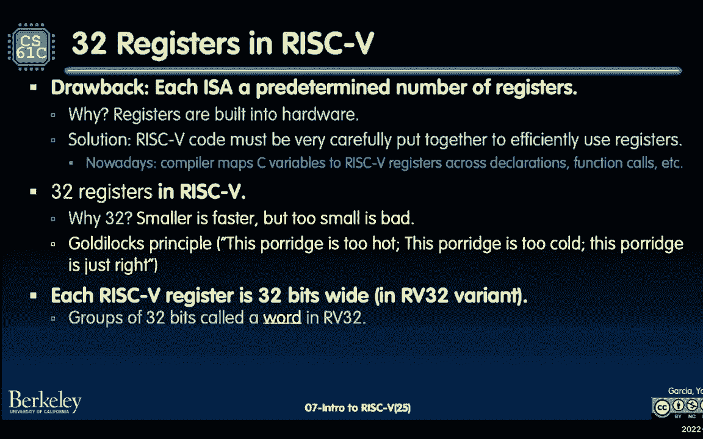

RISC-V有32个通用寄存器，编号为 `x0` 到 `x31`，每个寄存器宽度为32位（或64位，取决于变种）。寄存器 `x0` 是特殊的，它硬连线为值0，且向它写入数据不会产生任何效果（“无操作”）。


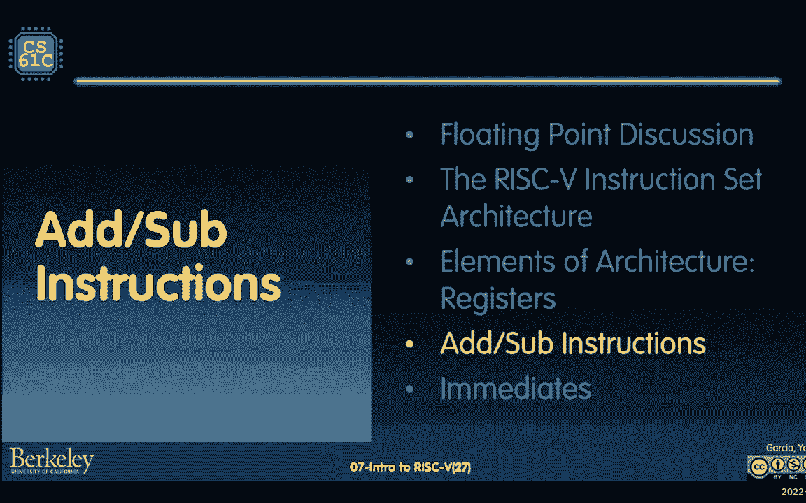

汇编指令的基本格式是：`操作名 目标寄存器， 源寄存器1， 源寄存器2`。
*   **目标寄存器**：存储操作结果的地方。
*   **源寄存器**：提供操作数的寄存器。

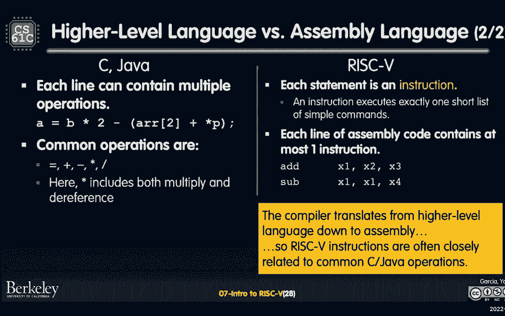

让我们看两个基本算术指令：

1.  **加法指令** `add`
    ```assembly
    add x1, x2, x3  # x1 = x2 + x3
    ```
    这条指令将寄存器 `x2` 和 `x3` 中的值相加，结果存入 `x1`。

2.  **减法指令** `sub`
    ```assembly
    sub x4, x5, x6  # x4 = x5 - x6
    ```
    这条指令用 `x5` 减去 `x6`，结果存入 `x4`。注意操作数的顺序。

在汇编中，一行C代码可能对应多条指令。例如，C语句 `f = (g + h) - (i + j)` 可能被翻译成：
```assembly
add x5, x1, x2   # 临时存储 g + h 到 x5
add x6, x3, x4   # 临时存储 i + j 到 x6
sub x10, x5, x6  # x10 = (g+h) - (i+j)，假设f对应x10
```

此外，还有**立即数加法指令** `addi`，它可以将一个常数直接加到寄存器上：
```assembly
addi x3, x4, 10  # x3 = x4 + 10
```
RISC-V设计哲学是保持指令集最小化。因此，它没有 `subi`（立即数减法）指令，因为 `x4 - 10` 可以通过 `addi x3, x4, -10` 来实现。


利用 `x0` 寄存器，我们可以实现一些常用操作：
```assembly
add x3, x4, x0   # x3 = x4 (将x4的值复制到x3)
addi x3, x0, 0xf # x3 = 15 (将常数15加载到x3)
```

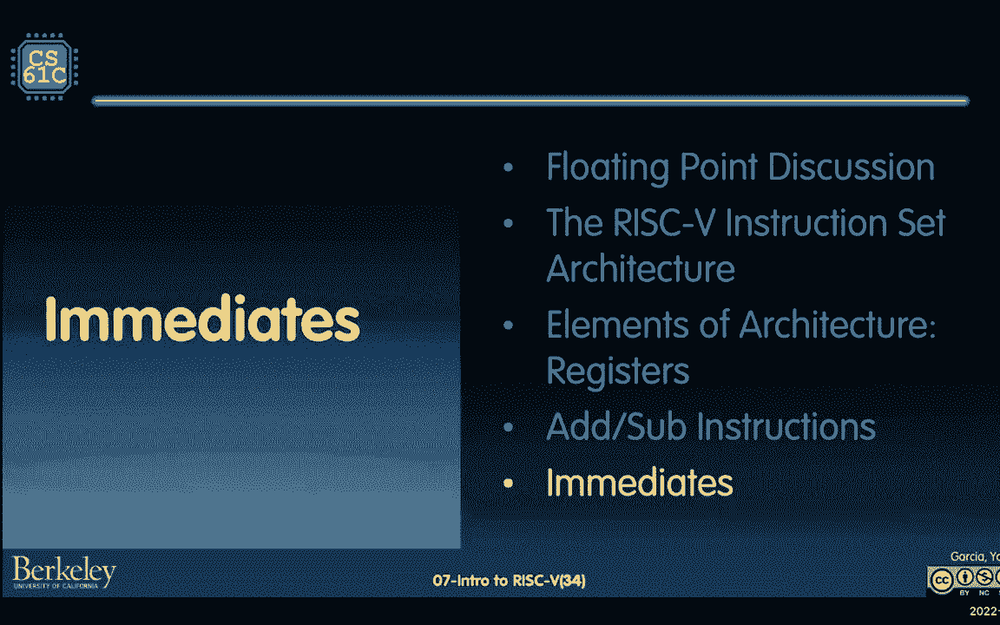

## 总结 📝


本节课中，我们一起学习了以下内容：
1.  使用在线工具可视化浮点数的位表示，并理解其离散性。
2.  区分了浮点数的精度与准确度，并了解了双精度等其他浮点格式。
3.  探讨了浮点数运算的重要特性，如不满足结合律、舍入模式以及类型转换的陷阱。
4.  从高级语言下降到汇编语言层，了解了指令集架构的概念以及RISC-V的历史与设计哲学。
5.  学习了RISC-V汇编语言的基础：32个无类型的寄存器、特殊的 `x0` 寄存器，以及 `add`, `sub`, `addi` 等基本算术指令的格式和用法。

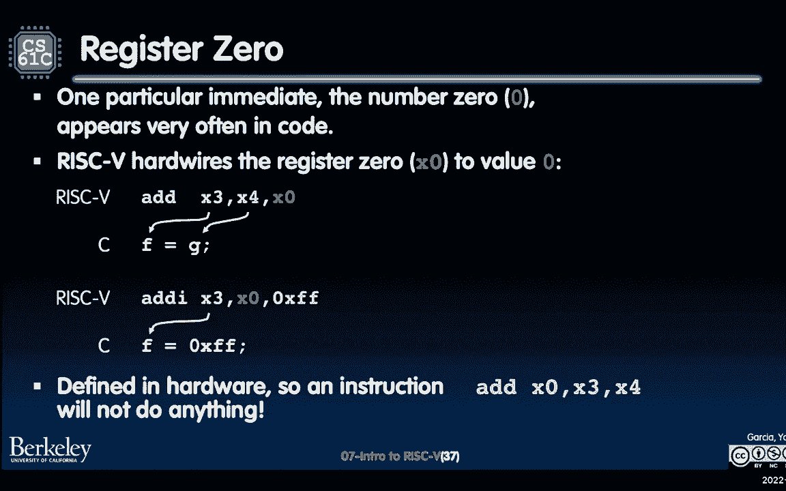

通过本课，你已经开始接触计算机如何真正执行指令的底层表示。在接下来的课程中，我们将继续探索更多的RISC-V指令和编程概念。