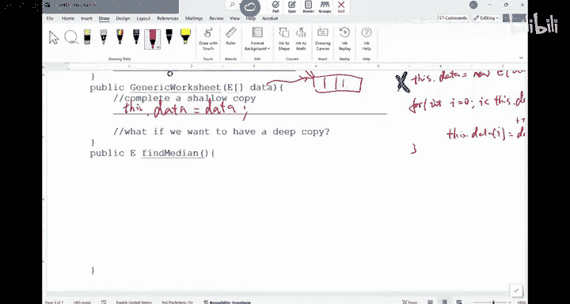

# 003：CSE 12 - Basic Data Struct & OO Design - LE -A00- - Lecture 3.zh_en - GPT中英字幕课程资源 - BV1zJQHYcE8g

Tings time。For us to start。So I think。Let let me see， was our discussion yesterday， I think？

Or to tomorrow。Yeah， our discussion was yesterday。 Did you all go to the discussion and Brandon talk about the installation of the software。

比较高的负担。So。That's kind of the plan for the discussion。 And I think Bon。

 he posted a few videos of how to do it。 right， So if you missed the discussion。

 refer to those videos， the videos， I think iss on。Pazza， I saw he made a post。嗯。

The first thing we want to do is we want to look at this generics worksheet that is something that we can use to practice okay so I have this generic worksheet class。

And use a generic type E。So。Here are a few things we want to do I'll give you some time to do it if you have done it。

 you can kind of move ahead and do the other exercises like write the other functions。

 Now how do I take care of this generics worksheet， this is the initialization in here。

I have a generic array in here。What should I do。If you ask to do this in the。Meter in the quiz。

 what would you do。Should be an easy statement？角色上一位。Can I do this。嗯。Data equals to now。

Will this work？CanCan I also do。This thought data。Eal so now。Will both of them work or no。

Would both work？Right both of them would work because the data is in here is referring to this generic array。

 so if you have an instance variable， you can use this dot data like that or just the instance variable itself。

 soon as there's no name conflict， in other words， you don't have a local variable called data。

 you only have this instance variable， then you can omit this dot if you want to。

This is something we learned from CSE 11。Questions about this part？Inits are ready to be now。

Next thing， what I want to do is I want to write a。

Gene this one would take a generic array reference， and I want to do a shadow copy。

And how about I do a deep copy。Can you offer try to do it yourself， or would do you do it。

I want to make a shallow copy of the array。From the peri。How about I do a deep copy。

Feel free to talk to your neighbor， what is a shallow copy， what is a deep coffee。

 if you are confused about that。Okay。If you are say， I'm done， look at your neighbor's code。

 Are they the same。 They should be very similar。They should be very similar。If you need handout。

 there are more in here。Gb something to write on。What did you guys。Sa。deep copy of the genre。Yeah。

That's right。我还就是。For those of you that I done with the shallowlock cover， Can you do a deep copy？

 how I do a deep copy。Allright， Sha Co， can I say this。 Okay， I just want my parameter。

 say data equals to data。 Will this work。Will this work？Why not。

 can someone tell me why this won't work。Yeah。一个。ごさも。All right。

 so I have to specify which state I'm referring to there's one outside， there's one inside。

What does this data refer to， What does this data refer to if I just say data equal to data。

Theyre both according to the one。They are both referring to the variable inside， right。

 because there's a name conflict。 This is the parameter。 This is the instance variable。

 So inside this function， both the instance variable data and the parameter data that are visible to me。

 So what I need to do is I need to figure out which data I'm referring to if I just say the variable name in here。

 it is referring to the local variable。 In other words， the one with a smaller scope would win。

 So that's why this is bad。 So you have to refer to。

The ins wearable as they thought because theres a name conflict。Does it make sense？

How about the shallow copy means if this data is pointing to run。Of some sort。

This data will be pointing to the same array。 That's the shallow copy。

They are referring to the same array。Deep copy means the parameter data is pointing to array。

 and I want my data to be pointing to a duplicate of this array。In other words。

 it's like you make a copy of the array and let my in variable point to it。How can I do this？

 Have a deep copy。What should I do？Can I just do the following？ if I want a deep copy， I say4。Ynt。

R equals to 0 as less than。Theres。Dot data， dot length。Plus， plus， I。I would say。This。Dot data， I。

Ecoal to data I。Would this function， would this way to write to the deep copy work。

Can you have a discussion。Will this work， I I missing anything。 I just say if you want a deep copy。

 just， just do this thing。Going through the array。 And then。Maker copy。

Have a discussion with a neighbor。Do you agree but this would work or this no？

There must be something that is to missing right， otherwise I won't ask you。

And this is a common mistake that people make as they， I mean， when you're writing Ps， right。

 you have the compiler help you。Can run it， but when you're writing the code in the midterm looks good。

 youve got to be careful。What is missing in here？Anyone， yeah。Initializing the array， right。

 So remember， this data， this instance variable data right now， it is just an empty reference。

 It's a no reference。 It is not pointing anywhere。 The first thing you want to do is you want to let this instance variableable to point to a。

 That is the same size as the array this parameter is pointing to。That's the first thing。

 So if you're missing that part， then we're in trouble。 So you should say this dot data equals new。嗯。

Can I do new E。Data dot length。Okay， this is how I create a new array and letting。

My instances were pointing to it。And then I ran this for loop。To make the copy。Yeah。不以见面。Right。

 I can create generic array。 right， I can't do this。 I mean trouble。 If you do something like this。

 that's going to be a compile error。You cannot create generic array。 You cannot create generic array。

 And what should I do。Yeah object。Right， you initialize the object rate than type cost。

 So this is no good， right so。No good。Oh， that's a bad。No good。

So what we should do is you should say this thought data。Equals to new object array。

I'm running all the space， sorry， I need to write it a bit longer。So， it's。This start data。

E goes through new object。With data。Dot length。And don't forget。

 you need to typecast it into a E array。That's how you should do it。

So you create a new object array that is as long as this one type passes it into a E array。

That's a deep copy。 That's a deep copy， questions。So we use this one to practice generics。

 but also review some of the things we should have learned from 11。Are we good on this one？All right。

 next thing。嗯。I have a array that I can use， right。

 that parameter that instance variable is pointing to array now， assuming that's the case。

 I want to find a median of the array。 I want to find a median of the array。 How should I do this。

 How should I do this。I'll give you some time。 You can use array dot sort that's going to sort D for you。

 So can you return the median of D in here？Write the code yourself。

 Let's see if you can do it yourself。系。Remember， this is a generic array that we're dealing with。

Okay。A median of array is after sorted to element in the middle。

You can also think whether if I have even number of elements in the array， how do I do that？哎。

Give you some time to write it once you are done。You look at your neighbor's implementation and see if it's the same as yours。

They should be similar in Java， there's this function called array， so array doest sort。

 it's going to sort that array for you。So you'll have to write your own sort function in here。

If you got it， look at your neighbors。Let's see how it goes。If you need a handouts or more handouts。

 it's better you write it yourself as a practice。

All right。Some of you are still working on it。 Some of you are looking around saying okay， I'm done。

 So how about this， How about this。If you need a copy， it it's here。

So how about we sort it first array， so array is a class in Java， the arrays not sort。

Sometimes well allow you to use the functionalities from arrays， So to sort to。

 to do different kind of things， but not always for some of the data structures。

 we want you to implement your own version of those codes。 So sometimes we allow you to use array。

 sometimes don't just watch out for the explanations in the right up。 So okay。

 I'm gonna sort my data。This is how you sort the Do I have to use this thought data in here。

Do I have to use this thought data。Can I ask you guys to do a quick vote， just。A is yesB is no。

 If you have a clicker， let's do it。I mean。Base connected。嗯。Just try it。 I mean， you are not。

This is now count towards your grade。 If you have the clicker， adjust the frequency to A C。

 you should be able to click in。 But if you have it， if you don't have it， it's no big deal。

Do I have to use this dot， Do I have to use this dot in here， You say， yes， you vote for a， No。

 you don't have to vote for B。All right。15 people。16。 So if you look at it， most of us，oo。

Do I view this do。Out of the 15，16 people， more people are voting for the right answer。 Now。

 you don't have to use this do。 You only have to use this do when there is a name conflict。

 In other words， in this function， you have some variable that has the same name as some instance variable。

 If that's the case， whenever you refer to the instance variable。

 you have to refer to that instance variable as this do， the name of the instance variable。是。

Are we good？Why we don't have to use this。So Ill sort it and then I can check。Again。

 I am just implementing this as if I'm a student， right， I want you to see。

 are there any potential issues as the way that I'm implementing。 So if。Data dot lens。

Moud 2 is the same as one。In other words， if it's like an al number。I just return。Data。

Data dot length。就把去嗯。Do I about two in here。The one in的 middle。I'm done if it all of the number。Else。

I've seen people do this。 That's why I I'll return the average of the two things in the middle。嗯。

Dater。Data dot length。-1， do I buy 2。No， you can do either way it's fine。 Okay。

 that are La to up by 2 -1 plus data。Data dot length。Dear by to。And the' so thin。Average。

Will this work？I sorted。Give you the middle element back。 if it's an even number。

 I just find average of the two middle things。What are the potential issues if this is are implemented。

Yeah。Theres no reference。Okay， so if the array is not initialized。

 you probably want to do some error checking if data is now。I'll return now。

There should be error checking of some sort in the beginning， right？

It's always safe because whenever you deal with a reference， before you can use it。

 you always want to make sure it is not now。 That's one thing。How about the。

The body of this function， anything。That is now good。Anything that is not good， yeah。

Does the array return So what was supposed to return is what supposed to return a type E reference。

Because this arrays of type E， so this is the element in the array。

 this is the average of two elements in the array。I'm not like the rage officer。Oh。

 so this sort just sort this array。 is's going to change the array。 It doesn't return anything。

Do you all see a easier with this sort？If I say I need to find a media。I'm sorting this whole thing。

 In other words， once I call this fine median， this whole array changed。Is it worth it？

 Like if you say I want to find the。The tall person or the person made a median height in this room。

It's better that I keep you in a seat， and I find a way to do it instead of changing the whole room in here。

 So it's， it's much better you make a copy of the array。Make a copy of data， and sort that copy。

Do you see what I mean。 So do not use sort on this original era。 I need to find a media。

 but you make a copy of this array first。 You sort that copy， find out the media return it。

 Don't change the original data。 unless you say after I find the。The median， I don't care。

 The can be changed。So that's one thing， I do want to point this out。嗯。Does that make sense？

Any other things，これた。I like though already。Can't be added audio you， right。

 So I think that's the another good point in here is we' are so used to these things。

Just add them up D by2。 Remember， this is a generic array。 What if I give you two students。

 how do you find the average of two students， I have cut them up， piece them together。

 Probably that's not a good idea。 right， That's not good。

 You may not be able to add two students in D by2。 You cannot find average of those two students。

 It is possible， but more likely than not。 you cannot do it。 For example。

 what if you have two strings。The average is two string equal goes what。Right。

You cannot simply assume there's add。 There's divide to a generic array。

 This is a common thing because we are very comfortable with integers or doubles。 And you know。

 you can do those things not necessarily on a generic。So then what should I do，Normally。

 if you have a generic array and say I need to find a media， normally you say。

 just return the one in the middle。 But it's even odd。 It's always the length you by too。

 So in other words， you just don't do this。You just return。That。Just return this。

Well have already seeing to me the way？Does that make sense because you cannot add two things in here。

Questions about this part。Its a common common thing because we are not used generics yet。嗯。

So two things， before you change the original array， try to make a copy and change that copy。

 iss safer and cant assume you can do automaticmatic operations on generics。Yeah。All right。

Next thing。Find the last element。Return， return the last element of DNA。Can you do this。

This one is a little bit easier。You are given that array， Just return the last element of that array。

Make sure you do error checking， if possible。And when you write your PAs。

 you're going to have to to error checking。That's the underlying assumption。In other words。

 whenever you are approaching a class or function， you always have to know what is the underlying assumption。

 what can I assume？For the things you can't assume， you always have to check。嗯。

This one should be a little bit easier。What's the first thing I need to check？If it's now。Okay， if。

Data is the same as no。And I'll just return now。Any other potential errors I have to think about。

Mathematically operable， I just need to return the last thing。 So I'm not。

I don't have to do any math in here。啊。Yes what。The last element。

Is it guarantee that if I am raised now， if I re reference is not now， I always have a last element。

love。Yeah， you only have one element， the index of the element is0。Is it guaranteed？Really， can I。

 can I do this， Can I say。嗯。Can I do something like this。Acor bit zero element。

Maybe we don't want to do this。 but technically， you can。

 You can have MP array that has nothing in there。 So its just。Empty element。

 So you always also want to check。If the size of their array is bigger than 0， it bigger than 0。

 because that's that's when you have an element。 It's part you don't have an element。So this。

 this check definitely is good， but we need to do another check if data dot length。

Is the same as 0 or return now。Now， I want to combine these two together。Can I do this thing if。

You know what Ill say。If。Data dot。Length is the same as 0。And I say， say， this is a。This is B is。

Dater。Equals to。No。Ss， and。D is。Or。Can you combine these together using an if， So if。What。

How do I order these elements or you can cherry pick。Do I should I use end。

 should I use or should I list this in first or this in first of either way。

 Can you have a discussion with your neighbor， How would you do it。

 If I have to combine these two together。Do I use and， Do I use or？

How about the order of these two things doesn't matter？Doesn't matter in here。

 like should I use an or。Should I use N or as a logic？And。哦。Those are only two options， and or。

Or it should be or， right， If this is good or the other thing is good， I would return a no。

 So it should be or。 Does the order matter。 Like， should I say A or B。Or B or， would this matter？

Some of you are nodding。 Some of you I say the answer is it would matter。 It would matter in here。

 so。Which ways which one should I check first。I should check for now first。

 because if I check for this data dot length。Is zero， I'm already using this reference。

Before I even check for now。 So you have to say， if data is now。Or。Data dot length is the same as 0。

 Youll return now。That's how you should do it， yeah。Why the order would matter。That let's。

 let's look at this one， right， What if I switch them， I would say this thing or that thing， right。

 When you look at the or operation。Like A or B， which one do I evaluate first。

The one on the left side of the war， right， because there's the winner about sha circuiting in or end。

Maybe not。ude the short circuit ring a aboutll？No， okay， so if you think about the logic， right。

 of A or B， for example， just look at this part， A or B。

I'm going to evaluate this expression A first。 If this is true， do I even care about B。

I don't care about B anymore because for all larger， if one side is true。

 the whole thing will be true。So it's always gonna to look at the left side and evaluate this。

 If this is false， that's when I look at B。In this example。

 what we are trying to do is we are trying to say data ex now or this thing。

 If you list this thing on the left side。Basically，It's， it's like data dot land。

Is the same as 0 or datata is no。If you do something like this。What if that is now？

What's going to happen？You are using a null reference to check its length。

 You're going to see a null pointer exception。In other words。You are supposed to track。

 is this thing now， if this thing is not now， that's when I track for the length。

RightIf you do it in this way， if data is now， this part is true。

 I don't even look at this part because the second part will be skipped because the stars are getting。

 So if this part is true， the whole thing will be true。 I return now， if this part is falseaw。

 In other words， data isn't now， that's when I check the length is the length， the same as0。

So because of sha circuiting in ore operation， the ordering here wouldn't matter。

 does that make sense？And autocurs。So if we didn't learn about short getting this can be confusing。

Questions about this。How about for end， if， if I， I mean in this example， we don't use end。

 How about if I use an end operation。Of A and B， How does short circuiting function。

What would you say？How would short circuitrcing function？Yeah。Right。

 they both have to be showing in order for this whole thing to be true。Then how would short0 say。

 don't even look at the second part。If a is false， right if A is false， if this thing is false。

 don't even bother with B because no matter what B is， it's going to be false anyways。

 So short circuitrcing happens to both and and or。 and a lot of the time people use this to their advantage。

 but you also have to be careful， because this second thing has the chance to be skipped。

If it's something important， you don't want to skip it。RightFor example， if you work in the hospital。

 right， some of you may be writing software for medical machines and say， okay。

 if you have a function that cause does the patient have the fever or have a heart attack。

You call the doctor。Immediately， if you have a cold like this and you put this heart attack check。

In the second part of or what's going to happen is if the person has a fever。

 you're going to call the doctor， right。But if this person has a fever。

 you don't even check if the person has a heart attack or not。And that may be a problem。

 So you want to check heart attack all the time， so you do not want to put anything important as the second part of war。

Or a second part of end。Because they have the chance to be skipped。Just be careful。快身子。All right。

So we're done with。嗯。This one， oh， well， I'm not done， we just diverge。So in， in the end。

 we just return data。Data dot learn。-1。So that's the last element。Does it make sense？

How about remove first， Let's， let's do this a little bit faster if I to remove the first element。

Over do you do。If you have a race， that Cat is the first element。

What's the general procedure to do this。Can I just say I will mark the first element as now。

In general， that's not what we want to do。 So what you want to do is you want to create a new array of size n-1 like size -1。

 then make the copy from the the second order way to the end。

 and then let data point to that new array。That's how it should work。Does does make sense？

So it goes like this， right for P2， you're gonna write your own reals。

 You're gonna see operations like this。 So you can say。Yi。Tempamp。一棵树。New object。Data。

Theres error checking right， I will skip that part。And' checking。

 you have to check food now and all those things， right？Data dot length，-1。

So you create a new array that is one element smarter than the original array。And I ran a for loop。

I equal to 0， is less than。Data dot。Lth -1。Plus， plus， I。What should I do。他保安一口说。

Does equal go to data。Should I do this。我是来队。Yeah。Right， datata I plus1， right。

 So you're gonna to basically shift everything。To the front。You hear。아마이다。I created a new array。

That is one element smarter and make the copy from the data array。What's the last thing。Return。

I need to return something， right。 I need to return。The zeroth element。That I remove？系明 done。

What else is missing yeah。In I equals to one in here。 Well， if you think about it。

 this index is mostly for this new array。 So this new array would have length -1 things。

 But you're right All right， We have to be concerned about the the range of index in here。

 this data has length elements。 This thing has length。呃。-1 adamant。 So the math would work out。

 So if we you think about， this is temp。This is my data。Time 0， I want to copy data 1 to it。

RightSo it's plus one。 So it should work out， I think。There's a legitimate concern。

 But in this example， it should work out。What else is missing？是。Once we exit function。그是。Right。

 once I finish this function， time is gone， right， what should I do。

Should I should let my data point to this new array。

I should let my data point to this scenario array。 So I say data equals to temp。

What else is wrong here？Yeah， once you update data to 1 you lose data 0 being。Exactly， right。

 So just be careful。 Once I assign time to data， data is now pointing to that array。

 Data 0 is no longer data 0 that I want to return。 I want to return this thing that I just removed。

 So you got to say E result。Eco数 datata 0。And then youll return results。Just be careful。

AndSo there are small details here in there。But none of them， as you can imagine， this is。

 this has nothing to do with。Generic and you just writing Java code。

 right Just be careful with those details。 Are we good。Yeah。Why am I returning the first element？

 A lot of times when you try to manipulate something， if you look at the return type iss a E。

 So we say， get rid of this thing and return it as the return value of the function。

 So that's why we are returning it。 But you can say， I don't， I don't need it。 Just get rid of it。

 You can change it to avoid。 Then you don't have the return。

It it depends on how you want to design the function。Right， normally you say。

 let me get rid of something from the array， remove this thing。

Normally you can return it as a return value。The color of your function may need to use it。嗯。

Any other questions？All right， next thing， two string。嗯。2 shoe method is， is good for all the。

Classes that you write， whether they're generic or not。

 you just want to convert whatever data you have into a string。 So again， you do error checking。

In here。And then you can say string result equals to empty string。 You can write the for loop。For E。

Inside data。You can just say r equals to r plus。Rough dot two string。And then you return R。

RightWhatever this two string does on that generic type， just appended。Questions。嗯。Well。

 it's already 40 minutes。How can I create this array in here， How can I create this array。

So I created this array， and I want to use this array to help me to create an object。

 I want to reference the point to it。 I'll give you some time。 Can you。Incentiate。

Object out of this generic worksheet。In their life， in this may。Do you some time to do it。

 Can you do it yourself。Look at the constructors that we have。

 I think we have a constructor that takes an array as a parameter。How would you do it？All right。

What should this be？Say this， this is called what。 What's the name of the class， It's called generic。

WorkGeneric worksheet。Should I say E in here。Gene generic worksheet E。A equals是 new。

Generic worksheet。一。Aray。Will this work？Will this work unknown。

Generic worksheet。Pty bracket E A equals a new generic worksheet。

 the same poly bracket E and then array， with that is this the right way？What。

 what's wrong And someone。Point out what's wrong with this approach。Yeah。简单。

RightYou cannot instantiate objects of generic type。 So what should be the type。The integer array。

I in teacher， what should be the time。how how how how how can I tell。

You have a look at the constructor。That constructor takes an E array。

That E is the generic type for this class。What's type of this array that I'm passing in？Integer。

 So it integer array， so。Then I just use in teacher in here。 And for this part。

 you can omit the type。On the right side。The left side， you should have a type or the right side。

 you shouldn't， right？The right， the right side， you help me the type。 It is because when you have。

The right side you are instantiating an object。 Remember， due to type era。

 there is no generic type at all。 Once you have an object。 So at the end of the day。

 this thing is just object references in this object。 So you can meet the type。

 You can also put integer in there。 That's fine。Are there any questions。

Should I name this reference variable a？No， you shouldn't。 right， It should be reference。

 How do you know it' just look at the things down beneath it。That's what we have。Are we good？

It is small generic worksheet。There's one thing right I'm using integer so I can find a media。

 find the last remove first， print it out what if I have another class of my own and I want to use it in here。

Like I create， I think I have an example in here。Right， so in this worksheet。

 like the way I implemented it is is the followinging。So this is very similar。

 like what we implemented in there， but。In my May， I have a bunch of integers。

So like what we did in the worksheet。And also， I created this thing called my class。

My class is a class that I created。 I put in three things in there。

 and then I create an object and does this。There is an issue that I may run into。

If I use my own class。Can someone see what may be the potential issue。Yeah。

There is a sort right when you try to sort things， you must know which one is bigger。

 which one is smaller， How do I define for the class that you define， Like。

 how do I define which student is bigger than the other student we comparing height。

 I comparing compare their grades or whatever right so in here。

You just have to be careful if you use this fine medium on this generic class。

 on the class you define， you must supply my class with this。Comparable。

So comparable is the interface in Java that if you say I write class and I need to define。

How to compare two objects of this class， You should let that class implement comparable。

 And when you have this。Gene class up on the top。 Sorry， it' big in here is in here。

 So when you have this E， you should because you are using finding media， right。

 you should make sure that this E extends comparable。二。That's what you need to do。 So in other words。

 you say whatever the generic type you supply to me。

 Integer by default has already implemented the comparable。 If you look at integer class in Java。

 it automatically implements the comparable。 But if you have to supply any customized things。

 you have to make sure that whatever that thing you're gaming me must have。Given me the comparable。

 because this function。呃。Did this one。Relies on it。For you to sort the array。Does that make sense？

So just be careful， just be careful。HeLet me not change it。I think we。We have two minutes。

 I don't want to I know you may have to go to another class。 So let's leave the rest for。

For Friday then， okay？But we will have the PA out on Friday， I think。

 so make sure you have your running environment like your Java。V S code， J unit all installed。

 There are tu hours available。 You can go there and get help if you need any help to install the software。

 okay。All right。I'll see you on Friday。Yeah。So嗰我先一块。You have to adjust the frequency。Right。

 if you see AC， you see a tick mark。Then it's going to show you ready。And when I ask people to vote。

And you vote in， you'll see there's a tickigma。Yes， it。What's your question。

