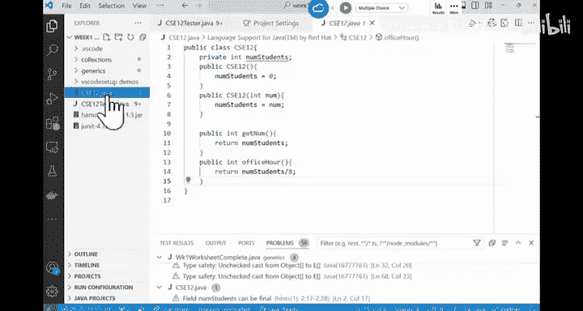

# 004：CSE 12 - Basic Data Struct & OO Design - LE -A00- - Lecture 4.zh_en - GPT中英字幕课程资源 - BV1zJQHYcE8g

啊。All right， good morning， good morning， so we should started hitting here， Good Friday morning。

So you survived week one and nine more weeks to go， nine more weeks to go and CSE。

 like a lot of you probably， this is not your first quarter here at USD。

 but if this is your first quarter here， just wash out quarter system。Goes by really quickly。Okay。

 all of a sudden it's going to be meterhe and then final。Pace yourself， definitely， okay。

 keep track of things。The plan for today is we will talk about some of the。

Java stuff like we'll talk about data abstraction， and then we'll talk about testing a little bit。

 and we're going to release the first assignment today。DidDid our T already release it？Maybe not。

 So around noon time， definitely by noon time， you're gonna to see the first assignment。

If we have time today， we can talk about it a little bit。Now。What we have in here is first。

 last time we talk about generics， right， And then in CS C 12， we do a lot of。

Basic data structure implementation。 That's what we we does all the time for the Ps。 So it's。

 it's useful that we discuss the difference between abstract data type and a specific implementation。

 So are totally two different ideas。 So I just want to make sure that we are we are， we are。

 we are okay with the difference between them。 if you， if you think about the difference between。

The users of a system here and the implementers of the system。

 and the way that they rely on each other they kind of assume is theres this common interface。

 there's this common interface。So we call this common interface abstract Detype or AD DT。

Meaning that if you have a system that the user of the system would say， okay。

 this is like the instruction menu。 You tell me what are the functionalities of。Of the system。

 and we'll just use it accordingly。The implementers， they they say， okay。

 we provide this interface to you as well how we do it。 You don't have to worry about it。Right。

 just like if you think about you have an oven， You turn it on， it heats up。Right you have a timer。

 you have a dial that you can adjust the temperature， but that's about it。

That dial and that temperature control is like the ADT。 as a user， that's what we know。

 as well how does the album heat up。There are different kinds of ovens， right。

 Some some rely on electricity， Some rely on gas。 Whatever it is， the the oven just heats up。

 It is the job of the implementers to decide how the system should work。

But both of them rely on this mutually agreed upon interface。 We call that the AT。 Okay。

 Another example is like the bra system of a car。 right， if we think about it。

If you know how to drive a car， you know， most of the cars has some sort of braking system right。

 as the user of the car， if I if I'm driving the car， I just know I step on the gas pedal。

 the car slows down。 That's all I know。 And that's all I need to know。Right。

 but if youre a car mechanic， you probably want to figure out about how the the mechanisms of the brake system works。

 If anything breaks down， you know how how it works。 So this braking system。

 this virtual idea of a braking system is the ADT。So the mechanic knows the things inside out。

 the user knows how to use it。That's about it。 Okay， So for those of you who have a EV。

 you know that EV， sometimes you don't have to step on the breaking paedal for the car to slow down。

 but still has this paedal in there because it it's important people have get very comfortable with this interface。

 right。Um。So from the data structure point of view， a lot of times we say， okay。

 we're going to learn a new data structure。' say we're going to learn about。A queue。

 what is a queue right in our class。 Okay， this is what the queue does。 This is kind of how it works。

 In this C I C 12。 You are both the user and the implementer。O， you're gonna learn how to use them。

 And also you're gonna to be the person that actually implement them。 So you are playing both roles。

If you have this， if you have this data structure， right， that there is only one way to do it。

 like if you think about a race， right， So if a race， there is only one way to do it。

 we say that's more like a data structure or implementation。But if you say。

 I I want to implement a queue。 There are just many ways you can do it。

 Then the idea of a queue is more like an abstract data type。

So when you look at something that doesn't rely on a single implementation。

 that is more like a data structure， VSD ADT。Any questions？All right。

I think I answered the question for this one， right， array is an ADT， not a data structure。

Is that true or false？O， like you think about， O， How many ways can I do it。

You just have a sequence of bytes in the memory。 There is only one way to do it。 So in here。

It is not A D T。 It is a data structure。 There is only moment to do it。How about the second one。

 A DT and API， They are the same。 I that false。Can we have a quick vote on this， just as a practice。

 right， Yourre， if you have a clicker， you can adjust the frequency to be A C， and I can。

I will upload the participation on canvas today， but it doesn't hurt your grade。

 I'm just going to show on canvas that if your clicker is registered properly or not。

And then starting from week three， I would delete， whatever we had in week12。

 I just want to make sure that you know if you check on Can， you have a click already。

 then you know your click has registered， probably it works fine。So you can vote in。

 is this true or false， A DT and APIs， they are the same thing。Allright， can you。

 can you tell your neighbor whats what is the difference between ADT and API？

 So the answer is this is false， right？ But can you explain to your neighbor what is API。

Or these API。You probably have heard about it before。

What is API if you don't have to tell your neighbor。

 can someone volunteer to tell us what is the API。There are the APIs of things ADT。

AI stands for what。Abrication interface。So what is that？Probably for those of who yeah。

So the way that two programs would interact with each other， normally API is like， for example。

 you say I'm making a tools tool box for other people to use。

 and you kind of provide those two boxes。 but you say this is how youre gonna use it。

 This is how you're gonna use these tools。 Maybe there are classes。

 Maybe there are functions that you're gonna provide。 like Google， for example。

 Google say this is how Google's Tensorflow framework works。

 I give you a bunch of APIs you can call them。Normally。

 those are just a bunch of function calls or a bunch of classes that you can use directlyly。

Is different from the ADT。 AT is more like a description of how things should work。

 So of of the API is more on the application side。 ADT is more about a description of a data structure。

Okay， so that's the difference between those are totally two different things， do not confuse them。

 okay。Any questions。Near the end of the quarter， once we are finished learning all the data structures we are supposed to learn。

 we're gonna come back here again and say， okay， now look at all these data structures。

 We have learned how many of them are IT， How many of them are like data structures。

This is just our first step at this concept。Now testing， right。 So in C C 8 A or 11。

 we learn about testing。 When I teach it， I ask folks to say you have to class your code thoroughly。

 right in C C 12 will go one step further just to say， okay， in the industry。

 what do people do I don't know if you know that one of the。Biggest I T company called Service Now。

 I don't know how many of you have heard about it before， but it's like they， they supply all the。

IT departments， like if you say my system doesn't work， I need to submit the ticket。

 That's what they supply。 UCDs I department use service now service。

 right so their head used to be right in San Diego， in fact， and the folks who funded service now。

 one of them was from UCD， the other to from Hay Mu college。

 So they formed the company here and then now they move their headquarters is now in the Bay Area。

 but the ideas they have a big presence in San Diego。

 So I think they may come here to recruit you all when they are looking for interns。

 So is's a very good company。 nonetheless， so sometimes they invite my tutors and staff to go to their site and they want to kind of show the staff how they work on it。

 And I think that was right before the pandemic， they might in and they showed us they brought in their college。

Coning quality control means testing。 They are the ones that try to find out the bugs of other people's programs that are well he in the community because who want to say you find 20 bugs in my program。

 But the idea is quality control is important part of the company。

 And what they did is the demo like as a software developer the software engineer。

 their writing code on the back end， I think its 2000 programs checking their code all the time。

 So it's not like you just writing your code then you test that's not the case in the industry。

 So in here， we are not gonna get to that level yet。

 but we do want to introduce some of the testing ideas that you should follow。

 and also were gonna talk about this framework called J unit is one of the easiest frameworks that you can use to test your Java code。

 okay So that's kind of what we're gonna talk about starting from P2。 you will。

Have to supply your tester as part of your assignment。 and that is graded。 P1。

 you don't have to do it。 We're gonna to give you a tester。

 You must know how to run your code against that tester。

 And hopefully you can also write some of your own test in there。 But starting from P2。

 you have to write your own tester。So when you do testing。

 there are two ways you can test someone's program， right， The first one is called black box testing。

 It means I don't know how you you develop your code and I don't care。

 I just throw some input to your code and see if your code generate the correct output。

That's called black box testing。So that's， for example， how our autograde would work。Autto grid say。

 okay， you submit your P1 and say， okay， in this function， if I give you this array。

 suppose to return false。 If I give you another array， suppose to return2。

 So I just throw a lot of arrays to your code and observe the output。That's black box testing， right。

 You can also do white box testing or clear box testing。

 This is what you should do because you are writing your code。

 You are the person that actually developed that piece of program， and you know how the code runs。

 You can customize your tester to determine if a code is giving the right answer。

So that's called white box testing in general， you should develop your testers before you even start your program。

And developing these test is just part of understanding the， the problem， okay。So for example。

 let me give you one example in here。 I'm just gonna write it in here。 For example。

 if I have this function called fu， Allright， it takes integer。And it returns a poolean。For example。

 and it just starts up some basic things。 I say， okay， if。Actually， bigger than five。

I will do something。Eph。X mod 2 is the same as。Zero or do something else and extra。Right。

 so if this is the thecode that you're trying to test。嗯。How would you test this code。

How would it test this code。 black box testing is item here。

 I just generate x from  one to 2 billion。 I just throw each of them to you and see how your code respond。

That's one way。 Or I can randomly generate some value between 1 to1，2 billion。

2 billion is a bit too big。 but Ill say， I'll generate a million values between negative 2 billion positive 2 billion。

 throw it to your code and see how your code respond。That's one way。 How about clear box testing。

If you wrote this code， how would you。Task your program。What are the values you want to test。

Can you talk to your neighbor a little bit， What are the values you want to throw to x。

So you can observe。好不 do对。And add did with more for。And。So that's the code right， So how would you。

 what value of x do you want to throw to this code And basically the ideas as you write。

 as you try to throw x， you want this code to you want to test every part of the code。

Can someone throw some values to us。 like， how would you want to do it。For example。

What is a good value to start with yeah。N1， if x is negative1。

It looks like I'm going to skip this part， I'm going skip this part。 I alsom going to skip this part。

RightSo how would my code behave negative1 is a good choice。 Anything else， So skipping everything。

Any other potential good values to test。Yeah。5， if x is exactly5。

 I'm going to skip this one and also this part is skipped。 And in here。

 I'm saying I equals I is less than 5。When I is 2， this part is false。

 And then when I is 3 is false and go on。 So it looks like if x is 5。None of them would be true。

 None of them would be true。So I'm going to skip everything again。All have negative one and five。

 but the behavior is I'm skiping everything。Right， so that's， although the values are different。

 but the behavior is the same， yeah。If I x is 6， oh， I'm going to do this， right。

 then I can observe Okay， when actually bigger than 5， that's what I'm going do in here。

 And then in this part， when when this if runs for the first time。

 I'm gonna see the break right away。 In other words， I only do this for loop once。😊。

Only do this for once。 Any other values。That you say that would basically， if think about。

 you want to test。 okay， when this part runs， what's going to happen， when this part runs。

 what's going to happen， when this loop runs for three times what's going to happen。

 When this loop just runs for once， what's going to happen。

 So you want to test every part of your program。Can can you design an X that would make this right。

Was a good x， Yeah， or4， if x is 4， I skip this part， this part would run。 And in here， the x would。

This part， again， going there only once， and then I break。

RightSo the idea of designing those values for x is if you think about this is like statement， right。

 one statement after another， you want to make sure that you cover all possible ways for your statement for your code to run if you try to draw it out。

It goes like this。 The first question you want to ask is x， is x bigger than5 or not。

 You may have a true。 You may have a false。Right， if it's false， you ask another question。

 I x mod 2 the same as 0。Is this true。Is this false right， So。

 and your program can be visual as a big flow chart。

And what you want to do is as I design the testings， I want to go through every possible path。

Does that make sense。 So to go from the beginning to the end。

 there may be many ways you can get there。 and you want to cover of them。 This is called coverage。

 You want your code。 You want， you want your tester to have good coverage。

 And there are there there are different frameworks that actually would the test。

 How much of a coverage you have。 we use to test on that when we use Google test3。 But。

We are not doing that at this time。 Okay， but there are many ways you can test your code。

 Clear box testing obviously is better。And that's what you need to do。

 You need to test your own code， okay。There are different ways you can do the testing。

 One is called automated testing。 And so you you define those testers and then it automatically test them。

 In fact， try GBT are those copit Sometimes they can you can use them to generate test cases。

 people in the industry sometimes use that this is one of the tools that you can find。 But again。

 at this stage， you shouldn't be using them。 You need to learn how to use it。

 you to learn how to design test cases。 So in the future， once you start at your internship。 okay。

 now there's this automated too that I can use to generate test cases。

 at least you would know the test cases that you you are given are they good quality or not。

Otherwise， you have no idea if you keep relying on those automated tools。 in C S C 11。

 pretty much what we are using is we are using menu testing， which is fine， right。

 because the program we are writing is pretty basic。 So in 12。

 what we're gonna use in here is J unit testing。The unit is just a tool box that you can use。

 You can test methods， You can test class。 Okay， you can use a third statement to decide at a certain stage of the program is the value of a certain variable correct or not。

So is the result good or bad？Here is one example。 Here's one example。we'll do some exercises。

 I don't know if we can do it today， but if not next week， Okay， so for example。

 I have this C C 12 class， So this inte number of students， have this put in large class or not。

A bunch of constructs， a gather， a setter。And this is another gathering set。

 and then the number of office hours is the number soon divided by 10。 if you look at this code。

 if you look at this code， two instance variablesables。By default， I assign them to be0。

 large class to be true。 C S C 12 has been， I mean， large classes， right in here。

 if you give me the number of students do the initialization and I'm setting large class to be true or false。

 depending on the number of students。Get the number of students， set the number of students。

 If you change the number of students， you may also want to update the large class variable。

 is this a large class， And then this is to return the number of office hours we need。Yeah。

 can we use。Can you use what？I don't，I don't know。我我。Like， generally。you can。 You can。

 But I don't think it's gonna need for C S12。In here。If you are not sure， like I never use it before。

 but if you want to post on Piazza， so we can look into that。So if you look at CS C 12。

 this is the class， right， And this is the tester you can develop。

 And this is true before you even write CS C 12 class。 You should know okay I need two constructors。

 I some gathering sets。 You need to import these packages， okay。You can have this CIC 12 tester。

 It's just a class。And you can create this reference this sorry， this reference， CSC 12 reference。

 you don't have to， because normally what you're going to see in CSC 12 is you're going to write a class like a realistic class。

So you want to test， if I call a certain method of this arrays， what's going to happen。

 So most of the time， you have to create an object of the class。 you want to test。

And there's this before tag。 So for each of the functions in here， the testers。

 they can have this tag indicating what's the purpose of this function in this before tag。

 it basically means。Before you run all the other tests， call this setup first。

Call this setup up first。So。It means。I have this instance variable reference。

 I will just create an object out of it。 And then in here， I just use this reference。

So if you call this function， it's gonna start with a brand new CS E 12 object。

 If you call the function here， it's gonna start with a brand new object， too。Okay。

 so just by having this before， you don't have to create this object as the first line of these testers。

That's about it， okay。So for this before tag as I set it up and this threshold the exception is sometimes the constructors or some of the functions they may generate the exceptions。

 especially when you create the object， so this thorough exception just covers the situation where exceptions may happen。

And then these are the tests。 right， These are the tests。For example， for this construct default。

 I want to test this constructor。 I'm asserting this thing。嗯。Number of students， zero。

So a third equals is a third statement that would check if something happens in here。

 I have the code。In in here。 so this is the before tag right， this is the before tag。

 And when you do a third es。let me see。 I think the。Sometimes you have to set up the， the class path。

 I think。Should have been set。You may know， Okay， I didn't。Let's go to our。C S E2 across。

 So the first time you use the J unit test。In that project， you have to have the。Set up in there。

 So let me。Yes to。SoWith those class path in there， it should。Work in this part。

I think I may have to。Refresh it。And。I know what's going on。 I think the the Google。

Google Drive is not working。嗯。This is a night。Pectture slides。 make one。I think。This is the workhe。

When is the worksheet in here。好的。Open with code。I think it's it's this these two okay。

So if you look at these a third equals， these functions in general， they should tell you， okay。

As you try to write it in here。It's a little bit slow。For these assert echoes。

You need to provide first thing is what is expected。Right。

So a third E means these two things must be the same。 I'm saying， okay。

 the number of students that we have should have。Number of students， ref thought。Is a 0，0。

Dot number of students get number。 for example， What I'm expecting is I expect this get number to return 0 to me。

 Okay， I think it's just the， the class path needs to be refreshed in here。

 But the idea is you can call these functions。And use a third statements。 There is a third equal。

 There is a third true， a third false。 Those are third statements should give you the correct values in here。

 So let me。Click on to run the test。Let see。😔，What's the issue。Cl the work space。对下。

Sometimes you do have to refresh it。This tester。I think it。Should be working。We have set it up。

By Bruce。嗯。It's not。You need to download those two jar  filess。 And I'm not sure why。Should， yeah。

 should have been。There。嗯。嗯，那 see。This workspace。I'm not sure why it is not working in here。But。

There should be an issue。 Did， did you all experience anything like this when you said of J unit。

 it shouldn't be， right。IThink it should。 It just， I think it is looking to set up the project。

You're just waiting for it through are multiple ways。Of Java 21。Usually these marks， if it is there。

 it means the test worked。 I'm not sure why it is giving me all these errors in here。嗯。Re problems。

Nonetheless， okay， probably will just be a setup， small thing。The number of students in here。

I think those are just warnings those warnings。Those are just warnings。Yeah。Those are not errors。

 Those are not errors。 If you look at these tests。The first part， when I just have empty constructor。

 the number of students should be zero right in here， the issue with CSE。

12 in here is if you create this part， if I create a student with 200 tools。

And then I'm expecting 202 divided I by 10。 The office hours should be exactly the same。

Even this suppose。 So in here， I'm dividing by 8， right， So if you， if you see in here。

 I'm expecting the number student divide by 8。 But in here。

 I'm expecting the number of students divide by 10。 So there is a difference。

 This one should give you an error。 If you change this to be 8。

And I think you need to rerun the whole thing。嗯。Probably what I need to do is I need to compile this code。

I think it's trying to grab all these examples in there。 They are giving us the。

The issue。 Let me use the。Theter of it。Alright， so drama C， C C 12。打 job啊。

This one should give us the right class。And in here， if we rerun all these。

There just a lot of errors cannot find symbol。I don't know。 Sorry。

 It looks like this demo would not work。 Well， is， iss grabbing all these different。Pros。

 let me do this。

There are errors in these classes that are not。我。Let me just copy this out。All right。

 so we have this CSE 12。 It should work， and we're going to copy out the tester。嗯。

Just a 12 dot tester。Normally there shouldn't be any error。

 I'm not sure why it is giving me the error。So this is what we have。

 I just need to set up the class path。Should work。他那说不爱。嗯。And once we reload。

 it should just load up everything。Let me run it。Sorry， for some reason。

 my two unit is not working this morning。Maybe you open it。Nonetheless。

 I will figure out what's going on here。Read the word。Normally， there shouldn't be any errors。

 You should just。Work。Did any of you have trouble with J unit after the testing。There shouldn't be。

 right。Normally it should just work fine。 I don't know why it is not allowing me to demo today。嗯。No。

 coming back in here， coming back in here， right？One thing I do want to point out。

 one thing I do want to point out， right， So when you test your code， when you test your code。Like。

 for example， I'm testing this default construct in here。

 I'm asserting the number students should be0。And sometimes our students say this is my tester and I read my code it passed。

 but once I to graycope， it always fails。There's a my code it seems to be working。 And in here。

 what's wrong with my code， what's wrong with my code or what's wrong with my tester。

The issue is when you submit something like this as a tester， you say， okay。

 the number student should be 0。Is it possible that someone made mistake in here。

 but you couldn't capture it。What is the potential issue that I may be missing in here。Yeah。你即谂。

Right， so I'm testing this function。 I getting the number of students a year is going to give me a0。

 But what if large class。What if you have a large class。

 What if I set the large class to be false to start with， But I'm expecting it to be true。

 So not only should you assert 0 in here， you should also assert， for example， true。

Rf dot get large class。So when you test a class， make sure you when you test object。

 make sure you test everything。 Okay， sometimes when you are testing PA2， for example， for P2。

You may have this array。As part of the instance variable， you may also have a variable called size。

And sometimes you will say， okay， I'm testing a function that would return a third element of the array。

 Sorry， it's gonna return listing。But okay， did I get it the right thing back， You say， okay。

 it did give me the right thing， but not only should you test， you get it the right thing。

 you should also test the did the rate get changed。So you examine as a get。

 you're just testing a get。Index。Right，This one would return a type E。So it's going to return。

This AR，R index， for example。This is what the function looks like。

 This is what the function looks like。 I' say okay。

 if I give you a tester with this array and I pass in index 3， did I get that value back。

And sometimes you say what if the index is negative， your your race。

 your functions also return some through some sort of exception。 But a lot of times you say， okay。

 my tester seems to be working。 How come I lost points When I sum to Gisco。

 When you return this statement， right， You say， I'm expecting the right thing， What if by accident。

 I change the array。 What if you buy this thing。I say array I D X equals to no。

I have some weird statements of a very index plus one equals to now。

So you should not only test what this function returns。

 You should also make sure that every data in that object is correct。 In other words。

 you want to verify， did the array ever get changed， Is the size still correct。Does that make sense。

 So when you try to test a certain function， not only should you test the return value of the function。

 but every data in the object。That's what the function relies on。I wish I can do the demo。

 but looks like there's something going on with the GU setup。So this is the second constructor。

 right， you can set the fourth， the size be 406。 you want to test is the the number students406。

 And when you do a search2， you can also provide some sort of message。 similarly for a third equals。

 This message is the customized message。That you can print out。 It's okay。

 iss this one giving me a true， right， should be a true。 and you can check。

T office ours and the sector。If the setup works， okay， that a big if。

 it just didn't work this morning， you should write your tester in here。

RightTo create all kind of test， Add the before tag to create the object and just call the functions。

 In general， you should have multiple assert statements。You have multiple assertive。

 not just one third， right。You say you should check， for example。

 is the number of students the same as true。 You should also say a third true in here to be like true sorry。

 C 0，0 dot get class。That should also be good。 So don't just test on one thing， test on everything。看。

Does this make sense？Yes。There's another way that you can test for something。Let me。

I think I talk about that。 Now， let me give you a quick example in here。 What if I have an exception。

I assume all of us have learned about exceptions。In CS C 11， right。

 exception is when there is an error going on， if C C 12 in here。嗯。In here， I would say if。

Nun students。Is less than 0 of throw。new。I say， I don't know。Aray index out of bound， exception。

That's what I'm going to throw。 So if you have a code like this， right。In other words。

 what I'm trying to test out is。If the number student is less than0。

 this function is supposed to thoroughoring exception。How can I。Find out。 Okay。

 if the number soon is less than 0。 and I call over hour。 Does this function throw exception。

 Does this one throw exception。 The way you can design your tester。Wish I can demo， but。

So you can create public。Vid test。Exception， office exception。What's the red dot。嗯。In here。

 so what I can do is I would say C C 12。Reference equals new C S E 12。I said negative1， okay。

And then， I want to call。Rf dot office hour。This line is supposed to generate an exception。

 right If this number of students is negative。How can I know， How can I know The way you can。

 you can set it up is the following in J unit。 You can do a， I think there is a assert exception。

 There is that you can track the exception。 You also do this。 I say boo exception equals to false。不年。

And then I'm going to call this function。Try。You can do tricach。You will try this function call。

 and then you will try to catch。Do I have a ray index out bound exception in here？

RightIf this is the case， in other words， if this function call generated an exception。

 I would say expression equals to true。And what I will do is I should do a third what。To detect。

A third。What do I expect this EXP to be if this function call does this job。True。

 I supposed to be true in here。 So it should be a third true。E XP。And that's it。

So this is a way for you to capture some sort of exception that you can use。

So I don't know why Jun is not working here， but are there any questions about the exceptions。So the。

 the most important thing， let me summarize for exceptions。 Numb one， test everything。

 not just the return value of the function， but the entire data。

 Number two is you can also test for exceptions and。Using just this simple setup of tricach block。

4 our PA A，4 our PA， I think we have。I have this setup really quick in here。So right now。

 I don't think we have the public repository yet。 But what the P will will do is you're gonna see you're gonna write this game called rock paperper scesar。

 Basically， it has been our hallmark example in there。

 what it does is you're gonna play against the computer and say， okay， if I do。Paper does Caesar。

 Then who is going to win。 And then you do some summary。

 It' mostly for you to understand the idea of what is the interface， how to implement a class。

 That's what it is。嗯。I think in here， you may see。We should have a starter folder。Yeah。你 hear。So。

In the right up， youre gonna to see the setup， but you are given an interface。

 you are given this interface that would tell you what kind of each function should be doing。Okay。

 later today， Casey， he will release it， but these are the functions that you are supposed to follow。

 right， and then you are supposed to。Implement this R。We also give folks a tester in here。

 This is a J unit tester。 Okay you do not have to write your own tester。

 but you should be able to run this tester against your code。 and if every test passed in here。

 you're gonna more likely than not to receive 100% for PA1 okay as you can see in here。

 we have a setup and then test if you have a valid move。So a bunch of a search tools and sector。

 So there are quite a few testers that we have provided。 Okay。

 what I would recommend everyone to do is， in addition to using this tester。嗯。

You insert a bunch of your own testers on the bottom in here。 You do not have to submit your tester。

 but for example， is a Pokemon moves。 if you have water， fire， nice ground and electric。

 So not only do you have rock paper scissor， but you can have many other moves like alligator。

 elephant， whatever they're gonna buy each other。 So how can you test if are cold is giving the right value。

 Okay。All right， I think we we're going to stop here today。

 sorry the demo of which a unit didn't work。 we'll try to demo it next week。我。I get a question about。

