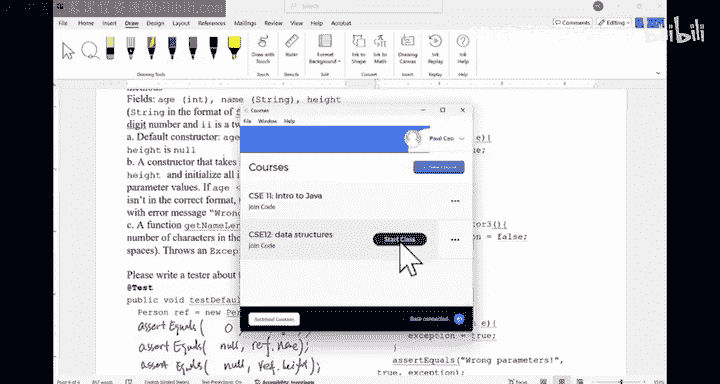
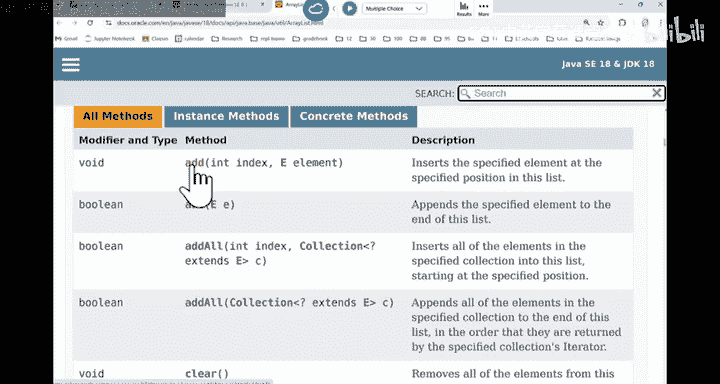
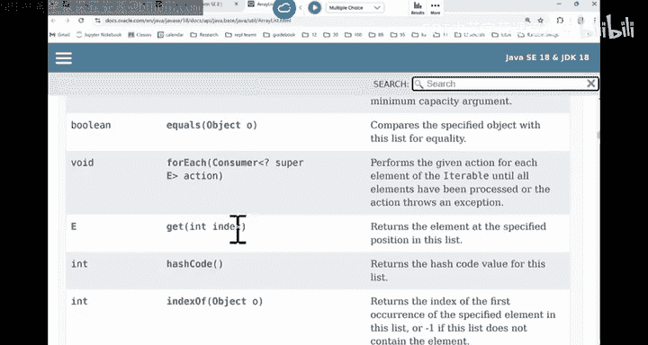
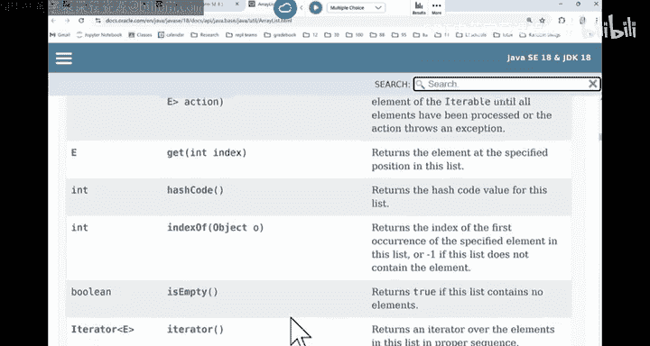
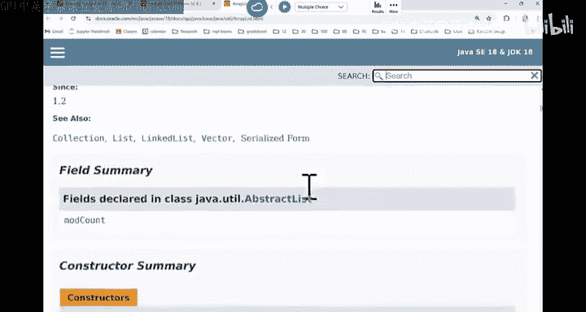

# 006：CSE 12 - Basic Data Struct & OO Design - LE -A00- - Lecture 6.zh_en - GPT中英字幕课程资源 - BV1zJQHYcE8g

Let's get started， Okay， let's get started morning， morning。Week to Wednesday。

 week week to Wednesday， our P A is due tomorrow。 P A1 is due tomorrow。

 Make sure you turn in the P on time。 Okay， if you need help。

 we have a lot of tutors available to help folks。And also。

 feel free to go to office hours if you have any questions， and I'll be happy to help you。The。

 the plan for today， as well as Fridays， we'll get started with a real。 Okay， before we do that。

 we need to finish this worksheet about J unit。Ching test is is is a way for us to kind of。

Figure out the。The testing scheme before we even start with the code that we are supposed to write。

 right， So as a quick review， in this example， we said we have a person class has a age， has a name。

 has a height height has to follow a specific format where you have F with apostrophe and 2 two digits。

 right。There are three functions that we have in here。

 Why is the constructor that takes no parameter， We call that the default constructor。

 a constructor that takes a bunch of things。 And this constructor may throw an exception。

If you give me some wrong errors， okay， wrong parameter values。

 The last part is get the length of the name。 This one may also throw an exception。

So the question is， how should I write my tester before I even write this person class。

 and you don't even have access to the person class， right， so。

Last time we had this code to test the default constructor。

 So we just called the default constructor to get an object。 And this is what we are doing。

 But testing if these variables are correct，Are there any questions for this first part。Now。

 can we write the code。For this test， construct what。In other words， I'm trying to trigger。

The constructor one to throw an exception。There's another。Sorry， there are two more function calls。

 mine is called test constructor 2。 This one would also try to trigger the exception。

 similarly for test constructor 3。And 4， okay， so 2，3，4。

 they are testing the second constructor in here。This one that takes age， name and height。嗯。

And when trying to throw the exception， Can you all write 2，3 and 4， Like。

 how would you want to create an object。And how do I。Capture the exception generated。 Okay。

 If you need handout from Monday in the front。Soll give you a few minutes to write it down。

What would you use。To trigger those exceptions， right， obviously， you。

You also want to test it out like without exceptions， potentially right。嗯。So Ill give。

 give you the freedom to。To look at how do I test part B。And there are three testers for it。

What do you do。 So use this time to write to the tester。And if you are done。

 you have a neighbor's code。see how they tested。Remember， during the real P。

 you cannot look at each other's testers。 So it's a good time for you to look at each other's testers now to say how are you gonna。

Test。The class。Okay， neighbors testers and see if they's a similar they're gonna be different。

 They're gonna look different， right。And it's almost。

Always the case that the values that they use is different from yours。 But you are looking at the。

 the things they' are testing about。 They should be similar， right。A you folks one more minute。

Allright， maybe let's look at the first one。 The first one。

It looks like I really want to test out the wrong parameters。 right So third equals。

 my exception should be true。 This wooden variable。 I said it to be false before the tri clause。

 right， so I can say person。P equals a new。Person。Can I do， Should I do this。Name is C SE12。

Height is。22，7。Is this a good idea？所。The age is negative， name is okay。And the height is 2 or 7。

Is that a good idea。啊。Okay， so it's better that if I want to trigger an error to see if my code captures it。

 you can try to do one at a time as it is individually， you should also try to mix them， right， So。

 but I would say test them early on individual cases。

 and then maybe have a case where more than one is wrong just to figure out。

 because sometimes you say I can capture them individually but your code may terminate too quickly under certain scenarios。

 So I would say， let's say。This person is 5，11， and that's gonna work。Right。

 so this one would generate the exception， because。A is less than 0。 So instead wrong parameter。

 you can even be more specific。 You can say age is less than 0。Wrong。Right。

 so you can kind give yourself more hint in here。Now， constructor2。

It looks like I'm testing another wrong parameter。嗯。Oh， it didn't put in that assert statement。

 So we can。We can be more creative in here。Can I test normal case in here， if I say。

 let me test the normal case， right， There's no exception。I say， person。P equals to new person。

And I'm throwing out。Like。20 years old， CSE 12。And the height is 5，11。And this one looks good。 So。

 what should I assert。After the catch。Or should I assert？If this is a normal case。

 what do I expect to see。How do I know there's nothing wrong with it。Anyone。

How do I know theres nothing wrong with it。对。Right， so I can do a third。You can also do assert false。

Of this exception。Right， so that's also gonna work。 You can also provide custom customized message。

 but not only should you test error cases， you should also test maybe。Like。Normal use has， right。

 So we don't just generate exceptions incorrectly。Any questions for this。Now， what。

 what if I want to generate like this is just 20 C S 12，5，11。 This is just one of the normal case。

 What if I want to test a lot of normal cases。Do I have to write individual tests for each of the normal case。

You can just write them in here altogether。 like its a P called the new person， one year old。C， S E。

 I don't know。 Paul， and then a height， right， so you can have multiple correct usages in there。

 None of them should trigger an exception。 So for， for normal case， you can put off them in there。

Does that make sense？So you， you can do， sorry， just one second。 Okay， a P calls a new person。The 11。

婆。And is 3 feet，0，2， for example。This would also work。 And None of them should trigger any exception。

 If any of them trigger the exception， you would know this assert would be false。

You can also write a loop to generate some random strings and sector。 You can definitely do this。

 You， you create a string array in here to say these， these are the names and these are the heights。

And these are the ages， right。 And then you just use affordable to go through each of them passing the parameters and see if they would。

 any of them would generate some sort of round value。 That's fine。 or correct value。嗯。

Other things like， can I do the same thing in here for the incorrect usage。

Should I say P equal a new person， another edge case in there。Should I do the same thing in here。

You shouldn't， right， Because if one of them triggers an exception， the other ones， actually。

 the ones be behind them are not gonna be executed。

So you shouldn't be doing something like this when you have。

Incorrect uses cases where they would generate some sort of exception。 Does this make sense。You。

If I do this thing， like， for example， this will be wrong per P equal a new person。And I say。

 give you 20 years old。 And this thing is now。And then I say，4，12。It shouldn't be 124，10， right。

 So if you look at something like this， this one is supposed to generate an exception， too。

 But this part is never executed when this part already generate an exception。Right。

 so once this part generates exception you jump over here， this part is never tested。

So there is a difference of normal usage case or the case where you see the exceptions。 So this part。

 don't do it。응 좋아。Because it would be skipped。Are we good。Alright， so the last part is。

 is this thing。Let me see。A test constructor 3， you can， you can say， okay。

 I'm testing wrong parameters。 You can have a mixture， right， so you can say person P。

Equals a new person。And you can say  negative 5， no， no。

So not only should you test things individually at a certain point。

 you may want to trigger more of those errors in combination of them。ok。快身。

So this is kind of something that you can say， well， there's a。Definitely wrong parameters， right。

The last part is to。This is to test another constructor。

Maybe I I don't want to test the constructor anymore。

 You can also do the get name length that returns a number of characters in name。

 So it's very similar， right， You can generate test cases for this one where you can。Basically。

 a test normal case or exception case。Any questions。So this is how you should test your code。Yeah。

This one。嗯。So the， the， why is there where was this gonna generate an exception is because the person class has the description to say。

 if the parameters for this construct is wrong， it's supposed to throw exception。

 So this tester is just trying to capture that exception。 not always the case， right。

 It's not like if you pass in a wrong parameter to a function。

 its it's not gonna always generate an exception。 just in this example， it should。

Any other questions。Alright， so you， you are allowed to use magic numbers for the tester。

 In other words， you can hard code your tester。 That's fine。 right。

 But when you write your data structures， you should avoid using magic numbers in your data structure。

All right。And again， please do not share your tester。 Please do not share your tester， okay。嗯。

It's considered to be a violation of academic integrity If you share a test with another student。O。

 don't do that。 Don't do that。嗯。No。We are done with Java review， okay。

We're going to get started with our first。Data structure， we。嗯。So， this one is called alist， okay。

Of us have probably used a ra in C S 11 A B。 say this is a Java class。

 You can create a raius of certain types， and you can insert things in there。

 You can remove things from there。 And this， this is super nice。 It's a dynamic。 In other words。

 it can expand。 It can shrink。 depending on what we want to do with it。So this is a a read。

 It implements the list interface。 In other words， it is a list。So what is the list。

 A list is just a collection of things that has some sort of order。 In other words， this item 0。

 item 1， item 2。 So you give each of them a location in the list。Right。

 if we think about a list of students， we give kind of。The。

 the student list with a number This is student number one。 your number  two and go on。

 So that's the idea of a list。Right， so it's not just a collection of items。

 If you just have a collection of items without giving them their location information。

 that's more like a set。 It's a collection of things。 In here is' a list。

 So everything in the array would have some sort of location。 We call them the index， right。

So it would simulate the behavior of a dynamic array。 This dynamic is definitely in quotes。Right。

 I remember during office hours one of our student asked me when we。

 when we talk about a raise or rad， Which one are we referring to。

 Are we talking about array array or ra。This， the answer is。They are the same thing。

They are the same thing。 Okay， so a is just an array with the illusion that it can shrink or expand。

 In fact， you cant。 All the arrays that you create in Java has its size fixed。Okay， so I real。

 the dynamic part is an illusion， just like we say。People from Stanford they have this dark syndrome。

 right， Everyone is floating on the water。 Everyone looks very gracefully。

 I think you say this have a similar syndrome。 say everyone looks like I'm not working too hard。

 but underneath what， everyone is pling crazy right And here is the same thing。 right。

 So the idea of a list looks nice， but at this core， it's still just a basic array。

 just a basic array。 So as the creator of the array list data structure。

 we in C C 12 would have to do the dirty work。 In other words。

 if you say I need to have a bigger array， you have to resize the array by creating a brand new array with a bigger size copying the old thing。

That's what aures does。 Okay， so the user of the aureis。

 which we used to be in C S 11 A B this thing looks so nice。 right don't have a lot of errors。

 But as you see， the data structure is just an array。 So the back end is an array。So。

The backend data structure。It's just an array by the fixed size。 Okay， now what is array。Okay。

 the back end of release is。 What is on。What's special about a race。Anyone knows what an area is。

I know you all know how to create an Henry， but what is en。

Maybe you can tell a neighbor if you are not willing to tell the entire class。

 Tell your neighbor what is en in your head， What is en。Why is it being used， you know。

We start with a raise in 11， why。What are you so special about them。With his armor。

Can someone describe what Ar is to us， what is Ar？You have working summary。

Justs a bunch of things with the index to， to the elements in the array。Is that it。

So just keep in mind。 Okay， when we look at array， a is like in your head This is oh there's this thing。

 right， This is 0。 This is size -1。 and that's an array， right。The。

 the most important property of Hore is this is contuous。In memory。This is very important。

 So when you create an array， the elements in the array that next to each other in a， in the memory。

That's the most important property of array。 And that's what makes it so useful。Because if you know。

 everything is contiguous in memory。So one after another was a benefit。If you think about houses。If。

 if you are rooms， right， classrooms。有。You can find everything really quick。

I can access individual elements in constant time， right， If you think about it。

 like if this room is 202， if there' is another room beside us， you know， it's gonna be 20，3。

RightThe next one is gonna be 2，0，4。 if they are now using crazy numbering systems， right。

 So the idea is one after another， you can know the location of the next thing really quick。

If I know， like。The beginning room is 200。 And I'm looking at like。This is location zero， right。

 If I know look， the beginning of a room number is 200， I say， what's the seventh room down the line。

Just add 7 to it。 You have 20 7。 right， So it's really quick for you to say。

 if I know where I want to go， you can go there immediately。That is the benefit of an array。 right。

 in， in essence， if you know where the array begins。

 you can find out where each of the element is in in the con really quick， really quick。So。Let'。

 let's think about this thing。So if this is an integerary。With a bunch of things， with n things。

 Okay， so this is 0 all way to n -1。If I know this cell is at a location。

 I'm just gonna make up this number 200， location 200。I want to know， what is the7。Element。

 where is it。If have intesger array。And okay， where is the seventh element。

StStation that in the memory。 I'll give you a couple choices。A is 2 or 7。B is。2。😔，28。Cs。呃。

I can't do math anymore，172。I is none of them is correct。Where is it？can。Frequ is A C。 Okay。

 if you have a clicker， click in。Where do you think this seventh element will be sitting at。

Where is it。Can you talk to a neighbor， please， What is your vote， We have a bimod vote in here。

There are two choices that are extremely popular。With the most popular choice being the wrong answer。

Any here。嗯。Can you have a quick discussion with the neighbor what did you you vote for and why did vote for that choice。

The most popular choice is。Is 8，207， right， That's what we are thinking。2，7， I think it makes sense。

 right， okay， this is at the location 200。 The  seventh element is gonna start at the location 20 7。

The basic unit of memory bite。Right， how many bytes do we have in the integer。How many bytes？

 How big is the integer。啊。4 by in Java， right。 Java is 4 by。

 meaning that this thing is occupying 4 by。 So 200 is the beginning of that by is the address of that beginning byte。

 In other words， this first element would occupy， would occupy byte 200，2，0，1，2，0，2，2，0，3。

So if we think about the seventh element is gonna start。Roughly speaking。At this spot。At this spot。

Okay， so it's not just say you。You add 7 to it。 The nice thing about Java is this difference is something that you don't have to worry about。

 You don't have to worry about， because normally what we do is we say， oh， you have a array 0。

 then I can easily find a array 7。 but on the back， if your head， you should think about。

The distance between them is not 7。In memory like 28 by。 But in general， you are not required to。

 to go to that level in C C 29，30， you have to do this by yourself。O， in， in C S C 12。

 you don't have to。 You don't have to。嗯。Questions。But with the benefit， like I said。Excuse me。

This array， is continuous memory。 You'll know where the array begins。

 You can easily figure out where each of the things are very quickly。 right， Just do some math。

 So it's the index times the size of individual element plus the beginning address。

 So 200 plus 7 times 4。

That's how you can find the location in the seventh element。Okay。嗯。

So this is kind of the benefit of having an array。 The problem with a is everything must be continuous in memory。

 has its benefit， but it also has its problem。 What's the problem。Whats the problem？Just like。

 imagine in this room， right， the nice thing about like ask everyone please sit next to each other。

 Everyone I sitting next to each other。 There is no spare chairs。In the room， like at least in the。

 in the space that we occupy， right， there may be some leftover chairs in there。

 What's the problem with this approach。有。I can't dynamic allocate space。

 So if everyones like I asking all those folks to move to this region。 like we。

 we all occupy this entire region。 What's the problem。Everything is one next to each other。

What if a new student come in。The student can never insert here。 If the student say， hey。

 I want to say it here， Everyone have to shift。 Everyone behind that chair have to shift to one spot。

That is the problem with a raise。 is if you have to change it， It's certainly in the middle。

 the worst spot to change is world。If that new come in and say， I want to see it in this chair。

 then we are in big trouble。 or everyone have to shift to that location by one。 That's the bad thing。

 So if you say the students say， hey， I'm， I'm late， I would just say at the very end。

 would that be a issue。Probably that's gonna be okay， right， soon we just go to the very end。

 nobody else have to shift。Everyone is just sitting at their own spot。

 But if the same decide to insert at a certain location。People behind him or her will be have to。

 will have to shift。 So that's the issue。 When you have the array in here， right。

 if you' are looking for something， that's pretty nice。But when youve had to change it。

It involves some sort of shifting。This is the killer。If you look at array real list。

Or us give you a bunch of functions， right， Give you a bunch of functions。

This is the earliestist Java doc。Java implemented this thing。If you look at it， right。

 really it has this add function。呃， add一。Is gonna if you look at the description。

It depends the specified， specified element to the end of the list。

Why does it default to insert at the end of the list， not at the beginning of the list。

You got to think about it。Right， it's because this is the least disruptive way to insert something into unread。

Because it doesn't involve shifting。 And if it say， hey， let me call this one。 This one。

 give me an index， give me an element。 I'll just insert it。 You just have to be very， very careful。

 Although you are given this tool， it doesn't mean you should use it。Right， so you say。

 I want to insert something into the list。 This would involve everything after this index shifting to the back。

Does this make sense。 So we do not want to shift unless it's necessary。

 So when you try to manipulate a array， you can change element in the array。 That's not a problem。

 But when you try to insert or delete something。Since a array require all the elements to be next to each other。

 it would involve shifting。 If one of us decide to leave while everyone is sitting in the room。

 If that person leaves， then everyone behind that person have to shift to the front by one position。

It just involves a lot of extra work。Are there any questions。Okay， so if you call this function。

 it looks nice。 You add something into the element。 But in the back end。Were shifting things。

 The user don't see it。 The user don't see it。 When are they gonna see it。

When are they gonna feel this。If I'm a user forist， I didn't know。

How the data structure is implemented。 When are you gonna feel the pain。

It's really slow very radical code and say， oh my God， this thing is taking forever to run。

 And I have no idea。 It probably you are using the data structure incorrectly。

That's when you realize something is wrong。 That's。

 that's why we ask folks to implement the data structure in 12。

 So you know how it is implemented in the future。 You know how to use it better。 Okay， so that's how。

The add function works。 Let's， let's look at some of the other functions contains。

 We'll look for something。

Right， in the array。

Equals， if you want to know if the two objects are the same。

 ga would get you something from the array given the index。

Hash code index F to look for something。

Is empty。 I think the other things in here， remove。If you have to remove something。

 remember it involves shifting。 If you have to insert something。

 sometimes you have to be careful because if this room has 200 seats。And then。

We have a 200 first person coming in。 This room is not big enough。 We have to add a chair。

 In other words， you have to create the the way that Java works is you have to create a brand new room with 201 chairs。

And then， you copy。From the original into this new array and then add that new data at the very end。

That's normally how we do it。Okay， and if you think about this， when you try to resize。

 this is called resize the theory because you are out of space。 If have to resize。

 do I just want to add one element at the end。Because I need， I have someone new coming in。

 Do I have to add one element。Is there a better approach？Like， for example， this room I can hold。

 I don't have many people，200 people。 And of us， sudden they decide to combine are gonna to give you more students。

What are gonna do， Are they gonna switch me to a room with 201。

Probably not right Ill give you 300 people room in case you need more space。 That's how it goes。

 right， So in here， when you try to resize， you are not gonna say just add a little bit。

 Sometimes you double like you say now I have 200 orll give you 400。 If 40 you need more space。

 I give 800。 So doubling would avoid this resizing。 resizing is very costly， right。

 You have to copy in from the old array。 that's， that's pretty bad。Any questions。

So that's the idea of a ray list。 And what I want to do is I want to implement some of the methods together in here before you have to do this para itself for P2。

 for P 2。

Let's look at this one。 So we have a latest。Generic class， right。 And they say。

 I have this object array。You can create the E array in here。 It's not gonna be an issue。

 but you can also create object array in here。So why not do typecast。

And then there is this default capacity。 Deult capacity is a constant。 In other words， say。

 if you just create a latest。As you have five things。In Java， I think it has a different number。

 I think it's 10 or something。

Yeah， so if you， if you just create an empty real。You say it create empty list with the capacity of 10。

Capacity of 10。 That's what happens in Java in this number is just say 5。 So initial capacity is 5。

 And then the， the size is how many things are occupied。Do not confuse capacity with size。Papacity。

Capacities like how many chairs you have in this room size is how many students are are on those chairs。

 That's different。Right， so we can always think about size as less than equal to capacity。

That's always the case。Any questions。Alright， so initial capacity is 5。

 When you look at this default constructor， I create a new object array with this default capacity。

 size equals to 0。Right。Now， can I， can I omit this thought。Can I。Instead of saying this star data。

 can I just say data equals to this。看到。Okay， right， So I think the quiz。Yesterday， right last night。

 you were tested on something like this。How did the quiz go， I forgot to ask。Was O。

So if you didn't do as well， I think we finished greeting the quiz。 Did we release the quiz yet。

We did，So if you didn't do as well， next week is the makeup。 If I did perfect。

 you can skip next week if you want to， you're more than welcome to do that to just do practice。

 That's also fine。😊，嗯。Now， so this is the default constructor。 This one append。

 I want to append something to the end of the earliest。For now。

 you don't have to worry about what's gonna happen when the aureliius is out of capacity。

But if have time， handle that in here， Can you write this code yourself， Okay。

 I'll give you some time， Write it yourself， yeah。Apparently that。FC add is more。General。

 because you can add at any spot， a pen in general implies you a pen at the very end。 It just worry。

 is。 you can name them anything about。嗯。So can you implement the append method and try to think about edge cases。

 Try to think about edge cases。 Okay， when do I。Have to。For example。

 throw some sort of exception in here。So give me a vote once you are done。You both once youre done。

 We have 10 minutes。s。How many methods we have。Should be good。G both once you are done。

So it depends on， like， do you allow now element to be part of the array list， right。

Let's assume we don't allow it。We don't allow people to insert now elements into the。

If that's the case， what's going to happen。All right。What should I do in here。

I want to insert this thing add to the very end of the list。

Let us assume we are not gonna to go out bound。Let's assume that's the case。 What do I， What do I do。

Should I say。What is the name of my data？Can I say this data。呃。Initial capacity。

I don't even know how to spell it anymore。 So initial capacity。-1 equals to element。Should I do this。

No。Because the size of the array may already be different and。What what should I write in here。

 Should I say。Data dot length，-1。The last element。No。What should I do。What should I do in here。

If I want to insert， yeah。Size， right， So it shouldn't be this。 It should be size。

Because size tell me where the last element is， right。

 size equals  one means you have one thing in there。 S equal 0 means you have nothing in there。

 S equals to capacity means the whole thing is full。At this moment， so size would be the index。

So I should say， the size equals to element。If I don't allow people to insert a nu element。

So if element is the same as no。I would just return。 I don't insert anything。Anything else that I。

 I need to do。Assuming I'm not gonna be out of bounds。Am I done。有。I have to increase the size， right。

 because I have more element in there。 Don't forget。Size plus plus。

 Sometimes you do see people do the following。People do size plus plus equals to this。

 So it means assign the element to size and then increase size by one。It has to be post increment。

 It can't be pre increment。Right。I would assume we have learned about the difference between pre and post increment。

11。对对。You can definitely just say data size equals element。 size plus plus is the same thing。嗯。Now。

 how do I tell if the array is full。If something happens。I， I basically need to resize。喂。

How do I tell if they were raised for。有。If size equals to capacity。So， if size。

Double equals to what's the capacity， initial capacity。啊。In this， in this example。

 initial capacity is 5。 but as you can imagine， initially you are given five elements。 But over time。

 this thing may resize， may have been changed。What should I do now。Data do length。

 That's the capacity， right， So how big DNA is。 So in general， you don't use the。Initial capacity。

 you say if the same as the length of the array， I need to resize。I need to resize。

Does this make sense。嗯。Once you finish resizing。You go down and insert this element at the very end。

 increase size。Are we good。All right， so that's the first one。How about we do the second one？

 And then we call today。So， get this element。Can you write out the。Error case。

 like if the index is out of bound， you throw a rein out of bound exception for this one。

 If the index you' are given is outer bounds， throw a re index out of bound exception。

And then if everything works out， just return that corresponding element。What do you do。

What would you do。Get this element。Alright， so how about we do this， We say。

 if when do I know index is out of bound。I think this is pretty straightforward if index is less than 0。

Or what。Should I say index。Is。Bigger than。Data dot lens。Doesn't mean that。

Is this the right way to express amount bounds。Yeah。Gder equal to。嗯嗯。It means I'm out bound。Yeah。

So another proposal shouldn't be data length。 data length。 It should be size。

 sizeize is how many things have been used in the array， right， Capacities like how。

 what's the total number of spaces in there。 So when you say， let me get something。

The things that are now being used， you are not supposed to touch them。 They are unoccupied。

So you' are only using part of this array that you are allocated。 So it shouldn't be。Lth。

 it should be size， right， Just be careful in here。Are we good。So if this is the case。

 I'm going to throw。New。A rate index。 I don't want to write it auto bound the exception。Right。

If this is the case， do I have to add this a throat cross to my ga method。Do I have to？

I should I add the throws in here。Do I have to。Because some of you may change。 So when you。

 when you write P S， right， one of the important things is we give you an interface。

 We give you interface。 Sometimes people change the methods from that interface。

 You should never do that， because that's how we gonna grade your work。

 We expect your function to be having this signature。 So we we can call it properly。

 If you change the signature。If you add the throw cross。

 that's considered to be changing a signature。농도다。But in here， should I add in this thing。

 Like in the article， should I add in this throat。You don't have to。 You don't have to。 You can。

 but you don't have to because this index of the bond is unchecked。index out amount is unchecked。

 so you can throw it any way you want to without having to specify it。So this is the case。 Otherwise。

 Ill just return。 Can I just return data index。Can they just do this。Looks like it。 But remember。

 this data is an object array。 You' are supposed to return E type data。So it's better。

 you type cost into a E before you do it。Okay， so just， just be careful small details here and there。

Are there any questions。All right， so on Friday we'll finish this exercise and we may move forward a little bit more。

 so I'll see you on on Friday。 we're done today。

