# 009：CSE 12 - Basic Data Struct & OO Design - LE -A00- - Lecture 9.zh_en - GPT中英字幕课程资源 - BV1zJQHYcE8g

If any of us need actual。Notes。All right， I think we we should start Okay， good morning， everyone。

 good morning。嗯。What we'll do today is we'll finish link list pretty much。

 And then we're almost done with the link list。 We'll be looking at the iterators for a linked list。

 okay。So for link list， we have two assignments， the first assignment is the link list。

 Im a link list， which is gonna be a doubly linked list。 The second assignment will be。

Iters for a linked list。Those are the two things that we have for linked list。Last time on Monday。

 we were looking at a link list like this。 This is a singular link list。

 We are assuming we have dummin node in the beginning， right。

 And then we implement this insert method。 So insert at a certain spot。For linked list。

 the issue with linked list is if you need to insert at a certain spot， This part is the。

 the seek part。 You have to go there。 It takes some time。Wu。

So this is the part that actually you have to seek to the right spot， okay， and。

Depending on where the index is， you may hop all the way to the very end of the list if needed。

 right。So。This is the shortcoming of the， the link list。 There are a few things that we。

 we didn't get time to。To do by ourselves， right？ So the first part is we were relying on this constructor。

 which said just create a new node with this current as the before node。

 And this constructor would make the proper link for the new data。But can we do it ourselves。

 Like if， if you are not even a construct like this， how can we make the link ourselves。Right。

 that's the first thing。 The second thing is， like。

 would this code work if I want to insert something right， right now， if I insert at location 1。

 this is where it's gonna be inserted。 If I insert at location 0。

 that's where it should be location 2。 How about if I insert at a location 3。In other words。

 I want to insert after the last note， How do I do it， How do I do it， Would this code also work。O。

So we， we'll kind finish these two parts together。 And then we'll look at iterators。 Okay。

 are there any questions before we start。

All right。So let's， let's try to do this part。 So what if I don't use this usererator。

 I don't use this， Sorry， I don't use this constructor。 I just want to link by myself。

 What should I do in here。So if I want to link by myself， I have access to current。

And I will create a new node。 For example， I will say node。Tamp。Eals a new node。With this new item。

Right， so I'll create a new node of temp。Temp is pointing over here。

Can you try to link by yourself and show your neighbor how you would want to link it。

Don't rely on this construct。Just say， I now need to link this thing by myself。 What would you do。

What would you do， Try to do it yourself or look at a neighbor how they would do it。Do you sometime。

 How would you link。This note to the right spot。This task may seem trivial， you know。

 so maybe you'll never have to do this if you become a software engineer。In the future。

But if you use AI to generate the code， you must have the ability to verify if what I gives you is correct or not。

Just like right now， you probably don't have to add numbers in your head。 You can use a calculator。

But you can verify if the calculator is a result is right or wrong。

If you don't even know whether the calculated results is right or wrong。

 you shouldn't use a calculator。And here's the same thing。You can use AI to generate codes。

You must know if they are right or wrong。 So， and this is。While learning。I just skill staffing here。

So how would you do the。Connections bear off of due to it。There。

 there should be three steps in general。 You have to do three things to make the connection。

Or maybe two things。 sorry， two things。What would you do in here。Can someone share。

 what's the first step I want to do。I have temp pluging to this node。And this current is here。

What's the first thing I need to do。Anyone。Can I say this， if no I want to say it。

I would do the following， current。Thought next。Equals to temp。And then say temp dot next。

Equals to current。Dot next。Will this work？That's what I will do to make the connection。

Would this work。I say A E， SB， no， let me ask you， would this work。

These are the three steps I'm doing create a new node。 make the two connections with this work。

I know my folks are not saying anything。 It looks like we have a tie between the two choices。

Some of us think it's gonna work。 Some of us think you won't。嗯。With this work。Here。

The frequencies A C。Can we have a discussion。 What would you say。

 We have a tie roughly this being 50，50。Will this work。

 you explain to a neighbor why you think it's going to work， why you think it won't。What's the issue？

I'll stop the vote now。 Will this work？Would this work here。So the answer is it won't work， right。

 It won't work。 It won't work。Why it won't work because。The way that initially， you have。

The nose pointing this one， right， So current。Is pointing here。

 and current is pointing to the next node。And then I have my temp here。嗯。The first step is。

 I say current dot next equals to temp。I'm assigning temp to current dot next。 So in other words。

 this is the next variable it's gonna to point over here。Right。

 does that make sense if you assign temp to current do next。And then。

I say time down next equals the current down next。Tump dot next is this variable equals to current dot next。

So what's going to happen in here？Poing to myself。That's not what I want to have。

 It's like I'm stuck in a circle。 Once I reach here， I'm gonna get stuck in a circle。

What what's the primary issue in here？ What's wrong with this。What's the primary issue。Is the。

The order of the operation， right， So I have to swap them。Those operations are right。

 but the order in here would matter。 The ordering here would matter。So if initially the。

 the list is like this。 And then if I do the second step， T dot next equals to current dot next。

 The other words， I must preserve this arrow before I destroy it。 So T dot next。

 which is this variable。Equals will come down next。Cndown next is still pointing there。

 So at this moment。2 things are pointing over。And then the next step is current down x equals to temp。

但是 when。This connection would be made。You cannot。Do it like in the other way， it won't work。

Questions。All right。So， that's what it is。Now， if you are looking at the last node， like。

 would this code either using the constructor or using this approach。

Would this work for the last node， like， I want to insert this time after the last node。

Will they work？Can you do a vote？ A is gonna work。 B is， no。

 you have to do something special for the last node。

SoA this code in the right order in here would work for the last node。B is no。 It won't work。

Would it work for the last node， The last node is special。 The， the， the next is not。The next is not。

 That's what we have。It looks like we are just tying with each other。The whole morning。

 I have another tie。 I have another tie here， okay。So。I don't know。 Can you。

 Can you talk to your neighbor， would this， this operation work for the last node。Weake cough I run。

 wake up， so will this work？For the last node， the last node has a node in there。

 So if I connect this new node in there， I'm this part is supposed to be now。

 And this thing should be pointing over there。 Will this work。Have a discussion， please。

 Have a discussion。How would you say whether it's gonna work or not。And this is what we're set on。

 you know， it see。Is it even were trying to make it as even as possible？

With this work for the last note， do I have to do anything special。All right。The correct answer。

 it will work just fine。 It will work just fine。 Okay， so let， let's。

 let's look at why it will would just work。 If we think about it， right， If the last node is no。

 this is a no currently is pointing to it pump。The first operation I will do is time down next equals the current down next。

 T down next equals the current down next。 So this part would be now。Right。

And then we say current dot next equals to temp。 current dot next。

 which is this variable equals to temp。 So this part is no longer known。

It is not point you over there。So it's gonna insert the data in the right spot， anyways。O。

Any questions for this。I hope this makes sense， right？

 So the trickiest part of linked list is number one， hop to the right spot。

 Make sure that you do not hop one step over a one step behind。 So hop to the right spot。

 And then the， the link right， make sure the order in here would matter。

 If you pay attention to those two things in January are fine。嗯。Are we good。

 Any questions about how to link something in a list。All， now move on。

 So there are different kinds of linked list。嗯。Just want to give you some examples。

 First part is the easiest list， Singly linked list。

Normally what you have is you have this linked list class。And you have a head。

This head is pointing to a dummy node。This is a node object。You have the data。

You have the next variableable， right， by default， this domino next will be now。

 You also have a size。How many things there are。 And then the， the list will just。Ding here。

Another node。With the data。Next， so for the dom node， let's assume this is no data， right。Until。

 in the very end。Note， you have this data。At very end， the next is no。That's what it is。

And the reason why we need a nu terminator in here with the next data is you can keep hopping until you see。

The end of the list。 until you see the end of the list， okay。This is single linked list。

 You may have a double linked list。This is the list object。You have a hat。This head is pointing to。

A node in the node， you have data。Right， but there is a next。 There is a previous。

And the next is pointing to the node。Like this。Note of the data in here。In here， the next will be no。

 there's nothing。After this one， you also have a previous。For each of the node。

The previous is pointing to the node in， in front。Right， for the first note， the previous is now。

There's nothing it is pointing to。So you have a hat， youll also have a tail。

And this tail is pointing to the last note。You may have domins。 You may not have domins。

 but the idea is you can go from the head， all the way to the tail and tail all the way to the head。

Okay。Are we good。Okay。You also have a size in here， like how many nodes there are。For P3。

 this is what you will do。 Okay， It's a double linked list。 It's a double linked list。

You have to make the connections back and forth。

Theyre also like circular link list or circular W link link list。

 They are not as widely used as just like a double link list。

 So we're not gonna talk about them yeah。嗯。There's everything about linked list。

 like how to implement a list。 Are there any questions。All right。Now。

 let's move on to this special thing called an iterator。

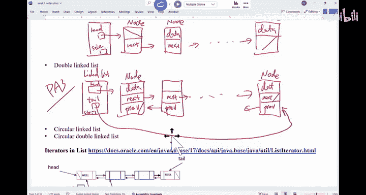

Okay， so iterer in the list， you can have the Java do。

 It tells you everything about the iterator for the list。

 But what I want to talk about is the idea of a iterator in C， S C 12。

 you're gonna implement this iterer for linked list in C I C 100。

You are supposed to implement a a link iterator for a tree。But what is an iterator。

 What is an iterator， I think that's the， the important thing I want to。

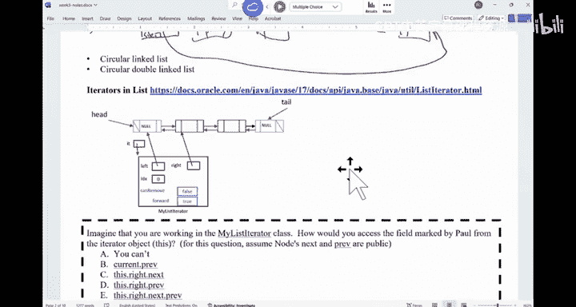

Let folks know。 So if you think about it， right。Here's on energy。Like。For example。

 all of us have the student card from USD。 you go to the student center。 I need a student card。

 Theyll take a picture， and then something is going。 someone is typing in your information。

 And then after a while， you get your card。After a while。

 you get your card as how they process the information。 It's opaque to us。 We don't know。 And。

 in fact， we don't care。 We don't care。 right， So soon as I get my card。That's good enough。Right。

 so in other words， a lot of time we try to hide some of the details from the user。

Because if the student card office decide to reorganize， the user doesn't have to know。

 The user would still have the same experience。Another example， if you say， okay， Google come to USD。

 I think they are coming to USD。 you know， so it looks like this year's shop market probably selected better than last year。

 Last year， Google even didn't even come， I think。This year at least they come。 so the。

 the question is like， they say， hey， recommend a few students for internship。How do I recommend。

Google doesn't have to know how I would recommend， right， I have an internal criteria to say， okay。

 I'm gonna pick the best tutor in my group。 Okay， those are the two students you need。 You say。

 I need one more。I'll give them one more。 right。 So that's what I can do。

 Google doesn't have to know my criteria。 And as how I rank my tutors。 In other words， if I say。

 I need to go through my tutors and rank them， this is the best。 This is second best。

 This is the third best。 And that's the order I would follow。Right， so that's what I would do。As。

 as for the iterator idea is you have a list of things。 You have a collection of things。

 maybe a group of tutors， maybe a group of students。How do you go through this collection of things。

From the outside world， you just have say， I create a list。 For example， I create a list。And you say。

 we， we have a real list。This is our latest。You may have a linked list。喂。So。You may also have like。

 for example， a tree。I don't know what what it looks like。

 but I can organize my staff any way I want to。You might also have some other weird data structures from the user point of view and say。

 I really don't care how you organize the data。I need to know is。

 can you help me go through the data that you have。So if I， I。

 I will basically the data structure would supply this iterator to say， he， just use this iterator。

 You cause certain method of the iterator is gonna allow you to go through the data structure。

And you don't have to worry about， is the data structure arranged in a array， in a list or in a tree。

Doesn't matter。 You don't have to be concerned。 Just use this method。

 It's like a universal pointer for the C plus plus or C programmers in。 So iters。

 that are more like a way for you to。Use this special tool to eat through any kind of data structure。

I don't know if this makes sense or not。So。The， let's， let's look at some of the the examples， right。

 So if it have array， as they go through everything in the array。

You just need a for loop， right， So I will give you this eerator。

And the user would interact with the iterator。The user doesn't have to interact with my backend data structure。

The user call method， for example， dot next。The user on this say down next。

 I'll just give you the next thing in an array。 or I'll hop one step forward for my list。 in here。

 I will look for the next thing in the tree。Basically， that detail is hidden from the user。

The user just use this thing and work just fine。Are there any。

 So it's like a middleman if we think about it between the back end and the user。

 Because if we have this middleman， the user doesn't have to understand how to eat it through a list。

 how to eat through a tree or。Any questions about this。That's， that's the concept of iterator。

 So whenever you create a new data structure， you say I also have this iterator that is available。

 Anyone that wantt use my data structure， you can use the iterator to go through the things you have stored in this data structure。

嗯。

So let's look at this E3， E through4， the list。

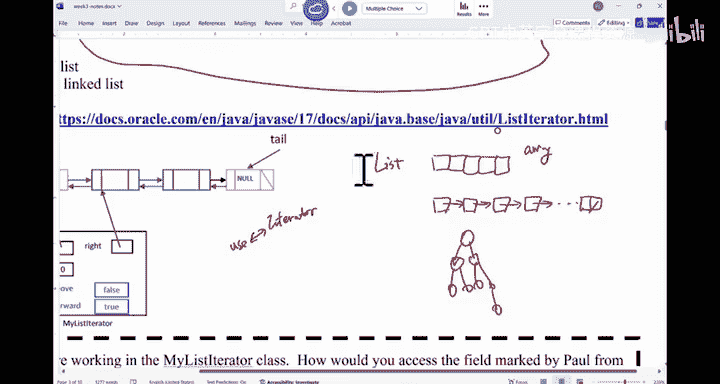

Think I have everything in here。So this list iterator is an interface， right。

 A is implemented linkless implemented。

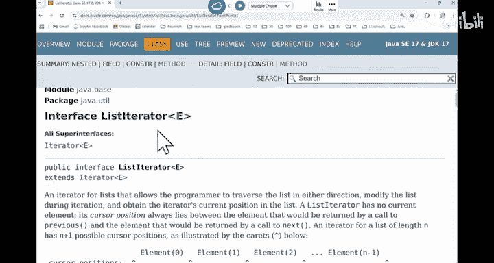

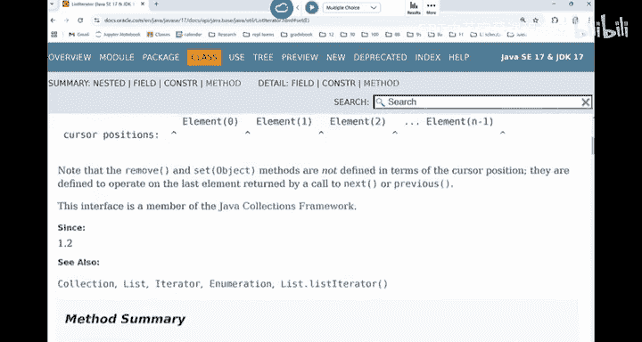

If you look at the visualization， okay。So if we think about the list。

 list is just kind of a sequence of things， right。The iterator is， is like。

 if you think about the list as a rope， the， the iterator is like a small robot that's hung onto the rope。

It kind of hangs in between the element。 is' not hoging on a single element。Initially， we be here。

And then if you say move forward， it's gonna move in between element 0 and 1 and go on。

 all the way to the end order。 That's what this user will do。 Okay。

 well have a few methods that you can have。For example， you may say。

 let me use the iterator to insert something。At this would insert a specific element into a certain location where the iterator is at。

Okay， has next has previous means if you look down the line。

 do you have still have things to look for。 Do you have things in front of you。Next。

Would move forward。Previous would move backward。Okay。Remove would get rid of something。

 Sa would change something。We've seen something like this。 Is there a class that have。Next， has next。

Weve used something like that in 11 or  A B。What's that。有。Scan scanner， right， So I used scanner。

 If we think about the scanner is' basically a eerator that would eaterate through the files。

We didn't care how it's scanned through with the files。 All we need to use is this iterator。

 I call has next int is gonna get the in for me。In here。

 this E3 would allow you to move across the list。Okay。

We didn't implement the iterator for the array list。 We can。 but it， it's very basic。

 If you say move forward， I just give you the element at the next index that there isn't much you you need to do for linked list。

 It's more interesting，嗯。Let's look at the。Idea of e referring here。 This is。

Tub linked list。A do， domin with the data in between， okay。So this is element 0。 This is element 1。

O看。So iterer by itself， is an object。So when you have a link list。

 the link list has a method called get iterator。 And it's gonna return iterator to the user to say。

 you use it to now go through the link list。And initially。

 this eer have a few instanceense wearables。 And this is the， the reference that can be returned。

 The user have access to this thing。系。Now， this one is pointing to this object has a left。

 has a right， has a index， has a few status variable。 Can remove means can you remove this thing。

Can you use the iterator to remove something forwardward means did I move forward。

 Did I move backward。So left is pointing to a node。 right is pointing to a node。

 Eerator always straddles between two nodes。嗯。Index tells you the relative location of the eerator。

 where it is sitting at on this list。Okay， so this index is is not the same as the index of these nodes。

 Not necessary。 It just tells you where it is on this whole list。

Can remove is a bullion forward is a bullion。 If the iterator has moved forward。

 this forward will be true。 Like if， if you call next。To move the iterator to the right by one spot。

 this forward will be true。 If you call previous， this forward will be false indicating you just moved from the end to the front。

有。We are not gonna write the code for this Eerator in P 3。 You're gonna do it for P 4。Okay。

So we're going to write the eerator。And in fact， you can ready for anything that you。

 that we have created， like a realist。But the idea is there are certain restrictions when you use the iterator。

 Okay， when you use the iterator。

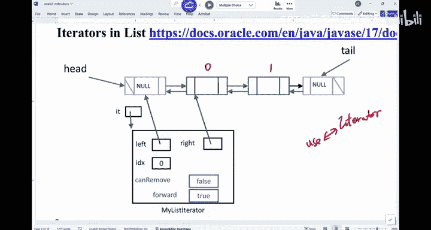

The requirement is when you use the iterer to just crawl on this list It's totally fine。

 You don't know worry about the thing。 You just look at the list and use the iterer to access information。

 But if you need to change the list。 Like you say， I need to insert something into the list。

 I need to remove something from the list。 I need to replace something in the list。

 a lot of times there are restrictions， because if you start to insert things。

 the state of the iterator may changed。So there are certain requirement to say。

 when you try to insert things， you must have moved the iterator beforehand。 So let's look at。

 for example， add。 Okay， if you want to use the iterator to add something。

This is a description。 It's a long description。But I think it， it's worth reading it I once。

 So you can insert this thing into the list。O。This element is inserted immediately before the element that would be returned。

By next， if any， after the element would be returned by previous， if any， okay。

So what does this mean。The location of add is， as if if you call next， it will be insert。

 it will be returning something。 You're gonna insert it before that thing or after if you call previous。

 Okay， the new element is inserted before the implicit cursor。嗯。

A subsequent call in the next would be unaffected， and previous would return the new element。

That's kind of what we have in here。 So this is when you want to insert something， okay。Now。

 for remove， remove have some restrictions even more。 Let me see， remove， okay。

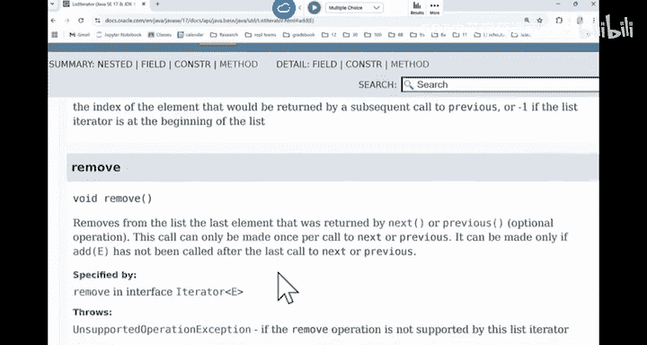

So remove method iss gonna remove from the list。 The last element that was returned by next or previous。

 This call can only be made once per call to the next or previous。

Meaning that if you want to use this iterator to get rid of something。

 you must have previously moved the iterator either to the right or to the left。

And you're gonna get rid of the thing that was returned by the last call of the movement。

 either next or previous。So when you try to remove， there is a restriction。

Okay。And the last part is set。嗯。If you need to change something。

 replace the last element return by next or previous。

 this can only be done similarly after you have called next or previous， but not with add or remove。

So when， when you try to replace， insert or remove， there are certain restrictions。

 You have to be careful， okay。It seems redundant， but the idea is if you are not careful。

 the state of the iterer will be messed up。 So when you call next or previous again。

 it's not gonna work。That's the whole point of having these restrictions。

Any questions。All right。

So let's， let's look at this one， okay。

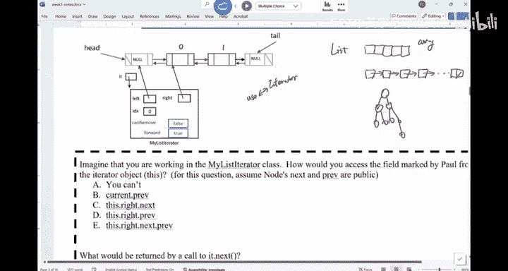

So supposedly， okay。If you are working in the my list iterator class。Okay。

 and I will specify a field in here。I want you to， to see。

 how would you access this field in here okay。So what I want to access is。In thisね。

I want to access this field。系。What would you do。Can you pick the right choice。

I want to access this thing。 This is the previous， the previous。You are working in this class。

 and you need to access that thing。Hopping。We have quite a few votes for these ones。So。

Which one would allow you to access this field。The issue right now is pointing over here， right。

 So I want to access that thing。A majority of us are getting the wrong answer。

 majority of us getting the， the wrong answer。 Can you have a discussion。

 I want to get this variable。 I want to I'm not looking for the value of this variable。

 I'm looking for this variable itself。Which one is right， Which one is right。

 Can you have a discussion。I have a discussion。I want to get to this field。

 I'm not looking for the value of this field。 I for you know， I want to change this world。

What should I put on the left side of the equal sign if I want to change this variableable。

Which one is right。 Have a discussion。 I think a majority of us are voting for the wrong answer。

This is a doubleub linked list。 This is a doubleub linked list。All right。

So if you say this is a variable， right， This is a variable。 This is the previous variable。Of。

This node at the location 1， right， That's the previous variable of this node at the location 1。

 A lot of us said C。I'm not mistaken。This dot right， dot next。 This dot right is this thing。

So when you say this alright， you are referring to this object dot next。Is。This horrible。

It's not that horrible。Am I wrong。So a lot of us said C， if look。In here。

 So you're saying this dot right， dot next。Is this wear。 How， How do I access that variable。

You have the add out the previous。This out right about the next out the previous。 It should be。异。

Does that make sense or no。So this dot right dot next is referring to this object。

 Dot previous is this variable。有。This thoughtt right is referring to the reference of this object。

 right， the address of this object。 So it has the same value as this thought right。

 But what we are looking for is this variable itself。So they have the same value。

 This thing has the same value as this do right。But it。This would give you this variable。

This thought right is the value of this variable。Second again。

This doright is referring to this verbal。Right， and its value is the address of this object。Right。

Right，So whenever you look at the， the value of a reference is always the whole object， right。

 you are never gonna to point to individual instance variables of the object。They start next。In here。

 there is no next。 right， If I in here， there's no next。There's no next marble。

The node have a next variable， not in the iterator。 The iterator doesn't have a next variable。

Any other questions。So I can see where folks may have been confused in here。

 Do not confuse the value of a variable from the variable itself。 Those are two different things。

 Several variabless in here have the same value。But if say I want to refer to this variable itself。

 you must find the right spot。有。Right， Eerator has the next method。

 It doesn't have a next instance variable。The node has the next instance variable。

 You can also give a next method， if you want to。Any questions。Allright， so。

How about we do this thing。How about can， can we， can we try to find this thing。I'm looking for the。

 the variable itself。I'm looking at the variable itself。 How would you refer to this variableable。

I don't know if you have a vote for this one。Can you just have a quick discussion with An neighbor。

 How do I access this thing， Because folks seems to be confused。On the previous one。

 how do I access this variable。 I say I want to change this variable to be now， how do I access it。

 I want to assign now to it。What do I do。I'm now sitting in this iterator。

 I'm sitting in this iterator。Once you understand one of these examples。

 you're gonna understand the whole thing。So how do I access this variable？Just a challenge。

 I I want to use left。 I don't want to use right。All right。If I want to access this thing。

 I want to go from the left in here。 So if I just say left， what variable am I referring to。

 am I referring to this variableable am I referring to this box。Referring to this box， right。

 Left is this variable。 Its value is the address of this thing。Does that make sense。

 So the value of a reference variable is the address of an object， But the。

 the variable itself is just this small box。 So left， for example。

 would give me the address of this thing。 And I want to hop。Twice， so。Left dot next。

 Which variableball am I referring to， Left dot next。Its this thing。That's the bar I'm referring to。

Which host the address of this thing。And if I say， dot next。It will be saying， okay。

 whatever this left out next is pointing to， which is this object is next verbal。

 I'm referring to that now。I'll just add one more next。Left down， next， next。

 next would refer to this variableable。Who holds the address of this object。Yeah。还我。I can use right。

 I'm just trying to have some fun here。Everything was right。Any other questions？

Just to try and enjoy ourselves a little bit in here， right。Now， I mean。

 you can go anywhere you want to write next or previous start next。I mean。

 you you just have to make sure that you do not confuse yourself as you try to hop in here。

Now， are there any questions before we move on to the next exercise。

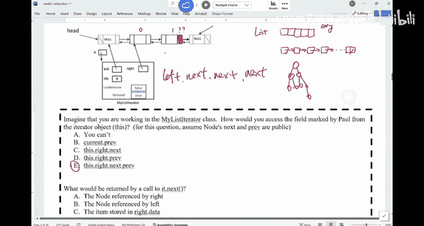

All right， yeah。This dot right， if you use this dot right。

 you say right dot next would refer to this variable。 dot next would refer to this variable。

 So you just need one less next。Do not confuse the value of the variable with the variable itself。

 Those are two different things。Okay。嗯。All right。So the next thing， if I have a call to dot next。

 if I have a call to dot next， this is the current state of the eerator。 I say dot next。

 this is a function call。What will be returned， Let me show you what next is supposed to。

 what next is supposed to do。 Let's go to the next。

This previous。

This is the description。Of next function call。 So if I call next， it returns the E。

 It returns the next element in the list and advances the cursor in the position。

 This method may be called repeatedly to eat through the list or intermix with cause to previous to go back and forth。

Okay， that's what it does。So if I'm calling dot next on this iterator。

What will be returned。

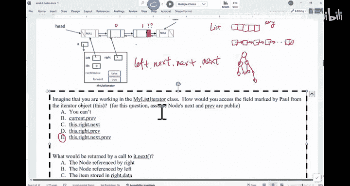

Both in， this one is tricky。 This one is tricky。 It's not hard。 It just， is's a tricky question。

 okay， so。

What would this eat dot next return。冇停。Just imagine if you have a iterator to start with。

 you keep calling next。 It's gonna allow you to go through the whole list。Okay。So right now。

 we are just as the very beginning of this。 If I call next， which one should be returned。

Which one should be a returned？I don't know。I think we are， we are just not fully awake in here。嗯。

A and C dominates here。 A And C dominates。If you look at it， A N C， right。

 more people are voting for A now。 More people are voting for a。Sa we soft the boat。

 And here we soft the boat。 Mo us saying oh it's gonna return the note reference by right。

 C is the item stored in the right。 Which one is correct。

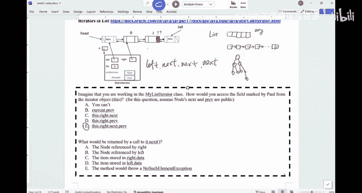

Look at the prototype。What is the return？Returns E。Is not node。 is the data in the node。

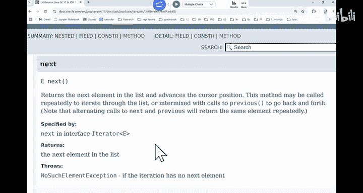

So when you do the iterator call to next， it's gonna return the item stored in the data。

Not the node。 You will never as a user， when you use the iter， you will never access the node。

 Youll just get your data back。Okay， so that's one thing that some of sometimes our students are confused say when you return。

 you don't return right， you turn， you return right dot data。That's what you supposed to return。

Are we good。

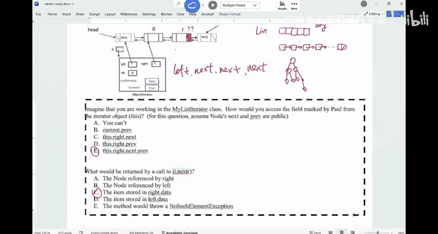

Just just this， this one is just， it's not hard， but a little bit tricky okay。

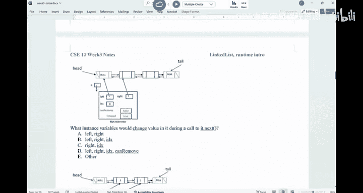

One last thing then we'll call today okay。This is the， the list。

 And I have this iterator hanging on it。If I call dot next from this eat dot next。

 what variables would be changed。Think about it。 What variable will be changed。

Once it can will be changed is， it's more like you have to assign somebody value to this variable。

 You have to assign somebody value to this variable。Oten。冇天嗯。Forward， indicate。

In the last moment of the iterator， did they move forward or did they move backward？

That's what For indicate。Alright， so the most popular true， no one voted for E。 No one voted for E。

 The most one of us voted for Y， so。Most us voted tea， right， So if I have， if I called next。

 we believe that。Left and right will be now move forward。Right， the index would be one。

Forward can remove is now true， right， because you called it next。 So now you can use it to remove。

How about forward in your next method， in in the next method。

 Do you have to say forward equal to true or not。In on next method。

 do you have to say forward equals the true。You should。 right， in other words。

 I say E forward should also be changing。 It used to be true。 still true。

 You have to write4 equals the true in there。Right， so everything has to be updated in here。

 not just those four。Right， so if you say I， I， I I know I have to change for， but it's true。

 So it stays as true。 That's why you didnt all for you。 That's fine。

 But when you're write next or previous， make sure you update forward。 Okay， update forward。

 We are done today。 We are done today。 I'll see you on Friday。 We have a worksheet for the。一头一头。

All right。

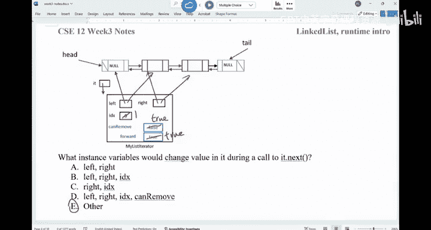

