# 010：CSE 12 - Basic Data Struct & OO Design - LE -A00- - Lecture 10.zh_en - GPT中英字幕课程资源 - BV1zJQHYcE8g

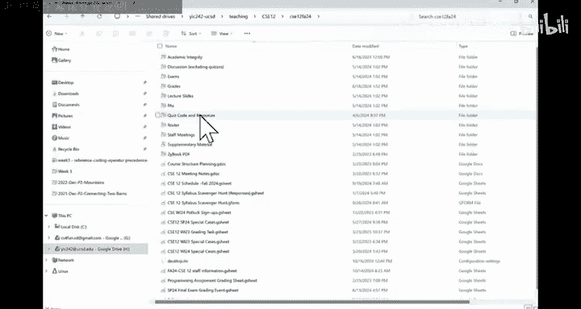

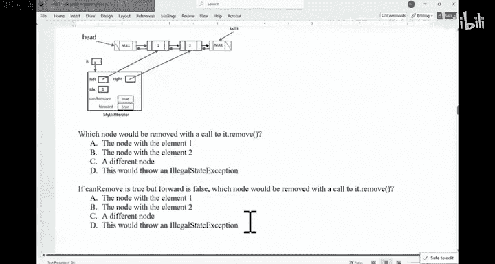

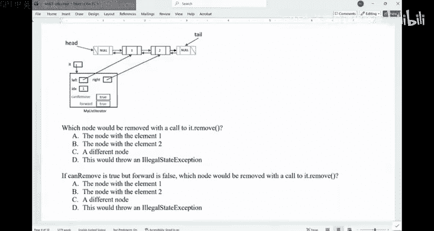

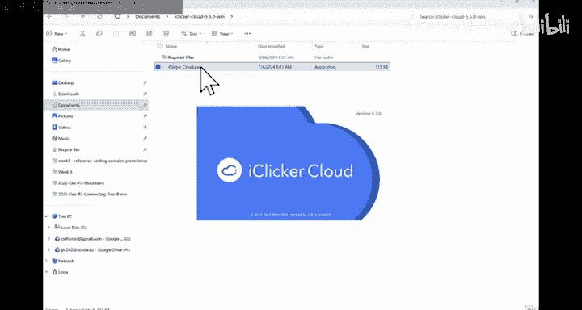

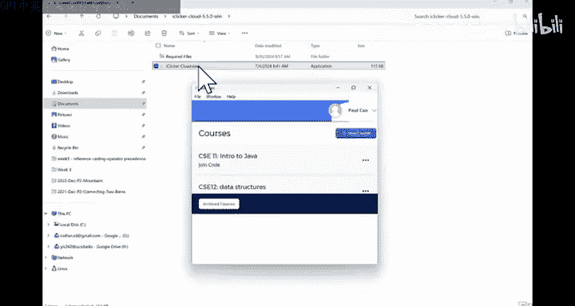

All right， Good morning。 Good morning，'s。Let's start here。Some may have lost a monkey。

And then in here， if that's yours。Here， All right。嗯。So this is Friday week3。

 right time just goes by really quick。嗯。So a reminder for this coming week， we have quiz 2。

 we have quiz 2， right， So week  four， we have quiz 2， week 5， we don't have any quiz。

 Big 5 is midterm week。 So there's no quiz to redo in week 5。 quiz redo will be in week 6。Okay， so。

In week five， we have our midterm。 So in about a week and a half， we have our midter。

 right just want to remind folks about it。

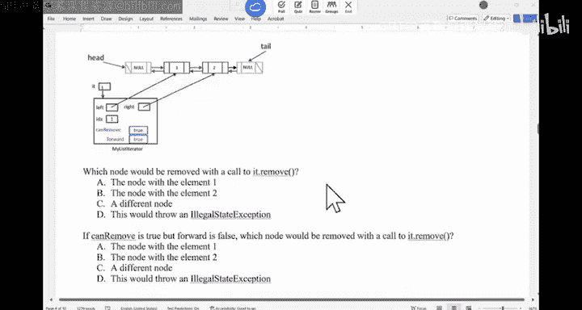

嗯。For quiz，2， we will cover everything about linkless， including iterers。

 But like the runtime that is in this note， we just， I don't think we'll be able to finish it。

 We'll see。 Okay， we'll see。So quiz2 won't cover runtime。 quiz won't cover runtime。

 You finish by the end of linked list and iters for for linked list。

Are there any questions before we start。Alright， so last time we were looking at the Es for a linked list。

I was running over。 and me find my status here。

If you think about the iterator for a list。

Right，The whole point of iterator is you supply a data structure。

To not to burden the users of your data structure， you provide this iterator so they can use this iterator to walk through your data structure。

That's what it does。 right， So the， the user of your iterator just called dot next。

 Then theyre gonna see the next data。 They're gonna see the next data。

So if you look at this is a doubleub link list。We have this data in here。 We have this data in here。

1 and 2。 So this is node 0。 This is node1。 and this is the iterator。 This is the iterator。

 So you have left is pointing to one node right is pointing to the node after it index。

 This index really doesn't mean much。Right， normally， you do not use this index to indicate。

If you call next or previous which node， you're gonna return。

 it's more about a location indicator for where this eerator is currently sitting at on this list。

You have kind remove and forward， kind remove is something you use to indicate if you can use the iterator to remove stuff。

Forward means did the iterator move from head to toe。Backward right so that's what it does。

Are there any questions about the idea for iterator here？

We have a couple exercises in here and then we'll do worksheet together， we'll do a worksheet。

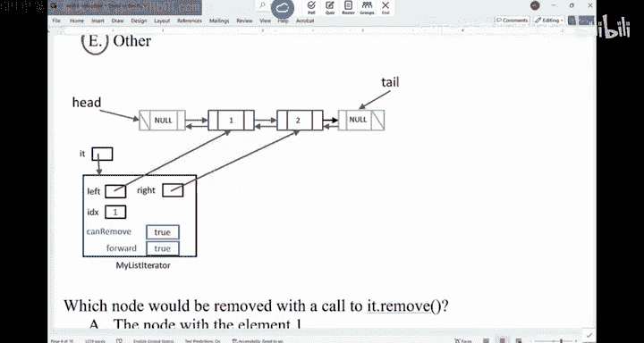

So。One thing we can use the E wrong is。We can change the list， right， Remove， add and replace。

 Remove is a trickier function。 Removeve is a trickier function。

 what I want to do is I want to remind folks。 you can look at the Java doc in here。 right。

 You can look at what remove does。 Just want to remind folks again。

 When you try to remove something from the list。 It's gonna。

 it's gonna remove the element returned by the the call of next or previous。

That's what will be removed。 That's what will be removed。 Okay。

 so if you are ever unsure about what the， the method does， go to the Java doc。 It's right there。

 And youre perfectly fine using the Java do。 this is totally allowed。Given that。What would you say。

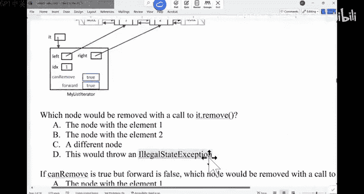

Will be removed if I call it do removed at this moment。If I do this。Frequency is AC。 Fr is AC。

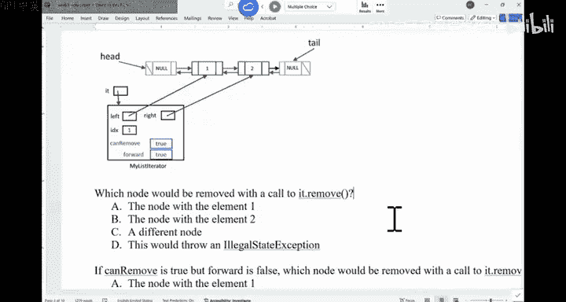

Which node would be removed？Or can we even remove something from here？

We totally disagree with each other。 If we look at the 60 some boats that came in。

 we have a tie between A and B。 So most of us believe it's gonna something will be deleted。

 We we are not sure which one。Can you have a discussion， please， Which element will be removed。

 Talk to the neighbor， explainplain your justification， right， this thing is gonna to be removed。

 why。All the othertters thing。Can you all hear some noise from there？Maybe it just me。Weird noise。

What would you say， Is it one or two。 Look at the description。

 Remove is going to remove the element that was returned by the next or previous call that we did。

So first， did we call previous or， did we call next， Can we even remove something。

Can we remove something。Should I vote for a D？I can remove something， right。

 It's because this kind remove is true。So I can never remove something。 Now。

 did I call previous or next before I call remove。Did I call previous or did I call next before I call this remove？

How do I know that？Because forward is true。 So I must have called next。Right。I must have called next。

 and I you figure out what it did next return。So what did next other words before this state my。

Itterator was， was like this。My reader was like this。Right， and then I call next。

 Now is's plenty over here。 When I call next， the thing over here will be returned。Which is what。

 So this is the thing。That will be removed。So in essence， what's gonna happen is。

The node with element 1 is removed。 And once this thing get cut out left。

 there will be plenty over here。And what else will also happen is can move will be false at that moment。

You cannot remove anything anymore。Any questions？Are we good on this one， Why this node is removed。

 so。3 steps。Currently move is true。 That means I can do if this thing is false， it's gonna be deep。

RightIf this is is true， I need to figure out， did I move the iterer forward or backward before。

We figured out this forward because forward is true。 And about them。

When I was calling this next method， what was the node that was used， That was returned。

 It was this thing。 So that's the thing that would delete。Are you good。About the next state。

If this thing is true， right， if this thing is true， but forward is false。

Everything else stays the same。 Which node will be deleted。

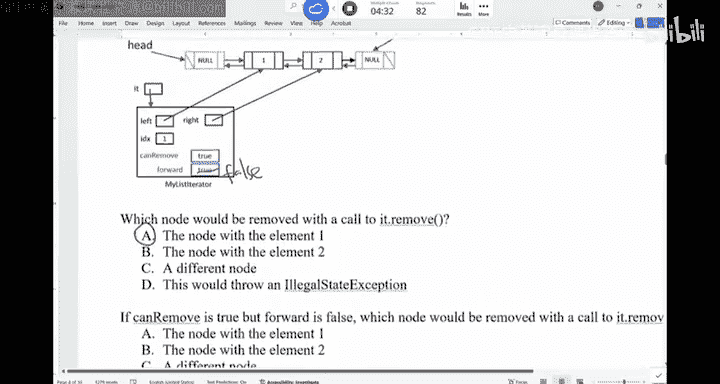

Its， in fact， the choices are still the same choices。 Okay， so both in and again。

What。Not will be removed now if this thing is false， you forward is false。

Or can we even remove at this moment， Still ABCD。Forlorward is false。Can remove still true。

 Left is pointing to node 1。 right is pointing to the node with data 2 index still 1。

Less than half of us voteded for the right answer。 Less than half。Okay。SoI don't know。

 This part may be confusing to folks。 Can， Can you talk to your neighbor， please， have a discussion。

 Have a discussion。What did you go for and why？You' are here for 15 minutes。

 it's better you make the best use of it。That's my advice。

It's not worth your time to just here for the participation point。 It's not worth it。

Your time is too valuable for that purpose。So， discuss。Why。Did you vote for？

The choice you' both need for。Move your chair if there is no one around you， okay。Move your chair。

Alright， so a lot of us said D， if you look at it。A lot of us voted over D。

That's the second most popular choice。 The answer is wrong。 You can still remove。

 You can still remove things。Its because can remove is true。 You can still remove things。

But this forward means four equals false means we just called previous。We just called the previous。

Right， so if you think of before I call previous this left will be pointing here。 right。

 it will be pointing over there。 And that's how the， the cursor moved as I call previous。

 When I call previous， this node was returned。That's a node we're gonna to delete。So。

This is what's going to happen。So we're going to remove node2。We're gonna remove note2。Ill be good。

So you can still remove things。This forward， just tell you in which you actually did the。

 the iterator crawl。And。The one before it cross that got returned is the one that you're gonna delete。

 Okay， so here's。Note。嗯。With element 2。

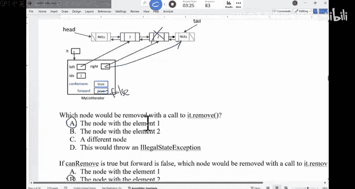

Are we good？

All right。Now， we have this worksheet， right。 So what I have is， I have。

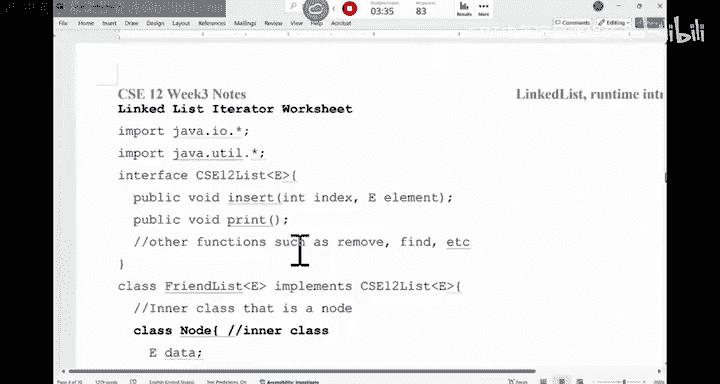

A few methods that we can implement。 If you need a worksheet， I still have a lot of copies in here。

So。What I want to do is I want to give folks a little bit of time。We want to implement in here。

 first。

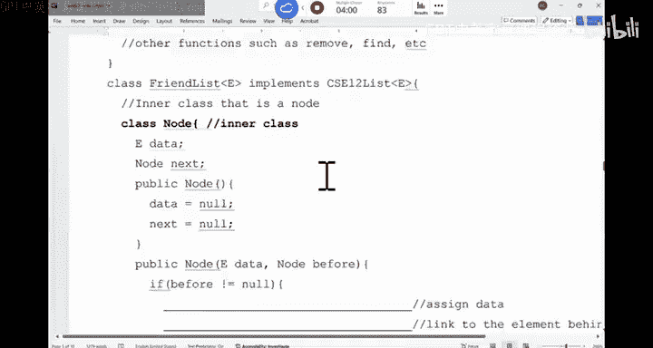

Some methods inside the node class。Okay， so the whole thing is。

 let me give you a big picture of this entire class。 The whole thing is a link list。

 So this is a link list。

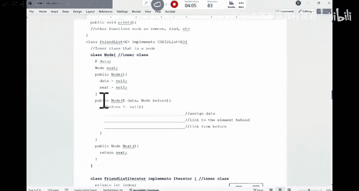

That implements this interface。 That implement this interface。Inside this link list。

 you have this inner class， which is the node class。

So what this node class does is just have a constructor。

 And this is the three things that we did before。 Okay。

 so this is a construct to link things together If you create a new node with this data。

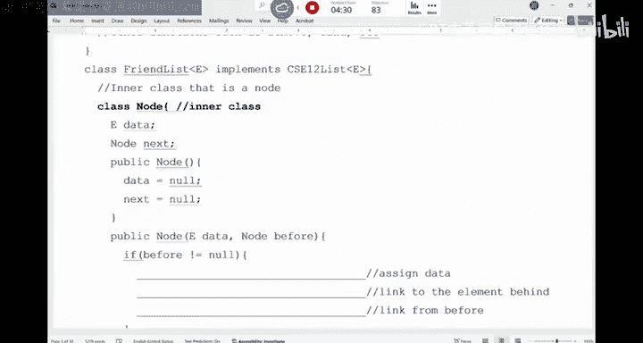

And then this next is a function call that would return next。

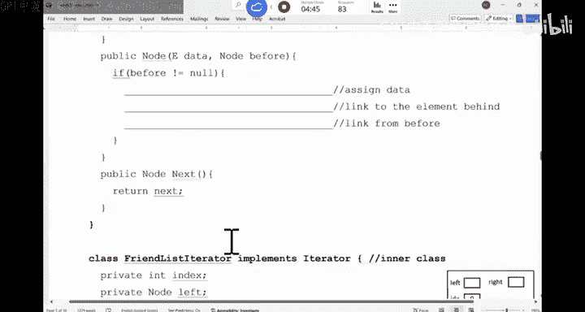

These two variables that by default package private， they didn't have any modifier。

 so they package private。The benefit of an inner class is。

Inner class would be able to access things from the outer class。

 Outer class can also access things in the inner class。So it's， it's like this。

 this node can only be used by the friend list， by the friend list。

Okay， so that's why we create something as the inner class。

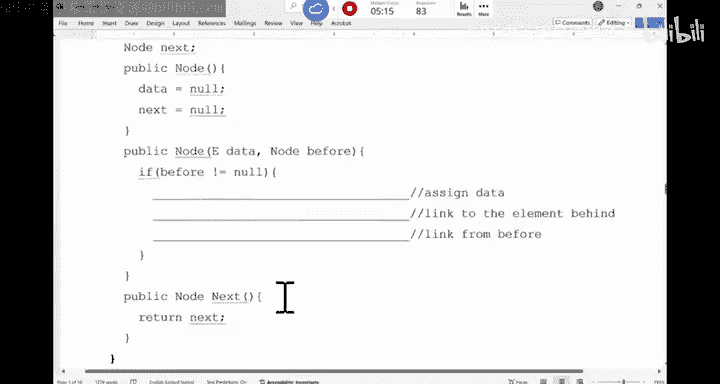

We also have this iterator that is an inner class。Of the list。

So this friend iterator implements This iterator has these things。 index Left， right can remove。

And have many other things。 This is a constructor。 This is what it looks like。And these。

Varables that are private。But although this， these variables that are private， the outer class。

 the list class can still directly access them because this is the inner class。Okay。

So that's the benefit of having the inner class。 So we have the constructor。

 We have the hash code and the sector。

So that's the inner class for the iterator。The last part is the list。So the list has a hat。

 has a tail， has a size。And this is a doubly link list。 Okay， so you can do a constructor。

You can do the insert。And then， print the whole list。

And this is to get to the iterator。

And this is the。The like the main method to use it。 Okay， so does this make sense。

 So have the big list class in the list class of a node of iterator。

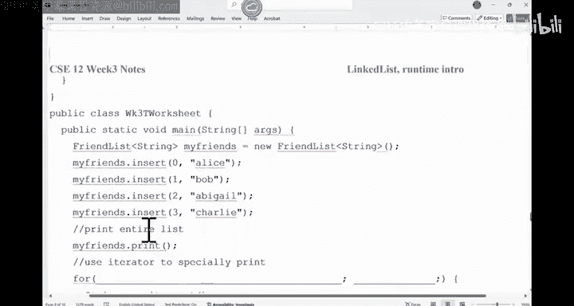

And then you have the methods of the list。

I want to give folks some time。 Can you finish the note first。

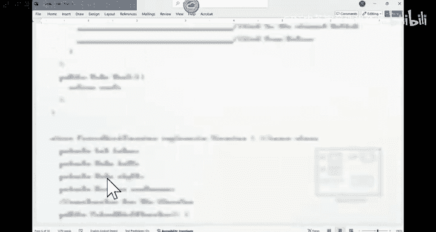

The node class。嗯。The note class。Given this node。Right it your， if you need a handout。

 there are a lot more。Sure。You should have quite a few。Try to finish this up。 And then。

You can vote in for any choice。 Just indicate you are done。So just three lines of code。

 I think one minute probably isn enough。嗯。Allright， so how about the。

The three statements you have a before， right， So visual before is pointing over here。

And you want to insert a new thing。Like this。Right， that's what we wanted to do。

 So this is what we need to do。So in this constructor。You should say， can I say data equals to data。

Will this work？No， right so do not should be distort data。Equals to data。And now。

 the first thing we have to do is we have to make this link。The link behind you before you。

 you cut it out。 So we have to say。Next。Equals to before dot next。And then。Before thought next。

Eals to this。Those are the three lines。To complete for the construct， Any questions。After doing this。

 the link is cut。 You inserted something in there。 And this would work if you are looking at the last node。

Are we good？All right。So we have two constructors， and this is just a gather to give me the next。系。

No。

Let's look at the iterator， right， We have this friend iterator。 Imagine you have a list。

 You have the head is pointing to a dummy node。This one is pointing。 So this is a dummy note， okay。

And this is another domin note that the tail is pointing to。That's kind of how you can realizeize it。

 And what I want to do is I want to initialize this。Itator object。

 whenever someone calls the get iterator is gonna return reference to a brand new object that I would position it in here。

That's what we should do。Okay。

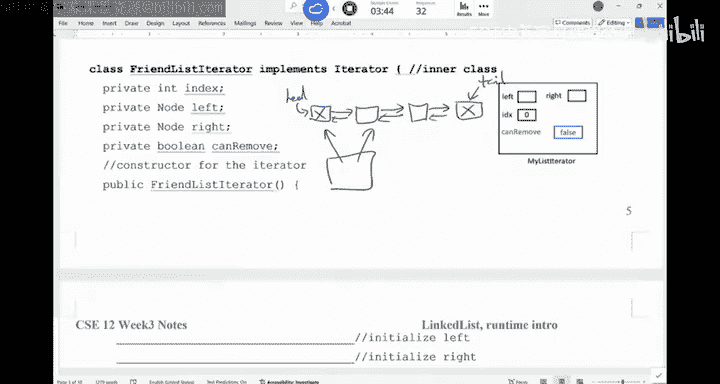

So， can you。Finish this constructor。Finish this one four lines， initialized left， initialize right。

 the index and can remove。I didn't put in forward。Marveable， but in the PA， you will。

 can you finish these four lines。Iitize left。In right， assuming we have domins。

 assuming we have domins。If you're done look at your neighbor's code， it should be identical。

Maybe there are some。Mars of how we created life， right。All right。So how should I initialize left。

 should should I say this。Left。E goeses to。Hat。Can I do this。Left equals head。

They're gonna be pointing to the same objects。 right， So head is pointing to this dummy node。

 I want my left to be pointing to the same dummin node。 So head equals to。Sorry。

 left equals the head。Not a left equals heads dota next。 Just be careful in here。 Okay。

 How about right。Right， simply equal to left top next。And I'm in here， you， you， you make sure you。

 you call the。So this thing has to be a method call， because inside the iterator。

 you cannot access the private variables of。The， the node。 So you have to do a dot next call。Gter。

 use the getter。Occessive。嗯。And then the next thing would be。Index。Index is star with 0。Can remove。

Should current be true or false in the beginning。Should be true or false。False， right。

 should be all false in here。 You can't remove。 You can only remove things after you do the next call。

 previous call。

Any questions？

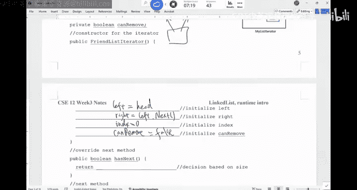

All right。Next thing。Has next。

And then we overwrite the next method。

So。Has next。Should be has next。Now。What should I do in here？

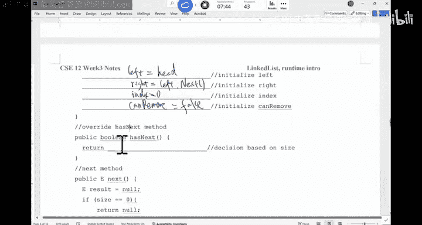

Ha's next。Can I move forward in here。

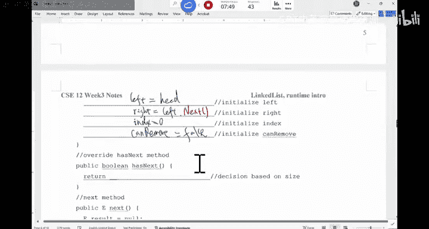

So he's going return boion。Think about the。Hining here， how do I write this thing。

You can make a decision based on the size。Inside the inner class， inside this iterator。

 you can access the size information of the list。The list has a size information in the inner class。

 you can use the private data of the outer class and vice versa。Okay。

 so how would you write to this one。Should be an easy comparison。You should be with。I D X。

So this one is called ID D X。 It's called index index。Index。Is it less than size or。

Should be less than or equal to。If they're the same， that's fine。That's the size marble you can use。

No。For the next method， this part is interesting。 Okay， So why try to move this cursor to the right。

This is a very weird way to implement the next method。 Okay， you， you are not gonna do it。

 But what I just want to show in here is you can implement the next method any way you want to。

It depends on how you want the user of your data structure to inspect the data。

 What I want to do is I only want to give give the user。 And this 1。

 I'm assuming is only working for a string。Okay， but mean obviously， as you can imagine。

 a regular generic linkedist iterator doesn't assume the list is always a string。

 So what I'm gonna do is I'm gonna say this next is gonna return the data。

 So I'm gonna say now assign now to data。 If size is 0， there's nothing。You need to move forward。

 And then we say。Right dot data， the data that the right is pointing to。 if it starts with letter A。

I would move right to point where。Okay， I say result equals to right dot data。 Otherwise。

 result will be now。 In other words， if you imagine you have a list of strings， when you call next。

 it's gonna return the next thing。 thats star letter A。That's what it does。Okay。

 so that's what I want to do。 So if you use my intor， you use next。

 you're only gonna be able to get the strings。 thats are with letter a。

And you can customize this any way you want to。 So you are the controller of this next method。 right。

 So now if this is what I want to do is I I， I assign my data。 if right dot next isn't now。

 I want to。Move to the next element。 Can you implement those four lines。

 How do I move an eaterator forward。How do I move a eaterator forward？

 There are four things you should do。What would you do。There should be four things。

You have to do when you。We either forward。And this right dot next doesn't now indicate that you can move it forward。

I we be able， we are gonna be able to finish this exercise really quick。What is。

 what are the steps in here， You should move left and right， both of them to the next thing， right。

 So I would say left。

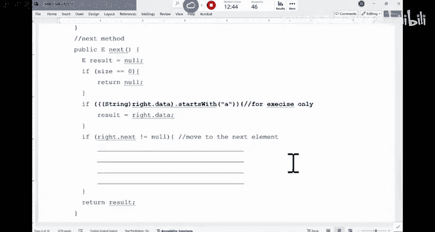

Equals to left， dot， next。Right。Equals to right。Dot next。And then。Anything else I need to change。

What else。Index， right， index， index， perfect。Index move by one， anything else。Can remove。

 Now is' true。 Now， you later on， if you have a remove method， you can remove things。You can remove。

Eals true， E we also have the forward variable forward should be said to be true。I'll be good。

So this is how you move the e eraer forward and backward。

嗯。

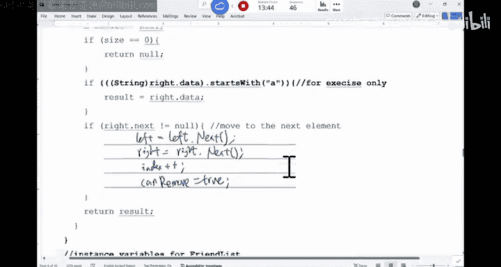

All right。No。Are there any questions for the， yeah。嗯。I think， for this one。Right，So the question is。

 should this be a function call， I personally think， I think this one， they are non nest inner class。

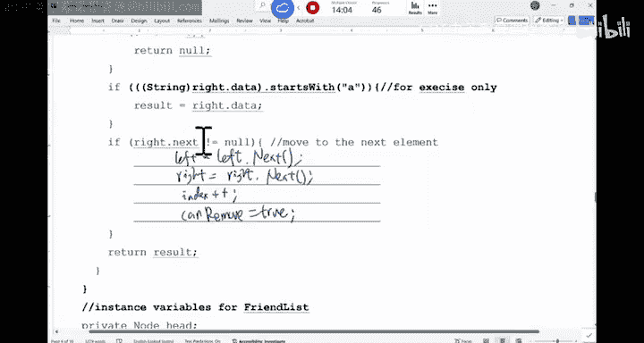

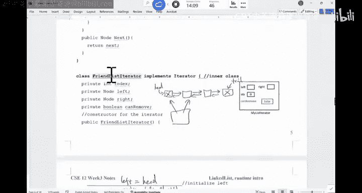

So this is the inner class。 This is node。I， I think you can still use the next directly。

 This is package private。 So if you make this private， then you you have to use a function call。

 But in here， I think it's safer。 Good habit。

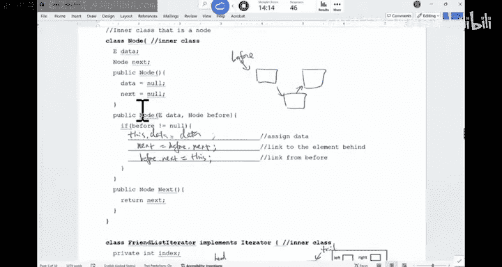

Car to like this。It's better。It's better。So the， the question was like。

 should I connect directly to access it， Because I think in the node class。

 those two things are packaged private in the friend list iterer。

 you can still directly to use the instance variables， but it's safer to call the function like this。

Any other questions。

Right， now let's look at the list。 So we just implemented to inner。

Class， now， this is the outer class。 the friend list。 you have a head。 You have a tail。

 You have a size。

So。Can you。Connect these， like。You have a head。 You have a tail。I want to。In here as a new node。No。

 right， this one， a new note。 I think this one is good enough。This would create a node in here。

This ones new note。Can you connect your two Sinels， You probably need two lines。 It's a。

It's a double reading list。Okay I'm gonna use the default constructor。So can you connect them。

What would you do。

YouYou need two lights。Let me change this a little bit。

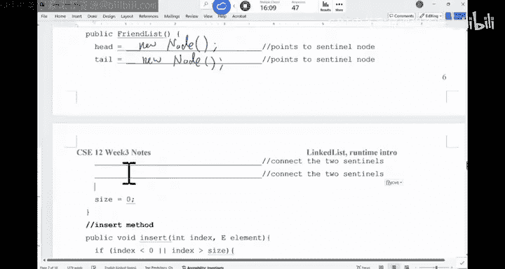

So you need two lines。How would you change it。

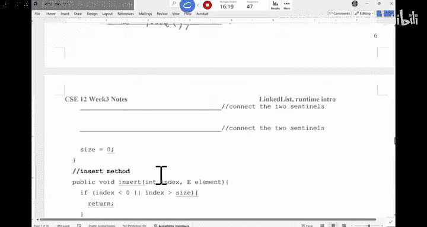

Remember， theres a previous， there's。

Whi。For each note， did we have is a singlely link list or double link。Oh， sorry， sorry。

The node class， I'm assuming is a singlely linked list。 although we have a tail。

Oh I remember why we're doing this， We just need one lie， okay。I should market。Need two lines。

 if it's doub。So if you only have one lie。

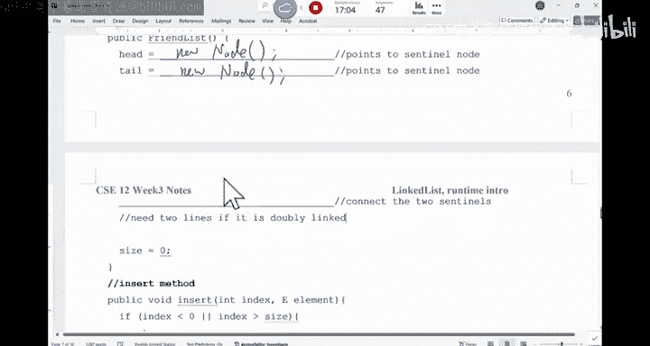

I kind of confused myself a derivative in there。啲。The node that we need to connect will be head dot next。

Equals to。해요。Right， that's what we need to do。 If it's a double link list。You have to say， tell。

Dot previous。Equals to head。That's what is needed， if it's doubly linked。

You can also call the other constructor。 You say tail equals a new node。Now comma had。

 that would also work。In the P 3。We are looking at the double reading list。Are we good。

All right， so。I mean， if it's a singlely linkless， really， there is no need for tail， but。

Just to practice。

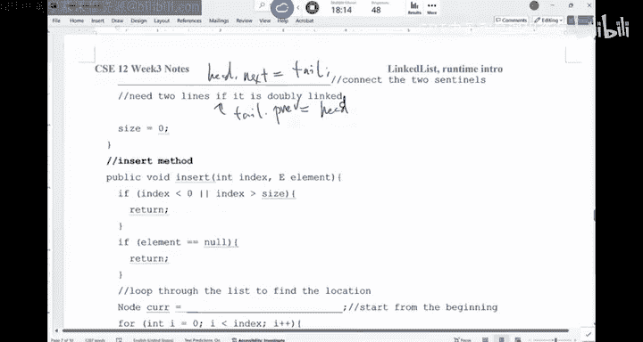

The insert method， I think we did the insert method。

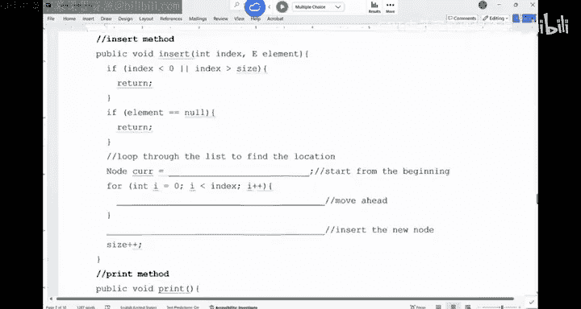

Right。So if we think about inserting the man inserting， say insert this element at this location。

If it's auto bounds return， if the element is now return。

 Now we'll loop through the list to find the location。 So we we did the add method。

 very similar like this。 So current equals to head。And then you move forward， right。

 So it's a current equals to current dot next。And then you insert the new node。 you say。

 just new node。The data element。And then， the previous node is current。That's what we have in here。

Any questions？think we have done this a couple of times。嗯。The last part， Okay， this print method， we。

 we didn't have to。

Implement the print method。 But I want you to utilize the print method when you write P 3。

 So when you write P 3， you're gonna realize as you try to build the list。

 your list may not be working。 In other words， it can't go forward。

 You made a wrong link or the list got cut in the middle incorrectly。

 The way that you should use this print method。 You can definitely change the print method to help you。

 iss just gonna print out the whole list。When you print out the list， you shouldn't just print out。

The the value in the list， you should also print out these references。

 meaning that if you have a node， right， So you say current equals to head。

 and then you grab the data from this is the next thing。 right move current forward。

If current isn't now， you're gonna look at current plus data plus the next thing that this current is pointing to。

 In essence， what you're gonna print out is when you print out a reference。

 you're gonna see the address that this current is pointing to。 You're gonna see， for example， F 5。

 F 7。Have。You have， like， for example， Paul。This is the data you have， and then you have F 5， F。

I don't know。 It's it's supposed to go up or go down depending。 So F F。Right。

So what this means is this is what currently is pointing to。 That's the address of the node that。

Contains this data Paul。 This is the next thing。That it points to。 So in the next row。

 what you're gonna see is F 5， F， F。This is C， E 12。And then you're gonna see F 7。F 8，0，0。

 for example。And then the next thing is the F 8，0，0 is pointing to now。 and this is now。

And that that looks right， right。 So the address that this node is pointing to。

 This is the next value should be the address of the next node。 In other words。

 they should be the same。These two things。They should be the same。If they're different， it means you。

 you， you made the wrong connection。So when you print out the list for debugging purpose。

 not only should you print out the data in there， you should just check。

 are the reference values matching。If there' no match， there is something wrong。OK。

Doesn't make sense， because I've seen students to say， I inserted Paul CS E 12 in there。

 but I see  two C S E 12， as I printed out。 What's going on， You have to print out the address。

The values of the reference。 And then you'll realize， oh， this， this link was wrong。Are we good？

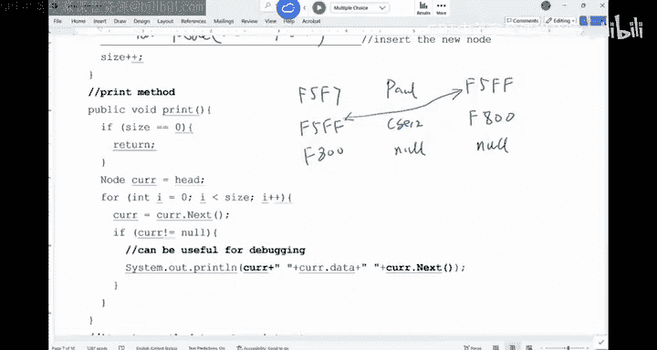

So this is the， the print method for debugging。 The last part is like， how do I even use the eerator。

 You have this eerator method。 So Eerator is gonna return this eerator。

 All you need to do is to say new。

Friend， what was the name of the iterator class。It should be。Friendless iterator。 New friend。L。

Itterator。You're just going to trigger the constructor。Of that iterator。

 And iss gonna return this iterator back to us。So in the list。

 you can trigger the eer to grab a eer back。

Any questions？So now in this worksheet， what we can do is let me create a friend list with type string and then insert a bunch of things out Bob Abigail Charlie。

 So these are the four people。

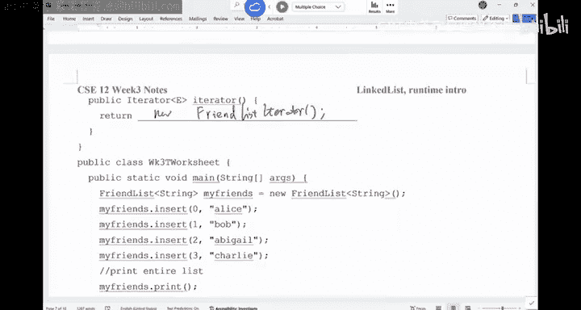

And then if you print， we' are supposed to see everything laid out properly。

And how do I use the iterator， You can use the iterator to do the followinging， You can say。

I need to grab iterator， and then I check the status。

So this dot next may return now， may return a string。 So long as that string start with letter a。

So if this thing is done now， I'm gonna print it out。 Can you fill in these two blackques。

 How do you use the iterator from the list。Look at the methods that come from the list。

Can you fill in these twoplans by yourself。Very similar， like how you're gonna use a scanner。

Are going use a scanner。How do you fill in these twoplex。Alright。

 so the first part is I need to grab a iterator。 right。 Remember。

 you are inside this main method Now， All you have is this my friendss list。 You have this thing。

So the first thing you should do is， you should say iterator。ITR。Eals 2。My friend。Dot iterator。

This one is gonna return iter for you。Right。And then the condition in here。

Its simply I T R dot heads next。You can definitely use a while loop to do it。

While we has something next， I'm gonna move on to the next。

 And this thing is gonna return value back。 I'm gonna print it up。

So your link list would provide the iterer for the user to user。Are there any preference。All right。

So we are done with link list。 We are done with the link list， O， so。We know how to build a list。

 We know how to。Create the E era。 their crawl on the list。Right， that's P 3 and P 4。

 So that's what we're gonna do。 Now we have five minutes。 I want to get started with runtime。 Okay。

 I would say if you say I took C S C 12， what are the most important things I should get out from C S C 12。

 I would rank this to be number one。

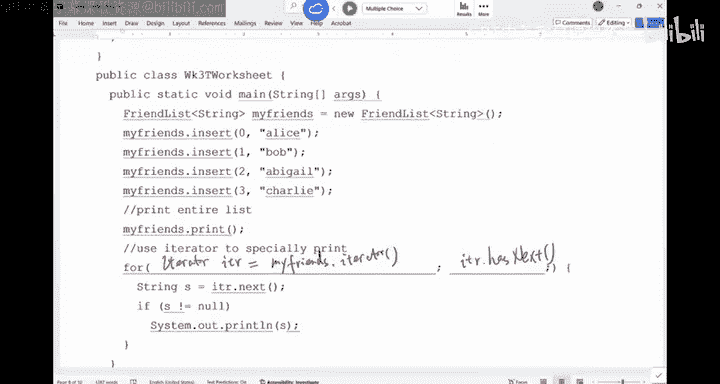

Okay， so it's just， it's not，s not， it's not something that is hard。

What youll realize is this is just a different way to think， because in reality。

 everything has a physical constraint。And in here， we're looking at mostly the time constraint。

You have to start to think the codeial right can't just be corrected。If you say the code is correct。

 I'm good。 That's wrong。 That's wrong。 Your code must be efficient。 It must be efficient。 Okay。

 so that's kind when we look at runtime。 So if you at runtime。

 runtime analysis includes the approaches that C， S people compare different ideas。Okay。

 so if you do it in this way， how long does it take， roughly speaking。So。

When you try to compare ideas that in general， two ways， you can do it。 First way is benchmarking。

 benchmarkch means， okay， you have this idea。 Let's implement this idea using Java。 for example。

 And then I will set up a clock and just time your code。 How long does it take for you to finish。

That's kind of one idea called benchmarking。So you curl things up。For example。

 if you say I want to implement the list using array array， or should I use。like a linkless。

 I use a rare。 Should I use a linkless。 Just do it in Java and then you， you， you compare。

 right This is the ultimate。Kind of test， right， This is ultimate test。

What are the pro and Kong of this approach， if you do this。I say， let's code it up。 I have this idea。

 You have the other idea。 Let's code it up and compare。 What's the problem with this approach。Anyone。

嗯。啊。Ts a long time， we have to code it up。wish you may take a day or two， but it will take some time。

 Anything else。 So it takes time。We can't get it right away， Anything else。有。The amount of time。Okay。

 so the input might be different。 The machines might be different， right。

 So there are the like variations。The machines that you run the code on。

 If you run it on a server compared in my laptop， server is gonna take shorter period of time。

 as well as input。Right。Any other variations we may have to control。Programmer， right， So us， human。

The code that I wrote compared with a person who is a software engineer for 30 years。Pbies。

Their code is probably a little bit better than mine。 if they know the details of the machine。

 and some of us can write better code than the others。 right， So the programmer， the human factor。

 is also there。 In other words， there are many factors you have to control。So benchmarking。

 is it not important。 We don't do benchmarking in CS C 12。But it is very， very， very。

 very important because this is the only way to tell。 no matter how good your idea is。

 if you can't prove that when we do benchmarking， your idea would work， nobody would use the idea。

 In other words， you must。 This is the real thing。 So this is very important。

I do not want you to underestimate the importance of benchmarking。It is very important。

 It probably is more important than the approach we use in here。 but there are just many factors。

 For example， some of you will do research in C， S。 If you have this idea。

 I think this idea would improve。 Not only do you have to do the analysis like what we do in C SD 12。

 you also have to benchmark your code against the state of the art。In other words， state of art。

 if I'm trying to say， I can render image better， you'd better prove it。

 There are certain libraries that you can just say， oh call the library state of art。

 and they would render image。 I would use my code to do the same thing on the same image on the same machine and my code beat theirs。

You have to prove it。 So benchmarking is very important， okay。

But it just has many factors to control。 What we do in C S C 12 is more like a theoretical analysis。

 And that's something I guess we have to look at on Friday。 as are now on Friday。

 today is Friday on Monday next week。 Okay， so we， well resume from here on Monday， okay。

We are done today。 We are done today。 Enjoyy your weekend。

Last year I was spending my homework for PA2。My hope that do。Just like totally aired and I got milk。

A0， basically， but that's okay because I can just get those points back to the recent。

You get 50% with the points back， not the whole point。Yeah。

 I like my main issue was I had this capacity in that there。

