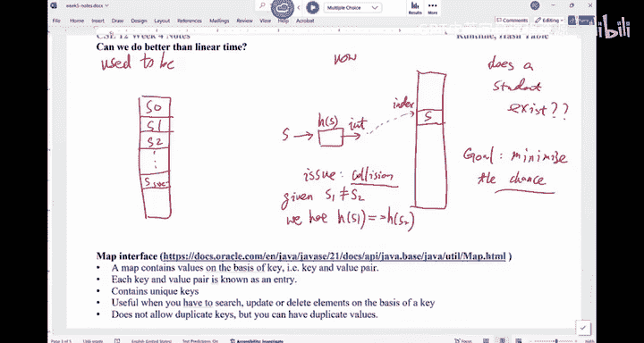

# 014：CSE 12 - Basic Data Struct & OO Design - LE -A00- - Lecture 14.zh_en - GPT中英字幕课程资源 - BV1zJQHYcE8g

Arry for the delay， we do have。The note from last week。So that's the note we're gonna use today， too。

 Okay， for this week。 So we are， we are a little bit behind。

 If you need a copy of the note from last week， it's all in here。So week 4 and 5。

 we're gonna use the same note。 So if you have the old notes， it should be good。Let's。

Let's get started， right， So a reminder， we have our midter here。On Wednesday during the class time。

 during the class time。 Okay， so if you need。Well， if you need。

 So I finished designing the midter over the weekend。 So we are looking at。

Some multiple choice questions， and there will be two coding questions。

 There will be two coding questions。 And I can tell you those coding questions are from the P S。

So make sure you understand everything you have written from the P。

You do not have to memorize those details of the， like give us you the write a method。

You don't have to worry about。 do I have to memorize what that method does。 You can。Youre actually。

 I will give you the， the description of the method。 Okay。

 so that's not something you have to worry about。嗯。It will stop at runtime， including runtime。

 Runtime may appear in the meantime term。Are there any questions。

There will be some actual credit for the midter。 So the， the total， if you tall。

 the total number points。I think it's like。I can't remember the exact number。

 I don't to give you the wrong information， but about。5 to 7% is extra credit。 In other words。

 for example， if I say this exam is worth 100 points。

 if add up all the points together and you only need 95 points to to give you 100%。 In other words。

 there's a 5% extra credit。 if I say what if I get 100%。

 then that extra5 points will be extra credit for all the other things。

 like it will be factored into your overall grade。Okay， so that's how the mid term would go。

 It just sometimes people make small mistakes here or there and then。

Those extra qualities for that purpose。If there are no questions， we'll get started in here。

Are there any questions about midter Wednesday？The answers to the mock test。

 we don't have answers for them。 So try to come up with yourself。 Again， the multiple。

 I think the on the， the questions from canvasas， there were nearly all multiple choice。

 But this quarter， we're gonna have coding questions。 we're gonna have coding questions。

 I want to make sure that you are aware of that。Any other questions for the meantimeterm。

Our T A tomorrow， he will do the midter review， just do practice just do practice。And so E you I。

 I have some questions about a certain problem from the past Meterm。Feel free to ask at that moment。

All right。Then now let's， let's get started in here。

I think we are done with a majority of these exercises。If I remember it correctly。

We are done with problem C in here。 We didn't do D。 Am I right。

Because I think the two sections are little bit off sequence at this moment。Did we problem。

 did we do problem D last week， if we look here a note。We didn't， right， if I remember。 So for C。

 this one was a little bit tricky， right， So this one is not a logan。 This one is。Ver。

 this one is venneyer。呃。I mean就是。I think this was the last question we were looking at。

Before the class is over。 So we will rushing a little bit。 If you look at something like this。

 the outer loop is definitely gonna run log n times。

 The outer loop is gonna run log in times the inner loop。

 every time the loop runs is gonna run I times right。

 So you're thinking about what are the values I as you go through the。The。

 the the outer looping here， I would be n n or 2， n or 4 and go on。 So because of mathematically。

 there's this sequence。 I think one if you ask this question。So it's basically the first round is N。

And then the second round is NDI by2， the NDI by 4。So it's。

 if you factor out and it's one plus a half plus a quarter plus8 and go on。

And this whole sequence add up is less than equal to 2。Right， because because of the math。

 because one good visualization is if you think about if you ignore this one， it just a half。

 which is distinct plus a quarter， which is this plus1，8， which is distinct plus 1，16th。

 as you can see， you just keep adding in something to this unit square in the。

 you are never gonna fill in this hope square， because you are always missing something in there。

 So overall， this thing is less than equal to 1。 This thing is less than equal to one。

 You add one to it， is less than equal to 2。So that's just math。嗯。

If it then how how do I have some sort of n log And if you change this I into N。

Then you are looking at N log。Because the outer loop would run log n times。

 The inner loop would run n times every time it goes。 So that would give you an log。

Are there any preference？For this。Yeah。Yes。Evo， equal to integer division。

 So it's basically log base to。It's the ceiling of blockway to。Any other questions？Alright。

 so that's problem C。 How about problem D， Can you take a look at this one。

 What I'm interested in is what's the run time of this whole code， Okay， I'll give you a few choices。

We are looking at tide bound。What would you say the answer to this one is。不能。And the class。Start。

And you all see the。The world。Try。I'm having a no base error。 Can you。

 Can you all connect to the base。You come， right， So give me one second。

Sometimestime I just have to restart this thing。I'm seeing a no base error。I think now it's working。

Can you all see the base now。Thank you。5天。What would you say， the answer is for this。

Whole piece of code， not just like， not just this part， but the whole thing， right。What do you say。

 the runtime is for this one。We are looking at the overall runtime。O， the O R run time。

We have a tie between two choices。No， it's no longer a kind anymore。

I think we are doing better than T in here。Or stop the vote。 or stop the vote， okay。So， the answer。

To this one should be C， N square Its n square， but it n square。

 because this loop would run n times for there are quite a few us voted for a。 This is a linear loop。

 That's correct。But remember， this fool， this function call， sometimes when you call function。

 the function call hides a lot of complexity。You really have to figure out what is going on in that function。

 So in this function， we are doing I steps， depending on what I is。

 So we can kind of copy in this part over there as the， the full function call。

 You gonna see it a nest for loop。So the answer should be C in here。

 So this thing is complexity of a function。 Just be careful。It's。

 it's not like we have a single layer of loop， and it's always。Just linear， that's not the case。

Are there any questions about runtime。At this moment， we are done with runtime。

This function would run whatever I is。Right， so if I is 0。

 this function would run just like constant time。 If it's one is gonna run one time if I is2 is twice。

 depending what I is。 and this I goes from 0 to n。 So its that that's why we just adding up the first I element in the array。

就是 like。Before， right。So， if we look at。I don't have that note in here， but。If you look at。

This thing。I'm pretty sure you all remember that part， week four。This thing。If you。

 if you all look at this runtime。你 hear。If you look at this code on a link list， right。

 we are just calling get。Right， so this one， in fact， is hiding the， the the loop in there。

 So although this thing looks like a linear thing， but it's not。 it's a quadratic。

 So it's very similar， like what we did in this exercise。Are you good。

 Any other questions about runtime。All right。So we'll move on。 Okay， we'll move on。Now， the。The。

 the next topic we're gonna to cover is。Hash table， hash table， O， or hashing technique。嗯。

A quick review of what we have learned so far。 We learned about aures。 We learn about linkless。

 We learn about iterators。 right， So those are the three things we have learned so far。

 And this is the fourth thing。This hashing is hash table is a data structure。 Hashing is a technique。

 Hashing is a technique。 It has many good usage。 Okay。

 so what we're gonna do is we're gonna learn about the idea of hashing today。

 and then we talk about collision resolution strategy。So， let me give you the the， the look ahead。

 right， What is hashing， Hashing is a fast way for you to do dictionary operations。In other words。

 you say I need to find something quick。 I need to insert something quick。

 I need to delete something quick。If that's what you need to do， you can do hashing。

Hshing doesn't give you many other things like sorting。

 You which one is the largest data in my dataset。 Haing doesn't help you with that。Okay。

 so a lot of time people say h is so good， but it has its own limitations。 That's one of them。

 It doesn't give you any order information。But it， it's a very simple yet effective strategy。

 So here， here' is one example。There's this classic problem called two sum。 Okay。

 two sum problem is you're given array A as N things。D array is un sorted。

And you know that inside the array。The data can range from  one to 1 medium。What I want to do is。

I want to find out all the pairs of。Data in this array that adds up equals to T。

 So you also given T given a array given T。So these two are given。哎。So you know what he is。

 you know what the DRA is。And our job is to figure out how many of the elements add up equals to T。

Of this first method。Which is some sort of looping structure in here。And I have this very strange。

Second method。And which approach do you think is faster asymptotically。

Asymptically means the big analysis， tied bound。What would you say in here。Let's do a boat。 Okay。

 we did it carefully。I'll give you some time in here。 No need to rush。What is the。

Especially in method of 2， right。What does it even do in there。Which one is faster asymettically。

Can we have a quick discussion， please。 What is the runtime for the first one。

 What is the runtime for the second method。You can move the chairs。 Now。

 I think the midter for the other sections is。 So if you need to talk to your neighbor。

Move your chair。 And we have a quick discussion。 What What did you vote for and mind。

 What's the runtime of the first one。What's the runtime of the second method in here？Asymptootic。

I'm not assisting here。What's the runtime of the first one， the second one？

it was the runtime of the first method。Its big all what。The linear ca。

Is the first one linear or is it quadratic。Cretic， right， It is quaratic because of nasty photo loop。

Big n square， depending on what n is。 If n is small enough。That's good。 But its big。

 N square is gonna be very bad。 How about the second thing， right， let me ex。

 So the first thing is you just eat it through all the pairs， the older the pairs， AI with AJ。

 if they are the same， you get it in here， right。The second approach is。Is like this。

 You created this huge booting table。That equals everything is false to start with。

This one has a million one elements。 Why do I have a mini one elements in here。

That's a range of data you may have。 In other words， I have this mini1 element in here。

 And what I'm trying to do is。0， all the way to。Meeting。Right。And then go through this thing。

 Everything is false to start with。 But as a hash table， AI equals to 2。 I'm using AI as the index。

 I'm using AI as the index into this table。 So if， for example， my array has。If my A is。1，3。

 and a meeting。Then element 1 would be true。0 is false。2 is false。3 is true， and this thing is true。

Everything else is false。That's how DNA will be assigned with its values。Right。

 and then I go through this thing。If has shape T minus AI equals to2， we are given T。

 T minus AI means。What is the difference between T and A， In other words。

 do I have another element in the array where I have。Whose value is T minus AI。In other words。

 if that element add AI should equal to T。If T is 10，m sorry， like if T is 10，10-1 is 9。

 So do I have a。Do I have 9 in here as true， If theres a 9 is true in there， it means I found a pair。

So that's kind of what we have We restore this pair。

 So it's slightly different from the first approach。

 But this one won't give you the order pair with just two pairs。嗯。What's the runtime of this thing。

 If you look at it。What's the runtime of this first for loop。What's run time of this thing。

Is it linear or is it cardiacinetic， A is linear Bs。And square， what would you say in here。

And we have a vote on this one。 Is this a linear。Loop or no。Is this a linear loop。Only see one mode。

 I think the。The network is pretty bad。U saysD protected。嗯。I don't think the balls are coming in。

 I'm gonna。Give up on this vote。 The answer is。Linear， right， This is linear。

 So should be a linear choice。 So although I'm using AI as the index， I'm just given I。

 It takes constant time to get AI。 given AI， it takes constant time to use this table。Right。

 so this whole thing is a constant time。 and I do constant time。Operation n times， that's linear。

For this thing。It also linear there。So the whole thing is linear time。

If you compare these two approaches， the second approach definitely works。Right。

But there is a problem。 What's the problem with this。Is this huge table。 It's this huge table。

 This hash table has to be big in order for me to accommodate all potential values in this array。

 That is like between 0 and 1 million。 But if I give you an integer array。

 anything can be like up to 2 billion。 I'm gonna be in trouble。 right。

 because a lot of times your program doesn't even have that much memory。

So this table is going be problematic， so。Metter 2 is faster。

 The takeaway message from this one is number one。You can use。Space。For time。

RightSo you can sacrifice some space to speed up things。This is， so this。

 this is kind of pretty interesting idea in here。 right， So there's in in C， S。

 there's this thing called time space trade off。 If you say I have a lot of space， a lot of time。

 you can use that space to fight for time， right， to improve your time。

If you say I don't care too much about my runtime， but I really， Im limited on space。

 then you can kind of sacrifice a little bit time to save space。Either way is fine。 Okay。

 so space for time。 that that's another， that's the first thing。

 Another thing is the space constraint。The space constraint is also something you have to be very careful。

 And you don't have unlimited amount of memory in general。In our CS SE 11， CS S E 12 class。

 we didn't say， you have to watch out for your memory。 But in reality。

 you do have a constraint on the memory。 So you always have to keep that in mind。Questions。

But we did improve from n squared to。To， okay。Now， let， let me give you。Another example。

Why do I keep moving this？out。So supposed at USD， we have this student record system。

 which is called Web rack。 right， So given a student。

 we can figure out information from that student。So， for example， I have a student。

 each student have a P I D， have a GP with a construct。

 And this is how I compared if two students are equal。

And this is how you should overrite the equals method when you write a class。Okay。

 so just want to kind of go over this。 This is a review in C S C11。 We should have seen this。

So the first thing is you must take an object reference。 Okay， so if this thing is now。

 then just false。But because this is object， you really， because this all can point to anything。

 You have to be careful。 What does this O point to。

 So old doubt get class would tell you what's the type of the object O is pointing to。

To get class would tell you the class of the object always pointing to if it is the same as student。

You sorry if they' are different。 So if the always pointing to a string and I'm writing this inside student。

 if they' are different， then return false。You cannot compare student with a string。 For example。

 So this is the class comparison。 After this step， you know that O is pointing to a student object and you do a typecast。

 typecast O into a student， and then you compare their data。

And decide whether it they are the same or not。This is normally the best way for you to overload the equals method。

 Okay， not only should you overrite equals method for every class you write。

 you should also override the method for。2 string， as well as hash code， okay。嗯。Any questions。

For this es method。Two steps。 now check， class check。Then type cost comparative。Okay。

Alway tell my students sometimes people from the industry tells me that once they interview a student。

 a new graduate， a lot of， a lot of time the student can't even say they overrite the equals method correctly。

That was one of the things they find to be very。Discouraging。

I hope you all would be able to do this here。 That's the right way to do it。Now， for， for this one。

 I have a student record that would create a re list of students。Okay。

 so we have the capacity of the array。 We have the size。 And then I want to search for something。

 I want to search for a certain student。This is what we have。 So search for a student。

This is the key I'm looking for。 I'm going through the array to try to see if they are the same。

 if they're the same or return to otherwise a return false。That's my record system。

Just have the arrayius of students。二孙子。No。My question would。What will affect。

How fast I can find something in here。What are the factors that would impact the speed of this thing。

A lot of us said a combination of the factors above， that's the most popular choice。

Can you have a discussion with your neighbor， What are the factors。Or just a combination of them。

Which ones were the impact。I it all ABC or just part of it。What would impact。The search method。

What would impact the search method？Have a quick discussion。 So you are staying awake。

 This room is very stuffy。 You know， it's very easy to fall asleep。嗯。Alright， so let's look at it。

 Does it depend on the capacity of the array。Does it depend on the capacity of the array。5디 say。

With our understanding of the， the difference between capacity and。Size。Capacities like what。

 I think I just read some news。 U T has surpassed U C Berkeley with the number of students we have。

We have 45000 undergrads。 Is that right。You don't know。 I don't know either。

 But the idea is like size is like 4500。 That's how many season we have now。

 I don't know the capacity。 What perdue have in mind。 Maybe he's think about 80000 as the capacity。

I don't know。 Don't quote him on it。 But whatever that capacity is going to be bigger than 45000。

Right， so would the capacity affect how much I would search。No， I mean， it's。

 it's gonna probably in the future。 It's gonna affect someone。 But as of now。

 this one just rely on the sides。How many students we have on campus。 So that 45000 is the。

 the thing。 So it will depend on the size， not the capacity。

 Does it depend on where the element is on the list。It depends， right。

 So if I'm looking for this key in the worst case scenario。

 I'm looking for a student that that doesn't exist in USD Roer。 that's possible。

 but it really depends on where the student is。 So this is another thing。

 So I would say those are the two factors that would impact。 right， But it。

 it's like this thing is linear。So if we size， whatever size is， that's the size。In the worst case。

Right， the question is， can we do better than linear。Can we do better than linear time。

 If I want to look for someone in the roster。The answer is。We can do better than linear time。

 in general。So how do we do it， The idea is， is the forering。You can say， I have a real list。

Of students， right， you say I have aius of students， and I go through the arrays， look for them。

Right， and we have implement as。 You know， all students are next to each other in this a。

But we're gonna change the idea of a little bit。 Okay， we are not gonna have a regular。

 like one student after another used to be。 Let mean， let me write it out in here。

 used to be like this。This is student 0， student 1， student 2， all the way to。Student size，-1。

So they are next to each other in this and I。 I'm scanning through the whole thing to look for a certain student。

This is what it used to be， now。We can try to change it a little bit。

 I still have an array of students。 I still have array of students。

But I'm not gonna let the students sit next to each other in this array。What I would do is。

 if you give me a student。Right。And I would first convert this student into an integer。

 I would convert this student into integer。 How do I convert some something into an integer。

 There are many ways。 It's called a hash function。 Well learn that in a little bit。

 But say whatever the data is， I convert it into integer。So you go through this process。

 This one will take。A a student and sp out an int。That's what it is。Whatever the data is。

 I will convert into an integer， and this integer now would be used as the index。Into this table。

That's the difference between what we used to do。And what are we gonna try to do now。Okay。

What's the benefit of this thing， right。It looks like you are making things uncessarily complicated。

 right。 So you you instead putting the student directly into this array， I'm hashing it。

 This is the hash function。 I'm hashing it into an integer。The benefit is the following。 Now。

 if I say， do you have this student。Does a student exist。

What should I do if I say I give you a student a look look up in your table to to find out if this student exists。

The easiest way is， you give me a student。I hash that student。And I will end up with the integer。

 This function is deterministic。This function is deterministic。 In other words， giving。

 given the same student is gonna hatch into the same integer。That's， that's definitely the case。

 So give a student a hash it。 I will only need to go to that spot to check。If that student is there。

 if that student is there， it exists。 if it doesn't， no。That's the idea。That's the idea。So。

If you think about the， the time cost， I don't have to go through this whole array anymore。

 I check one spot in the array。That's， that's the， the， the idea of hashing。

 There are many things that we， we haven't considered， but。嗯。Any questions about hashing。

 So data converting into integer， whatever that the integer is。

 will be serving as the index into this array。What's the biggest issue with this idea？Why do we。

 Why do people have names。IThink about each of us is human name， no matter what culture you are in。

Everyone knows when we were born about given the name。喂hy。That's our identifier。 right。

 We hope the name is unique to a person。 why I call someone by their name。 first name， last name。

 we hope is's unique， but we know it's not unique。 right， There are many people with the same name。

ForOne thing is because we have a lot of people in this world。 now， right maybe in older days， there。

 there weren't too many people。 So there was no condition of the names。

 But nowadays definitely there are a lot people with the same name。Right， so in other words。

 it's possible to students that are totally two different students and they hash them。

 They end up with the same integer。That's called collision， so。The issue with this idea is creation。

Cleaia means。基文。S 1 doesn't equals S 2。We have。Hash of S 1 is the same as hash of S 2。

2 different students， but their hash values are exactly the same。 We say there is a collision。

 We say there is a collision。系。Does this make sense。Does happen often。

It happens more often than we have hoped for。O。嗯。I was reading some of the feedbacks from past students Mu we talkba Haing。

 what students like， what they don't like。In fact， a couple students mentioned that we did this in class exercise。

During the discussion of fashioning， I think we can do it， too。Here， yeah。

 so what I want to do is I want to do a quick， quick kind of demo of how often collisions happen。

It's called the， the birthday paradox。 Some of you may have heard about it， right。

 So the idea goes like this。We have。We have 10 minutes。 We， We can't afford it。

So the idea goes like this。 If we are looking at people， right， we have everyone in here。

 We don't know each other。 We are looking at our birthday， so。This one is the days。 So1。

 all the way 2 31。 So we have the days， right。And then we have the January。February。All the way to。

March， what I want to do is I will pull people for their birthday。And if we think about it。

 our hash function。I will has a student to their birthday。Birthday， you can express as an in teacher。

 That's what Ive given a student， a hired student into a birthday。😊。

RightIt looks like it's gonna be random enough。 right It's gonna be random enough。

 but that's not always the case。 So let， let me write it in here。 So we have January。February。March。

If I can still type the month， June， July。No。July August。September。October， November， December， Okay。

 so I would start to ask people for their birthday。You just need to tell， tell me the month and day。

 Okay， I will market。 How many people do we have in this room， We have about 90 some people。Right。

 start from that side and we'll ask people for your birthday。 Just tell me the month and the day。

A from you。May 3。Some of him， oh， it's very close to my birthday， right。You know what。

I think I may have to May 3。Or just marketing here。 Okay， if there' is any on the first day。

 I will ignore it for now。Yeah。June 22。June 22。All right， next one。September 27。

Make it a little bit smarter。Anything else up。June 18。We're gonna stop once we see a collision。

 So let's hope we have a collision before the class ends。July 12。You he's pretty far away， right？

May 4th。Ros sir。有。啊，sorry。October 27。You just had their birthday。Yeah happy birthday。All right。嗯。

Sorry。都系。December 9。December 9。Sorry。😔，February 7，7 or 17。17。Alright， so。February 17。June 28。

All right， go ahead。August 21。 August 21。This is a hash of student to birthday， right。July 6。July 6。

啊。November 28。Right。April 23。Sorry， that's me。April 23。October 15。October 20。Yeah。July 8。

We are looking about 20 some students now， right。December 26。All right。December 20。14。Summer 14。

Juriary 28。Allright。March 5。March 5。All right。20th of October。do we have a collision now。

20 of October， if you look at it， I think we already have x in there。So finally， we。

 we see a collision to got 6 minutes to get this thing。 right， You can see the thoughts。 I。

 we don't have 365 students in here， right， when we have 90 students。

 And we didn't even have to go through everyone。 We go through like maybe 30 students in here to see a collision。

 And this hashing seems pretty random。😊，Right， so hashing definitely would have conditions。

 We just have to think about how to handle it。 There is no way you can avoid collision。

 There's no way you can avoid collision， okay。So the idea is。

 this kind of collision would always happen。What we in general， want to do is to minimize the chance。

 The goal is to minimize the chance。And you have to think about this chance， right。

 So what do you mean， minimize the chance， For example， if I say。In winter， I'm gonna fly to。

Haii for a vacation right in winter during winter break。

What's the chance for me to have a plane crash。You always have to think about it， right。

 The trunk is very small。 The chance is extremely small。 More likely than not。

 I do not have to prepare my will if I have to fly to Hawaii to do a vacation， right。

 So because the chance is so small， we， we assume it won't happen。And it's the same thing here。

 If you can minimize the chance to such a small number that in reality。

 you can assume collision would never happen。 If it happens， so be it will handle it at that moment。

 okay。This is especially true When you think about Nvidia。

 they make those GPSus right when they try to before AI was a boom。

When they were making those GPS it's mostly for display of these things。 a lot of time。

 they would assume they use hashing because they have to display things really quick。

 They would assume theres no collision。 There was there was no collision because the trunk was so small。

 If there was a collision， there may be a small glitch on one of the pixels。Nobody cares。

 Nobody cares about that thing。 So we'll look at this chance a little bit more， I guess。

 on Wednesday。 Oh no， not on Wednesday on Friday。 Wednesday， we have our meetingter。 Monday。

 we have meter。Are there any questions before we finish today about the meantimeter。

Make sure you come here with your student ID D on Wednesday。Okay， very good。 Very good。Thank you。

Covering everything。It doesn't cover hashing you will stop before。was it will stop at runtime。

I would say lecture notes and the P。 That's how I would design the questions。 I look at the notes。

 I come up with the multiple choice questions。 I look at the Ps。 I come up with。

Coden cr how's on paper， yes。Yes。有。Okay， thank you。I know。Getting a blood。

