# 025：CSE 12 - Basic Data Struct & OO Design - LE -A00- - Lecture 26.zh_en - GPT中英字幕课程资源 - BV1zJQHYcE8g

Sorting， finish sorting。 sorting is， like I said， it's。It's not too hard。 Okay。

 And whenever people say， let's sort the data，99% of the time， people are using Quicksort。So it's。

 it's important that we fully understand what quick sort does。

 in addition to other sorting algorithms， okay。Because sometimes in， in the interview。

 you may have to say， okay， it is short this data and you may forgot， okay。What。

 what do I use to sort， You can quickly write a sorting algorithm to do it if you。

 if you know some of the basic sorting algorithms。 so it's not too bad。And， and let's。

 let's kind of get started in here。 So last time we talk about tree sort for tree sort。

 you build the binary industry tree out of the， the data from the array through successive insertion。

 And then you're do an in order traveral。 You end up with a big O square worst case。

 But average case is a longer。We do not have time today to go through it。 But maybe next week， we。

 we can try to。

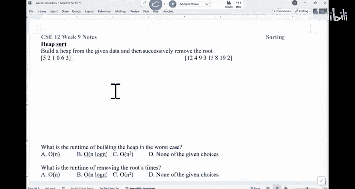

Work on the average case。 You have time。Now， the second sort algorithm we look at is He sort， right。

 Heap sort is basically build he out of the data。 and then you successfully remove the root。

 That's what he sort does。嗯。Let's see。Can I ask you all to either， you can pick either one of them。

 right， So either this side or this side， can you build a hip out of them using Hpify。

 not successive insertion， Hpify the array， like what you did in our P A。That's hip5。 right。

 So can you build hip out of them and then remove the root， remove the root n times。

I'll give you some time。Let's do it quickly。

Just pick one of them。 here。 don't have to do both and give me a vote once you are done with the。

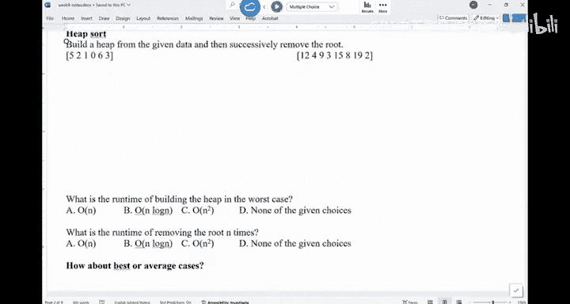

To practice， okay。

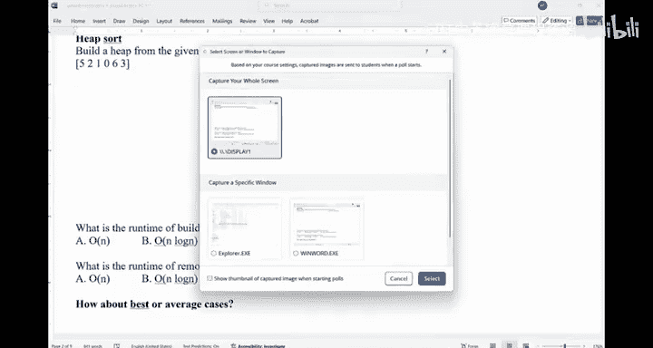

are done with one of them。 Heified。 Succs will remove the root。Right， remember。

 every time you remove the root， the。The heap structure will be changed。you folks。

 I under 30 seconds。 we're gonna。How to solve it。We' gonna draw the heap。

 We're just gonna manipulate the the。

Alright， so I'， I'll pick the， the， the second array in here， right。

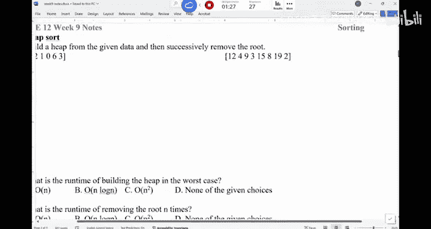

So we'll just use this one as the example。joy everything here。So， we have。嗯。Write it down first。

 So 12，4，9，3，15，8，19 and 2。So， making wine indexed。So n equals 8 n equals 8。

 The first step is to hepify。 What's the cost to H P array。People linear time， right， So it's。

 it's really quick to build keep out of this array。 You start from the parents。

 So the parent is at here。 Let's build I say， a me he about that。 So who are the children of this。

Noode4。How many insurance does it have。Just one child， right， which is 8。

 And since we are building a a mean hip。 So we're gonna do the swap。

And now this part is at the leaf level we have time。 Now， for， for this one。

 the two children is 6 and 7。 We need to do a swap。And this noise at the leaf level。 we stop。 Now。

 for this one， the two children is 2 and of15。 So need to do a swap。And this one is a leaf。 No。

 this one is not a leaf。This one still have a child， which is three， so。Sp。And this one。

 the two children these two。 So weve got to do a swap in here。And this one has a child of these two。

 So we have to do a swap again。This one has one child， which is that one。

 So we have to do a swap again。We are done。 That's the hip。 So we' are done with the H Pify process。

 You start from the lowest parent and then just Hpify from that parent。So this part is be。Now， we'。

 we， we' can't keep repeating the， the route。 We'll do it once。 So we'll remove the root， which is。

Willll take out of this too， and we'll put。12 in there。I will take out 12 in there， N- n is 7。

 And then you try to bring this down。 right， The two children 3 and 8。 You do a swap。And for。

 for this one， the two children is。These two。To a swap。

This one is now a leaf because now n equals to 7。 This is the leaf。 We are done。Are we good。So。

 and then you， you can't keep removing the route。 You repeat the process。

And that's how you do heap sort。 That's how you do heap sort。Any questions。So you。

 you never have to draw a tree。 It just a manipulation of this array。In the P， A。

 you have this sorting detective where you're gonna try to say， okay。

 what sorting algorithm would give you the behavior。 If you use hip sort。

 you can possibly see the behavior of。The first value is always the most extreme point。 right。

 That's， that's one of the common behaviors you see， okay。

 The first value of the Ds count kind of always the， the smallest or the largest， potentially。Now。

 can we ask folks， what is the runtime of beauty， Well， I think we， we already talked about this one。

 right， is big O N。 How about the runtime of removing the root n times。

 What would you say this part is。

Can you do a boat。What's the run time of remove removing the route n time。 You're gonna take out。

The root。Fix it。 triplele down， trickle down， and then。Do the same thing。Wass the runtime。

In the worst case scenario。

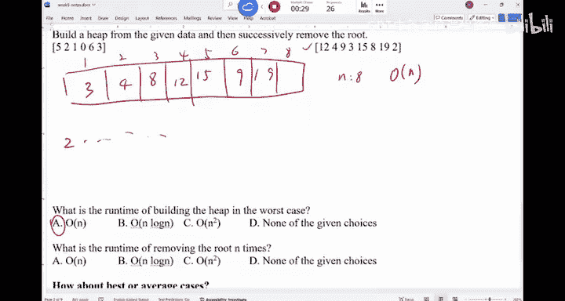

So， the。The answering here is。N log， right， so it's n log n because every time you trickle down。

 it's like you're gonna take about the log n runtime， right， the worst case， the first one removal。

 you have to trickle down from the very top to the very lowest level。

 And then how about the second time， the worst case is n -1， right log n -1。Plus， log and -2。啊，对。

 to log one。这是一口是吧。Log。Property of law。This equals what。Log n factor。

This is basically log in factorial。Log n factorial is big and login。And you should know that in fact。

 is very bad。 Its the worst。 But if you put a log in front of it becomes something really nice。 is。

 you can prove it iss no good。So the worst case is a loggan。 The best case， the average case。

 in fact， is also en logan。 So he sort is very simple。 It's， it's always an log。It's pretty nice。

Any questions about Heap sort。All right。So that's heap sword， no。

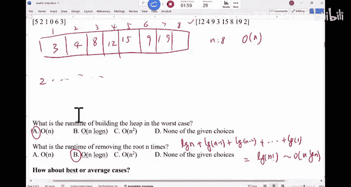

Those are kind of。Data structure， data structure related sorting algorithms。 Now。

 we are looking at the general sorting algorithms。 there is。

 we're gonna talk about bubble sort selection insertion。

 There are just different ways for you to sort based on different ideas， okay。

So the bubble sort idea is， I mean， this is probably as easy as， as you can remember。

 If you are being interviewed even， I need to sort something really quick。

That's basically what you need to do。 So what does bubble sort do。

 You just go through this array n times。 You just go through the array from the first one to the last one n times Every time if the neighbor is out of order。

 you swap them。That's it。 If you do this n times， you end up with a sorted array。Okay。

 so this pass is like n times， right。 Now， for index， that goes from 0 to n -1 pass。

 this is try to optimize a little bit。 You do not have to go through the very end every time you go through the array again and again。

 But if you go through the。All to the end is the same runtime。If the， if the index。

If this location is bigger than the location after it， you swap them。That's what you need to do。OK。

It's a very straightforward idea now。What does this one do if we think about if you keep swapping the neighbors。

 you just go through this story once if， if the neighbor is out of order。

 you're gonna swap them in the end， what's gonna happen。With this already。

If you realize this in your head。Just imagine you have this array。 You say。

 let me go through this array once where。Like， what are the interesting propertiess of this。

In the end， yeah。Right， the largest element will be bubbled down to the very end。 right。

 So basically， the idea is if you swap it once， the largest element would go to the very end。

 If you try again， the second largest element would go to the element right in front of the largest element。

Because， I mean， the last two， nothing is bigger than the last element at this moment。

 So no one would spark with it。So， it's like you send the largest element in the array to the to the end。

 You do this n times。 It's like you have， you have a hand of poker cards。 You just grab the largest。

 put it down， put it on。 And then in the end， that's what you have， so。

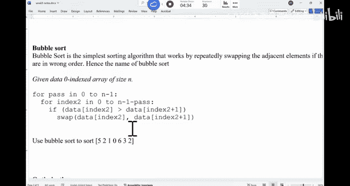

That's the idea。 Let， let's try to do it once， so。

嗯。If you do the first round。Right， round one。You would swap these two，2，5。Right。

 and now you have to swap these two， becomes 1，5。You have to swap this because they're out of order。

 No， it's 0。five。5 and the6。一个呢嗯。You're not gonna swap them， right， because five is not bigger than6。

Now，6 and 3， you have to swap them。And three two under6， you have to swap them。

And this is what you end up having。 This6 is at the very end。And then you do it once more。

 You do it once more。 You'll see5 would hit at the very end。 Let's try to round2。 Okay。

 so youll you have to swapb them。 So you have one，2。To0。I to swap them。0，2。

 And then this two would stop at this 5。And then 5，3。You swap them and then 2 and 5， youll swap them。

5 to 6， you don't swap。 So in the end， you end up with this。 And that's the behavior。Of bubble sort。

O。嗯。I'll do one more round。 Hopefully you can see some optimization effect。 now，0，1， swap them。

 and then  one，2， you don't swap。2，3， you don't swap 3，2， you have to swap。No，3，5，6 are there。

And in the next round， you have to go through it one more time。

 And youll see that there's nothing you have to swap。

If I go through the array once and I don't have to swap anything， what does that mean。

Nothing is out of order。Then the reed。So after R4。No swap。This means you are done。嗯，要到。

So all you need to do is to， to， do， to create a bulloleying。Buling， did you swap。

 This equals to false。And then if you swap， you set the swap to be true。Maybe I call it swapped。

 sorry。Swped to be true。And after this for loop， you say if。Notth swapped。等又要到。Right， so you break。

要的。So technically， you can try to optimize it just a tiny little bit if you， if you do the swapping。

 and， I mean， interestingly， this algorithm is very easy， but I mean， it can sort things reasonably。

 okay。看。So are there any questions。What bubblebble sort？What's going to be the behavior。If you sword。

 this array。You only have one array， right， So the data is starting to change in the array。

 What's the behavior， as you can imagine in the。In the P。The largest element is going to the end。

 right， It's like the largest thing is going to the end and。That's their behavior。啊。嗯。

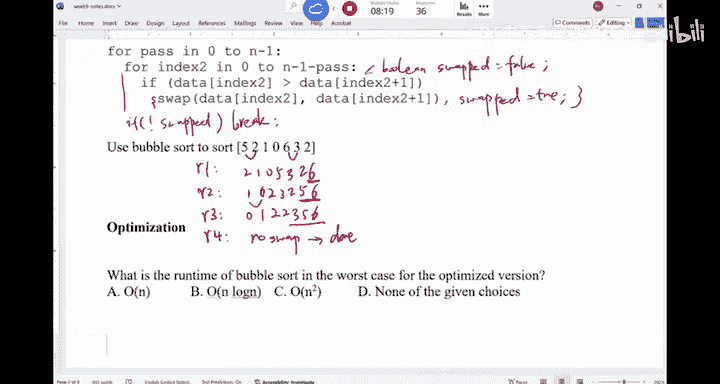

So let's look at the worst case runtime。 If we look at this one， even if I optimize it， Okay。

 what's the worst case runtime for bubble sort。

Worst case run time。Can you vote in。Wororst case run time。What's the worst case。32 of us voted in。

If you look at it， a lot of us thing is n square。When does the worst case happen？Okay。

 the worst case is inscribe。 When does it happen。Anywayone， when does the worst case happen。

It's reversely sorted。 So the largest is in the beginning。

 Every time you can only bubble things to the end。 Only one element would go to the end。

 No other positions。Would change， right。 And so in other words。

 you are not gonna be able to optimize anything。 So the whole thing is gonna run in square times。

 How about the best case。Was the best case。O， N， right， why， why is an not O one。我就 on。Right。

 you still have to go through the whole to check whether it's sorted or not。 right， So in here。

 you in the first round， you check， you go through this thing。You never have to swap anything。

 So you still have to S it run the inner loop once。So， that's be。But as you know。

 we don't care about the best case。 We don't care about it。 So the worst case is pretty bad N square。

 okay。N squared is way， way， way worse than n loggon。Right， if n is a million。

N square is about 10 to the power of 12。En log N is about。嗯。Tn to the power of what is log meaning。

 Lo meeting is like。Third，20。 So it's like。Tends to the power of， so。

Let me compare n squared with n log n。 Okay， if n is a million。

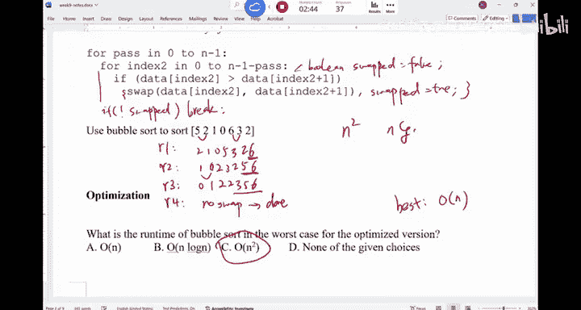

This thing is 10 to power of 12。 This thing is about 10 to the power of 7。Around that。

So in other words， it's like 100000 times faster if you have n log。说一次。W better。 way， way。

 way better。So definitely make sure that you。You understand the， the big difference in here。

The next thing is called selection sort。

Here's the idea。 You know， once， once you see the idea is， is， is very straightforward。 You， you。

 you have an array。 Again， you don't need any auxiliary array。

 just this array gonna manipulate things in this array。You。

 you try to kind of part this area into sorted part and unsorted part。

The sorted part is in the beginning， Unsorted part is in the end。

 Sometimes people say the sorted part is in the， in the beginning。 sorry。

 Unsorted is in the beginning。 sorted is in the end Either way， It's fine。 right。

 So the idea is the reason why it's called selection is you're gonna look into the unsorted part。

Find the smallest location。And then put this value that is the smallest into the very end of the sorted part。

That's all we need to do。So if you look at it in this example。

 we have a everything is unsorted in the beginning you scan through this thing。

 And then this two is the smallest。 Youll try to put it at the very end of the sorted part。

 The unsorted part has nothing。 So youll just basically swap this two with the first element of the unsorted part。

 So you put。12 in there， two in here。 And then you basically say now， this two is the sorted part。

 Everything after two is unsorted。 You repeat this process for the unsorted part again， again。

 and again。 as you can imagine the sorted part start to increase with the re size。

 the unsorted part start to decrease。 Once there is only one thing in the unsorted part。

 you are done。That's selections for。It's like you're looking for the smallest put put to the front。

 It's kind of the reverse thing of bubble sort。

Does this make sense。Can you apply this algorithm to sort this array just for once， you know， do it。

嗯。Just practice this a little bit。How would you。Use selection sort。Right。AndYou will see that。

The smallest state is going to the front if you see the behavior。O team once you are done。

 And so take your time， try to finish it up。O team， you are done with selection sort。

Try to use select insert。 I mean， you only have to do it once。In our final。

 I will never ask you to memorize these algorithms。 It's pointless。

It looks like we are stuck with three people。 looks it。There are too many people moving in。

I don't know whether it's the clicker。I just people didn't vote。Looks like it's a clicker。 Let's。

 let's try to work on this one。 Okay， a little bit。 We'll， we'll do it once， right。

 in the first round， this is the the sorted part。 This is unsorted。 The whole thing is unsorted。

 You find the smallest。

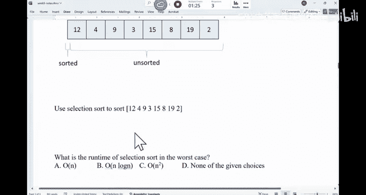

You swap with the first element of the unsortted part。That would basically so this is unsorted。

You will do a2， and then 4，9，3，15，8，1912。This is now sorted。 This is now unsorted。

You'll scan through this unsorted part， find the smallest element， which is this one。

 You'll swap with the first position。Of the unty part 2，3，9，4，15，8，1912。This is sorted。Unsortted。

And then you do it again， again， again， right， so。Youll see the behavior。Are we good。Alright。

 so what is the runtime of this algorithm in the worst case。Let's try。It looks like。

The balls are coming in this round。 That's good。Turn on my hotpot just in case it breaks down again。

What's the worst case runtime。Right， no need to discuss in here。

 like a majority of us saying is C N square。 as a bubble source selection sort that quadratic runtime。

Any questions about the election award。

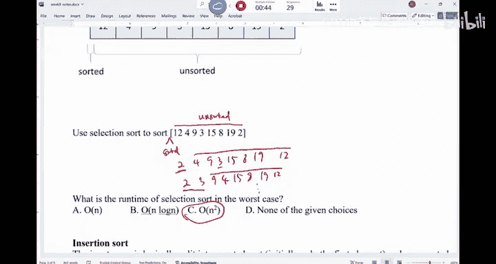

How about the last one insertion sort。

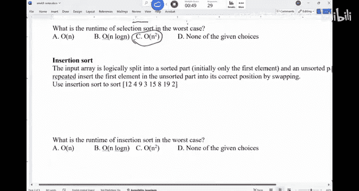

嗯。Inion sort follows the similar ideas。 selection sword。 you have this。

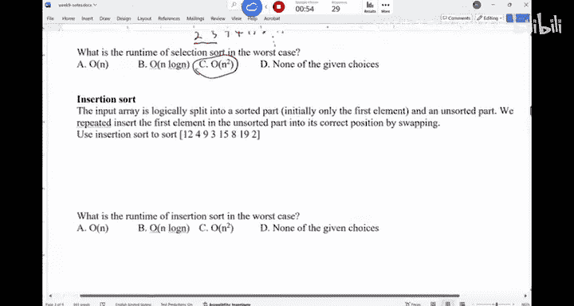

And the， the best way to explain this thing is like you have your， youre playing pokery。

 You're trying to get the cars and try to sort the cars in your hand。

 So the cars in your hand is the。Sorted part， the cars you are trying to grab is from this unsorted pile。

 That's what it does。 So you're gonna have cars in your hand。 And then the new card you get。

 youll try to put them into the right spot。That's how it goes。

So it's kind of slightly different from selection。 Selecteleion is youre gonna scan through。The pile。

 look for the smallest。 Put in your hand。 scan through the pile again。 Look for the next smallest。

 In here， you are starting to grab the cars as they are given to you。

 but you are sorting in your hand。That's what it does。 So the idea in here is you would start to say。

 I'm starting at 12。 And then I see a4。The new card you get， you will try to push it。

As to the front as much as you can until either it hits something smarter than it。

 or it's the very beginning of the array。That's what it does。 Okay， so initially， you say I a 12。

 This is the card in my hand。 And then I grab a4。A acquire4。 I mean， you。

 you want to put 4 in front of 12， right， And the way you're gonna do it is。

You're gonna try to bubble this thing to the front。 If they are out of order， you would swap them。

 So you would swap 4 with 12。 and then you are done because4 is now at the very beginning。

 And then you are dealt with a card of 9。 I need to move this 9 to the right spot。

 Youll keep swapping the neighbors to the front until they are either not out of order or you are at at the beginning of the array。

 So they are out of order。 So I swap them。 You end up with 9 and 12。And then youre。

 you're dealt with the three， the three， you keep sending to the front。

 You're gonna see that you're gonna keep swapping until it hits the very beginning。

And you are deal with 15。 There's nothing you need to do。And then。You have 8，8。

 You gonna swap until it hits here。That's when you stop。 And then similarly， you are given 19。

 And for this two， it will go to the very top。You just grab a card， put into the right spot。

That's what the selection sort， as our insertion sort does。Okay。

 so although you are bubbling is as if you are inserting this number into the right spot。

Any questions。The reason why you want to say bubble this number by swapping the neighbors is you can。

 you can scan the things in here and you find the spot you want to insert。

 You have to push these things towards the back， anyways。

So it's easier you just swap them until you hit the right spot。

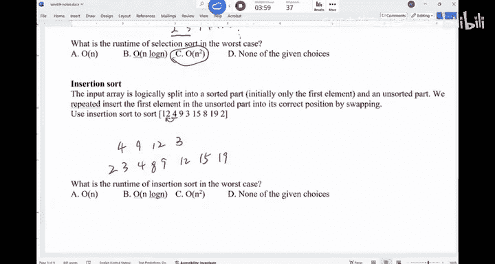

Are we good with insertion sort。

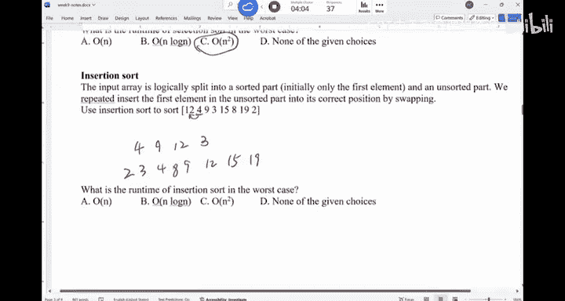

What do you think the runtime is for this idea。Can we have a vote on that。

What is the runtime of insertion sort。I think our votes are even better this round。

We're getting it right n square。 It's n square。That's the。Worst case of insertion， okay。

How about the best case。What do you think the best case of being certain sort is。deal with the card。

Was the best case。Big O N。 Do you agree。 You never have to swap their just given to you in the right order。

 Just put them to the end。 That's it。So the best case is n， but worst case is n square。

 And if you look at these sorting algorithms， right。

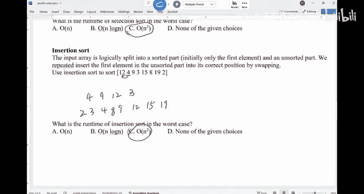

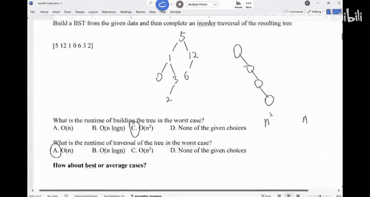

So if you look at bubble sort insert selection， their best cases like n。

 Well for selection sort is if you don't optimize it， iss around n square but to the worst case。

 This is what we really care about。RightThe worst case is n square。 averageage case is also n square。

So they are pretty bad sorting algorithms。 Okay， compared with heap sort， which is always a loggan。

 which is very nice。 T sort， on average， is also en login。 So definitely no， basically， the ideas。

 no one would use them。Bbble sort the insertions are selection sword。 No one would use them， unless。

You have to create your own sort algorithm， quick。As you I would peak bubblebo sort。Just memorize it。

 Okay， because some of my students， they were got the interview before they sorted。

 but they forgot how to use the sort function or they， they cannot Google at that moment。

 just create the sort function quickly。Just go through the early end times。

 swap the neighbors if they're out of order。So。That's a good thing。Now， we have about 20 minutes。

 I want to talk about quick sort and merge sort。

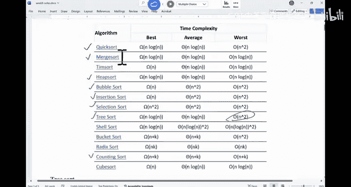

We' see how far we can go。 I will talk about the ideas。 Okay， some of the exercises。

 we may not have time to do it。 But here is the。

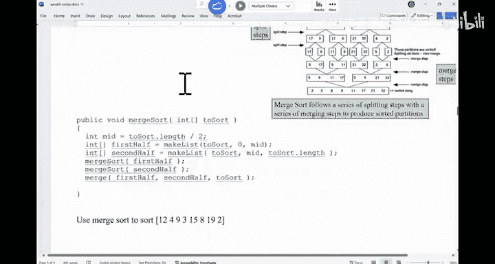

The idea of merge sort。You're given the array。re given the array。 So this is the array。

 That's the index。 What you try to do is merge sort and quick sort their recursive sorting algorithms。

 that are not like reative， like selection insertion and bubble。 They are using loops。 in here。

 you are recursively sorting the array。 you try to recursively sort the first half。

 recursively sort the second half。 and this kind of recursion continues until hit the base case。

 The base case is when the array only has0，1 element。 in general is one element。

 So if you have only one element， you are the recursion is done。

And then you will try to merge the sorted array， because when you have an array with only one element。

 the array is considered to be sorted。 In essence， you say when the array is already sorted。

 you stop。 you merge the two sorted array together。 So when you merge 8 of 17， you get 8，17。

 when you merge 9 with 11。 This is how you merge it。And then this is sorted。 This is sorted。

 You merge them。 And then in the end， you have this sorted array。Okay。So for this recursive approach。

 the。The cost， if you think about it。嗯。When you try to split。

 how many layers do I have when I try to split。What do you say， How many layers， yeah。loggan。

外er loggan。Right， basically， you are trying to say how many times do I have to split the array in half until I hit one。

 That's exactly log n。 right， So we say log n times sort loggan levels。Right。And now。

 merge them is also login levels。

The cost。As you can see， at this level， I need to merge these things together。

 How much does it cost me to merge。第一。The， the real issue with a merge sort is the cost to merge。

 And this part is something that we have to discuss a little bit， okay。

So this is the sorting algorithm。 This is the recursive sort。 Now， given this array。

 you want to sort it。 This is the merge sort。 You first find the mid point， which is half the length。

 And this part is you're gonna copy out from this two sort from0 to mid。

 copypy it to first half from mid to length。 second half we assume it doesn't include the right end。

 So0 to mid-1 is first half mid to length-1 is the second half。

 You recurse on the first half recur on the second half。

 And then you call the merge function to merge the first half with the second half and put it into two sort。

Okay， that's what we are doing。As you can see， this part would take。

About half of the length of the two sort。So you have to copy， right。

 copy from this array into a new array。 In other words， for merge sort， you need extra space。

For selection in certain bubble， you can just manipulate this array for， for merge sort。 Sorry。

 for he sort， you just manipulate this array。 Theres nothing you need to do。

Additional space is not required。But for merge sort， you have to have additional space。

 The cost of the additional space is about linear， you know。So。

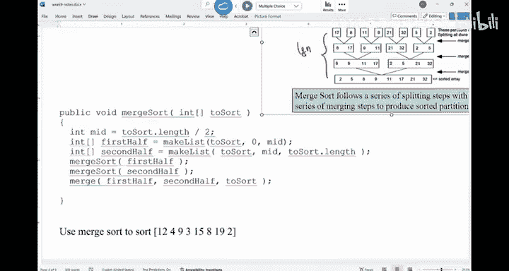

This merge sort， let me try to。Think about this， okay。嗯。So the。The first question， okay， before。

 before we， we do the demo is， would this method work， Will this idea work。

Will this me work？What do you say。In the current form， this recursion。 Will this recursion work。

Will this recursion work？What's missing。Bace case， right we don't have a base case in here。

 This one would continue forever。 So we need a base case， right， So if。

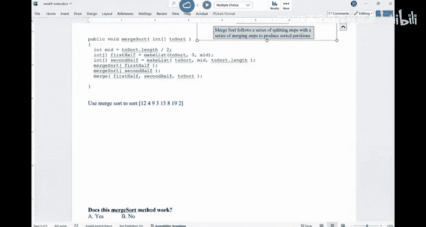

To sword。Dot length is the same as 0。哦，那谁意思意思。Less than or equal to one。 You return。Right， so。

So if this thing is too short， you'll return。And the reason why we don't need to return our array is because all the arrays in here are by reference。

Okay。So you don't forget the base case。

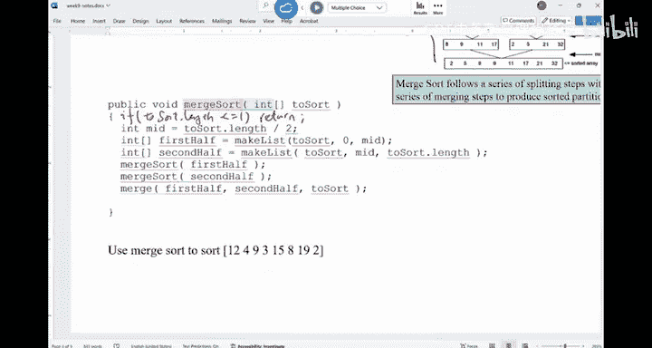

Now， let， let's try to。Use merge sort to sort this array。

So the first thing is you will split this into two arrays。 12，4，9，3，15，8，19，2。

 you will recursse on the left side and then recurse on the right side。 In other words。

 the way that the， the behavior of the merge sort is you。

 you probably have sorted the left side before you even start to take care of the right side。

 because that's how the recursion is taken care of。 So you would split this one into 12，4。 And then。

9，3。And nothing would happen on the right side at this moment。Okay。

 and then you're gonna recur again。Into 12 and 4。Now， you return。And then， you would split。嗯。And see。

 merge sort。 sorry， you would have to merge this side first before you even split it that。

 So you will start to merge them。 You have 4 and 12。 When you try to merge the two arrays。

 I will explain how you should merge them。Right， but you merge them。 Now， you have 4 or 12 in here。

 You're gonna have 3 and 9。You would merge， as sorry，9，3。

And they're going to merge them into 3 and 9。So。Then you will merge these two。

How should I merge to sorted array。What would do you do。You have one array that is sorted。

 You have another array that is sorted。 If they only have one element， that's easy。

 How about if there are multiple elements。Over do you do。有。Right， so you're gonna compare the。

 the first two elements of those two sorted array， which aren't smarter。 you copying in here。

 You move the corresponding pointer behind。And keep doing this until one of the arrays exhausted。

And then youll just copy in from the， the， the other array that is not exhausted into this whole array。

So the cost of merge is what。 You have two arrays。 The cost is what。

The sum of the length of these two are arrays， which is linear。 So when you have two sorted array。

 you say merge them into a sorted array， then the cost is linear。 So the cost in here is。

 for example， you have 4，12，3，9。 The way it works is。跟他。I in here。J in here。

 And then I have a four element array。K would be pointing in here。

You will compare the ice element with the J element， which are smarter。You would put it in here。

 and now K move forward。And Jay move forward。Right， you compare AI with like BJ。 Now。

 this one is smarter。 So put in four。And now， I would move back。K would move down。

You would now copy the smarter of these two， which is 9。Now， K is out bound。 K is done。Right， sorry。

 J is out bound J is done。 Now K is waiting for the remainder of the other array to be copied in。

那我要打。RightSo that's what you do in here。 So is you have basically two indexes that are walking on those two arrays until。

W raise is done。 Then you copy in the rest。Once you sort the first half。

 that's when you even get started with the second half。

嗯。So for this one， you split into 15，8，19 and 2。

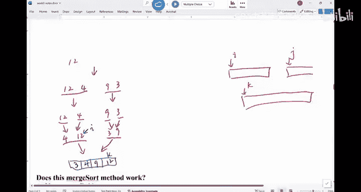

And then you will split it again。15，8 individual。And then you will merge them。 You get 8，15。

For this 19 and 2， gonna merge them into 2，19。Then you will merge them together into 2，8，15 and 19。

And then in the end， you would merge these two array。Into 2，3，4，8，9，12。1519。

That's how the merge sort would work。Does this make sense。嗯。

So let， let， let's， let's， let's write the merge function a little bit。

 I'll just write the the idea you're given array A。Arayby。And array。C。Right。

So you want to kind of merge A and B into C。You would assume the size of C is exactly the size of a plus B。

That's， that's what we have。 So you can say I equals to 0。 J equals to 0。 K equals to 0。

You can just do a while loop， right， while I is less than A dot length。

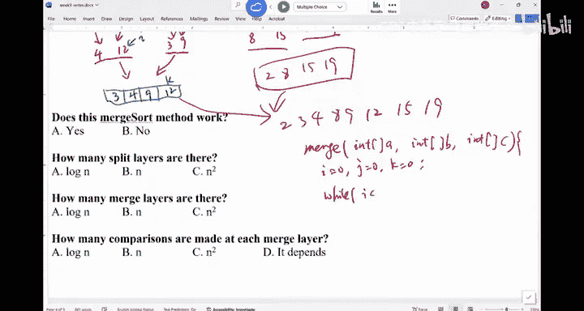

And J is less than B dot length。You can see啊 C。K plus plus。Equals to a。嗯。I is。Less than。

You know what， let us not go to crazy there。 If AI is less than B I。B，J， sorry。

 give the I element of A is less than the J element of B。Will do。C， K plus， plus。

Equals to AI plus plus。So we gonna copying AI into。C， K， and then increase both of the index by one。

else。UBCK plus plus。一co数BJ plus plus。And then how do I know which a array is now exhaust。

You can do the comparison， right You can do the comparison， but you can just have two wall loop。Well。

 I is less than a dot length。Sa C K plus plus equals to AI plus plus if a is already out bound。

 then you not to worry about this。 This while loop would not run similarly， well。

J is less thanB dot length。CK plus plus。Eals B， I plus plus B，J plus plus。And that's it。

So this merge part， you just need to go through the array。A and B， once。So， that's a。

linear time cost。The linear time cost。Does this make sense。So if you think about the mergech sort。

This part is proportional to the number of things you want to merge， so。

Each merge would take linear because you have to merge these things into them。

 So you have n log for the merge part， because they are n。Logan levels。

 and each layer is an on the top， you do have to copy， right， Copy the first half into array。

 copy the second half into a array is also an。 So it's basically two n log， roughly speaking。

So the runtime of merge sort is。A loggan， a logan。 That's the merge sword， okay。嗯。

How about the best case。What's the best case for merge sort？Do I still have to copy。

You have the copy。Will emerge。The best case is， like。You don't have to。嗯。What is even the best case。

 I think the best case is still linear， right？ So you have to go through two arrays anyways。

 even though they are in order。So I would say the overall cost of。Merge stored。 Let's， let's go。

 go back to here。

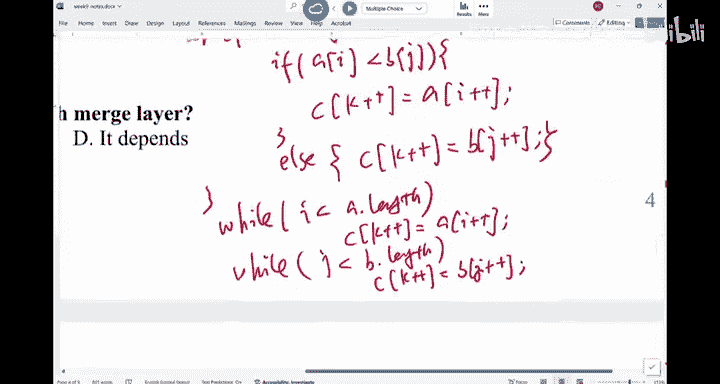

So the overall cost is。嗯，log嗯。Whether you are looking at the best case or worst case。

 there is no difference。

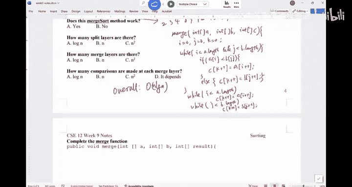

Unfortunately， we run out of time for quick sort， okay。

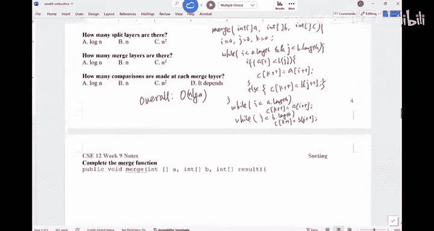

嗯。So you have to basically do the quick sort by yourself， do the reading。

 and you probably can figure it out for the homework。 Okay。

 the idea of the quick sort is you're gonna partition the R into two parts instead of two halves。

That's what were gonna。 I guess we have to work on this on Monday。 then。 Okay， so we are done today。

 we are done today。Hi， happy thanks， E。 I'll see you on Monday。 I see you on Monday。

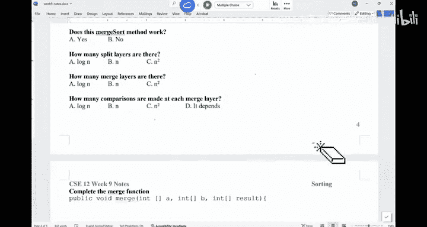

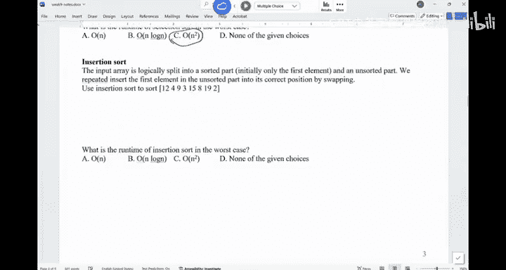

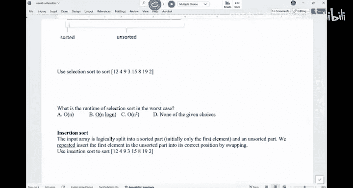

